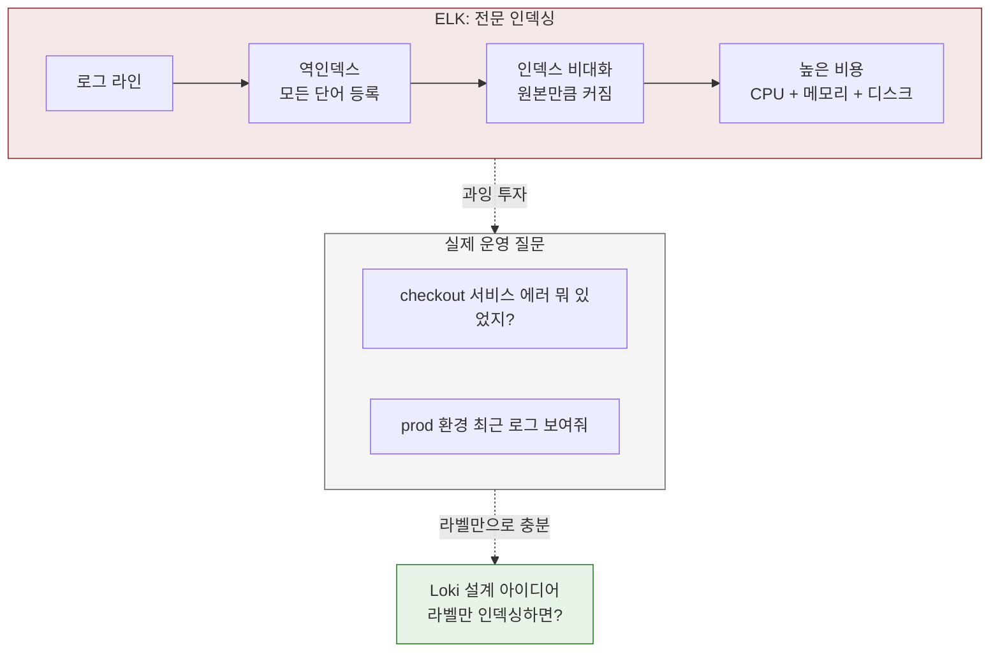
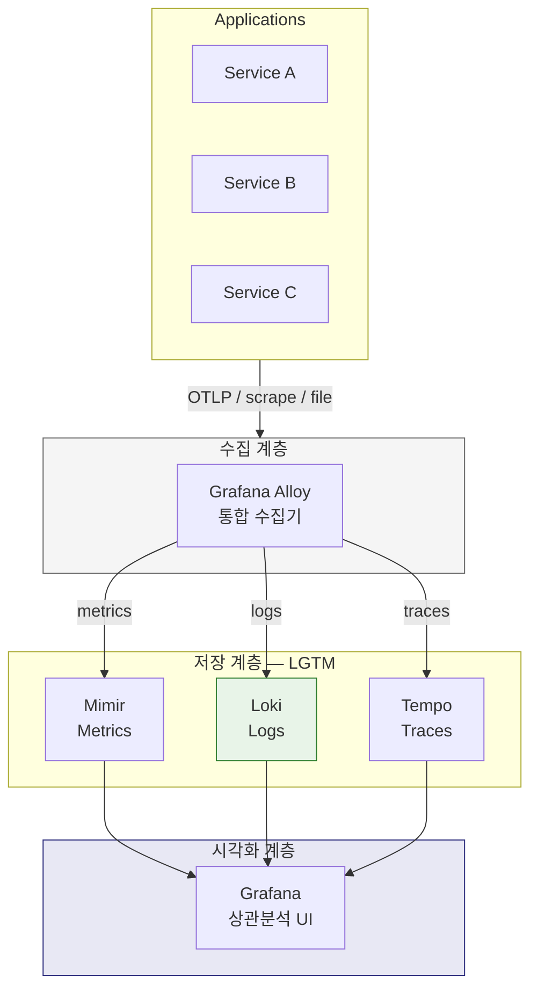
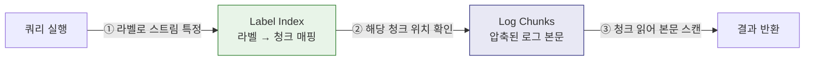
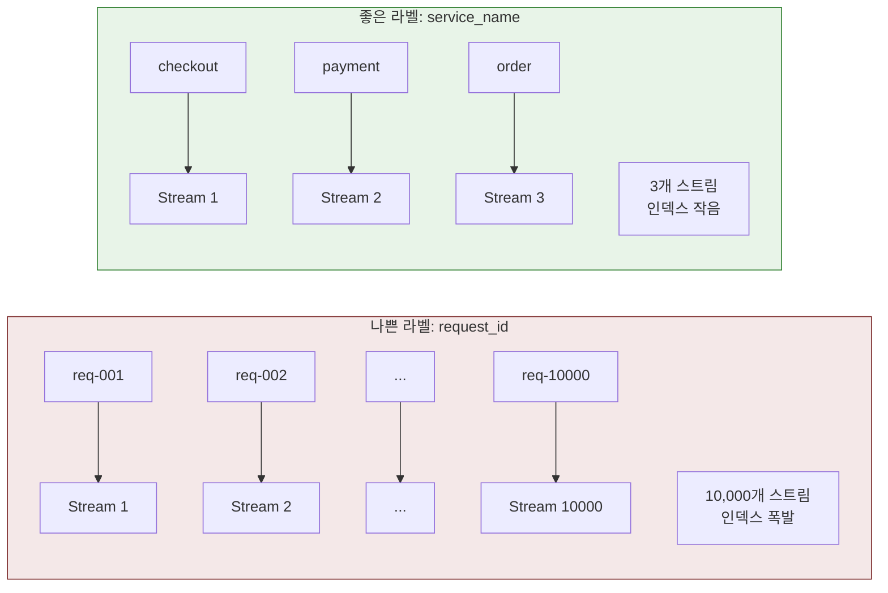
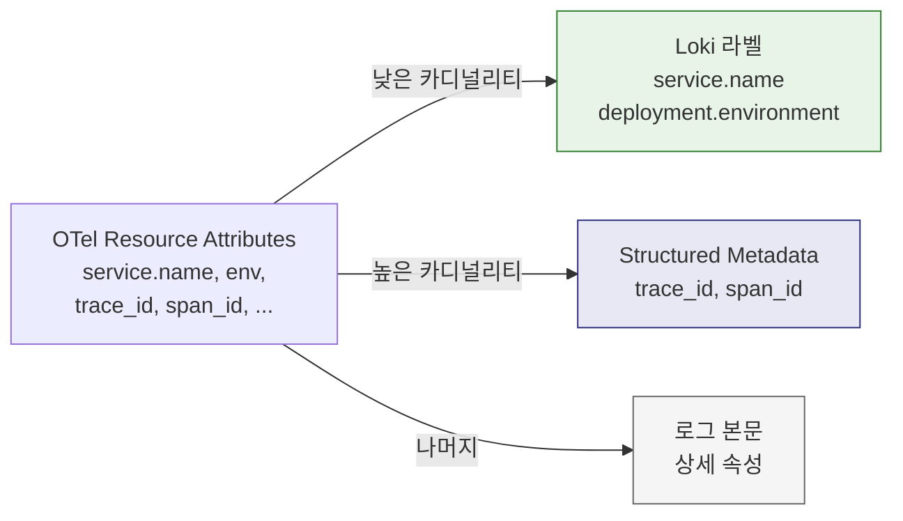

# Grafana Loki

---

> Grafana Loki는 **라벨 기반 인덱싱을 사용하는 로그 저장소**다.
>
> "로그는 많이 저장하되, 인덱스는 최소한으로 유지한다." 이 구조 덕분에 Loki는 로그 저장 비용을 낮추는 데 강하다.
> 하지만 Elasticsearch처럼 로그 본문 전체를 자유롭게 검색하는 데는 한계가 있다.



- Elasticsearch가 "모든 단어를 인덱싱해서 무엇이든 검색 가능하게"라는 철학이라면, Loki는 "메타데이터만 인덱싱하고 로그 본문은 압축 저장만 한다"는 철학이다. 이 접근은 Prometheus의 시계열 라벨 모델에서 직접 영감을 받았다.
- Prometheus가 메트릭을 `{job="api", instance="10.0.0.1"}` 같은 라벨로 구분하듯, Loki도 로그를 `{service_name="checkout", level="error"}` 같은 라벨로 구분한다.


## LGTM 아키텍처에서 Loki의 위치



- **Loki**: 해당 시간대의 에러 로그를 조회한다 — "checkout 서비스에서 payment timeout 다수 발생"
- **Loki**는 "무슨 일이 있었는가?"를 빠르게 좁히는 출발점 역할을 한다. 메트릭이 "어딘가 이상하다"를 알려주고, 트레이스가 "정확히 어디서"를 보여주는 구조다. 3가지 신호가 `trace_id`로 연결되지 않으면 각각을 따로 봐야 하므로 장애 분석 시간이 길어진다.


## 내부 구조(라벨, 스트림, 청크)

### 라벨(Label)과 스트림(Stream)

라벨은 로그 스트림을 구분하는 키-값 메타데이터다. 동일한 라벨 조합을 가진 로그 라인들이 하나의 스트림을 형성한다.

```bash
# 이 두 로그는 같은 스트림에 속한다
{service_name="checkout", env="prod", level="error"} 2026-03-13T10:00:01 connection timeout
{service_name="checkout", env="prod", level="error"} 2026-03-13T10:00:02 retry failed
```

### 청크(Chunk)

실제 로그 데이터는 청크 단위로 압축 저장된다. 하나의 스트림에 속한 로그 라인들이 시간순으로 청크에 쌓이고, 청크가 일정 크기에 도달하면 객체 스토리지(S3, GCS 등)나 파일시스템에 플러시된다.

### 인덱스

인덱스에는 "**어떤 라벨 조합이 어떤 청크를 가리키는가?**"만 저장된다. 로그 본문의 단어는 인덱스에 들어가지 않는다. 그래서 인덱스가 작고, 저장 비용이 낮다.



Loki를 운영할 때 가장 망가지는 지점은 고카디널리티 라벨이다. 예를 들어 다음 값을 라벨로 넣으면 위험하다:

- `request_id`
- `user_id`
- `session_id`
- `trace_id`

이 값들은 거의 로그마다 달라지므로, 스트림 수가 폭발하고 인덱스 비용이 급격하게 올라간다. 좋은 라벨은 카디널리티가 낮은 것이 좋다:

- `service_name`
- `namespace`
- `deployment_environment`
- `level`


## 라벨 전략(Loki 운영의 핵심)

> Loki를 운영할 때 가장 자주 문제가 되는 지점은 고카디널리티 라벨이다. 라벨 조합마다 별도의 스트림이 생성되므로, 라벨 값이 많아지면 스트림 수가 폭발적으로 증가한다.



### 라벨 선택 기준

라벨로 올려야 하는 값과 올리지 말아야 하는 값을 구분하는 기준은 **카디널리티**(고유 값의 수)와 **조회 패턴**이다.

| 구분          | 예시                                            | 이유                                              |
| ------------- | ----------------------------------------------- | ------------------------------------------------- |
| 라벨로 적합   | `service_name`, `namespace`, `env`, `level`     | 값의 종류가 수십 개 이내, 집계/필터링에 자주 사용 |
| 라벨로 부적합 | `request_id`, `user_id`, `trace_id`, `url_path` | 값이 거의 매번 달라짐, 스트림 폭발 유발           |

### OTel 로그와의 관계

OpenTelemetry로 로그를 수집하면 resource attributes에 `service.name`, `deployment.environment` 같은 값이 자동으로 붙는다. 이 중 어떤 속성을 Loki 라벨로 승격(promote)할지 결정하는 것이 OTel-Loki 연동의 핵심 설계 포인트다.



- **라벨로 승격**: `service.name`, `deployment.environment` — 조회 축으로 항상 사용
- **Structured Metadata**: `trace_id`, `span_id` — 건별 추적에 필요하지만 카디널리티가 높음


## LogQL(로그 조회와 파생 메트릭)

> Loki는 LogQL이라는 쿼리 언어로 로그를 조회한다. PromQL의 문법 감각을 로그 영역에 가져온 것으로, 두 부분으로 구성된다.

### Stream Selector + Pipeline

```bash
{service_name="checkout", level="error"} |= "timeout"
```

- `{service_name="checkout", level="error"}`: 라벨로 스트림을 선택한다 (Stream Selector)
- `|= "timeout"`: 본문에서 "timeout"이 포함된 라인만 필터링한다 (Pipeline)

Stream Selector가 먼저 인덱스를 타고 대상 청크를 좁힌 뒤, Pipeline이 청크 안에서 본문을 스캔한다. 그래서 Stream Selector가 넓으면(라벨을 적게 지정하면) 스캔할 청크가 많아져서 느려지고, 좁으면 빠르다. 이 동작 방식을 이해하면 "왜 라벨 설계가 쿼리 성능을 결정하는가"가 자연스럽게 연결된다.

### Pipeline 연산자

| 연산자           | 역할             | 예시                                         |
| ---------------- | ---------------- | -------------------------------------------- |
| `\|=`             | 문자열 포함      | `\|= "error"`                                 |
| `!=`             | 문자열 제외      | `!= "healthcheck"`                           |
| `\|~`             | 정규식 매칭      | `\|~ "status=[45]\\d{2}"`                     |
| `\| json`         | JSON 파싱        | `\| json \| level="error"`                     |
| `\| logfmt`       | logfmt 파싱      | `\| logfmt \| duration > 1s`                   |
| `\| line_format`  | 출력 포맷 변경   | `\| line_format "{{.method}} {{.status}}"`    |
| `\| label_format` | 라벨 값 변환     | `\| label_format level=\`{{ToUpper .level}}\`` |
| `\| unpack`       | packed JSON 추출 | `\| unpack`                                   |

### 실무 쿼리 예제

**기본 필터링 - 특정 서비스의 에러 로그 조회**

```bash
# checkout 서비스에서 error 레벨 로그 중 "timeout" 포함 라인
{service_name="checkout", level="error"} |= "timeout"

# healthcheck 요청은 제외하고 error 로그만
{namespace="prod"} |= "error" != "healthcheck" != "readiness"

# 정규식으로 4xx/5xx 상태 코드 필터링
{service_name="api-gateway"} |~ "status=(4|5)\\d{2}"
```

**JSON 로그 파싱 - 구조화된 로그에서 필드 추출**

```bash
# JSON 로그에서 status 필드가 500인 라인만
{service_name="order-api"}
  | json
  | status = 500

# 특정 JSON 필드만 추출해서 파싱 (성능 최적화)
{service_name="order-api"}
  | json status="status", method="method", path="path"
  | status >= 400

# 중첩 JSON에서 깊은 필드 접근
# 로그: {"request": {"user_id": "u-123", "action": "purchase"}}
{service_name="checkout"}
  | json
  | request_action="purchase"
```


## Loki 3.6 업데이트 (2026년 3월)

v3.6.7 기준(2026-02-23 릴리스)의 주요 변경 사항이다.

- **Native OTLP 로그 수집 지원**: OTel SDK에서 Alloy 없이 직접 Loki로 전송할 수 있다. 수집 파이프라인을 단순화하고 싶을 때 유효한 옵션이다.
- **Structured Metadata 안정화**: 고카디널리티 필드(`trace_id`, `span_id`)를 라벨 없이 저장하고 필터링하는 기능이 안정 버전으로 승격되었다. 라벨 폭발 없이 트레이스 연결이 가능해진다.
- **Helm 차트 커뮤니티 이관**: 2026-03-16부터 `grafana-community/helm-charts`로 포크되었다. 기존 차트도 계속 동작하므로 즉시 마이그레이션이 필요하지는 않다.
- **Compactor 수평 확장**: 대규모 삭제 요청을 효율적으로 처리할 수 있도록 Compactor가 수평 확장을 지원한다.


## 배포 모드 비교

세 가지 배포 모드가 있으며 환경에 따라 선택한다:

| 모드 | 구성 | 적합한 환경 | 상태 |
|------|------|------------|------|
| Monolithic | 단일 Pod에 모든 컴포넌트 | 개발/테스트, 소규모 | 활성 |
| Simple Scalable (SSD) | Read/Write/Backend 3계층 | 중규모 | 폐기 예정 |
| Microservices | 컴포넌트별 독립 Deployment | 프로덕션, 고가용성 | 권장 |

Monolithic는 학습과 개발 환경에 적합하다. 단일 Pod로 모든 기능을 실행하므로 설정이 단순하다.

Simple Scalable(SSD) 모드는 폐기 예정이므로 신규 환경에서는 선택하지 않는 것이 좋다.

Microservices 모드는 Ingester, Distributor, Querier, Compactor 등을 개별 Deployment로 분리하여 독립적으로 스케일링할 수 있다.


## K8s Helm 배포

### Monolithic 모드 설치 (학습/개발)

단일 Pod에 모든 컴포넌트를 올리는 방식으로, 학습과 개발 환경에 적합하다:

```bash
helm repo add grafana https://grafana.github.io/helm-charts
helm install loki grafana/loki -n monitoring --create-namespace \
  --set deploymentMode=SingleBinary \
  --set singleBinary.replicas=1 \
  --set loki.commonConfig.replication_factor=1 \
  --set loki.storage.type=filesystem
```

### Microservices 모드 설치 (프로덕션)

컴포넌트를 개별 Deployment로 분리하는 방식으로, 독립적인 스케일링이 가능하다:

```bash
helm install loki grafana/loki-distributed -n monitoring --create-namespace
```

### 주요 values.yaml (Monolithic + MinIO 예시)

로컬 MinIO를 Object Storage로 사용하는 개발 환경 설정 예시다:

```yaml
loki:
  auth_enabled: false
  commonConfig:
    replication_factor: 1
  storage:
    type: s3
    s3:
      endpoint: minio.monitoring.svc:9000
      bucketnames: loki-chunks
      access_key_id: minioadmin
      secret_access_key: minioadmin
      insecure: true
      s3ForcePathStyle: true
  schemaConfig:
    configs:
      - from: "2024-01-01"
        store: tsdb
        object_store: s3
        schema: v13
        index:
          prefix: loki_index_
          period: 24h
  limits_config:
    retention_period: 168h  # 7일
deploymentMode: SingleBinary
singleBinary:
  replicas: 1
gateway:
  enabled: false
```

### 배포 검증

Loki가 정상적으로 기동했는지 확인하는 방법이다:

```bash
kubectl port-forward svc/loki 3100:3100 -n monitoring
curl http://localhost:3100/ready
# 응답: ready
```

`ready` 응답이 오면 Loki가 정상 기동된 것이다. Grafana에서 DataSource로 `http://loki:3100`을 추가하면 LogQL 조회가 가능하다.

### 주의사항

Helm 차트로 배포할 때 자주 만나는 문제들이다:

- `auth_enabled: true`(기본값)이면 `X-Scope-OrgID` 헤더가 없는 요청은 `no org id`로 거부된다. 단일 테넌트 환경에서는 `false`로 설정한다.
- `replication_factor: 1`은 단일 인스턴스 전용이다. Ingester가 2개 이상이면 최소 2로 높여야 한다.
- Object Storage를 파일시스템으로 설정하면 PVC가 필요하다. PVC가 없으면 Pod 재시작 시 로그가 사라진다.


## Docker 참고

컨테이너로 빠르게 Loki를 띄울 때는 다음 명령을 사용한다:

```bash
docker run -v ./loki-config.yaml:/etc/loki/local-config.yaml \
  -p 3100:3100 \
  grafana/loki -config.file=/etc/loki/local-config.yaml
```

K8s Helm 배포와의 주요 차이점이다:

- 로컬 파일시스템에 저장하므로 컨테이너 재시작 시 로그가 사라질 수 있다
- 단일 인스턴스만 가능하고 수평 확장이 없다
- Object Storage 없이 동작하므로 설정이 단순하다

Docker Compose 환경은 `01-1. 모니터링.md`를 참조한다.
