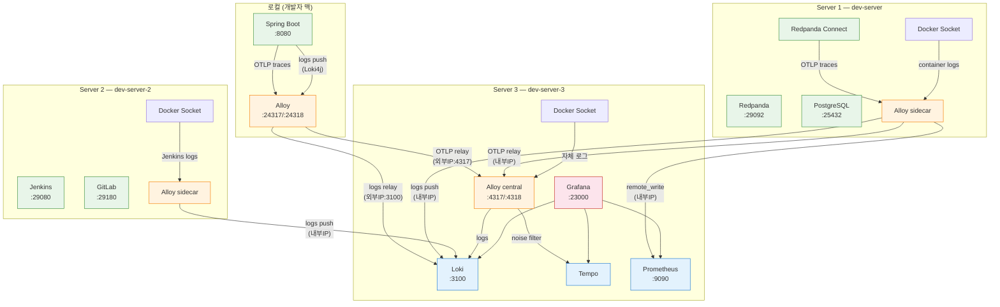

# 실제 계측 흐름

---

> redpanda-playground 프로젝트의 실제 구성을 따라가면서 앞에서 다룬 개념들이 코드에서 어떻게 구현되는지 확인한다.



- 모든 텔레메트리 신호(로그, 트레이스, 메트릭)가 Alloy를 단일 수집 지점으로 거쳐 각 백엔드로 라우팅된다.
- `docker/deploy/local/`의 Alloy가 실행되어 Spring Boot OTLP 트레이스를 수신한 뒤 Server 3 central로 릴레이한다. 
- 각 GCP 서버에는 Alloy sidecar가 Docker 소켓으로 로컬 로그를 수집하고, Server 3의 central Alloy가 모든 OTLP 트레이스를 수신하여 노이즈 필터링을 한 곳에서 처리한다. 필터 규칙 변경 시 Server 3 Alloy만 재시작하면 된다.

## 데이터 흐름

|                 | Server 1 sidecar              | Server 2 sidecar      | Server 3 central                |
| --------------- | ----------------------------- | --------------------- | ------------------------------- |
| 로그 수집       | Redpanda, Connect, PostgreSQL | Jenkins (GitLab drop) | Loki, Tempo, Grafana 등 자체    |
| OTLP 수신       | Connect tracer → relay        | —                     | 전체 수신 + 노이즈 필터 → Tempo |
| 메트릭 스크래핑 | Redpanda, Connect ×2          | —                     | —                               |
| 전송 대상       | Server 3 (내부IP)             | Server 3 (내부IP)     | 로컬 Loki/Tempo                 |

### 로그 (Docker → Alloy → Loki)

**Server 1**

 Redpanda, Connect, PostgreSQL 로그를 수집한다. Alloy sidecar가 Docker 소켓으로 `playground-*` 컨테이너의 stdout을 읽고, Java 멀티라인 스택트레이스를 조인한 뒤, 로그 본문에서 `traceId=xxx` 패턴을 정규식으로 추출하여 Loki Structured Metadata에 저장한다. 처리된 로그는 VPC 내부 IP로 Server 3 Loki에 push한다.

```
Docker Socket → discovery.docker → discovery.relabel(playground-* keep)
  → loki.source.docker → loki.process "multiline"(스택트레이스 조인)
  → loki.process "extract_trace"(traceId → Structured Metadata)
  → loki.write → Server 3 Loki (10.178.0.4:3100)
```

**Server 2** 

Jenkins 컨테이너만 수집한다. GitLab은 로그량이 과도하여(~1MB/s) Loki 인제스트 제한을 초과하므로 relabel에서 drop한다. Jenkins는 Java 기반이므로 멀티라인 조인을 적용하지만, trace_id 추출은 하지 않는다(Jenkins는 OTel 미지원).

```
Docker Socket → discovery.relabel(jenkins keep, gitlab drop)
  → loki.source.docker → loki.process "multiline"
  → loki.write → Server 3 Loki (10.178.0.4:3100)
```

**Server 3** 

 모니터링 컴포넌트(Loki, Tempo, Grafana 등) 자체의 로그를 수집한다. Server 1과 동일한 파이프라인이지만 전송 대상이 같은 Docker 네트워크의 Loki(`loki:3100`)다.

```
Docker Socket → discovery.relabel(playground-* keep)
  → loki.source.docker → loki.process "multiline"
  → loki.process "extract_trace"
  → loki.write → Loki (loki:3100, 같은 Docker 네트워크)
```

**로컬 Spring Boot** 

호스트에서 실행되므로 Docker 소켓으로 수집할 수 없다. Loki4j Logback Appender가 로컬 Alloy의 `loki.source.api` 엔드포인트(`localhost:23100`)로 push하면, Alloy가 Server 3 Loki로 전달한다.

```
Spring Boot (Loki4j) → localhost:23100 → Alloy loki.source.api
  → loki.write → Server 3 Loki (34.22.78.240:3100, allow-loki 방화벽)
```


### 트레이스(OTel → Alloy → Tempo)

OTel Java Agent와 Connect tracer가 OTLP 프로토콜로 트레이스를 전송한다. 모든 트레이스는 최종적으로 Server 3 central Alloy를 거치며, 이곳에서 노이즈 스팬을 필터링한 뒤 Tempo에 저장한다.

**Server 1 (Connect)** 

Connect의 `observability.yaml`에 설정된 `open_telemetry_collector` tracer가 메시지 처리 시 스팬을 생성한다. Server 1 Alloy sidecar가 OTLP로 수신한 뒤, 노이즈 필터 없이 Server 3 central Alloy로 릴레이한다. 필터링은 central에서 일괄 처리한다.

```
Connect tracer → Alloy sidecar (OTLP :4317)
  → otelcol.receiver.otlp → otelcol.exporter.otlphttp
  → Server 3 Alloy central (10.178.0.4:4318)
```

**로컬 Spring Boot** 

OTel Java Agent가 Spring MVC, Kafka Producer/Consumer, JDBC를 자동 계측한다. 트레이스는 로컬 Alloy의 OTLP 엔드포인트(`localhost:24317`)로 전송되고, Alloy가 Server 3 central로 릴레이한다.

```
Spring Boot (OTel Agent) → localhost:24317 → 로컬 Alloy
  → otelcol.exporter.otlphttp → Server 3 Alloy central (34.22.78.240:4317, allow-otel 방화벽)
```

**Server 3 (central)** 

모든 서버와 로컬에서 수신한 트레이스를 노이즈 필터링한 뒤 Tempo에 전달한다. 필터를 central 한 곳에만 두면 규칙 변경 시 Server 3만 재시작하면 된다.

```
otelcol.receiver.otlp (모든 소스 수신)
  → otelcol.processor.filter "noise" (outbox 폴링, DB 체크, actuator scrape 드롭)
  → otelcol.exporter.otlphttp → Tempo (tempo:4318, 같은 Docker 네트워크)
```

**Server 2** — 트레이스 수집 없음. Jenkins는 OTel/traceparent를 지원하지 않는다.


### 메트릭 (Alloy scrape → Prometheus remote_write)

Alloy가 15초 간격으로 4개 타겟을 스크래핑하고, `prometheus.remote_write`로 Prometheus에 전송한다. 

Prometheus의 `prometheus.yml`은 `scrape_configs: []`로 비어 있으며, `--web.enable-remote-write-receiver` 플래그로 Alloy의 remote_write를 수신한다.

| Alloy 컴포넌트                        | 타겟                                 | 메트릭 경로            |
| ------------------------------------- | ------------------------------------ | ---------------------- |
| `prometheus.scrape "spring_boot"`     | `host.docker.internal:8080` (로컬만) | `/actuator/prometheus` |
| `prometheus.scrape "redpanda"`        | `redpanda:9644`                      | `/metrics`             |
| `prometheus.scrape "connect_command"` | `connect:4195`                       | `/metrics`             |
| `prometheus.scrape "connect_webhook"` | `connect:4198`                       | `/metrics`             |


### 서버별 Alloy 역할

| 서비스     | 포트                    | 메모리 | 역할                                                 |
| ---------- | ----------------------- | ------ | ---------------------------------------------------- |
| Grafana    | `localhost:23000`       | 256MB  | 대시보드 UI, 로그/트레이스/메트릭 탐색               |
| Loki       | 내부 3100               | 256MB  | 로그 저장/쿼리 (LogQL), 3일 보존                     |
| Tempo      | 내부 3200               | 1GB    | 트레이스 저장/쿼리 (TraceQL), 3일 보존               |
| Alloy      | `localhost:24317-24318` | 192MB  | 단일 수집 지점: 로그 + OTLP 릴레이 + 메트릭 스크래핑 |
| Prometheus | `localhost:29090`       | 256MB  | 메트릭 저장(TSDB) + 쿼리(PromQL), 3일 보존           |


## Docker compose vs K8s 에서의 로그 수집

로컬(단일 호스트)과 GCP(3서버) 모두 Docker Compose로 Alloy를 실행하며, `/var/run/docker.sock`을 마운트하여 컨테이너 로그를 수집한다. 로컬은 Alloy 1개가 모든 역할을 겸하고, GCP는 서버당 Alloy 1개(sidecar 2 + central 1)를 배치한다. 

이 "호스트당 수집기 1개" 구조는 K8s DaemonSet 패턴과 동일한 개념이다. 차이는 로그 수집 소스뿐이다.

| 환경                          | 수집 소스                 | Alloy 배포                           | 설정                                    |
| ----------------------------- | ------------------------- | ------------------------------------ | --------------------------------------- |
| **로컬 Docker Compose**       | `/var/run/docker.sock`    | 1개 (모든 역할 겸용)                 | `loki.source.docker`                    |
| **GCP Docker Compose (현재)** | `/var/run/docker.sock`    | 서버당 1개 (sidecar ×2 + central ×1) | `loki.source.docker`                    |
| **K8s DaemonSet (이관 시)**   | `/var/log/pods/*/*/*.log` | 노드당 1개 (DaemonSet)               | `local.file_match` + `loki.source.file` |

- Docker 소켓 방식은 Docker 런타임에서만 동작한다. K8s는 1.24부터 dockershim을 제거했으므로 containerd가 직접 CRI 역할을 하며, 이 경우 `/var/run/docker.sock`이 존재하지 않거나 K8s Pod 로그를 포함하지 않는다. 
- 대신 K8s가 모든 Pod 로그를 `/var/log/pods/`에 파일로 노출하기 때문에 Alloy DaemonSet이 이 경로를 글로브 매칭으로 수집한다.

- 현재 GCP 클러스터(dev-server: containerd 2.2.2, worker: containerd 1.7.28)에서 미들웨어를 K8s로 이관한다면, Alloy를 `rp-mgm` 네임스페이스에 DaemonSet으로 배포하고 수집 소스만 파일 기반으로 변경하면 된다. "노드당 1개 수집기 → 중앙 백엔드 전송"이라는 구조 자체는 바뀌지 않는다.


