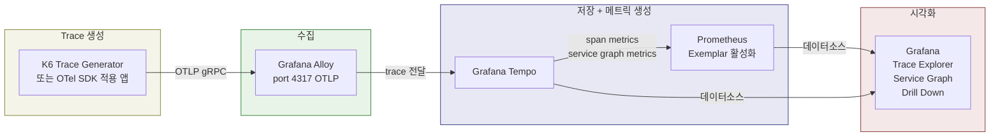
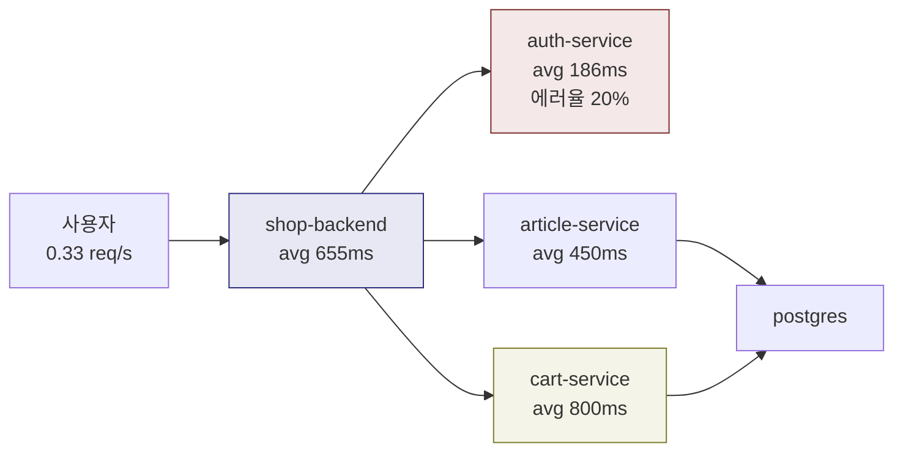
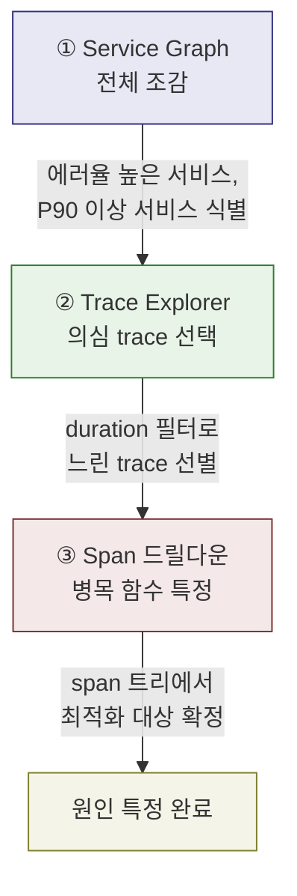
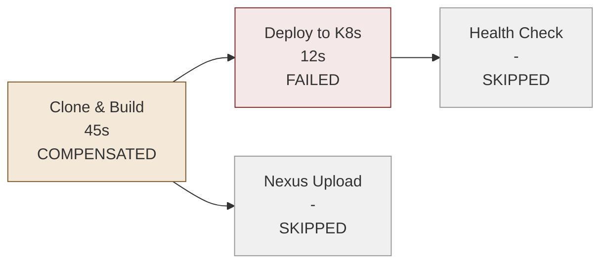

# Tempo 분산 트레이싱 시각화

---

> Tempo에 저장된 trace 데이터를 Grafana에서 시각화하고 성능 병목을 찾아내는 실전 분석 방법을 다룬다. Tempo의 개념과 내부 구조는 `02-04. Grafana Tempo.md`를 참조한다.

## 분산 트레이싱이 필요한 순간

마이크로서비스 아키텍처에서 하나의 요청은 수십 개 서비스를 거친다. 사용자가 주문 버튼을 눌렀는데 5초가 걸렸다고 가정하자. 메트릭은 "느려졌다"는 사실을 알려주고, 로그는 "timeout 에러가 발생했다"는 사건을 기록한다. 하지만 **어느 서비스의 어떤 연산이 병목인지**는 둘 다 답하지 못한다.

분산 트레이싱은 요청의 생애주기를 추적한다. 요청이 서비스 A에서 B로, B에서 C로 전파되는 과정에서 각 연산(span)의 소요 시간, 에러 여부, 메타데이터를 기록한다. 이 정보를 이어 붙이면 전체 요청 경로가 하나의 타임라인으로 재구성된다.

분산 트레이싱이 답하는 질문은 다음과 같다:

- 전체 요청 시간 중 어떤 서비스 호출이 가장 오래 걸렸는가
- 에러를 유발한 upstream 서비스는 어디인가
- 서비스 간 의존 관계는 어떤 구조인가
- 병렬로 실행되는 연산 중 전체를 지연시키는 것은 무엇인가

## K8s 트레이싱 스택 구성

Kubernetes 환경에서 분산 트레이싱을 구성하려면 네 가지 컴포넌트가 필요하다. trace를 생성하는 발신자, 수집하는 에이전트, 저장하는 백엔드, 시각화하는 프론트엔드가 그것이다.



### 각 컴포넌트의 역할

**Alloy**는 텔레메트리 수집 에이전트다. 애플리케이션이 OTLP 프로토콜로 보낸 trace를 port `4317`에서 수신하고 Tempo로 전달한다. Alloy에 대한 상세 내용은 `02-02. Grafana Alloy.md`를 참조한다.

**Tempo**는 trace 저장 백엔드다. 수신한 span을 trace 단위로 묶어 저장하면서 두 종류의 Prometheus 메트릭을 생성한다:

- **Service graph metrics**: 서비스 간 호출 관계, 요청률, 에러율, 응답 시간을 집계한다. 이 메트릭으로 서비스 의존성 그래프를 구성할 수 있다.
- **Span metrics**: 개별 span의 처리 시간을 집계한다. 전체 시스템에서 어떤 연산이 평균적으로 느린지 파악할 수 있다.

**Prometheus**는 Tempo가 생성한 메트릭을 저장한다. Exemplar storage를 활성화하면 메트릭 데이터 포인트에 `trace_id`가 연결되어, 메트릭에서 바로 해당 trace로 점프할 수 있다.

### Helm 배포 순서

모든 컴포넌트는 `monitoring` namespace에 배포한다:

```bash
# 1. namespace 생성
kubectl create namespace monitoring

# 2. Helm 리포지토리 추가
helm repo add grafana https://grafana.github.io/helm-charts
helm repo add prometheus-community https://prometheus-community.github.io/helm-charts
helm repo update

# 3. Tempo 배포
helm install tempo grafana/tempo \
  -n monitoring -f tempo-values.yaml --wait

# 4. Alloy 배포
helm install alloy grafana/alloy \
  -n monitoring -f alloy-values.yaml --wait

# 5. Prometheus + Grafana 배포 (kube-prometheus-stack)
helm install monitoring prometheus-community/kube-prometheus-stack \
  -n monitoring -f prometheus-values.yaml --wait

# 6. Trace 생성기 배포 (테스트용)
kubectl apply -f k6-trace-generator.yaml -n monitoring
```

배포 후 `kubectl get pods -n monitoring`으로 모든 Pod가 Running 상태인지 확인한다. Grafana에 접근하려면 포트 포워딩이 필요하다:

```bash
kubectl port-forward svc/monitoring-grafana -n monitoring 3000:80
```

## Trace Explorer로 병목 분석

Grafana의 Explore 메뉴에서 Tempo 데이터소스를 선택하고 Search 탭을 열면 trace 목록이 나타난다. 각 행은 하나의 trace(요청의 전체 여정)를 나타낸다.

### trace 목록에서 읽을 수 있는 정보

목록의 각 trace에는 세 가지 핵심 정보가 표시된다:

- **Initiating service**: 요청을 최초로 받은 서비스 (예: shop-backend)
- **Root span**: 최초 서비스에서 실행된 첫 번째 연산 (예: article-to-cart)
- **Duration**: 전체 요청의 총 소요 시간

대부분의 trace가 500~600ms인데 하나만 1초 이상이라면, 그 trace를 클릭해서 드릴다운한다.

### span 드릴다운 분석

trace를 클릭하면 span 타임라인이 펼쳐진다. 아래는 `article-to-cart` 요청(총 1.05초)의 분석 예시다:

```
shop-backend: article-to-cart (1.05s) ─── root span
├── article-service: get-article (450ms)
│   └── postgres: select-articles (200ms)
├── cart-service: place-articles (800ms)  ← 병목
│   └── cart-service: persist-cart (470ms)
└── auth-service: authenticate (70ms)
```

세 개의 자식 span이 **병렬로** 실행되지만, `place-articles`가 800ms로 가장 오래 걸려 전체 요청을 지연시킨다. 그 안의 `persist-cart` 연산(470ms)이 실제 병목이다. `authenticate`는 70ms로 문제가 없고, `get-article`도 450ms로 합리적인 수준이다.

이처럼 span 트리를 따라가면 "어떤 서비스의 어떤 함수를 최적화해야 하는가"라는 질문에 정확히 답할 수 있다.

### 필터링으로 범위 좁히기

trace가 수천 개일 때 전부 클릭해볼 수는 없다. Trace Explorer는 두 가지 필터를 제공한다:

- **Duration 필터**: `min duration > 1000ms`로 설정하면 1초 이상 걸린 trace만 표시된다. 느린 요청만 골라 분석할 수 있다.
- **Span name 필터**: 특정 연산 이름으로 필터링한다. 예를 들어 `article-to-cart`만 선택하면 해당 연산을 포함하는 trace만 보인다. 특정 연산이 전체 시스템에서 얼마나 자주 병목이 되는지 파악할 때 유용하다.

두 필터를 조합하면 "1초 이상 걸린 요청 중 cart-service를 거친 것"처럼 정밀한 탐색이 가능하다.

### 검색 결과의 비결정성

Tempo의 검색 결과는 **비결정적(non-deterministic)**이다. 동일한 조건으로 검색해도 매번 다른 trace가 반환될 수 있다. Tempo는 first match 기준으로 결과를 반환하기 때문이다. 최신 trace부터 확인하고 싶다면 API 호출 시 `most_recent=true` 파라미터를 추가하면 결정적(deterministic) 검색이 가능하다.

## TraceQL로 정밀 탐색

Trace Explorer의 UI 필터만으로 부족할 때 TraceQL을 사용한다. TraceQL의 문법 기초는 `02-04. Grafana Tempo.md`를 참조하고, 여기서는 실전에서 자주 쓰는 쿼리 패턴을 정리한다.

### 느린 요청 찾기

가장 기본적인 패턴은 duration 기반 필터링이다:

```traceql
# 1초 이상 걸린 모든 trace
{ duration > 1s }

# 특정 서비스에서 500ms 이상 걸린 연산
{ resource.service.name = "cart-service" && duration > 500ms }
```

### 에러 trace 검색

HTTP 에러 코드나 span 상태로 실패한 요청을 추적한다:

```traceql
# HTTP 500 이상 에러가 발생한 trace
{ span.http.status_code >= 500 }

# 특정 서비스에서 에러 상태인 span
{ resource.service.name = "auth-service" && status = error }
```

### 서비스 + 속성 조합

여러 조건을 조합하면 범위를 정밀하게 좁힐 수 있다:

```traceql
# checkout 서비스에서 PostgreSQL 쿼리가 200ms 이상 걸린 경우
{ resource.service.name = "checkout" && span.db.system = "postgresql" && duration > 200ms }

# 특정 HTTP 경로에서 느린 요청
{ span.http.route = "/api/orders" && duration > 2s }
```

TraceQL의 강점은 UI 필터로 표현하기 어려운 복합 조건을 한 줄로 작성할 수 있다는 점이다. Grafana Explore에서 TraceQL 탭을 선택하면 직접 쿼리를 입력할 수 있다.

## Service Graph로 전체 조감

Service Graph는 Tempo가 생성한 Prometheus 메트릭을 기반으로 서비스 간 의존 관계를 시각화한다. 개별 trace를 하나씩 분석하기 전에 **시스템 전체의 건강 상태를 한눈에 파악**하는 출발점이다.



### 그래프에서 읽을 수 있는 지표

각 서비스 노드에는 세 가지 핵심 지표가 표시된다:

- **요청률(Request rate)**: 초당 요청 수. shop-backend과 auth-service가 같은 요청률(0.33 req/s)이라면, 모든 요청이 인증을 거친다는 의미다.
- **에러율(Error rate)**: 실패한 요청의 비율. auth-service의 에러율이 20%라면 (0.08 errors/s out of 0.33 req/s) 인증 실패가 빈번하다는 뜻이다. 그래프에서 붉은색으로 표시되므로 시각적으로 즉시 파악할 수 있다.
- **P90 duration**: 90번째 백분위 응답 시간. auth-service의 평균이 186ms인데 P90이 490ms라면, 성공 요청은 빠르지만 실패 요청이 평균을 끌어올리고 있다는 뜻이다.

### 요청률로 의존 관계 추론하기

서비스 그래프에서 요청률의 차이는 시스템 동작을 추론하는 단서가 된다. shop-backend은 0.33 req/s인데 article-service는 0.26 req/s라면, 인증에 실패한 요청은 article-service까지 전파되지 않는다고 추론할 수 있다. 인증 실패 시 403을 반환하고 후속 처리를 중단하는 설계일 것이다.

### Exemplar: 메트릭에서 trace로 점프

Prometheus에 Exemplar storage를 활성화하면 메트릭 그래프 위에 작은 점(exemplar)이 표시된다. 이 점을 클릭하면 해당 메트릭 값을 발생시킨 실제 trace로 바로 이동할 수 있다.

이 기능이 강력한 이유는 분석 흐름이 자연스럽게 연결되기 때문이다. Service Graph에서 "auth-service P90이 490ms"라는 이상 징후를 발견하면, exemplar를 클릭해서 실제로 490ms가 걸린 trace를 열고, span 트리를 드릴다운하여 정확한 원인을 특정한다. 메트릭이 "어디를 봐야 하는가"를 알려주고, trace가 "정확히 무엇이 문제인가"를 보여주는 구조다.

## Traces Drill Down 플러그인

Grafana의 Traces Drill Down 플러그인(`/grafana/explorer/traces-app`)은 trace 데이터를 탐색하는 또 다른 방식을 제공한다. Trace Explorer가 개별 trace에 집중한다면, 이 플러그인은 **집계된 관점**에서 패턴을 찾는 데 유용하다.

### Root Span 분석

플러그인은 root span(요청의 진입점)부터 시작한다. 초당 root span 실행 횟수를 시계열 그래프로 보여주며, 트래픽 패턴의 변화를 시각적으로 파악할 수 있다. 서비스별로 그룹핑하면 어느 서비스가 가장 많은 요청을 받는지 한눈에 보인다.

### Duration 히스토그램

히트맵 형태의 히스토그램은 span 처리 시간의 분포를 보여준다. 색이 밝을수록 해당 시간대에 속하는 span이 많다는 뜻이다. 예를 들어 68ms 구간에 33개 span, 537ms 구간에 31개 span, 1.07s 구간에 28개 span이 분포한다면, 대부분의 연산은 빠르지만 일부가 1초 이상 걸린다는 패턴을 파악할 수 있다.

이 히스토그램은 "전체적으로 느린가, 아니면 특정 요청만 느린가"를 구분하는 데 효과적이다. 분포가 넓게 퍼져 있으면 일부 요청의 문제이고, 전체가 오른쪽으로 쏠려 있으면 시스템 전체의 문제다.

### Slow Traces 탭

가장 느린 trace를 내림차순으로 정렬한다. 상위 trace를 클릭하면 span 트리로 들어가 병목을 분석할 수 있다. Root Cause Latency 뷰는 느린 span들의 구조를 보여주어, Trace Explorer와 동일한 방식으로 원인을 추적할 수 있다.

## 실전 분석 워크플로우

성능 문제가 보고되었을 때, 세 단계로 원인을 좁혀 나간다:



### 1단계: Service Graph로 전체 조감

Service Graph를 열어 시스템 전체를 훑는다. 붉은색 노드(에러율 높음), 요청률 대비 응답 시간이 긴 노드를 찾는다. "어디를 파야 하는가"를 결정하는 단계다.

### 2단계: Trace Explorer로 의심 trace 선택

1단계에서 식별한 서비스를 필터로 걸고, duration 필터를 추가하여 느린 trace만 추린다. Exemplar가 있다면 메트릭 그래프에서 직접 trace로 점프할 수도 있다.

### 3단계: Span 드릴다운으로 병목 특정

선택한 trace의 span 트리를 펼쳐 어떤 연산이 가장 오래 걸렸는지 확인한다. 병렬 실행되는 span 중 전체를 지연시키는 것, 자식 span 중 부모 대비 비율이 높은 것을 찾는다. 최종적으로 "이 서비스의 이 함수를 최적화해야 한다"는 결론에 도달한다.

이 워크플로우의 핵심은 **넓은 시야에서 좁은 시야로** 좁혀 나간다는 점이다. 처음부터 개별 trace를 뒤지는 것은 건초 더미에서 바늘 찾기와 같다. Service Graph가 건초 더미의 위치를 알려주고, 필터링이 범위를 좁혀주고, span 드릴다운이 바늘을 집어낸다.

### 확장: Trace to Metrics와 Trace to Profiles

위 3단계 워크플로우는 메트릭→trace 방향이다. Grafana는 반대 방향도 지원한다:

- **Trace to Metrics**: span 속성(`$__tags`)을 메트릭 레이블로 변환하여, 특정 span에서 관련 메트릭 대시보드로 점프할 수 있다. "이 느린 span이 시스템 전체에서 얼마나 자주 발생하는가"를 확인할 때 유용하다.
- **Trace to Profiles**: Grafana Pyroscope 데이터소스가 연결되어 있으면, span에서 해당 시간대의 CPU/메모리 프로파일로 이동할 수 있다. span이 느린 이유가 코드 레벨에서 어디인지까지 추적 가능하다.

두 기능 모두 Tempo 데이터소스 설정에서 연결할 대상 데이터소스를 지정하면 활성화된다.

## Node Graph 패널: 트레이싱 너머의 시각화

지금까지 다룬 Service Graph는 Tempo가 생성한 메트릭으로 **서비스 간 호출 관계**를 보여준다. 하지만 Grafana의 Node Graph 패널은 Tempo 전용이 아니다. 범용 노드-엣지 시각화 패널이므로 커스텀 데이터를 연결하면 어떤 그래프 구조든 표현할 수 있다.

### Node Graph 패널의 데이터 구조

Node Graph 패널은 두 개의 데이터 프레임을 기대한다:

```json
{
  "nodes": [
    { "id": "step-1", "title": "Clone & Build", "mainStat": "45s", "color": "green" },
    { "id": "step-2", "title": "Deploy to K8s", "mainStat": "12s", "color": "red" },
    { "id": "step-3", "title": "Nexus Upload", "mainStat": "-", "color": "gray" }
  ],
  "edges": [
    { "id": "e1", "source": "step-1", "target": "step-2" },
    { "id": "e2", "source": "step-1", "target": "step-3" }
  ]
}
```

노드의 필수 필드는 `id`뿐이고, 엣지는 `id`, `source`, `target`이 필수다. 선택 필드로 `title`(라벨), `mainStat`(노드 안에 표시), `color`(상태 색상), `arc__*`(원형 비율 표시) 등을 사용할 수 있다. 최대 1,500개 노드까지 지원한다.

### 활용 예: 파이프라인 DAG의 실행/실패/보상 시각화

Service Graph가 마이크로서비스 토폴로지를 보여준다면, Node Graph는 **워크플로우 실행 상태**를 보여줄 수 있다. 예를 들어 SAGA 패턴의 파이프라인에서 각 스텝의 실행 상태를 노드 색상으로 표현하면 "어디서 실패했고 어디까지 롤백됐는지"가 한눈에 보인다.

스텝 상태와 노드 색상의 매핑 예시는 다음과 같다:

| 스텝 상태 | 노드 색상 | 의미 |
|-----------|-----------|------|
| PENDING | gray | 아직 실행되지 않음 |
| RUNNING | blue | 진행 중 |
| SUCCESS | green | 정상 완료 |
| FAILED | red | 실행 실패 (보상 트리거) |
| COMPENSATED | orange | 보상 완료 (부수 효과 롤백됨) |
| SKIPPED | lightgray | 선행 실패로 건너뜀 |



이 예시에서 Deploy 스텝이 실패하면, 이미 성공한 Clone & Build는 COMPENSATED(보상 완료)로 전이되고, 아직 실행되지 않은 Nexus Upload와 Health Check는 SKIPPED로 처리된다. 이 전체 흐름이 하나의 그래프에서 색상만으로 파악 가능하다.

### 데이터소스 연결 방식

커스텀 API에서 Node Graph를 그리려면 **Infinity 플러그인**을 사용한다. Infinity는 REST API를 호출하여 JSON 응답을 Grafana 데이터 프레임으로 변환하는 데이터소스다. API가 위의 nodes/edges 구조로 응답하면 Node Graph 패널이 바로 렌더링한다. Tempo의 Service Graph처럼 별도 메트릭 생성이 필요하지 않으므로 구성이 단순하다.
