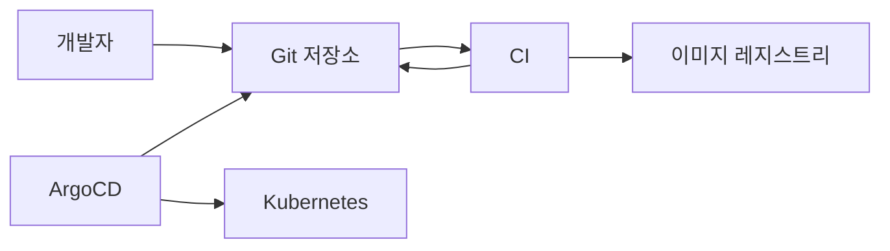
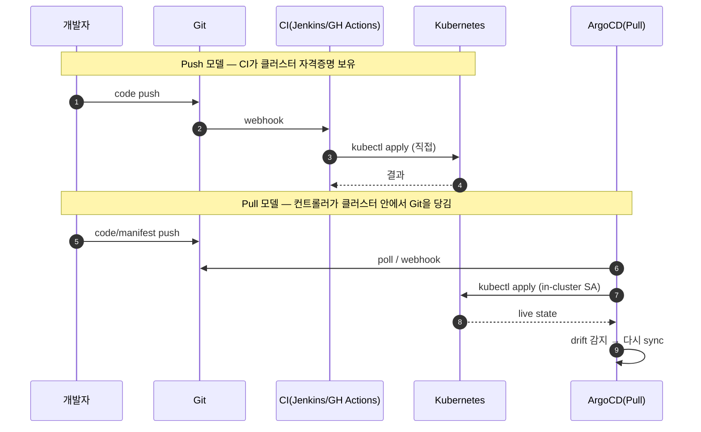

# ArgoCD와 GitOps 기초
---
> ArgoCD는 GitOps를 Kubernetes에서 구현하는 대표 도구다. 핵심은 CI가 클러스터에 직접 푸시하지 않고, 클러스터 안의 컨트롤러가 Git 상태를 끌어와 맞춘다는 점이다.

## 학습 목표
> ArgoCD를 설치하기 전에 왜 필요한지와 어떤 운영 모델을 택하는지 먼저 고정한다.

이 장에서 확인할 목표는 다음과 같다:

1. Push 기반 배포와 Pull 기반 GitOps의 차이를 설명할 수 있다.
2. ArgoCD가 해결하려는 drift, rollback, 감사 추적 문제를 설명할 수 있다.
3. Flux와 ArgoCD의 차이를 대략적인 운영 관점에서 비교할 수 있다.

## 1. 왜 GitOps가 필요한가
> CI가 직접 배포하는 구조는 편하지만 운영 경계가 흐려지기 쉽다.

Push 기반 배포에서는 Jenkins나 GitHub Actions 같은 외부 시스템이 클러스터 자격증명을 가지고 직접 `kubectl apply`를 실행한다. 이 구조는 빠르게 시작하기는 쉽지만, 누가 언제 무엇을 배포했는지 Git 히스토리만으로 설명하기 어렵다.

또한 누군가 클러스터에서 직접 리소스를 수정하면 Git과 실제 상태가 어긋난다. 이런 drift는 시간이 지나야 드러나고, 문제 발생 시 원인 추적이 복잡해진다.

## 2. ArgoCD의 운영 모델
> ArgoCD는 클러스터 내부에서 Git 상태를 지속적으로 당겨 와 맞춘다.

ArgoCD는 Kubernetes 안에 설치되는 GitOps 컨트롤러다. `Application` 리소스로 Git 저장소, 경로, 대상 클러스터와 네임스페이스를 선언하면, ArgoCD가 해당 원하는 상태를 계속 reconciliation 한다.

이 구조에서 CI는 이미지를 만들고 Git을 갱신하는 역할에 집중한다. 실제 배포 적용은 ArgoCD가 맡기 때문에 외부 CI에 클러스터 관리자 권한을 두지 않아도 된다.

## 3. ArgoCD가 해결하는 문제
> 단순 배포 자동화가 아니라 운영 기준 상태를 Git으로 통일하는 것이 핵심이다.

ArgoCD의 첫 번째 장점은 drift 감지다. Git과 클러스터 상태가 달라지면 `OutOfSync`로 바로 드러나므로 수동 변경을 장기간 방치하기 어렵다.

두 번째 장점은 롤백과 재해 복구다. Git 커밋이나 태그를 기준으로 되돌릴 수 있기 때문에 “어느 시점 상태로 복구해야 하는가”를 Git에서 직접 찾을 수 있다.

세 번째 장점은 감사 추적이다. 배포 기준이 Git 커밋으로 남으므로, 운영 변경 관리와 코드 리뷰 흐름이 자연스럽게 연결된다.

## 4. Flux와 비교할 때의 위치
> 둘 다 GitOps 도구지만 운영 경험은 꽤 다르다.

ArgoCD는 UI, CLI, 상태 시각화, App of Apps, ApplicationSet 같은 운영 편의가 강하다. 반면 Flux는 GitOps 자체를 더 작고 분리된 컨트롤러 조합으로 보는 경향이 강하다.

실무에서는 “운영자가 상태를 보고 판단하는 경험”이 중요하면 ArgoCD가 더 익숙하게 받아들여지는 경우가 많다. 특히 여러 팀이 같은 플랫폼을 쓸 때는 UI와 Project 경계가 장점으로 작용한다.

## 5. Mermaid로 보는 Push vs Pull
> 누가 클러스터 자격증명을 갖는지가 두 모델의 본질적인 차이다.

Pull 모델은 자격증명을 클러스터 안에 가두기 때문에 외부 CI 사고가 클러스터 권한 사고로 번지지 않는다. drift 감지도 자연히 따라온다 — 컨트롤러가 항상 Git과 live를 비교하고 있기 때문이다.

## 6. Flux vs ArgoCD — 운영 관점 비교
> 둘 다 Pull 모델이지만 운영 경험은 꽤 다르다.

| 항목 | ArgoCD | Flux |
|------|--------|------|
| UI | 1차 시민(상태 시각화·diff) | 별도(Weave GitOps 등) |
| App 단위 추적 | `Application` CRD | `Kustomization`/`HelmRelease` 분리 |
| 다수 앱 양산 | ApplicationSet | Notification Controller + 자체 generator 패턴 |
| 멀티클러스터 | Hub-spoke + cluster Secret | 클러스터별 Flux 분산 + GitOps Toolkit |
| 권한 모델 | AppProject + 자체 RBAC | K8s RBAC 위임 |
| 운영 진입점 | UI 보고 판단 | CLI/매니페스트 위주 |

조직이 “운영자가 상태를 시각적으로 보면서 판단”하는 흐름을 선호하면 ArgoCD가 익숙하게 받아들여지는 경우가 많다. 반대로 “모든 게 매니페스트, UI는 부가”인 팀에는 Flux가 자연스럽다.

## 다음 단계
> 이제 왜 필요한지 이해했다면, 어떤 컴포넌트로 설치되는지를 봐야 한다.

다음 장에서는 ArgoCD의 주요 컴포넌트와 설치 모드, HA 여부, ApplicationSet 번들 여부 같은 실제 아키텍처를 다룬다.

## 관련 문서
> 설치와 Application 기초로 이어지는 흐름을 함께 본다.

- [ArgoCD 설치와 아키텍처](./01-02.ArgoCD%20설치와%20아키텍처.md) — 다음 장
- [Application과 배포 대상 관리](./02-01.Application과%20배포%20대상%20관리.md) — 실제 배포 단위
- [ArgoCD와 GitOps](../kubernetes/07-03.ArgoCD와%20GitOps.md) — Kubernetes 카테고리의 요약 문서
