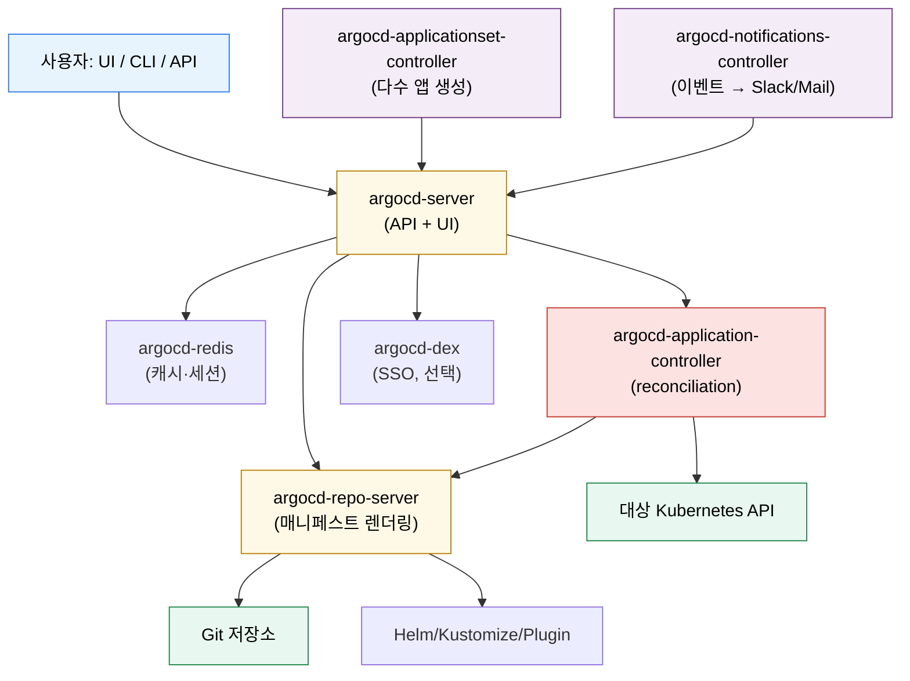

# ArgoCD 설치와 아키텍처
---
> ArgoCD는 여러 컨트롤러와 서버 컴포넌트의 조합으로 동작한다. 설치 전에 어떤 역할이 분리돼 있는지 이해해야 운영 포인트가 보인다.


## 학습 목표
> 컴포넌트 역할과 설치 모드를 함께 본다.

이 장에서 확인할 목표는 다음과 같다:

1. ArgoCD 주요 컴포넌트의 역할을 설명할 수 있다.
2. non-HA와 HA 설치의 차이를 이해할 수 있다.
3. 최신 기준으로 ApplicationSet이 어떻게 포함되는지 설명할 수 있다.


## 1. 주요 컴포넌트
> ArgoCD는 단일 바이너리가 아니라 역할별 컴포넌트 집합이다.

`argocd-server`는 UI와 API를 제공한다. `argocd-application-controller`는 `Application`을 reconciliation 하는 핵심 컨트롤러다. `argocd-repo-server`는 Git 저장소를 읽고 Helm, Kustomize, 플러그인을 통해 매니페스트를 렌더링한다.

여기에 인증 연동을 위한 `dex`, 상태 저장을 위한 `redis`, 다수 애플리케이션 생성을 위한 `applicationset-controller`, 알림 기능을 위한 `notifications-controller`가 붙을 수 있다.


## 2. 설치 모드와 선택 기준
> 학습 환경과 프로덕션 환경은 요구하는 내구성이 다르다.

개인 학습이나 소규모 팀에서는 non-HA 설치로 충분하다. 구성 요소 수가 적고 이해하기 쉽다. 반면 여러 팀이 공유하거나 운영 의존도가 높아지면 `application-controller`, `repo-server`, `server`의 고가용성 구성을 검토해야 한다.

공식 Getting Started 기준 설치 예시는 stable 브랜치 매니페스트를 `--server-side`로 적용하는 흐름을 사용한다. 일부 CRD는 client-side apply의 annotation 크기 제한에 걸릴 수 있기 때문이다.


## 3. ApplicationSet은 어떻게 포함되는가
> 최신 ArgoCD에서는 ApplicationSet을 별도 확장처럼 생각하면 안 된다.

공식 문서 기준으로 ApplicationSet 컨트롤러는 Argo CD v2.3 이후 기본 번들에 포함된다. 즉 최신 일반 설치에서는 별도 ApplicationSet 설치를 전제로 쓰지 않는다.

다만 “CRD와 컨트롤러가 실제로 함께 떠 있는지”는 설치 후 확인해야 한다. 학습 문서에는 번들 개념을 쓰더라도, 실습에서는 `kubectl get deployment -n argocd`와 `kubectl get crd`로 확인하는 습관을 들이는 편이 안전하다.


## 4. 설치 후 처음 확인할 것
> 설치 성공 여부는 Pod 개수보다 역할 단위로 보는 편이 낫다.

설치 후에는 다음을 본다. `argocd` 네임스페이스가 생성됐는지, 주요 Deployment/StatefulSet이 정상인지, `argocd-server`와 `repo-server`, `application-controller`가 떠 있는지, 그리고 `ApplicationSet` 관련 CRD와 컨트롤러가 있는지를 확인한다.

비밀번호 초기 진입은 보통 `argocd-initial-admin-secret`을 통해 이뤄진다. 최신 stable 문서 기준으로 Redis 비밀번호는 `argocd-redis` Secret에 보관된다.


## 5. Mermaid로 보는 컴포넌트 상호작용
> 컴포넌트는 다섯 가지 핵심 + 선택 둘로 나뉘고, 각자 책임 경계가 분명하다.



`application-controller`만 K8s API에 직접 쓰기 권한을 갖고, `repo-server`는 Git만 읽고 매니페스트를 표준 출력으로 만든다. 이 분리 덕분에 “Git 권한 사고”와 “클러스터 권한 사고”가 같은 컴포넌트에서 동시에 발생하기 어렵다.


## 6. HA vs non-HA 차이
> 컴포넌트별로 “복제 가능한가”와 “병목이 어디 생기는가”가 다르다.

| 컴포넌트 | non-HA | HA | 비고 |
|---------|--------|-----|------|
| argocd-server | replicas: 1 | replicas: 2+ | stateless, 앞단 LB로 분산 |
| argocd-repo-server | replicas: 1 | replicas: 2+ | stateless, 캐시 효율은 replica별 분리 |
| argocd-application-controller | replicas: 1 | replicas: N + 샤딩 | 클러스터/앱 부하를 샤드로 분산 |
| argocd-redis | 단일 | redis-ha (sentinel) | 세션·캐시 손실 영향도가 크면 HA 필수 |
| argocd-dex | 단일 | replicas: 2 | SSO 진입 지연 회피 |
| argocd-applicationset-controller | 단일 | leader-election 활성화 | 동시 다수 ApplicationSet 처리 |
| argocd-notifications-controller | 단일 | leader-election 활성화 | 알림 중복·누락 방지 |

`application-controller`는 단순 replica 수 증가가 아니라 `--shard` 인자 + `argocd-cmd-params-cm`의 `controller.replicas` 키로 샤딩한다. 클러스터 수가 많아질수록 샤딩 효과가 커진다.


## 7. Helm 차트 기준 — `argo-cd`가 어떤 리소스를 만드는가
> 공식 `argoproj/argo-helm`의 `argo-cd` 차트는 위 7개 컴포넌트를 표준으로 묶어 둔다.

차트 디렉토리와 주요 values 키, 그리고 `helm template`으로 만들어지는 K8s 리소스는 다음과 같다.

```
argo-cd/
├── Chart.yaml                              # name: argo-cd, version: 7.x.x
├── values.yaml                             # 모든 컴포넌트 기본값
└── templates/
    ├── argocd-server/
    │   ├── deployment.yaml                 → Deployment/argocd-server
    │   ├── service.yaml                    → Service/argocd-server
    │   ├── ingress.yaml                    → Ingress (선택)
    │   ├── serviceaccount.yaml
    │   └── role.yaml + rolebinding.yaml
    ├── argocd-repo-server/
    │   ├── deployment.yaml                 → Deployment/argocd-repo-server
    │   └── service.yaml                    → Service/argocd-repo-server
    ├── argocd-application-controller/
    │   ├── statefulset.yaml                → StatefulSet/argocd-application-controller
    │   └── role.yaml + rolebinding.yaml
    ├── argocd-applicationset/
    │   └── deployment.yaml                 → Deployment/argocd-applicationset-controller
    ├── argocd-notifications/
    │   └── deployment.yaml                 → Deployment/argocd-notifications-controller
    ├── argocd-dex/
    │   └── deployment.yaml                 → Deployment/argocd-dex-server
    ├── redis/                              → Deployment/argocd-redis or redis-ha StatefulSet
    ├── crds/
    │   ├── application-crd.yaml
    │   ├── applicationset-crd.yaml
    │   └── appproject-crd.yaml
    └── argocd-configs/
        ├── argocd-cm.yaml                  → ConfigMap/argocd-cm
        ├── argocd-rbac-cm.yaml             → ConfigMap/argocd-rbac-cm
        ├── argocd-tls-certs-cm.yaml        → ConfigMap/argocd-tls-certs-cm
        ├── argocd-ssh-known-hosts-cm.yaml  → ConfigMap/argocd-ssh-known-hosts-cm
        └── argocd-secret.yaml              → Secret/argocd-secret
```

핵심 values 키는 다음과 같이 구성된다.

```yaml
# values.yaml 핵심 키 (요약)
global:
  domain: argocd.example.com
  image:
    repository: quay.io/argoproj/argocd
    tag: v2.12.4

server:
  replicas: 2
  ingress:
    enabled: true
    hostname: argocd.example.com
  config:
    url: https://argocd.example.com
    application.instanceLabelKey: argocd.argoproj.io/instance

controller:
  replicas: 1                     # 샤딩 시 N
  args:
    operationProcessors: "10"
    statusProcessors: "20"

repoServer:
  replicas: 2

applicationSet:
  enabled: true
  replicas: 2

notifications:
  enabled: true

redis-ha:
  enabled: false                  # HA 시 true
```

`helm install argocd argo/argo-cd -n argocd -f values.yaml`을 돌리면 위 트리가 약 30여 개 K8s 리소스(Deployment 5~7, StatefulSet 1, Service 다수, ConfigMap/Secret 8개, CRD 3개, RBAC 다수)로 펼쳐진다.


## 8. 설치 검증과 ApplicationSet 번들 확인
> Pod 수보다 “역할 단위”로 보는 편이 빠르다.

```bash
# 1. 네임스페이스 + 핵심 컴포넌트 한 번에 보기
kubectl -n argocd get deploy,statefulset,svc

# 2. CRD 등록 여부
kubectl get crd | grep argoproj.io
# applications.argoproj.io
# applicationsets.argoproj.io
# appprojects.argoproj.io

# 3. ApplicationSet 컨트롤러 동작 확인 (v2.3+ 번들 포함)
kubectl -n argocd get deploy argocd-applicationset-controller
kubectl -n argocd logs deploy/argocd-applicationset-controller --tail=20

# 4. 초기 admin 비밀번호
kubectl -n argocd get secret argocd-initial-admin-secret \
  -o jsonpath='{.data.password}' | base64 -d
```

설치 직후에는 `argocd-initial-admin-secret`을 통해 진입한 다음 SSO/RBAC를 적용하고 해당 Secret은 즉시 폐기하는 흐름이 표준이다.


## 9. 305P 실무 사례 — Trombone-v2 ArgoCD 구성
> 305P 환경의 ArgoCD는 미들웨어 네임스페이스에 위치한 단일 인스턴스다.

| 항목 | 값 |
|------|-----|
| 버전 | v2.12.4 |
| 네임스페이스 | `trb-oss` |
| 도메인 | `argocd.dev.trombone-v2.okestro.cloud` |
| 매니페스트 저장소 | `bitbucket.org/okestrolab/tps_manifest` |
| 부트스트랩 스크립트 | `argocd-apps/apply-app-of-apps.sh` |
| 자격증명 Secret | `bitbucket-creds`(저장소), `harbor-creds`(레지스트리) |

305P는 단일 클러스터 + 단일 ArgoCD 구성이라 비-HA로 운영해도 부하 측면에서는 충분하다. 다만 ApplicationSet 컨트롤러와 Image Updater가 번들로 함께 떠 있어, 컨트롤러 한 개가 죽었을 때 자동 sync가 멈춘다는 사실은 알림 정책에 반영해 둔다(자세한 설정은 인프라 스킬 문서 `tps/infra/SKILL.md`, `references/14-v305p-environment.md` 참조).


## 다음 단계
> 설치가 끝나면 이제 실제로 어떻게 접속하고 설정을 선언적으로 관리할지 봐야 한다.

다음 장에서는 UI, CLI, REST API, ConfigMap/Secret 기반 선언적 설정을 함께 다룬다.


## 관련 문서
> 접근 방법과 운영 모드, HA 연결 문서를 함께 둔다.

- [ArgoCD 접근과 선언적 설정](./01-03.ArgoCD%20접근과%20선언적%20설정.md) — 다음 장
- [모니터링·알림·HA 운영](./05-01.모니터링·알림·HA%20운영.md) — HA와 운영 확장
- [ArgoCD 기초](./01-01.ArgoCD와%20GitOps%20기초.md) — 이전 장
