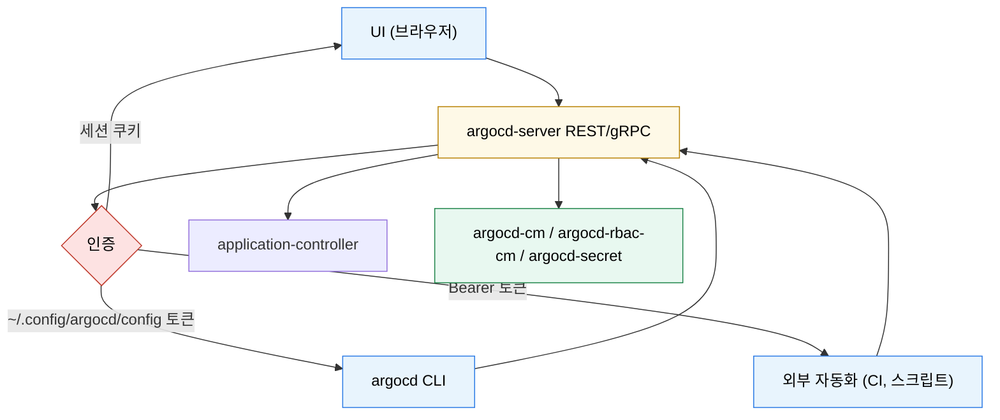

# ArgoCD 접근과 선언적 설정
---
> ArgoCD는 UI와 CLI를 제공하지만, 핵심 설정은 결국 Kubernetes 리소스로 표현된다. 그래서 “어떻게 접속하는가”와 “어떻게 선언적으로 관리하는가”를 함께 이해해야 한다.


## 학습 목표
> 사람용 접근 경로와 선언적 구성 방식을 함께 정리한다.

이 장에서 확인할 목표는 다음과 같다:

1. UI, CLI, API 각각의 사용 시점을 설명할 수 있다.
2. `argocd-cm`, Secret, `Application`, `AppProject`의 선언적 관리 방식을 이해할 수 있다.
3. ArgoCD도 결국 ArgoCD로 관리할 수 있다는 self-management 개념을 설명할 수 있다.


## 1. UI, CLI, API
> ArgoCD는 운영자와 자동화 도구 각각에 다른 인터페이스를 제공한다.

UI는 상태를 빠르게 파악하고 차이를 시각적으로 보는 데 강하다. CLI는 스크립팅과 운영 반복 작업에 적합하다. REST API는 외부 시스템과의 통합 지점이다.

실무에서는 보통 “상태 확인은 UI, 반복 작업과 일괄 조회는 CLI, 외부 시스템 연동은 API”처럼 역할이 나뉜다.


## 2. 선언적 설정의 기본 원칙
> ArgoCD 설정도 Kubernetes 리소스로 표현되므로 GitOps로 다시 관리할 수 있다.

공식 `Declarative Setup` 문서 기준으로 `Application`, `AppProject`, 주요 ConfigMap, Secret은 Kubernetes 리소스로 선언할 수 있다. 이렇게 하면 `argocd` CLI 없이도 설정을 Git에서 관리할 수 있다.

중요한 규칙이 하나 있다. `Application`과 `AppProject` 같은 ArgoCD 리소스는 기본적으로 Argo CD가 설치된 namespace, 보통 `argocd` namespace에 위치한다. 이 규칙을 놓치면 “리소스는 만들었는데 ArgoCD가 못 본다”는 혼란이 생긴다.


## 3. ConfigMap과 Secret의 역할
> 공개 설정과 민감 설정은 리소스 종류부터 다르게 가져간다.

`argocd-cm`은 일반 설정을 담는다. URL, SSO 설정, 일부 동작 옵션이 여기에 들어간다. 반면 저장소 자격증명, TLS 자료, 토큰, 비밀 키처럼 민감한 값은 Secret으로 분리한다.

실무에서는 ConfigMap과 Secret을 같이 Git에 두되, Secret은 External Secrets나 Sealed Secrets 같은 별도 관리 체계를 함께 검토하는 편이 보통 더 안전하다.


## 4. ArgoCD를 ArgoCD로 관리하기
> self-management는 강력하지만 권한 경계를 흐리게 만들 수도 있다.

ArgoCD는 자기 설정도 `Application`으로 관리할 수 있다. 즉 ArgoCD 설치 매니페스트나 Helm values를 Git에 두고, ArgoCD가 자기 자신을 reconciliation 하게 만들 수 있다.

이 방식은 일관성과 재현성 면에서 장점이 크다. 반면 잘못된 변경을 넣으면 ArgoCD 자신이 깨질 수 있으므로, 초기 부트스트랩과 롤백 전략을 먼저 정해 두는 편이 좋다.


## 5. Mermaid로 보는 UI/CLI/API 흐름
> 셋 다 결국 같은 API를 친다 — 인증과 사용 시점만 다르다.



UI 세션 토큰이 그대로 CLI 토큰으로 쓰이기 때문에 UI 권한과 CLI 권한이 자동으로 같은 RBAC 정책을 따른다. 이 동치 관계를 알면 “UI에서는 보이는데 CLI에서 안 된다”라는 디버깅을 빠르게 끊을 수 있다.


## 6. ConfigMap·Secret 분리 원칙과 self-management
> 같은 ArgoCD인데 “설정”과 “비밀”의 보관소가 처음부터 다르다.

| 리소스 | 역할 | 주요 키 |
|-------|------|--------|
| `argocd-cm` (ConfigMap) | URL, SSO 메타, 동작 옵션 | `url`, `dex.config`, `oidc.config` |
| `argocd-rbac-cm` (ConfigMap) | RBAC 정책 문자열 | `policy.csv`, `policy.default` |
| `argocd-secret` (Secret) | 서버 비밀 키, OIDC client secret | `server.secretkey`, `dex.* ` |
| `argocd-tls-certs-cm` (ConfigMap) | repo 호스트 TLS 인증서 | repo별 |
| `argocd-ssh-known-hosts-cm` (ConfigMap) | SSH 호스트 키 | repo별 |
| repository Secret(`type: repository`) | 저장소 자격증명 | `username`, `password`, `sshPrivateKey` |
| cluster Secret(`type: cluster`) | 원격 클러스터 자격증명 | `server`, `config` |

self-management는 “위 리소스들조차 ArgoCD `Application`으로 관리”하는 패턴이다. 다음 minimal spec이면 된다.

```yaml
# application-argocd.yaml
apiVersion: argoproj.io/v1alpha1
kind: Application
metadata:
  name: argocd-self
  namespace: argocd
spec:
  project: default
  source:
    repoURL: https://bitbucket.org/okestrolab/tps_manifest.git
    targetRevision: main
    path: argocd-apps/argocd-self/ppp
  destination:
    server: https://kubernetes.default.svc
    namespace: argocd
  syncPolicy:
    automated: { prune: false, selfHeal: true }   # ArgoCD 자체에는 prune 끔
```

`prune: false`로 둔 이유는 “자기 자신의 핵심 ConfigMap이 실수로 사라지는 사고”를 막기 위함이다. ArgoCD 자기 관리에서는 보수적인 자동화 옵션이 표준이다.


## 다음 단계
> 접속과 설정 방식을 이해했다면, 이제 실제 배포 단위인 Application을 봐야 한다.

다음 장에서는 `Application`의 source, destination, Helm/Kustomize 소스 처리, finalizer, 삭제 동작 같은 실제 배포 단위를 다룬다.


## 관련 문서
> 접근 방식, Application, 권한 문서를 연결한다.

- [Application과 배포 대상 관리](./02-01.Application과%20배포%20대상%20관리.md) — 다음 장
- [인증·인가와 AppProject](./03-01.인증·인가와%20AppProject.md) — SSO와 RBAC
- [ArgoCD 설치와 아키텍처](./01-02.ArgoCD%20설치와%20아키텍처.md) — 이전 장
