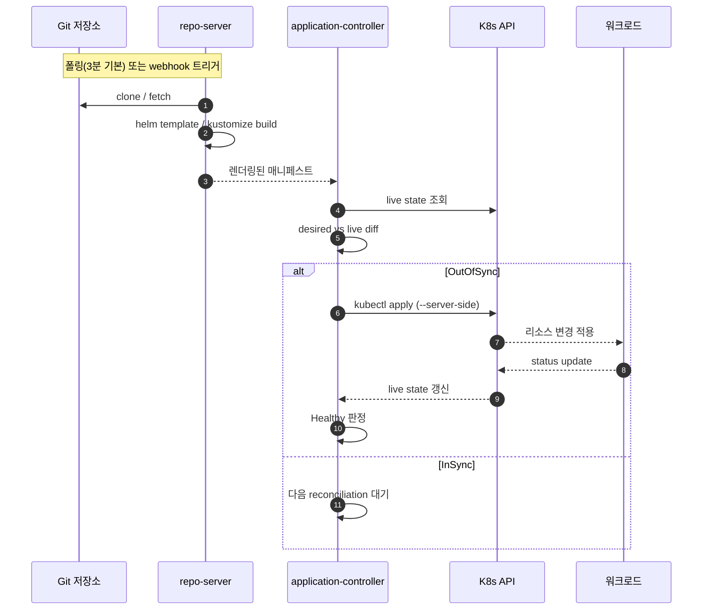

# Application과 배포 대상 관리
---
> `Application`은 ArgoCD의 핵심 배포 단위다. Git의 어떤 경로를 어느 클러스터와 네임스페이스에 반영할지 선언하는 리소스다.


## 학습 목표
> Application의 source와 destination을 중심으로 배포 단위를 읽는다.

이 장에서 확인할 목표는 다음과 같다:

1. `Application` spec의 핵심 필드를 읽고 역할을 설명할 수 있다.
2. Helm, Kustomize, Directory 소스를 어떻게 다루는지 구분할 수 있다.
3. destination의 `server`와 `name`, finalizer와 삭제 동작을 설명할 수 있다.


## 1. Application이란 무엇인가
> ArgoCD는 결국 Application 단위로 상태를 추적하고 동기화한다.

`Application`은 원하는 상태의 소스와 배포 대상을 함께 정의한다. source는 Git 저장소, revision, path, Helm chart 같은 원하는 상태의 위치를 의미하고, destination은 어느 클러스터와 namespace에 적용할지를 뜻한다.

공식 문서의 최소 예시는 단순하다. `repoURL`, `targetRevision`, `path`, `destination.server`, `destination.namespace` 정도만 있어도 기본 배포는 가능하다.


## 2. 소스 유형
> Application은 단일 YAML만 보는 것이 아니라 여러 템플릿 도구를 소스로 사용할 수 있다.

ArgoCD는 디렉토리 기반 매니페스트, Helm chart, Kustomize를 기본적으로 다룬다. 이때 중요한 점은 ArgoCD가 Helm을 릴리스 매니저로 유지하는 것이 아니라 렌더링 도구로 쓴다는 점이다.

Helm은 차트와 values를 기반으로 최종 매니페스트를 만들고, Kustomize는 오버레이와 패치로 환경 차이를 표현한다. 실무에서는 “재사용성 중심이면 Helm, 이미 존재하는 YAML 집합의 환경별 차이면 Kustomize”처럼 나누는 경우가 많다.


## 3. 배포 대상과 멀티클러스터 연결
> destination은 단순 namespace 필드가 아니라 운영 경계를 결정하는 필드다.

동일 클러스터 배포라면 `https://kubernetes.default.svc`를 destination server로 자주 쓴다. 원격 클러스터를 등록한 경우에는 cluster name 또는 server URL을 기준으로 배포 대상을 선택한다.

공식 `Declarative Setup` 기준으로 destination에는 `server` 또는 `name` 중 하나를 쓸 수 있다. 둘 다 동시에 쓰면 오류가 된다. 이 제약은 멀티클러스터 실습에서 자주 헷갈리는 포인트다.


## 4. 삭제와 finalizer
> Application을 지운다고 항상 하위 리소스가 같이 지워지는 것은 아니다.

ArgoCD는 `resources-finalizer.argocd.argoproj.io` finalizer를 통해 Application 삭제 시 관리 대상 리소스를 같이 지울지 결정한다. finalizer가 없으면 Application만 없어지고 실제 워크로드는 남을 수 있다.

이 차이는 운영에서 중요하다. 실수 방지 관점에서는 안전하지만, 반대로 “앱을 지웠는데 왜 리소스가 남아 있지?”라는 혼란을 만들 수 있다. 삭제 정책은 장기적으로 팀 규칙으로 통일하는 편이 낫다.


## 5. Mermaid로 보는 Application reconciliation
> Git → repo-server → application-controller → 클러스터 순서로 한 번 본다.



여기서 흔히 헷갈리는 점이 “Helm 릴리스가 클러스터에 남는가”다. ArgoCD는 Helm을 렌더러로만 쓰기 때문에 `helm list`에 ArgoCD가 만든 릴리스는 잡히지 않는다. 매니페스트만 클러스터에 들어가고, 추적은 ArgoCD의 `app.kubernetes.io/instance` 레이블이 담당한다.


## 6. Helm·Kustomize·Directory 소스 처리 분기
> 같은 Application spec이지만 source 유형에 따라 repo-server 내부 동작이 다르다.

| 소스 유형 | spec 키 | repo-server 동작 | 환경 분리 방식 |
|----------|--------|----------------|--------------|
| Helm chart | `source.helm.valueFiles`, `parameters` | `helm template <chart> -f <values>` | values 파일 분리 |
| Kustomize | `source.kustomize.images`, `namePrefix` | `kustomize build <path>` | overlay 디렉토리 분리 |
| Directory | (없음) | 디렉토리 내 YAML 그대로 적용 | 매니페스트 사본 분리 |
| Plugin (CMP) | `source.plugin.name` | sidecar 플러그인 호출 | 플러그인 인자 |
| Multi-source | `sources: []` (v2.6+) | 여러 소스 병합 | values는 별도 repo에서 |

Helm은 “차트 + 환경별 values”를 분리하고 싶을 때 자연스럽고, Kustomize는 “이미 존재하는 베이스 YAML에 환경별 patch”를 얹고 싶을 때 자연스럽다. 둘을 섞고 싶으면 v2.6 이후의 multi-source 모델을 쓰거나 CMP를 쓴다.


## 7. Helm 차트 기준 — `tps-helm` 우산 차트의 파일 → 리소스 매핑
> 우산 차트(`tps-helm`)는 12개 마이크로서비스를 한 차트로 묶고, 환경별 values 파일로 갈라진다.

```
helm-charts/tps-helm/
├── Chart.yaml                          # name: tps-helm, version: 1.x.x
├── values.yaml                         # 공통 기본값
├── values/
│   ├── values-ppp.yaml                 # 305P (Harbor middleware 경로)
│   ├── values-dev.yaml
│   ├── values-prd.yaml
│   └── values-bok.yaml                 # 폐쇄망(한국은행)
└── templates/
    ├── _helpers.tpl
    ├── auth-api/
    │   ├── deployment.yaml             → Deployment/auth-api
    │   ├── service.yaml                → Service/auth-api
    │   ├── configmap.yaml              → ConfigMap/auth-api-config
    │   └── ingress.yaml                → Ingress/auth-api (선택)
    ├── pipeline-api/
    │   ├── deployment.yaml             → Deployment/pipeline-api
    │   └── service.yaml
    └── ...                             # 12개 서비스 동일 패턴
```

폐쇄망 운영을 가정해 모든 이미지 경로는 `values-{env}.yaml`에서 Harbor/Nexus로 override한다. 외부 레지스트리(`docker.io`, `quay.io`)는 본문에 등장하지 않는다.

```yaml
# values-ppp.yaml (요약)
global:
  imagePullSecret: harbor-creds

auth-api:
  enabled: true
  image:
    fullname: harbor.dev.trombone-v2.okestro.cloud/middleware/auth-api
    tag: 20260425-101500              # ← Image Updater 갱신 대상
  replicas: 4
  service:
    port: 8080
```

`helm template tps-helm -f values/values-ppp.yaml`이 만드는 결과는 12개 서비스 × (Deployment + Service + ConfigMap) ≈ 30~40개 매니페스트다. ArgoCD `Application`은 이 결과 전체를 한 번에 sync한다.


## 8. 실습 예제 — Application + 검증 명령
> source/destination/syncPolicy/finalizer 핵심 키만 담은 최소 spec과 검증 명령을 함께 본다.

```yaml
# application-trb-app.yaml
apiVersion: argoproj.io/v1alpha1
kind: Application
metadata:
  name: trb-app
  namespace: argocd
  finalizers:
    - resources-finalizer.argocd.argoproj.io
spec:
  project: default
  source:
    repoURL: https://bitbucket.org/okestrolab/tps_manifest.git
    targetRevision: main
    path: helm-charts/tps-helm
    helm:
      valueFiles:
        - values/values-ppp.yaml
  destination:
    server: https://kubernetes.default.svc
    namespace: trb-app
  syncPolicy:
    automated:
      prune: true
      selfHeal: true
    syncOptions:
      - CreateNamespace=true
      - ServerSideApply=true
```

검증 흐름은 다음과 같다.

```bash
# schema 검증 (apply 없이)
kubectl --dry-run=client -o yaml apply -f application-trb-app.yaml

# 적용 + 상태 확인
kubectl apply -f application-trb-app.yaml
argocd app get trb-app
argocd app sync trb-app --prune
argocd app history trb-app

# diff (Git desired vs live)
argocd app diff trb-app
```

`finalizers`가 빠져 있으면 Application을 지워도 워크로드가 남는다. 운영 표준에서는 finalizer를 기본 켜고, 의도적으로 워크로드만 남기고 싶은 예외 케이스에만 빼는 편이 안전하다.


## 9. 305P 실무 사례
> 305P 매니페스트 저장소와 환경별 values 분기를 실제 경로로 인용한다.

| 항목 | 값 |
|------|-----|
| repoURL | `https://bitbucket.org/okestrolab/tps_manifest.git` |
| path | `helm-charts/tps-helm` |
| values (305P) | `values/values-ppp.yaml` |
| destination namespace | `trb-app` |
| destination server | `https://kubernetes.default.svc` (단일 클러스터) |
| 자격증명 Secret | `bitbucket-creds` (`trb-oss`) |
| ImagePullSecret | `harbor-creds` (`trb-oss`) |

저장소 인증은 `apply-app-of-apps.sh`가 부트스트랩 시 `bitbucket-creds` Secret을 만들고, ArgoCD repository Secret(`trb-manifest-repo`)을 함께 생성한다. 비밀번호/토큰 본문 노출 금지 — 실제 값은 인프라 스킬 문서 `tps/infra/SKILL.md`, `references/14-v305p-environment.md`, `references/07-argocd-image-updater.md`에서 관리한다.


## 다음 단계
> Application을 만들었다면 이제 언제 어떻게 sync할지와 순서를 어떻게 제어할지 봐야 한다.

다음 장에서는 자동 sync, prune, self-heal, hook, wave, sync window를 함께 본다.


## 관련 문서
> 동기화 전략과 멀티클러스터 문서로 이어진다.

- [Sync 전략과 배포 순서 제어](./02-02.Sync%20전략과%20배포%20순서%20제어.md) — 다음 장
- [멀티클러스터와 멀티테넌시](./03-02.멀티클러스터와%20멀티테넌시.md) — destination 확장
- [ArgoCD 접근과 선언적 설정](./01-03.ArgoCD%20접근과%20선언적%20설정.md) — 이전 장
