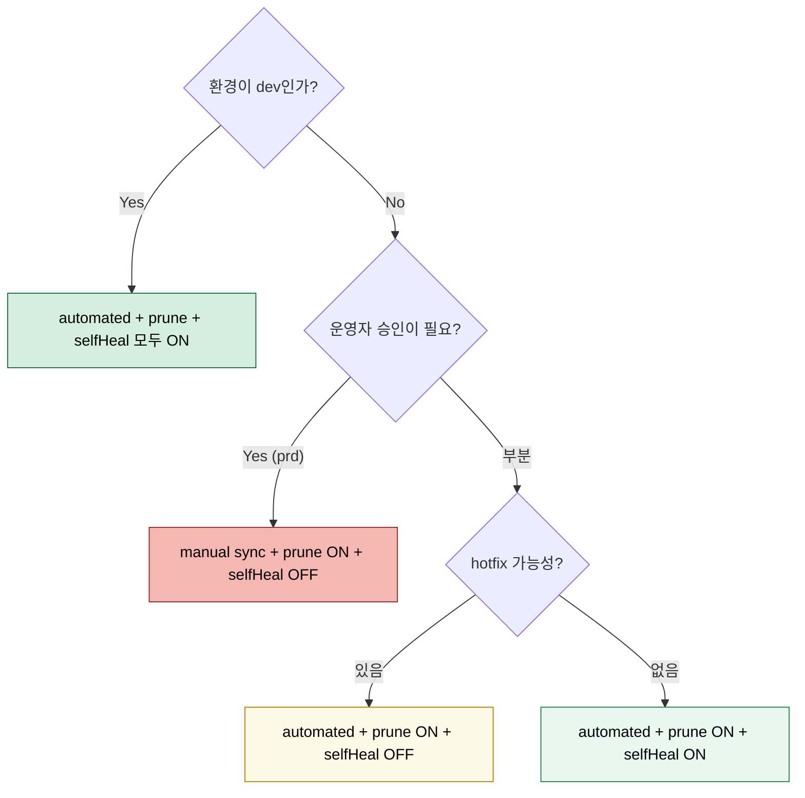

# Sync 전략과 배포 순서 제어
---
> ArgoCD의 진짜 강점은 “Git과 맞춘다”에서 끝나지 않는다. 언제 sync할지, 어떤 순서로 sync할지, 무엇은 무시할지를 선언할 수 있다는 점이 실무에서 중요하다.


## 학습 목표
> 자동 sync와 순서 제어, 운영 제한 기능을 함께 정리한다.

이 장에서 확인할 목표는 다음과 같다:

1. manual sync와 automated sync의 차이를 설명할 수 있다.
2. `prune`, `selfHeal`, sync options의 의미를 설명할 수 있다.
3. hook, sync wave, sync window의 역할 차이를 설명할 수 있다.


## 1. 수동과 자동 동기화
> 자동 sync는 편리하지만 운영 통제를 약하게 만들 수도 있다.

기본값은 보통 manual sync다. 사용자가 의도적으로 sync를 눌러야 원하는 상태를 적용한다. automated sync를 켜면 Git 변경을 ArgoCD가 자동으로 반영한다.

여기에 `prune`을 켜면 Git에서 제거된 리소스도 삭제하고, `selfHeal`을 켜면 drift를 자동으로 되돌린다. 둘 다 강력하지만 잘못 쓰면 수동 hotfix를 바로 덮어쓸 수 있으므로 운영 원칙과 함께 써야 한다.


## 2. Hook과 Sync Wave
> 둘 다 순서를 다루지만 레벨이 다르다.

hook은 특정 단계에서 실행되는 특별 리소스다. `PreSync`, `Sync`, `PostSync`, `SyncFail`, `PostDelete` 같은 타입이 있다. 보통 마이그레이션 Job, 스모크 테스트, 정리 작업에 쓴다.

sync wave는 같은 단계 안에서 세부 순서를 정한다. 낮은 wave부터 적용되며, 공식 문서 기준으로 phase, wave, kind, name 순으로 정렬해 적용한다. 따라서 hook은 거친 단계 제어, wave는 세부 순서 제어라고 보면 된다.


## 3. Ignore Differences와 Selective Sync
> 운영 현실에서는 “모든 차이”를 문제로 보지 않는 전략도 필요하다.

일부 리소스는 컨트롤러가 런타임에 필드를 바꾸기 때문에 그대로 비교하면 계속 `OutOfSync`가 날 수 있다. 이런 경우 Ignore Differences를 사용해 특정 필드 차이를 무시한다.

Selective Sync는 전체가 아니라 일부 리소스만 sync하는 방식이다. 다만 공식 문서 기준으로 selective sync는 일반 sync 이력과 다르게 기록/롤백 제약이 생길 수 있으므로, 운영 표준으로 삼기보다는 예외적 복구 수단에 가깝게 보는 편이 안전하다.


## 4. Sync Window
> 항상 자동 sync가 좋은 것은 아니다. 시간대 제한이 필요한 환경이 있다.

Sync Window는 특정 시간대에 sync를 허용하거나 차단하는 기능이다. allow와 deny 창을 조합해 야간 배포만 허용하거나, 업무 시간 자동 배포를 막는 식으로 운영할 수 있다.

공식 문서 기준으로 allow와 deny가 동시에 맞으면 deny가 우선한다. 또한 matching 조건은 application 이름, cluster, namespace 기준으로 잡을 수 있다.


## 5. 의사결정 트리 — 어떤 옵션을 켤까
> 자동화 강도는 운영 통제력과 반비례한다. 환경 단계에 맞춰 켜고 끄는 게 정답에 가깝다.



`selfHeal: true`는 “수동 hotfix를 자동으로 되돌린다”는 의미와 같다. 따라서 prd처럼 사람의 임시 개입이 가끔 필요한 환경에서는 OFF가 안전하다.


## 6. Hook과 Sync Wave — 정렬 규칙
> hook은 단계, wave는 단계 안의 순서다. 동시 적용 시 정렬은 phase → wave → kind → name 순.

| Hook 타입 | 시점 | 대표 용도 |
|----------|------|----------|
| PreSync | sync 직전 | 마이그레이션 Job, schema 백업 |
| Sync | 일반 리소스 적용 시점 | 보통 명시 안 함 |
| PostSync | sync 성공 후 | 스모크 테스트, 캐시 워밍 |
| SyncFail | sync 실패 시 | 알림, 임시 자원 정리 |
| PostDelete | Application 삭제 후 | 외부 시스템 정리 |

```yaml
# hook-and-wave.yaml
apiVersion: batch/v1
kind: Job
metadata:
  name: db-migrate
  annotations:
    argocd.argoproj.io/hook: PreSync
    argocd.argoproj.io/hook-delete-policy: BeforeHookCreation
    argocd.argoproj.io/sync-wave: "-1"
spec:
  template:
    spec:
      restartPolicy: Never
      containers:
        - name: migrate
          image: harbor.dev.trombone-v2.okestro.cloud/middleware/migrator:latest
          command: ["./migrate"]
---
apiVersion: apps/v1
kind: Deployment
metadata:
  name: api
  annotations:
    argocd.argoproj.io/sync-wave: "1"
spec: { ... }
---
apiVersion: networking.k8s.io/v1
kind: Ingress
metadata:
  name: api-ing
  annotations:
    argocd.argoproj.io/sync-wave: "2"
spec: { ... }
```

`sync-wave`는 음수도 허용된다. 마이그레이션 Job(`-1`)이 Deployment(`1`)보다 먼저 끝나야 하고, Ingress(`2`)는 Deployment가 Healthy가 된 다음에 노출되도록 한다.


## 7. Sync Window 예제와 충돌 규칙
> allow + deny가 동시에 매칭되면 deny가 이긴다.

```yaml
# appproject-sync-window.yaml (AppProject 일부)
spec:
  syncWindows:
    - kind: allow
      schedule: "0 22 * * 1-5"     # 평일 22:00 시작
      duration: 4h                  # 4시간 창
      applications: ["*"]
      manualSync: true              # 수동 sync는 창 밖에서도 가능
    - kind: deny
      schedule: "0 9 * * 1-5"       # 평일 09:00~18:00
      duration: 9h
      applications: ["trb-app-*"]   # 업무 앱만 차단
      manualSync: false
```

Sync Window는 “자동 배포가 한밤중에 사람 없이 도는 사고”를 줄이는 장치다. manualSync 키로 “창 밖에서는 자동만 막고 사람 손은 허용”도 표현할 수 있다.


## 다음 단계
> 한 앱의 sync를 넘어서, 여러 앱을 계층화하고 대규모로 생성하는 구조를 봐야 한다.

다음 장에서는 App of Apps와 ApplicationSet을 비교하고, 어느 상황에서 무엇을 써야 하는지 정리한다.


## 관련 문서
> Application, 대규모 운영, App of Apps 문서를 함께 본다.

- [App of Apps와 ApplicationSet](./02-03.App%20of%20Apps와%20ApplicationSet.md) — 다음 장
- [Application과 배포 대상 관리](./02-01.Application과%20배포%20대상%20관리.md) — 이전 장
- [대규모 운영과 Progressive Sync](./05-02.대규모%20운영과%20Progressive%20Sync.md) — scale 관점의 확장
