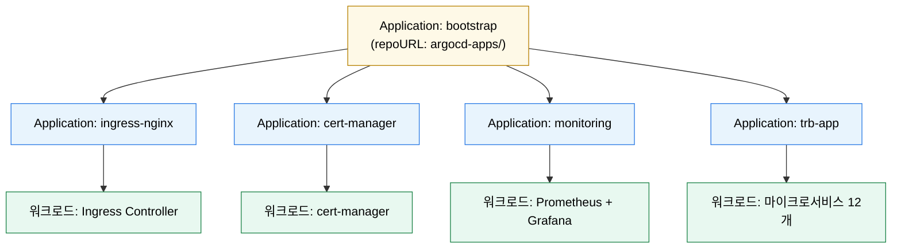

# App of Apps와 ApplicationSet
---
> 둘 다 여러 Application을 다루기 위한 구조지만 목적이 다르다. App of Apps는 계층화와 부트스트랩에, ApplicationSet은 다수 Application의 반복 생성에 강하다.


## 학습 목표
> 여러 앱을 다룰 때 어떤 구조를 선택해야 하는지 판단 기준을 세운다.

이 장에서 확인할 목표는 다음과 같다:

1. App of Apps 패턴의 구조와 장단점을 설명할 수 있다.
2. ApplicationSet의 generator 기반 생성 모델을 설명할 수 있다.
3. App of Apps와 ApplicationSet을 어떤 상황에서 선택할지 판단할 수 있다.


## 1. App of Apps란 무엇인가
> 부모 Application이 자식 Application들을 관리하는 계층 구조다.

App of Apps는 상위 `Application` 하나가 하위 Application YAML들이 있는 디렉토리를 source로 가리키는 방식이다. 최상위 앱을 sync하면 자식 Application들이 생성되고, 각 자식이 실제 워크로드를 배포한다.

이 구조는 클러스터 부트스트랩에 강하다. 예를 들어 ingress-nginx, cert-manager, monitoring, business apps를 부모 앱 하나로 묶어 초기 상태를 만들 수 있다.

공식 Cluster Bootstrapping 문서가 강조하듯, App of Apps는 사실상 admin-level 도구다. 부모 리포지토리에 push 가능한 사람은 임의 Project와 namespace 조합의 Application을 만들 수 있기 때문이다.


## 2. ApplicationSet이 해결하는 문제
> 반복되는 Application 정의를 템플릿으로 줄인다.

ApplicationSet은 하나의 템플릿과 generator로 여러 Application을 동적으로 만든다. List, Git Directory, Cluster, Pull Request 같은 generator를 사용해 같은 패턴의 Application을 대량 생성할 수 있다.

예를 들어 `apps/*` 디렉토리마다 하나씩 Application을 만들거나, 등록된 클러스터마다 동일 앱을 생성하는 식이 가능하다. 그래서 반복 생성과 다수 타깃 배포에 강하다.


## 3. 둘의 차이와 선택 기준
> 핵심 차이는 “계층화”냐 “반복 생성”이냐다.

App of Apps는 운영자가 구조와 순서를 직접 설계하는 계층형 패턴이다. 반면 ApplicationSet은 규칙에 따라 다수 Application을 자동 생성하는 템플릿 엔진에 가깝다.

실무 기준으로는 수십 개 수준의 플랫폼/업무 앱 구조화에는 App of Apps가 이해하기 쉽다. 반면 클러스터 수, 서비스 수, 테넌트 수가 커서 반복 생성이 필요하면 ApplicationSet이 더 자연스럽다.

간단히 말해 “부모-자식 구조가 중요하면 App of Apps, 생성 규칙이 중요하면 ApplicationSet”이다.


## 4. Sync Waves, Progressive Sync와의 관계
> 여러 앱을 동시에 다루면 순차 배포 문제가 다시 등장한다.

App of Apps 안에서도 자식 Application 간 순서가 필요할 수 있다. 이때 상위/하위 구조와 sync wave를 함께 쓴다. 예를 들어 cert-manager 다음 ingress-nginx, 그 다음 business apps처럼 배포 순서를 설계할 수 있다.

ApplicationSet은 앱 수가 더 많아지는 경우가 많기 때문에, 후속 장에서 다룰 Progressive Sync와 결합해 순차 rollout을 관리하는 경우가 많다.


## 5. Mermaid로 보는 App of Apps 계층
> 부모 Application 한 개가 자식 Application N개를 만들고, 각 자식이 실제 워크로드를 배포한다.



부모 Application의 source는 “자식 Application YAML들이 들어 있는 디렉토리”다. 그 디렉토리에 자식을 추가하면 부모 sync만으로 클러스터에 자식이 생긴다. 클러스터 부트스트랩이 한 줄로 표현되는 이유가 여기에 있다.


## 6. ApplicationSet generator 비교
> 같은 ApplicationSet이지만 generator 종류에 따라 자동 생성 규칙이 완전히 달라진다.

| Generator | 생성 기준 | 대표 사례 | 특이사항 |
|-----------|---------|---------|----------|
| List | 직접 나열한 element | 환경 4개(dev/ppp/prd/bok)에 같은 차트 배포 | 가장 단순, 변경 시 ApplicationSet 자체를 수정 |
| Cluster | ArgoCD 등록 클러스터 + label | 모든 staging 클러스터에 monitoring 배포 | 클러스터 추가 시 자동 반영 |
| Git Directory | repo의 디렉토리 패턴 | `apps/*` 폴더마다 한 개 Application | 디렉토리 추가/삭제로 라이프사이클 관리 |
| Git File | repo의 파일 패턴 | `clusters/*.yaml`을 읽어 클러스터별 생성 | 메타 파일 기반 |
| Pull Request | PR 단위 동적 환경 | feature 브랜치 PR마다 임시 환경 | PR close 시 자동 정리 |
| Matrix | 두 generator 곱 | (서비스 12개) × (환경 4개) = 48 Application | 폭발적으로 늘기 쉬워 주의 |
| Merge | 두 generator 합집합/제한 | List + Cluster 조합 | 조건부 매핑 |

운영에서 흔한 실수는 “Matrix를 무심코 켜는 것”이다. 12 × 4 = 48 Application은 reconciliation 부하가 단순 합산보다 훨씬 크다. 차라리 List × 환경 단위로 두는 편이 안전한 경우가 많다.


## 7. 실습 예제 — App of Apps + ApplicationSet
> 같은 목적을 두 패턴으로 표현하면 차이가 분명히 드러난다.

App of Apps 부모와 자식 한 쌍은 다음과 같다.

```yaml
# argocd-apps/bootstrap/parent.yaml
apiVersion: argoproj.io/v1alpha1
kind: Application
metadata:
  name: bootstrap
  namespace: argocd
  finalizers: [resources-finalizer.argocd.argoproj.io]
spec:
  project: default
  source:
    repoURL: https://bitbucket.org/okestrolab/tps_manifest.git
    targetRevision: main
    path: argocd-apps/app-of-apps/ppp           # 자식 YAML들이 있는 디렉토리
    directory:
      recurse: true
  destination:
    server: https://kubernetes.default.svc
    namespace: argocd
  syncPolicy:
    automated: { prune: true, selfHeal: true }
```

```yaml
# argocd-apps/app-of-apps/ppp/trb-app-application.yaml (자식)
apiVersion: argoproj.io/v1alpha1
kind: Application
metadata:
  name: trb-app-ppp
  namespace: argocd
  finalizers: [resources-finalizer.argocd.argoproj.io]
spec:
  project: default
  source:
    repoURL: https://bitbucket.org/okestrolab/tps_manifest.git
    targetRevision: main
    path: helm-charts/tps-helm
    helm:
      valueFiles: [values/values-ppp.yaml]
  destination:
    server: https://kubernetes.default.svc
    namespace: trb-app
  syncPolicy:
    automated: { prune: true, selfHeal: true }
```

같은 결과를 ApplicationSet으로 표현하면 다음처럼 단일 spec이 된다.

```yaml
# argocd-apps/applicationset/trb-app-set.yaml
apiVersion: argoproj.io/v1alpha1
kind: ApplicationSet
metadata:
  name: trb-app
  namespace: argocd
spec:
  generators:
    - list:
        elements:
          - env: dev
            valuesFile: values/values-dev.yaml
          - env: ppp
            valuesFile: values/values-ppp.yaml
          - env: prd
            valuesFile: values/values-prd.yaml
          - env: bok
            valuesFile: values/values-bok.yaml
  template:
    metadata:
      name: 'trb-app-{{env}}'
    spec:
      project: default
      source:
        repoURL: https://bitbucket.org/okestrolab/tps_manifest.git
        targetRevision: main
        path: helm-charts/tps-helm
        helm:
          valueFiles: ['{{valuesFile}}']
      destination:
        server: https://kubernetes.default.svc
        namespace: trb-app
      syncPolicy:
        automated: { prune: true, selfHeal: true }
```

App of Apps는 “자식이 명시적으로 보인다”는 장점이 있고, ApplicationSet은 “환경이 늘어도 spec 한 줄만 늘면 된다”는 장점이 있다. 둘은 경쟁이 아니라 부트스트랩(App of Apps)과 양산(ApplicationSet)으로 역할을 나눠 쓰는 편이 자연스럽다.


## 8. 305P 실무 사례 — apply-app-of-apps.sh가 만드는 흐름
> 305P는 App of Apps + 부트스트랩 스크립트 조합으로 환경별 ArgoCD 초기화를 자동화한다.

`tps_manifest` 저장소의 표준 구조와 흐름은 다음과 같다.

```
tps_manifest/
├── argocd-apps/
│   ├── apply-app-of-apps.sh                    # 부트스트랩 스크립트
│   ├── app-of-apps/
│   │   ├── ppp/
│   │   │   ├── trb-app-application.yaml
│   │   │   ├── trb-oss-application.yaml
│   │   │   └── trb-mgm-application.yaml
│   │   ├── dev/
│   │   ├── prd/
│   │   └── bok/
│   ├── applicationset/                         # 선택: ApplicationSet 사용 시
│   └── image-updater/
├── helm-charts/
│   └── tps-helm/
└── kubernetes-manifests/
    └── secret/
        ├── ppp/bitbucket-creds-ppp.yaml
        └── ...
```

`apply-app-of-apps.sh --context tps-v305p --env ppp --apps trb-oss` 실행 흐름은 인프라 스킬 문서 기준 다음과 같다.

1. `kubernetes-manifests/secret/<env>/bitbucket-creds-*.yaml`을 원천으로 읽어 `bitbucket-creds` Secret을 target context에 적용한다.
2. ArgoCD repository Secret(`trb-manifest-repo`)을 같은 context에 적용한다.
3. `argocd-apps/app-of-apps/<env>/<apps>-application.yaml`을 적용한다.
4. 부모 Application이 sync되면 자식 Application들이 자동 생성되고, 각 자식이 실제 워크로드를 배포한다.

`Bitbucket repository secret이 없어 ArgoCD authentication required` 에러가 날 때는 values에 자격증명을 다시 넣지 말고 이 스크립트로 다시 부트스트랩한다(상세는 `tps/infra/SKILL.md` `.cursor 우선 확인 규칙`과 `argocd-apps 자동 적용 스크립트` 섹션 참조).


## 9. 선택 기준 정리
> 구조 단계에서 무엇을 쓸지 결정한다 — 사후 변경은 비용이 크다.

| 상황 | 권장 패턴 | 이유 |
|------|---------|------|
| 클러스터 초기 부트스트랩 | App of Apps | 자식이 명시적으로 보이고, 순서를 sync wave로 직접 제어할 수 있다 |
| 환경 4개 × 같은 차트 | ApplicationSet (List) | 환경 추가가 element 한 줄 |
| 클러스터 N대 × 같은 차트 | ApplicationSet (Cluster) | 클러스터 추가만으로 자동 반영 |
| 기능 브랜치 임시 환경 | ApplicationSet (Pull Request) | PR close 시 자동 정리 |
| 서비스 × 환경 매트릭스 | List × 환경 또는 부분 Matrix | Matrix 폭발 방지 |
| 플랫폼 + 업무 앱 동시 | App of Apps(상위) + ApplicationSet(하위) | 부트스트랩 + 양산 분리 |


## 다음 단계
> 여러 앱을 다루기 시작하면 권한과 Project 경계가 더 중요해진다.

다음 장에서는 SSO, RBAC, AppProject를 통해 누가 어떤 앱과 소스를 다룰 수 있는지 정리한다.


## 관련 문서
> 권한 경계와 대규모 운영 문서를 같이 본다.

- [인증·인가와 AppProject](./03-01.인증·인가와%20AppProject.md) — 다음 장
- [대규모 운영과 Progressive Sync](./05-02.대규모%20운영과%20Progressive%20Sync.md) — scale 확장
- [Sync 전략과 배포 순서 제어](./02-02.Sync%20전략과%20배포%20순서%20제어.md) — wave와 hook
