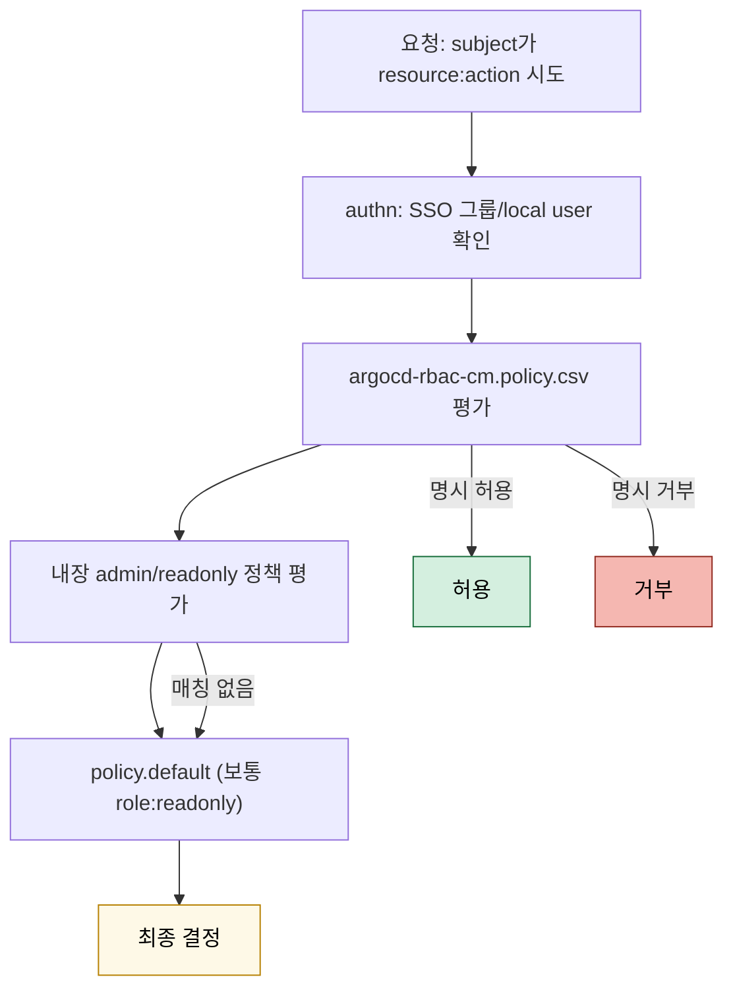

# 인증·인가와 AppProject
---
> ArgoCD를 팀 단위로 운영하려면 로그인 방식보다 먼저 경계부터 설계해야 한다. AppProject는 ArgoCD에서 소스, 대상, 리소스 범위를 제한하는 핵심 보안 경계다.


## 학습 목표
> 로그인, 권한, Project 경계를 한 번에 본다.

이 장에서 확인할 목표는 다음과 같다:

1. local user, SSO, token 기반 접근의 차이를 설명할 수 있다.
2. ArgoCD RBAC 정책 문법과 평가 흐름을 이해할 수 있다.
3. AppProject가 왜 단순 분류가 아니라 보안 경계인지 설명할 수 있다.


## 1. 인증 방식
> 운영 기본값은 로컬 계정보다 SSO에 가깝다.

초기 설치 직후에는 `admin` 계정으로 진입하는 경우가 많지만, 실무에서는 가능하면 SSO로 전환하는 편이 낫다. Dex를 통해 GitHub, Google, LDAP, OIDC 같은 IdP와 연동하면 조직의 사용자/그룹 체계를 그대로 활용할 수 있다.

자동화 도구에는 토큰이 필요할 수 있지만, 무기한 토큰 남용은 피하는 편이 좋다. 토큰 만료 주기와 폐기 절차를 같이 설계해야 한다.


## 2. RBAC 정책
> 누가 무엇을 읽고 수정하고 sync할 수 있는지 문장처럼 표현한다.

ArgoCD RBAC는 `argocd-rbac-cm`의 정책 문자열로 정의한다. `applications`, `applicationsets`, `projects`, `clusters`, `repositories` 같은 자원에 대해 `get`, `sync`, `create`, `update`, `delete` 액션을 허용하거나 거부한다.

운영 관점에서 중요한 점은 “Application을 수정할 수 있는 권한”과 “Project나 repository를 수정할 수 있는 권한”을 분리하는 것이다. 앱 운영자와 플랫폼 관리자의 책임을 여기서 나눈다.


## 3. AppProject는 왜 중요한가
> AppProject는 애플리케이션 묶음이 아니라 권한 경계다.

AppProject는 허용된 source repository, destination cluster/namespace, 허용된 Kubernetes 리소스 범위를 제한한다. 즉 어떤 팀이 어떤 저장소의 어떤 리소스를 어느 클러스터에 배포할 수 있는지를 제어한다.

이 경계를 제대로 설계하지 않으면, 개발 팀이 자신의 앱만 관리한다고 생각해도 실제로는 임의 namespace나 cluster로 배포할 수 있는 구멍이 생길 수 있다.


## 4. App of Apps와 Project의 관계
> 부모 Application 구조를 쓰기 시작하면 Project 경계가 더 중요해진다.

App of Apps는 강력하지만, 부모 App이 자식 Application을 마음대로 생성할 수 있다는 점에서 위험하다. 그래서 부모 App이 속한 Project와 source repository 권한을 더 엄격하게 관리해야 한다.

공식 Cluster Bootstrapping 문서가 App of Apps를 admin-level 패턴으로 보는 이유도 여기에 있다.


## 5. RBAC 정책 평가 흐름
> ArgoCD RBAC는 “정책 문자열 매칭 + 첫 번째 일치가 결정”이다.



평가 순서가 “첫 번째 매칭 우선”이라는 점이 중요하다. 거부 규칙은 허용 규칙 앞에 둬야 의도대로 동작한다.


## 6. AppProject + RBAC 예제
> 팀 단위 경계를 “Project + role + RBAC” 세 줄로 표현한다.

```yaml
# appproject-trb-app.yaml
apiVersion: argoproj.io/v1alpha1
kind: AppProject
metadata:
  name: trb-app
  namespace: argocd
spec:
  description: "Trombone 마이크로서비스 12개"
  sourceRepos:
    - https://bitbucket.org/okestrolab/tps_manifest.git
  destinations:
    - server: https://kubernetes.default.svc
      namespace: trb-app
    - server: https://kubernetes.default.svc
      namespace: trb-mgm
  clusterResourceWhitelist: []                  # cluster-scoped 금지
  namespaceResourceWhitelist:
    - group: ""
      kind: ConfigMap
    - group: apps
      kind: Deployment
    - group: argoproj.io
      kind: Rollout
  roles:
    - name: developer
      policies:
        - p, proj:trb-app:developer, applications, get, trb-app/*, allow
        - p, proj:trb-app:developer, applications, sync, trb-app/*, allow
      groups:
        - "okestro:trb-app-dev"
    - name: admin
      policies:
        - p, proj:trb-app:admin, applications, *, trb-app/*, allow
      groups:
        - "okestro:trb-app-admin"
```

`sourceRepos`와 `destinations`는 “이 Project의 Application은 이 저장소·이 namespace 외에는 만질 수 없다”는 명시적 경계다. `clusterResourceWhitelist: []`로 cluster-scoped 리소스를 통째로 막은 점도 핵심이다.


## 다음 단계
> 권한 경계를 이해했다면, 이제 여러 클러스터와 팀을 어떻게 동시에 다룰지 봐야 한다.

다음 장에서는 원격 클러스터 등록, in-cluster와 remote cluster 차이, 멀티테넌시 운영 모델을 다룬다.


## 관련 문서
> Project, 멀티클러스터, 보안 문서를 함께 연결한다.

- [멀티클러스터와 멀티테넌시](./03-02.멀티클러스터와%20멀티테넌시.md) — 다음 장
- [보안 운영](./03-03.보안%20운영.md) — 저장소/TLS/서명 검증
- [App of Apps와 ApplicationSet](./02-03.App%20of%20Apps와%20ApplicationSet.md) — 이전 장
