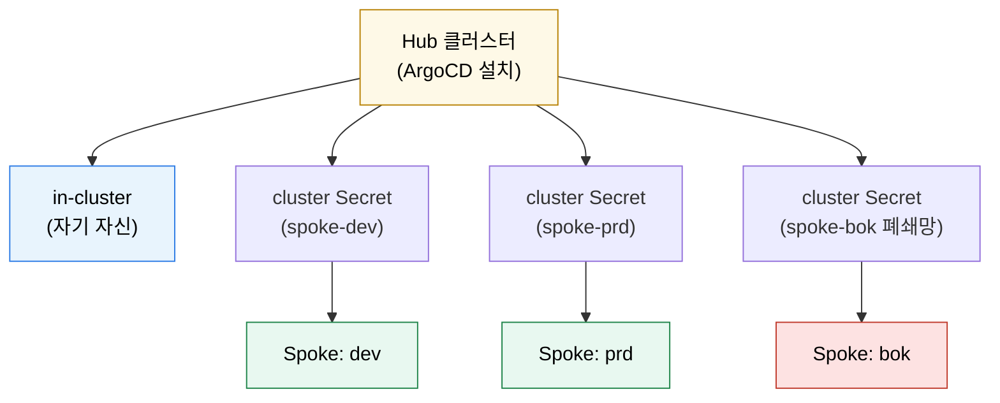

# 멀티클러스터와 멀티테넌시
---
> ArgoCD는 한 클러스터 안의 앱만 보는 도구가 아니다. 여러 클러스터를 하나의 컨트롤 플레인에서 바라보게 만들 수 있고, 그만큼 권한 경계 설계도 중요해진다.


## 학습 목표
> 원격 클러스터 등록과 팀 경계를 함께 본다.

이 장에서 확인할 목표는 다음과 같다:

1. in-cluster와 remote cluster의 차이를 설명할 수 있다.
2. cluster secret 기반 등록 모델을 이해할 수 있다.
3. 멀티클러스터와 멀티테넌시가 AppProject와 어떻게 연결되는지 설명할 수 있다.


## 1. 클러스터 등록 모델
> ArgoCD는 클러스터 정보를 Secret으로 관리한다.

기본적으로 ArgoCD가 설치된 클러스터는 in-cluster 대상이다. 여기에 추가 원격 클러스터를 등록하면 ArgoCD가 한 UI와 API에서 여러 클러스터를 관리할 수 있다.

공식 문서 기준 원격 클러스터 정보는 label이 붙은 Secret 형태로 저장된다. 여기에는 API 서버 주소와 인증 정보가 들어간다.


## 2. Hub and Spoke 관점
> 하나의 ArgoCD가 여러 spoke 클러스터를 바라보는 구조가 자주 등장한다.

플랫폼 팀이 중앙 ArgoCD를 운영하고, 여러 개발/스테이징/운영 클러스터를 spoke로 붙이는 구조가 흔하다. 이때 진짜 위험은 기술보다 권한이다. 잘못 설계하면 한 팀이 다른 클러스터에 앱을 배포할 수 있다.

그래서 AppProject에서 허용된 destination cluster와 namespace를 명시적으로 제한해야 한다.


## 3. 멀티테넌시 모델
> 팀별 Project, 저장소, 대상 클러스터를 어떻게 나눌지 결정해야 한다.

가장 단순한 방식은 팀별 AppProject 분리다. 각 팀은 자기 저장소와 자기 namespace만 허용한다. 플랫폼 팀은 공용 Project와 cluster 등록 권한을 가진다.

ApplicationSet을 함께 쓰면 팀별 템플릿 자동 생성까지 가능하지만, 그만큼 `applicationsets` 권한도 강해진다. 일반 앱 개발자에게 무조건 열어 주기보다 플랫폼 영역으로 두는 편이 보통 더 안전하다.


## 4. Hub-and-Spoke 모델과 cluster Secret 등록
> 중앙 ArgoCD가 spoke 클러스터를 보는 구조를 그림과 명령어로 본다.



cluster 등록은 두 가지 경로가 있다. CLI는 빠르고, 매니페스트는 GitOps와 자연스럽다.

```bash
# CLI 경로
argocd cluster add spoke-prd-context --name spoke-prd --upsert
```

```yaml
# 매니페스트 경로 — Secret with type=cluster
apiVersion: v1
kind: Secret
metadata:
  name: spoke-prd
  namespace: argocd
  labels:
    argocd.argoproj.io/secret-type: cluster
stringData:
  name: spoke-prd
  server: https://prd-cluster.example.com
  config: |
    {
      "bearerToken": "<TOKEN>",
      "tlsClientConfig": { "insecure": false, "caData": "<base64 CA>" }
    }
```


## 5. 멀티테넌시 — AppProject로 destination 제한
> 클러스터를 등록만 하면 모든 팀이 모든 spoke에 배포할 수 있다. AppProject로 잠가야 한다.

```yaml
# appproject-team-a.yaml
spec:
  destinations:
    - { server: https://kubernetes.default.svc, namespace: team-a-* }
    - { server: https://spoke-dev.example.com, namespace: team-a-* }
  # spoke-prd, spoke-bok는 의도적으로 빠짐 → 차단
```

destination에 와일드카드를 쓰면 “이름 규칙 = 권한 경계”가 된다. 팀 namespace prefix를 일찍 정해 두면 운영 후반부의 권한 사고가 줄어든다.


## 다음 단계
> 멀티클러스터 구조를 만들었다면 이제 저장소 인증, TLS, 서명 검증 같은 보안 운영을 봐야 한다.

다음 장에서는 저장소 접근 보안, SSH/HTTPS 인증, GPG 서명 검증, impersonation을 다룬다.


## 관련 문서
> Project, 보안, destination 문서를 함께 본다.

- [보안 운영](./03-03.보안%20운영.md) — 다음 장
- [인증·인가와 AppProject](./03-01.인증·인가와%20AppProject.md) — 이전 장
- [Application과 배포 대상 관리](./02-01.Application과%20배포%20대상%20관리.md) — destination 기본
