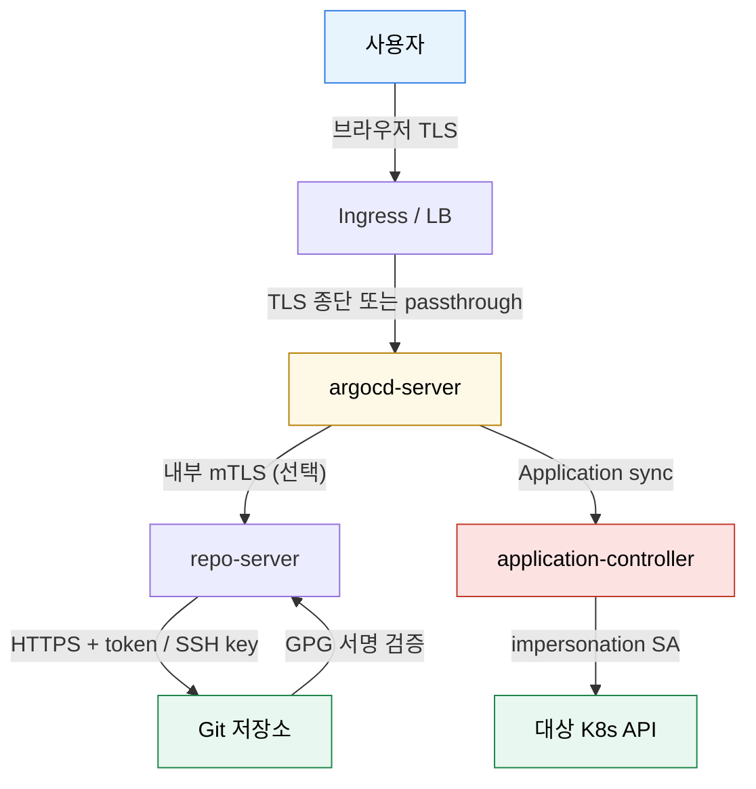

# 보안 운영
---
> GitOps는 배포를 단순화하지만, 저장소와 클러스터를 잇는 통로가 하나로 모인다는 뜻이기도 하다. 그래서 ArgoCD 보안은 UI 로그인만이 아니라 TLS, 저장소 인증, 서명 검증, 권한 위임까지 함께 봐야 한다.


## 학습 목표
> 저장소 신뢰와 sync 권한 경계를 중심으로 본다.

이 장에서 확인할 목표는 다음과 같다:

1. ArgoCD UI/API TLS 구성의 의미를 설명할 수 있다.
2. HTTPS/SSH 저장소 인증과 신뢰 체인을 설명할 수 있다.
3. GPG 서명 검증과 sync impersonation의 목적을 설명할 수 있다.


## 1. 서버와 컴포넌트 간 TLS
> `--insecure`는 편하지만 운영 기본값으로 두면 안 된다.

ArgoCD server는 UI와 API의 진입점이므로 TLS를 기본으로 봐야 한다. ingress를 통한 termination, passthrough, 내부 통신 TLS 여부는 환경에 따라 다르지만, 운영 문서에서는 “왜 암호화가 필요한가”부터 명확히 해 두는 편이 좋다.

단순 학습 환경에서는 self-signed도 가능하지만, 장기 운영 환경에서는 신뢰 가능한 인증서 체계와 갱신 절차가 같이 있어야 한다.


## 2. 저장소 접근 보안
> 결국 ArgoCD는 Git 저장소를 믿고 클러스터를 바꾼다.

저장소 접근은 HTTPS 토큰 방식이나 SSH 키 방식으로 연결할 수 있다. 둘 중 무엇을 택하든 자격증명이 Secret에 저장되고, 저장소 서버의 TLS/호스트 키 신뢰를 별도로 맞춰야 한다.

여러 저장소를 다룬다면 credential template를 통해 공통 자격증명을 묶는 방법도 고려할 수 있다. 하지만 편의성이 곧 과도한 권한 범위로 이어지지 않는지 항상 확인해야 한다.


## 3. 서명 검증과 공급망 신뢰
> Git에 있다는 사실만으로 안전하다고 가정하면 부족하다.

GPG 서명 검증은 커밋이나 태그가 신뢰된 키로 서명됐는지 확인하는 기능이다. GitOps를 공급망 보안 관점에서 강화하려면 “누가 커밋했는가”를 기술적으로 검증하는 단계가 필요하다.

실무에서는 모든 저장소에 바로 적용하기보다, 민감한 운영 매니페스트 저장소부터 시작하는 경우가 많다.


## 4. Sync Impersonation
> ArgoCD가 모든 권한으로 sync하는 구조를 줄이기 위한 장치다.

Impersonation을 사용하면 ArgoCD가 특정 ServiceAccount 권한으로 sync를 수행하게 만들 수 있다. 즉 중앙 컨트롤 플레인이 모든 namespace와 리소스에 무제한 권한을 가지지 않도록 더 잘게 나누는 방식이다.

멀티테넌시가 커질수록 이 기능의 가치가 커진다. 다만 설정 복잡도도 올라가므로, AppProject와 ServiceAccount 설계를 먼저 정한 뒤 도입하는 편이 좋다.


## 5. Mermaid로 보는 신뢰 체인
> 사용자 ↔ ArgoCD ↔ Git ↔ K8s 사이의 모든 구간에 “무엇으로 신뢰를 검증하는가”를 명시한다.



`--insecure`는 위 그림의 첫 번째 TLS 구간을 끄는 옵션이다. 학습 환경에서만 잠깐 쓰고 운영에서는 ingress termination 또는 passthrough로 항상 켠다.


## 6. 저장소 자격증명·GPG 서명·impersonation 예제
> 세 가지 보안 기능을 짧은 매니페스트로 묶어 본다.

```yaml
# repo-credentials.yaml
apiVersion: v1
kind: Secret
metadata:
  name: tps-manifest-repo
  namespace: argocd
  labels:
    argocd.argoproj.io/secret-type: repository
stringData:
  type: git
  url: https://bitbucket.org/okestrolab/tps_manifest.git
  username: jsp98
  password: "<APP_TOKEN>"
---
# gpg-key.yaml — 신뢰할 GPG 공개키
apiVersion: v1
kind: ConfigMap
metadata:
  name: argocd-gpg-keys-cm
  namespace: argocd
data:
  "ABCD1234": |
    -----BEGIN PGP PUBLIC KEY BLOCK-----
    ...
    -----END PGP PUBLIC KEY BLOCK-----
---
# appproject-with-signature.yaml (일부)
apiVersion: argoproj.io/v1alpha1
kind: AppProject
metadata:
  name: trb-app
  namespace: argocd
spec:
  signatureKeys:
    - keyID: ABCD1234                       # 이 키로 서명된 commit/tag만 허용
  destinationServiceAccounts:
    - server: https://kubernetes.default.svc
      namespace: trb-app
      defaultServiceAccount: argocd-sync-trb-app    # impersonation
```

`signatureKeys`가 걸린 Project는 unsigned commit으로 sync가 안 된다. `destinationServiceAccounts`는 sync impersonation 모드로 “중앙 ArgoCD의 cluster-admin 권한”이 아니라 namespace 단위 SA 권한으로 apply하게 만든다.


## 7. 305P 실무 사례 — 자격증명 분리
> 305P는 Bitbucket·Harbor·ArgoCD API 자격증명을 모두 별도 Secret으로 운영한다.

| Secret | 네임스페이스 | 용도 |
|--------|-----------|------|
| `bitbucket-creds` | `trb-oss` | 매니페스트 저장소 read/write (Image Updater) |
| `trb-manifest-repo` | `argocd` | ArgoCD repository Secret (read) |
| `harbor-creds` | `trb-oss`/`trb-app` | ImagePullSecret |
| `argocd-image-updater-secret` | `trb-oss` | ArgoCD API 토큰 |

`apply-app-of-apps.sh`가 부트스트랩 시 `bitbucket-creds`와 `trb-manifest-repo`를 함께 만든다. 자격증명이 환경별로 갈라지면 각 환경의 사고 반경이 분리된다 — 토큰·실제 값은 인프라 스킬 문서 `tps/infra/SKILL.md`, `references/14-v305p-environment.md`에서만 관리한다.


## 다음 단계
> 기본 기능을 넘어서 추가 템플릿 도구와 확장 포인트를 붙일 시점이다.

다음 장에서는 Config Management Plugin과 UI 확장처럼 ArgoCD를 조직 상황에 맞게 확장하는 방법을 본다.


## 관련 문서
> Project, 플러그인, Image Updater와 연결한다.

- [ArgoCD 확장과 플러그인](./04-01.ArgoCD%20확장과%20플러그인.md) — 다음 장
- [인증·인가와 AppProject](./03-01.인증·인가와%20AppProject.md) — 이전 장
- [CI 연동과 Image Updater](./04-02.CI%20연동과%20Image%20Updater.md) — 저장소 자동 갱신과 연결
