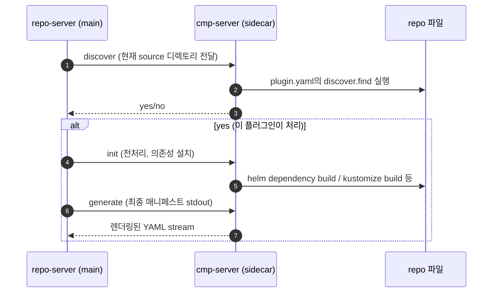

# ArgoCD 확장과 플러그인
---
> Helm과 Kustomize만으로 충분한 경우가 많지만, 실제 조직에서는 자체 렌더링 규칙이나 추가 UI 기능이 필요할 때가 있다. 이 지점이 ArgoCD 확장의 출발점이다.


## 학습 목표
> Config Management Plugin과 UI 확장의 역할을 구분한다.

이 장에서 확인할 목표는 다음과 같다:

1. CMP가 필요한 상황을 설명할 수 있다.
2. sidecar 기반 플러그인 구조를 이해할 수 있다.
3. 내장 기능으로 해결할 수 있는 문제와 확장해야 하는 문제를 구분할 수 있다.


## 1. Config Management Plugin
> 기본 렌더러로 표현하기 어려운 조합이 생기면 CMP를 검토한다.

CMP는 repo-server가 소스를 렌더링할 때 추가 도구나 자체 스크립트를 끼워 넣는 방식이다. 예를 들어 `kustomize + helm` 조합, 사내 템플릿 도구, 특수 전처리 단계가 필요한 경우가 대표적이다.

최신 구조에서는 sidecar 컨테이너 기반 실행이 기본 패턴이다. 이는 repo-server 메인 컨테이너를 과도하게 오염시키지 않는 장점이 있다.


## 2. discover, init, generate
> 플러그인은 결국 “언제 나를 쓸지”와 “무엇을 만들지”를 정의해야 한다.

`discover`는 어떤 소스에서 이 플러그인을 트리거할지 판단한다. `init`은 필요 시 사전 준비를 수행한다. `generate`는 최종 Kubernetes 매니페스트를 stdout으로 만든다.

이 구조를 이해하면 플러그인 문제를 디버깅할 때도 어디서 실패했는지 구분하기 쉽다.


## 3. UI 확장
> 대부분의 운영 문제는 UI 확장이 아니라 운영 규칙 문제인 경우가 많다.

배너, 공지, CSS, 일부 확장 기능을 통해 UI를 다듬을 수는 있다. 하지만 UI 확장은 본질적으로 운영 보조 수단이지 핵심 GitOps 기능이 아니다.

즉 UI 확장을 하기 전에 Project, RBAC, App of Apps, 운영 관측성 같은 기본 구조가 먼저 안정돼 있어야 한다.


## 4. 자주 함께 붙는 확장: Image Updater
> Image Updater는 ArgoCD 본체는 아니지만 실무에서 자주 결합된다.

Image Updater는 레지스트리의 새 이미지 태그를 감지해 Git 값을 갱신하거나 ArgoCD 애플리케이션 파라미터를 수정하는 별도 생태계 도구다. 그래서 플러그인 장에서 존재만 먼저 짚고, 다음 장에서 별도 주제로 다룬다.


## 5. CMP sidecar 흐름 — discover/init/generate
> repo-server에 sidecar 컨테이너로 붙어 매니페스트를 만든다.



세 단계가 분리돼 있어 디버깅이 쉽다. discover는 “내가 처리할 소스인가”, init는 “돌릴 준비가 됐는가”, generate는 “최종 출력은 무엇인가”에 한정된다.


## 6. plugin.yaml 예제
> Helm + Kustomize를 함께 처리하는 사내 플러그인의 최소 spec.

```yaml
# plugin.yaml (cmp-server sidecar 안의 /home/argocd/cmp-server/config/plugin.yaml)
apiVersion: argoproj.io/v1alpha1
kind: ConfigManagementPlugin
metadata:
  name: helm-kustomize
spec:
  version: v1.0
  discover:
    find:
      command: [sh, -c, "ls kustomization.yaml && ls Chart.yaml"]
  init:
    command: [sh, -c, "helm dependency build"]
  generate:
    command:
      - sh
      - -c
      - |
        helm template . --release-name "$ARGOCD_APP_NAME" \
          -f "values/values-${ENV}.yaml" --output-dir _rendered
        kustomize build _rendered/.
```

이 플러그인은 같은 디렉토리에 `Chart.yaml`과 `kustomization.yaml`이 모두 있을 때만 활성화된다. ArgoCD `Application` source에 `plugin: { name: helm-kustomize, env: [{name: ENV, value: ppp}] }`를 명시하면 이 흐름이 호출된다.


## 다음 단계
> 확장 포인트를 봤다면, 이제 CI와 Image Updater를 어떻게 묶는지 실제 자동화 흐름을 봐야 한다.

다음 장에서는 GitOps 흐름에서 CI, 레지스트리, write-back, 자동 sync가 어떻게 이어지는지 정리한다.


## 관련 문서
> Image Updater와 운영 관측성을 함께 본다.

- [CI 연동과 Image Updater](./04-02.CI%20연동과%20Image%20Updater.md) — 다음 장
- [모니터링·알림·HA 운영](./05-01.모니터링·알림·HA%20운영.md) — 운영 관점
- [ArgoCD 접근과 선언적 설정](./01-03.ArgoCD%20접근과%20선언적%20설정.md) — 기본 설정
