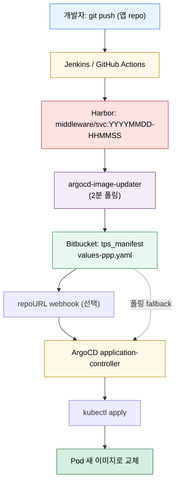

# CI 연동과 Image Updater
---
> GitOps에서는 CI와 CD의 경계를 일부러 나눈다. CI는 빌드와 검증을 맡고, ArgoCD는 Git 상태를 배포한다. Image Updater는 이 둘 사이에서 이미지 태그 변경을 Git에 다시 기록하는 자주 쓰이는 보조 도구다.


## 학습 목표
> CI와 GitOps의 책임 분리, 그리고 Image Updater의 위치를 이해한다.

이 장에서 확인할 목표는 다음과 같다:

1. CI와 ArgoCD의 역할 경계를 설명할 수 있다.
2. polling, webhook, write-back 방식의 차이를 설명할 수 있다.
3. Image Updater를 쓸 때의 장점과 위험을 설명할 수 있다.


## 1. CI와 CD의 경계
> CI가 클러스터에 직접 apply하지 않는 것이 GitOps의 기본 원칙이다.

CI는 이미지를 빌드하고 테스트하며, 결과를 Git 또는 레지스트리에 기록한다. ArgoCD는 Git의 원하는 상태를 읽어 클러스터에 맞춘다. 이 경계를 지키면 배포 기준이 Git 하나로 유지된다.

Webhook은 polling 지연을 줄이는 보조 수단일 뿐, 원칙을 바꾸지는 않는다. 결국 진실 공급원은 Git이다.


## 2. Image Updater는 무엇을 하는가
> 레지스트리의 새 태그를 감지해 Git 값이나 애플리케이션 파라미터를 갱신한다.

Argo CD Image Updater는 ArgoCD 본체가 아니라 별도 생태계 컴포넌트다. 주로 registry를 폴링해 새 태그를 찾고, annotation 규칙에 따라 대상 Application의 이미지 값을 갱신한다.

핵심 동작은 두 가지다. 하나는 Git에 직접 write-back 하는 방식이고, 다른 하나는 ArgoCD 파라미터를 갱신하는 방식이다. GitOps 원칙을 더 일관되게 유지하려면 보통 Git write-back이 더 자연스럽다.


## 3. 왜 조심해야 하나
> 편의 기능이 곧 저장소 경계 문제를 만들 수 있다.

Image Updater의 가장 흔한 실수는 여러 환경이 같은 values 파일을 함께 쓰는 구조다. 이 경우 한 환경의 자동 태그 갱신이 다른 환경 배포 기준까지 바꿔 버릴 수 있다.

따라서 환경별 values 파일, branch, path를 명확히 분리해야 한다. 또한 `allow-tags`, update strategy, 승인 기준을 같이 두지 않으면 너무 공격적으로 최신 태그를 따라가게 될 수 있다.


## 4. 언제 쓰는가
> 모든 팀에 기본으로 깔기보다, 자동 이미지 추적이 정말 필요한 곳에 제한적으로 두는 편이 낫다.

애플리케이션 수가 많고 빌드 빈도가 높아, 사람이 values tag를 갱신하는 비용이 커질 때 Image Updater가 유용하다. 반면 인프라 컴포넌트나 변경 승인 절차가 엄격한 시스템에는 수동 태그 고정이 더 나을 수 있다.

즉 Image Updater는 “편의 자동화”이지 무조건 켜야 하는 기본 기능이 아니다.


## 5. Mermaid로 보는 CI → ArgoCD 흐름
> CI에서 클러스터까지 가는 길에 어떤 컴포넌트가 끼어드는지 한 장에 본다.



이 그림에서 의도적으로 빠진 것은 “CI → 클러스터 직선”이다. 그 선을 그으면 GitOps 원칙이 깨진다. CI는 Harbor까지만, 그 이후는 GitOps 컴포넌트가 책임진다.


## 6. polling vs webhook
> 진실 공급원은 항상 Git이지만, 반응 속도는 트리거 방식에 따라 다르다.

| 방식 | 트리거 | 반응 지연 | 장점 | 단점 |
|------|------|---------|------|------|
| ArgoCD 폴링 | 3분 기본(설정 가능) | 0~3분 | 외부 의존 없음 | 변경 직후 약간 늦음 |
| repoURL webhook | repo의 push 이벤트 | 수 초 | 빠른 반응 | webhook 라우팅·인증 관리 필요 |
| Image Updater 폴링 | 레지스트리 폴링 2분 기본 | 0~2분 | 코드 push 없이 이미지만 바뀐 경우도 감지 | 레지스트리 폴링 부하 |
| Image Updater webhook | 레지스트리 webhook(지원 시) | 수 초 | 가장 빠름 | Harbor/ECR 등 webhook 설정 필요 |

운영 표준은 “webhook을 가능한 곳에 켜고, 폴링은 백업”이다. 폴링만 켜고 webhook이 빠진 환경에서는 평균 반응 지연이 1~5분 사이에서 흔들린다.


## 7. write-back annotation 핵심 키
> Image Updater는 Application 어노테이션으로 “무엇을 어떻게 갱신할지”를 받는다.

| 어노테이션 | 의미 | 예시 |
|-----------|------|------|
| `image-list` | 추적할 이미지 목록(alias=registry/repo) | `auth-api=harbor.../auth-api,common-api=harbor.../common-api` |
| `<alias>.update-strategy` | 새 태그 선정 방식 | `alphabetical`, `semver`, `digest`, `latest` |
| `<alias>.allow-tags` | 허용 태그 패턴 | `regexp:^\d{8}-\d{6}$` |
| `<alias>.helm.image-name` | values 키(이미지 이름) | `auth-api.image.fullname` |
| `<alias>.helm.image-tag` | values 키(태그) | `auth-api.image.tag` |
| `git-branch` | 커밋할 브랜치 | `main` |
| `write-back-method` | 인증·방식 | `git:secret:trb-oss/bitbucket-creds` |
| `write-back-target` | 대상 파일 | `helmvalues:/helm-charts/tps-helm/values/values-ppp.yaml` |

`update-strategy: alphabetical` + `allow-tags: regexp:^\d{8}-\d{6}$` 조합은 “시간순 최신 = 사전순 마지막”이라는 점을 이용한다. `latest` 태그를 별도 운영하지 않아도 안정적이다.

```yaml
# application-trb-app.yaml (어노테이션 부분만)
metadata:
  name: trb-app
  namespace: trb-oss
  annotations:
    argocd-image-updater.argoproj.io/image-list: |
      auth-api=harbor.dev.trombone-v2.okestro.cloud/middleware/auth-api,
      common-api=harbor.dev.trombone-v2.okestro.cloud/middleware/common-api
    argocd-image-updater.argoproj.io/auth-api.update-strategy: alphabetical
    argocd-image-updater.argoproj.io/auth-api.allow-tags: regexp:^\d{8}-\d{6}$
    argocd-image-updater.argoproj.io/auth-api.helm.image-name: auth-api.image.fullname
    argocd-image-updater.argoproj.io/auth-api.helm.image-tag: auth-api.image.tag
    argocd-image-updater.argoproj.io/git-branch: main
    argocd-image-updater.argoproj.io/write-back-method: git:secret:trb-oss/bitbucket-creds
    argocd-image-updater.argoproj.io/write-back-target: "helmvalues:/helm-charts/tps-helm/values/values-ppp.yaml"
```

write-back이 일어나면 매니페스트 repo에 `.argocd-source-trb-app.yaml`이 함께 commit된다. 이 파일은 Updater가 읽기/쓰기 모두를 수행하는 메타 파일이라 Git에 직접 손대지 않는 편이 안전하다.


## 8. 305P 실무 사례 — 12개 서비스 image-list
> 305P `tps_manifest`의 `trb-app` Application은 12개 마이크로서비스를 한 번에 관리한다.

305P 환경에서 사용 중인 핵심 사실은 다음과 같다(상세 매핑·태그 패턴은 인프라 스킬 문서 `tps/infra/references/07-argocd-image-updater.md` 참조).

| 항목 | 값 |
|------|-----|
| Application 이름 | `trb-app` |
| 네임스페이스 | `trb-oss` |
| 관리 서비스 | auth-api, common-api, pipeline-api, workflow-api, pms-api, notificator, ppln-logging-api, scheduler, sse, react-app, storybook, cloud-config (12개) |
| 레지스트리 | `harbor.dev.trombone-v2.okestro.cloud/trb` (또는 `middleware`) |
| 태그 정책 | `alphabetical` + `regexp:^\d{8}-\d{6}$` |
| write-back 대상 | `helm-charts/tps-helm/values/values-dev.yaml` (DEV) |
| 자격증명 Secret | `bitbucket-creds`, `argocd-image-updater-secret`, `harbor-creds` |

운영 디버깅은 다음 명령으로 본다.

```bash
# Image Updater 로그 (이미지 감지/커밋 흐름)
kubectl -n trb-oss logs -l app.kubernetes.io/name=argocd-image-updater -f

# 현재 Pod 이미지 태그
kubectl -n trb-app get deploy \
  -o jsonpath='{range .items[*]}{.metadata.name}{"\t"}{.spec.template.spec.containers[0].image}{"\n"}{end}'

# ArgoCD Application sync 상태
argocd app get trb-app
```

토큰·비밀번호 본문 노출 금지 — 발급/갱신 절차는 인프라 스킬 문서에서만 관리한다.


## 다음 단계
> 자동화와 확장을 붙였으면, 이제 단계별 트래픽 이동까지 묶어 “안전하게 자동 배포”를 완성할 차례다.

다음 장에서는 Argo Rollouts로 Blue-Green/Canary/Progressive Delivery를 어떻게 구현하는지 본다.


## 관련 문서
> 플러그인, Rollouts, 보안 문서를 함께 본다.

- [Argo Rollouts와 배포 전략](./04-03.Argo%20Rollouts와%20배포%20전략.md) — 다음 장
- [마이크로서비스 CI/CD 파이프라인 통합](./04-04.마이크로서비스%20CI_CD%20파이프라인%20통합.md) — 12개 서비스 통합 흐름
- [ArgoCD 확장과 플러그인](./04-01.ArgoCD%20확장과%20플러그인.md) — 이전 장
- [보안 운영](./03-03.보안%20운영.md) — 저장소 자격증명과 신뢰 체계
