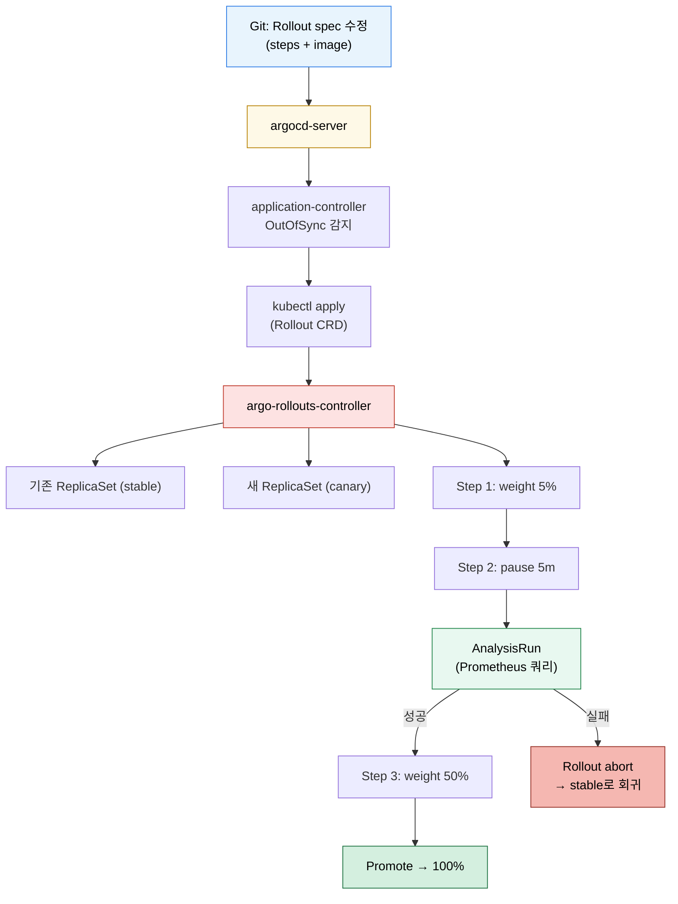

# Argo Rollouts와 배포 전략
---
> ArgoCD가 Git 상태를 클러스터에 맞추는 도구라면, Argo Rollouts는 그 “맞추는 순간”을 어떻게 잘게 쪼개 안전하게 진행할지를 책임지는 도구다. Blue-Green과 Canary는 단순 Deployment 교체를 시간·트래픽 단위로 분해하는 두 가지 대표 방식이다.


## 학습 목표
> Rollouts가 ArgoCD와 어떻게 분업하는지, Blue-Green과 Canary가 실제로 어떤 K8s 리소스를 만드는지 본다.

이 장에서 확인할 목표는 다음과 같다:

1. Deployment 교체와 `Rollout` 리소스의 차이를 설명할 수 있다.
2. Blue-Green과 Canary 전략의 동작 단계를 K8s 리소스 변화 관점에서 설명할 수 있다.
3. AnalysisTemplate이 자동 승격/롤백에 어떻게 끼어드는지 설명할 수 있다.
4. ArgoCD `Application`과 `Rollout`이 reconciliation 흐름에서 어떻게 맞물리는지 설명할 수 있다.


## 1. 왜 Deployment만으로는 부족한가
> Kubernetes의 기본 Deployment는 RollingUpdate를 제공하지만, 트래픽 분리와 자동 검증은 빠져 있다.

기본 Deployment는 새 ReplicaSet을 만들고 점진적으로 Pod를 교체한다. 이 흐름은 단순하지만, “새 버전을 5%만 받아 보고 5분 동안 에러율이 낮은지 확인한 뒤 25%로 늘린다”처럼 시간과 트래픽 비율을 명시적으로 다루기 어렵다. 운영에서 사고가 나는 시점은 보통 “전체 교체가 끝난 직후”인데, 그때는 이미 되돌리기에 늦다.

Argo Rollouts는 이 빈 자리를 메운다. `Rollout` CRD는 Deployment를 대체하는 워크로드 리소스로, 단계별 비율, 일시 정지, 메트릭 기반 자동 승격, 자동 롤백을 spec으로 표현한다. ArgoCD는 그 Rollout을 Git에서 sync해 클러스터에 적용할 뿐이고, 실제 “단계별 교체”는 `argo-rollouts-controller`가 책임진다.


## 2. ArgoCD와 Rollouts의 분업
> 두 컨트롤러가 동시에 한 워크로드를 만지지만 책임 경계는 분명하다.

ArgoCD `application-controller`는 Git의 `Rollout` 매니페스트와 클러스터 상태를 비교해 OutOfSync/InSync를 판정한다. 즉 “지금 클러스터에 이 spec이 있어야 하는가”를 본다. 반면 `argo-rollouts-controller`는 그 spec 안의 단계 정보(`steps:`)를 읽어 ReplicaSet 두 개를 띄우거나, 트래픽을 점진 이동시키거나, 일시 정지하거나, AnalysisRun을 만든다.

여기서 흔히 헷갈리는 포인트는 “sync 직후에 Application이 Healthy가 되지 않는다”는 점이다. ArgoCD가 sync는 성공시켰지만 Rollout이 아직 카나리 중간 단계에 멈춰 있으면, ArgoCD는 그 상태를 그대로 “Progressing”으로 보여 준다. 공식 문서 기준으로 ArgoCD는 `Rollout` health hook을 가지고 있어 Rollout이 완전히 승격되거나 abort돼야 final status가 잡힌다.


## 3. Mermaid로 보는 reconciliation 흐름
> Git → ArgoCD → Rollout → 단계별 트래픽 이동까지 한 흐름으로 본다.



이 그림에서 핵심은 “ArgoCD는 한 번만 apply한다”는 점이다. 단계별로 비율을 바꾸는 일은 Rollouts 컨트롤러 안에서 일어나므로, Git 커밋 한 번이 자동으로 여러 단계를 진행한다.


## 4. Blue-Green 전략
> 두 ReplicaSet을 동시에 띄운 뒤 Service selector를 한 번에 전환한다.

Blue-Green은 “기존 버전(blue)과 새 버전(green)을 동시에 띄우고, 검증이 끝나면 트래픽을 한 번에 green으로 옮긴다”는 패턴이다. Service의 selector를 바꾸는 방식이라 트래픽 분리는 K8s Service 한 개와 미리보기용 Service 한 개로 구현된다.

다음 매니페스트는 미리보기 Service(`preview`)와 실제 Service(`active`)를 분리한 최소 구성이다.

```yaml
# rollout-bluegreen.yaml
apiVersion: argoproj.io/v1alpha1
kind: Rollout
metadata:
  name: web-bluegreen
spec:
  replicas: 4
  strategy:
    blueGreen:
      activeService: web-active
      previewService: web-preview
      autoPromotionEnabled: false       # 운영자가 수동 promote
      scaleDownDelaySeconds: 300        # 옛 ReplicaSet 5분 유지
      prePromotionAnalysis:
        templates:
          - templateName: success-rate
        args:
          - name: service-name
            value: web-preview
  selector:
    matchLabels:
      app: web
  template:
    metadata:
      labels:
        app: web
    spec:
      containers:
        - name: web
          image: harbor.dev.trombone-v2.okestro.cloud/middleware/web:20260425-101500
          ports:
            - containerPort: 8080
```

이 spec을 적용하면 다음 단계가 일어난다.

1. green ReplicaSet이 생성되고 Pod가 Ready가 되면 `web-preview` Service가 green을 가리킨다.
2. `prePromotionAnalysis`의 `success-rate` 템플릿이 5xx 비율을 검사한다. 임계치를 통과하면 promote 후보가 된다.
3. 운영자가 `kubectl argo rollouts promote web-bluegreen`을 실행하거나 ArgoCD UI에서 promote를 누른다.
4. `web-active` Service의 selector가 green으로 옮겨지고, 5분 뒤 blue ReplicaSet이 0으로 스케일다운된다.

`autoPromotionEnabled: false`를 둔 이유는 “검증은 자동, 승격은 사람의 의사결정”으로 책임을 나누기 위해서다.


## 5. Canary 전략
> 같은 Service 안에서 트래픽 비율을 점진 이동시킨다.

Canary는 새 버전 Pod 비율을 점진적으로 늘리며 일정 단계마다 멈춰 검증하는 방식이다. Blue-Green과 달리 Service selector를 바꾸지 않고, 트래픽 라우팅 도구(Ingress, Service Mesh)와 협력해 비율을 조정한다.

```yaml
# rollout-canary.yaml
apiVersion: argoproj.io/v1alpha1
kind: Rollout
metadata:
  name: web-canary
spec:
  replicas: 10
  strategy:
    canary:
      canaryService: web-canary-svc
      stableService: web-stable-svc
      trafficRouting:
        nginx:
          stableIngress: web-ingress
      steps:
        - setWeight: 5
        - pause: { duration: 5m }
        - analysis:
            templates:
              - templateName: success-rate
            args:
              - name: service-name
                value: web-canary-svc
        - setWeight: 25
        - pause: { duration: 10m }
        - setWeight: 50
        - pause: { duration: 10m }
        - setWeight: 100
  selector:
    matchLabels:
      app: web
  template:
    spec:
      containers:
        - name: web
          image: harbor.dev.trombone-v2.okestro.cloud/middleware/web:20260425-101500
```

여기서 `nginx.stableIngress`는 Rollouts가 자동으로 카나리 전용 Ingress 사본을 만들고 `nginx.ingress.kubernetes.io/canary-weight` annotation으로 비율을 조정하게 한다는 뜻이다. Service Mesh(Istio, Linkerd)나 ALB 기반 환경이면 `trafficRouting` 하위 키만 바뀐다.

각 단계가 끝나는 조건은 명시적이다. `setWeight`는 weight 조정 후 즉시 다음 단계로, `pause` 중 `duration`이 없으면 사람이 promote할 때까지 무한 대기, `analysis`는 AnalysisRun이 Successful이 될 때까지 다음 단계로 안 넘어간다.


## 6. AnalysisTemplate으로 자동 검증·롤백
> Rollout 단계 사이에 실제 메트릭을 끼워 넣어 “안전 임계치”를 spec으로 표현한다.

AnalysisTemplate은 Prometheus, Datadog, New Relic, Wavefront, 자체 Web/Job 같은 provider에 쿼리를 던져 결과를 비교한다. Rollout이 어떤 단계에서 이 템플릿을 호출하면 AnalysisRun 인스턴스가 생성되고, 결과가 `Successful`이 아니면 Rollout 전체가 abort돼 자동으로 stable로 회귀한다.

```yaml
# analysis-success-rate.yaml
apiVersion: argoproj.io/v1alpha1
kind: AnalysisTemplate
metadata:
  name: success-rate
spec:
  args:
    - name: service-name
  metrics:
    - name: success-rate
      interval: 30s
      count: 5                          # 30s × 5 = 2.5분 관측
      successCondition: result[0] >= 0.99
      failureLimit: 1
      provider:
        prometheus:
          address: http://prometheus.trb-mgm.svc:9090
          query: |
            sum(rate(http_requests_total{service="{{args.service-name}}",code!~"5.."}[1m]))
              /
            sum(rate(http_requests_total{service="{{args.service-name}}"}[1m]))
```

이 템플릿은 “지난 1분간 5xx가 아닌 요청 비율이 99% 이상인지”를 30초 간격으로 5회 본다. 한 번이라도 99% 미만이면 `failureLimit: 1`에 걸려 Rollout abort. 이 spec 한 장이 “수동 모니터링 → 슬랙 → 운영자 판단” 흐름을 자동화한다.

운영 관점에서 주의할 점은 “쿼리에 새 버전 트래픽이 충분히 잡혀 있어야 한다”는 점이다. `setWeight: 1` 직후 곧바로 분석을 돌리면 표본이 너무 작아 결과가 흔들린다. 보통 `setWeight` 다음 짧은 `pause`로 트래픽이 안정된 뒤 analysis를 둔다.


## 7. Helm 차트 기준 — 어떤 파일이 어떤 리소스를 만드는가
> Argo Rollouts는 자체 Helm 차트(`argo-rollouts`)를 제공하고, 워크로드 차트는 그 위에 `Rollout` 템플릿을 얹는다.

설치 차트(`argoproj/argo-rollouts`)와 워크로드 차트(예: `tps-helm`)는 역할이 다르다. 설치 차트는 컨트롤러 자체를 띄우고, 워크로드 차트는 각 마이크로서비스의 `Rollout` 매니페스트를 만든다.

설치 차트의 디렉토리 구조와 `helm install` 시 만들어지는 K8s 리소스는 다음과 같다.

```
argo-rollouts/                          # Helm chart 루트
├── Chart.yaml                          # name, version, appVersion
├── values.yaml                         # controller.replicas, dashboard.enabled, …
└── templates/
    ├── controller/
    │   ├── deployment.yaml             → Deployment/argo-rollouts
    │   ├── serviceaccount.yaml         → ServiceAccount
    │   ├── clusterrole.yaml            → ClusterRole (Rollout/AnalysisRun 권한)
    │   └── clusterrolebinding.yaml
    ├── crds/                           → CustomResourceDefinition × 6
    │   ├── rollout-crd.yaml            (Rollout)
    │   ├── analysisrun-crd.yaml        (AnalysisRun)
    │   ├── analysistemplate-crd.yaml   (AnalysisTemplate)
    │   ├── clusteranalysistemplate-crd.yaml
    │   ├── experiment-crd.yaml
    │   └── plugin-crd.yaml
    ├── dashboard/                      → Deployment + Service (선택)
    └── notifications/                  → ConfigMap (선택)
```

`helm template argo-rollouts argoproj/argo-rollouts -n argo-rollouts`을 돌리면 위 트리가 K8s 리소스 6종(Deployment, ServiceAccount, ClusterRole, ClusterRoleBinding, CRD 6개, 선택적 Dashboard Service)으로 펼쳐진다. 워크로드 입장에서 의미 있는 결과물은 Rollout/AnalysisTemplate CRD 등록이다.

워크로드 차트(`tps-helm` 같은 우산 차트)에서는 보통 다음 구조로 `Rollout` 템플릿을 둔다.

```
tps-helm/
├── Chart.yaml
├── values.yaml                         # 공통 기본값
├── values/
│   ├── values-ppp.yaml                 # 305P 환경 override
│   ├── values-dev.yaml
│   ├── values-prd.yaml
│   └── values-bok.yaml
└── templates/
    ├── _helpers.tpl
    ├── auth-api/
    │   ├── rollout.yaml                → Rollout/auth-api
    │   ├── service-active.yaml         → Service/auth-api
    │   ├── service-preview.yaml        → Service/auth-api-preview
    │   └── analysistemplate.yaml       → AnalysisTemplate/auth-api-success-rate
    └── pipeline-api/
        └── …
```

`values-ppp.yaml`이 `auth-api.image.tag: 20260425-101500`을 갖고 있으면, `helm template`은 `templates/auth-api/rollout.yaml`의 `{{ .Values.auth-api.image.tag }}` 자리를 채워 최종 Rollout 매니페스트를 출력한다. ArgoCD `Application`은 그 결과를 클러스터에 apply만 한다.


## 8. ArgoCD Application으로 Rollouts 끼워 넣기
> Application 한 개 안에 Deployment 대신 Rollout이 있는 형태다.

```yaml
# application-web.yaml
apiVersion: argoproj.io/v1alpha1
kind: Application
metadata:
  name: web
  namespace: argocd
  finalizers:
    - resources-finalizer.argocd.argoproj.io
spec:
  project: default
  source:
    repoURL: https://bitbucket.org/okestrolab/tps_manifest.git
    targetRevision: main
    path: helm-charts/web
    helm:
      valueFiles:
        - values/values-ppp.yaml
  destination:
    server: https://kubernetes.default.svc
    namespace: trb-app
  syncPolicy:
    automated:
      prune: true
      selfHeal: true
    syncOptions:
      - CreateNamespace=true
      - ApplyOutOfSyncOnly=true
```

`automated.selfHeal`이 켜져 있어도 Rollout 진행 중인 단계까지 자동 sync가 되돌리지는 않는다. ArgoCD는 “Git의 spec과 클러스터의 spec이 같은가”를 보지, “트래픽 비율이 어느 단계인가”까지 비교하지 않기 때문이다. 이 분업이 자동 sync와 점진 배포를 동시에 가능하게 한다.


## 9. 305P 실무 사례
> 305P DEV(`dev.trombone-v2.okestro.cloud`)에는 현재 Argo Rollouts가 모든 서비스에 적용돼 있지는 않다. 본 절은 적용했을 때의 표준 패턴을 정리한다.

305P 환경의 ArgoCD는 `trb-oss/argocd`(v2.12.4)에 위치하고, 매니페스트 저장소는 Bitbucket(`tps_manifest`)이다. 폐쇄망 운영 이관을 가정해 모든 이미지는 Harbor `middleware` 프로젝트(`harbor.dev.trombone-v2.okestro.cloud/middleware/*`) 또는 Nexus 프록시(`nexus.okestro-k8s.com:55000/trombone/*`)에서만 끌어온다.

이 환경에 Rollouts를 도입할 때 표준은 다음과 같다.

1. `argo-rollouts` 차트는 `trb-oss/argo-rollouts` 네임스페이스에 ArgoCD `Application`으로 별도 부트스트랩한다(컨트롤러를 자기 자신이 관리하지 않게 하기 위함).
2. 각 마이크로서비스(`auth-api`, `pipeline-api`, `workflow-api` 등 12개) Helm 템플릿에서 `kind: Deployment`를 `kind: Rollout`으로 바꾸고, Canary 5%/25%/50%/100% steps + Prometheus(`prometheus.trb-mgm.svc:9090`) 기반 AnalysisTemplate을 붙인다.
3. 이미지 태그는 기존 Image Updater 흐름을 유지한다. Updater가 `values-ppp.yaml`에 새 태그를 commit하면 ArgoCD가 sync하고, Rollouts가 자동으로 단계별 progress를 진행한다.
4. Notifications 컨트롤러로 `RolloutAborted` 이벤트를 슬랙/메일로 알린다(자동 롤백이 일어났음을 사람이 빠르게 인지하도록).

비밀번호/토큰 같은 민감 정보는 `bitbucket-creds`, `harbor-creds`, `argocd-image-updater-secret`으로 분리해 본문에서는 마스킹한다. 실제 값은 인프라 스킬 문서에서 관리한다 — `tps/infra/SKILL.md`, `references/14-v305p-environment.md`, `references/07-argocd-image-updater.md`를 참조한다.


## 10. 운영 시 주의 포인트
> 카나리는 안전 장치지만 잘못 설계하면 “느리게 망하는” 배포가 된다.

운영에서 가장 흔히 만드는 함정은 다음 세 가지다.

1. AnalysisTemplate이 너무 느슨하게 잡혀 있어 실제 장애에도 “Successful”이 떨어지는 경우. 임계치는 정상 트래픽의 베이스라인을 측정한 뒤 결정한다.
2. `pause: {}`(무한 대기)를 운영 중간에 두고 사람이 promote를 잊는 경우. 무한 pause는 hotfix 같은 예외 단계에만 쓰고, 일반 step은 `duration`을 명시한다.
3. ArgoCD `selfHeal: true`와 Rollout 일시정지가 충돌하는 것처럼 보이는 경우. 실제로는 충돌하지 않지만, 운영자가 클러스터에서 직접 `kubectl edit rollout`으로 단계 비율을 바꾸면 그 변경은 Git 기준 상태와 달라 OutOfSync가 된다. 단계 변경은 항상 Git에서 하고, 일시 promote/abort는 `kubectl argo rollouts` CLI로만 한다.


## 11. 더 읽을 거리
> 공식 문서와 실무 사례를 모두 확인할 때 시작점.

- ArgoCD Health Hook과 Rollout 연동: <https://argo-cd.readthedocs.io/en/stable/operator-manual/health/> — Application의 Healthy 판정이 Rollout 단계와 어떻게 연결되는지 확인할 때 본다.
- Argo Rollouts Traffic Management: <https://argoproj.github.io/argo-rollouts/features/traffic-management/> — Nginx, Istio, ALB, SMI 별 트래픽 라우팅 차이가 한 페이지에 정리돼 있다.
- Codefresh GitOps Progressive Delivery 가이드: <https://codefresh.io/learn/gitops/progressive-delivery/> — Blue-Green/Canary를 GitOps 흐름과 함께 설명하는 실무 글.


## 다음 단계
> Rollouts 자체를 봤다면, 이제 이걸 마이크로서비스 여러 개와 CI/CD 파이프라인에 어떻게 묶는지 봐야 한다.

다음 장에서는 Jenkins, Harbor, Image Updater, Argo Rollouts, Notifications가 하나의 흐름으로 어떻게 결합되는지, 마이크로서비스(`tps-helm` 12개 서비스) 관점에서 ApplicationSet과 함께 다룬다.


## 관련 문서
> CI/CD 파이프라인, Image Updater, 대규모 운영 문서로 이어진다.

- [마이크로서비스 CI/CD 파이프라인 통합](./04-04.마이크로서비스%20CI_CD%20파이프라인%20통합.md) — 다음 장
- [CI 연동과 Image Updater](./04-02.CI%20연동과%20Image%20Updater.md) — 이전 장의 자동 태그 갱신 흐름
- [대규모 운영과 Progressive Sync](./05-02.대규모%20운영과%20Progressive%20Sync.md) — ApplicationSet 진행 단계 제어
