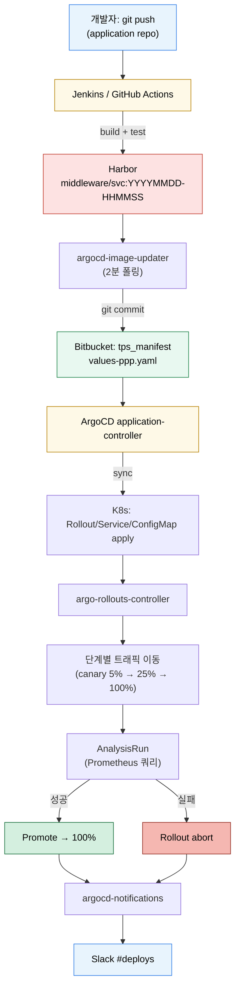

# 마이크로서비스 CI/CD 파이프라인 통합
---
> 마이크로서비스가 12개로 늘면 “한 서비스에 한 Application”이라는 단순 매핑은 운영 부담이 된다. 이 장은 Jenkins/Harbor/Image Updater/ArgoCD/Argo Rollouts/Notifications가 어떻게 한 흐름으로 묶이고, ApplicationSet으로 어떻게 다수 서비스를 일관되게 관리하는지 정리한다.


## 학습 목표
> 마이크로서비스 CI/CD 흐름을 “책임 분리 + 자동화 경계”로 본다.

이 장에서 확인할 목표는 다음과 같다:

1. 코드 push → 컨테이너 이미지 → 매니페스트 갱신 → 클러스터 배포까지 책임이 어떻게 나뉘는지 설명할 수 있다.
2. ApplicationSet generator로 다수 서비스를 어떻게 템플릿화하는지 설명할 수 있다.
3. Notifications와 Rollouts abort 알림을 묶어 운영 가시성을 어떻게 만드는지 설명할 수 있다.
4. 305P `tps_manifest` 구조에서 12개 서비스가 어떤 파일 단위로 갈라지는지 설명할 수 있다.


## 1. 책임 경계 — 누가 무엇을 한다
> CI는 “이미지를 만든다”까지, GitOps는 “Git → 클러스터”까지로 책임이 끊긴다.

책임이 섞이면 디버깅 첫 단계가 “누가 무엇을 했는가”부터 시작해야 한다. 마이크로서비스 환경에서는 그 비용이 빠르게 커진다. 그래서 다음 표처럼 명시적으로 끊는다.

| 단계 | 주체 | 결과물 | 누가 트리거 |
|------|------|--------|-----------|
| 코드 빌드/테스트 | Jenkins / GitHub Actions | jar/war + 컨테이너 이미지 | git push (developer) |
| 이미지 push | CI 잡 | Harbor `middleware/<svc>:YYYYMMDD-HHMMSS` | CI 빌드 성공 |
| 새 태그 감지 | Image Updater | values 파일 commit (`values-ppp.yaml`) | Harbor 폴링(2분 주기) |
| Application sync | ArgoCD | Rollout/Service apply | repoURL webhook 또는 폴링 |
| 단계별 트래픽 이동 | Argo Rollouts | ReplicaSet 비율, AnalysisRun | Rollout spec 변경 |
| 결과 알림 | argocd-notifications | Slack/Mail | sync/health/abort 이벤트 |

이 표를 머릿속에 두면 “배포가 안 됐다”는 보고가 들어왔을 때 어디부터 봐야 할지가 분명해진다. CI 잡 로그 → Harbor 이미지 → Bitbucket commit → ArgoCD UI → Rollout 상태 → Notifications 이벤트 순서다.


## 2. 전체 흐름 — Mermaid로 한 장에
> 코드 push가 마이크로서비스 한 곳에 들어왔을 때 어떤 컴포넌트가 어떤 순서로 깨어나는지 본다.



이 그림에서 의도적으로 빠진 화살표가 하나 있다. CI에서 클러스터로 가는 직선이다. CI가 클러스터에 직접 apply하지 않는다는 점이 이 흐름의 보안·운영 안정성을 만든다.


## 3. CI 단계 — Jenkins 파이프라인 예제
> 빌드/테스트/이미지 push까지가 CI의 책임이다. values 수정은 하지 않는다.

다음은 Jenkins 선언적 파이프라인의 최소 골격이다. `agent`, `withCredentials`, `docker buildx`, `docker push`까지만 처리하고 그 이후는 손대지 않는다.

```groovy
// Jenkinsfile (서비스 repo 루트)
pipeline {
  agent { label 'jenkins-slave' }
  environment {
    HARBOR_REGISTRY = 'harbor.dev.trombone-v2.okestro.cloud'
    HARBOR_PROJECT  = 'middleware'
    SERVICE_NAME    = 'auth-api'
    TAG             = sh(script: "date +'%Y%m%d-%H%M%S'", returnStdout: true).trim()
  }
  stages {
    stage('Build') {
      steps {
        sh './gradlew clean build -x test'
      }
    }
    stage('Test') {
      steps {
        sh './gradlew test jacocoTestReport'
      }
      post {
        always { junit 'build/test-results/test/*.xml' }
      }
    }
    stage('Image push') {
      steps {
        withCredentials([usernamePassword(
          credentialsId: 'harbor-creds',
          usernameVariable: 'HARBOR_USER',
          passwordVariable: 'HARBOR_PASS'
        )]) {
          sh """
            echo "\$HARBOR_PASS" | docker login \$HARBOR_REGISTRY -u "\$HARBOR_USER" --password-stdin
            docker buildx build \
              --platform linux/amd64 \
              -t \$HARBOR_REGISTRY/\$HARBOR_PROJECT/\$SERVICE_NAME:\$TAG \
              --push .
          """
        }
      }
    }
  }
  post {
    failure {
      // CI 실패는 Jenkins → Slack, ArgoCD 흐름과 분리
      slackSend channel: '#ci-fails', message: "${SERVICE_NAME} 빌드 실패: ${BUILD_URL}"
    }
  }
}
```

여기서 의도적으로 뺀 단계가 “Bitbucket 매니페스트 repo에 values-ppp.yaml을 수정하고 push”다. 이 작업은 다음 단계인 Image Updater에 넘긴다. CI가 매니페스트 push까지 하면 같은 시각에 빌드된 두 서비스가 같은 파일을 충돌시키는 문제가 다시 나타난다.


## 4. Image Updater 단계 — 어노테이션으로 정책 표현
> CI는 이미지를 만들고, Updater는 “어떤 태그를 어디에 적을지”를 결정한다.

ArgoCD Image Updater는 `Application` 매니페스트의 어노테이션으로 동작 정책을 받는다. 12개 서비스가 모두 같은 패턴이면 한 Application(`trb-app`)에 모두 모아 둘 수 있다.

```yaml
# argocd-apps/trb-app-application.yaml
apiVersion: argoproj.io/v1alpha1
kind: Application
metadata:
  name: trb-app
  namespace: trb-oss
  annotations:
    argocd-image-updater.argoproj.io/image-list: |
      auth-api=harbor.dev.trombone-v2.okestro.cloud/middleware/auth-api,
      common-api=harbor.dev.trombone-v2.okestro.cloud/middleware/common-api,
      pipeline-api=harbor.dev.trombone-v2.okestro.cloud/middleware/pipeline-api,
      workflow-api=harbor.dev.trombone-v2.okestro.cloud/middleware/workflow-api
    argocd-image-updater.argoproj.io/auth-api.update-strategy: alphabetical
    argocd-image-updater.argoproj.io/auth-api.allow-tags: regexp:^\d{8}-\d{6}$
    argocd-image-updater.argoproj.io/auth-api.helm.image-name: auth-api.image.fullname
    argocd-image-updater.argoproj.io/auth-api.helm.image-tag: auth-api.image.tag
    argocd-image-updater.argoproj.io/git-branch: main
    argocd-image-updater.argoproj.io/write-back-method: git:secret:trb-oss/bitbucket-creds
    argocd-image-updater.argoproj.io/write-back-target: "helmvalues:/helm-charts/tps-helm/values/values-ppp.yaml"
spec:
  project: default
  source:
    repoURL: https://bitbucket.org/okestrolab/tps_manifest.git
    targetRevision: main
    path: helm-charts/tps-helm
    helm:
      valueFiles:
        - values/values-ppp.yaml
  destination:
    server: https://kubernetes.default.svc
    namespace: trb-app
  syncPolicy:
    automated:
      prune: true
      selfHeal: true
```

`update-strategy: alphabetical` + `allow-tags: regexp:^\d{8}-\d{6}$` 조합이 핵심이다. CI가 만드는 태그가 `YYYYMMDD-HHMMSS` 형식이라 사전순 마지막이 곧 시간순 최신이 된다. `latest` 태그를 따로 운영하지 않아도 운영 안정성이 유지된다.


## 5. Helm 차트 기준 — 12개 서비스가 한 차트에 어떻게 들어가는가
> `tps-helm` 같은 우산 차트는 “마이크로서비스별 templates 디렉토리 + values 키 prefix” 구조로 다수 서비스를 묶는다.

다음은 305P `tps-helm`의 표준 디렉토리 트리와 `values-ppp.yaml`이 어떤 키를 채우는지를 보여 주는 구조다.

```
helm-charts/tps-helm/
├── Chart.yaml                          # name: tps-helm, version: 1.x.x
├── values.yaml                         # 모든 서비스 공통 기본값
├── values/
│   ├── values-ppp.yaml                 # 305P 환경 (Harbor middleware 경로)
│   ├── values-dev.yaml
│   ├── values-prd.yaml
│   └── values-bok.yaml                 # 폐쇄망 한국은행 환경
└── templates/
    ├── _helpers.tpl
    ├── auth-api/
    │   ├── rollout.yaml                # → Rollout/auth-api
    │   ├── service.yaml                # → Service/auth-api
    │   ├── service-preview.yaml        # → Service/auth-api-preview
    │   ├── configmap.yaml              # → ConfigMap/auth-api-config
    │   └── analysistemplate.yaml       # → AnalysisTemplate/auth-api-success-rate
    ├── common-api/
    ├── pipeline-api/
    ├── workflow-api/
    ├── pms-api/
    ├── notificator/
    ├── ppln-logging-api/
    ├── scheduler/
    ├── sse/
    ├── react-app/
    ├── storybook/
    └── cloud-config/
```

`values-ppp.yaml`은 12개 서비스를 같은 패턴으로 표현한다.

```yaml
# values-ppp.yaml (요약)
global:
  imagePullSecret: harbor-creds
  prometheusUrl: http://prometheus.trb-mgm.svc:9090

auth-api:
  enabled: true
  image:
    fullname: harbor.dev.trombone-v2.okestro.cloud/middleware/auth-api
    tag: 20260425-101500                # ← Image Updater가 이 줄을 갱신
  replicas: 4
  rollout:
    strategy: canary
    steps:
      - setWeight: 5
      - pause: { duration: 5m }
      - analysis: { templateName: success-rate }
      - setWeight: 50
      - pause: { duration: 10m }
      - setWeight: 100

common-api:
  enabled: true
  image:
    fullname: harbor.dev.trombone-v2.okestro.cloud/middleware/common-api
    tag: 20260425-095200
  replicas: 2
  rollout:
    strategy: bluegreen
    autoPromotionEnabled: false

# pipeline-api, workflow-api, … (나머지 9개 동일 패턴)
```

`helm template tps-helm -f values/values-ppp.yaml`을 돌리면 12개 서비스 × (Rollout + Service + Service-preview + AnalysisTemplate + ConfigMap) ≈ 50여 개 매니페스트가 한 번에 만들어진다. ArgoCD `trb-app` Application은 이 결과 전체를 sync한다.


## 6. ApplicationSet으로 환경별 자동 생성
> 같은 차트를 여러 환경(dev/ppp/prd/bok)에 배포할 때 ApplicationSet이 한 줄에 표현해 준다.

ApplicationSet은 “generator + template” 조합으로 다수 Application을 자동 생성한다. List Generator를 쓰면 환경 목록이 그대로 Application 목록이 된다.

```yaml
# argocd-apps/trb-app-applicationset.yaml
apiVersion: argoproj.io/v1alpha1
kind: ApplicationSet
metadata:
  name: trb-app
  namespace: trb-oss
spec:
  generators:
    - list:
        elements:
          - env: dev
            cluster: https://kubernetes.default.svc
            valuesFile: values/values-dev.yaml
          - env: ppp
            cluster: https://kubernetes.default.svc
            valuesFile: values/values-ppp.yaml
          - env: prd
            cluster: https://prd-cluster.example.com
            valuesFile: values/values-prd.yaml
          - env: bok
            cluster: https://bok-cluster.example.com
            valuesFile: values/values-bok.yaml
  template:
    metadata:
      name: 'trb-app-{{env}}'
    spec:
      project: default
      source:
        repoURL: https://bitbucket.org/okestrolab/tps_manifest.git
        targetRevision: main
        path: helm-charts/tps-helm
        helm:
          valueFiles:
            - '{{valuesFile}}'
      destination:
        server: '{{cluster}}'
        namespace: trb-app
      syncPolicy:
        automated:
          prune: true
          selfHeal: true
  strategy:
    type: RollingSync
    rollingSync:
      steps:
        - matchExpressions:
            - key: env
              operator: In
              values: ['dev']
        - matchExpressions:
            - key: env
              operator: In
              values: ['ppp']
        - matchExpressions:
            - key: env
              operator: In
              values: ['prd', 'bok']
```

`strategy.RollingSync`가 환경 단위 Progressive Sync를 만든다. dev에서 sync가 끝나야 ppp가 시작되고, ppp가 끝나야 prd/bok가 동시에 진행된다. 이 흐름을 사람이 검토 + 승인하는 PR 게이트와 결합하면 환경 프로모션이 “Git PR 한 번 + ApplicationSet 단계 통과” 두 단계로 단순해진다.


## 7. 알림과 운영 가시성 — argocd-notifications
> 자동 배포가 늘어날수록 “모를 때가 위험한 때”가 된다.

`argocd-notifications`는 Application 이벤트(`on-deployed`, `on-health-degraded`, `on-sync-failed` 등)를 webhook/Slack/Email로 보낸다. Rollouts abort까지 잡으려면 별도 트리거를 추가한다.

```yaml
# argocd-notifications-cm.yaml (일부)
apiVersion: v1
kind: ConfigMap
metadata:
  name: argocd-notifications-cm
  namespace: trb-oss
data:
  service.slack: |
    token: $slack-token
  template.app-deployed: |
    message: |
      :tada: {{.app.metadata.name}} 배포 성공
      revision: {{.app.status.sync.revision}}
  template.app-sync-failed: |
    message: |
      :warning: {{.app.metadata.name}} sync 실패
      reason: {{.app.status.operationState.message}}
  template.rollout-aborted: |
    message: |
      :rotating_light: {{.rollout.metadata.name}} canary 자동 롤백
      reason: {{.rollout.status.message}}
  trigger.on-deployed: |
    - when: app.status.operationState.phase in ['Succeeded']
      send: [app-deployed]
  trigger.on-sync-failed: |
    - when: app.status.operationState.phase in ['Failed', 'Error']
      send: [app-sync-failed]
  subscriptions: |
    - recipients: [slack:deploys]
      triggers: [on-deployed, on-sync-failed]
```

운영 관점에서 가장 중요한 트리거는 `on-sync-failed`와 `rollout-aborted` 두 개다. 성공 알림은 노이즈가 되기 쉬워 채널을 분리(`#deploys-success`)하거나 일별 요약으로 묶는 편이 낫다.


## 8. 305P 실무 사례 — 12개 서비스 운영 패턴
> 실제 305P `tps_manifest` 구조에서 어떤 파일이 어떤 책임을 갖는지 정리한다.

305P DEV 환경의 매니페스트 저장소는 Bitbucket `tps_manifest`이고, ArgoCD는 `trb-oss/argocd`(v2.12.4)에서 이를 sync한다. 다음 표는 본 장에서 언급한 컴포넌트가 각각 어디에 위치하는지를 한눈에 보여 준다.

| 컴포넌트 | 위치 | 비고 |
|---------|------|------|
| 매니페스트 저장소 | `bitbucket.org/okestrolab/tps_manifest` | 단일 monorepo |
| 우산 차트 | `helm-charts/tps-helm/` | 12개 서비스 묶음 |
| 환경별 values | `helm-charts/tps-helm/values/values-{ppp,dev,prd,bok}.yaml` | Image Updater 갱신 대상 |
| Application | `argocd-apps/app-of-apps/<env>/trb-app-application.yaml` | env별 한 개 |
| ApplicationSet(선택) | `argocd-apps/applicationset/trb-app-applicationset.yaml` | RollingSync 환경 프로모션 |
| 부트스트랩 스크립트 | `argocd-apps/apply-app-of-apps.sh` | bitbucket-creds + repo Secret + apply |
| Image Updater | `argocd-apps/image-updater/` | `trb-oss` 네임스페이스 |
| 알림 | `argocd-notifications-cm` ConfigMap | Slack token Secret 분리 |
| Prometheus(분석용) | `prometheus.trb-mgm.svc:9090` | AnalysisTemplate provider |
| Harbor | `harbor.dev.trombone-v2.okestro.cloud/middleware` | `harbor-creds` ImagePullSecret |

12개 서비스 목록과 image-list 어노테이션 전문은 인프라 스킬 문서 `tps/infra/references/07-argocd-image-updater.md`에 있다. 본 장에서는 패턴만 인용한다(토큰·비밀번호는 본문에 노출하지 않는다).

운영 시점에 “이미지가 안 바뀐다”는 보고가 들어오면 다음 순서로 확인한다.

1. Harbor에 새 태그가 올라왔는가? (`harbor UI → middleware/<svc> → tags`)
2. Image Updater 로그에 새 태그 감지 줄이 있는가? (`kubectl -n trb-oss logs -l app.kubernetes.io/name=argocd-image-updater`)
3. Bitbucket `values-ppp.yaml`에 새 commit이 있는가?
4. ArgoCD Application이 OutOfSync인가? (`argocd app get trb-app`)
5. Rollout이 단계 중간에 멈춰 있지는 않은가? (`kubectl argo rollouts get rollout <svc>`)


## 9. 흔한 함정과 회피 패턴
> 마이크로서비스가 늘어나면 “구조 결함은 늦게 드러난다”는 점이 더 강하게 작용한다.

운영하면서 자주 마주치는 세 가지를 미리 정리해 둔다.

1. 환경별 values를 한 파일에 몰아넣는 구조. dev/ppp가 같은 `values-shared.yaml`을 쓰면 dev의 자동 태그 갱신이 곧바로 ppp 운영을 흔든다. 환경별 파일 분리는 비용이 아니라 안전 장치다.
2. CI가 매니페스트 repo에 동시 push. 12개 서비스가 같은 시각에 빌드되면 race가 난다. CI는 Harbor push까지만 하고, values 갱신은 Image Updater에 일임한다.
3. 단일 거대 Application. 12개 서비스를 한 Application으로 묶으면 Sync 한 번이 모든 서비스를 동시에 건드린다. ApplicationSet으로 서비스 단위 또는 환경 단위로 쪼개고, App of Apps는 부트스트랩 단계에만 쓴다.


## 10. 더 읽을 거리
> 실무 글을 빠르게 둘러볼 때 시작점.

- ArgoCD ApplicationSet Progressive Syncs: <https://argo-cd.readthedocs.io/en/stable/operator-manual/applicationset/Progressive-Syncs/> — 환경 단위 RollingSync의 트리거 조건과 실패 시 동작이 정리돼 있다.
- ArgoCD Notifications Catalog: <https://argo-cd.readthedocs.io/en/stable/operator-manual/notifications/catalog/> — 트리거·템플릿 표준 카탈로그.
- Akuity “How we deploy 800 microservices with ArgoCD”: <https://akuity.io/blog/> — 대규모 마이크로서비스 운영 사례. 본 장에서 언급한 책임 분리·ApplicationSet 패턴이 실제 어디까지 확장되는지 감을 잡을 때 본다.


## 다음 단계
> 운영 자동화를 끝까지 묶었다면, 이제 ArgoCD 자체를 어떻게 관측·고가용으로 운영할지로 시야를 넓힌다.

다음 장에서는 Prometheus 메트릭, Notifications 운영, HA, 샤딩처럼 ArgoCD 자체의 운영 관측성과 내구성을 본다.


## 관련 문서
> Image Updater, Rollouts, GitOps 성숙도 문서를 함께 본다.

- [모니터링·알림·HA 운영](./05-01.모니터링·알림·HA%20운영.md) — 다음 장
- [Argo Rollouts와 배포 전략](./04-03.Argo%20Rollouts와%20배포%20전략.md) — 이전 장
- [GitOps 성숙도와 미래 고려사항](./05-03.GitOps%20성숙도와%20미래%20고려사항.md) — 환경 프로모션 설계 확장
