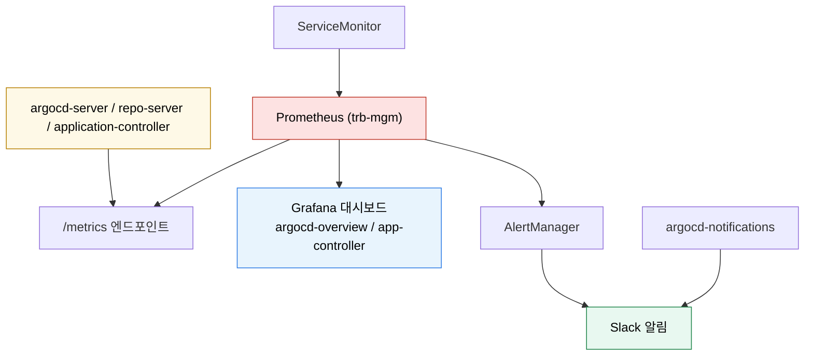

# 모니터링·알림·HA 운영
---
> ArgoCD UI는 편하지만 운영 체계의 전부는 아니다. 메트릭, 알림, 고가용성, 샤딩을 같이 봐야 실제 플랫폼 도구로 쓸 수 있다.

## 학습 목표
> 운영 관측성과 내구성 중심으로 본다.

이 장에서 확인할 목표는 다음과 같다:

1. ArgoCD 메트릭과 알림을 왜 별도로 운영해야 하는지 설명할 수 있다.
2. HA 구성이 필요한 시점을 설명할 수 있다.
3. 샤딩이 어떤 문제를 풀기 위한 것인지 설명할 수 있다.

## 1. 모니터링과 알림
> 상태 UI만으로는 추세와 경보를 다 잡을 수 없다.

Prometheus와 ServiceMonitor를 통해 ArgoCD 메트릭을 수집하면 sync 실패, reconciliation 지연, component 상태를 장기적으로 볼 수 있다. Notifications를 붙이면 sync 성공/실패, health degraded 같은 이벤트를 Slack, Mattermost, 이메일로 보낼 수 있다.

운영에서 중요한 것은 “누가 UI를 보고 있지 않아도 이상 상황이 알려지는가”다.

## 2. 고가용성
> 운영 의존도가 높아질수록 single replica 구조는 위험해진다.

여러 팀이 ArgoCD를 공유하거나 배포 의존도가 높아지면 HA 구성을 검토해야 한다. 특히 `repo-server`, `server`, `applicationset-controller`, `notifications-controller`는 공유 부담이 커질 수 있다.

다만 `application-controller`는 상태와 동작 방식이 다르므로 단순히 replica 수만 늘리는 문제가 아니다. 공식 문서를 기준으로 어떤 구성요소가 어떻게 scale되는지 따로 이해해야 한다.

## 3. 샤딩
> 여러 클러스터와 앱을 한꺼번에 다루면 컨트롤러 부하를 나눌 필요가 생긴다.

샤딩은 여러 application-controller 인스턴스에 클러스터 또는 앱 부하를 분산하는 방식이다. 앱 수와 원격 클러스터 수가 많아질수록 controller 병목이 생기므로, 단순 scale-up만으로는 한계가 올 수 있다.

샤딩은 일찍부터 필요한 기능은 아니다. 보통 “앱이 많아서 느리다”가 아니라 “controller 부하가 구조적으로 커졌다”는 신호가 있을 때 검토한다.

## 4. metrics 수집 흐름
> Prometheus → ServiceMonitor → ArgoCD `/metrics` 엔드포인트.

운영에서 자주 보는 핵심 메트릭은 다음과 같다.

| 메트릭 | 의미 | 경고 임계값 예시 |
|-------|------|---------------|
| `argocd_app_info{sync_status="OutOfSync"}` | OutOfSync 앱 수 | 30분 이상 지속 시 알림 |
| `argocd_app_reconcile_bucket` | reconciliation 지연 분포 | p99 > 30s |
| `argocd_app_sync_total{phase="Failed"}` | sync 실패 카운트 | 5분 5회 |
| `argocd_repo_request_total{request_type="git"}` | repo-server git 호출 | 비정상 폭증 시 알림 |

## 5. HA 컴포넌트 확장 모델
> replica를 늘리는 방식이 컴포넌트마다 다르다.

| 컴포넌트 | 확장 키 | 비고 |
|---------|--------|------|
| argocd-server | `server.replicas` | stateless, LB 앞단으로 분산 |
| argocd-repo-server | `repoServer.replicas` | stateless, 캐시는 replica별 |
| argocd-application-controller | `controller.replicas` + 샤딩 | StatefulSet, 샤드 단위 분산 |
| argocd-applicationset-controller | leader-election 활성화 | 활성 1, 대기 N |
| argocd-notifications-controller | leader-election 활성화 | 동일 |
| redis | `redis-ha.enabled: true` (sentinel) | 세션·캐시 손실 시 영향도 큼 |

`application-controller`만 단순 replica 증가가 아닌 점을 한 번 더 짚는다. 클러스터 N대를 한 ArgoCD가 본다면 controller replica를 2~4로 두고 `--shard` 분배가 표준이다.

## 다음 단계
> 운영 규모가 커지면 여러 앱을 동시에 안전하게 rollout하는 문제가 남는다.

다음 장에서는 App of Apps, ApplicationSet, Progressive Sync를 scale 관점에서 다시 묶어 본다.

## 관련 문서
> 설치, 대규모 운영, 자동화 문서를 같이 둔다.

- [대규모 운영과 Progressive Sync](./05-02.대규모%20운영과%20Progressive%20Sync.md) — 다음 장
- [마이크로서비스 CI/CD 파이프라인 통합](./04-04.마이크로서비스%20CI_CD%20파이프라인%20통합.md) — 이전 장
- [ArgoCD 설치와 아키텍처](./01-02.ArgoCD%20설치와%20아키텍처.md) — 컴포넌트 배경
- [CI 연동과 Image Updater](./04-02.CI%20연동과%20Image%20Updater.md) — 자동 태그 갱신
