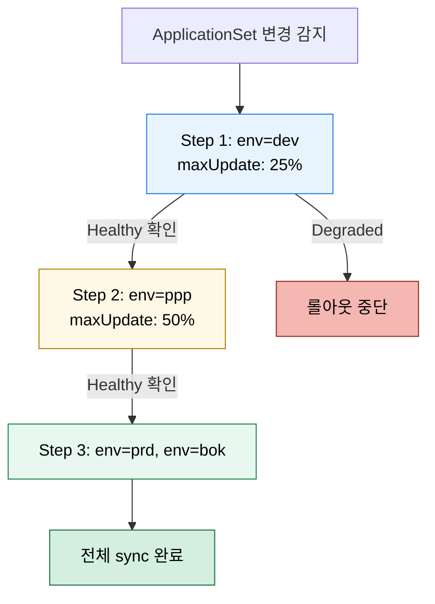

# 대규모 운영과 Progressive Sync
---
> 앱 수가 커지면 단일 Application 관점의 sync 전략만으로는 부족하다. 여러 Application을 어떤 순서와 묶음으로 rollout할지 별도 전략이 필요하다.


## 학습 목표
> scale 상황에서 App of Apps, ApplicationSet, Progressive Sync의 관계를 정리한다.

이 장에서 확인할 목표는 다음과 같다:

1. 대규모 환경에서 Application이 자율적이라는 특성이 왜 문제가 되는지 설명할 수 있다.
2. App of Apps와 ApplicationSet을 scale 관점에서 비교할 수 있다.
3. Progressive Sync의 목적과 제약을 설명할 수 있다.


## 1. 대규모에서 생기는 문제
> 수십 개 앱을 넘어서면 “각 앱이 알아서 sync”하는 구조가 병목이 된다.

Application은 기본적으로 서로의 상태를 모른다. 그래서 DB, backend, frontend처럼 의존성이 있는 여러 앱을 한꺼번에 sync하면 순서 문제와 클러스터 부하 문제가 같이 생긴다.

이 문제를 해결하려면 앱 간 계층, 생성 규칙, rollout 그룹을 별도로 설계해야 한다.


## 2. App of Apps와 ApplicationSet의 역할 차이
> 둘 다 여러 앱을 다루지만 scale 포인트가 다르다.

App of Apps는 운영자가 계층 구조를 직접 설계하는 데 강하다. ApplicationSet은 많은 앱을 규칙 기반으로 생성하는 데 강하다. 따라서 플랫폼 부트스트랩이나 공용 스택은 App of Apps가 이해하기 쉽고, 수백 개 서비스/클러스터 매핑에는 ApplicationSet이 더 자연스럽다.


## 3. Progressive Sync
> 한 번에 다 sync하지 않고 그룹별로 순차 rollout한다.

Progressive Sync는 특히 ApplicationSet에서 생성된 많은 Application을 여러 단계로 나눠 배포할 때 의미가 있다. 한꺼번에 전체 sync를 때리는 대신 일부 그룹부터 순차적으로 진행한다.

이 기능은 readiness, health check, generator 구조가 함께 맞아야 의미가 있다. 즉 Progressive Sync만 켠다고 안전해지는 것이 아니라, 앱 상태 판별이 먼저 정확해야 한다.


## 4. 운영 판단 기준
> 문제를 만든 다음 기능을 찾는 것이 아니라, 구조 단계에서 선택해야 한다.

앱 수가 적고 사람이 구조를 명시적으로 보고 관리할 수 있으면 App of Apps가 단순하다. 앱 수가 많고 반복 생성이 핵심이면 ApplicationSet이 낫다. 앱 수가 매우 많고 동시 rollout이 부담이면 Progressive Sync까지 검토한다.

즉 세 기능은 경쟁 관계가 아니라 규모와 목적에 따라 층위가 다르다.


## 5. RollingSync 단계 다이어그램
> ApplicationSet이 만든 Application 묶음을 단계로 끊어 rollout한다.



각 단계의 “다음으로 넘어가는 조건”이 단순 시간 대기가 아니라 “이전 단계 Application들의 Healthy 상태”라는 점이 핵심이다. AnalysisTemplate(04-03)과 결합하면 자동 검증까지 묶을 수 있다.


## 6. ApplicationSet RollingSync 예제
> List generator + RollingSync로 환경 프로모션을 한 ApplicationSet에 표현한다.

```yaml
# applicationset-progressive.yaml (요지)
spec:
  generators:
    - list:
        elements:
          - { env: dev, valuesFile: values/values-dev.yaml }
          - { env: ppp, valuesFile: values/values-ppp.yaml }
          - { env: prd, valuesFile: values/values-prd.yaml }
          - { env: bok, valuesFile: values/values-bok.yaml }
  strategy:
    type: RollingSync
    rollingSync:
      steps:
        - matchExpressions: [{ key: env, operator: In, values: [dev] }]
          maxUpdate: 100%
        - matchExpressions: [{ key: env, operator: In, values: [ppp] }]
          maxUpdate: 100%
        - matchExpressions: [{ key: env, operator: In, values: [prd, bok] }]
          maxUpdate: 50%
```

`maxUpdate`는 “해당 단계에서 동시에 업데이트할 Application 비율”이다. prd/bok처럼 영향도가 큰 환경은 50%로 두고 한 번 더 안전 단계를 만든다.


## 다음 단계
> 마지막으로 저장소 구조, 프로모션 방식, GitOps 성숙도 관점에서 전체 체계를 돌아본다.

다음 장에서는 monorepo/polyrepo, rendered manifests, 환경 프로모션 같은 장기 운영 관점을 정리한다.


## 관련 문서
> App of Apps, 운영, GitOps 성숙도 문서를 연결한다.

- [GitOps 성숙도와 미래 고려사항](./05-03.GitOps%20성숙도와%20미래%20고려사항.md) — 다음 장
- [App of Apps와 ApplicationSet](./02-03.App%20of%20Apps와%20ApplicationSet.md) — 이전 장
- [모니터링·알림·HA 운영](./05-01.모니터링·알림·HA%20운영.md) — controller 부하와 운영 기반
