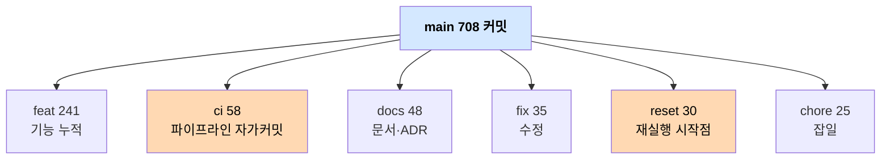
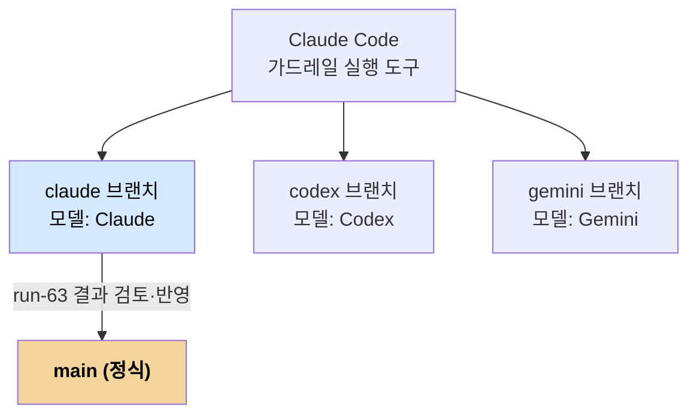

# git 이력 흐름 해부 — 708 커밋의 정체
---
> notiflex-platform의 708개 커밋이 어떻게 쌓였는지 추적합니다. 결론부터 말하면, 한 번의 선형 빌드가 아니라 같은 책 가드레일을 63회 재실행한 흔적이 한 이력에 누적된 구조입니다.

## 핵심 요약

main 브랜치에 708개 커밋이 있는데, 정작 만든 결과물은 Go 앱 한 개와 쿠버네티스 매니페스트 수십 개뿐입니다. 이 불균형이 첫 번째 단서입니다. 작은 결과물에 비해 커밋이 지나치게 많다면, 같은 작업을 여러 번 반복했다는 뜻입니다. 실제로 `reset: run-NN 시작` 형태의 커밋을 따라가면 run-01부터 run-63까지 번호가 매겨진 재실행 기록이 나옵니다.

이 노트가 답하려는 질문은 하나입니다. 708개 커밋은 어떤 층으로 쌓여 있는가? 답은 세 층입니다. 챕터 마일스톤(사람이 책 진도에 맞춰 찍은 결과), 재실행 리셋(같은 작업의 N회차 시작점), CI 자가커밋(파이프라인이 스스로 남긴 배포 기록)입니다.

## 전체 윤곽

먼저 숫자로 윤곽을 잡겠습니다. 아래 값은 저장소를 클론해 git 명령으로 직접 확인한 실측치입니다.

| 항목 | 값 |
|------|-----|
| main 커밋 수 | 708 |
| 브랜치별 커밋 | claude 630 · codex 647 · gemini 668 |
| 작성 기간 | 2026-04-04 ~ 2026-06-12 |
| 주 저자 | Hoon Jo (사람) 658 + github-actions[bot] 53 |
| 확인된 재실행 | run-01 ~ run-63 |

커밋 메시지의 타입 분포를 보면 이력의 성격이 드러납니다. `feat:`가 241개로 가장 많은 것은 기능을 한 겹씩 붙였다는 뜻이라 자연스럽습니다. 그런데 `reset:`이 30개, `ci:`가 58개라는 점이 평범한 프로젝트와 다릅니다. 보통 프로젝트는 저장소를 리셋할 일이 거의 없고, CI가 직접 커밋을 남기지도 않습니다.

## 첫 번째 층 — 챕터 마일스톤

가장 위에 있는 층은 사람이 책 진도에 맞춰 찍은 결과 커밋입니다. 커밋 메시지에 `(ch3)`, `ch5:`, `(ch8)` 같은 챕터 태그가 붙어 있어 어느 챕터의 산출물인지 바로 보입니다.

ch2에서 맨몸 Go 앱과 첫 배포로 시작해 챕터마다 한 가지 인프라 역량을 더합니다. ch3은 ArgoCD와 GitHub Actions(GitOps·CI), ch4는 관측성 스택, ch5는 Gateway API와 무중단 배포, ch6은 캐시·시크릿·Canary, ch7은 멀티 노드풀과 멀티테넌시, ch8은 Kafka와 트레이싱입니다. ch9는 회고와 온보딩 문서로 마무리합니다.

왜 챕터 태그를 커밋에 박아 두었을까요? 학습 저장소에서는 "이 변경이 책 어느 단계의 결과인가"를 나중에 찾을 수 있어야 하기 때문입니다. 태그가 없으면 수백 개 커밋 속에서 ch6 결과를 찾으려고 메시지를 일일이 읽어야 합니다.

## 두 번째 층 — 재실행 리셋

두 번째 층이 이 저장소를 특별하게 만드는 핵심입니다. `reset: run-NN 시작 — 저장소 초기화` 커밋은 "지금부터 N번째 재실행을 처음부터 시작한다"는 표식입니다. 확인된 번호만 run-01, 02, 32, 33, 34, 36, 41, 50~53, 55~63으로, 최대 번호가 63입니다.

즉 같은 책 가드레일을 같은 AI에게 주고 처음부터 끝까지 63번 돌렸습니다. 매번 저장소를 초기 상태로 되돌린 뒤 ch2~ch9를 다시 밟게 한 것입니다. 그래서 영어 `feat: add Valkey cache integration (ch6)`와 한국어 `ch6: Valkey 연동 — 인메모리 카운터를 Valkey INCR로 전환` 같은 같은 작업의 다른 표현이 이력에 여러 벌 등장합니다. 한 벌이 아니라 여러 회차가 겹쳐 쌓인 결과입니다.

> 비유하자면 요리 경연을 같은 레시피로 63번 반복한 녹화본입니다. 매 회차 주방을 비우고(reset) 같은 레시피(가드레일)로 같은 요리(ch2~ch9)를 만들게 한 뒤, 회차마다 결과가 얼마나 일관되는지 확인하는 셈입니다.

왜 63번이나 돌렸을까요? 재현성을 증명하기 위해서입니다. AI가 인프라를 한 번 성공적으로 구성했다고 해서 그게 실력인지 운인지 알 수 없습니다. 같은 지침으로 수십 번 같은 결과에 도달해야 "이 가드레일은 신뢰할 수 있다"고 말할 수 있습니다.

## 세 번째 층 — CI 자가커밋

세 번째 층은 사람이 아니라 파이프라인이 남긴 커밋입니다. `ci: update image to sha-XXXXXXX` 형태로 38개가 있고, github-actions[bot]이 저자입니다.

이 커밋이 생기는 이유는 GitOps 루프 때문입니다. 개발자가 `app/` 코드를 push하면 GitHub Actions가 이미지를 빌드·푸시한 뒤, 매니페스트의 이미지 태그를 새 SHA로 바꾸고 그 변경을 **스스로 커밋해 push**합니다. 그러면 ArgoCD가 바뀐 매니페스트를 감지해 자동 배포합니다. 이 자가커밋 메커니즘은 [03_gitaiops-method](./03_gitaiops-method.md)에서 자세히 다룹니다.

이력에 `merge: resolve CI SHA conflict` 커밋이 여러 개 보이는 것도 이 때문입니다. 사람이 다음 작업을 push하려는데 CI 봇이 먼저 이미지 태그를 바꿔 커밋해 두면 충돌이 납니다. 그 충돌을 풀면서 "어느 버전 태그를 살릴지" 결정한 흔적이 merge 커밋으로 남았습니다.

## 브랜치 구조와 main의 정체

브랜치는 main 외에 claude·codex·gemini 세 개가 더 있습니다. 셋 다 Claude Code를 실행 도구로 쓰되, 연결한 모델만 다릅니다(Claude·Codex·Gemini). 같은 가드레일을 다른 두뇌로 실행한 결과를 브랜치별로 보존한 것입니다.

main의 정체가 흥미롭습니다. claude 브랜치가 main의 조상이고, main 최상단에 `merge: claude 브랜치 결과를 main에 반영 (run-63 — ADR-001~016 완성)` 커밋이 있습니다. 즉 main은 별도로 만든 브랜치가 아니라 **claude 브랜치의 run-63 결과를 검토해 반영한 것**입니다. 63회 중 마지막 회차가 정식 결과로 채택됐다는 뜻입니다.

각 브랜치가 main과 얼마나 다른지는 [04_ai-agent-comparison](./04_ai-agent-comparison.md)에서 수치로 비교합니다. 미리 한 줄로 말하면, claude는 main에 거의 그대로 반영됐고(차이 1줄) codex·gemini는 자기만의 구현 디테일을 더 갖고 있습니다.

## 면접에서 말한다면

이 저장소의 이력 구조를 한 문장으로 설명하면 이렇습니다. "708개 커밋은 한 번의 선형 빌드가 아니라, 같은 책 가드레일을 AI가 63회 재실행한 기록이 챕터 마일스톤·리셋 표식·CI 자가커밋 세 층으로 한 이력에 누적된 것이고, main은 그중 마지막 회차를 검토해 채택한 결과입니다."

이력을 읽을 때 커밋 수의 절대값보다 **커밋 타입의 분포**를 먼저 보면 저장소의 성격이 빠르게 잡힙니다. `reset:`이 많으면 반복 실험, `ci:`가 사람보다 많으면 자동화된 GitOps, `feat:`이 챕터 태그와 함께면 학습용 누적 빌드라는 식입니다.

## 핵심 개념 체크리스트

- [ ] 커밋 수보다 커밋 타입 분포가 저장소 성격을 더 잘 드러내는 이유를 설명할 수 있는가?
- [ ] `reset: run-NN` 커밋이 무엇을 의미하고 왜 63회나 반복했는지 말할 수 있는가?
- [ ] CI 자가커밋(`ci: update image`)이 GitOps 루프에서 어떤 역할을 하는지 설명할 수 있는가?
- [ ] main이 claude 브랜치의 run-63 결과라는 관계를 그릴 수 있는가?
