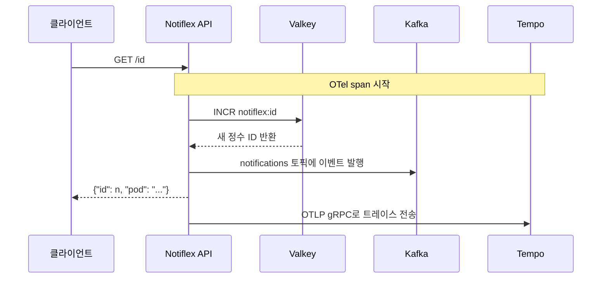
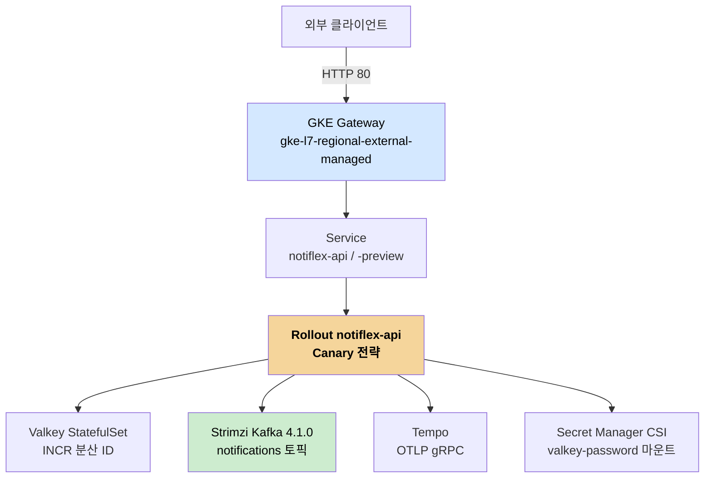

# 기술 아키텍처 구성 — ch2에서 ch9까지의 누적
---
> Notiflex 플랫폼이 맨몸 Go 앱에서 멀티테넌트 클라우드 네이티브 시스템으로 어떻게 한 겹씩 자라는지 추적합니다. 핵심은 챕터마다 인프라 역량을 정확히 하나씩 더한다는 점입니다.


## 핵심 요약

이 저장소의 아키텍처는 처음부터 완성형으로 그려진 게 아니라 챕터를 따라 누적됩니다. ch2의 출발점은 외부 의존성이 없는 154줄짜리 Go HTTP 서버입니다. ch8에 도달하면 같은 앱이 Valkey로 분산 ID를 만들고, Kafka로 이벤트를 발행하고, OpenTelemetry로 트레이스를 보내는 시스템이 됩니다.

왜 이렇게 한 겹씩 쌓을까요? 학습 저장소이기 때문입니다. 완성된 아키텍처를 한꺼번에 보여주면 각 구성요소가 왜 필요한지 보이지 않습니다. 캐시가 없을 때의 문제를 겪어야 캐시를 왜 넣는지 이해되고, 무중단 배포가 없을 때의 위험을 알아야 Rollouts를 왜 쓰는지 납득됩니다.


## 출발점 — ch2의 맨몸 앱

앱은 Go 표준 라이브러리만 씁니다. 웹 프레임워크도, ORM도 없습니다. 이미지는 `scratch` 베이스에 컴파일된 바이너리 하나만 넣는 멀티스테이지 빌드라, 운영체제 파일조차 없는 최소 컨테이너입니다.

```dockerfile
# app/Dockerfile — 빌드 단계와 실행 단계를 분리
FROM golang:1.25-alpine AS builder
WORKDIR /app
COPY go.mod go.sum ./
COPY main.go .
RUN CGO_ENABLED=0 GOOS=linux go build -o notiflex-api .

FROM scratch
COPY --from=builder /app/notiflex-api /notiflex-api
EXPOSE 8080
ENTRYPOINT ["/notiflex-api"]
```

왜 `scratch` 베이스일까요? 공격 표면과 이미지 크기를 최소화하기 위해서입니다. 셸도 패키지 관리자도 없으니 컨테이너에 침입해도 쓸 도구가 없고, 이미지가 바이너리 크기 정도로 작아 배포가 빠릅니다. 다만 디버깅이 어렵다는 대가가 있어, 운영에서는 distroless 같은 절충안을 쓰기도 합니다.


## 핵심 흐름 — /id 요청 한 번에 일어나는 일

앱의 엔드포인트는 `/health`와 `/id` 둘뿐입니다. `/id`가 이 플랫폼의 모든 인프라 구성요소를 한 줄로 꿰는 흐름이라 가장 중요합니다. 요청 한 번에 캐시·메시징·트레이싱이 모두 동작합니다.



흐름을 풀어 보면 이렇습니다. 클라이언트가 `/id`를 호출하면 앱은 Valkey에 `INCR notiflex:id` 명령을 보냅니다. Valkey의 INCR은 원자적 증가 연산이라, 여러 Pod가 동시에 호출해도 ID가 겹치지 않습니다. 이것이 분산 환경에서 유일한 ID를 만드는 방법입니다. 그다음 앱은 새 ID와 Pod 이름을 담은 이벤트를 Kafka의 `notifications` 토픽에 발행하고, 이 모든 과정을 OpenTelemetry span으로 감싸 Tempo로 보냅니다.

> 왜 인메모리 카운터가 아니라 Valkey INCR일까요? 앱이 여러 Pod로 떠 있으면 각 Pod의 메모리 카운터는 따로 놀아 ID가 충돌합니다. Valkey 같은 외부 저장소에 카운터를 두고 원자적으로 증가시켜야 모든 Pod가 같은 시퀀스를 공유합니다. 실제로 이 저장소도 처음엔 인메모리 카운터였다가 ch6에서 Valkey INCR로 전환했습니다.


## 인프라 스택의 누적

챕터를 따라 인프라가 어떻게 쌓이는지 표로 정리하면 누적 구조가 한눈에 보입니다. 각 챕터가 정확히 하나의 역량을 더합니다.

| 챕터 | 더해지는 역량 | 도입 도구 |
|------|--------------|----------|
| ch2 | 앱·첫 배포 | Go 앱, GKE, 매니페스트 |
| ch3 | GitOps·CI | ArgoCD v3.3.8, GitHub Actions |
| ch4 | 관측성 | Prometheus·Grafana·Loki·Fluent Bit |
| ch5 | 트래픽·무중단 배포 | Gateway API, Argo Rollouts(Blue/Green) |
| ch6 | 캐시·시크릿·점진 배포 | Valkey, Secret Manager CSI, Canary |
| ch7 | 노드 분리·멀티테넌시 | 노드풀, App of Apps, 네임스페이스 분리 |
| ch8 | 메시징·트레이싱·배치 | Kafka(Strimzi), Tempo·OTel, CronJob |

이 누적은 앱 이미지 버전에도 새겨져 있습니다. v0.1.0(인메모리 카운터)에서 시작해 v0.2.0(Valkey), v0.4.0(CSI 시크릿), v0.6.0(Kafka), v0.7.0(OTel)까지 올라갑니다. 버전 번호만 따라가도 어떤 기능이 언제 붙었는지 읽힙니다.


## 전체 아키텍처 — ch9 완료 시점

모든 챕터를 마친 시점의 구조입니다. 외부 요청이 Gateway로 들어와 Rollout이 관리하는 Pod에 닿고, 그 Pod가 Valkey·Kafka·Tempo와 시크릿 볼륨에 연결됩니다.



이 구조를 떠받치는 GKE 클러스터는 노드풀 4개로 역할을 나눕니다. default-pool은 Valkey·ArgoCD·모니터링, api-pool은 앱, worker-pool은 Kafka, ops-pool은 Tempo·CronJob을 맡습니다. 왜 노드풀을 나눌까요? 워크로드 성격이 다르기 때문입니다. Kafka는 디스크·메모리를 많이 쓰고 앱은 CPU 위주라, 한 노드에 섞으면 한쪽 부하가 다른 쪽을 밀어냅니다. 역할별로 노드를 분리하면 자원 경합과 장애 전파를 줄일 수 있습니다.


## 멀티테넌시 — smb와 enterprise

ch7에서 테넌트를 둘로 나눕니다. smb(중소기업)와 enterprise(대기업)를 각각 별도 네임스페이스에 두고, 테넌트마다 독립적인 Rollout을 돌립니다. 한 테넌트의 배포나 장애가 다른 테넌트에 번지지 않도록 격리한 것입니다.

이 격리를 ArgoCD의 App of Apps 패턴이 자연스럽게 받쳐 줍니다. `argocd/apps/` 디렉터리에 테넌트별 Application 파일을 두면, 루트 Application이 그 디렉터리를 감시하다가 파일이 추가되는 순간 새 테넌트를 자동 등록합니다. 테넌트를 늘릴 때 매니페스트 파일 하나만 추가하면 되는 구조입니다.


## 면접에서 말한다면

아키텍처를 한 문장으로 요약하면 이렇습니다. "Go 표준 라이브러리 앱을 GKE에 올리고, 챕터마다 GitOps(ArgoCD)·관측성·무중단 배포(Rollouts)·캐시(Valkey)·메시징(Kafka)·트레이싱(OTel)을 한 겹씩 더해 멀티테넌트 클라우드 네이티브 플랫폼으로 키운 구조입니다."

설계에서 배울 점은 `/id` 엔드포인트 하나가 모든 구성요소를 꿰도록 만든 점입니다. 데모에서는 기능을 흩뿌리기보다 **하나의 대표 흐름**에 캐시·메시징·트레이싱을 모두 태우면, 각 구성요소가 실제로 함께 동작하는지 한 번의 호출로 확인할 수 있습니다.


## 핵심 개념 체크리스트

- [ ] `scratch` 베이스 이미지의 장점과 대가를 설명할 수 있는가?
- [ ] 인메모리 카운터 대신 Valkey INCR을 쓰는 이유를 분산 환경 관점에서 말할 수 있는가?
- [ ] `/id` 요청 한 번에 Valkey·Kafka·Tempo가 어떻게 엮이는지 그릴 수 있는가?
- [ ] 노드풀을 역할별로 나누는 이유(자원 경합·장애 전파)를 설명할 수 있는가?
- [ ] App of Apps 패턴이 멀티테넌시 확장을 어떻게 단순하게 만드는지 말할 수 있는가?
