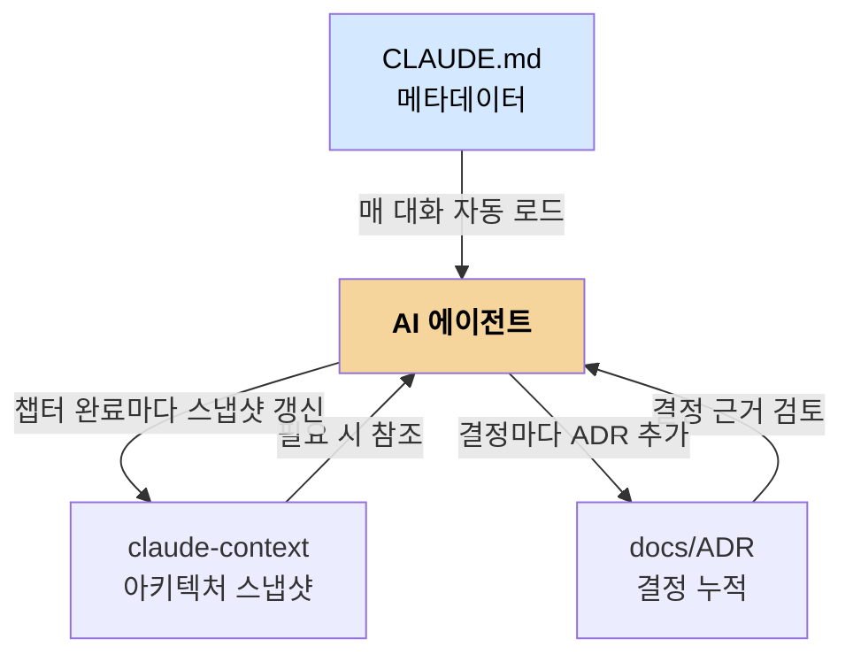
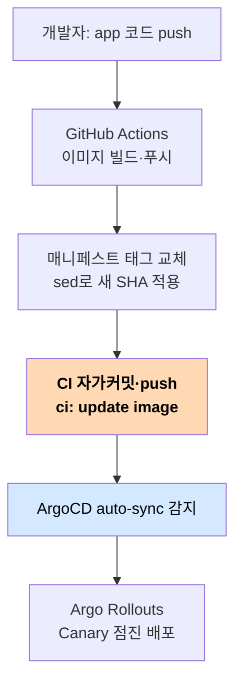

# GitAIOps 방법론 — 3층 지식구조와 자가커밋 루프
---
> 이 저장소가 내세우는 "GitAIOps"가 구체적으로 무엇인지 풀어 봅니다. 두 축이 핵심입니다. AI가 참조·생산하는 3층 지식구조, 그리고 사람 손을 거치지 않는 CI 자가커밋 GitOps 루프입니다.


## 핵심 요약

GitAIOps를 저장소는 이렇게 정의합니다. "Git이 인프라의 단일 진실 소스이고, AI가 운영 표준의 살아있는 저자입니다." 이 한 문장에 두 주장이 담겨 있습니다. 인프라의 모든 상태는 Git에만 기록한다(GitOps), 그리고 그 기록을 사람이 아니라 AI가 읽고 쓴다(AI Ops)는 것입니다.

왜 이게 의미가 있을까요? 기존 GitOps는 사람이 매니페스트를 작성하고 ArgoCD가 그걸 클러스터에 반영하는 구조입니다. GitAIOps는 그 "사람이 작성하는" 자리에 AI를 넣되, AI가 헤매지 않도록 참조할 지식을 Git 안에 계층으로 마련해 둡니다. 그 계층이 3층 지식구조입니다.


## 3층 지식구조

저장소 루트에는 AI를 위한 문서 세 종류가 있습니다. 각각 역할과 갱신 주기가 다릅니다. 이 분리가 GitAIOps의 설계 핵심입니다.

| 문서 | 역할 | 갱신 주기 | 비유 |
|------|------|----------|------|
| `CLAUDE.md` | 프로젝트 메타데이터(GCP 프로젝트·리전·레지스트리) | 초기 설정 시 | 신분증 |
| `claude-context/` | 현재 아키텍처 스냅샷(토폴로지·파이프라인) | 챕터 완료 시 | 현재 지도 |
| `docs/ADR` | 결정 누적 기록(왜 이 도구를 골랐나) | 결정 시점마다 | 회의록 |

세 문서를 왜 나눴을까요? 갱신 주기와 용도가 다르기 때문입니다. CLAUDE.md는 거의 안 바뀌는 고정 정보라 매 대화에 자동으로 로드해도 부담이 없습니다. 아키텍처 스냅샷은 자주 바뀌니 AI가 필요할 때만 참조합니다. ADR은 한 번 쓰면 고치지 않고 계속 쌓는 기록이라, 과거 결정의 이유를 추적하는 용도입니다. 한 문서에 다 몰아넣으면 "지금 무엇이 사실이고 무엇이 과거 결정인지" 구분이 흐려집니다.



화살표 방향이 중요합니다. AI는 세 문서를 읽기만 하는 게 아니라 일부를 직접 갱신합니다. 챕터를 끝내면 아키텍처 스냅샷을 새로 쓰고, 도구를 결정하면 ADR을 한 건 추가합니다. 그래서 "AI가 운영 표준의 저자"라는 표현이 나옵니다.


## ADR — 결정이 흐름으로 쌓이다

ADR(Architecture Decision Record)은 "왜 이 도구를 골랐는가"를 한 건씩 기록한 문서입니다. 이 저장소에는 ADR-001부터 ADR-016까지 16개가 있고, 각각 챕터의 의사결정에 대응합니다.

형식이 일관됩니다. 시점·결정·이유 세 부분으로 되어 있고, 이유에는 채택한 대안과 탈락한 대안이 함께 적힙니다. 예를 들어 ADR-001은 GitOps 도구로 ArgoCD를 택하면서 Flux·Jenkins X를 검토했고, 쿠버네티스 네이티브 CRD와 App of Apps 지원을 이유로 들었습니다.

```markdown
## ADR-001: GitOps 도구 — ArgoCD (ch3.2)
**시점**: 2026-04 / **결정**: ArgoCD v3.3.8 채택 (vs Flux, Jenkins X)
**이유**:
- K8s 네이티브 CRD — 선언적 배포 상태 관리
- Web UI 제공 — 배포 상태·히스토리·diff를 시각적으로 확인
- App of Apps 패턴 지원 — 7장 멀티앱 관리에서 자연스럽게 확장
- automated sync + selfHeal — git이 단일 진실 소스 역할
```

ADR 16개를 순서대로 읽으면 그 자체가 의사결정의 흐름입니다. ADR-007에서 Blue/Green을 골랐다가 ADR-010에서 Canary로 바꾼 기록처럼, 결정이 번복된 과정까지 남습니다. 왜 결정을 지우지 않고 새 ADR로 덮을까요? 과거의 판단을 보존해야 "그때는 왜 그렇게 생각했는지"를 나중에 복기할 수 있기 때문입니다. 결정을 지우면 결과만 남고 사고 과정은 사라집니다.


## CI 자가커밋 GitOps 루프

두 번째 축은 배포 자동화입니다. 사람이 코드만 push하면 그 뒤로는 파이프라인이 스스로 돌아 배포까지 완료됩니다. 핵심은 CI가 매니페스트를 고치고 **그 변경을 직접 커밋해 push**한다는 점입니다.

```yaml
# .github/workflows/ci.yaml — 매니페스트 갱신 단계
- name: Update manifest
  run: |
    sed -i "s|notiflex/api:.*|notiflex/api:sha-${GITHUB_SHA::7}|" k8s/smb/rollout.yaml
    git config user.email "ci@github.com"
    git config user.name "GitHub Actions"
    git add k8s/smb/rollout.yaml
    git commit -m "ci: update image to sha-${GITHUB_SHA::7}" || echo "No changes"
    git push
```

이 워크플로가 `permissions: contents: write` 권한을 가진 이유가 여기 있습니다. CI가 저장소에 쓰기를 해야 하기 때문입니다. 전체 루프를 그리면 코드 push 한 번이 어떻게 배포로 이어지는지 보입니다.



이 구조의 장점은 사람이 클러스터를 직접 건드릴 일이 없다는 것입니다. 배포하려면 `kubectl apply`를 치는 게 아니라 Git에 commit을 남기면 됩니다. 모든 배포가 Git 이력에 기록되니, 누가 언제 무엇을 왜 배포했는지 추적되고, 문제가 생기면 이전 커밋으로 되돌려 롤백합니다. 이것이 "Git이 단일 진실 소스"의 실제 의미입니다.

다만 대가도 있습니다. [01_git-history-flow](./01_git-history-flow.md)에서 봤듯이, CI 봇이 먼저 커밋해 두면 사람이 push할 때 충돌이 나 `merge: resolve CI SHA conflict` 같은 정리 커밋이 생깁니다. 자동화가 Git 이력을 풍부하게 만드는 만큼 충돌 관리 부담도 따라옵니다.


## 면접에서 말한다면

GitAIOps를 한 문장으로 정의하면 이렇습니다. "Git을 인프라의 단일 진실 소스로 두는 GitOps 위에, AI가 참조·생산하는 3층 지식구조(메타데이터·아키텍처 스냅샷·결정 기록)를 얹어, AI가 인프라 표준을 읽고 쓰는 주체가 되게 한 방법론입니다."

실무로 가져올 점은 AI에게 일을 맡길 때 **참조 지식을 계층으로 정리해 두는 설계**입니다. 고정 정보·현재 상태·과거 결정을 한 파일에 섞지 않고 갱신 주기별로 나누면, AI든 사람이든 "지금 무엇이 사실이고 무엇이 결정 이유인지"를 빠르게 분간할 수 있습니다.


## 핵심 개념 체크리스트

- [ ] "Git=단일 진실 소스, AI=운영 표준 저자"라는 GitAIOps 정의를 풀어 설명할 수 있는가?
- [ ] 3층 지식구조를 갱신 주기 차이로 나눈 이유를 말할 수 있는가?
- [ ] ADR을 지우지 않고 새 ADR로 덮는 이유(사고 과정 보존)를 설명할 수 있는가?
- [ ] CI 자가커밋 루프에서 `contents: write` 권한이 왜 필요한지 말할 수 있는가?
- [ ] GitOps에서 배포가 `kubectl`이 아니라 commit으로 일어나는 의미를 설명할 수 있는가?
