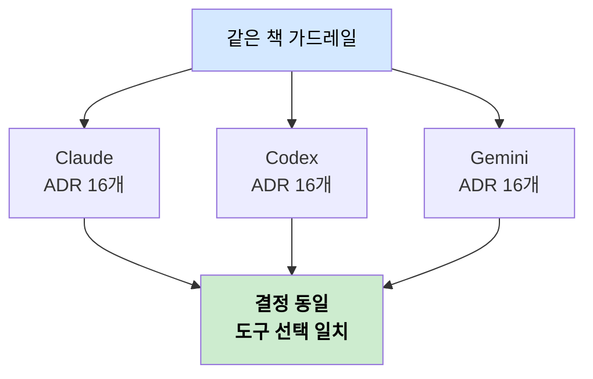

# AI 에이전트별 결과 차이 — 같은 가드레일, 다른 손
---
> 같은 책 가드레일을 Claude·Codex·Gemini 세 모델이 각각 실행한 결과가 브랜치로 남아 있습니다. 어디서 똑같고 어디서 갈라지는지 diff로 비교합니다.

## 핵심 요약

이 저장소의 가장 흥미로운 실험은 통제 변인이 명확하다는 점입니다. 실행 도구(Claude Code)도, 책 가드레일도, 목표 아키텍처도 모두 같습니다. 오직 연결한 모델만 Claude·Codex·Gemini로 다릅니다. 그래서 결과의 차이는 모델 차이로 거의 환원됩니다.

비교 결과를 한 문장으로 요약하면 이렇습니다. **결정은 수렴하고 구현은 발산합니다.** 세 모델 모두 "어떤 도구를 쓸지"는 똑같이 골랐지만, "그 도구를 어떻게 코드와 매니페스트로 옮길지"는 제각각이었습니다.

## 수렴 — 결정은 같았다

세 브랜치의 `docs/architecture-decisions.md`는 모두 ADR 16개, 파일 길이 129줄로 동일합니다. ArgoCD·GitHub Actions·Prometheus·Kafka·Tempo 같은 도구 선택이 모델과 무관하게 같았다는 뜻입니다.

왜 결정이 수렴할까요? 가드레일이 결정의 폭을 좁혀 두었기 때문입니다. 책이 "GitOps 도구를 ArgoCD·Flux·Jenkins X 중에서 고르고, 쿠버네티스 네이티브 여부를 따지라"는 식으로 선택지와 판단 기준을 제시하면, 어떤 모델이든 비슷한 결론에 이릅니다. 잘 짜인 가드레일은 모델 차이를 흡수해 결과를 일정하게 만듭니다.

## 발산 — 구현은 갈렸다

같은 도구를 골랐어도 그것을 코드로 옮긴 결과는 크게 달랐습니다. main(claude 채택본) 대비 각 브랜치의 최종 상태 차이를 `git diff --stat`으로 재면 발산 폭이 드러납니다.

| 브랜치 | main 대비 diff(k8s + app) | 성격 |
|--------|---------------------------|------|
| claude | 1파일 1줄 | main에 거의 그대로 채택 |
| codex | 19파일 +660/−323 | 더 많이 더함(증식형) |
| gemini | 17파일 +171/−478 | 더 많이 덜어냄(절제형) |

claude의 차이가 1줄뿐인 이유는 [01_git-history-flow](./01_git-history-flow.md)에서 봤듯 main이 claude 브랜치의 run-63을 채택한 결과이기 때문입니다. claude가 사실상 기준선입니다.

codex와 gemini의 방향이 대조적입니다. codex는 `main.go`를 352줄이나 더 키웠고 Grafana 대시보드 ConfigMap과 Tempo 데이터소스 ConfigMap까지 추가했습니다. 기준선보다 더 많이 만든 증식형입니다. 반면 gemini는 `main.go`를 179줄 덜어내고 `healthcheckpolicy.yaml`과 Gateway 설정 일부를 삭제했습니다. 더 간결하게 가는 절제형입니다.

## 발산의 구체적 사례

차이가 추상적이지 않도록 실제 diff에서 뽑은 사례를 보겠습니다. 같은 가드레일에서 모델 성향이 어떻게 갈리는지 보여 줍니다.

- **codex는 빌드 산출물을 커밋했습니다.** `app/notiflex`라는 약 8MB 바이너리가 저장소에 들어갔습니다. 소스에서 빌드되는 산출물을 git에 올리는 것은 일반적으로 피하는 실수라, 모델이 정돈된 결과만 내는 게 아님을 보여 줍니다.
- **파일명 컨벤션이 갈렸습니다.** codex는 `secret-provider.yaml`을 `secretproviderclass.yaml`로, gemini는 `service-preview.yaml`을 `preview-service.yaml`로 바꿨습니다. 같은 리소스에 서로 다른 이름 규칙을 적용한 것입니다.
- **기능 범위 판단이 달랐습니다.** gemini는 Gateway의 `healthcheckpolicy.yaml`을 통째로 삭제했습니다. 같은 가드레일을 받고도 "이 헬스체크 정책이 필요한가"에 대한 판단이 모델마다 달랐다는 신호입니다.

> 같은 레시피로 세 요리사가 요리했더니, 한 명은 재료를 더 넣고(codex) 한 명은 덜어내고(gemini) 한 명은 표준 레시피대로(claude) 만든 셈입니다. 맛(목표 아키텍처)은 비슷해도 접시에 담긴 모양은 제각각입니다.

## 진입점 파일의 차이

각 모델은 자기 도구 규약에 맞는 진입점 파일을 남겼습니다. 같은 Claude Code로 실행했어도 연결된 모델 생태계의 흔적이 파일로 남습니다.

| 브랜치 | 진입점 파일 | 추가 디렉터리 |
|--------|------------|--------------|
| claude / main | `CLAUDE.md` | (main은 `README.en.md` 보유) |
| codex | `CLAUDE.md` + `AGENTS.md` | `.claude/` |
| gemini | `CLAUDE.md` + `GEMINI.md` | `.claude/` |

`AGENTS.md`는 Codex CLI의 진입점 규약, `GEMINI.md`는 Gemini CLI의 진입점 규약입니다. 세 브랜치가 공통으로 `CLAUDE.md`를 갖는 것은 실행 도구가 Claude Code였기 때문이고, 그 위에 각 모델이 자기 규약 파일을 덧붙인 것입니다.

## 이 실험이 말해 주는 것

이 비교에서 끌어낼 결론은 두 가지입니다. 첫째, 가드레일의 품질이 모델 차이보다 결과에 더 크게 작용할 수 있습니다. 결정이 세 모델에서 똑같이 나온 것은 가드레일이 그만큼 잘 짜였다는 뜻입니다. 둘째, 그럼에도 구현 단계의 발산은 남습니다. 가드레일이 "무엇을 할지"는 묶을 수 있어도 "어떻게 할지"의 세부까지 통제하기는 어렵습니다.

실무 관점에서는, AI에게 인프라 작업을 맡길 때 **결정 수준의 가드레일만으로는 충분치 않다**는 교훈이 됩니다. 파일명 규칙, 빌드 산출물 제외, 기능 범위 같은 구현 세부도 가드레일이나 검증 단계에서 잡아 줘야 결과가 일정해집니다. codex가 바이너리를 커밋한 사례가 그 필요성을 보여 줍니다.

## 면접에서 말한다면

이 실험을 한 문장으로 요약하면 이렇습니다. "실행 도구와 가드레일을 고정하고 모델만 바꿨더니, 도구 선택 같은 결정은 세 모델에서 동일하게 수렴했지만 코드·매니페스트 구현은 증식형·절제형·기준형으로 발산했고, 이는 가드레일이 결정은 통제해도 구현 세부는 통제하기 어렵다는 점을 보여 줍니다."

비교 방법론 자체도 배울 만합니다. 통제 변인(도구·가드레일)을 고정하고 처리 변인(모델)만 바꾼 뒤, 결과를 `git diff --stat` 같은 정량 지표로 재는 방식은 "AI 모델을 어떻게 객관적으로 비교할 것인가"에 대한 실용적인 답입니다.

## 핵심 개념 체크리스트

- [ ] "결정은 수렴, 구현은 발산"이 무슨 뜻인지 ADR과 diff로 설명할 수 있는가?
- [ ] 가드레일이 모델 차이를 흡수해 결정을 수렴시키는 메커니즘을 말할 수 있는가?
- [ ] codex(증식형)와 gemini(절제형)의 차이를 구체적 사례로 들 수 있는가?
- [ ] AGENTS.md·GEMINI.md·CLAUDE.md 진입점 파일이 왜 브랜치마다 다른지 설명할 수 있는가?
- [ ] 결정 가드레일만으로 부족하고 구현 가드레일이 필요한 이유를 말할 수 있는가?
