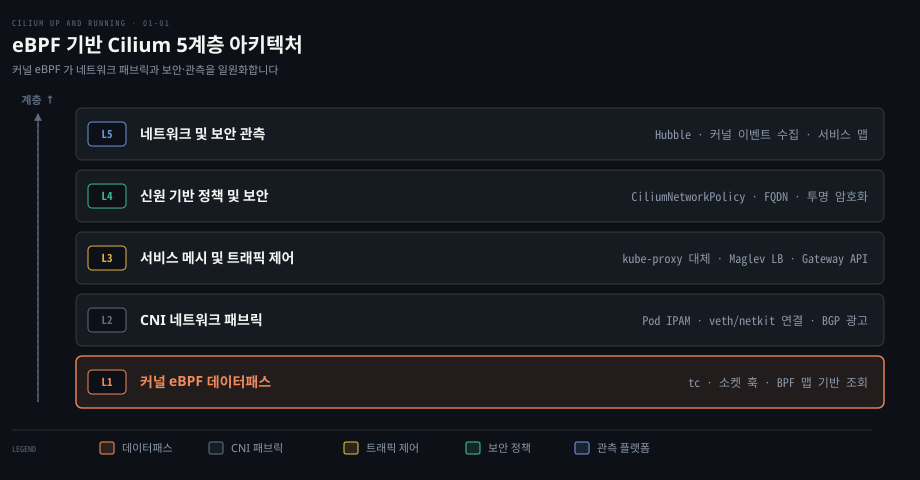
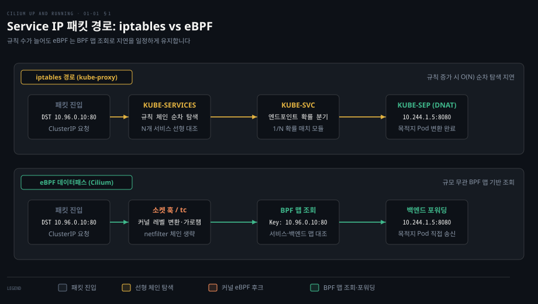
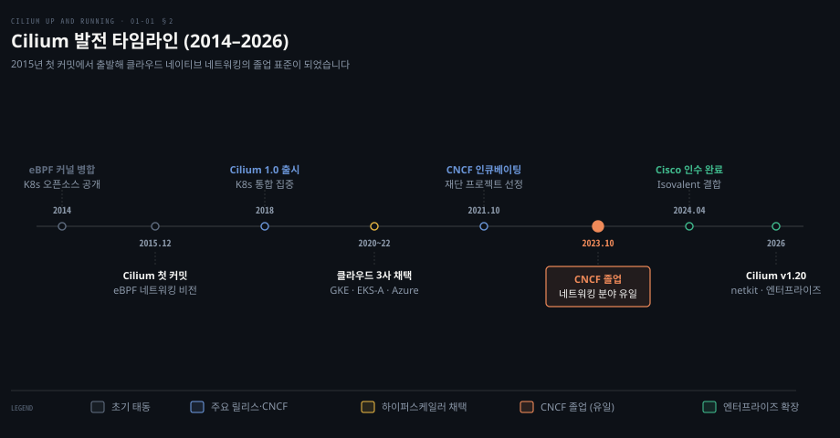
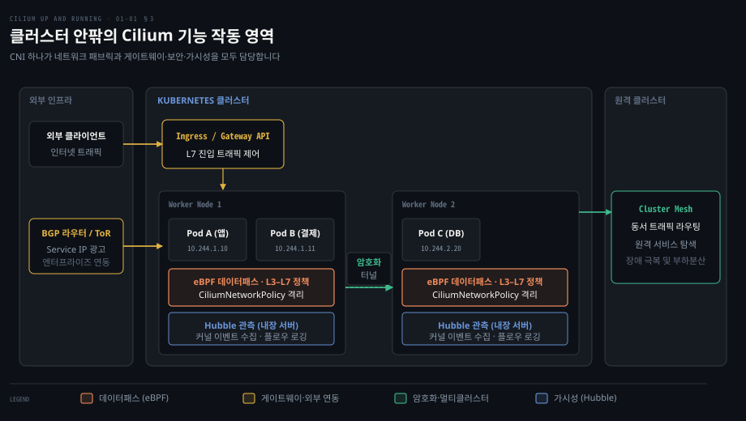
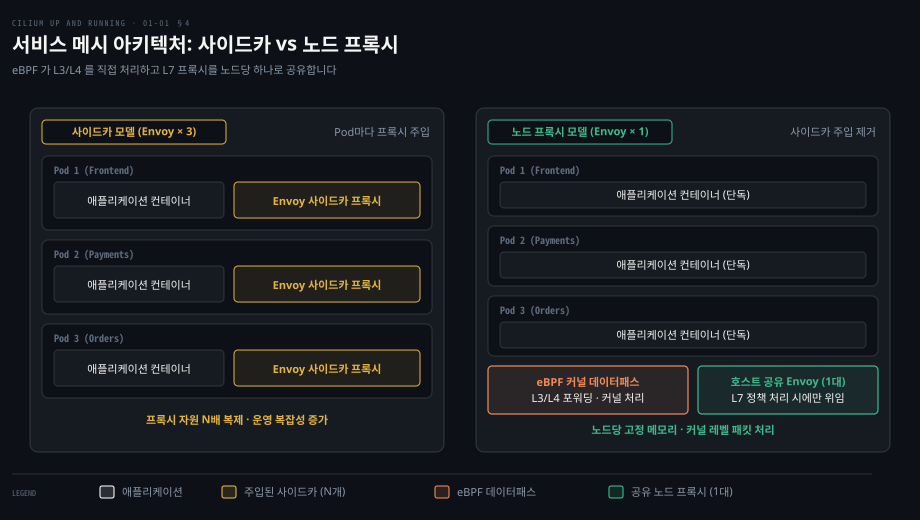

# Cilium 은 eBPF 데이터패스로 iptables 기반 CNI 의 한계를 넘는다

---

> 쿠버네티스 네트워킹은 iptables 규칙 체인의 확장성 한계에 부딪혔습니다. Cilium 은 커널 eBPF 데이터패스를 통해 고성능 라우팅, 보안 정책, 사이드카 없는 서비스 메시, 실시간 가시성을 단일 플랫폼으로 통합합니다.

## 핵심 요약

> 이 편의 중심 생각은 Cilium 이 리눅스 커널의 eBPF 맵을 활용해 iptables 의 선형 탐색 병목을 없애고, CNI 연결부터 L7 서비스 메시와 관측까지 하나의 데이터패스로 처리한다는 것입니다.

쿠버네티스에서 수많은 마이크로서비스가 생성되고 소멸할 때마다 iptables 규칙 체인을 순차 탐색하고 동기화하는 방식은 지연 시간 급증을 부릅니다. eBPF 는 패킷이 커널 네트워크 스택을 복잡하게 돌기 전에 안전한 프로그램을 실행해 BPF 맵을 조회하여 대상 Pod 를 찾아냅니다.

Cilium 은 단순한 패킷 전달 플러그인을 넘어섰습니다. 이제는 Ingress 와 Gateway API, 노드 간 투명 암호화, 쿠버네티스 신원 기반 보안 정책을 제공합니다. 나아가 사이드카 없는 서비스 메시와 커널 이벤트를 직접 내보내는 Hubble 관측 플랫폼까지 단일 엔진으로 지원합니다.

## 학습 목표

> 이 편을 읽고 나면 다음을 설명할 수 있습니다.

1. 초기 CNI 가 iptables 기반 패킷 필터링과 주소 변환에서 겪었던 규모 확장 한계를 설명할 수 있습니다.
2. eBPF 가 커널 모듈 작성이나 커널 재컴파일 없이 네트워크 동작을 프로그래밍하는 원리를 말할 수 있습니다.
3. 2015년 첫 커밋에서 출발한 Cilium 이 주요 클라우드 표준 CNI 를 거쳐 CNCF 졸업 프로젝트가 된 발전 흐름을 제시할 수 있습니다.
4. CNI 하나가 서비스 부하분산, 인그레스, BGP 연동, 암호화, 네트워크 관측까지 대체하는 영역을 구분할 수 있습니다.
5. 사이드카 주입 방식과 노드 공유 프록시 방식의 자원 소비 및 아키텍처 상의 득실을 비교할 수 있습니다.

## 1. 초기 CNI 는 iptables 규칙으로 Pod 를 이었고 규모에서 막혔다

> 서비스와 Pod 가 수만 개로 늘어나면 iptables 의 순차 체인 탐색은 지연을 유발합니다. 규칙 갱신 비용과 패킷당 선형 대조 오버헤드가 대규모 클러스터의 병목이 됩니다.

### 왜 서비스가 늘면 iptables 가 느려지는가

쿠버네티스가 표준 플랫폼으로 자리 잡으면서 **CNI** 가 도입되었습니다. 초기의 Flannel 이나 Weave Net 은 기본적인 Pod 간 IP 연결에 집중했습니다. 이후 Calico 가 BGP 라우팅과 네트워크 정책을 더했습니다. 하지만 이들 초기 구현체는 패킷 필터링과 주소 변환을 위해 리눅스의 전통적인 **iptables** 에 전적으로 의존했습니다.

iptables 는 수천 개의 동적 엔드포인트가 초 단위로 생성되고 사라지는 환경에 맞지 않습니다. 쿠버네티스 서비스가 늘어날 때마다 `KUBE-SERVICES` 와 `KUBE-SVC` 로 이어지는 규칙 체인이 순차적으로 늘어납니다. 패킷이 노드에 들어오면 원하는 엔드포인트를 찾을 때까지 이 긴 목록을 위에서부터 한 줄씩 대조하는 $O(N)$ 선형 탐색을 거쳐야 합니다. 서비스와 엔드포인트 수가 많아질수록 패킷 처리 지연 시간이 비례하여 늘어납니다.

더 큰 문제는 규칙 갱신 비용입니다. 예전 kube-proxy 는 동기화 때마다 모든 Service 규칙을 다시 썼고 대규모 클러스터에서 갱신 지연과 커널 테이블 잠금 병목이 컸습니다. Kubernetes v1.28 부터는 바뀐 Service·EndpointSlice 자리만 고치지만 패킷이 규칙 체인을 위에서부터 대조하는 구조는 그대로입니다. [kube-proxy 의 세 가지 모드 원리](../networking-and-kubernetes/02-03.iptables·IPVS·eBPF%20—%20kube-proxy를%20이해하는%20세%20기술.md)에서 정리했듯이 이 한계는 대규모 클러스터에서 특히 심각해집니다.

### eBPF 가 바꾸는 패킷 경로

2014년 리눅스 커널에 병합되기 시작한 **eBPF** 는 이 문제를 근본적으로 바꿨습니다. eBPF 는 커널을 재컴파일하지 않고도 커널 이벤트 지점에 안전한 바이트코드를 주입해 실행하는 기술입니다. 브라우저에서 자바스크립트가 안전한 런타임을 제공했듯이, eBPF 는 리눅스 커널을 프로그래밍 가능한 영역으로 열어주었습니다.

eBPF 데이터패스를 사용하는 Cilium 은 선형 규칙 체인을 거치지 않습니다. Cilium 은 서비스 주소를 키로 BPF 맵을 조회해 백엔드를 고릅니다. Pod 에서 나가는 ClusterIP 연결은 대개 connect() 시점의 소켓 훅에서 변환되어 오버헤드를 줄이며, 조회 비용은 백엔드 수와 거의 무관하게 일정한 성능을 냅니다. 엔드포인트가 변경되더라도 BPF 맵의 해당 항목만 원자적으로 갱신하므로 전체 테이블 잠금이 발생하지 않습니다.

## 2. Cilium 은 2015년 첫 커밋에서 출발해 CNCF 졸업 프로젝트가 되었다

> 여러 컨테이너 스케줄러가 경쟁하던 2015년 첫 커밋에서 출발해, 하이퍼스케일러의 기본 채택을 거쳐 네트워킹 분야 유일의 CNCF 졸업 프로젝트로 성장했습니다.

### 어떤 문제의식에서 출발했는가

Cilium 은 2015년 12월 첫 번째 깃 커밋과 함께 시작되었습니다. 당시에는 메소스, 도커 스웜, 쿠버네티스가 공존하던 시기였습니다. Cilium 의 초기 릴리스는 여러 컨테이너 스케줄러에 걸쳐 확장 가능한 네트워킹 및 보안 데이터패스를 구축하는 것을 목표로 삼았습니다. 이후 쿠버네티스가 표준으로 자리 잡자 Cilium 역시 쿠버네티스 CNI 와의 통합에 집중했습니다.

### 산업계 채택과 CNCF 졸업

Cilium 의 기술적 가치는 대형 퍼블릭 클라우드 벤더들이 먼저 인정했습니다. Google 은 GKE Dataplane V2, Amazon 은 EKS Anywhere, Microsoft 는 Azure CNI powered by Cilium 의 기본 네트워킹 계층으로 Cilium 을 택했습니다. 다른 클라우드 벤더와 배포판도 뒤를 이었습니다. 세계 최대 클라우드 제공업체들이 플랫폼의 기본 네트워킹 계층으로 Cilium 을 신뢰하면서 기술적 신뢰성이 입증되었습니다.

이러한 신뢰를 발판으로 Cilium 은 2021년 10월 CNCF 인큐베이팅 프로젝트로 합류했습니다. 독립적인 거버넌스와 엄격한 보안 감사 요건을 거쳐, [2023년 10월 11일 CNCF 공식 졸업 프로젝트](https://www.cncf.io/announcements/2023/10/11/cloud-native-computing-foundation-announces-cilium-graduation/)가 되었습니다. 이는 CNCF 클라우드 네이티브 네트워킹 범주에서 최초이자 유일한 졸업 사례입니다.

Cilium 창립 멤버들이 설립한 기업 Isovalent 는 [2024년 4월 12일 Cisco 에 인수가 완료](https://newsroom.cisco.com/c/r/newsroom/en/us/a/y2024/m04/cisco-completes-acquisition-of-isovalent-to-define-the-future-of-multicloud-networking-and-security.html)되어 엔터프라이즈 네트워킹과의 결합을 강화했습니다. 오픈소스 생태계에서도 CFP 를 통한 공개 설계 논의를 이어갑니다. [공식 릴리스 저장소](https://github.com/cilium/cilium/releases) 기준 최신 v1.20 버전에 이르기까지 프로덕션 표준으로 운영되고 있습니다.

## 3. CNI 하나가 서비스·Ingress·정책·암호화·관측까지 맡는다

> 별도 컨트롤러와 데몬들이 나누어 맡던 서비스 부하분산, 외부 게이트웨이, 방화벽, 암호화, 패킷 관측을 단일 eBPF 데이터패스로 통합합니다.

### 분산된 네트워크 도구들의 운영 비용

전통적인 쿠버네티스 클러스터에서는 기능마다 서로 다른 도구를 설치해야 했습니다. CNI 플러그인으로 Pod 를 연결했습니다. 부하분산에는 `kube-proxy` 를 썼고 외부 트래픽을 위해 Ingress 컨트롤러를 띄웠습니다. 여기에 암호화 데몬과 모니터링 에이전트까지 노드마다 추가해야 했습니다. 도구가 파편화되면 각 구성요소의 설정이 어긋나기 쉽고 패킷이 여러 계층을 거치며 불필요한 오버헤드가 누적됩니다.

Cilium 은 이 모든 역할을 단일 데이터패스 안으로 흡수합니다. 모든 기능을 강제하지 않고 필요한 기능만 단계적으로 켤 수 있는 모듈형 구조를 제공합니다.

| 기능 | 대신하는 도구 | 핵심 메커니즘 |
|---|---|---|
| CNI 기본 패브릭 | Flannel, Weave Net, Calico | Pod IPAM · eBPF 데이터패스 직접 라우팅 |
| 서비스 로드밸런싱 | kube-proxy (iptables/IPVS) | 소켓 계층 로드밸런싱 · 일관 해싱(Maglev) |
| Ingress 및 Gateway API | ingress-nginx, 외부 L7 프록시 | Envoy 기반 Ingress 및 Gateway API 구현체 |
| 클러스터 간 통신 | 별도 오버레이 VPN, 멀티클러스터 메시 | Cluster Mesh 동서 트래픽 라우팅 · 서비스 탐색 |
| 외부 망 BGP 연동 | MetalLB, Bird, Quagga | BGP 제어 평면 내장 · ToR 스위치 VIP 광고 |
| L3–L7 네트워크 정책 | 기본 NetworkPolicy, 애플리케이션 방화벽 | 신원 기반 L3/L4 필터링 · FQDN/L7 Envoy 프록시 |
| 노드 간 투명 암호화 | 수동 IPsec 구성, 호스트 WireGuard 데몬 | 커널 레벨 WireGuard / IPsec 자동 터널링 |
| 분산 네트워크 관측 | tcpdump, 별도 CNI 메트릭 데몬 | Hubble eBPF 기반 커널 플로우 수집 |

### 통합 기능의 핵심 동작 영역

CNI 로서 Cilium 은 단일 노드 안의 Pod 통신뿐 아니라 물리 네트워크 직접 라우팅과 VXLAN 터널링을 모두 지원합니다. IP 주소 할당을 관리하는 IPAM 도 내장되어 있습니다([CNI 배선 원리와 IPAM](../networking-and-kubernetes/04-02.CNI와%20kube-proxy%20—%20Pod%20네트워크의%20배선공과%20로드밸런서.md)).

클러스터 진입 트래픽을 위해서는 Ingress 컨트롤러와 차세대 [Gateway API 규격](../istio-in-action/04-01.문을%20여는%20일과%20길을%20내는%20일을%20가른다.md)을 자체 제공합니다. 제3자 컨트롤러를 추가하지 않고도 HTTP 라우팅과 TLS 종단을 처리할 수 있습니다.

서비스 로드밸런싱에는 일관성 해싱 알고리즘인 Maglev 를 지원해 엔드포인트 변경 시에도 연결 일관성을 유지합니다. ToR 스위치와 BGP 피어링을 맺어 서비스 IP 를 외부 망에 직접 광고할 수도 있습니다.

네트워크 정책 모델은 IP 주소 대신 쿠버네티스 라벨과 신원을 기준으로 동작합니다. [쿠버네티스 기본 정책](../networking-and-kubernetes/04-03.NetworkPolicy와%20DNS%20—%20클러스터%20안의%20방화벽과%20이름.md)의 L3/L4 제어는 eBPF 가 커널에서 집행하고, HTTP 메서드 같은 L7 규칙은 Envoy, DNS 이름 규칙은 DNS 프록시가 맡습니다.

노드 간 트래픽을 보호하는 **투명 암호화**도 강점입니다. WireGuard 나 IPsec 을 켜면 애플리케이션 수정 없이 노드 간 패킷이 커널에서 자동 암호화됩니다. 내장된 **Hubble** 플랫폼은 커널에서 직접 플로우 메트릭을 수집하므로 최소한의 오버헤드로 네트워크 가시성을 제공합니다.

## 4. 사이드카 없는 서비스 메시는 프록시를 노드로 옮긴다

> Pod 마다 L7 프록시를 주입하던 사이드카 모델의 자원 중복을 없앱니다. eBPF 가 L3/L4 를 직접 처리하며 노드당 하나의 공유 Envoy 로 L7 정책을 일원화합니다.

### 사이드카 방식이 치르는 비용

서비스 메시는 mTLS 암호화와 L7 관측성을 애플리케이션 밖으로 분리하기 위해 시작되었습니다([서비스 메시의 인프라 분리 배경](../istio-in-action/01-01.서비스%20메시는%20무엇을%20인프라로%20밀어냈는가.md)). 하지만 초기 서비스 메시는 Pod 마다 별도의 프록시 컨테이너를 주입하는 방식을 취했습니다.

이 방식은 세 가지 비용을 요구합니다. 첫째는 자원 오버헤드입니다. 노드에 Pod 가 50개 있다면 50개의 독립된 Envoy 인스턴스가 각각 메모리와 CPU 를 차지합니다. 둘째는 운영 복잡성입니다. 사이드카 주입 설정과 버전 관리를 수많은 Pod 마다 수행해야 합니다. 셋째는 디버깅의 어려움입니다. 통신 장애가 발생했을 때 애플리케이션 문제인지 주입된 사이드카 프록시 문제인지 분리해 분석하기 까다롭습니다.

### 노드 프록시 모델과 트레이드오프

Cilium 은 사이드카 없는 서비스 메시를 제시했습니다. 핵심은 역할 분리입니다. L3/L4 라우팅, 로드밸런싱, 접근 제어, 암호화는 커널 eBPF 가 직접 처리합니다. L7 기능이 필요하지 않은 트래픽은 프록시를 전혀 거치지 않고 eBPF 데이터패스에서 바로 흐릅니다.

HTTP 경로 라우팅처럼 L7 처리가 필요할 때만 호스트의 노드 공유 Envoy 로 패킷을 넘깁니다. 노드에 Pod 가 몇 개이든 Envoy 인스턴스는 하나만 실행되므로 메모리 소비가 크게 줄어듭니다.

다만 노드 프록시 방식에도 트레이드오프가 있습니다. 사이드카 방식에서는 한 프록시가 비정상 종료되어도 해당 Pod 에만 장애가 국한되었습니다. 반면 노드 프록시 방식에서는 공유 Envoy 가 죽으면 해당 노드 위에서 L7 처리를 받던 모든 Pod 의 통신이 영향을 받는 장애 반경 확대가 발생할 수 있습니다.

## 5. 앞으로 볼 것

> 마이크로서비스를 넘어 대규모 GPU 클러스터와 가상머신으로 워크로드가 확장되었습니다. CNI 는 netkit 과 크로스 OS eBPF 를 통해 물리 호스트 수준 성능을 추구합니다.

### 차세대 워크로드와 CNI 의 확장

Cilium 의 적용 영역은 기존 컨테이너를 넘어 빠르게 확장되고 있습니다. 상태 저장 워크로드에 이어 GPU 클러스터에 걸친 인공지능·머신러닝 워크로드가 쿠버네티스 위에서 늘어나고 있습니다. 분산 훈련 트래픽은 높은 처리량과 낮은 지연 시간을 요구하며, 프로그래밍 가능한 데이터패스를 가진 Cilium 은 이런 요구에 대응하기 좋은 위치에 있습니다.

KubeVirt 와 결합하여 가상머신과 컨테이너를 단일 네트워킹으로 통합 관리하는 사례도 늘고 있습니다. 기존 가상머신 인프라를 쿠버네티스로 편입할 때 Cilium 은 동일한 네트워크 정책, 암호화, 관측성을 투명하게 제공합니다.

### 데이터패스 혁신과 다음 장 연결

네트워크 성능 측면에서는 `veth` 가상 이더넷 장치를 대체하는 **netkit** 이 도입되었습니다([커널 바이패스와 XDP 원리](../../../02_os/book/systems-performance/10-02.네트워크%20—%20아키텍처.md#dpdk-와-xdp-는-스택과-맺는-관계가-다릅니다)). 패킷이 호스트 스택 오버헤드를 줄이고 eBPF 와 직결되어 컨테이너에서도 호스트 수준의 전송 성능을 달성할 수 있습니다. 초기 도입 사례로 ByteDance 는 전체 플릿 처리량이 10% 늘었다고 알려졌습니다.

리눅스를 넘어 윈도우 환경을 위한 eBPF 개발도 진행 중입니다. [다음 편인 02-01](./02-01.Cilium%20은%20에이전트·CNI%20플러그인·오퍼레이터로%20나눠%20노드와%20클러스터를%20맡는다.md)에서는 이러한 데이터패스를 제어하는 세 가지 핵심 컴포넌트인 Cilium Agent, CNI 플러그인, Operator 의 내부 분담과 상호작용을 살펴봅니다.

## 면접 대비

> 아래 질문에 답하면서 'eBPF 데이터패스가 iptables 와 서비스 메시의 구조적 한계를 어떻게 해결했는가'를 함께 설명해 보세요.

1. 대규모 쿠버네티스 환경에서 iptables 기반 CNI 가 성능 저하와 갱신 병목을 겪는 구조적 이유는 무엇인가요?
2. Cilium 이 Service 로드밸런싱을 수행할 때 iptables 의 체인 순차 탐색 대비 일정한 처리 성능을 유지하는 원리는 무엇인가요?
3. GKE Dataplane V2, EKS Anywhere, Azure CNI powered by Cilium 이 Cilium 을 기본 네트워킹 계층으로 택한 기술적 배경은 무엇인가요?
4. 사이드카 서비스 메시와 비교할 때 Cilium 의 노드 프록시 모델이 갖는 자원 효율적 장점과 아키텍처적 한계는 각각 무엇인가요?
5. `veth` 쌍을 대체하는 차세대 가상 네트워크 장치인 `netkit` 이 eBPF 데이터패스에서 가져오는 성능적 이점은 무엇인가요?

## 정답 (자답 후 펼치기)

> 위 §면접 대비의 질문에 먼저 스스로 답한 뒤 읽으세요.

### 정답 1 — 선형 체인 탐색과 갱신 비용

iptables 는 규칙이 순차적으로 배치되어 있어 목적지 엔드포인트를 찾기 위해 $O(N)$ 의 선형 탐색을 거쳐야 하므로 엔드포인트가 많아질수록 패킷 처리 지연 시간이 증가합니다. 또한 예전 kube-proxy 는 동기화 때마다 전체 테이블을 다시 써서 커널 테이블 잠금과 갱신 지연을 겪었습니다. Kubernetes v1.28 부터 바뀐 Service·EndpointSlice 자리만 갱신하도록 개선되었으나, 체인을 순차 대조하는 구조적 패킷 지연은 여전히 남습니다.

### 정답 2 — BPF 맵 조회와 소켓 계층 변환

Cilium 은 서비스 주소를 키로 BPF 맵을 조회해 백엔드 Pod 를 결정합니다. Pod 에서 나가는 ClusterIP 요청은 대개 connect() 시점의 소켓 훅에서 대상 백엔드로 변환되므로 netfilter 규칙 체인을 순차 탐색하지 않습니다. BPF 맵 조회를 활용하므로 백엔드 수가 늘어나도 조회 비용이 거의 일정하며, 백엔드가 변경될 때도 BPF 맵의 해당 엔트리만 원자적으로 갱신됩니다.

### 정답 3 — 멀티테넌트 하이퍼스케일 요구와 eBPF 데이터패스 신뢰

클라우드 제공업체의 대규모 멀티테넌트 환경에서는 iptables 의 한계로 인해 네트워크 지연 급증과 제어 평면 부하가 심각했습니다. 이들 플랫폼이 기본 네트워킹 계층으로 Cilium 을 선택한 것은, Cilium 이 eBPF 기반의 뛰어난 성능, 풍부한 보안 정책, 커널 수준 관측성을 통해 하이퍼스케일 환경의 까다로운 요구를 충족한다는 강력한 신호였습니다. 이러한 기술적 성숙도와 대규모 실환경 검증을 거친 뒤 Cilium 은 CNCF 인큐베이팅(2021)을 지나 2023년 네트워킹 프로젝트 유일의 졸업 단계에 도달했습니다.

### 정답 4 — 메모리 절감과 장애 반경 확대의 트레이드오프

장점은 Pod 마다 Envoy 프록시를 띄우지 않고 노드당 1개의 공유 프록시만 실행하므로 메모리와 자원 소비가 대폭 절감된다는 점입니다. L3/L4 트래픽은 eBPF 가 커널에서 직접 처리하고 L7 검사가 필요한 트래픽만 노드 프록시로 전달하므로 불필요한 프록시 중복 계층이 사라집니다. 반면 단점은 노드 공유 프록시 프로세스가 비정상 종료되었을 때 해당 노드 위에서 L7 처리를 받던 모든 Pod 의 통신이 영향을 받는 장애 반경 확대 위험이 있다는 점입니다.

### 정답 5 — 백로그 큐 우회와 호스트 네이티브 성능

기존의 `veth` 페어는 네임스페이스를 넘는 패킷을 CPU 별 backlog 큐에 넣었다가 softirq 에서 다시 처리하는 오버헤드가 있었습니다. `netkit` 은 BPF 프로그램을 장치 드라이버 송신(xmit) 경로 안에서 실행해 이 큐를 건너뛰고 물리 장치로 곧장 보낼 수 있습니다. 이를 통해 컨테이너 환경에서도 호스트 네이티브 네트워킹에 필적하는 높은 처리량과 낮은 지연 시간을 실현합니다.

## 참고 자료

> Cilium 공식 문서 및 릴리스, CNCF 발표 자료를 대조했습니다.

- Nico Vibert · Filip Nikolic · James Laverack, 《Cilium: Up and Running》, Ch.1 Why Cilium?, O'Reilly, 2026, ISBN 979-8-341-62299-9.
- [Cilium Documentation (Stable)](https://docs.cilium.io/en/stable/).
- [CNCF Announces Cilium Graduation (2023-10-11)](https://www.cncf.io/announcements/2023/10/11/cloud-native-computing-foundation-announces-cilium-graduation/).
- [Cisco Completes Acquisition of Isovalent (2024-04-12)](https://newsroom.cisco.com/c/r/newsroom/en/us/a/y2024/m04/cisco-completes-acquisition-of-isovalent-to-define-the-future-of-multicloud-networking-and-security.html).
- [Cilium GitHub Repository Releases](https://github.com/cilium/cilium/releases).

## 관련 문서

> CNI 기초 원리 및 서비스 메시 개념과 연결됩니다.

- [02-01. Cilium 핵심 컴포넌트](./02-01.Cilium%20은%20에이전트·CNI%20플러그인·오퍼레이터로%20나눠%20노드와%20클러스터를%20맡는다.md) — 에이전트, CNI 플러그인, 오퍼레이터의 내부 동작입니다.
- [N&K 02-03. iptables·IPVS·eBPF](../networking-and-kubernetes/02-03.iptables·IPVS·eBPF%20—%20kube-proxy를%20이해하는%20세%20기술.md) — kube-proxy 가 사용하는 세 가지 패킷 제어 방식 비교입니다.
- [N&K 04-02. CNI 와 kube-proxy](../networking-and-kubernetes/04-02.CNI와%20kube-proxy%20—%20Pod%20네트워크의%20배선공과%20로드밸런서.md) — 쿠버네티스 CNI 스펙과 배선 메커니즘입니다.
- [N&K 04-03. NetworkPolicy 와 DNS](../networking-and-kubernetes/04-03.NetworkPolicy와%20DNS%20—%20클러스터%20안의%20방화벽과%20이름.md) — 쿠버네티스 기본 L3/L4 네트워크 정책 모델입니다.
- [N&K 05-03. Ingress 와 Service Mesh](../networking-and-kubernetes/05-03.Ingress와%20Service%20Mesh%20—%20L7의%20두%20층.md) — L7 게이트웨이와 메시의 역할 분담입니다.
- [Istio 01-01. 서비스 메시의 인프라 분리](../istio-in-action/01-01.서비스%20메시는%20무엇을%20인프라로%20밀어냈는가.md) — 사이드카 기반 서비스 메시의 탄생 배경입니다.
- [Istio 04-01. Gateway API](../istio-in-action/04-01.문을%20여는%20일과%20길을%20내는%20일을%20가른다.md) — 쿠버네티스 Gateway API 의 역할 분리와 라우팅 규격입니다.
- [Systems Performance 10-02. 네트워크 아키텍처](../../../02_os/book/systems-performance/10-02.네트워크%20—%20아키텍처.md) — DPDK, XDP, 리눅스 커널 패킷 처리 가속 원리입니다.
