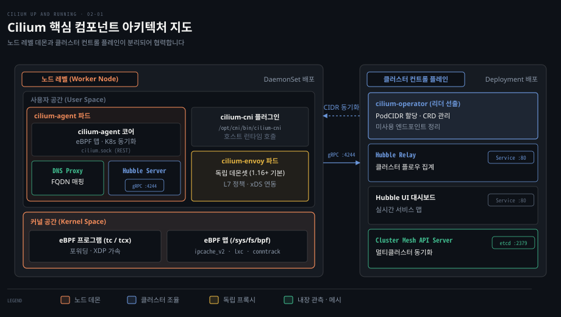
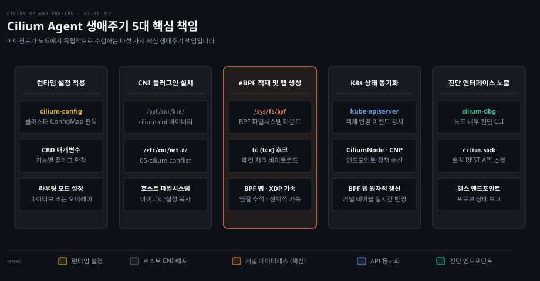
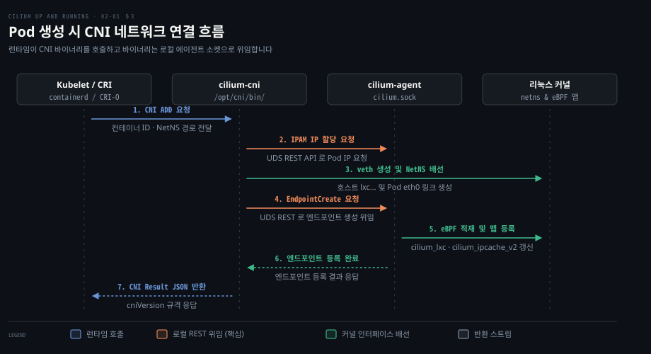
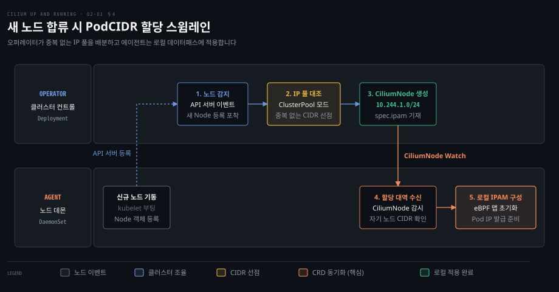
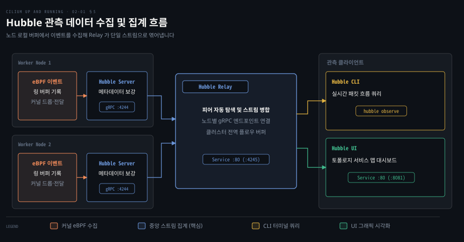
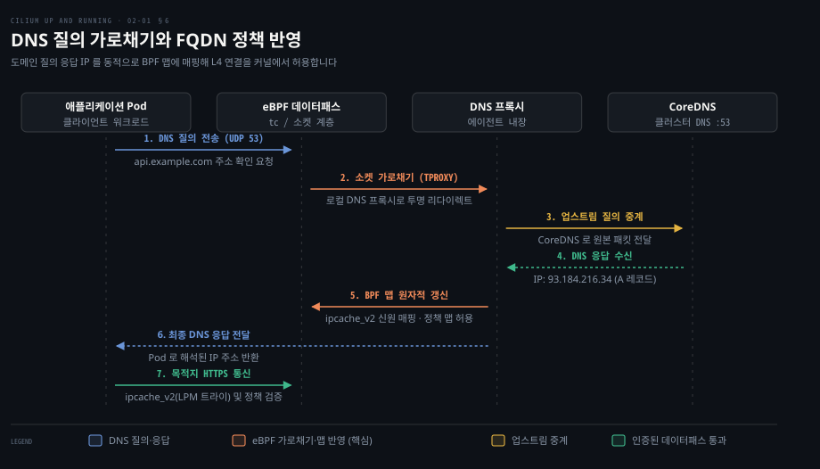

# Cilium 은 에이전트·CNI 플러그인·오퍼레이터로 나눠 노드와 클러스터를 맡는다

---

> Cilium 은 노드 단위로 데이터패스를 직접 다루는 에이전트와 CNI 플러그인, 클러스터 단위로 주소 배분과 리소스를 총괄하는 오퍼레이터로 역할을 엄격히 분리하여 확장성과 안정성을 동시에 확보합니다.


## 핵심 요약

> 이 편의 중심 생각은 Cilium 이 고성능 패킷 처리가 필요한 노드 영역과 전역 일관성이 필요한 클러스터 제어 영역을 분리해 대규모 분산 환경의 병목을 방지한다는 것입니다.

노드마다 상주하는 데몬셋 에이전트는 리눅스 커널에 eBPF 프로그램을 주입하고 맵을 관리합니다. 컨테이너 런타임이 새 Pod 를 생성할 때 경량 CNI 플러그인이 로컬 에이전트에 통신을 위임하여 가상 네트워크 인터페이스를 배선합니다. L7 심층 검사와 FQDN 정책이 필요한 트래픽만 선별하여 Envoy 와 DNS 프록시로 넘김으로써 커널 검증기의 제약을 극복합니다.

클러스터 전역에서는 오퍼레이터가 단일 활성 컨트롤러로 동작하여 PodCIDR 할당과 리소스 생애주기를 전담합니다. 여기에 노드별 이벤트를 수집하는 Hubble 서버와 이를 묶는 Hubble Relay 가 결합되어 분산 네트워크 가시성을 완성합니다.




## 학습 목표

> 이 편을 읽고 나면 다음을 설명할 수 있습니다.

1. Cilium 아키텍처가 에이전트와 오퍼레이터로 역할을 분리한 설계 이유를 제시할 수 있습니다.
2. 에이전트가 노드에서 맡는 다섯 가지 핵심 책임과 에이전트 장애 시 데이터패스 지속 원리를 설명할 수 있습니다.
3. 컨테이너 런타임과 CNI 바이너리, 에이전트가 Pod 네트워크를 배선하는 호출 흐름을 말할 수 있습니다.
4. 오퍼레이터가 IPAM 주소 할당과 CRD 동기화를 클러스터 중앙에서 맡아야 하는 배경을 분석할 수 있습니다.
5. L7 정책 처리를 위한 Envoy 및 FQDN 해석용 DNS 프록시의 패킷 가로채기 동작 방식을 비교할 수 있습니다.


## 1. 일을 노드 단위와 클러스터 단위로 나눠 맡긴다

> 모든 노드가 쿠버네티스 전체 상태를 직접 조정하려 들면 API 서버 부하와 상태 불일치가 일어납니다. 노드 로컬 데이터패스와 전역 자원 관리를 분리해야 대규모 클러스터가 안정됩니다.

### 왜 에이전트와 오퍼레이터로 분리했는가

각 노드가 중앙 API 서버에 접근해 전역 주소 블록을 직접 갱신하면 동기화 경합이 일어납니다. 반대로 중앙 컨트롤러가 각 노드의 인터페이스와 패킷 필터링까지 원격 제어하면 장애 시 클러스터 전체 통신이 마비됩니다.

Cilium 은 이 문제를 해결하기 위해 시스템을 노드 단위와 클러스터 단위로 엄격히 나눴습니다.

- **노드 단위 컴포넌트**: 데몬셋으로 동작하는 **Cilium agent** 가 노드마다 상주합니다. 호스트 커널에 eBPF 프로그램을 적재하고 맵 상태를 유지합니다. **Cilium CNI plugin** 은 Pod 생성 시 로컬 에이전트 소켓을 호출해 네트워크 배선을 위임합니다. 노드 로컬 L7 처리를 맡는 Envoy 와 FQDN 해석을 가로채는 DNS 프록시, 패킷 이벤트를 캡처하는 Hubble 서버가 노드 내부에서 협력합니다.
- **클러스터 단위 컴포넌트**: 디플로이먼트로 동작하는 **Cilium operator** 가 클러스터에 1개의 활성 인스턴스로 뜹니다. 노드 간 중복 없는 IP 대역 분배와 CRD 등록을 책임집니다. 여러 노드의 관측 데이터를 하나로 묶는 Hubble Relay 와 UI, 멀티클러스터 메타데이터를 공유하는 Cluster Mesh API Server 가 전역 서비스를 구성합니다.

노드 내부의 패킷 전달은 중앙 컨트롤러의 개입 없이 마이크로초 단위로 완결되며, 클러스터 전역의 주소 체계와 정책 일관성은 오퍼레이터가 보장합니다.


## 2. 에이전트는 노드마다 데이터패스를 깔고 쿠버네티스 상태를 맞춘다

> 노드마다 커널 데이터패스를 깔면서 쿠버네티스 선언 상태와 실제 패킷 경로의 불일치를 막아야 합니다. 에이전트는 다섯 가지 책임을 수행하며 맵을 통해 커널과 사용자 공간을 동기화합니다.

### 에이전트의 다섯 가지 핵심 책임

노드가 부팅되거나 데몬셋 파드가 새로 시작되면 Cilium 에이전트는 다음과 같은 다섯 가지 핵심 책임을 수행합니다.

- **런타임 설정 적용**: `cilium-config` ConfigMap 과 CRD 명세를 읽어 터널링 여부나 라우팅 모드 등 에이전트 동작 모드를 확정합니다.
- **CNI 플러그인 설치**: `/opt/cni/bin/cilium-cni` 바이너리와 `/etc/cni/net.d/05-cilium.conflist` 설정을 호스트에 복사하여 런타임의 CNI 호출 준비를 마칩니다.
- **eBPF 프로그램 및 맵 적재**: `/sys/fs/bpf` 를 마운트하고 tc(리눅스 커널 6.6 이상은 tcx) 후크에 패킷 처리 바이트코드를 적재하며, 가속 옵션이 켜지면 XDP 후크에도 적재합니다. 연결 추적과 로드밸런싱 BPF 맵을 초기화합니다.
- **쿠버네티스 상태 동기화**: `kube-apiserver` 의 Service·EndpointSlice 와 `CiliumNode`, `CiliumNetworkPolicy` 같은 Cilium 커스텀 리소스를 감시해 BPF 맵에 최신 상태를 반영합니다.
- **진단 인터페이스 노출**: 로컬 진단을 위해 `/var/run/cilium/cilium.sock` 소켓을 열고 디버깅 도구를 제공합니다.



### 에이전트 디버깅 도구의 이름 변경

에이전트 파드 내부에는 노드 상태를 직접 들여다보는 진단 도구가 포함되어 있습니다. [Cilium 1.15 변경 기록(PR #28085)](https://github.com/cilium/cilium/pull/28085)에 따르면 Cilium 1.15 부터 이 도구의 이름이 `cilium` 에서 **`cilium-dbg`** 로 변경되었습니다. 과거에는 클러스터 외부 CLI 와 파드 내부 진단 명령이 동일한 이름을 사용하여 혼선을 유발했습니다. 현재 버전에서는 파드 내부 진단 시 `cilium-dbg status` 나 `cilium-dbg bpf` 명령을 사용합니다.

```bash
kubectl exec -n kube-system ds/cilium -c cilium-agent -- cilium-dbg status
```

### 에이전트가 죽으면 데이터패스는 어떻게 되는가

Cilium 의 실제 패킷 포워딩 엔진은 사용자 공간 데몬이 아니라 리눅스 커널 내부의 eBPF 프로그램과 BPF 맵으로 구동됩니다.

에이전트는 BPF 맵을 `/sys/fs/bpf` 파일시스템에 핀 고정합니다. `cilium-agent` 파드가 재시작되더라도 커널 공간의 eBPF 바이트코드와 연결 추적 맵이 남아 기존 Pod 간 L3/L4 포워딩과 로드밸런싱은 이어집니다. 다만 에이전트 내부에서 동작하는 DNS 프록시를 거치는 질의나 신규 Pod 의 네트워크 설정은 재시작이 완료될 때까지 일시 중단됩니다.

또한 에이전트가 중단된 동안에는 쿠버네티스 제어 평면과의 동기화가 일시 중지됩니다. 신규 Pod 가 생성되어도 새 IP 가 BPF 맵에 등록되지 못하고, 변경된 보안 정책이 커널에 즉시 반영되지 않습니다. 에이전트가 복구되면 `/sys/fs/bpf` 의 기존 맵을 다시 바인딩하고 API 서버와 상태를 재대조하여 차이점을 복원합니다.


## 3. CNI 플러그인은 Pod 가 생길 때 에이전트를 불러 네트워크를 붙인다

> Pod 가 뜰 때마다 무거운 데몬이 매번 eBPF 컴파일과 상태 조율을 처음부터 수행하면 파드 기동 시간이 지연됩니다. 플러그인은 얇은 호출자로 남고 실제 작업은 로컬 에이전트에 위임해야 합니다.

### CNI 스펙과 경량 위임 모델

[CNI와 kube-proxy 의 기본 원리](../networking-and-kubernetes/04-02.CNI와%20kube-proxy%20—%20Pod%20네트워크의%20배선공과%20로드밸런서.md)에서 다루었듯 CNI 1.0 표준 명세는 네 가지 기본 동작인 `ADD`, `DEL`, `CHECK`, `VERSION` 을 규정했습니다. 이후 CNI 1.1 명세에서 리소스 회수를 위한 `GC` 와 상태 검사용 `STATUS` 가 추가되었습니다.

컨테이너 런타임은 호스트의 `/etc/cni/net.d/05-cilium.conflist` 파일을 읽고 `/opt/cni/bin/cilium-cni` 바이너리를 실행합니다. 이때 `cilium-cni` 는 컴파일러를 내장하지 않고, 로컬 유닉스 도메인 소켓인 `/var/run/cilium/cilium.sock` 을 통해 상주 중인 `cilium-agent` 에 REST API 요청을 보냅니다.

```json
{
  "cniVersion": "0.3.1",
  "name": "cilium",
  "plugins": [
    {
      "type": "cilium-cni",
      "enable-debug": false,
      "log-file": "/var/run/cilium/cilium-cni.log"
    }
  ]
}
```

### Pod 생성 시의 배선 시퀀스

kubelet 의 요청으로 런타임이 Pod 샌드박스를 구성하고 네트워크를 붙이는 전체 과정은 다음과 같습니다.

1. 런타임이 NetNS 를 생성하고 설정을 전달하며 `cilium-cni` 를 `ADD` 로 실행합니다.
2. `cilium-cni` 가 UDS 소켓으로 `cilium-agent` REST API 를 호출해 Pod IP 를 할당받습니다.
3. `cilium-cni` 가 호스트와 Pod NetNS 간 veth(또는 netkit) 쌍(`lxc...`)을 직접 생성하고 Pod 쪽 주소와 라우트를 구성합니다.
4. `cilium-cni` 가 에이전트에 엔드포인트 생성(EndpointCreate)을 요청합니다.
5. 에이전트가 eBPF 프로그램을 적재하고 `cilium_lxc` 및 `cilium_ipcache_v2` 맵에 등록합니다.
6. 에이전트가 엔드포인트 등록 결과를 `cilium-cni` 에 응답합니다.
7. `cilium-cni` 가 컨테이너 런타임에 CNI Result JSON 응답을 반환합니다.



짧은 수명의 CNI 바이너리가 장기 실행 데몬에 작업을 위임해 기동 오버헤드를 줄이고 커널 맵 일관성을 단일 창구로 통제합니다.


## 4. 오퍼레이터는 클러스터 전체에 한 번만 할 일을 맡는다

> 노드마다 독립적으로 동작하는 에이전트들이 각자 IP 대역을 분배하거나 CRD 스키마를 등록하려 하면 경합과 대역 충돌이 발생합니다. 클러스터 전역에 단 한 번만 수행해야 하는 조정 작업이 필요합니다.

### 왜 노드마다 하면 안 되는가

클러스터 수준의 조율 작업은 전역 가시성이 없으면 충돌을 피할 수 없습니다.

- **IPAM 대역 분배**: 노드별 PodCIDR 배분은 전체 클러스터 풀에 대한 배타적 통제권을 요구합니다. 각 노드가 자체적으로 대역을 선택하면 CIDR 중복이 발생해 라우팅이 불가능해집니다.
- **CRD 스키마 관리**: 버전 업그레이드 시 커스텀 리소스 정의를 생성하고 갱신하는 일은 한 번만 수행되어야 합니다. 수백 개의 에이전트가 동시 등록을 시도하면 API 서버에 부하가 걸립니다.
- **가비지 컬렉션**: 파드가 삭제된 후 남은 오래된 `CiliumEndpoint` 객체나 해제된 보안 신원을 정리하는 작업은 클러스터 전체 소유권을 대조해야 안전합니다.

### 새 노드 합류와 PodCIDR 배분 흐름

Cilium 오퍼레이터는 활성 리더 인스턴스 하나가 동작하며, 다중 복제본 배포 시 리더 선출 메커니즘을 사용합니다. 새 워커 노드가 합류할 때의 흐름은 다음과 같습니다.

1. 신규 워커 노드가 기동하고 쿠버네티스 API 서버에 노드 등록 이벤트를 보냅니다.
2. 오퍼레이터가 노드 추가를 감지하고 클러스터 풀에서 중복 없는 PodCIDR 블록을 선점합니다.
3. 오퍼레이터가 `CiliumNode` CRD 객체를 생성하고 `spec.ipam.podCIDRs` 에 할당 대역을 기록합니다.
4. 노드의 에이전트가 `CiliumNode` 를 감시하다가 자기 노드의 CIDR 정보를 수신합니다.
5. 에이전트가 로컬 IPAM 주소 풀을 초기화하고 eBPF 라우팅 맵을 갱신합니다.



### 오퍼레이터가 멈추면 무엇이 중단되는가

오퍼레이터가 중단되어도 기존 노드의 패킷 포워딩과 보안 정책에는 영향이 없습니다. 데이터패스는 노드 커널에서 자율 동작하기 때문입니다.

다만 클러스터 전역 조정 기능은 멈춥니다. 새로 합류한 워커 노드는 PodCIDR 대역을 할당받지 못해 Pod 스케줄링이 실패하며, 삭제된 파드의 리소스 정리 작업이 지연됩니다. 오퍼레이터가 복구되면 리더 선출을 거쳐 전역 작업을 재개합니다.


## 5. CLI 와 Hubble 은 상태를 묻고 흐름을 본다

> 수백 개 노드의 커널에서 발생하는 패킷 이벤트와 정책 판정 결과를 일일이 노드에 접속해 확인하는 것은 불가능합니다. 노드 로컬 버퍼 수집과 중앙 스트림 집계가 연결되어야 실시간 관측이 완성됩니다.

### Cilium CLI 와 상태 진단

클러스터 관리자는 외부 워크스테이션에서 독립 바이너리인 **Cilium CLI** 를 사용합니다. `kubeconfig` 로 API 서버와 통신하며 클러스터 구성 요소를 점검합니다.

기본 명령은 `cilium status` 입니다. 에이전트 데몬셋, 오퍼레이터 디플로이먼트, Envoy 프록시 데몬셋, 릴레이 서비스의 동작 상태를 요약합니다.

```bash
cilium status
```

### Hubble 관측 파이프라인

Cilium 의 관측 플랫폼인 **Hubble** 은 네 가지 유기적 구성 요소로 나뉩니다.

- **Hubble Server**: 각 노드의 에이전트 내부에 포함되어 동작합니다. 커널 eBPF 링 버퍼에서 패킷 이벤트를 읽어 들여 메타데이터를 덧붙입니다. 로컬 유닉스 소켓 또는 TCP `4244` 포트로 gRPC 스트림을 노출합니다.
- **Hubble Relay**: 클러스터 단위로 배포되는 디플로이먼트입니다. 클러스터 내 모든 Hubble 서버 인스턴스를 탐색하고 피어 연결을 맺습니다. Relay 컨테이너는 `4245` 포트에서 수신하며, 쿠버네티스 Service(`hubble-relay.kube-system.svc`)는 기본 `80`(TLS 활성화 시 `443`) 포트로 트래픽을 노출합니다. 로컬 환경에서는 `cilium hubble port-forward` 를 통해 `127.0.0.1:4245` 로 접속하여 전체 노드의 흐름을 일괄 조회합니다.
- **Hubble CLI**: Hubble Relay 에 연결하거나 에이전트 Pod 안에서 로컬 Hubble 서버에 직접 연결하여 실시간 트래픽을 터미널에서 필터링하고 관측하는 명령줄 도구입니다.
- **Hubble UI**: 웹 대시보드를 통해 서비스 간 호출 토폴로지와 지연 시간, 정책 판정 결과를 실시간 그래픽 맵으로 시각화합니다.



Hubble CLI 를 사용하면 특정 Pod 에서 나가는 트래픽 흐름과 프로토콜을 즉시 검증할 수 있습니다.

```bash
hubble observe --from-pod default/payment-service
```


## 6. L7 과 FQDN 정책은 Envoy 와 DNS 프록시를 거친다

> 커널 eBPF 검증기는 메모리 접근과 루프 반복을 엄격히 제한하므로 복잡한 HTTP 계층 스트림 재조립이나 TLS 암호 해독을 커널 안에서 직접 완결하기 어렵습니다.

### eBPF 와 Envoy 의 분업

[kube-proxy 세 기술 원리](../networking-and-kubernetes/02-03.iptables·IPVS·eBPF%20—%20kube-proxy를%20이해하는%20세%20기술.md)에서 보았듯 eBPF 는 L3/L4 필터링에 탁월합니다. 그러나 HTTP 경로, gRPC, TLS 종단 같은 L7 검사는 대규모 버퍼링과 복잡한 파서 코드가 필요해 커널 검증기 한계를 초과합니다.

Cilium 은 L7 검사가 필요한 트래픽만 선별하여 사용자 공간 프록시인 **Envoy** 로 넘깁니다. [Cilium 1.16 업그레이드 노트](https://docs.cilium.io/en/v1.16/operations/upgrade/#current-release-required-changes)에 따르면 Envoy 는 Cilium 1.14 에서 독립 DaemonSet 인 **`cilium-envoy`** 로 띄우는 선택지가 도입되었고, 1.16 부터 신규 설치 시 기본 배포 구조가 되었습니다.

에이전트와 Envoy 는 유닉스 도메인 소켓을 통해 xDS 설정을 주고받으며, eBPF 데이터패스는 TPROXY 또는 소켓 리다이렉트를 통해 L7 대상 패킷만 Envoy 로 전달합니다. [Istio 와 Envoy 의 L7 프록시 역할](../istio-in-action/03-01.Envoy가%20맡는%20일과%20Istio가%20보태는%20일.md)에서 살펴본 것처럼, 심층 처리가 끝난 트래픽은 다시 커널 eBPF 경로로 복귀하여 전송됩니다.

### DNS 프록시와 FQDN 보안 정책

클라우드 환경에서 파드는 고정 IP 대신 외부 도메인 이름(예: `api.github.com`)을 빈번하게 호출합니다. 외부 서비스의 IP 는 수시로 바뀌므로 정적 IP 기반 NetworkPolicy 로는 안전한 통제가 불가능합니다.

Cilium 에이전트에 내장된 경량 **DNS proxy** 는 이 문제를 동적 BPF 맵 연동으로 해결합니다. [외부 상태 저장소 기반의 동적 DNS 관리](../learning-coredns/05-01.상태를%20밖에%20두어야%20이름이%20초%20단위로%20바뀐다.md)에서 외부 저장소와 연동해 레코드를 동적으로 갱신하듯, Cilium 은 DNS 질의 응답을 가로채 커널 맵 상태를 동적으로 동기화합니다. [NetworkPolicy와 DNS](../networking-and-kubernetes/04-03.NetworkPolicy와%20DNS%20—%20클러스터%20안의%20방화벽과%20이름.md)에서 다루었듯 Pod 는 도메인 해석을 위해 표준 포트 53(UDP/TCP)으로 DNS 질의를 보냅니다.

1. Pod 가 외부 도메인 해석을 위해 UDP/TCP 53 포트로 DNS 질의를 보냅니다.
2. 커널 eBPF 프로그램이 패킷을 가로채 에이전트 로컬 DNS 프록시로 전달합니다.
3. DNS 프록시가 업스트림 CoreDNS 로 질의를 중계하고 응답 IP 를 확인합니다.
4. DNS 프록시는 응답 IP 에 보안 신원을 부여해 커널 `cilium_ipcache_v2` 맵에 기록합니다. identity 는 정책을 넣을 때 미리 할당되므로 정책 맵은 보통 다시 쓰지 않습니다([코드](https://github.com/cilium/cilium/blob/v1.20.2/pkg/fqdn/namemanager/preallocator.go)).
5. 원래의 DNS 응답을 Pod 에 반환합니다.
6. 이후 Pod 가 해당 IP 로 패킷을 보낼 때 eBPF 가 `cilium_ipcache_v2`(LPM 트라이)에서 보안 신원을 찾고 정책 맵에서 해당 신원이 허용되었는지 확인한 뒤 통과시킵니다.



애플리케이션 트래픽 자체는 사용자 공간 프록시를 거치지 않고 순수 커널 데이터패스 안에서 최고 속도로 흐르면서도 도메인 기반의 세밀한 아웃바운드 보안 통제가 가능해집니다.


## 면접 대비

> Cilium 내부 아키텍처와 컴포넌트 분리에 관한 핵심 기술 면접 질문입니다.

1. Cilium 에서 노드 데몬셋(Agent)과 클러스터 디플로이먼트(Operator)로 아키텍처를 분리한 이유는 무엇입니까?
2. 노드의 cilium-agent 가 일시적으로 중단되거나 재기동될 때 이미 실행 중인 Pod 의 네트워크 트래픽은 어떻게 동작합니까?
3. Pod 생성 시 컨테이너 런타임이 CNI 바이너리를 실행할 때 `cilium-cni` 가 직접 eBPF 를 컴파일하지 않고 에이전트에 위임하는 이유는 무엇입니까?
4. eBPF 가 커널 내에서 동작함에도 불구하고 L7 네트워크 정책과 FQDN 정책 처리에 Envoy 와 DNS 프록시를 별도로 활용하는 이유는 무엇입니까?
5. 대규모 클러스터에서 노드마다 배치된 Hubble 서버를 직접 조회하지 않고 중앙에 Hubble Relay 를 두어 집계하는 구조적 이점은 무엇입니까?


## 정답 (자답 후 펼치기)

> 면접 질문에 대한 키워드 중심의 모범 답안입니다.

### 정답 1 — 노드 데이터패스 로컬 완결성과 클러스터 조율 병목 해소

각 노드의 패킷 필터링과 eBPF 프로그램 관리는 로컬 커널에서 지연 없이 수행되어야 하므로 데몬셋 형태의 에이전트가 담당합니다. 반면 전체 노드 간 IP 대역 충돌 없는 PodCIDR 할당, CRD 등록, 미사용 엔드포인트 정리 같은 작업은 클러스터 전역의 단일 소유권이 필요합니다. 이를 노드 에이전트들이 각자 시도하면 동기화 충돌과 API 서버 부하가 발생하므로, 단일 리더 인스턴스를 갖는 오퍼레이터 디플로이먼트로 분리하여 전역 일관성을 보장합니다.

### 정답 2 — 커널 bpffs 핀 고정에 의한 데이터패스 유지와 상태 동기화 지연

Cilium 에이전트는 기동 시 eBPF 프로그램과 맵을 커널 BPF 파일시스템(`/sys/fs/bpf`)에 핀 고정합니다. 따라서 에이전트 데몬이 재시작되어도 커널 내 패킷 포워딩 및 연결 추적 맵은 유지되어 기존 Pod 간 L3/L4 트래픽은 이어집니다. 다만 에이전트 안의 DNS 프록시 질의나 신규 Pod 네트워크 설정은 멈추며, 정책 변경 사항도 복구 후 재동기화될 때까지 커널 맵에 반영되지 않습니다.

### 정답 3 — CNI 플러그인의 무상태 위임과 장기 실행 에이전트의 맵 관리 분리

CNI 플러그인은 런타임에 의해 짧은 주기로 실행되고 종료되는 임시 바이너리입니다. 이 바이너리가 매번 커널 BPF 컴파일과 상태 맵 잠금을 독자 수행하면 Pod 기동 시간이 지연되고 동시성 충돌이 일어납니다. 따라서 `cilium-cni` 는 최소한의 매개변수를 유닉스 도메인 소켓으로 상주 데몬인 `cilium-agent` 에 전달해 IP 를 받고 인터페이스를 직접 연결합니다. 이후 엔드포인트 등록을 위임받은 장기 실행 데몬이 단일 창구로서 데이터패스 등록과 커널 맵 일관성을 안전하게 완결합니다.

### 정답 4 — 커널 검증기 제약과 스트림 파싱 한계 및 동적 IP-신원 맵 바인딩

리눅스 커널 eBPF 검증기는 복잡한 문자열 처리, 임의의 루프, 대규모 스트림 버퍼링을 차단합니다. 따라서 HTTP 경로 헤더 파싱, gRPC 검사, TLS 종단과 같은 무거운 L7 작업은 전문 프록시인 Envoy 로 넘겨(TPROXY) 처리합니다.

반면 FQDN 정책에서는 DNS 프록시가 UDP 53 질의 응답을 가로채 해석된 IP 에 신원을 붙여 커널의 `cilium_ipcache_v2` 맵에 등록합니다. identity 는 정책을 넣을 때 미리 할당되므로 정책 맵은 보통 다시 쓰지 않습니다. 덕분에 실제 후속 데이터 트래픽은 프록시를 거치지 않고 초고속 L4 eBPF 계층에서 `cilium_ipcache_v2`(LPM 트라이) 신원 조회와 정책 맵 검증을 거쳐 통과합니다.

### 정답 5 — 분산 링 버퍼 수집 단일화 및 gRPC 스트림 다중화 부하 완화

노드마다 분산된 Hubble 서버는 로컬 커널 링 버퍼의 이벤트를 수집하여 gRPC 포트(`:4244`)로 노출합니다. 만약 클러스터 관리자나 시각화 대시보드가 수백 대의 노드에 개별적으로 gRPC 연결을 맺고 흐름을 쿼리하면 클라이언트 측 연결 관리 복잡도가 급증합니다. 중앙의 Hubble Relay 가 모든 노드의 Hubble 피어를 사전에 풀링하여 쿠버네티스 Service(기본 `:80`, TLS 시 `:443`, 내부 타깃 `:4245`)로 스트림을 집계합니다. 덕분에 클라이언트는 분산 노드를 전수 조회할 필요 없이 단일 엔드포인트 질의만으로 클러스터 전역의 네트워크 흐름을 파악할 수 있습니다.


## 참고 자료

- Nico Vibert, Filip Nikolic, James Laverack, 《Cilium: Up and Running》, O'Reilly Media, 2026, ISBN 979-8-341-62299-9, Chapter 2 "Inside Cilium".
- Cilium 공식 문서 아키텍처 개요: https://docs.cilium.io/en/stable/overview/component-overview/
- Cilium 1.16 업그레이드 노트 (Envoy DaemonSet 기본 활성화): https://docs.cilium.io/en/v1.16/operations/upgrade/#current-release-required-changes
- Cilium 1.15 변경 기록 (cilium-dbg 이름 변경, PR #28085): https://github.com/cilium/cilium/pull/28085
- CNI (Container Network Interface) 공식 명세: https://github.com/containernetworking/cni/blob/spec-v1.0.0/SPEC.md
- CNI 명세 최신판 (1.1, GC·STATUS 동작 추가): https://github.com/containernetworking/cni/blob/main/SPEC.md


## 관련 문서

- [Cilium 은 eBPF 데이터패스로 iptables 기반 CNI 의 한계를 넘는다](./01-01.Cilium%20은%20eBPF%20데이터패스로%20iptables%20기반%20CNI%20의%20한계를%20넘는다.md)
- [CNI와 kube-proxy — Pod 네트워크의 배선공과 로드밸런서](../networking-and-kubernetes/04-02.CNI와%20kube-proxy%20—%20Pod%20네트워크의%20배선공과%20로드밸런서.md)
- [iptables·IPVS·eBPF — kube-proxy를 이해하는 세 기술](../networking-and-kubernetes/02-03.iptables·IPVS·eBPF%20—%20kube-proxy를%20이해하는%20세%20기술.md)
- [NetworkPolicy와 DNS — 클러스터 안의 방화벽과 이름](../networking-and-kubernetes/04-03.NetworkPolicy와%20DNS%20—%20클러스터%20안의%20방화벽과%20이름.md)
- [Envoy가 맡는 일과 Istio가 보태는 일](../istio-in-action/03-01.Envoy가%20맡는%20일과%20Istio가%20보태는%20일.md)
- [상태를 밖에 두어야 이름이 초 단위로 바뀐다](../learning-coredns/05-01.상태를%20밖에%20두어야%20이름이%20초%20단위로%20바뀐다.md)
