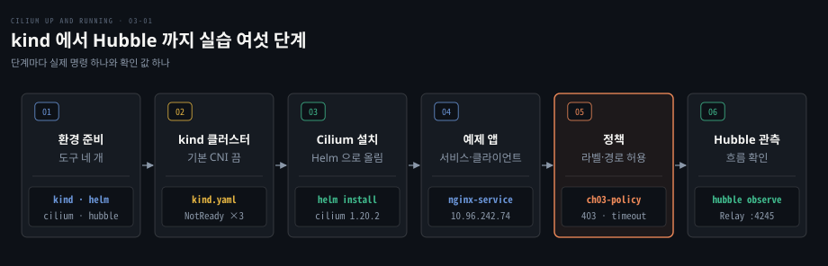
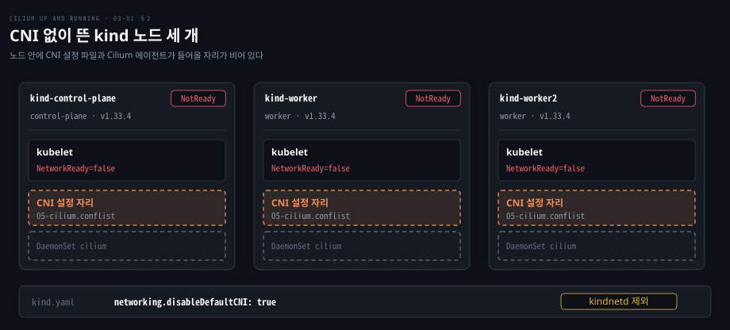
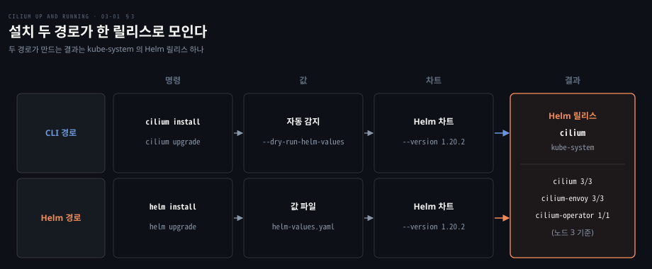
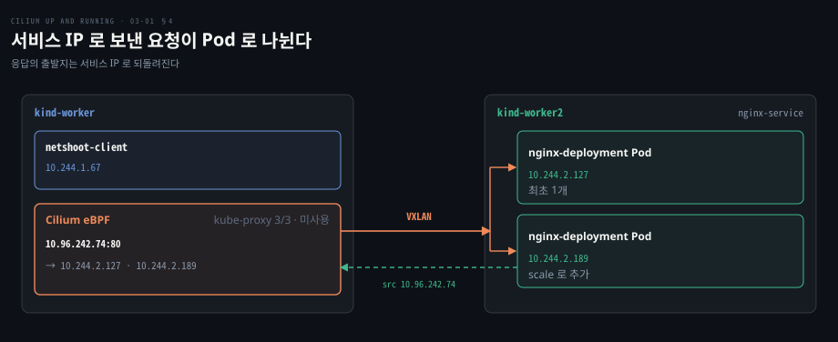
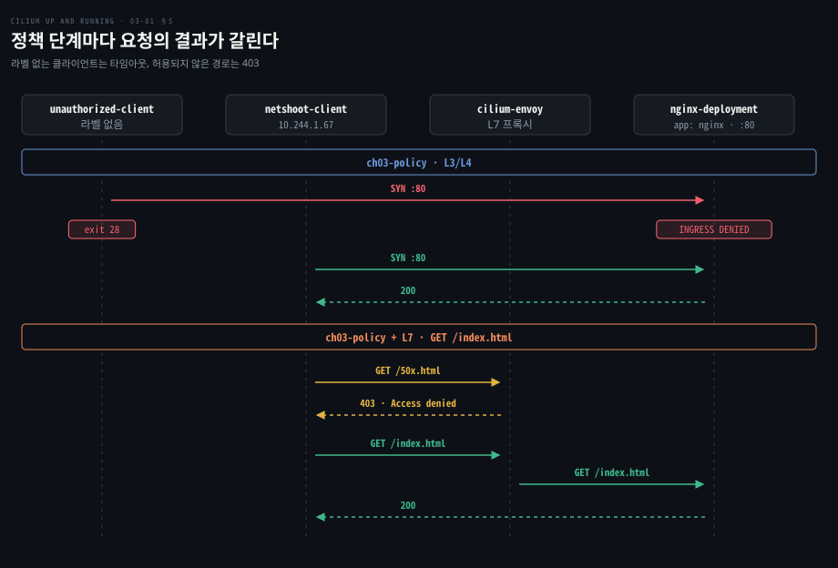
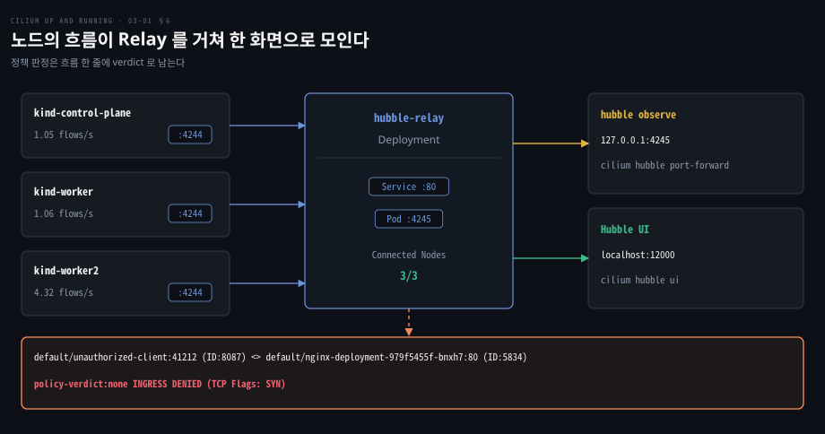

# Cilium 은 kind 클러스터에 Helm 으로 설치하고 정책과 Hubble 로 동작을 확인한다

---

> CNI 가 없는 kind 클러스터에 Helm 으로 Cilium 을 올리고, 예제 앱에 L3/L4 정책과 L7 정책을 걸어 그 판정을 Hubble 로 확인하는 첫 실습입니다.


## 핵심 요약

> 이 편의 중심 생각은 설치가 끝이 아니라 정책을 걸고 Hubble 로 그 판정을 눈으로 확인하는 데까지가 한 사이클이라는 것입니다.

kind 에서 기본 CNI 를 끄면 노드가 `NotReady` 로 남고 Cilium 을 설치해야 Pod 네트워크가 열립니다. `cilium install` 과 `helm install` 은 같은 Helm 릴리스를 만들며 설정을 파일로 남기려면 Helm 이 낫습니다.

정책은 두 층으로 걸립니다. 라벨로 클라이언트를 가리는 L3/L4 규칙은 패킷을 조용히 버려 타임아웃이 되고 HTTP 경로까지 가르는 L7 규칙은 Envoy 가 403 을 돌려줍니다. 두 결과는 `hubble observe` 의 verdict 에서 갈립니다.




## 학습 목표

> 이 편을 읽고 나면 다음을 설명할 수 있습니다.

1. kind 에서 기본 CNI 를 끄는 이유와 CNI 가 없을 때 노드의 상태를 설명할 수 있습니다.
2. `cilium install` 과 `helm install` 이 같은 Helm 릴리스를 만든다는 점과 Helm 을 권하는 이유를 말할 수 있습니다.
3. `cilium status` 에서 에이전트·Envoy·오퍼레이터 수를 읽을 수 있습니다.
4. 서비스 IP 로 보낸 요청의 경로와 스케일 뒤 엔드포인트의 변화를 확인할 수 있습니다.
5. L3/L4 정책과 L7 정책의 거절 방식이 다른 이유를 설명하고 `hubble observe` 로 판정을 찾을 수 있습니다.


## 1. 실습 환경은 kind 와 CLI 세 개로 꾸린다

> 클러스터 하나와 도구 셋을 먼저 갖춰야 이 편의 명령이 돌아갑니다. 도구마다 맡은 일을 알면 명령이 헷갈리지 않습니다.

실습용 클러스터는 어떻게 구하고 어느 도구로 무엇을 다룰까요? 가상 머신 노드는 자원이 많이 들어서 이 편은 **kind**(Kubernetes in Docker)를 씁니다. kind 는 노드 하나를 Docker 컨테이너 하나로 흉내 내어 컨트롤 플레인과 워커를 로컬 Docker 위에 올립니다.

나머지 셋은 내 터미널에서 쓰는 클라이언트입니다. 설치 명령은 Homebrew 기준입니다.

| 도구 | 맡는 일 | 설치 |
|------|---------|------|
| kind | 노드 컨테이너로 클러스터 생성·삭제 | `brew install kind` |
| cilium CLI | Cilium 설치·상태 점검·기능 켜고 끄기 | `brew install cilium-cli` |
| hubble CLI | Hubble 이 모은 흐름 조회 | `brew install hubble` |
| Helm | 차트로 Cilium 설치·설정 관리 | `brew install helm` |

Homebrew 가 없으면 [공식 문서](https://docs.cilium.io/en/stable/gettingstarted/k8s-install-default/)의 tarball 설치를 따릅니다. 2026-10-10 기준 안정 버전은 cilium CLI [v0.20.1](https://raw.githubusercontent.com/cilium/cilium-cli/main/stable.txt), hubble CLI [v1.20.2](https://raw.githubusercontent.com/cilium/hubble/main/stable.txt), Cilium [1.20.2](https://docs.cilium.io/en/stable/) 이고 Helm 은 [3.13.0 이상](https://docs.cilium.io/en/stable/installation/kind/)이 필요합니다. 실험용이므로 운영 클러스터에는 돌리지 않습니다.


## 2. kind 클러스터는 기본 CNI 를 끄고 띄운다

> kind 는 기본으로 자체 CNI 를 설치하므로 Cilium 을 쓰려면 그것을 끈 클러스터를 만들어야 합니다. CNI 가 비어 있는 동안 노드는 `NotReady` 로 남습니다.

왜 클러스터를 만들 때부터 CNI 를 끌까요? Pod 에 IP 를 주고 서로 닿게 하는 일은 [CNI 의 몫](../networking-and-kubernetes/04-02.CNI와%20kube-proxy%20—%20Pod%20네트워크의%20배선공과%20로드밸런서.md)인데 kind 는 kindnetd 를 기본으로 깔아 둡니다. Cilium 이 그 자리를 맡도록 처음부터 빼 두는 것이며, kind 의 [설정 문서](https://kind.sigs.k8s.io/docs/user/configuration/)는 `networking.disableDefaultCNI: true` 가 기본 CNI 를 설치하지 않게 한다고 설명합니다.

```yaml
kind: Cluster
apiVersion: kind.x-k8s.io/v1alpha4
nodes:
- role: control-plane
- role: worker
- role: worker
networking:
  disableDefaultCNI: true
```

워커가 둘이라서 노드 사이 통신을 만들 수 있고 kube-proxy 는 건드리지 않아 kind 기본값인 iptables 모드로 뜹니다. `kind create cluster --config kind.yaml` 로 만든 이 실습의 클러스터에서 노드는 모두 `NotReady` 였습니다.

```bash
kubectl get nodes
NAME                 STATUS     ROLES           AGE   VERSION
kind-control-plane   NotReady   control-plane   6m    v1.33.4
kind-worker          NotReady   <none>          6m    v1.33.4
kind-worker2         NotReady   <none>          6m    v1.33.4
```

이유는 노드 YAML 의 상태 메시지에 있습니다. `kubectl get nodes kind-worker -o yaml` 로 보면 `NetworkReady=false` 와 `NetworkPluginNotReady`, `cni plugin not initialized` 가 나옵니다. 런타임이 CNI 플러그인을 초기화하지 못했다고 답해서 kubelet 이 일을 받을 수 없다고 보고한 것입니다.

Cilium 의 [kind 가이드](https://docs.cilium.io/en/stable/installation/kind/)도 설치 전 `NotReady` 는 정상이라고 적습니다. CNI 없는 클러스터의 Pod 는 [Kubernetes 네트워크 실습](../networking-and-kubernetes/04-04.Kubernetes%20네트워크%20실습%20—%20CNI%20부재부터%20정책·DNS까지.md)에서 따라 해 볼 수 있습니다.



도식의 점선 칸 둘(CNI 설정 파일 `05-cilium.conflist` 자리와 `cilium` DaemonSet 자리)이 비어 있습니다. 다음 절의 설치가 이 두 칸을 채웁니다.


## 3. Cilium CLI 는 빠르고 Helm 은 설정을 코드로 남긴다

> 설치 경로가 둘이어도 결과는 같은 Helm 릴리스입니다. 차이는 값을 어디에 두고 어떻게 되풀이하느냐에 있습니다.

`cilium install` 과 `helm install` 중 무엇을 써야 할까요? [cilium CLI 저장소](https://github.com/cilium/cilium-cli)에 따르면 `cilium install` 도 Helm 릴리스를 만듭니다. `helm list -n kube-system` 으로 그 릴리스를 보고 `helm get values -n kube-system cilium` 으로 CLI 가 고른 비기본 값을 확인합니다. 같은 차트를 두 방법으로 설치하는 셈입니다.

cilium CLI 는 현재 kubectl 컨텍스트를 살펴 값을 대신 채우고, 설치 전에 그 값만 미리 볼 수 있습니다.

```bash
cilium install --dry-run-helm-values
cluster:
  name: kind-kind
ipam:
  mode: kubernetes
operator:
  replicas: 1
routingMode: tunnel
tunnelProtocol: vxlan
```

값의 뜻은 이렇습니다.

- `ipam.mode: kubernetes` 는 Pod IP 를 노드에 배정된 PodCIDR 에서 꺼내라는 뜻이며([IPAM 문서](https://docs.cilium.io/en/stable/network/concepts/ipam/kubernetes/)) 차트 기본값 `cluster-pool` 과 다릅니다.
- `operator.replicas: 1` 은 차트 기본값 2 를 줄인 값입니다([Helm 레퍼런스](https://docs.cilium.io/en/stable/helm-reference/)).
- `routingMode: tunnel` 과 `tunnelProtocol: vxlan` 은 노드 사이 통신을 VXLAN 터널로 감싼다는 뜻이고 기본값과 같습니다.

IPAM 과 라우팅은 [IPAM 편](./04-01.Cilium%20IPAM%20모드는%20Pod%20대역을%20누가%20나눠%20주는지로%20갈린다.md)과 [데이터패스 편](./05-01.Cilium%20데이터패스는%20같은%20노드는%20eBPF%20로%20바로%20넘기고%20다른%20노드는%20라우팅이나%20터널로%20잇는다.md)에서 다룹니다. 권장 경로는 Helm 이며 값 파일은 Git 에 남기고 CI/CD·GitOps 에 올리기 쉽습니다.

```bash
helm repo add cilium https://helm.cilium.io/
helm install cilium cilium/cilium -n kube-system \
     --version 1.20.2 \
     --values helm-values.yaml
```

값은 `--set cluster.name=kind-kind` 처럼 하나씩 넘길 수도 있습니다. `--version` 은 버전 고정이며, 생략하면 환경마다 설치 버전이 달라질 수 있어 운영에서는 고정하고 업그레이드를 의도해서 합니다.



도식에서 두 경로는 명령과 값 단계에서 갈리고 한 릴리스로 모입니다. 다만 `cilium upgrade` 는 비기본 값을 자동으로 바꾸지 않으므로 올리기 전에 `--dry-run-helm-values` 로 확인하라고 [문서](https://github.com/cilium/cilium-cli)가 안내합니다.

설치 뒤에는 `cilium status` 로 상태를 봅니다. 이 실습의 클러스터 출력(Cilium 1.18.4)에서 줄여 옮깁니다.

```bash
cilium status
Cilium:           OK
Operator:         OK
Envoy DaemonSet:  OK
Hubble Relay:     disabled
[...]
DaemonSet     cilium           Desired: 3, Ready: 3/3
DaemonSet     cilium-envoy     Desired: 3, Ready: 3/3
Deployment    cilium-operator  Desired: 1, Ready: 1/1
[...]
```

노드가 셋이라 에이전트와 `cilium-envoy` 가 3개씩이고 오퍼레이터는 1개입니다. 이 분리는 [앞 편](./02-01.Cilium%20은%20에이전트·CNI%20플러그인·오퍼레이터로%20나눠%20노드와%20클러스터를%20맡는다.md)에서 본 구조 그대로이며 별도 Envoy 는 새 설치의 [기본값](https://docs.cilium.io/en/stable/helm-reference/)입니다. `Hubble Relay: disabled` 는 오류가 아니라 기본값이고 6절에서 켭니다.


## 4. 예제 앱은 서비스 하나와 클라이언트 둘이다

> 정책을 걸기 전에 앱이 서비스 IP 로 닿는지부터 확인합니다. 기준선이 있어야 정책 뒤의 변화가 보입니다.

Pod 가 어느 노드에 올라갔고 서비스 IP 로 닿는지는 무엇으로 확인할까요? 예제는 nginx 한 대와 클라이언트용 netshoot Pod 입니다. netshoot 은 네트워크 도구 모음 이미지인데 한 번 실행하고 끝나므로 `sleep infinity` 로 계속 띄워 둡니다. `nodeSelector` 로 nginx 는 `kind-worker2` 에, 클라이언트는 `kind-worker` 에 고정해 노드 사이 통신이 VXLAN 터널을 타게 합니다.

```bash
kubectl get pods -o wide
NAME                               READY   IP             NODE
nginx-deployment-979f5455f-tjd2w   1/1     10.244.2.127   kind-worker2
netshoot-client                    1/1     10.244.1.67    kind-worker
```

두 IP 는 `kind-worker` 의 PodCIDR `10.244.1.0/24` 와 `kind-worker2` 의 `10.244.2.0/24` 안에 있습니다. 열은 일부 생략했고, 두 Pod 를 띄운 뒤의 출력을 합쳐 옮겼습니다. Pod 는 다시 뜰 때마다 IP 가 바뀌므로 쿠버네티스는 서비스로 고정 가상 IP 를 줍니다.

`nginx-service` 는 TCP 80 을 `nginx` 라벨 Pod 로 보내는 [ClusterIP](../networking-and-kubernetes/05-02.Service%205유형%20—%20ClusterIP에서%20LoadBalancer까지.md) 서비스입니다. 이 실습에서는 `10.96.242.74` 가 배정됐고 kind 의 기본 서비스 대역은 `10.96.0.0/16` 입니다([kind 설정 문서](https://kind.sigs.k8s.io/docs/user/configuration/#service-subnet)).

```bash
kubectl exec netshoot-client -- curl http://10.96.242.74
<h1>Welcome to nginx!</h1>
```

요청은 서비스 IP 로 가고 응답은 백엔드 Pod 가 만들지만 클라이언트에는 출발지가 서비스 IP 로 보입니다. Cilium eBPF 가 주소를 되돌려 주기 때문입니다. 서비스에 속한 Pod 목록은 [EndpointSlice](../networking-and-kubernetes/05-01.StatefulSet·Endpoints·EndpointSlices%20—%20서비스의%20재료.md)가 관리하는데 스케일하면 어떻게 바뀔까요? 처음에는 `10.244.2.127` 하나였던 목록에 새 Pod 의 IP 가 자동으로 더해집니다.

```bash
kubectl scale deployment nginx-deployment --replicas=2
kubectl get endpointslices.discovery.k8s.io nginx-service-66q4l
NAME                  ADDRESSTYPE   PORTS   ENDPOINTS
nginx-service-66q4l   IPv4          80      10.244.2.127,10.244.2.189
```



도식의 `kube-proxy 3/3` 에 짚을 점이 있습니다. kube-proxy 가 떠 있어도 ClusterIP 는 Cilium 이 처리합니다. 차트의 `kubeProxyReplacement` 기본값 `false` 가 클러스터 안 ClusterIP 의 로드밸런싱을 Cilium 에 맡기기 때문입니다([공식 문서](https://docs.cilium.io/en/stable/network/kubernetes/kubeproxy-free/)). kube-proxy 를 완전히 없애는 구성은 뒤 편에서 다룹니다.


## 5. 정책은 라벨로 허용하고 L7 규칙으로 경로까지 막는다

> Cilium 정책은 라벨로 대상을 가리고 한 방향에 정책이 걸리면 그 방향은 허용 목록 밖이 전부 막힙니다. L3/L4 에서는 패킷이 사라지고 L7 에서는 HTTP 응답이 돌아옵니다.

nginx 에 누가 접근하고 누가 막혀야 할까요? 목표는 `netshoot-client` 만 80 포트를 쓰게 하는 것입니다. 대조용으로 라벨 없는 `unauthorized-client` Pod 를 하나 더 띄웁니다. 정책은 **CiliumNetworkPolicy**(CNP)로 씁니다.

```yaml
apiVersion: cilium.io/v2
kind: CiliumNetworkPolicy
metadata:
  name: ch03-policy
  namespace: default
spec:
  endpointSelector:
    matchLabels:
      app.kubernetes.io/name: nginx
  ingress:
    - fromEndpoints:
        - matchLabels:
            app.kubernetes.io/name: netshoot-client
      toPorts:
        - ports:
            - port: "80"
              protocol: TCP
```

`endpointSelector` 는 적용 대상 Pod, `fromEndpoints` 는 허용할 출발지 라벨, `toPorts` 는 허용 포트입니다. 평소 모든 Pod 는 양방향이 열려 있다가 정책에 선택되는 순간 그 방향은 허용 목록만 통과합니다. [정책 문서](https://docs.cilium.io/en/stable/security/policy/intro/)에 따르면 이 전환은 방향별이라 `ingress` 절이 있는 규칙은 ingress 만 기본 거부로 바꿉니다.

쿠버네티스 NetworkPolicy 와는 무엇이 다를까요? Cilium 은 둘 다 지원하며 [공식 문서](https://docs.cilium.io/en/stable/network/kubernetes/policy/)에 따르면 표준 NetworkPolicy 는 L3·L4 규칙만 표현하고 CNP 는 L3~L7 규칙을 양방향에 씁니다. 표준 NetworkPolicy 의 기본은 [NetworkPolicy 와 DNS](../networking-and-kubernetes/04-03.NetworkPolicy와%20DNS%20—%20클러스터%20안의%20방화벽과%20이름.md)에 있습니다.

정책을 적용하고 두 클라이언트에서 요청하면 결과가 갈립니다.

```bash
kubectl exec unauthorized-client -- curl --max-time 3 -s http://nginx-service
command terminated with exit code 28

kubectl exec netshoot-client -- curl --max-time 3 -s http://nginx-service
<h1>Welcome to nginx!</h1>
```

허용되지 않은 요청은 거부 응답이 아니라 타임아웃(curl 종료 코드 28)으로 끝났습니다. L3/L4 에서 거부된 패킷은 응답 없이 버려지므로 보낸 쪽은 기다리다 끝납니다. ICMP 로 거절을 알리는 `--policy-deny-response=icmp` 는 egress 에만 쓰는 실험 기능입니다([정책 문서](https://docs.cilium.io/en/stable/security/policy/intro/#policy-deny-response-handling)).

L7 은 같은 정책에 HTTP 규칙을 더합니다. 오류 페이지 `/50x.html` 은 지금 정책으로도 열리므로 `toPorts` 의 포트 아래에 규칙을 더해 허용을 `GET /index.html` 로 좁힙니다.

```yaml
          rules:
            http:
              - method: "GET"
                path: "/index.html"
```

L7 규칙에 걸리는 트래픽은 Envoy 가 HTTP 검사를 맡습니다([앞 편의 L7 분업](./02-01.Cilium%20은%20에이전트·CNI%20플러그인·오퍼레이터로%20나눠%20노드와%20클러스터를%20맡는다.md)). 정책을 덮어쓴 뒤 `/50x.html` 을 부르면 `Access denied` 가 돌아오고 `/index.html` 은 그대로 열립니다. 이번에는 타임아웃이 아니라 응답이 온 것입니다. Envoy 의 HTTP 거부는 403 Forbidden 과 본문 `Access denied` 입니다([cilium/proxy 소스](https://github.com/cilium/proxy/blob/main/cilium/l7policy.cc)).



도식에서 라벨 없는 클라이언트는 `INGRESS DENIED` 로 버려져 `exit 28` 이 되고, L7 단계에서는 허용 안 된 경로만 Envoy 에서 403 으로 끝납니다.


## 6. Hubble 은 정책 판정을 흐름 단위로 보여 준다

> 응답만으로는 정책의 동작을 알기 어렵습니다. Hubble 은 어느 요청이 무슨 이유로 막혔는지 흐름 한 줄씩 보여 줍니다.

타임아웃이 정책 때문인지 네트워크 장애 때문인지 어떻게 구별할까요? 그 답이 Hubble 이고 Cilium 없이는 쓸 수 없습니다. 기본으로는 각 노드의 에이전트 안에서 돌며 그 노드의 트래픽만 압니다. 클러스터 전체는 Hubble Relay 가 묶으며, [설정 문서](https://docs.cilium.io/en/stable/observability/hubble/setup/)에 따르면 `helm install` 한 설치에서 Hubble 은 켜져 있고 Relay 는 꺼져 있습니다. Relay 가 노드에 닿으려면 노드의 TCP 4244 가 열려 있어야 합니다.

```bash
helm upgrade cilium cilium/cilium --version 1.20.2 \
    -n kube-system --reuse-values \
    --set hubble.relay.enabled=true
```

`cilium status` 의 `Hubble Relay` 가 `OK` 면 됩니다.

Relay 에 닿으려면 왜 port-forward 를 할까요? Relay 는 클러스터 안의 서비스이고 hubble CLI 는 내 노트북에서 돌아서 직접 닿지 못합니다. `cilium hubble port-forward` 가 로컬 4245 를 Relay 서비스로 잇습니다. hubble CLI 의 기본 서버 주소도 `localhost:4245` 입니다([설정 문서](https://docs.cilium.io/en/stable/observability/hubble/setup/)). 이어서 `hubble list nodes` 를 실행하면 세 노드가 `Connected` 로, 노드별 초당 흐름(1.05·1.06·4.32)과 함께 보입니다. port-forward 는 로컬 4245 를 Relay 서비스의 80 포트로 잇습니다.

```bash
cilium hubble port-forward &
Hubble Relay is available at 127.0.0.1:4245
```

`hubble observe` 는 흐름을 나열합니다. 이 실습의 클러스터에서 netshoot-client 가 만든 흐름입니다(읽기 좋게 줄을 나눴습니다).

```bash
hubble observe
Mar 14 11:22:41.654: default/netshoot-client:50976 (ID:18901) ->
  kube-system/coredns-668d6bf9bc-qdkn6:53 (ID:23236)
  to-overlay FORWARDED (UDP)
[...]
```

한 줄은 시각, 출발지(Pod:포트와 보안 신원 `ID`), 방향 화살표, 도착지, 판정 순서입니다. `to-overlay` 는 패킷이 지난 자리로, CoreDNS 가 다른 노드에 있어 DNS 질의가 VXLAN 터널로 나갔다는 뜻이고 `FORWARDED` 는 전달됐다는 결과입니다.

드롭 이유는 어느 필드가 알려 줄까요? 정책 판정만 모으는 `-t policy-verdict` 에서 거부된 줄이 보입니다.

```bash
hubble observe -t policy-verdict
Mar 21 12:15:40.016: default/unauthorized-client:41212 (ID:8087) <>
  default/nginx-deployment-979f5455f-bnxh7:80 (ID:5834)
  policy-verdict:none INGRESS DENIED (TCP Flags: SYN)
[...]
```

`policy-verdict:none INGRESS DENIED` 가 5절의 타임아웃이 정책 때문이라는 증거이고 `none` 은 이 요청을 허용한 규칙이 없다는 뜻입니다. `--verdict DROPPED` 는 버려진 흐름을 `Policy denied DROPPED` 로 보여 줍니다([공식 문서](https://docs.cilium.io/en/stable/observability/hubble/hubble-cli/)).

필터는 겹쳐 쓸 수 있습니다. `--from-pod netshoot-client`·`--http-path "/index.html"`·`--label app.kubernetes.io/name=nginx` 가 그 예입니다. L7 정책 뒤 `--from-pod` 출력의 `to-proxy FORWARDED` 는 트래픽이 Envoy 로 넘어갔다는 확인입니다.

화면으로 보려면 Hubble UI 를 켭니다. [공식 문서](https://docs.cilium.io/en/stable/observability/hubble/hubble-ui/)에 따르면 `cilium hubble enable --ui` 한 줄이면 되고 Helm 에서는 `hubble.ui.enabled=true` 를 더합니다. `cilium hubble ui` 가 로컬 12000 포트를 UI 로 잇습니다.

`default` 네임스페이스를 고르면 같은 흐름이 서비스 맵으로 그려지고 L7 정책이 걸린 흐름에는 Envoy 가 덧붙인 HTTP 경로·메서드·지연이 `L7 info` 열에 보입니다.



도식 아래 한 줄이 앞에서 본 거부 판정 기록입니다. 노드마다 Hubble 서버가 흐름을 쥐고 Relay 가 묶어 CLI 와 UI 에 내보냅니다.


## 7. 정리

> 설치·정책·관측의 첫 사이클을 돌았습니다. 다음 편은 Pod IP 가 어디서 나오는지 IPAM 으로 들어갑니다.

기본 CNI 를 끈 kind 에 Helm 으로 Cilium 을 올리고 L3/L4 와 L7 정책의 결과를 Hubble 에서 확인했습니다. PodCIDR 와 VXLAN 은 설정값으로만 지나갔고 그 값이 Pod IP 를 정하는 방식(IPAM)이 다음 편의 주제입니다.


## 면접 대비

> 첫 실습의 이해를 확인하는 질문입니다.

1. kind 에서 `disableDefaultCNI: true` 를 쓰는 이유와 CNI 가 없을 때 노드의 상태는 무엇입니까?
2. `cilium install` 과 `helm install` 은 어떤 관계이며 운영에서 Helm 을 권하는 이유는 무엇입니까?
3. kube-proxy 가 떠 있는데도 ClusterIP 서비스를 Cilium 이 처리하는 이유는 무엇입니까?
4. L3/L4 정책으로 막힌 요청은 타임아웃이 되고 L7 정책으로 막힌 요청은 403 이 되는 이유는 무엇입니까?
5. 정책 때문에 막혔음을 `hubble observe` 로 확인하는 방법과 Relay 에 port-forward 로 접속하는 이유는 무엇입니까?


## 정답 (자답 후 펼치기)

> 면접 질문에 대한 키워드 중심의 모범 답안입니다.

### 정답 1 — CNI 교체와 NetworkReady=false

kindnetd 대신 Cilium 이 CNI 를 맡도록 끕니다. CNI 가 비면 kubelet 이 `NetworkReady=false` 를 받아 노드가 `NotReady` 로 남고 Cilium 이 설치되면 `Ready` 가 됩니다.

### 정답 2 — 같은 Helm 릴리스와 선언적 설정

`cilium install` 도 Helm 릴리스를 만들어 `helm list` 로 확인되는 같은 차트의 경로입니다. cilium CLI 는 컨텍스트를 감지해 값을 채우고 Helm 은 값 파일을 넘기며, 값 파일은 Git·GitOps 로 환경을 재현하게 하므로 Helm 을 권합니다.

### 정답 3 — kubeProxyReplacement 기본값

`kubeProxyReplacement` 기본값 `false` 에서도 클러스터 안 ClusterIP 로드밸런싱은 Cilium eBPF 가 맡아 kube-proxy 는 서비스 조회에 쓰이지 않습니다.

### 정답 4 — 패킷 드롭과 Envoy 의 HTTP 응답

L3/L4 거부는 패킷을 조용히 버려 보낸 쪽이 타임아웃(curl 종료 코드 28)을 겪습니다. L7 규칙에 걸리는 트래픽은 Envoy 가 HTTP 를 파싱해 허용되지 않은 요청에 403 과 `Access denied` 로 답합니다.

### 정답 5 — policy-verdict 와 port-forward

`hubble observe -t policy-verdict` 의 `policy-verdict:none INGRESS DENIED` 는 허용 규칙이 없어 거부됐다는 뜻입니다. Relay 는 클러스터 안의 서비스라 밖의 hubble CLI 가 `cilium hubble port-forward` 로 로컬 4245 를 이어 접속합니다.


## 참고 자료

- Nico Vibert 외, 《Cilium: Up and Running》, O'Reilly, 2026, ISBN 979-8-341-62299-9, Chapter 3.
- Cilium kind 설치: https://docs.cilium.io/en/stable/installation/kind/
- cilium CLI 저장소: https://github.com/cilium/cilium-cli
- Cilium Helm 레퍼런스: https://docs.cilium.io/en/stable/helm-reference/
- 네트워크 정책 개요: https://docs.cilium.io/en/stable/security/policy/intro/
- cilium/proxy L7 정책 필터: https://github.com/cilium/proxy/blob/main/cilium/l7policy.cc
- Hubble 설정: https://docs.cilium.io/en/stable/observability/hubble/setup/


## 관련 문서

- [Cilium 은 eBPF 데이터패스로 iptables 기반 CNI 의 한계를 넘는다](./01-01.Cilium%20은%20eBPF%20데이터패스로%20iptables%20기반%20CNI%20의%20한계를%20넘는다.md)
- [Cilium 은 에이전트·CNI 플러그인·오퍼레이터로 나눠 노드와 클러스터를 맡는다](./02-01.Cilium%20은%20에이전트·CNI%20플러그인·오퍼레이터로%20나눠%20노드와%20클러스터를%20맡는다.md)
- [NetworkPolicy와 DNS — 클러스터 안의 방화벽과 이름](../networking-and-kubernetes/04-03.NetworkPolicy와%20DNS%20—%20클러스터%20안의%20방화벽과%20이름.md)
