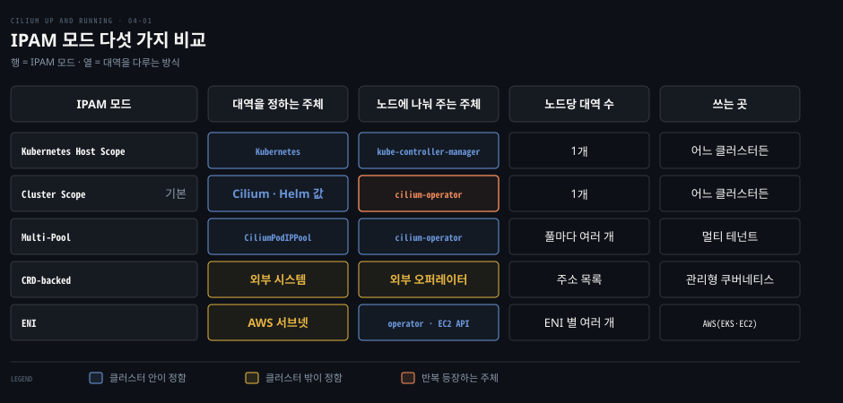
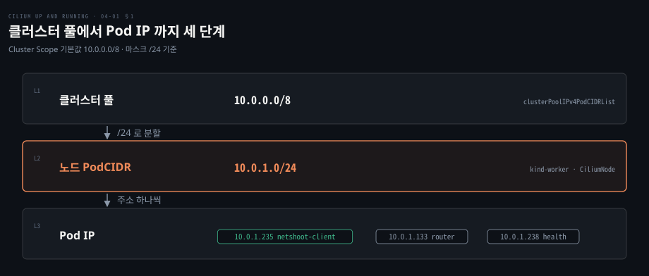
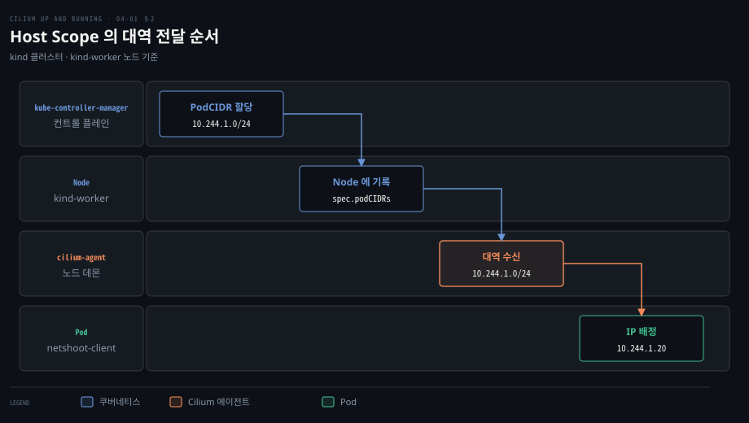
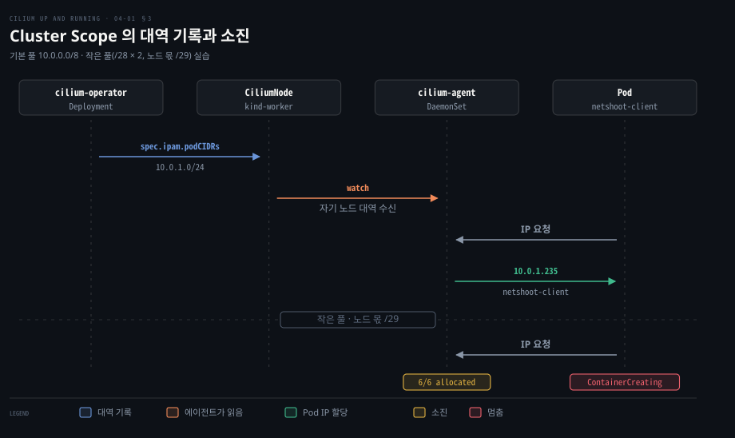
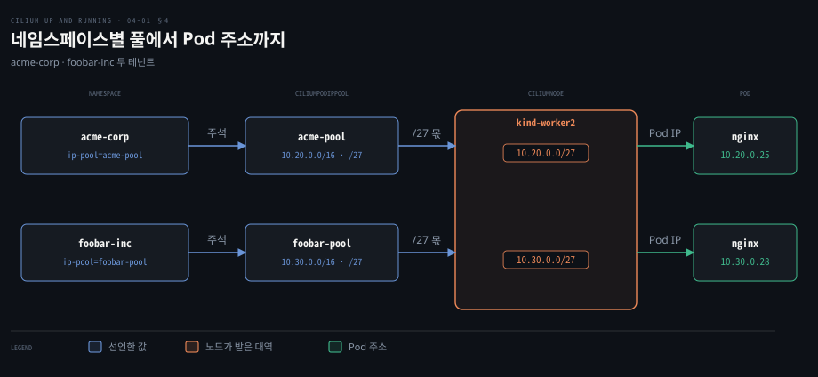
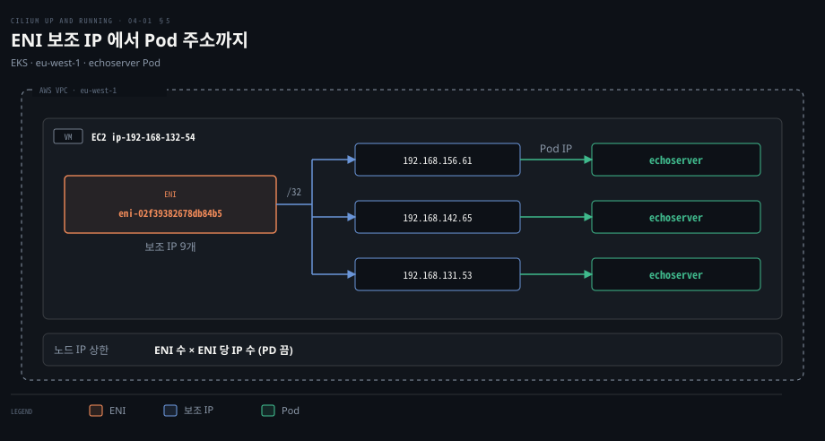
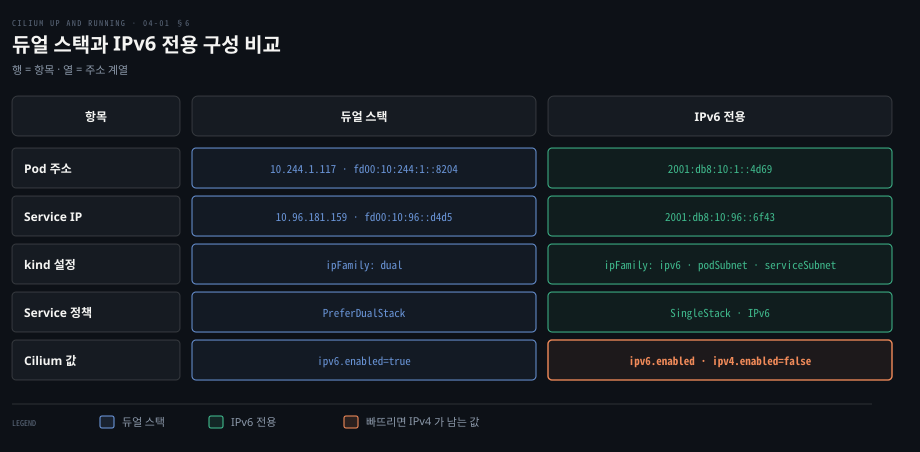

# Cilium IPAM 모드는 Pod 대역을 누가 나눠 주는지로 갈린다

---

> Pod IP 는 클러스터 대역, 노드 PodCIDR, 개별 주소 순서로 좁혀지고 IPAM 모드는 가운데 단계인 노드 PodCIDR 을 누가 나눠 주는지에 따라 다섯 갈래로 나뉩니다.


## 핵심 요약

> 이 편의 중심 생각은 IPAM 모드를 고르는 일이 곧 노드 대역을 누가 정하고 나눠 주는지 고르는 일이며 그 선택이 대역 확장 가능성과 노드당 대역 수를 함께 정한다는 것입니다.

Host Scope 는 쿠버네티스가 나눈 대역을 읽고 Cluster Scope 는 cilium-operator 가 `CiliumNode` 로 나눕니다. Multi-Pool 은 네임스페이스나 주석마다 다른 풀에서 주소를 주고 CRD-backed 와 ENI 는 외부 시스템이 정합니다. 기준은 Cilium 1.20.2 문서(stable)입니다.

주소 계열은 IPv4 단독, 듀얼 스택, IPv6 전용 중에서 고릅니다. 듀얼 스택은 Pod 와 Service 가 주소를 둘씩 받고 IPv6 전용은 외부 의존성을 파악한 새 클러스터에 맞습니다. 두 결정 모두 운영 중에 바꾸면 연결이 끊길 수 있어 클러스터를 만들 때 정합니다.




## 학습 목표

> 이 편을 읽고 나면 다음을 설명할 수 있습니다.

1. Pod IP 를 세 단계로 나누는 이유와 모드를 고르는 기준을 설명할 수 있습니다.
2. Host Scope 에서 노드 대역이 내려오는 순서와 바꾸기 어려운 이유를 말할 수 있습니다.
3. Cluster Scope 의 기본값과 대역 소진 때의 증상, 확장 방법을 설명할 수 있습니다.
4. Multi-Pool 의 풀 선택 순서와 라우팅을 맡는 장치를 설명할 수 있습니다.
5. CRD-backed·ENI 의 주소 출처와 듀얼 스택·IPv6 전용의 차이를 비교할 수 있습니다.


## 1. Pod 마다 IP 를 주려면 대역을 클러스터·노드·Pod 세 단계로 쪼갠다

> 클러스터 풀을 노드 단위로 미리 쪼개 두면 Pod 가 뜰 때 중앙과 통신하지 않아도 됩니다. 모드를 고르는 질문은 이 쪼개는 일을 누가 하느냐입니다.

### 왜 노드마다 PodCIDR 을 미리 나눠 주는가

Pod 가 뜰 때마다 클러스터 전체 풀에서 주소를 받는다고 해 봅시다. 노드가 수백 대면 모두가 같은 풀을 놓고 경합합니다. 그래서 풀을 노드 단위로 미리 떼어 주고 그 안에서 고르는 일은 노드의 에이전트가 맡습니다. Cilium 의 [Cluster Scope 문서](https://docs.cilium.io/en/v1.20/network/concepts/ipam/cluster-pool/)도 노드마다 PodCIDR 을 배정한 뒤 각 노드의 host-scope 할당기가 IP 를 나눠 준다고 설명합니다.

쿠버네티스의 노드 대역 배분은 [Kubernetes 네트워킹 모델 3절](../networking-and-kubernetes/04-01.Kubernetes%20네트워킹%20모델%20—%20Pod%20IP·레이아웃·Probe.md)에, CIDR 계산은 [IP — 데이터그램과 주소 2절](../../../02_os/book/cntd_computer-networking-top-down/04-03.IP%20—%20데이터그램과%20주소.md)에 있습니다. 



### IPAM 모드를 고르는 기준

| 상황 | 고를 모드 |
|------|----------|
| 쿠버네티스가 이미 노드 PodCIDR 을 주고 바꿀 일이 없다 | Host Scope |
| 쿠버네티스 설정과 무관하게 Cilium 이 대역을 관리하고 싶다 | Cluster Scope |
| 테넌트마다 다른 대역이 필요하거나 대역을 키워야 한다 | Multi-Pool |
| 별도 오퍼레이터가 주소를 관리한다 | CRD-backed |
| AWS 에서 Pod 가 VPC 주소를 직접 받아야 한다 | ENI |

Helm 의 `ipam.mode` 기본값은 `cluster-pool` 입니다([Helm 레퍼런스](https://docs.cilium.io/en/v1.20/helm-reference/)). 모드는 운영 중에 바꾸지 않는 것이 원칙이고 가장 안전한 길은 새 클러스터입니다. 온라인 이전은 cluster-pool 에서 multi-pool 로 가는 경로뿐입니다([IPAM 개요](https://docs.cilium.io/en/v1.20/network/concepts/ipam/)).


## 2. Host Scope 는 쿠버네티스가 나눈 대역을 그대로 쓴다

> Host Scope 에서 Cilium 은 대역을 정하지 않고 노드에 적힌 값을 읽습니다. 배우기는 쉽지만 대역 크기와 개수가 쿠버네티스 설정에 묶입니다.

### 새 노드가 합류하면 값이 이 순서로 내려옵니다

kube-controller-manager 가 `--allocate-node-cidrs` 로 실행 중이면 새 노드의 `Node` 객체에 `spec.podCIDRs` 가 기록됩니다. Cilium 에이전트는 시작할 때 이 값이 나타날 때까지 기다리고 값을 받으면 그 범위에서 Pod IP 를 배정합니다([Host Scope 문서](https://docs.cilium.io/en/v1.20/network/concepts/ipam/kubernetes/)). 이 모드는 `ipam.mode=kubernetes` 이고 [03-01](./03-01.Cilium%20은%20kind%20클러스터에%20Helm%20으로%20설치하고%20정책과%20Hubble%20로%20동작을%20확인한다.md)의 설치 실습과 같은 값입니다.

kind 는 기본으로 `10.244.0.0/16` 을 Pod 대역으로 쓰고([kind 설정 문서](https://kind.sigs.k8s.io/docs/user/configuration/)) 쿠버네티스가 노드마다 `/24` 를 줍니다. 예시 kind 클러스터에서 이 노드의 값은 다음과 같고, 이 노드에 올린 Pod 는 `10.244.1.20` 처럼 노드 대역 안의 주소를 받습니다.

```bash
kubectl get node kind-worker -o jsonpath='{.spec.podCIDRs}'
["10.244.1.0/24"]
```



### 대역을 바꾸거나 늘리기 어려운 이유

한계가 둘 있습니다. 노드 PodCIDR 의 크기는 클러스터 전체에 하나만 정할 수 있고 클러스터나 개별 노드에 CIDR 을 더하거나 뺄 수도 없습니다. 공식 문서의 비교표에서 클러스터당·노드당 CIDR 수가 모두 하나로 고정된 모드는 Host Scope 뿐이며 이 한계가 다음 모드를 찾게 만듭니다.


## 3. Cluster Scope 는 오퍼레이터가 CiliumNode 로 대역을 나눈다

> Cluster Scope 는 대역 배분을 쿠버네티스에서 Cilium 으로 가져옵니다. 쿠버네티스가 PodCIDR 을 주도록 설정되어 있지 않아도 동작하므로 기본 모드가 됩니다.

### 대역은 Helm 값으로 정하고 노드 몫은 CiliumNode 에 적힙니다

cilium-operator 가 노드별 PodCIDR 을 `CiliumNode` 의 `spec.ipam.podCIDRs` 에 적습니다. 에이전트는 그 값이 나온 뒤 자기 몫에서 주소를 고릅니다([Cluster Scope 문서](https://docs.cilium.io/en/v1.20/network/concepts/ipam/cluster-pool/)). 오퍼레이터가 IPAM 을 맡는 이유는 [02-01 4절](./02-01.Cilium%20은%20에이전트·CNI%20플러그인·오퍼레이터로%20나눠%20노드와%20클러스터를%20맡는다.md)에서 다뤘습니다.

기본값은 클러스터 풀 `10.0.0.0/8` 과 노드 몫 `/24` 입니다. 풀 목록은 Helm 값 `ipam.operator.clusterPoolIPv4PodCIDRList` 로 바꿉니다. 노드 몫은 `ipam.operator.clusterPoolIPv4MaskSize` 로 바꿉니다([Helm 레퍼런스](https://docs.cilium.io/en/v1.20/helm-reference/)). 노드당 주소 수는 마스크가 정해서 `/24` 는 주소 256개이고 할당 가능한 것은 254개입니다. 예시 kind 클러스터에서는 이렇게 나옵니다.

```bash
cilium config view | grep cluster-pool
cluster-pool-ipv4-cidr                                      10.0.0.0/8
cluster-pool-ipv4-mask-size                                 24
ipam                                                        cluster-pool

kubectl get ciliumnode -o json | jq -r '.items[] |
    "NODE: \(.metadata.name) CIDR: \(.spec.ipam.podCIDRs[0])"'
NODE: kind-control-plane CIDR: 10.0.0.0/24
NODE: kind-worker CIDR: 10.0.1.0/24
NODE: kind-worker2 CIDR: 10.0.2.0/24
```

기본 풀 `10.0.0.0/8` 이 노드 네트워크와 겹치면 다른 노드로 가는 트래픽을 Pod 로 오인해 연결을 잃으므로 `clusterPoolIPv4PodCIDRList` 를 겹치지 않게 바꿉니다.

### 대역이 소진되면 Pod 는 ContainerCreating 에 머뭅니다

작은 풀로 소진을 재현하는 예시는 `/28` 두 개를 풀로 주고 노드 몫을 `/29` 로 잡은 설정입니다.

```yaml
ipam:
  mode: cluster-pool
  operator:
    clusterPoolIPv4MaskSize: 29
    clusterPoolIPv4PodCIDRList:
      - 10.0.42.0/28
      - 10.0.84.0/28
```

`/28` 하나에는 `/29` 가 둘 들어갑니다. 그래서 세 번째 노드는 두 번째 블록에서 몫을 받습니다(`10.0.84.8/29`). 공식 문서에 따르면 할당기는 CIDR 블록마다 네트워크·브로드캐스트 주소 둘을 뺍니다. 주소 8개인 `/29` 에서 할당 대상은 6개입니다.

마지막 노드에 replica 10개를 고정하면 일부 Pod 가 ContainerCreating 에서 멈추고 에이전트가 몫 소진을 보고합니다.

```bash
kubectl exec -it cilium-qrw2f -n kube-system -- cilium-dbg status
IPAM:                            IPv4: 6/6 allocated from 10.0.84.8/29,
```

`/24` 노드에서 `cilium-dbg status --ver` 를 보면 Pod `10.0.1.235` 와 함께 router `10.0.1.133`, health `10.0.1.238` 도 같은 대역에서 할당된 것으로 나옵니다. `/29` 노드도 같다면 Pod 몫은 6개보다 적습니다.

풀이 바닥나면 `clusterPoolIPv4PodCIDRList` 에 새 항목을 덧붙입니다. 기존 항목을 고치면 예기치 않은 동작이 생기고 `clusterPoolIPv4MaskSize` 도 바꿀 수 없으므로 풀은 처음부터 넉넉히 잡습니다. 모든 Pod 가 같은 풀에서 받는다는 한계는 Multi-Pool 이 풀어 줍니다.




## 4. Multi-Pool 은 네임스페이스·주석마다 다른 풀에서 IP 를 준다

> Multi-Pool 은 풀을 여러 개 두고 워크로드 속성으로 풀을 고릅니다. 한 노드가 풀마다 대역을 따로 받으므로 테넌트별 대역 분리와 동적 확장이 가능합니다.

### 풀은 CiliumPodIPPool 로 선언하고 주석으로 고릅니다

`ipam.mode=multi-pool` 에 `autoCreateCiliumPodIPPools` 를 주면 오퍼레이터가 시작할 때 `default` 풀을 만듭니다. 예시 실습 설정은 다음과 같습니다.

```yaml
ipam:
  mode: multi-pool
  operator:
    autoCreateCiliumPodIPPools:
      default:
        ipv4:
          cidrs: ["10.10.0.0/16"]
          maskSize: 27
endpointRoutes:
  enabled: true
routingMode: native
autoDirectNodeRoutes: true
ipv4NativeRoutingCIDR: 10.0.0.0/8
```

테넌트 둘의 풀을 만들고 네임스페이스에 풀 이름을 주석으로 답니다. foobar-pool 은 `10.30.0.0/16` 입니다.

```yaml
apiVersion: cilium.io/v2alpha1
kind: CiliumPodIPPool
metadata:
  name: acme-pool
spec:
  ipv4:
    cidrs: ["10.20.0.0/16"]
    maskSize: 27
```

```bash
kubectl annotate ns acme-corp ipam.cilium.io/ip-pool=acme-pool
kubectl annotate ns foobar-inc ipam.cilium.io/ip-pool=foobar-pool
```

[Multi-Pool 문서](https://docs.cilium.io/en/v1.20/network/concepts/ipam/multi-pool/)가 정한 풀 선택 순서는 셋입니다. 먼저 Pod 나 네임스페이스의 `ipam.cilium.io/ip-pool` 주석을 봅니다. 없으면 풀의 `podSelector`·`namespaceSelector` 에 맞는 풀을 씁니다. 어느 것에도 맞지 않으면 `default` 풀을 씁니다.

Pod 는 주소 계열마다 하나의 풀에만 맞아야 하고 둘 이상에 맞으면 할당이 실패합니다. 주석은 Pod 를 만들 때만 읽힙니다. `ipam.cilium.io/require-pool-match="true"` 를 달면 맞는 풀이 없을 때 `default` 로 떨어지는 대신 할당을 막습니다. Pod 가 직접 풀을 요청할 수도 있어 이 선택은 격리 수단이 아닌 운영 편의 장치입니다.

같은 노드가 풀마다 대역을 받는 모습은 `CiliumNode` 에 드러납니다. acme 디플로이먼트를 40 replica 로 키운 뒤 `kind-worker2` 의 값입니다.

```yaml
pools:
  allocated:
    - {cidrs: [10.20.0.0/27, 10.20.0.32/27], pool: acme-pool}
    - {cidrs: [10.10.0.0/27], pool: default}
    - {cidrs: [10.30.0.0/27], pool: foobar-pool}
  requested:
    - {needed: {ipv4-addrs: 40}, pool: acme-pool}
    - {needed: {ipv4-addrs: 16}, pool: default}
    - {needed: {ipv4-addrs: 10}, pool: foobar-pool}
```

`requested` 는 에이전트가 적는 수요이고 `allocated` 는 오퍼레이터가 채우는 공급입니다. 블록의 첫·끝 주소는 예약되므로 `/27` 에서 쓸 수 있는 주소는 30개입니다. acme Pod 는 `10.20.0.25`, foobar Pod 는 `10.30.0.28` 처럼 자기 풀의 `/27` 에서 주소를 받습니다. replica 10개는 블록 하나로 충분하지만 40개는 모자라 두 번째 `/27`(`10.20.0.32/27`)이 붙었습니다.

default 풀의 16은 사전 할당 기본값 `default=8` 에서 나옵니다. 필요한 수는 `roundUp(사용 중 + 대기 + 8, 8)` 이라 router·health 둘이 쓰는 상태면 16입니다. 미리 잡는 몫이 없는 풀은 사용 중인 개수가 그대로 10과 40입니다.



### 라우팅은 IPAM 이 아니라 다른 장치가 맡습니다

같은 노드의 Pod 가 서로 다른 대역을 받으면 다른 노드는 두 대역이 모두 그 노드에 있다는 사실을 알아야 합니다. IPAM 은 주소만 나눠 주고 경로는 만들지 않습니다. 공식 문서는 Cilium BGP Control Plane 으로 PodCIDR 을 광고하는 방법을 안내합니다. 같은 L2 의 노드끼리는 `autoDirectNodeRoutes` 가 경로를 만듭니다.

위 실습이 `routingMode: native` 와 `autoDirectNodeRoutes: true` 를 함께 둔 이유입니다. 같은 문서의 비교표에서 Multi-Pool 은 터널 라우팅도 지원하므로 native 가 필수 조건은 아닙니다. 풀의 CIDR 은 서로 겹칠 수 없고 마스크 크기는 바꿀 수 없습니다. 새 풀과 새 CIDR 은 실행 중에 더할 수 있습니다.


## 5. CRD-backed 와 ENI 는 IP 를 외부 시스템이 정한다

> 두 모드는 에이전트가 주소 목록을 `CiliumNode` 에서 읽는다는 점이 같습니다. 주소를 정하는 쪽(외부 오퍼레이터나 AWS)이 Cilium 밖에 있으므로 라우팅과 한도도 외부 조건에 묶입니다.

### CRD-backed 는 노드의 CiliumNode 가 곧 주소 목록입니다

`ipam: crd` 로 켜면 각 에이전트가 자기 노드 이름과 같은 `CiliumNode` 를 지켜봅니다. `spec.ipam` 아래 사용 가능한 주소 목록에서 Pod IP 를 고르고 쓴 주소는 `status.ipam` 의 사용 중 목록에 올라갑니다([CRD-backed 문서](https://docs.cilium.io/en/v1.20/network/concepts/ipam/crd/)). 목록을 채우는 쪽은 사용자나 외부 오퍼레이터입니다.

이 모드에서 Cilium 은 할당된 CIDR 로 가는 경로를 만들지 않습니다. 노드 사이 라우팅은 관리자 몫이고 비교표도 직접 라우팅만 지원합니다. 클라우드가 주소와 라우팅을 맡는 관리형 쿠버네티스에서 주로 쓰입니다.

### ENI 는 Pod 가 VPC 의 주소를 직접 받습니다

ENI 모드는 AWS 에서만 의미가 있고 EKS 든 EC2 위에 직접 구축한 클러스터든 쓸 수 있습니다. 주소의 출처가 AWS 의 Elastic Network Interface(ENI)에 붙은 보조 IP 이기 때문입니다. 켤 때는 `ipam.mode=eni` 와 Helm 값 `eni.enabled=true` 가 필요합니다([ENI 문서](https://docs.cilium.io/en/v1.20/network/concepts/ipam/eni/)).

에이전트는 EC2 메타데이터에서 인스턴스·VPC 정보를 읽어 `CiliumNode` 를 채웁니다. 에이전트가 필요한 주소 총수를 `spec.ipam.pools.requested` 에 적으면 오퍼레이터가 부족분을 계산해 EC2 API 로 ENI 와 IP 를 늘리고 `status.eni.enis` 에 적습니다. 보조 IP 하나는 `/32` CIDR 로 default 풀에 올라갑니다. EC2 API 를 부르는 것은 오퍼레이터 하나뿐입니다.

예시 EKS 클러스터(eu-west-1)에서 echoserver Pod 다섯 개는 `192.168.156.61`, `192.168.142.65`, `192.168.131.53` 등의 주소를 받습니다. 노드 `ip-192-168-132-54` 의 `CiliumNode` 에는 ENI `eni-02f39382678db84b5` 아래 주소 아홉 개가 있고 이 셋이 그 안에 있습니다.

Pod 주소가 VPC 안에서 바로 라우팅되므로 VPC 안의 통신에는 NAT 가 필요 없습니다.



prefix delegation 을 끄면 노드의 IP 상한은 인스턴스 타입별 ENI 개수와 ENI 당 IP 개수의 곱([EC2 문서](https://docs.aws.amazon.com/AWSEC2/latest/UserGuide/AvailableIpPerENI.html))입니다. 켜면 보조 IP 칸마다 IPv4 `/28` 대역이 위임돼 상한이 커집니다([Cilium ENI 문서](https://docs.cilium.io/en/v1.20/network/concepts/ipam/eni/)). 노드당 Pod 수 공식은 [AWS 네트워킹과 EKS 5절](../networking-and-kubernetes/06-01.AWS%20네트워킹과%20EKS%20—%20VPC%20부품으로%20조립하는%20클러스터.md)에, VPC CNI 의 직접 할당 구조는 같은 문서 6절에 있습니다.

IPv4 prefix delegation 은 Helm 값 `eni.awsEnablePrefixDelegation=true` 로 켜야 하며(기본은 `false`, [Helm 레퍼런스](https://docs.cilium.io/en/v1.20/helm-reference/)) 켜면 ENI 에 `/28` 블록을 통째로 붙여 노드 상한을 키웁니다. 노드마다 끄려면 `spec.eni.disable-prefix-delegation` 을 씁니다. 터널 라우팅은 지원하지 않고 IPv6 는 현재 문서에서 베타입니다. 다른 CNI 가 먼저 깔릴 수 있는 환경에서는 `node.cilium.io/agent-not-ready` 테인트로 Pod 기동을 늦춥니다([테인트 문서](https://docs.cilium.io/en/v1.20/installation/taints/)).


## 6. IPv6 는 듀얼 스택으로 들이고 IPv6 전용은 새 클러스터에서 고른다

> 주소 계열은 기술보다 조직 전략과 운영 준비도가 먼저 정합니다. 듀얼 스택은 전환용으로 안전하고 IPv6 전용은 주변 도구를 모두 파악한 새 클러스터에서만 현실적입니다.

### 듀얼 스택은 Pod 와 Service 가 주소를 둘씩 받습니다

단독 스택에서는 Pod 와 Service 가 주소 하나를 받습니다. 듀얼 스택에서는 IPv4 와 IPv6 를 하나씩 받아 두 계열로 클러스터 밖과 통신합니다. Cilium 은 IPv6 가 기본으로 꺼져 있어 `ipv6.enabled=true` 로 켭니다([Helm 레퍼런스](https://docs.cilium.io/en/v1.20/helm-reference/)).

예시 kind 클러스터는 설정에 `ipFamily: dual` 을 줍니다. 노드마다 IPv4 `/24` 와 IPv6 `/64` 를 하나씩 받습니다(예: `10.244.1.0/24`, `fd00:10:244:1::/64`). 예시는 Host Scope 모드라서 Pod 주소가 이 PodCIDR 에서 나옵니다. Pod 하나는 `10.244.1.117` 과 `fd00:10:244:1::8204` 를 받고, 다른 노드의 Pod 로 `ping6` 을 보내면 응답이 옵니다.

Service 는 `ipFamilyPolicy` 와 `ipFamilies` 로 계열을 고릅니다. `PreferDualStack` 은 가능하면 두 계열의 ClusterIP 를 받고 불가능하면 단일 스택이 됩니다([Kubernetes 문서](https://kubernetes.io/docs/concepts/services-networking/dual-stack/)).

```yaml
spec:
  ipFamilyPolicy: PreferDualStack
  ipFamilies:
    - IPv6
    - IPv4
```

예시에서 Service 는 `fd00:10:96::d4d5` 와 `10.96.181.159` 를 받고, `curl -4` 와 `curl -6` 이 모두 200 을 돌려받습니다.

### IPv6 전용은 외부 의존성이 어렵습니다

IPv6 전용은 외부 의존도가 문제입니다. 일부 컨테이너 레지스트리는 IPv6 를 지원하지 않습니다. 거기에 닿으려면 IPv6 트래픽을 IPv4 로 옮기는 NAT64 와 A 레코드에서 AAAA 레코드를 합성하는 DNS64 가 필요합니다([RFC 6146](https://www.rfc-editor.org/rfc/rfc6146), [RFC 6147](https://www.rfc-editor.org/rfc/rfc6147)). 로깅·관측·보안 도구도 IPv6 를 이해해야 합니다.

그래서 IPv4 단독이 가장 안전한 기본이고 듀얼 스택은 전환 전략입니다. IPv6 전용은 의존성을 파악하고 NAT64/DNS64 를 안정적으로 둘 수 있는 새 클러스터에 맞습니다. IPv6 주소 체계는 [IPv6 와 일반화 포워딩](../../../02_os/book/cntd_computer-networking-top-down/04-04.IPv6%20와%20일반화%20포워딩.md)에 있습니다.

예시 IPv6 전용 kind 클러스터는 문서용 대역 `2001:db8::/32` 안에서 대역을 직접 지정합니다. 이 블록은 [RFC 3849](https://www.rfc-editor.org/rfc/rfc3849)가 예제용으로 예약했습니다. Cilium 은 IPv4 가 기본으로 켜져 있어 설치할 때 끕니다.

```yaml
# kind
networking:
  ipFamily: ipv6
  disableDefaultCNI: true
  podSubnet: "2001:db8:10:244::/48"
  serviceSubnet: "2001:db8:10:96::/112"
---
# Cilium Helm values
ipv6:
  enabled: true
ipv4:
  enabled: false
ipam:
  mode: kubernetes
routingMode: native
autoDirectNodeRoutes: true
ipv6NativeRoutingCIDR: 2001:db8:10:244::/48
```

설치 후 Pod 는 `2001:db8:10:1::4d69` 처럼 IPv6 주소 하나만 받습니다. Service 는 `SingleStack` 에 `ipFamilies: [IPv6]` 이고 ClusterIP 는 `2001:db8:10:96::6f43` 이며 `curl -6` 이 200 을 돌려받습니다.

실제 클러스터에서는 문서용 대역 대신 조직이 받은 공인 IPv6 대역을 씁니다. 노드당 `/116` 은 주소 4,096개입니다.




## 면접 대비

> IPAM 모드와 주소 계열 선택에 관한 핵심 질문입니다.

1. Host Scope 와 Cluster Scope 는 노드 PodCIDR 의 출처와 기록 위치가 어떻게 다릅니까?
2. 노드 몫이 `/29` 인 Cluster Scope 에서 Pod 가 ContainerCreating 에 머무는 이유와 해결은 무엇입니까?
3. Multi-Pool 의 풀 선택 순서와 라우팅을 맡는 장치는 무엇입니까?
4. ENI 모드가 AWS 에서만 의미 있는 이유와 이점·제약은 무엇입니까?
5. 듀얼 스택과 IPv6 전용은 각각 어떤 상황에 맞고 IPv6 전용이 어려운 이유는 무엇입니까?


## 정답 (자답 후 펼치기)

> 면접 질문에 대한 키워드 중심의 모범 답안입니다.

### 정답 1 — 대역의 출처가 Node 인가 CiliumNode 인가

Host Scope 는 쿠버네티스가 `Node` 의 `spec.podCIDRs` 에 적은 대역을 읽습니다. Cluster Scope 는 cilium-operator 가 `CiliumNode` 의 `spec.ipam.podCIDRs` 에 적으므로 쿠버네티스 설정에 기대지 않고 풀 목록에 CIDR 을 덧붙여 키울 수 있습니다.

### 정답 2 — 마스크가 정한 노드 몫과 목록에 덧붙이기

`/29` 는 주소 8개에서 네트워크·브로드캐스트 2개를 뺀 6개가 할당 대상이고 router 와 health 도 그 안에서 나갑니다. 몫이 바닥나면 새 Pod 는 ContainerCreating 에 남고 풀은 목록에 새 CIDR 을 덧붙여 키웁니다.

### 정답 3 — 주석·셀렉터·default 순서와 라우팅 장치

`ipam.cilium.io/ip-pool` 주석, 풀의 셀렉터, `default` 풀 순서입니다. 라우팅은 IPAM 의 일이 아니라서 BGP Control Plane 이 PodCIDR 을 광고하거나 같은 L2 에서 `autoDirectNodeRoutes` 가 경로를 만듭니다.

### 정답 4 — EC2 API 로 ENI 보조 IP 를 받는 구조와 한도

주소가 AWS ENI 의 보조 IP 이고 오퍼레이터가 EC2 API 로 만들므로 AWS 위에서만 성립합니다. VPC 안에서 바로 라우팅되어 NAT 가 필요 없는 것이 이점이고 (prefix delegation 을 끈 경우) 인스턴스 타입의 ENI 수와 ENI 당 IP 수가 주소 수를 막으며 터널 라우팅을 못 쓰는 것이 제약입니다.

### 정답 5 — 전환 전략과 외부 의존성

IPv4 단독은 호환성이 가장 넓은 기본값이고 듀얼 스택은 전환 전략입니다. IPv6 전용은 IPv4 전용 서비스에 닿으려면 NAT64/DNS64 가 필요해 의존성을 파악한 새 클러스터에 맞습니다.


## 참고 자료

- Vibert·Nikolic·Laverack, 《Cilium: Up and Running》, O'Reilly, 2026, ISBN 979-8-341-62299-9, Ch.4.
- Cilium 1.20.2 IPAM 문서: https://docs.cilium.io/en/v1.20/network/concepts/ipam/ · Helm 레퍼런스: https://docs.cilium.io/en/v1.20/helm-reference/
- Kubernetes 듀얼 스택: https://kubernetes.io/docs/concepts/services-networking/dual-stack/
- kind 설정: https://kind.sigs.k8s.io/docs/user/configuration/ · EC2 ENI 한도: https://docs.aws.amazon.com/AWSEC2/latest/UserGuide/AvailableIpPerENI.html
- RFC 3849(IPv6 문서용 대역), RFC 6146(NAT64), RFC 6147(DNS64): https://www.rfc-editor.org/rfc/rfc3849


## 관련 문서

- [Cilium 은 에이전트·CNI 플러그인·오퍼레이터로 나눠 노드와 클러스터를 맡는다](./02-01.Cilium%20은%20에이전트·CNI%20플러그인·오퍼레이터로%20나눠%20노드와%20클러스터를%20맡는다.md)
- [Cilium 은 kind 클러스터에 Helm 으로 설치하고 정책과 Hubble 로 동작을 확인한다](./03-01.Cilium%20은%20kind%20클러스터에%20Helm%20으로%20설치하고%20정책과%20Hubble%20로%20동작을%20확인한다.md)
- [Kubernetes 네트워킹 모델 — Pod IP·레이아웃·Probe](../networking-and-kubernetes/04-01.Kubernetes%20네트워킹%20모델%20—%20Pod%20IP·레이아웃·Probe.md)
