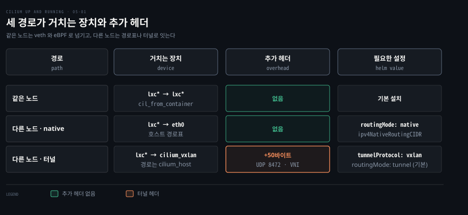
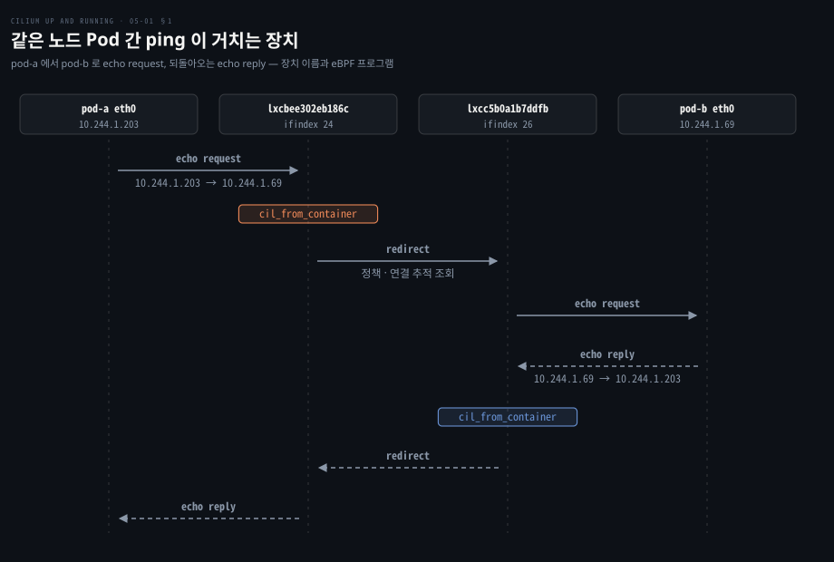
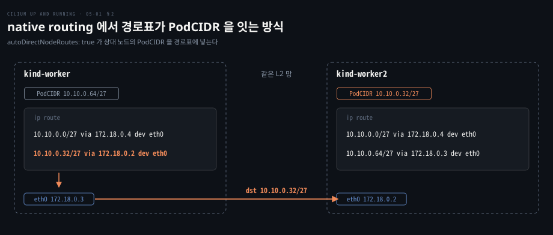
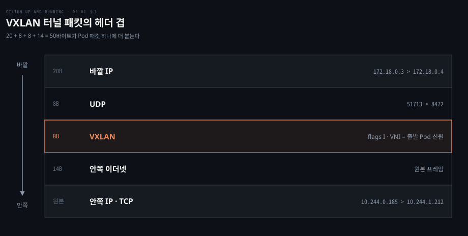
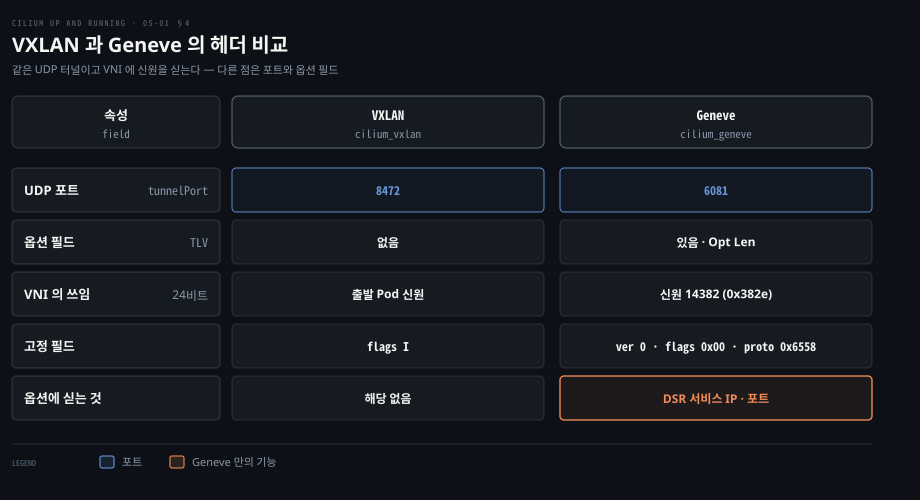

# Cilium 데이터패스는 같은 노드는 eBPF 로 바로 넘기고 다른 노드는 라우팅이나 터널로 잇는다

---

> 같은 노드의 Pod 는 veth 호스트 쪽 끝에 붙은 eBPF 프로그램이 곧바로 건네 주고, 다른 노드의 Pod 는 노드 경로표(native routing)나 UDP 터널(VXLAN·Geneve)로 잇습니다.


## 핵심 요약

> 이 편의 중심 생각은 Cilium 이 호스트 쪽 veth 에서 먼저 판정하고 노드 밖으로 나가는 길만 하부 망의 사정에 맞춰 고른다는 것입니다.

같은 노드의 두 Pod 는 veth 호스트 쪽 끝(`lxc*`)에 붙은 `cil_from_container` 프로그램이 정책을 확인한 뒤 상대 veth 로 바로 리다이렉트합니다. 패킷이 노드를 떠나지 않으니 추가 헤더가 없습니다.

다른 노드로 가는 길은 둘 중 하나입니다. native routing 은 하부 망이 Pod 대역을 안다는 전제로 호스트 경로표대로 내보내므로 헤더가 늘지 않지만 경로를 알릴 수단이 필요합니다. 하부 망을 건드릴 수 없으면 Pod 패킷을 UDP 로 감싸 보내고 패킷마다 50바이트 안팎의 헤더가 붙습니다.




## 학습 목표

> 이 편을 읽고 나면 다음을 설명할 수 있습니다.

1. 같은 노드의 두 Pod 사이 패킷이 `lxc*` veth 와 `cil_from_container` 프로그램을 거쳐 전달되는 경로를 설명할 수 있습니다.
2. `cilium_host`, `cilium_net`, `cilium_vxlan` 장치가 각각 무엇을 위해 있는지 구분할 수 있습니다.
3. native routing 의 세 가지 경로 전파 방법이 맞는 환경을 비교할 수 있습니다.
4. VXLAN 터널 패킷의 헤더 구성과 약 50바이트의 대가를 설명할 수 있습니다.
5. Geneve 가 VXLAN 과 다른 점과 Cilium 이 그 옵션을 쓰는 곳을 말할 수 있습니다.


## 1. 같은 노드의 두 Pod 는 veth 와 eBPF 리다이렉트로 만난다

> 같은 노드의 Pod 끼리도 서로 다른 네트워크 네임스페이스에 있어 호스트 네임스페이스를 거쳐야 합니다. 그 길목인 veth 호스트 쪽 끝에서 Cilium 이 정책을 판정하고 상대 veth 로 넘깁니다.

Pod 둘이 한 노드에 있으면 패킷이 노드 밖으로 나갈 이유가 없습니다. 그래도 둘은 격리된 네임스페이스에 있어 서로의 인터페이스를 볼 수 없습니다. 누가 둘을 이어 주고, 그 자리에서 허용 여부는 누가 판정할까요?

veth 쌍의 기본기는 [커널이 패킷을 주고받는 자리](../networking-and-kubernetes/02-01.커널이%20패킷을%20주고받는%20자리%20—%20소켓·인터페이스·veth·브리지.md)에서 다뤘습니다. 예시 kind 클러스터에서 pod-a(10.244.1.203)와 pod-b(10.244.1.69)를 `kind-worker` 에 띄우고 ping 을 보낸 결과입니다.

```bash
kubectl exec -it pod-a -- ping 10.244.1.69
# 64 bytes from 10.244.1.69: icmp_seq=1 ttl=63 time=0.223 ms
```

### veth 의 양 끝은 인덱스로 짝을 찾는다

Pod 안에서 본 `eth0` 의 인덱스는 23 이고 `@if24` 는 짝이 24 번이라는 뜻입니다. 노드에서 `if23` 을 짝으로 가진 장치가 호스트 쪽 끝입니다.

```bash
# pod-a 안
23: eth0@if24: <BROADCAST,MULTICAST,UP,LOWER_UP> mtu 65520 ...
    inet 10.244.1.203/32 scope global eth0
# 노드 kind-worker 에서
24: lxcbee302eb186c@if23: <BROADCAST,MULTICAST,UP,LOWER_UP> mtu 65520 ...
```

pod-b 의 짝은 `lxcc5b0a1b7ddfb` 입니다. Pod 의 경로표는 `default via 10.244.1.198 dev eth0` 한 줄이며 이 주소가 `cilium_host` 입니다.

### cilium_host 와 cilium_net 은 Pod 의 게이트웨이와 그 짝이다

Cilium 은 시작할 때 `lxc*` 말고도 장치 셋을 만듭니다. `cilium_host` 는 Pod 대역의 주소 `10.244.1.198/32` 를 가진 Pod 의 기본 게이트웨이입니다. `cilium_net` 은 `cilium_host` 와 한 쌍인 veth 의 반대쪽 끝이라 출력에 `cilium_host@cilium_net` 과 `cilium_net@cilium_host` 가 나란히 보입니다. 이 쌍 덕분에 Pod 와 호스트 사이 트래픽도 Cilium 데이터패스가 처리합니다. 

### 장치마다 붙은 eBPF 프로그램은 bpftool 로 본다

에이전트 Pod 안에서 `bpftool net show` 를 실행하면 장치별 프로그램이 나옵니다.

```bash
tc:
cilium_host(13)       tcx/ingress cil_to_host         prog_id 607
cilium_host(13)       tcx/egress  cil_from_host       prog_id 601
lxcbee302eb186c(24)   tcx/ingress cil_from_container  prog_id 1668
lxcc5b0a1b7ddfb(26)   tcx/ingress cil_from_container  prog_id 1695
[...]
```

읽을 곳은 `lxc*` 줄입니다. 호스트 입장에서 이 veth 로 들어오는 패킷은 Pod 를 막 떠난 패킷이라 붙은 자리가 `ingress` 입니다. Pod 에서 나온 패킷은 호스트에 들어서자마자 `cil_from_container` 를 만납니다. 이 프로그램이 eBPF 맵에서 신원·정책·연결 추적 정보를 찾아 그 자리에서 판정합니다.

목적지가 같은 노드의 엔드포인트면 대상 `lxc*` 로 리다이렉트합니다. BPF 호스트 라우팅이 켜져 있으면 `redirect_peer`, 아니면 일반 `redirect` 입니다([local_delivery.h](https://github.com/cilium/cilium/blob/v1.20.2/bpf/lib/local_delivery.h)). 브리지나 iptables 를 거치던 전통적인 CNI 와 달리 프로그램 한 번으로 끝납니다. 응답의 `ttl=63` 은 Cilium 이 같은 노드 전달에도 라우터 한 홉처럼 TTL 을 1 줄이기 때문입니다(`ipv4_local_delivery` 가 부르는 [l3.h](https://github.com/cilium/cilium/blob/v1.20.2/bpf/lib/l3.h)의 `ipv4_l3` 가 `ipv4_dec_ttl` 을 호출합니다).




veth 대신 netkit 장치도 고를 수 있습니다. [netkit 문서](https://docs.cilium.io/en/v1.20/operations/performance/tuning/#netkit)에 따르면 `bpf.datapathMode=netkit` 으로 켜고 커널 6.8 이상이 필요하며 v1.20 기준 베타입니다.


## 2. native routing 은 Pod 대역을 노드 경로로 알린다

> 다른 노드의 Pod 로 가려면 호스트 경로표나 하부 망이 그 노드의 PodCIDR 을 알아야 합니다. native routing 은 캡슐화 없이 이 정보를 경로로 퍼뜨리고, 퍼뜨리는 방법은 환경에 따라 셋으로 갈립니다.

pod-a 의 패킷이 호스트에 들어왔는데 목적지가 다른 노드의 Pod 대역 10.10.0.32/27 안에 있다고 해 봅시다. 호스트 경로표가 그 대역을 모르면 패킷은 버려집니다. 쿠버네티스는 Pod 가 주소 변환 없이 서로의 Pod IP 로 닿기를 요구하고, native routing 은 하부 망이 Pod IP 를 라우팅한다는 전제로 이를 풉니다. [공식 문서](https://docs.cilium.io/en/v1.20/network/concepts/routing/#native-routing)에 따르면 같은 노드의 다른 엔드포인트가 아닌 패킷은 모두 커널 라우팅에 넘깁니다.

기본 라우팅 모드는 encapsulation 이라 native 는 명시해야 합니다. 필요한 값은 `routingMode: native` 와 `ipv4NativeRoutingCIDR` 입니다. 뒤의 값은 하부 망이 이미 라우팅하는 CIDR 이고, 그 범위로 가는 패킷은 SNAT 없이 리눅스 스택에 넘깁니다. 설명은 [Helm 값 주석](https://github.com/cilium/cilium/blob/v1.20.2/install/kubernetes/cilium/values.yaml)에 있습니다.

### 같은 L2 망이면 자동 경로 주입이 가장 간단하다

`autoDirectNodeRoutes: true` 는 다른 노드의 PodCIDR 을 각 노드 경로표에 직접 넣으며 노드들이 같은 L2 망에 있어야 합니다. 예시 kind 클러스터는 다음 Helm 값을 썼습니다.

```yaml
ipam:
  mode: multi-pool
  operator:
    autoCreateCiliumPodIPPools:
      default:
        ipv4:
          cidrs: ["10.10.0.0/16"]
          maskSize: 27

routingMode: native
endpointRoutes:
  enabled: true

autoDirectNodeRoutes: true
ipv4NativeRoutingCIDR: 10.0.0.0/8
```

`endpointRoutes.enabled` 는 Pod 마다 경로를 따로 만들어 `cilium_host` 경유를 피합니다. `maskSize: 27` 이라 노드마다 /27 한 덩어리를 받고, Multi-Pool 의 원리는 [IPAM 모드](./04-01.Cilium%20IPAM%20모드는%20Pod%20대역을%20누가%20나눠%20주는지로%20갈린다.md)에서 다뤘습니다. `CiliumNode` 로 보면 `kind-worker` 는 10.10.0.64/27, `kind-worker2` 는 10.10.0.32/27, `kind-control-plane` 은 10.10.0.0/27 입니다. 노드 경로표에는 상대 대역이 노드 IP 를 다음 홉으로 들어갑니다.

```bash
docker exec kind-worker ip route
# [...]
# 10.10.0.0/27 via 172.18.0.4 dev eth0 proto kernel
# 10.10.0.32/27 via 172.18.0.2 dev eth0 proto kernel

docker exec kind-worker2 ip route
# [...]
# 10.10.0.0/27 via 172.18.0.4 dev eth0 proto kernel
# 10.10.0.64/27 via 172.18.0.3 dev eth0 proto kernel
```

`via` 값에서 노드 IP 를 읽을 수 있습니다. `kind-worker` 는 172.18.0.3, `kind-worker2` 는 172.18.0.2, `kind-control-plane` 은 172.18.0.4 입니다. `kind-worker` 에서 10.10.0.32/27 로 가는 패킷은 둘째 줄에 걸려 172.18.0.2 로 나가고, 캡슐화가 없으니 하부 망은 Pod IP 가 찍힌 패킷을 그대로 봅니다.



### 노드가 거의 안 변하는 작은 클러스터는 정적 경로로 충분하다

두 노드짜리 실습 환경이면 `ip route` 로 직접 넣습니다.

```bash
ip route add 10.10.0.32/27 via 172.18.0.2 dev eth0
```

모든 노드가 서로의 PodCIDR 을 이렇게 가져야 해서 노드가 바뀔 때마다 전 노드를 고칩니다.

### 랙이 여럿이거나 노드가 자주 바뀌면 BGP 로 광고한다

노드가 많거나 여러 랙에 걸치면 각 노드가 PodCIDR 을 BGP 로 광고하는 방식이 가장 잘 늘어납니다. 보통 ToR 장비와 피어링하고 노드가 들고 나면 경로가 알아서 갱신됩니다. BGP 가 AS 사이에서 경로를 주고받는 원리는 [AS 안과 AS 사이](../../../02_os/book/cntd_computer-networking-top-down/05-02.AS%20안과%20AS%20사이.md)에서 다뤘습니다.

Cilium 쪽 설정은 CRD 입니다. `CiliumBGPAdvertisement` 는 `advertisementType: "PodCIDR"` 로 노드 자신의 PodCIDR 을 광고하게 합니다. `CiliumBGPPeerConfig` 의 `families` 는 그 광고를 `matchLabels` 로 골라 냅니다.

이 두 객체만으로는 피어가 생기지 않고 어느 노드가 어느 ASN 으로 어느 장비와 맺을지는 `CiliumBGPClusterConfig` 가 정합니다. 자세한 설정은 [BGP Control Plane 문서](https://docs.cilium.io/en/v1.20/network/bgp-control-plane/bgp-control-plane-configuration/)에 있습니다. 광고 유형은 IPAM 에도 달렸습니다. 현재 문서에 따르면 `PodCIDR` 은 Kubernetes 와 ClusterPool IPAM 에서만 효과가 있고, 위 kind 예처럼 Multi-Pool 이면 `CiliumPodIPPool` 과 `selector` 로 풀을 고릅니다.


## 3. encapsulation 은 노드 IP 로 Pod 패킷을 감싼다

> 하부 망의 경로표를 건드릴 수 없으면 Pod IP 를 받아 줄 라우터가 없습니다. 터널은 Pod 패킷을 노드 IP 끼리의 UDP 통신으로 바꿔 보내므로 노드끼리 IP 로 닿기만 하면 됩니다.

클라우드나 멀티테넌트 환경에서 하부 망의 경로표를 고칠 수 없다면 Pod IP 가 찍힌 패킷은 어디로 가야 할까요? 그대로 올리면 버려지므로 하부 망이 아는 주소로 감싸 보냅니다.

이것이 encapsulation 모드이고 설정이 없을 때의 기본값입니다. [공식 문서](https://docs.cilium.io/en/v1.20/network/concepts/routing/#encapsulation)에 따르면 모든 노드가 UDP 터널의 그물을 이루고 하부 망에는 노드끼리의 일반 통신으로 보입니다. 오버레이의 일반적인 거래는 [컨테이너 네트워킹 모드와 CNI](../networking-and-kubernetes/03-02.컨테이너%20네트워킹%20모드와%20CNI%20—%20격리와%20연결의%20거래.md)에 있습니다.

### VXLAN 은 L2 프레임을 UDP 에 싣는다

VXLAN(Virtual eXtensible LAN)은 이더넷 프레임을 UDP 패킷에 넣어 L2 구간을 L3 경계 너머로 늘립니다. 24비트 VNI 로 약 1,600만 개의 망을 구분해 VLAN 의 4,096개 한계를 넘습니다. 캡슐화와 VTEP 의 기본은 [IP·라우팅·Ethernet](../networking-and-kubernetes/01-03.IP·라우팅·Ethernet%20—%20패킷이%20길을%20찾는%20법.md)의 VXLAN 절에 있습니다.

VXLAN 모드로 설치하면 각 노드에 `cilium_vxlan` 장치가 생깁니다. 기본 설치 kind 클러스터에서 `kind-worker` 의 경로표는 이렇습니다.

```bash
10.244.0.0/24 via 10.244.2.63 dev cilium_host [...]
10.244.1.0/24 via 10.244.2.63 dev cilium_host [...] mtu 65470
10.244.2.0/24 via 10.244.2.63 dev cilium_host [...] mtu 65470
```

모양은 자동 경로 주입과 비슷하지만 다음 홉이 상대 노드 IP 가 아니라 로컬 `cilium_host` 입니다. 패킷이 닿으면 Cilium 이 가로채 캡슐화하고 `cilium_vxlan` 으로 내보냅니다. 어느 노드로 보낼지는 경로표가 아니라 Cilium 의 IP 캐시에 있고, 4절의 `tunnelendpoint` 가 그 정보입니다.

### 터널 패킷은 겹겹이 헤더를 두른다

Pod 패킷 하나는 노드 사이를 이동할 때 바깥에 네 겹이 더 붙습니다.



바깥 IP 헤더에는 노드 IP 가, UDP 목적지 포트에는 터널을 가리키는 8472 가 들어갑니다. VXLAN 헤더의 VNI 는 원래 오버레이 망을 가르는 번호인데 Cilium 은 출발 Pod 의 신원을 싣습니다. 목적지 노드가 별도 신원 조회 없이 정책을 강제하게 하는 작은 최적화입니다. 안쪽은 원본 Pod 패킷입니다. 캡처 샘플이 이 구조를 보여 줍니다.

```bash
tcpdump -r vxlan_traffic.pcap
# IP 172.18.0.3.51713 > 172.18.0.4.8472: OTV, flags [I]
# IP 10.244.0.185.52442 > 10.244.1.212.4240: Flags [.], ack 1439317725, len ...
```

바깥 줄은 노드 172.18.0.3 에서 노드 172.18.0.4 로 가는 UDP 8472 패킷이고 안쪽 줄이 실제 트래픽입니다. 도착한 노드의 Cilium 이 VXLAN 헤더를 떼어 Pod 에 전달합니다.

### 8472 는 IANA 표준이 아니라 리눅스 기본값이다

IANA 가 VXLAN 에 할당한 포트는 4789 이고 리눅스 기본값은 8472 입니다. [vxlan_core.c](https://github.com/torvalds/linux/blob/master/drivers/net/vxlan/vxlan_core.c) 주석이 "The IANA assigned port is 4789, but the Linux default is 8472 for compatibility with early adopters" 라고 적었습니다. Cilium 도 8472 가 기본이고 `tunnelPort` 로 바꾸며 방화벽은 8472/UDP 를 열어야 합니다.

### 대가는 패킷마다 붙는 약 50바이트다

바깥 IP 20, UDP 8, VXLAN 8, 안쪽 이더넷 14를 더하면 50바이트이고 이는 [RFC 7348](https://www.rfc-editor.org/rfc/rfc7348)의 헤더 크기와 공식 문서의 수치에 맞습니다. 바깥 이더넷 헤더는 링크 계층이라 IP MTU 를 줄이지 않습니다. 그만큼 Pod 의 MTU 와 처리량이 줄지만 점보 프레임이면 9,000바이트당 50바이트로 영향이 작습니다. 성능에 민감하고 하부 망이 허락하면 native routing 을 고릅니다.


## 4. Geneve 는 옵션 필드를 더한 터널이다

> Geneve 는 VXLAN 과 같은 UDP 터널이지만 길이가 가변인 TLV 옵션을 헤더에 실을 수 있습니다. Cilium 은 이 옵션을 DSR 에서 서비스 IP 와 포트를 나를 때 씁니다.

VXLAN 헤더는 8바이트 고정이라 VNI 말고는 실을 곳이 마땅치 않습니다. [RFC 8926](https://www.rfc-editor.org/rfc/rfc8926)의 Geneve 는 헤더가 늘어날 수 있는 구조입니다. Cilium 은 `tunnelProtocol: geneve` 로 고릅니다.

### Azure AKS 의 BYOCNI 로 시험한다

예시는 Azure Kubernetes Service 의 BYOCNI 모드로 구성합니다. CNI 없이 클러스터를 만들고(`--network-plugin none`) 원하는 CNI 를 직접 설치하는 방식입니다. 설치 값은 세 가지입니다.

```yaml
aksbyocni:
  enabled: true
ipam:
  mode: cluster-pool

tunnelProtocol: geneve
```

`aksbyocni.enabled` 는 BYOCNI 로 만든 AKS 용입니다. 예시 노드 IP 는 192.168.10.4~6 이고, 다른 노드의 PodCIDR 이 어느 노드 IP 의 터널로 묶였는지는 에이전트의 IP 캐시에서 봅니다.

```bash
kubectl -n kube-system exec -it cilium-8z49v -- cilium-dbg bpf ipcache list
# IP PREFIX/ADDRESS   IDENTITY
# 10.0.2.0/24   encryptkey=0 tunnelendpoint=192.168.10.4 flags=hastunnel
# 10.0.1.0/24   encryptkey=0 tunnelendpoint=192.168.10.6 flags=hastunnel
```

v1.20 의 값 칸에는 `identity=…` 항목이 앞에 붙지만 여기서는 생략했습니다. `list` 가 없으면 도움말만 나옵니다([명령 레퍼런스](https://docs.cilium.io/en/v1.20/cmdref/cilium-dbg_bpf_ipcache_list/)).

### 헤더는 VXLAN 과 거의 같고 포트와 옵션만 다르다

`geneve.pcap` 샘플의 한 줄입니다.

```bash
IP 192.168.10.5.49135 > 192.168.10.4.6081: Geneve, vni 0x382e:
  IP 10.0.0.125 > 10.0.2.75: ICMP echo request, length 64
```

바깥은 노드끼리의 UDP 6081 통신이고 안쪽이 Pod 사이의 원본 요청입니다. 6081 은 IANA 가 Geneve 에 할당한 포트입니다. VNI `0x382e` 는 십진수 14382 이고 VXLAN 과 마찬가지로 출발 Pod 의 신원입니다. `kubectl get ciliumid 14382 -o yaml` 로 조회하면 `security-labels` 에 `k8s:app: pod-worker` 가 나옵니다. 고정 필드는 버전 0, 플래그 0x00, 프로토콜 타입 0x6558 이고 옵션 길이(Opt Len)는 TLV 유무를 알리는데 이 캡처에서는 0 입니다.

TLV 가 채워지는 때는 DSR 과 함께 쓸 때입니다. DSR 은 백엔드가 응답을 클라이언트로 직접 보내서 서비스 IP 와 포트를 알아야 합니다. 기본 DSR 은 Cilium 전용 IP 옵션에 이 값을 싣는데 알 수 없는 IP 옵션 패킷을 느린 경로로 보내다 버리는 라우터가 있습니다. [DSR with Geneve](https://docs.cilium.io/en/v1.20/network/kubernetes/kubeproxy-free/#direct-server-return-dsr-with-geneve)는 값을 Geneve 옵션에 실어 이 문제를 피하며 `loadBalancer.dsrDispatch=geneve` 로 켭니다.



Geneve 장치의 이름은 [defaults/node.go](https://github.com/cilium/cilium/blob/v1.20.2/pkg/defaults/node.go) 기준 `cilium_geneve` 입니다. AKS 실습은 비용이 드니 끝나면 리소스 그룹 `geneve-rg` 를 지웁니다.


## 5. 정리

> 세 경로 모두 호스트 쪽 veth 의 eBPF 프로그램에서 출발하고 노드 밖으로 나가는 길만 하부 망에 맞춰 고릅니다. 하부 망이 Pod 대역을 라우팅하면 native routing, 아니면 터널입니다.

같은 노드는 `cil_from_container` 가 바로 넘깁니다. 다른 노드로 가는 길은 하부 망에 대한 통제력이 가릅니다. 같은 L2 망이거나 BGP 로 경로를 알릴 수 있거나 클라우드가 Pod IP 를 라우팅해 주면 native routing 이 헤더 비용 없이 가장 빠릅니다.

경로를 건드릴 수 없으면 노드끼리 IP 로 닿기만 하면 되는 터널이 답입니다. 터널 중에서는 기본인 VXLAN 으로 충분하고 Geneve 는 DSR 처럼 옵션이 필요할 때 고릅니다. 서비스 IP 로 들어오는 트래픽은 별도 노트에서 다룹니다.


## 면접 대비

> Cilium 데이터패스의 같은 노드·다른 노드 전달 방식에 관한 면접 질문입니다.

1. 같은 노드의 두 Pod 가 통신할 때 패킷은 어떤 장치와 eBPF 프로그램을 거칩니까?
2. `cilium_host`, `cilium_net`, `cilium_vxlan` 은 각각 무엇을 위한 장치입니까?
3. native routing 에서 노드가 다른 노드의 PodCIDR 을 알게 하는 세 방법과 맞는 환경을 비교해 보십시오.
4. VXLAN 패킷은 어떤 헤더로 구성되고 그 대가는 무엇입니까?
5. Geneve 는 VXLAN 과 무엇이 다르고 Cilium 은 그 차이를 어디에 씁니까?


## 정답 (자답 후 펼치기)

> 면접 질문에 대한 키워드 중심의 모범 답안입니다.

### 정답 1 — veth 호스트 끝의 cil_from_container 와 리다이렉트

Pod 의 `eth0` 에서 나간 패킷은 호스트 쪽 `lxc*` 의 ingress 에 붙은 `cil_from_container` 를 만납니다. 이 프로그램이 신원·정책·연결 추적 맵을 확인하고 상대 `lxc*` 로 리다이렉트합니다.

### 정답 2 — Pod 게이트웨이, 그 짝, 터널 장치

`cilium_host` 는 Pod 의 기본 게이트웨이이고 `cilium_net` 은 그와 한 쌍인 veth 의 반대쪽 끝입니다. 둘 덕분에 Pod 와 호스트 사이 트래픽도 데이터패스가 처리합니다. `cilium_vxlan` 은 터널 장치입니다.

### 정답 3 — 자동 경로 주입·정적 경로·BGP 의 적용 환경

자동 경로 주입은 노드가 같은 L2 망일 때 Cilium 이 경로를 넣어 줍니다. 정적 경로는 노드가 거의 안 바뀌는 아주 작은 환경용이고 변동마다 수동 수정이 필요합니다. BGP 는 랙이 여럿이거나 노드가 자주 바뀌는 큰 망에서 PodCIDR 을 광고해 경로를 자동 유지합니다.

### 정답 4 — 바깥 IP·UDP·VXLAN 헤더와 약 50바이트

바깥 IP 에 노드 IP, UDP 에 포트 8472, VXLAN 헤더의 VNI 에 출발 Pod 신원이 들어가고 안쪽에 원본 패킷이 보존됩니다. IP 20·UDP 8·VXLAN 8·안쪽 이더넷 14 로 약 50바이트가 늘어 MTU 와 처리량이 줄어듭니다.

### 정답 5 — 가변 옵션(TLV) 과 DSR 에서의 사용

Geneve 는 옵션 길이 필드와 TLV 옵션을 지원하고 포트는 6081 입니다. VNI 에 신원을 싣는 점은 VXLAN 과 같습니다. Cilium 은 DSR 에서 서비스 IP 와 포트를 Geneve 옵션에 실어, IP 옵션을 느린 경로로 보내는 라우터의 문제를 피합니다.


## 참고 자료

- Nico Vibert, Filip Nikolic, James Laverack, 《Cilium: Up and Running》, O'Reilly Media, 2026, ISBN 979-8-341-62299-9, Chapter 5 "The Cilium Datapath".
- Cilium 공식 문서 라우팅: https://docs.cilium.io/en/v1.20/network/concepts/routing/
- Cilium 공식 문서 DSR with Geneve: https://docs.cilium.io/en/v1.20/network/kubernetes/kubeproxy-free/#direct-server-return-dsr-with-geneve
- Cilium 공식 문서 netkit·BGP: https://docs.cilium.io/en/v1.20/operations/performance/tuning/#netkit, https://docs.cilium.io/en/v1.20/network/bgp-control-plane/bgp-control-plane-configuration/
- Cilium v1.20.2 Helm 값과 소스(`bpf/lib/l3.h`, `bpf/lib/local_delivery.h`, `pkg/defaults/node.go`): https://github.com/cilium/cilium/tree/v1.20.2
- 리눅스 커널 `vxlan_core.c`: https://github.com/torvalds/linux/blob/master/drivers/net/vxlan/vxlan_core.c
- RFC 7348 VXLAN, RFC 8926 Geneve: https://www.rfc-editor.org/rfc/rfc7348, https://www.rfc-editor.org/rfc/rfc8926


## 관련 문서

- [Cilium 은 eBPF 데이터패스로 iptables 기반 CNI 의 한계를 넘는다](./01-01.Cilium%20은%20eBPF%20데이터패스로%20iptables%20기반%20CNI%20의%20한계를%20넘는다.md)
- [Cilium 은 에이전트·CNI 플러그인·오퍼레이터로 나눠 노드와 클러스터를 맡는다](./02-01.Cilium%20은%20에이전트·CNI%20플러그인·오퍼레이터로%20나눠%20노드와%20클러스터를%20맡는다.md)
- [Cilium IPAM 모드는 Pod 대역을 누가 나눠 주는지로 갈린다](./04-01.Cilium%20IPAM%20모드는%20Pod%20대역을%20누가%20나눠%20주는지로%20갈린다.md)
- [커널이 패킷을 주고받는 자리 — 소켓·인터페이스·veth·브리지](../networking-and-kubernetes/02-01.커널이%20패킷을%20주고받는%20자리%20—%20소켓·인터페이스·veth·브리지.md)
- [컨테이너 네트워킹 모드와 CNI — 격리와 연결의 거래](../networking-and-kubernetes/03-02.컨테이너%20네트워킹%20모드와%20CNI%20—%20격리와%20연결의%20거래.md)
- [IP·라우팅·Ethernet — 패킷이 길을 찾는 법](../networking-and-kubernetes/01-03.IP·라우팅·Ethernet%20—%20패킷이%20길을%20찾는%20법.md)
- [AS 안과 AS 사이](../../../02_os/book/cntd_computer-networking-top-down/05-02.AS%20안과%20AS%20사이.md)
