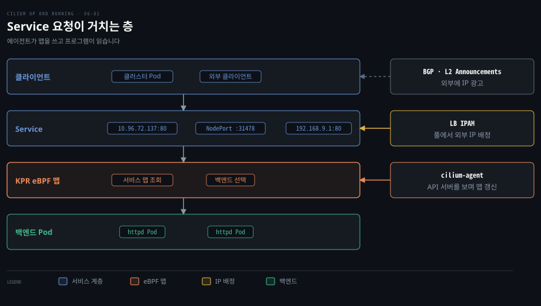
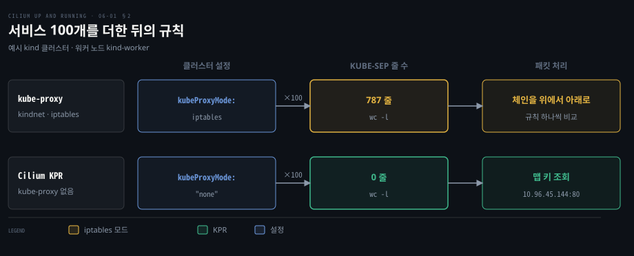
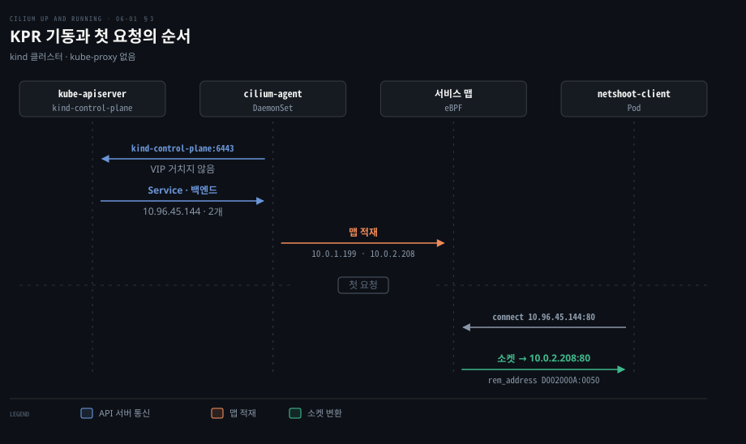
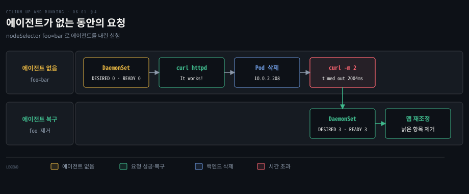
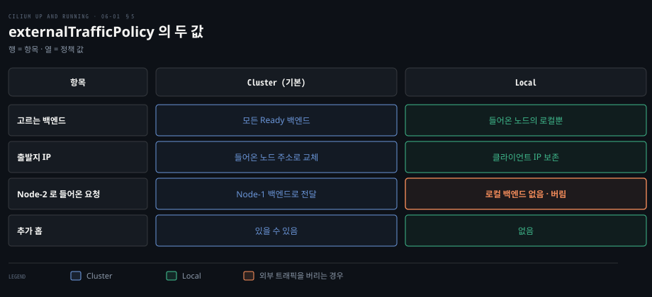
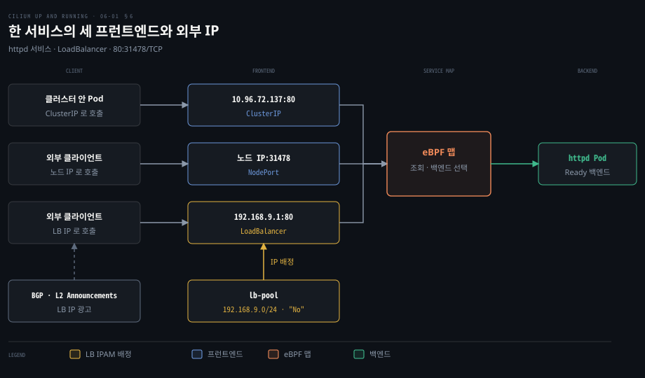

# Cilium 은 kube-proxy 를 eBPF 로 대신하고 외부 서비스에 IP 와 경로를 붙인다

---

> Service 의 VIP 를 백엔드 Pod 로 바꾸는 일을 iptables 규칙 대신 eBPF 맵 조회가 맡고, 클러스터 밖으로 여는 주소는 LB IPAM 이 풀에서 꺼내 붙입니다.


## 핵심 요약

> 이 편의 중심 생각은 Service 변환 상태를 커널의 해시 맵에 두면 서비스 수와 무관하게 조회되고, 맵을 쓰는 에이전트가 멈춰도 읽는 프로그램은 계속 돈다는 것입니다.

kube-proxy 의 iptables 모드는 서비스와 엔드포인트마다 규칙을 만들고 패킷이 그 체인을 순서대로 훑습니다. Cilium 의 kube-proxy 대체(KPR)는 같은 일을 에이전트가 쓰고 eBPF 프로그램이 읽는 맵으로 처리합니다. 예시 kind 클러스터에서 서비스를 100개 더 만들어도 KUBE-SEP 규칙이 0 줄인 이유입니다.

KPR 을 켜면 kube-proxy 가 없으므로 에이전트가 API 서버 주소를 직접 알아야 합니다. 에이전트가 멈춰도 서비스로 가는 새 요청이 마지막 맵대로 전달되지만 죽은 백엔드가 맵에 남을 수 있습니다. 클라우드가 없는 환경에서는 LB IPAM 이 풀에서 외부 IP 를 배정하고, 그 IP 를 알리는 일은 BGP 나 L2 Announcements 가 맡습니다.




## 학습 목표

> 이 편을 읽고 나면 다음을 설명할 수 있습니다.

1. kube-proxy 의 iptables 모드에서 서비스 수가 늘 때 규칙 수와 갱신 시간이 어떻게 달라지는지 설명할 수 있습니다.
2. KPR 이 서비스 변환을 eBPF 맵 조회로 처리하는 방식과 `/proc/net/tcp` 에 백엔드 IP 가 보이는 이유를 설명할 수 있습니다.
3. `kubeProxyReplacement` 와 `k8sServiceHost`·`k8sServicePort` 가 함께 필요한 이유를 설명할 수 있습니다.
4. 에이전트가 멈췄을 때 데이터패스에서 계속 되는 일과 어긋나는 일을 구분할 수 있습니다.
5. 세션 고정, 두 트래픽 정책, LB IPAM 풀의 동작을 비교할 수 있습니다.


## 1. 서비스는 바뀌는 Pod IP 앞에 고정 주소를 둔다

> Pod 는 계속 만들어지고 사라지며 IP 도 재사용됩니다. Service 는 Ready 인 Pod 집합 앞에 클러스터 안에서만 존재하는 가상 IP 하나를 세워 이 문제를 풉니다.

Pod 가 죽으면 그 IP 는 풀로 돌아가 다른 Pod 에 다시 배정될 수 있습니다. 클라이언트가 Pod IP 를 쥐고 있으면 엉뚱한 Pod 에 말을 걸게 됩니다. 그래서 Service 가 VIP 와 DNS 이름을 주고, 그 VIP 로 온 트래픽을 Readiness 를 통과한 Pod 들에 나눕니다.

`type` 값은 ClusterIP·NodePort·LoadBalancer·ExternalName 이고, `clusterIP: None` 으로 VIP 를 생략한 Headless 서비스도 있습니다. 각 유형의 동작은 [Service 5유형](../networking-and-kubernetes/05-02.Service%205유형%20—%20ClusterIP에서%20LoadBalancer까지.md)에서 다뤘습니다.

iptables 모드에서 VIP 는 어느 인터페이스에도 붙어 있지 않아 누군가 백엔드 Pod IP 로 바꾸는 DNAT 를 해야 합니다. 전통적으로 이 일은 모든 노드의 kube-proxy 가 맡으며, 원리는 [CNI 와 kube-proxy](../networking-and-kubernetes/04-02.CNI와%20kube-proxy%20—%20Pod%20네트워크의%20배선공과%20로드밸런서.md)에 있습니다.


## 2. 서비스가 늘면 iptables 규칙이 선형으로 늘어난다

> iptables 모드는 서비스와 엔드포인트 쌍마다 규칙을 만들고, 패킷은 규칙을 위에서부터 하나씩 비교합니다. 서비스 수가 늘면 규칙 수와 갱신 비용이 함께 커집니다.

서비스가 100개일 때 노드에는 규칙이 몇 줄이나 생길까요? 예시 kind 클러스터(컨트롤 플레인 1대, 워커 2대)에 kindnet CNI 와 `kubeProxyMode: iptables` 의 kube-proxy 를 올립니다. httpd Deployment 를 가리키는 서비스를 100개 만든 뒤 엔드포인트 체인 이름인 `KUBE-SEP` 이 들어간 줄을 셌습니다.

```bash
for i in {1..100}; do
  kubectl expose deployment httpd --port=80 --name="httpd-$i"
done

docker exec kind-worker iptables-save | grep KUBE-SEP | wc -l
# 787
```

787 은 서비스와 엔드포인트의 조합마다 규칙이 생긴다는 증거입니다. 패킷도 그 체인을 한 줄씩 비교하므로 처리 시간이 규칙 수에 비례하는 O(n) 입니다.

갱신 비용도 문제였습니다. 2017년 발표(Huawei, Haibin Xie)에서 규칙 하나를 더하는 데 서비스 5,000개는 11분, 20,000개는 5시간이 걸렸습니다. 규칙 수로는 각각 40,000개와 160,000개입니다. 같은 표에서 IPVS 는 둘 다 2ms 였습니다. 당시 iptables 는 규칙 전체를 복사해 고친 뒤 다시 저장했고 그동안 잠금이 걸렸습니다. 출처는 [발표 슬라이드](https://www.slideshare.net/slideshow/scale-kubernetes-to-support-50000-services/77112281)입니다.

현재 iptables 모드는 쿠버네티스 1.28 부터 바뀐 Service 와 EndpointSlice 만 갱신합니다([문서](https://kubernetes.io/docs/reference/networking/virtual-ips/)). nftables 모드는 커널 5.13 이상이 필요하고 변경을 더 빠르게 처리합니다. 같은 문서는 IPVS 가 Service API 의 경계 사례를 다 구현하지 못했다며 nftables 를 대체재로 권합니다. 세 기술의 원리는 [iptables·IPVS·eBPF](../networking-and-kubernetes/02-03.iptables·IPVS·eBPF%20—%20kube-proxy를%20이해하는%20세%20기술.md)에 있습니다.



같은 실험을 KPR 클러스터에서 반복하면 KUBE-SEP 줄은 서비스가 하나일 때도 100개를 더한 뒤에도 0 입니다. 이 값이 어디서 오는지는 다음 절에서 봅니다.


## 3. KPR 을 켜면 API 서버 주소를 Cilium 에 직접 알려야 한다

> kube-proxy 가 없으면 Service VIP 를 변환해 줄 주체가 없으므로 Cilium 에이전트는 API 서버에 VIP 가 아닌 실제 주소로 먼저 닿아야 합니다.

kube-proxy 가 있을 때 Pod 는 `kubernetes.default.svc`(예시 kind 에서 10.96.0.1)로 API 서버를 부르고 kube-proxy 가 이를 실제 주소로 바꿔 줍니다. kube-proxy 를 빼면 그 변환을 해 줄 주체가 사라집니다. 규칙을 쓸 에이전트가 API 서버에 닿으려면 그 규칙이 필요한 닭과 달걀 문제입니다.

그래서 kind 를 `kubeProxyMode: "none"` 으로 만들고 Helm 값에 API 서버 주소를 직접 적습니다.

```yaml
kubeProxyReplacement: true
k8sServiceHost: kind-control-plane
k8sServicePort: 6443
```

`kind-control-plane` 은 워커 컨테이너에서 이름 풀이가 되는 호스트명입니다. 현재 차트에서 `k8sServiceHost` 는 `"auto"` 로 두면 `cluster-info` ConfigMap 에서 주소를 찾습니다([values.yaml](https://github.com/cilium/cilium/blob/v1.20.2/install/kubernetes/cilium/values.yaml#L63-L76)).

API 서버가 여럿이면 `k8s.apiServerURLs` 로 목록을 줘 에이전트가 살아 있는 인스턴스로 옮겨 가게 합니다([문서](https://docs.cilium.io/en/v1.20/network/kubernetes/kubeproxy-free/#kubernetes-api-server-high-availability)).

기본값은 `kubeProxyReplacement: "false"` 이며 이때는 클러스터 안 ClusterIP 의 패킷 단위 부하 분산만 켜집니다([문서](https://docs.cilium.io/en/v1.20/network/kubernetes/kubeproxy-free/)).

켜진 상태는 에이전트 상세 상태에서 확인합니다.

```bash
kubectl -n kube-system exec ds/cilium -- cilium-dbg status --verbose
# KubeProxyReplacement Details:
#   Status:                True
#   Socket LB:             Enabled
#   [...]
#   Mode:                  SNAT
#   Backend Selection:     Random
#   Session Affinity:      Enabled
#   [...]
```

`Mode: SNAT` 는 외부에서 들어온 요청의 백엔드가 다른 노드에 있을 때 들어온 노드가 출발지를 자기 IP 로 바꿔 대신 보내는 기본 방식입니다. 출발지를 바꾸지 않는 DSR 과 dispatch 방식(IP 옵션·Geneve·IPIP)은 [08-02](./08-02.DSR·Maglev·netkit%20은%20응답%20경로와%20백엔드%20선택과%20Pod%20연결의%20비용을%20줄인다.md) 1절에서 다룹니다.



### 서비스 맵과 백엔드는 cilium-dbg 로 본다

httpd 서비스(ClusterIP 10.96.45.144)에는 Pod 둘이 붙었습니다. 노드의 iptables 에는 이 서비스 규칙이 없고(KUBE-SEP 줄 0), 에이전트의 서비스 표에 Ready 백엔드가 올라 있습니다.

```bash
kubectl exec -n kube-system -it ds/cilium -- cilium-dbg service list
# ID  Frontend             Service Type  Backend
# 6   10.96.45.144:80/TCP  ClusterIP     1 => 10.0.1.199:80/TCP (active)
#                                        2 => 10.0.2.208:80/TCP (active)
```

### 변환은 connect() 시점에 일어나 소켓이 백엔드 주소를 안다

netshoot 클라이언트 Pod 에서 서비스 IP 로 요청한 직후 TCP 연결표를 읽으면 목적지가 서비스 IP 가 아니라 백엔드 Pod 로 찍힙니다.

```bash
curl 10.96.45.144 && cat "/proc/$$/net/tcp"
# <html><body><h1>It works!</h1></body></html>
#     sl local_address   rem_address   st
#      0: DB01000A:D316  D002000A:0050 06
```

`/proc/<pid>/net/tcp` 는 그 프로세스의 네트워크 네임스페이스에 있는 TCP 연결 목록입니다([man page](https://man7.org/linux/man-pages/man5/proc_pid_net.5.html)).

주소는 리틀 엔디언 16진수라 `D002000A` 를 바이트 `D0 02 00 0A` 로 쪼개 거꾸로 읽으면 `0A 00 02 D0`, 곧 10.0.2.208 입니다. 포트 `0050` 은 80 이고, 되풀이하면 `C701000A`, 곧 10.0.1.199 가 나올 때도 있습니다.

서비스 IP 로 연결했는데 백엔드 IP 가 보이는 것은 변환이 패킷 단계가 아니라 소켓 단계에서 일어나기 때문입니다. 소켓 부하 분산(socket-LB)은 `connect()`·`sendmsg()`·`recvmsg()` 때 목적지가 서비스 IP 인지 보고 백엔드 하나를 골라 소켓을 그 주소에 직접 연결합니다. 애플리케이션은 서비스 주소에 붙었다고 믿지만 커널 소켓은 백엔드에 붙어 있어 아래 계층의 NAT 가 필요 없습니다([문서](https://docs.cilium.io/en/v1.20/network/kubernetes/kubeproxy-free/#socket-loadbalancer-bypass-in-pod-namespace)).


## 4. 에이전트가 멈춰도 데이터패스는 계속 돈다

> 에이전트는 맵을 쓰고 eBPF 프로그램은 맵을 읽습니다. 쓰는 쪽이 사라져도 읽는 쪽은 마지막 상태로 전달하므로 기존 서비스는 이어지고 맵은 낡아집니다.

에이전트가 없는 동안 무엇이 계속 되고 무엇이 멈출까요?

역할 분담이 답입니다. 에이전트는 API 서버를 지켜보며 서비스와 백엔드 정보를 맵에 쓰고, eBPF 프로그램은 상태 없이 맵에 있는 것만 읽습니다. 프로그램과 맵이 커널에 남아 있는 한 에이전트가 재시작하거나 충돌해도 패킷은 계속 전달됩니다. DaemonSet 의 `nodeSelector` 를 아무 노드도 갖지 않은 라벨로 바꿔 에이전트를 모두 내립니다. 예시 클러스터에서는 그 뒤에도 요청이 성공합니다.

```bash
kubectl -n kube-system patch ds cilium --type=merge \
    -p '{"spec":{"template":{"spec":{"nodeSelector":{"foo":"bar"}}}}}'
# daemonset.apps/cilium patched

kubectl get daemonset -n kube-system cilium
# NAME        DESIRED      READY      NODE SELECTOR
# cilium      0            0          foo=bar,kubernetes.io/os=linux

kubectl exec -it netshoot-client -- curl httpd
# <html><body><h1>It works!</h1></body></html>
```

에이전트가 0개인데도 서비스 이름으로 보낸 요청이 성공합니다. 한계는 맵이 더는 갱신되지 않는다는 점입니다. 이 상태에서 백엔드 Pod 하나를 지우면 맵에는 이미 사라진 10.0.2.208 이 남습니다.

```bash
kubectl delete pod httpd-77b5fcff59-vfnxt
curl -m 2 10.96.45.144
# curl: (28) Connection timed out after 2004 milliseconds
```

백엔드는 무작위로 고르므로 살아 있는 10.0.1.199 가 뽑히면 응답이 오고 삭제된 백엔드가 뽑힐 때만 시간 초과가 날 것입니다. 예시 클러스터에서는 시간 초과 한 건만 나옵니다. `nodeSelector` 의 `foo` 항목을 지워 에이전트를 되살리면(`DESIRED 3 · READY 3`) 맵이 조정되어 낡은 항목이 사라집니다.



그래서 에이전트 중단 시간은 짧을수록 좋습니다.


## 5. 세션 고정과 트래픽 정책도 eBPF 에서 지킨다

> KPR 은 kube-proxy 가 주던 세션 어피니티와 내부·외부 트래픽 정책의 의미를 그대로 구현합니다. 설정은 쿠버네티스 필드로 하고 적용은 eBPF 가 합니다.

kube-proxy 를 걷어내면 서비스가 주던 부가 동작도 사라지지 않을까요? 세션 고정부터 보겠습니다.

### sessionAffinity: ClientIP 는 같은 클라이언트를 같은 Pod 에 고정한다

기본값 `None` 에서는 같은 클라이언트의 요청이 여러 Pod 로 흩어집니다. podinfo 서비스를 9898 포트로 두 번 호출하면 응답의 `hostname` 이 `podinfo-849bfb5c8d-mp8l7`, `podinfo-849bfb5c8d-bk452` 로 바뀝니다. 서비스에 `sessionAffinity: ClientIP` 를 적으면 두 번 모두 `podinfo-849bfb5c8d-4v8sc` 가 돌아옵니다.

```yaml
spec:
  sessionAffinity: ClientIP
  selector:
    app.kubernetes.io/name: podinfo
  ports:
  - port: 9898
```

고정의 기본 유지 시간은 3시간이고 `sessionAffinityConfig` 로 바꿉니다. 고정 기준은 클러스터 밖에서 오면 출발지 IP 이고, 클러스터 안에서 소켓 단계 부하 분산을 쓰면 출발지 IP 가 아직 없어 네트워크 네임스페이스 쿠키입니다([문서](https://docs.cilium.io/en/v1.20/network/kubernetes/kubeproxy-free/#session-affinity)). 세션 고정은 상태를 메모리에 쥔 애플리케이션의 임시 처방이며 부하를 쏠리게 합니다.

### internalTrafficPolicy 는 클러스터 안 트래픽의 범위를 고른다

기본값 `Cluster` 에서는 클러스터 어디의 Ready 엔드포인트든 무작위로 고릅니다. `Local` 이면 요청을 낸 Pod 와 같은 노드의 엔드포인트로만 보냅니다. 노드 로컬 로깅 데몬처럼 지역성이 중요할 때 쓰며, Cilium 도 `hubble-peer` 서비스에 이 값을 둡니다([템플릿](https://github.com/cilium/cilium/blob/v1.20.2/install/kubernetes/cilium/templates/hubble/peer-service.yaml)).

노드에 로컬 엔드포인트가 없으면 그 노드의 Pod 에게 서비스는 엔드포인트가 없는 것처럼 보입니다([쿠버네티스 문서](https://kubernetes.io/docs/concepts/services-networking/service-traffic-policy/)).

### externalTrafficPolicy 는 클라이언트 IP 를 지킬지 가용성을 지킬지 가른다

클러스터 밖에서 NodePort 나 LoadBalancer 로 들어온 트래픽에 적용됩니다. `Cluster`(기본)는 들어온 노드가 어느 백엔드로든 보낼 수 있고, `Local` 은 들어온 노드의 로컬 백엔드로만 보냅니다. service-A 의 백엔드가 Node-1 에만 있다고 하면 차이는 세 가지로 나옵니다.

`Local` 은 들어온 노드의 백엔드로만 보내므로 추가 홉이 없습니다. `Cluster` 에서는 Node-2 로 들어온 요청도 Node-1 의 백엔드로 전달되어 홉이 하나 늘고, 출발지 IP 가 들어온 노드의 주소로 바뀌어 클라이언트 IP 가 사라집니다. `Local` 에서는 클라이언트 IP 가 보존되지만 로컬 백엔드가 없는 Node-2 는 외부 트래픽을 버립니다. 이 버림은 외부 트래픽에 한정되며 클러스터 안에서 오는 요청은 모든 엔드포인트를 씁니다([문서](https://docs.cilium.io/en/v1.20/network/kubernetes/kubeproxy-free/#client-source-ip-preservation)).

두 정책을 함께 쓰면 각각 남북 트래픽과 동서 트래픽의 범위를 독립으로 정하며, 조합표는 [공식 문서](https://docs.cilium.io/en/v1.20/network/kubernetes/kubeproxy-free/#internal-traffic-policy)에 있습니다. `Cluster` 에서도 클라이언트 IP 를 지켜야 하면 DSR 이나 Hybrid 모드를 씁니다.




## 6. 바깥 트래픽은 NodePort·LoadBalancer 와 LB IPAM 이 받는다

> ClusterIP 는 클러스터 밖에서 닿지 않습니다. NodePort 는 노드마다 같은 포트를 열고 LoadBalancer 는 외부 IP 하나를 얹는데, 클라우드 컨트롤러가 없는 환경에서는 그 IP 를 Cilium 이 풀에서 꺼내 줍니다.

클러스터 밖의 클라이언트는 어떻게 안의 서비스를 부를까요? NodePort 는 노드마다 IP 가 달라 클라이언트가 노드 IP 를 모두 알아야 하거나 앞단에 로드밸런서가 필요합니다. LoadBalancer 유형은 외부 IP 하나를 주어 이 문제를 풉니다. 클라우드에서는 컨트롤러 매니저가 로드밸런서를 만들어 그 IP 를 서비스에 적습니다.

컨트롤러가 없는 kind 나 온프레미스에서는 외부 IP 가 영원히 `<pending>` 입니다.

```bash
kubectl get svc httpd
# NAME    TYPE           CLUSTER-IP     EXTERNAL-IP   PORT(S)        AGE
# httpd   LoadBalancer   10.96.72.137   <pending>     80:31478/TCP   20s
```

LB IPAM 이 이 빈칸을 채웁니다. 항상 켜져 있지만 첫 IP 풀이 만들어질 때까지 휴면 상태입니다([문서](https://docs.cilium.io/en/v1.20/network/lb-ipam/)). Pod IP 를 나누는 일은 [IPAM 모드](./04-01.Cilium%20IPAM%20모드는%20Pod%20대역을%20누가%20나눠%20주는지로%20갈린다.md)의 몫입니다.

### CiliumLoadBalancerIPPool 이 배정 범위를 정한다

풀 리소스를 만들면 서비스의 `EXTERNAL-IP` 가 `172.16.0.0` 으로 바뀝니다. 대역의 첫 주소입니다. 기본은 CIDR 의 모든 주소를 쓰기 때문입니다.

```yaml
apiVersion: "cilium.io/v2"
kind: CiliumLoadBalancerIPPool
metadata:
  name: "lb-pool"
spec:
  blocks:
  - cidr: "172.16.0.0/24"
```

첫 주소는 네트워크 주소, 마지막은 브로드캐스트 주소라 빼는 방법이 둘 있습니다. 하나는 `start: 172.16.0.1`, `stop: 172.16.0.254` 로 범위를 직접 적는 것입니다. 이렇게 풀을 고치면 `EXTERNAL-IP` 가 172.16.0.1 로 다시 배정됩니다. 풀을 수정하면 이미 배정된 IP 가 바뀔 수 있어 운영 중에는 주의해야 합니다([문서](https://docs.cilium.io/en/v1.20/network/lb-ipam/#pools)).

둘째는 `allowFirstLastIPs: "No"` 로 블록이 여럿일 때 편합니다.

```yaml
spec:
  allowFirstLastIPs: "No"
  blocks:
  - cidr: "192.168.9.0/24"
  - cidr: "10.234.9.0/24"
```

이러면 192.168.9.0, 192.168.9.255, 10.234.9.0, 10.234.9.255 는 배정되지 않고 서비스에는 192.168.9.1 이 붙습니다. `"No"` 는 따옴표로 감싸야 하며 없으면 YAML 이 불리언으로 읽어 타입 오류가 납니다. 이 옵션은 `cidr` 블록에만 적용됩니다([문서](https://docs.cilium.io/en/v1.20/network/lb-ipam/#cidrs-ranges-and-reserved-ips)).

### serviceSelector 로 풀을 서비스에 묶는다

풀의 `serviceSelector` 에 `matchLabels: {environment: production}` 을 두면 그 라벨의 서비스만 IP 를 받습니다. 풀은 클러스터 범위라 네임스페이스까지 좁히려면 특수 키 `io.kubernetes.service.namespace: payments` 를 함께 씁니다([문서](https://docs.cilium.io/en/v1.20/network/lb-ipam/#service-selectors)).

서비스 하나가 여러 풀의 셀렉터에 걸리면 결과가 정의되지 않으므로 피합니다. CIDR 이 겹치는 풀은 나중에 만든 쪽이 `Conflicting` 이 되어 배정을 멈추니 `kubectl get ippools` 로 상태를 확인합니다([문서](https://docs.cilium.io/en/v1.20/network/lb-ipam/#conflicts)).

### IP 배정과 외부 도달은 다른 일이다

LB IPAM 은 외부 IP 를 붙일 뿐 바깥 네트워크에 알리지 않습니다. 외부 클라이언트가 그 주소로 보내려면 라우터가 어느 노드로 보낼지 알아야 하므로, 광고는 [BGP Control Plane](https://docs.cilium.io/en/v1.20/network/bgp-control-plane/bgp-control-plane/) 이나 [L2 Announcements](https://docs.cilium.io/en/v1.20/network/l2-announcements/) 가 맡습니다.

서비스의 `loadBalancerClass` 로 `io.cilium/bgp-control-plane` 이나 `io.cilium/l2-announcer` 를 고릅니다([문서](https://docs.cilium.io/en/v1.20/network/lb-ipam/#loadbalancerclass)). L2 Announcements 는 v1.20 문서 기준 베타입니다. 클래스를 지정하지 않은 서비스도 기본적으로 풀에서 IP 를 받습니다([`defaultLBServiceIPAM: lbipam`](https://github.com/cilium/cilium/blob/v1.20.2/install/kubernetes/cilium/values.yaml#L2373)).

외부 패킷도 클러스터 안과 같은 맵이 처리합니다. LoadBalancer 서비스에 대해 Cilium 은 대응하는 NodePort 와 ClusterIP 프런트엔드도 함께 만들고([문서](https://docs.cilium.io/en/v1.20/network/kubernetes/kubeproxy-free/#selective-service-type-exposure)), 세 프런트엔드는 같은 백엔드 목록을 가리킵니다.




## 7. 정리

> 서비스 변환 상태를 맵에 두면 규모에 둔감해지고 에이전트가 멈춰도 서비스 요청이 마지막 맵대로 이어집니다. 대신 맵이 낡을 수 있고 API 서버 주소와 외부 IP 는 사람이 챙겨야 합니다.

iptables 모드는 규칙이 서비스와 엔드포인트 수에 비례해 늘어 규모에 약합니다. KPR 은 상태를 해시 맵에 두어 서비스 수가 늘어도 조회 방식이 같고 소켓 단계에서 백엔드를 고릅니다.

대가는 두 가지입니다. 에이전트가 API 서버를 실제 주소로 알아야 하고, 에이전트가 멈추면 맵의 낡은 항목이 남습니다.

외부 도달성은 LB IPAM 이 IP 를 배정하고 BGP 나 L2 Announcements 가 알리는 두 단계입니다. L7 진입점인 Ingress 와 Gateway API 는 별도 노트에서 다룹니다.


## 면접 대비

> kube-proxy 대체와 서비스 외부 노출에 관한 면접 질문입니다.

1. kube-proxy 의 iptables 모드에서 서비스가 늘면 어떤 두 가지 비용이 커지고, KPR 은 그것을 어떻게 피합니까?
2. KPR 을 켤 때 `k8sServiceHost`·`k8sServicePort` 를 따로 줘야 하는 이유는 무엇입니까?
3. 서비스 IP 로 연결했는데 `/proc/net/tcp` 에 백엔드 IP 가 보이는 이유는 무엇입니까?
4. Cilium 에이전트가 멈춘 동안 기존 연결과 새 변경은 각각 어떻게 됩니까?
5. `externalTrafficPolicy` 의 `Cluster` 와 `Local` 은 클라이언트 IP, 홉, 로컬 백엔드가 없을 때의 동작이 어떻게 다릅니까?


## 정답 (자답 후 펼치기)

> 면접 질문에 대한 키워드 중심의 모범 답안입니다.

### 정답 1 — 규칙 수와 갱신 비용, 해시 맵 조회

규칙 수와 갱신 비용입니다. 패킷이 체인을 하나씩 비교해 처리 시간이 규칙 수에 비례합니다. KPR 은 해시 맵을 키로 조회해 서비스 수와 무관합니다.

### 정답 2 — Service VIP 를 변환해 줄 주체가 없다

kube-proxy 가 없으면 `kubernetes.default.svc` 의 VIP 를 바꿔 줄 규칙이 없습니다. 규칙을 쓰는 에이전트가 API 서버에 닿으려면 그 규칙이 필요한 닭과 달걀 문제라서 실제 주소와 포트를 값으로 줍니다.

### 정답 3 — socket-LB 의 connect() 시점 변환

KPR 은 `connect()` 때 백엔드를 골라 소켓을 그 주소에 직접 연결합니다. 소켓의 원격 주소가 백엔드 IP 이고 `/proc/net/tcp` 는 그 상태를 보여 줍니다.

### 정답 4 — 연결은 이어지고 맵은 낡는다

에이전트가 멈춘 뒤의 새 요청도 커널에 남은 마지막 맵대로 전달됩니다. 대신 삭제된 백엔드가 뽑힌 요청은 시간 초과를 맞고, 에이전트가 돌아오면 낡은 항목이 지워집니다.

### 정답 5 — 백엔드 범위·출발지 IP·홉

`Cluster` 는 모든 백엔드를 쓰고 출발지 IP 가 노드 주소로 바뀌며 홉이 늘 수 있습니다. `Local` 은 로컬 백엔드만 쓰고 클라이언트 IP 를 지키지만, 로컬 백엔드가 없는 노드에 들어온 외부 트래픽은 버립니다.


## 참고 자료

- Nico Vibert, Filip Nikolic, James Laverack, 《Cilium: Up and Running》, O'Reilly Media, 2026, ISBN 979-8-341-62299-9, Chapter 6 "Service Networking".
- Cilium v1.20 문서: https://docs.cilium.io/en/v1.20/network/kubernetes/kubeproxy-free/ · https://docs.cilium.io/en/v1.20/network/lb-ipam/
- Cilium v1.20.2 Helm 값·Hubble peer 템플릿: https://github.com/cilium/cilium/tree/v1.20.2/install/kubernetes/cilium
- Kubernetes Virtual IPs and Service Proxies: https://kubernetes.io/docs/reference/networking/virtual-ips/
- KubeCon EU 2017, Haibin Xie · Quinton Hoole, "Scale Kubernetes to Support 50,000 Services".


## 관련 문서

- [Cilium 은 eBPF 데이터패스로 iptables 기반 CNI 의 한계를 넘는다](./01-01.Cilium%20은%20eBPF%20데이터패스로%20iptables%20기반%20CNI%20의%20한계를%20넘는다.md)
- [Cilium 은 에이전트·CNI 플러그인·오퍼레이터로 나눠 노드와 클러스터를 맡는다](./02-01.Cilium%20은%20에이전트·CNI%20플러그인·오퍼레이터로%20나눠%20노드와%20클러스터를%20맡는다.md)
- [Cilium 데이터패스는 같은 노드는 eBPF 로 바로 넘기고 다른 노드는 라우팅이나 터널로 잇는다](./05-01.Cilium%20데이터패스는%20같은%20노드는%20eBPF%20로%20바로%20넘기고%20다른%20노드는%20라우팅이나%20터널로%20잇는다.md)
- [Service 5유형 — ClusterIP에서 LoadBalancer까지](../networking-and-kubernetes/05-02.Service%205유형%20—%20ClusterIP에서%20LoadBalancer까지.md)
