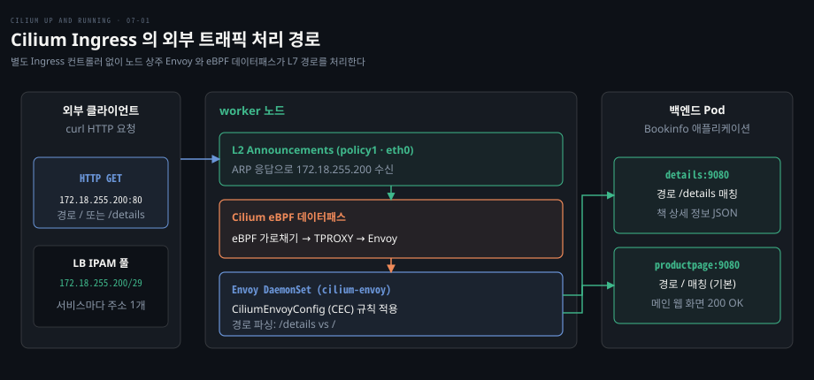
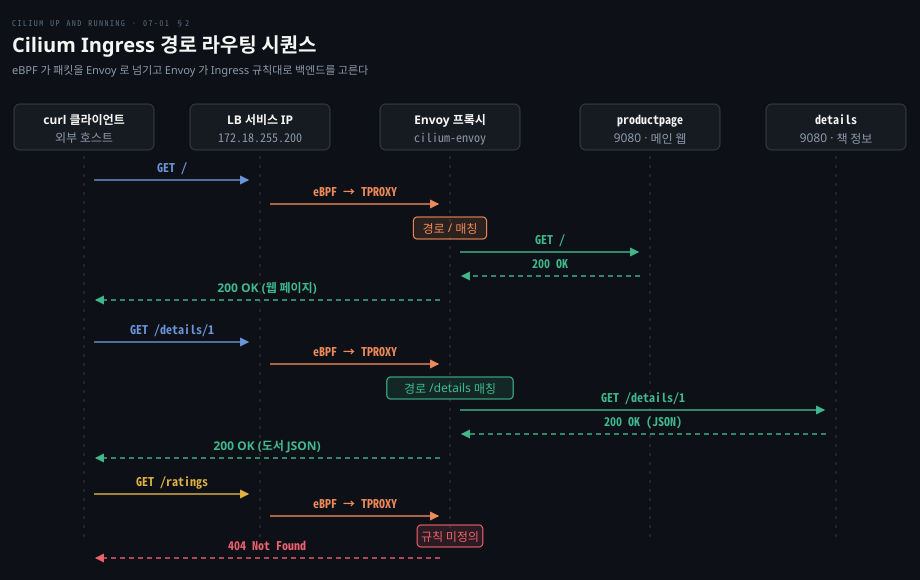
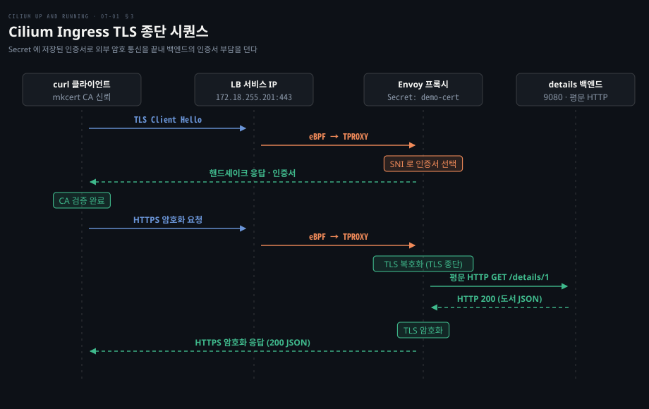
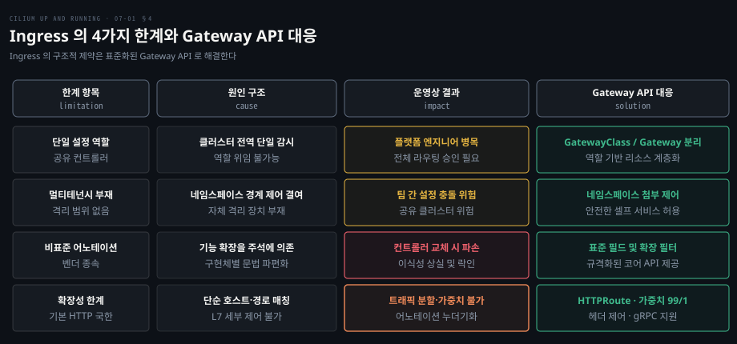

# Cilium Ingress 는 노드의 Envoy 로 바깥 HTTP 를 받고 TLS 를 끝낸다

---

> 클러스터 외부 HTTP 요청을 받을 때 별도 Ingress 컨트롤러 없이도 노드 상주 Envoy 와 eBPF 데이터패스가 L7 경로 라우팅과 TLS 종단을 처리합니다.


## 핵심 요약

> 이 편의 중심 생각은 Cilium 이 eBPF 가로채기와 TPROXY, 노드 Envoy 를 결합해 별도 Ingress 컨트롤러를 설치하지 않고 표준 Ingress 를 완결한다는 것입니다.

쿠버네티스 서비스는 L4 계층의 부하 분산만 제공하므로 URL 경로 분기나 TLS 암호 해독 같은 L7 작업을 수행하지 못합니다. 전통적인 환경에서는 별도 Ingress 컨트롤러 파드를 띄워 외부 트래픽을 넘겨받아야 했으며, 이는 추가 홉과 리소스 낭비를 유발했습니다.

Cilium 은 KPR, LB IPAM, L2 Announcements 로 외부 IP 를 노드로 끌어들입니다. Service 포트에 도착한 트래픽은 eBPF 가 가로채고, 커널 TPROXY 기능(기본값에서는 iptables 로 구현)으로 노드의 Envoy 데몬셋에 투명하게 넘깁니다. 표준 `networking.k8s.io/v1 Ingress` 와 쿠버네티스 TLS Secret 만으로 외부 트래픽 수신과 암호화 종단을 구현합니다.




## 학습 목표

> 이 편을 읽고 나면 다음을 설명할 수 있습니다.

1. L4 서비스와 L7 Ingress 의 기능적 차이 및 외부 트래픽 인입 계층의 역할을 구분할 수 있습니다.
2. Cilium Ingress 가 별도 컨트롤러 파드 없이 노드 Envoy 데몬셋과 CEC 로 규칙을 적용하는 방식을 설명할 수 있습니다.
3. Ingress 로드밸런서의 `dedicated` 모드와 `shared` 모드의 차이 및 IP 할당 구조를 비교할 수 있습니다.
4. 쿠버네티스 TLS Secret 과 Ingress `tls:` 블록을 연동하여 외부 암호화를 종단하는 과정을 제시할 수 있습니다.
5. Ingress API 의 4가지 태생적 한계와 이를 극복하기 위해 Gateway API 가 등장한 배경을 분석할 수 있습니다.


## 1. 클러스터 바깥 트래픽을 받는 방법은 여러 층이다

> L4 서비스는 IP 와 포트 수준의 분산에 머무르므로, 도메인이나 요청 경로에 따라 트래픽을 나누고 TLS 암호화를 해독하려면 L7 역방향 프록시가 필요합니다.

클러스터 외부 사용자를 맞이하려면 내부 서비스를 안전하게 노출해야 합니다.

하지만 기본 **Service** 추상화는 전송 계층(L4)에 머물러 있어, 하나의 IP 와 포트로 들어온 요청에서 HTTP 헤더나 URL 경로를 읽어 서비스로 분기하거나 중앙에서 TLS 를 종단하지 못합니다.

| 노출 방식 | 동작 계층 | 외부 진입점 | 주요 역할과 한계 |
|---|---|---|---|
| **NodePort** | L4 | 모든 노드의 고정 포트 (`30000-32767`) | 포트 고갈 위험, 외부 L4 로드밸런서 연동 필요, L7 라우팅 불가 |
| **LoadBalancer** | L4 | 클라우드 또는 온프레미스 외부 IP | 단일 서비스당 IP 소모, L4 부하 분산에 국한, 경로 분기 불가 |
| **Ingress** | L7 | 단일 외부 IP (HTTP 80 · HTTPS 443) | 호스트명·URL 경로 라우팅, TLS 종단 지원, 컨트롤러 필요 |

[Ingress와 Service Mesh — L7의 두 층](../networking-and-kubernetes/05-03.Ingress와%20Service%20Mesh%20—%20L7의%20두%20층.md)에서 보았듯 쿠버네티스는 구현체를 내장하지 않아 전용 컨트롤러를 별도 배포해야 했습니다. 반면 Cilium 은 데이터패스에 Ingress 기능을 내장해 별도 컨트롤러 설치 없이 Helm 값 하나(`ingressController.enabled=true`)로 켤 수 있습니다.


## 2. Cilium Ingress 는 별도 컨트롤러 없이 Envoy 로 규칙을 처리한다

> Cilium 은 eBPF 로 LoadBalancer 트래픽을 가로채 TPROXY 로 노드 상주 Envoy 에 넘기고, Ingress 규칙을 CiliumEnvoyConfig 로 자동 변환해 경로별 백엔드로 라우팅합니다.

외부 트래픽을 L7 에서 처리하려면 역방향 프록시가 필요하지만, 별도 컨트롤러 파드를 띄우면 홉 수와 리소스 낭비가 늘어납니다.

Cilium 은 CNI 에 내장된 **Envoy** 와 eBPF 로 이 문제를 풉니다. Helm 설치 시 `ingressController.enabled=true` 를 켜면 별도 배포 없이 Ingress 가 동작합니다.

```yaml
# cilium-ingress-values.yaml
kubeProxyReplacement: true
l2announcements:
  enabled: true
ipam:
  mode: kubernetes
ingressController:
  enabled: true
```

이 구성에는 세 가지 전제 조건이 맞물려 있습니다. 첫째, Ingress 패킷을 커널에서 가로채려면 KPR이 켜져 있어야 합니다. 둘째, Ingress 가 생성하는 LoadBalancer 서비스에 IP 를 부여하기 위해 LB IPAM 이 작동해야 합니다. 셋째, 할당된 IP 를 클러스터 외부에 알리기 위해 L2 Announcements 기능이 필요합니다.

예시 클러스터에서는 Bookinfo 마이크로서비스 데모 애플리케이션을 배포했습니다.

```bash
kubectl apply -f bookinfo.yaml
```

이어서 Cilium Ingress 자원(`basic-ingress.yaml`)을 배포했습니다. `ingressClassName` 에 `cilium` 을 지정하면 쿠버네티스가 Cilium 을 해당 인그레스의 컨트롤러로 인식합니다.

```yaml
apiVersion: networking.k8s.io/v1
kind: Ingress
metadata:
  name: basic-ingress
  namespace: default
spec:
  ingressClassName: cilium
  rules:
    - http:
        paths:
          - backend:
              service:
                name: details
                port:
                  number: 9080
            path: /details
            pathType: Prefix
          - backend:
              service:
                name: productpage
                port:
                  number: 9080
            path: /
            pathType: Prefix
```

이 Ingress 를 배포하면 Cilium 은 자동으로 `cilium-ingress-basic-ingress` 라는 LoadBalancer 타입 서비스를 생성합니다. 외부 IP 를 부여하기 위해 `CiliumLoadBalancerIPPool` 객체를 정의합니다.

```yaml
# pool.yaml
apiVersion: "cilium.io/v2"
kind: CiliumLoadBalancerIPPool
metadata:
  name: "pool"
spec:
  blocks:
    - cidr: "172.18.255.200/29"
```

예시 클러스터에서는 풀을 적용하자 서비스와 Ingress 에 동일한 외부 IP 가 할당됐습니다.

```bash
kubectl get svc cilium-ingress-basic-ingress
# NAME                           TYPE           CLUSTER-IP     EXTERNAL-IP
# cilium-ingress-basic-ingress   LoadBalancer   10.96.68.40    172.18.255.200

kubectl get ingress basic-ingress
# NAME            CLASS    HOSTS   ADDRESS          PORTS   AGE
# basic-ingress   cilium   *       172.18.255.200   80      13m
```

외부 클라이언트가 이 IP 로 접근할 수 있도록 워커 노드의 `eth0` 인터페이스에서 ARP 응답을 수행하는 `CiliumL2AnnouncementPolicy` 를 배포합니다.

```yaml
# l2policy.yaml
apiVersion: "cilium.io/v2alpha1"
kind: CiliumL2AnnouncementPolicy
metadata:
  name: policy1
spec:
  loadBalancerIPs: true
  interfaces:
    - eth0
  nodeSelector:
    matchExpressions:
      - key: node-role.kubernetes.io/control-plane
        operator: DoesNotExist
```

외부에서 들어온 패킷은 어떻게 노드의 Envoy 에 도달할까요?

[Cilium 구성 요소 아키텍처](./02-01.Cilium%20은%20에이전트·CNI%20플러그인·오퍼레이터로%20나눠%20노드와%20클러스터를%20맡는다.md)에서 보았듯 Envoy 는 노드마다 상주하는 **`cilium-envoy`** 데몬셋으로 구동됩니다. 사용자가 Ingress 를 생성하면 Cilium 컨트롤러가 이를 **`CiliumEnvoyConfig`**(CEC)로 변환해 Envoy 의 xDS 설정을 갱신합니다.

Service 포트에 도착한 트래픽을 eBPF 가 가로채고, 커널 TPROXY 기능(기본값에서는 iptables 로 구현)으로 노드의 Envoy 에 투명하게 넘깁니다.

[Cilium 공식 문서 Ingress](https://docs.cilium.io/en/v1.20/network/servicemesh/ingress/)에 따르면 로드밸런서 구성은 두 모드를 지원합니다.

기본인 **`dedicated`** 모드는 Ingress 마다 전용 LoadBalancer 서비스(`cilium-ingress-<이름>`)를 띄워 전용 IP 를 할당합니다. 경로 충돌을 방지하지만 외부 IP 가 Ingress 수만큼 소모됩니다.

반면 **`shared`** 모드는 단일 LoadBalancer 서비스(`cilium-ingress`)를 클러스터 전역 Ingress 가 공유하여 IP 자원을 아낍니다.



설정이 끝난 뒤 예시 클러스터에서는 외부 클라이언트로 요청을 보내 동작을 확인합니다. Docker Desktop on Mac 에서는 호스트가 kind 네트워크에 닿지 않으므로, 아래 명령으로 같은 네트워크에 클라이언트를 띄워 그 안에서 실행할 수 있습니다.

```bash
docker run -d --net kind --rm --name client \
  nicolaka/netshoot:v0.8 sleep inf
```

예시 클러스터에서 나온 결과는 다음과 같습니다.

```bash
export INGRESS_IP=172.18.255.200

# 1. 루트 경로: productpage 로 전달되어 200 반환
curl --fail -s -o /dev/null -w "%{http_code}\n" "http://$INGRESS_IP/"
# 200

# 2. /details/1 경로: details 로 전달되어 JSON 반환
curl --fail -s "http://$INGRESS_IP/details/1"
# { "id": 1, "author": "William Shakespeare", "year": 1595, ... }

# 3. 미정의 경로: Ingress 규칙에 없어 Envoy 가 404 반환
curl --fail -so /dev/null -w "%{http_code}\n" "http://$INGRESS_IP/ratings"
# 404
```


## 3. TLS 는 Ingress 의 Secret 으로 끝낸다

> 외부 공용망의 암호화 트래픽을 클러스터 진입점인 Envoy 에서 복호화하고 백엔드 서비스로는 평문 HTTP 로 전달하여 인증서 관리를 단일화합니다.

외부망과 통신하는 웹 서비스를 평문 HTTP(80)로 노출하면 도청에 취약해집니다. 하지만 마이크로서비스 파드마다 TLS 인증서를 개별 발급하고 주기적으로 갱신하는 일은 운영상 큰 비효율을 낳습니다.

이 문제를 해결하는 표준 설계 패턴이 **TLS 종단**(TLS Termination)입니다. 클러스터의 관문인 Ingress 에서 외부 클라이언트와 TLS 핸드셰이크를 맺고 복호화를 완료한 뒤, 내부 신뢰 네트워크에서는 평문 HTTP 로 백엔드 파드에 패킷을 전달합니다.

예시 클러스터에서는 `mkcert` 도구로 와일드카드 인증서를 발급했습니다.

```bash
mkcert '*.cilium.rocks'
# ...
# Created a new certificate valid for the following names
#  - "*.cilium.rocks"
# ...
# The certificate is at "./_wildcard.cilium.rocks.pem" and the key at
# "./_wildcard.cilium.rocks-key.pem"
```

생성된 인증서와 개인키 파일로 쿠버네티스 표준 TLS Secret 인 `demo-cert` 를 생성합니다.

```bash
kubectl create secret tls demo-cert \
  --key=_wildcard.cilium.rocks-key.pem \
  --cert=_wildcard.cilium.rocks.pem
# secret/demo-cert created
```

이제 Ingress 매니페스트(`tls-ingress.yaml`)에 `tls:` 블록을 추가하여 발급된 Secret 을 연결합니다.

```yaml
apiVersion: networking.k8s.io/v1
kind: Ingress
metadata:
  name: tls-ingress
  namespace: default
spec:
  ingressClassName: cilium
  rules:
    - host: bookinfo.cilium.rocks
      http:
        paths:
          - path: /details
            pathType: Prefix
            backend:
              service:
                name: details
                port:
                  number: 9080
          - path: /
            pathType: Prefix
            backend:
              service:
                name: productpage
                port:
                  number: 9080
  tls:
    - hosts:
        - bookinfo.cilium.rocks
      secretName: demo-cert
```

매니페스트를 적용하자 `dedicated` 모드에 따라 새로운 LoadBalancer 서비스와 전용 IP 172.18.255.201 이 프로비저닝됐습니다.

```bash
kubectl apply -f tls-ingress.yaml
kubectl get ingress tls-ingress

export TLS_INGRESS="$(kubectl get ingress tls-ingress -o jsonpath='{.status.loadBalancer.ingress[0].ip}')"
```

cURL 의 `--resolve` 옵션으로 도메인 이름을 Ingress IP 에 매핑하고, `--cacert` 옵션으로 로컬 CA 인증서를 지정하여 HTTPS 요청을 검증합니다.

```bash
curl -s \
  --resolve "bookinfo.cilium.rocks:443:$TLS_INGRESS" \
  --cacert "$(mkcert -CAROOT)/rootCA.pem" \
  https://bookinfo.cilium.rocks/details/1 | jq
# { "id": 1, "author": "William Shakespeare", "year": 1595, ... }
```



Envoy 는 요청의 SNI(`bookinfo.cilium.rocks`)로 `demo-cert` 를 골라 핸드셰이크합니다. 이후 클라이언트와 443 포트에서 HTTPS 통신을 유지하고, 백엔드 `details` 파드로는 평문 HTTP(`:9080`)로 요청을 전달합니다. 파드는 암복호화 연산 부담을 덜고 인증서 관리도 Ingress 로 단일화됩니다. 상용 환경에서는 cert-manager 연동이 권장됩니다.


## 4. Ingress 는 표현력이 모자라 주석으로 새어 나간다

> Ingress 자원은 단일 객체에 라우팅과 인프라 설정이 혼재되어 있고 표현력이 부족하여 컨트롤러별 비표준 어노테이션에 의존하는 태생적 한계를 지닙니다.

Ingress 는 기본적인 HTTP 라우팅과 TLS 종단을 제공하며 널리 보급되었습니다. 하지만 서비스 구조가 복잡해지고 여러 팀이 단일 클러스터를 공유하는 환경에서는 Ingress API 자체의 설계상 결함이 운영 병목을 야기합니다.

이러한 한계는 Cilium 만의 문제가 아니라 쿠버네티스 Ingress 표준 사양 자체가 가진 본질적인 제약입니다.

1. **단일 공유 설정 역할(Single shared configuration role)**: 단일 컨트롤러가 전역 자원을 일괄 감시하여 역할 위임이 불가능하고 플랫폼 팀의 승인 병목을 초래합니다.
2. **미흡한 멀티테넌시 지원(Poor multitenancy support)**: 테넌트 격리 기능이 없어 팀 간 Ingress 경로 충돌과 설정 간섭 위험이 상존합니다.
3. **비표준 어노테이션 남발(Nonportable annotations)**: 고급 기능을 컨트롤러별 주석에 의존해 구현체 변경 시 이식성을 상실하고 벤더 락인이 발생합니다.
4. **확장성 한계(Hard to extend)**: 기본 HTTP 매칭에 머물러 gRPC, 가중치 트래픽 분할(99 대 1 카나리 등), 헤더 제어를 기본 명세로 표현하지 못합니다.



Gateway API 는 이 한계마다 GatewayClass·Gateway 분리, 네임스페이스 단위 라우트 첨부 제어, 표준 필드와 필터, 가중치와 헤더 규칙으로 답합니다.

쿠버네티스 SIG Network 는 이러한 Ingress 의 한계를 해결하기 위해 차세대 표준인 **Gateway API** 를 제정했습니다. 이어지는 [Gateway API 는 역할별 객체로 라우팅을 나누고 가중치·헤더·동서 트래픽까지 맡는다](./07-02.Gateway%20API%20는%20역할별%20객체로%20라우팅을%20나누고%20가중치·헤더·동서%20트래픽까지%20맡는다.md)에서 역할 분리와 가중치 제어를 다룹니다.


## 5. 정리

> Cilium Ingress 는 노드 상주 Envoy 와 eBPF 로 별도 Ingress 컨트롤러 없이 L7 라우팅과 TLS 종단을 처리하지만, Ingress API 자체의 표현력 한계로 인해 Gateway API 로의 확장이 요구됩니다.

Cilium Ingress 는 CNI 와 eBPF 데이터패스, 그리고 노드 Envoy 를 결합해 별도 컨트롤러 파드 없이 완전한 L7 라우팅과 TLS 종단을 제공합니다. `dedicated` 모드로 외부 IP 를 안전하게 할당하고 쿠버네티스 표준 TLS Secret 으로 암호화 관문을 구축합니다.

하지만 단일 매니페스트에 설정이 집중되고 비표준 어노테이션에 의존하는 Ingress 의 태생적 한계는 엔터프라이즈 환경에서 병목을 만듭니다. 따라서 현대 클러스터 환경에서는 역할 분리와 확장성을 기본 제공하는 Gateway API 가 표준으로 자리잡고 있습니다.


## 면접 대비

> Cilium Ingress 와 L7 트래픽 처리에 관한 핵심 기술 면접 질문입니다.

1. 쿠버네티스 L4 Service(NodePort, LoadBalancer)와 L7 Ingress 의 결정적인 역할 차이는 무엇입니까?
2. Cilium Ingress 가 별도의 인그레스 컨트롤러 파드를 띄우지 않고도 L7 규칙을 처리할 수 있는 내부 아키텍처 원리는 무엇입니까?
3. Cilium Ingress 에서 `dedicated` 로드밸런서 모드와 `shared` 로드밸런서 모드의 차이점과 각각의 장단점은 무엇입니까?
4. Ingress 에서 TLS 종단을 구성할 때 트래픽이 암호화되는 구간과 평문으로 흐르는 구간은 어디이며, 이를 통해 얻는 운영상 이점은 무엇입니까?
5. 쿠버네티스 표준 Ingress API 가 가진 구조적 한계 4가지는 무엇이며, 이를 극복하기 위해 Gateway API 가 도입된 이유는 무엇입니까?


## 정답 (자답 후 펼치기)

> 면접 질문에 대한 키워드 중심의 모범 답안입니다.

### 정답 1 — L4 전송 계층과 L7 응용 계층의 부하 분산 및 프로토콜 제어 범위

L4 Service 는 IP 주소와 포트 수준에서만 트래픽을 분산하므로 단일 진입점에서 URL 경로별 분기나 HTTP 헤더 기반 라우팅을 수행하지 못합니다. 반면 L7 Ingress 는 HTTP/HTTPS 응용 계층을 해석하여 동일 IP 에서 요청 호스트명과 URL 경로에 따라 서로 다른 백엔드 서비스로 분기하며, 중앙 집중식 TLS 암호화 종단을 수행합니다.

### 정답 2 — 노드 상주 Envoy 데몬셋과 eBPF 가로채기·TPROXY 및 CEC 변환

Cilium 은 별도 컨트롤러 파드 없이 노드마다 데몬셋(`cilium-envoy`)으로 실행되는 Envoy 프록시를 활용합니다. 사용자가 Ingress 자원을 생성하면 Cilium 컨트롤러가 이를 `CiliumEnvoyConfig`(CEC)로 변환해 Envoy 의 xDS 설정을 프로그래밍합니다. Service 포트에 도착한 트래픽을 eBPF 가 가로채고, 커널 TPROXY 기능(기본값에서는 iptables 로 구현)으로 노드의 Envoy 에 투명하게 넘깁니다.

### 정답 3 — 전용 LB 서비스 격리와 공유 LB 서비스의 리소스 절약 트레이드오프

`dedicated` 모드는 Ingress 자원마다 독립된 LoadBalancer 서비스(`cilium-ingress-<name>`)와 외부 IP 를 프로비저닝합니다. 경로 충돌을 원천 차단하지만 Ingress 개수에 비례해 외부 IP 가 소모됩니다. 반면 `shared` 모드는 클러스터 전역 Ingress 가 단일 LoadBalancer 서비스(`cilium-ingress`)와 하나의 외부 IP 를 공유하므로 IP 주소를 절약하지만 경로 충돌 방지 관리가 필요합니다.

### 정답 4 — 외부 암호화 종단과 내부 평문 전달을 통한 인증서 관리 단일화

외부 클라이언트와 Envoy 프록시 사이는 443 포트에서 TLS 로 암호화되고, Envoy 가 복호화를 마친 뒤 내부 백엔드 파드로 전달하는 구간은 9080 포트의 평문 HTTP 로 흐릅니다. 이를 통해 수십 개 마이크로서비스 파드마다 개별 인증서를 발급하고 갱신해야 하는 관리 복잡성을 없애고 파드의 CPU 암복호화 연산 부담을 줄입니다.

### 정답 5 — 역할 분리 부재·멀티테넌시 결여·비표준 어노테이션 의존·확장성 한계

표준 Ingress 는 운영자와 개발자의 역할 분리가 불가능해 플랫폼 팀 병목을 일으키고, 격리 부재로 멀티테넌시 환경에서 충돌 위험이 큽니다. 또한 고급 기능이 컨트롤러별 비표준 어노테이션에 의존하여 벤더 락인을 초래하고 gRPC 나 가중치 분할 확장이 어렵습니다. Gateway API 는 GatewayClass, Gateway, HTTPRoute 로 객체를 계층화하여 역할 분리와 멀티테넌시를 실현하고 표준 필드로 확장 기능을 제공하기 위해 도입되었습니다.


## 참고 자료

- Nico Vibert 외, 《Cilium: Up and Running》, O'Reilly, 2026, ISBN 979-8-341-62299-9, Ch.7 "Ingress and Gateway API".
- Cilium 공식 문서 Ingress: https://docs.cilium.io/en/v1.20/network/servicemesh/ingress/
- Cilium 공식 문서 L2 Announcements: https://docs.cilium.io/en/v1.20/network/l2-announcements/
- Cilium 공식 문서 LB IPAM: https://docs.cilium.io/en/v1.20/network/lb-ipam/
- Cilium 공식 문서 Kube-Proxy Replacement: https://docs.cilium.io/en/v1.20/network/kubernetes/kubeproxy-free/
- Cilium 소스 리포지토리: https://github.com/cilium/cilium/tree/v1.20.2


## 관련 문서

- [Cilium 은 에이전트·CNI 플러그인·오퍼레이터로 나눠 노드와 클러스터를 맡는다](./02-01.Cilium%20은%20에이전트·CNI%20플러그인·오퍼레이터로%20나눠%20노드와%20클러스터를%20맡는다.md)
- [Cilium 은 kube-proxy 를 eBPF 로 대신하고 외부 서비스에 IP 와 경로를 붙인다](./06-01.Cilium%20은%20kube-proxy%20를%20eBPF%20로%20대신하고%20외부%20서비스에%20IP%20와%20경로를%20붙인다.md)
- [Gateway API 는 역할별 객체로 라우팅을 나누고 가중치·헤더·동서 트래픽까지 맡는다](./07-02.Gateway%20API%20는%20역할별%20객체로%20라우팅을%20나누고%20가중치·헤더·동서%20트래픽까지%20맡는다.md)
- [Ingress와 Service Mesh — L7의 두 층](../networking-and-kubernetes/05-03.Ingress와%20Service%20Mesh%20—%20L7의%20두%20층.md)
- [문을 여는 일과 길을 내는 일을 가른다](../istio-in-action/04-01.문을%20여는%20일과%20길을%20내는%20일을%20가른다.md)
