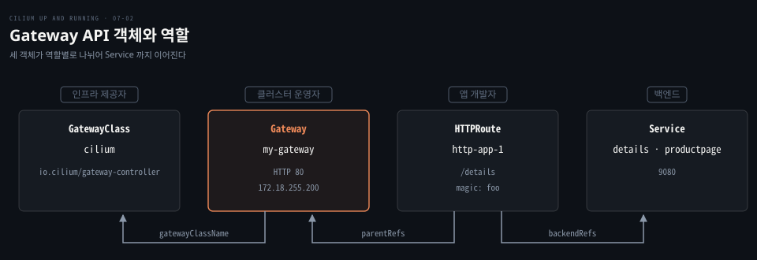
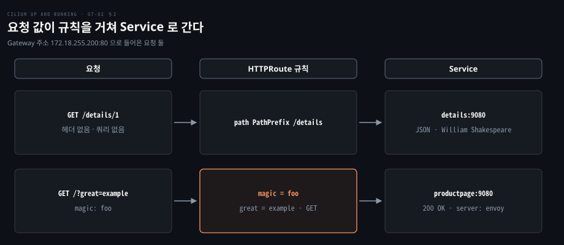
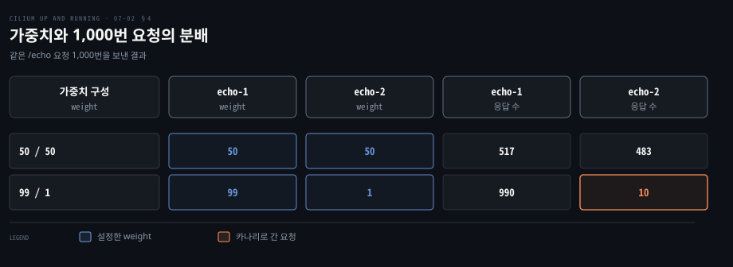
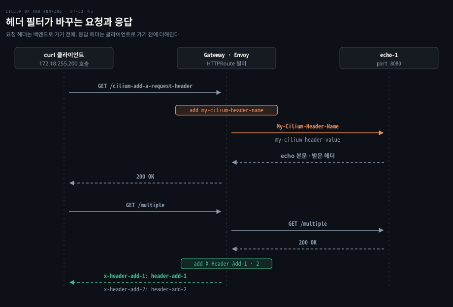
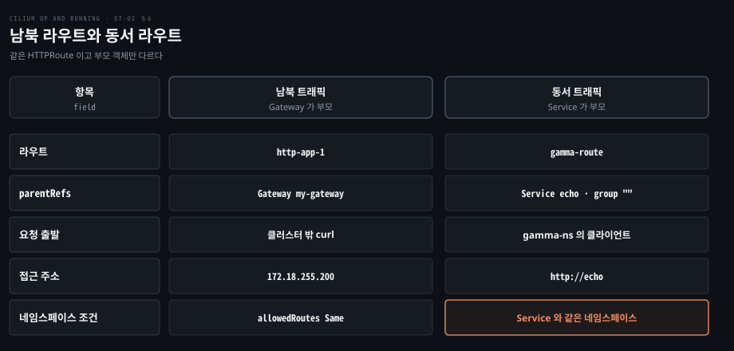

# Gateway API 는 역할별 객체로 라우팅을 나누고 가중치·헤더·동서 트래픽까지 맡는다

---

> Gateway API 는 Ingress 한 객체가 쥐고 있던 일을 GatewayClass·Gateway·HTTPRoute 셋으로 나눠 담당자별로 권한을 가르고, 같은 라우트 객체로 가중치 분배·헤더 수정·클러스터 안 트래픽까지 다룹니다.


## 핵심 요약

> 이 편의 중심 생각은 라우팅의 책임을 역할별 객체로 쪼개 두면 한 API 로 바깥 트래픽과 안쪽 트래픽을 같은 방식으로 다룰 수 있다는 것입니다.

Ingress 는 주소, 인증서, 경로 규칙을 한 객체에 담고 부가 기능은 컨트롤러마다 다른 annotation 으로 풉니다. Gateway API 는 이를 인프라 제공자가 정하는 GatewayClass, 클러스터 운영자가 여는 Gateway, 앱 개발자가 쓰는 HTTPRoute 로 나눕니다. 개발자는 자기 네임스페이스의 라우트만 고치고 공유 진입점은 운영자가 쥡니다.

경로·헤더 매칭, TLS 종단, 가중치 분배, 헤더 수정, 리다이렉트가 모두 표준 필드입니다. HTTPRoute 의 부모를 Service 로 바꾸면 같은 규칙이 클러스터 안 서비스 사이 트래픽에도 적용되고, 이를 GAMMA 라고 부릅니다.




## 학습 목표

> 이 편을 읽고 나면 다음을 설명할 수 있습니다.

1. Gateway API 가 Ingress 의 한계를 푸는 방식과 GatewayClass·Gateway·HTTPRoute 의 역할을 설명할 수 있습니다.
2. HTTPRoute 가 경로·헤더·쿼리·메서드로 백엔드를 고르는 규칙을 읽고 쓸 수 있습니다.
3. Gateway 리스너에서 TLS 를 끝내는 구성을 Ingress 쪽과 비교할 수 있습니다.
4. 가중치로 트래픽을 나누는 규칙과 99/1 카나리 구성을 설명할 수 있습니다.
5. 같은 라우트가 Gateway 를 부모로 가질 때와 Service 를 부모로 가질 때의 차이를 설명할 수 있습니다.


## 1. Gateway API 는 역할마다 객체를 나눠 Ingress 의 한계를 푼다

> Ingress 는 한 객체와 한 컨트롤러가 모든 권한을 쥐어 팀 사이 위임이 어렵습니다. Gateway API 는 책임을 세 객체로 쪼개 권한도 따로 줍니다.

플랫폼 팀 하나가 클러스터 전체의 Ingress 를 승인한다고 해 봅시다. 팀이 늘면 그 팀이 병목이 됩니다. 팀마다 필요한 기능은 컨트롤러 annotation 으로 끼워 넣어야 합니다. 이 한계는 구현체와 무관한 구조의 문제입니다. 공유 설정을 한 역할이 쥐고 위임할 경계가 없으며 확장이 비표준 annotation 에 매입니다.

**Gateway API** 는 이 한계를 풀려고 Kubernetes SIG Network 가 만든 Ingress 의 후속 API 입니다. 역할 중심 모델링이 설계 원칙이고([공식 문서](https://docs.cilium.io/en/v1.20/network/servicemesh/gateway-api/gateway-api/)), 경로 매칭·TLS 종단·트래픽 분할·헤더 조작을 기능 필드로 받아 구현체 사이 이식성을 높입니다. 뼈대는 세 객체입니다.

| 객체 | 맡는 역할 | 하는 일 |
|---|---|---|
| GatewayClass | 인프라 제공자 | 어느 컨트롤러가 이 종류의 Gateway 를 맡는지 선언 |
| Gateway | 클러스터 운영자 | 리스너(프로토콜·포트·호스트명·TLS)로 진입점을 엶 |
| HTTPRoute | 애플리케이션 개발자 | 경로·헤더 규칙으로 요청을 Service 에 이음 |

Cilium 은 Gateway API 지원을 켜면 `cilium` GatewayClass 를 만들고 컨트롤러 이름은 `io.cilium/gateway-controller` 입니다. Gateway 가 `gatewayClassName: cilium` 을 쓰면 Cilium 이 그 Gateway 를 조정합니다. 요청을 처리하는 쪽은 Ingress 와 같은 노드별 Envoy 입니다.

새 설치에서 Envoy 를 별도 DaemonSet 으로 띄우는 기본값은 [Helm 값](https://github.com/cilium/cilium/blob/v1.20.2/install/kubernetes/cilium/values.yaml#L2741-L2744)에 적혀 있고, 구성 요소 분담은 [에이전트·오퍼레이터 편](./02-01.Cilium%20은%20에이전트·CNI%20플러그인·오퍼레이터로%20나눠%20노드와%20클러스터를%20맡는다.md)에서 다뤘습니다.

```yaml
apiVersion: gateway.networking.k8s.io/v1
kind: Gateway
metadata:
  name: my-gateway
spec:
  gatewayClassName: cilium
  listeners:
  - protocol: HTTP
    port: 80
    name: web-gw
    allowedRoutes:
      namespaces:
        from: Same
```

`allowedRoutes.namespaces.from: Same` 은 이 Gateway 에 붙을 라우트를 같은 네임스페이스로 제한합니다. `All` 로 바꾸면 여러 네임스페이스의 라우트가 한 Gateway 를 공유합니다. 운영자는 Gateway 만, 개발자는 자기 HTTPRoute 만 고치도록 RBAC 를 나눌 수 있다는 점이 Ingress 와 다릅니다.

켜기 전에 전제가 셋 있습니다.

- Gateway API CRD 는 Cilium 이 설치해 주지 않으므로 먼저 직접 적용합니다. 표준 채널과 실험 채널 중 어느 쪽을 쓸지 사용자가 정하게 하려는 것입니다.
- Cilium v1.20.2 는 Gateway API v1.6.1 을 지원하고 Core 적합성 테스트를 통과했습니다. 필수 CRD 는 GatewayClass·Gateway·HTTPRoute·GRPCRoute·BackendTLSPolicy·ReferenceGrant·TLSRoute 입니다.
- Helm 값 `kubeProxyReplacement=true` 와 `gatewayAPI.enabled=true` 가 켜져 있어야 합니다.

표준 채널은 `kubectl apply --server-side -f` 로 v1.6.1 의 `config/crd/standard/` 아래 파일을 하나씩 적용합니다. 전체 명령은 [공식 문서의 Installation 절](https://docs.cilium.io/en/v1.20/network/servicemesh/gateway-api/gateway-api/)에 있습니다.

예시 실습은 Cilium 1.18 과 Gateway API v1.3.0 CRD 로 돌린 결과입니다. 이 예시 kind 클러스터에서 Gateway 를 배포하자 GatewayClass `cilium` 이 승인되고 Gateway `my-gateway` 가 주소 172.18.255.200 을 받아 `PROGRAMMED` 가 `True` 가 됩니다. 주소는 LoadBalancer Service 로 받으며 LB IP 풀과 L2 Announcements 구성은 [Ingress 편](./07-01.Cilium%20Ingress%20는%20노드의%20Envoy%20로%20바깥%20HTTP%20를%20받고%20TLS%20를%20끝낸다.md)과 같습니다.

Istio 에서 같은 API 로 진입점과 라우팅을 나누는 방식은 [문을 여는 일과 길을 내는 일을 가른다](../istio-in-action/04-01.문을%20여는%20일과%20길을%20내는%20일을%20가른다.md)에 있습니다. Ingress 와 메시의 L7 분담은 [Ingress 와 Service Mesh](../networking-and-kubernetes/05-03.Ingress와%20Service%20Mesh%20—%20L7의%20두%20층.md)를 보면 됩니다.


## 2. HTTPRoute 는 경로·헤더로 백엔드를 고른다

> 라우트 하나에 규칙을 여러 개 두고, 규칙마다 매칭 조건과 보낼 Service 를 짝지어 둡니다. 한 규칙 안의 조건은 모두 맞아야 합니다.

경로가 `/details` 로 시작하면 details 로, 특정 헤더와 쿼리가 함께 오면 productpage 로 보내려면 규칙은 어떻게 적을까요? 다음 HTTPRoute 는 두 규칙을 한 객체에 담습니다.

```yaml
apiVersion: gateway.networking.k8s.io/v1
kind: HTTPRoute
metadata:
  name: http-app-1
spec:
  parentRefs:
  - name: my-gateway
    namespace: default
  rules:
  - matches:
    - path:
        type: PathPrefix
        value: /details
    backendRefs:
    - name: details
      port: 9080
  - matches:
    - headers:
      - type: Exact
        name: magic
        value: foo
      queryParams:
      - type: Exact
        name: great
        value: example
      path:
        type: PathPrefix
        value: /
      method: GET
    backendRefs:
    - name: productpage
      port: 9080
```

`parentRefs` 는 이 라우트가 붙을 Gateway 를 가리킵니다. 첫 규칙은 경로가 `/details` 로 시작하는 요청을 details 의 9080 포트로 보냅니다. 둘째 규칙은 헤더 `magic: foo`, 쿼리 `great=example`, 메서드 GET 이 모두 맞을 때만 productpage 의 9080 으로 보냅니다.



라우트가 붙었는지는 `status.parents` 의 `Accepted` 조건으로 확인합니다.

예시 kind 클러스터에서 Gateway 주소 172.18.255.200 으로 두 규칙을 확인한 결과는 다음과 같습니다. `/details/1` 요청은 `{ "id": 1, "author": "William Shakespeare", ... }` JSON 을 돌려받았습니다. `magic: foo` 헤더와 `great=example` 쿼리를 단 요청은 200 을 받았습니다. 응답 헤더의 `server: envoy` 는 Envoy 가 프록시했다는 흔적이고, `x-envoy-upstream-service-time: 9` 는 업스트림이 9ms 만에 응답했다는 뜻입니다.

HTTP 가 아닌 트래픽을 위한 라우트도 있습니다. GRPCRoute 는 gRPC 서비스와 메서드 이름으로 매칭하고 `parentRefs`·`backendRefs` 구조는 HTTPRoute 와 같습니다. 예시 실습에서는 `hipstershop.ProductCatalogService` 의 `ListProducts` 를 productcatalogservice 의 3550 으로 보냈습니다. 자세한 내용은 [gRPC 예제](https://docs.cilium.io/en/v1.20/network/servicemesh/gateway-api/grpc/)에 있습니다. Ingress 에는 gRPC 라우팅의 공통 표준이 없어 annotation 에 기댑니다.

TCPRoute·UDPRoute 도 v1.20 문서의 지원 목록에 있고, 해당 CRD 는 선택 설치라 적용하지 않으면 그 기능이 꺼집니다([공식 문서](https://docs.cilium.io/en/v1.20/network/servicemesh/gateway-api/gateway-api/)).


## 3. TLS 는 Gateway 리스너에서 끝낸다

> 인증서를 어느 객체가 쥘까요? Ingress 는 라우팅 규칙과 같은 객체에, Gateway API 는 리스너에 둡니다. 그래서 인증서는 운영자가, 경로는 개발자가 따로 관리합니다.

TLS 를 끝내려면 인증서 참조를 어디에 적어야 할까요? Ingress 에서는 `spec.tls[].hosts` 와 `secretName` 이 경로 규칙과 한 객체 안에 있어, 라우트를 고치는 사람이 인증서 참조도 같은 파일에서 만집니다. Gateway API 는 TLS 를 Gateway 리스너에 두고 HTTPRoute 는 호스트명과 경로만 말합니다.

```yaml
# Gateway tls-gateway, gatewayClassName 은 cilium
listeners:
- name: https-1
  protocol: HTTPS
  port: 443
  hostname: "bookinfo.cilium.rocks"
  tls:
    certificateRefs:
    - kind: Secret
      name: demo-cert
```

짝이 되는 HTTPRoute `https-app-route-1` 은 `parentRefs` 로 `tls-gateway` 를 가리키고 `hostnames` 에 `bookinfo.cilium.rocks` 를 적습니다. 경로 규칙은 `/details` 를 details 의 9080 으로 보내는 하나뿐입니다.

`tls.mode` 의 기본값은 `Terminate` 이고 이때 `certificateRefs` 가 하나 이상 필요합니다. Core 지원 범위는 `kubernetes.io/tls` 타입 Secret 하나입니다([Gateway CRD](https://github.com/kubernetes-sigs/gateway-api/blob/v1.6.1/config/crd/standard/gateway.networking.k8s.io_gateways.yaml)). Secret 이 다른 네임스페이스에 있으면 그 네임스페이스의 ReferenceGrant 가 허용해야 참조가 유효합니다. 이 소유권 분리가 Ingress 와의 실제 차이입니다.


## 4. 가중치로 트래픽을 나누고 99/1 로 카나리를 연다

> 새 버전에 요청의 1% 만 보내 보려면 라우트의 `backendRefs` 에 `weight` 를 줍니다. 별도 메시나 도구 없이 같은 HTTPRoute 에서 합니다.

신버전에 트래픽을 점진적으로 옮기는 카나리 배포는 어떻게 표현할까요? 예시 앱은 요청을 받은 파드 이름을 응답에 담는 echo 서버 둘(echo-1 은 8080, echo-2 는 8090)입니다. 같은 경로 `/echo` 에 백엔드 둘을 같은 가중치로 올립니다.

```yaml
# HTTPRoute load-balancing-route, parentRefs 는 my-gateway
rules:
- matches:
  - path:
      type: PathPrefix
      value: /echo
  backendRefs:
  - kind: Service
    name: echo-1
    port: 8080
    weight: 50
  - kind: Service
    name: echo-2
    port: 8090
    weight: 50
```

가중치가 요청 단위인지가 궁금할 수 있습니다. Gateway API CRD 는 `weight` 를 "referenced backend 로 전달되는 요청의 비율"로 정의하고, 계산은 그 항목의 값을 `backendRefs` 전체 합으로 나눕니다.

퍼센트가 아니고 합이 100 일 필요도 없으며, 생략하면 1, 0 이면 그 항목에는 트래픽이 가지 않습니다([HTTPRoute CRD](https://github.com/kubernetes-sigs/gateway-api/blob/v1.6.1/config/crd/standard/gateway.networking.k8s.io_httproutes.yaml)). 구현이 낼 수 있는 정밀도에 따라 오차가 생길 수 있다고 같은 정의에 적혀 있습니다.

예시 kind 클러스터에서 `/echo` 로 1,000번 요청을 보낸 결과, `Request served by echo-N` 줄은 50/50 에서 echo-1 이 517번, echo-2 가 483번 나왔습니다. `kubectl edit httproute load-balancing-route` 로 가중치를 echo-1 은 99, echo-2 는 1 로 바꾸고 반복하자 echo-1 이 990번, echo-2 가 10번이었습니다.



한 번의 측정이라 517 대 483 처럼 오차가 보입니다. 카나리에서는 작은 가중치로 시작해 오류율과 지연을 본 뒤 올립니다. 릴리스 전략 자체는 [배포와 릴리스를 가르는 첫 실습](../istio-in-action/02-01.배포와%20릴리스를%20가르는%20첫%20실습.md)에서 Istio 로 다뤘고, 여기서는 같은 일이 숫자 두 개로 끝납니다. 분할 예제는 [공식 문서](https://docs.cilium.io/en/v1.20/network/servicemesh/gateway-api/splitting/)에도 있습니다.


## 5. 헤더를 더하고 바꾸는 일도 라우트에서 한다

> 요청이나 응답의 헤더를 바꾸려면 애플리케이션 코드를 고치지 않고 HTTPRoute 규칙에 `filters` 를 답니다. 필터 종류에 따라 요청 쪽과 응답 쪽이 갈립니다.

백엔드가 받는 요청에 헤더를 하나 붙이려고 앱을 다시 배포해야 할까요? `RequestHeaderModifier` 필터는 라우트가 요청을 백엔드에 넘기기 전에 헤더를 바꿉니다. 필드는 `add`·`set`·`remove` 입니다([HTTPRoute CRD](https://github.com/kubernetes-sigs/gateway-api/blob/v1.6.1/config/crd/standard/gateway.networking.k8s.io_httproutes.yaml)).

```yaml
rules:
- matches:
  - path:
      type: PathPrefix
      value: /cilium-add-a-request-header
  filters:
  - type: RequestHeaderModifier
    requestHeaderModifier:
      add:
      - name: my-cilium-header-name
        value: my-cilium-header-value
  backendRefs:
  - name: echo-1
    port: 8080
```

Service 를 가리키는 `backendRef` 에는 `port` 가 필수라서(HTTPRoute CRD 의 `Must have port for Service reference` 검증) 위 예에는 8080 을 적었습니다. 필터가 없으면 echo 서버가 돌려주는 헤더는 `Host`·`Accept`·`User-Agent` 뿐이고, 필터를 적용하면 `My-Cilium-Header-Name: my-cilium-header-value` 가 더 보입니다.

응답 쪽은 `ResponseHeaderModifier` 가 맡습니다. 버전 정보를 붙이거나 베타와 안정 백엔드를 구분할 때 씁니다. `/multiple` 경로에 `X-Header-Add-1` 과 `X-Header-Add-2` 를 더하는 라우트를 적용합니다. `curl -v` 로 보면 응답에 `x-header-add-1: header-add-1` 과 `x-header-add-2: header-add-2` 가 나옵니다.



바뀐 헤더는 Hubble 에서 `hubble observe --http-header "X-Header-Add-1:header-add-1"` 로 걸러 볼 수 있습니다. Hubble 을 켜는 방법은 [설치 편](./03-01.Cilium%20은%20kind%20클러스터에%20Helm%20으로%20설치하고%20정책과%20Hubble%20로%20동작을%20확인한다.md)에 있고 예제는 [헤더 수정 문서](https://docs.cilium.io/en/v1.20/network/servicemesh/gateway-api/header/)에도 있습니다.

같은 `filters` 자리에 `RequestRedirect` 를 두면 요청을 다른 주소로 돌려보냅니다. 예시 실습에서는 라우트 하나에 규칙 넷을 담았고 결과는 다음과 같습니다.

| 매칭 경로 | 필터 동작 | 응답 |
|---|---|---|
| `/original-prefix` | 접두사를 `/replacement-prefix` 로 교체 | 302, `location: http://172.18.255.200:80/replacement-prefix` |
| `/path-and-host` | 호스트를 `example.org` 로, 경로를 교체 | 302, `location: http://example.org:80/replacement-prefix` |
| `/path-and-status` | 경로 교체와 `statusCode: 301` | 301 Moved Permanently |
| `/scheme-and-host` | 호스트 `example.org`, 스킴 `https` | 브라우저가 `https://example.org/scheme-and-host` 로 이동 |

`statusCode` 를 생략하면 302 가 기본입니다([HTTPRoute CRD](https://github.com/kubernetes-sigs/gateway-api/blob/v1.6.1/config/crd/standard/gateway.networking.k8s.io_httproutes.yaml)). HTTP 에서 HTTPS 로의 리다이렉트는 브라우저용 주소에만 알맞습니다. 기계가 부르는 API 주소에서는 클라이언트가 리다이렉트를 받기 전에 이미 `Authorization` 토큰을 평문으로 보낸 뒤이므로, HTTP 자체를 받지 않는 편이 안전합니다.


## 6. GAMMA 는 같은 API 로 클러스터 안 동서 트래픽을 다룬다

> 같은 HTTPRoute 의 `parentRefs` 가 Gateway 대신 Service 를 가리키면 클러스터 안 서비스 사이 L7 라우팅이 됩니다. 새 리소스는 필요 없습니다.

서비스끼리도 경로 기반 라우팅이나 가중치 분할을 하려면 어떻게 해야 할까요? 바깥에서 들어오는 남북 트래픽은 Gateway 가 받지만, 서비스 사이 호출인 동서 트래픽은 Service 가 L3/L4 로만 분산합니다. L7 이 필요하면 메시 API 를 따로 들여야 했습니다.

**GAMMA** 는 Gateway API 안에서 메시 관리를 맡는 워크스트림이고 라우트를 Service 에 붙여 이 일을 합니다([공식 문서](https://docs.cilium.io/en/v1.20/network/servicemesh/gateway-api/gamma/)). Cilium 은 부모 Service 로 가는 L7 트래픽을 가로채 노드의 Envoy 로 라우팅합니다.

예시는 `gamma-ns` 네임스페이스에 echo 서비스 하나를 앞에 두고 뒤에 echo-v1, echo-v2 를 둔 구성이며 클라이언트 파드가 같은 네임스페이스에 있습니다.

```yaml
apiVersion: gateway.networking.k8s.io/v1
kind: HTTPRoute
metadata:
  name: gamma-route
  namespace: gamma-ns
spec:
  parentRefs:
  - group: ""
    kind: Service
    name: echo
  rules:
  - matches:
    - path:
        type: PathPrefix
        value: /v1
    backendRefs:
    - name: echo-v1
      port: 80
  - matches:
    - path:
        type: PathPrefix
        value: /v2
    backendRefs:
    - name: echo-v2
      port: 80
```

`parentRefs` 의 `group` 은 생략하면 `gateway.networking.k8s.io` 로 추론됩니다. core 그룹 소속인 Service 를 가리키려면 빈 문자열을 명시해야 합니다([HTTPRoute CRD](https://github.com/kubernetes-sigs/gateway-api/blob/v1.6.1/config/crd/standard/gateway.networking.k8s.io_httproutes.yaml)). 같은 정의가 Service 부모를 ClusterIP Service 로 한정합니다.

클라이언트에서 `curl http://echo/v1` 과 `curl http://echo/v2` 를 보내면 요청이 각각 echo-v1, echo-v2 뒤의 파드로 갑니다. 가중치 분할, 헤더 수정, 리다이렉트도 같은 방식으로 이 라우트에 붙일 수 있습니다.



현재 버전에서 걸리는 조건이 있습니다. Cilium v1.20 의 GAMMA 는 HTTPRoute·GRPCRoute·ReferenceGrant 를 지원하고, 라우트가 Service 와 다른 네임스페이스에 있는 "consumer" 라우트는 지원하지 않습니다. 따라서 라우트는 대상 Service 와 같은 네임스페이스에 둡니다([GAMMA 문서](https://docs.cilium.io/en/v1.20/network/servicemesh/gateway-api/gamma/)). 동서 트래픽이 Envoy 를 거치므로 데이터패스가 길어지는 성능 비용도 따릅니다.


## 7. 정리

> Gateway API 는 책임을 GatewayClass·Gateway·HTTPRoute 로 나누고, 같은 라우트 모델을 바깥 트래픽과 안쪽 트래픽에 똑같이 적용합니다.

Gateway API 는 Ingress 의 단일 객체를 세 객체로 쪼개 권한을 나누고, 매칭부터 가중치·헤더 수정·리다이렉트·gRPC 까지 표준 필드에 담았습니다. TLS 는 리스너가 쥐므로 인증서와 경로의 소유자가 갈립니다.

가중치는 요청 비율이라 99/1 카나리를 숫자 두 개로 엽니다. 부모를 Service 로 바꾸면 같은 규칙이 동서 트래픽에도 적용되며, 현재는 Service 와 같은 네임스페이스의 라우트만 됩니다.


## 면접 대비

> Gateway API 의 객체 모델과 라우팅 기능에 관한 면접 질문입니다.

1. Gateway API 는 Ingress 의 어떤 한계를 풀기 위해 만들어졌고, GatewayClass·Gateway·HTTPRoute 는 각각 누가 관리합니까?
2. `allowedRoutes.namespaces.from` 의 `Same` 과 `All` 은 무엇이 다르고, 어떤 상황에서 `All` 이 필요합니까?
3. Ingress 와 Gateway API 에서 TLS 인증서를 두는 위치는 어떻게 다르고, 그 차이가 운영에서 무엇을 바꿉니까?
4. HTTPRoute 의 `weight` 는 무엇의 비율이며 99/1 카나리를 어떻게 설정합니까?
5. GAMMA 는 무엇이고, 남북 트래픽과 동서 트래픽에서 `parentRefs` 는 어떻게 다릅니까?


## 정답 (자답 후 펼치기)

> 면접 질문에 대한 키워드 중심의 모범 답안입니다.

### 정답 1 — 단일 객체의 권한 집중과 역할별 분리

Ingress 는 한 객체와 한 컨트롤러가 전역 설정을 쥐어 위임이 어렵고 확장이 annotation 에 매입니다. Gateway API 는 GatewayClass 를 인프라 제공자가, Gateway 를 클러스터 운영자가, HTTPRoute 를 앱 개발자가 관리하게 나눕니다.

### 정답 2 — 라우트 연결 범위

`Same` 은 같은 네임스페이스의 라우트만, `All` 은 모든 네임스페이스의 라우트를 허용합니다. 여러 팀이 하나의 진입점을 공유하며 경로로 앱을 나눌 때 `All` 이 필요합니다.

### 정답 3 — 리스너의 certificateRefs

Ingress 는 규칙과 같은 객체의 `spec.tls[].secretName` 에, Gateway API 는 리스너의 `tls.certificateRefs` 에 둡니다. 운영자는 인증서를, 개발자는 호스트명과 경로를 따로 관리하고 다른 네임스페이스 Secret 은 ReferenceGrant 가 필요합니다.

### 정답 4 — 요청 비율과 두 숫자

`weight` 는 그 백엔드로 가는 요청의 비율이며 합계로 나눈 값이라 퍼센트도, 합 100 도 아닙니다. 99 와 1 을 주면 대략 99% 와 1% 로 나뉩니다.

### 정답 5 — Service 를 부모로 하는 HTTPRoute

GAMMA 는 새 리소스 없이 HTTPRoute 를 Service 에 붙여 클러스터 안 L7 라우팅을 하는 워크스트림입니다. 남북은 `parentRefs` 가 Gateway 이고, 동서는 `group: ""` 과 `kind: Service` 로 Service 를 가리키며 같은 네임스페이스에 둡니다.


## 참고 자료

- Nico Vibert, Filip Nikolic, James Laverack, 《Cilium: Up and Running》, O'Reilly, 2026, ISBN 979-8-341-62299-9, Chapter 7 "Ingress and Gateway API".
- Cilium 공식 문서 Gateway API: https://docs.cilium.io/en/v1.20/network/servicemesh/gateway-api/gateway-api/
- Cilium 공식 문서 예제: `.../gateway-api/` 아래 splitting · header · https · grpc · gamma (https://docs.cilium.io/en/v1.20/network/servicemesh/gateway-api/gamma/ 등)
- Gateway API v1.6.1 CRD: https://github.com/kubernetes-sigs/gateway-api/blob/v1.6.1/config/crd/standard/gateway.networking.k8s.io_httproutes.yaml, https://github.com/kubernetes-sigs/gateway-api/blob/v1.6.1/config/crd/standard/gateway.networking.k8s.io_gateways.yaml
- Cilium v1.20.2 Helm 값: https://github.com/cilium/cilium/blob/v1.20.2/install/kubernetes/cilium/values.yaml


## 관련 문서

- [Cilium 은 에이전트·CNI 플러그인·오퍼레이터로 나눠 노드와 클러스터를 맡는다](./02-01.Cilium%20은%20에이전트·CNI%20플러그인·오퍼레이터로%20나눠%20노드와%20클러스터를%20맡는다.md)
- [Cilium 은 kind 클러스터에 Helm 으로 설치하고 정책과 Hubble 로 동작을 확인한다](./03-01.Cilium%20은%20kind%20클러스터에%20Helm%20으로%20설치하고%20정책과%20Hubble%20로%20동작을%20확인한다.md)
- [Cilium Ingress 는 노드의 Envoy 로 바깥 HTTP 를 받고 TLS 를 끝낸다](./07-01.Cilium%20Ingress%20는%20노드의%20Envoy%20로%20바깥%20HTTP%20를%20받고%20TLS%20를%20끝낸다.md)
- [문을 여는 일과 길을 내는 일을 가른다](../istio-in-action/04-01.문을%20여는%20일과%20길을%20내는%20일을%20가른다.md)
- [배포와 릴리스를 가르는 첫 실습](../istio-in-action/02-01.배포와%20릴리스를%20가르는%20첫%20실습.md)
- [Ingress 와 Service Mesh — L7 의 두 층](../networking-and-kubernetes/05-03.Ingress와%20Service%20Mesh%20—%20L7의%20두%20층.md)
