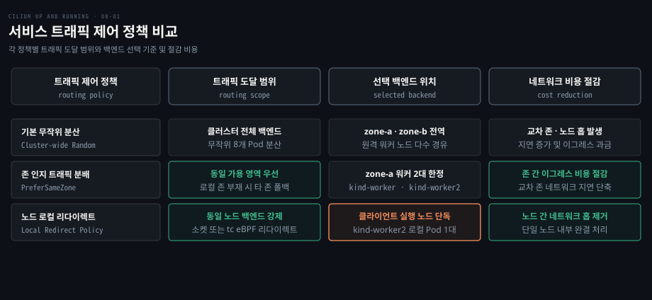
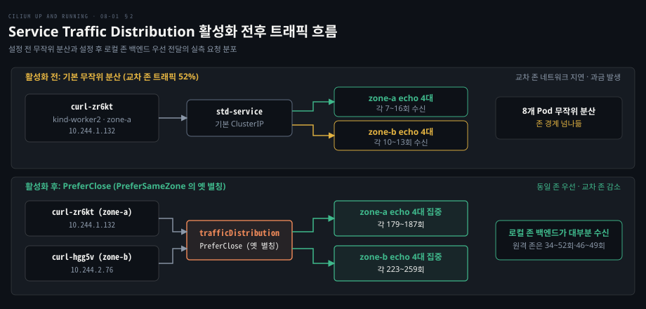
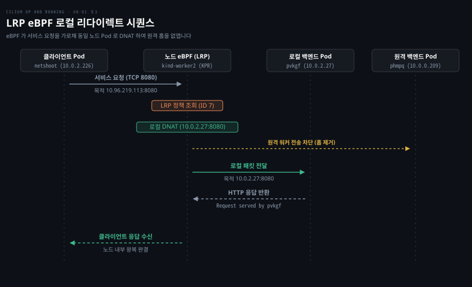
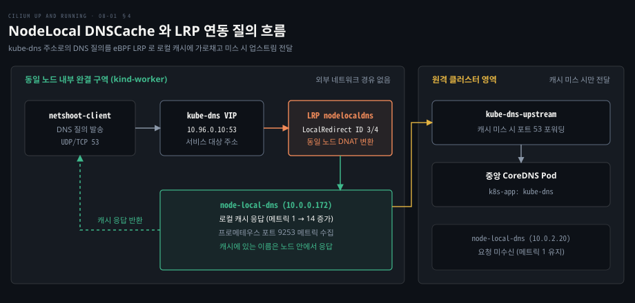

# 트래픽 분배와 로컬 리다이렉트는 서비스 트래픽을 가까운 백엔드로 보낸다

---

> 서비스 트래픽 분배는 존 내부 엔드포인트를 우선 선택하여 이그레스 비용을 아끼고 로컬 리다이렉트 정책(LRP)은 eBPF 로 노드 내부 백엔드로 직결하여 크로스 노드 홉을 없앱니다.


## 핵심 요약

> 이 편의 중심 생각은 경계를 넘나드는 네트워크 홉을 eBPF 로 차단하여 물리적 거리와 커널 처리 비용을 줄인다는 것입니다.

다중 가용 영역 환경에서 기본 분산은 존마다 백엔드 수가 같다면 요청의 약 절반이 존 경계를 넘게 만듭니다. 이는 지연과 이그레스 과금을 부릅니다. Service Traffic Distribution 은 동일 존 백엔드 Pod 를 우선 지정하여 전송 경로를 영역 내부에 가둡니다.

데몬셋처럼 모든 노드에 배포된 인스턴스라도 표준 ClusterIP 를 호출하면 원격 노드로 트래픽이 튕겨 나갈 수 있습니다. LRP(Local Redirect Policy)는 eBPF 훅을 활용하여 대상 서비스 주소를 동일 노드의 백엔드로 가로챕니다. 이를 통해 노드 간 네트워크 왕복을 완전히 지웁니다.

특히 NodeLocal DNSCache 와 LRP 를 결합하면 파드의 모든 DNS 질의가 노드 로컬 캐시로 직결됩니다. 이로써 캐시에 있는 이름은 같은 노드 안에서 답하고, 미스일 때만 `kube-dns-upstream` 을 거쳐 CoreDNS 로 갑니다.




## 학습 목표

> 이 편을 읽고 나면 다음을 설명할 수 있습니다.

1. 망 성능을 평가하는 세 가지 핵심 지표의 의미와 토폴로지 인지 트래픽 제어가 필요한 이유를 설명할 수 있습니다.
2. 쿠버네티스 Service Traffic Distribution 필드의 최신 표준 설정과 존 간 비용 절감 원리를 설명할 수 있습니다.
3. Cilium KPR 환경에서 `loadBalancer.serviceTopology` 활성화와 서비스 우선순위 규칙을 비교할 수 있습니다.
4. CiliumLocalRedirectPolicy 의 두 가지 매처 유형과 eBPF 로컬 리다이렉트의 동작 방식을 설명할 수 있습니다.
5. NodeLocal DNSCache 구성에 LRP 를 결합하여 클러스터 DNS 조회 지연과 연결 추적 병목을 해결하는 절차를 설명할 수 있습니다.


## 1. 망 성능은 처리량·지연·흔들림으로 잰다

> 네트워크 최적화는 단순히 통신 연결을 확보하는 단계를 넘어 처리량과 지연과 흔들림이라는 세 가지 핵심 지표를 기준으로 패킷이 거치는 물리적·논리적 홉을 줄이는 작업입니다.

클러스터 워크로드의 규모가 커지고 마이크로서비스 간 동서 트래픽 호출이 빈번해지면, 단순히 패킷이 목적지에 도달한다는 사실만으로는 서비스 품질을 보장하기 어렵습니다. 대규모 분산 환경에서 네트워크 계층은 세 가지 척도로 평가받습니다.

첫째는 **처리량**으로, 단위 시간당 링크를 통과하는 유효 데이터 전송량입니다.

둘째는 **지연**으로, 패킷 왕복이나 목적지 도달에 걸리는 시간입니다.

셋째는 **흔들림**으로, 패킷 지연 시간의 불규칙한 변동 폭을 뜻합니다.

커널과 전송 계층에는 망 성능을 높이기 위한 여러 기법이 있습니다. BBR 은 병목 대역폭과 왕복 지연을 측정하여 큐 팽창을 막고 전송 효율을 극대화하는 지연 기반 혼잡 제어 알고리즘입니다([BBR 혼잡 제어 상세 분석](../../../02_os/book/tii_tcp-ip-illustrated/16-04.고속%20망과%20지연%20기반%20혼잡%20제어는%20창%20증가%20규칙과%20혼잡%20신호를%20바꾼다.md)). BIG TCP 는 패킷 집약 크기를 키워 패킷당 처리 오버헤드를 낮춥니다. eBPF 호스트 라우팅은 커널 상위 스택을 우회하여 패킷을 고속 전달하며 지원 커널에서 기본 활성화됩니다.

이 편에서는 물리적·논리적 라우팅 홉을 줄이는 두 가지 최적화에 집중합니다. 영역 수준에서는 Service Traffic Distribution 을 다루고, 노드 수준에서는 Local Redirect Policy 로 노드 내부 완결 경로를 구성합니다.


## 2. 존을 넘는 트래픽은 비용과 지연을 늘린다

> 가용성을 위해 다중 가용 영역에 분산된 클러스터에서 기본 서비스 라우팅은 존 경계를 무시하고 패킷을 전송하여 클라우드 이그레스 비용과 왕복 지연을 가중시킵니다.

고가용성을 위해 다중 가용 영역(AZ)에 노드를 분산 배치해도 기본 서비스 부하 분산은 토폴로지를 인지하지 못합니다. 클라이언트가 `zone-a` 에 있어도 무작위 분산되므로, 존마다 백엔드 수가 같다면 요청의 약 절반이 존 경계를 넘습니다(예제에서는 89회 중 46회, 약 52%).

교차 존 통신은 물리적 지연을 늘리고 클라우드 존 간 데이터 전송(Inter-zone Egress) 과금을 부릅니다. 많은 클라우드가 존 간 이그레스를 과금하므로 인프라 비용이 늘어납니다.

이 문제를 해결하는 기법이 **토폴로지 인지 트래픽 엔지니어링**(Topology-aware traffic engineering)입니다. 클라이언트와 백엔드의 위치를 따져 같은 가용 영역 엔드포인트를 우선 선택합니다.

쿠버네티스는 서비스의 `spec.trafficDistribution` 필드로 이 라우팅 선호를 표현합니다. 과거의 `PreferClose` 값은 의미가 모호했습니다. `PreferSameZone` 과 `PreferSameNode` 는 v1.33 에 알파로 들어왔고 v1.34 에서 베타로 기본 활성화되면서 `PreferClose` 는 `PreferSameZone` 의 비권장 별칭이 되었습니다. v1.35 에서 GA 로 올라갔습니다([Kubernetes Service Traffic Distribution 공식 문서](https://kubernetes.io/docs/concepts/services-networking/service/#traffic-distribution), 단계별 버전은 [PreferSameTrafficDistribution 피처 게이트](https://github.com/kubernetes/website/blob/main/content/en/docs/reference/command-line-tools-reference/feature-gates/PreferSameTrafficDistribution.md)).

Cilium 에서 이 기능을 쓰려면 kube-proxy 대체가 필수이며([KPR 아키텍처 문서](./06-01.Cilium%20은%20kube-proxy%20를%20eBPF%20로%20대신하고%20외부%20서비스에%20IP%20와%20경로를%20붙인다.md)), Helm 설정에서 `loadBalancer.serviceTopology=true` 를 활성화해야 합니다([Cilium 토폴로지 설정](https://docs.cilium.io/en/v1.20/network/kubernetes/kubeproxy-free/#traffic-distribution-and-topology-aware-hints)).

예제 실습은 워커 노드 4대로 된 kind 클러스터에서 차이를 보여 줍니다. `kind-worker` 와 `kind-worker2` 는 `zone-a` 에 속하고 `kind-worker3` 과 `kind-worker4` 는 `zone-b` 에 속합니다. 8개의 echo 파드와 3개의 curl 파드를 배포한 뒤 요청 분포를 관찰합니다.

```bash
kubectl get nodes --show-labels
# kind-worker, kind-worker2: topology.kubernetes.io/zone=zone-a
# kind-worker3, kind-worker4: topology.kubernetes.io/zone=zone-b
```

기능이 비활성화된 상태에서는 `zone-a` 에 위치한 클라이언트 파드(`curl-664778b5b6-zr6kt`)의 요청이 존 구분 없이 8개 파드 전체에 7~16회씩 무작위로 흩어집니다.

```bash
kubectl logs curl-664778b5b6-zr6kt | grep "Request served by" | cut -f2 -d ':' | sort | uniq -c
# 11 Request served by echo-7f89db4f96-5h2bz
#  8 Request served by echo-7f89db4f96-5wshm
# ...
# 16 Request served by echo-7f89db4f96-q66nz
#  7 Request served by echo-7f89db4f96-xjggf
```

예제 실습은 서비스 매니페스트의 `trafficDistribution` 줄에 `PreferClose` 를 지정했고, 이 값은 `PreferSameZone` 의 비권장 별칭입니다. 그러면 결과가 달라집니다.

`curl-664778b5b6-zr6kt` 파드의 신규 요청은 같은 `zone-a` 의 4개 파드(`5wshm`: 181, `h2gv7`: 181, `q66nz`: 187, `xjggf`: 179)로 대부분 전달됩니다. `zone-b` 파드의 카운터도 10~13회에서 46~49회로 늘었는데, 누적 로그라 활성화 전 요청분이 섞였을 수 있습니다.

반대로 `zone-b` 에 위치한 `curl-664778b5b6-hgg5v` 에서 측정하면 `zone-b` 파드(`5h2bz`: 223, `99g9g`: 259, `h5zw4`: 249, `wmlkn`: 231)가 대부분을 받습니다. `zone-a` 파드는 34~52회에 그칩니다.



토폴로지 인지 기능 적용 시 세 제약이 따릅니다. 서비스의 `externalTrafficPolicy` 나 `internalTrafficPolicy` 가 `Local` 이면 이 정책이 `trafficDistribution` 보다 항상 우선합니다. 또한 로컬 존 백엔드가 없으면 타 존으로 자동 폴백됩니다. 트래픽이 특정 존에 쏠리면 해당 백엔드가 과부하되므로 고른 유입 환경에 적합합니다.


## 3. LRP 는 서비스 주소로 가는 트래픽을 같은 노드의 Pod 로 돌린다

> 모든 노드에 데몬셋 인스턴스가 상주하더라도 일반 ClusterIP 로 통신하면 패킷이 물리 네트워크를 건너 원격 노드로 전달되는 비효율이 발생합니다.

로깅이나 프록시처럼 모든 노드에 파드가 상주해도 표준 서비스 주소로 호출하면 클러스터 전역 백엔드로 분산됩니다. 이로 인해 바로 옆 파드를 두고도 패킷이 물리 네트워크를 건너 원격 노드를 왕복하는 지연이 발생합니다.

Cilium 의 **LRP**(Local Redirect Policy)는 특정 서비스로 향하는 트래픽을 eBPF 로 가로채어 동일 노드 내의 로컬 파드로 강제 리다이렉트합니다([Cilium LRP 공식 문서](https://docs.cilium.io/en/v1.20/network/kubernetes/local-redirect-policy/)). LRP 는 두 가지 매처를 지원합니다.

* **AddressMatcher**: 특정 IP:포트 튜플을 매칭합니다. 메타데이터 주소(`169.254.169.254:80`)를 로컬 캐시 파드로 가로챌 때 유용합니다.
* **ServiceMatcher**: 서비스 이름과 네임스페이스를 매칭하여 로컬 백엔드로 직결하는 표준 방식입니다.

LRP 기능을 활성화하려면 Helm 값 `localRedirectPolicies.enabled=true` 를 설정해야 합니다.

실습 환경에서 `kind-worker` 에 `echo-server-78fbb56cc7-phmpq`(`10.0.0.209`)가 실행됩니다. `kind-worker2` 에는 `echo-server-78fbb56cc7-pvkgf`(`10.0.2.27`)와 `netshoot-client`(`10.0.2.226`)가 실행 중입니다. LRP 적용 전에는 두 노드의 백엔드가 모두 등록되어 요청을 나눠 받습니다.

```bash
kubectl exec -it -n kube-system ds/cilium -- cilium-dbg service list
# 6     10.96.219.113:8080/TCP    ClusterIP      1 => 10.0.0.209:8080/TCP (active)
#                                                 2 => 10.0.2.27:8080/TCP (active)
```

이 상태에서 `CiliumLocalRedirectPolicy` 리소스를 배포합니다.

```yaml
apiVersion: "cilium.io/v2"
kind: CiliumLocalRedirectPolicy
metadata:
  name: "echo-server-lrp"
spec:
  redirectFrontend:
    serviceMatcher:
      serviceName: echo-server
      namespace: default
  redirectBackend:
    localEndpointSelector:
      matchLabels:
        app.kubernetes.io/name: echo-server
    toPorts:
      - port: "8080"
        protocol: TCP
```

정책이 등록되면 Cilium 에이전트는 기존 ClusterIP 서비스 엔트리를 `LocalRedirect` 타입의 신규 엔트리로 교체합니다. 백엔드 목록에는 해당 노드 로컬 파드만 남깁니다.

```bash
kubectl -n kube-system exec -it cilium-5d5jq -- cilium-dbg service list
# 7     10.96.219.113:8080/TCP    LocalRedirect   1 => 10.0.2.27:8080/TCP (active)
```

클라이언트 파드에서 20회 연속 호출을 수행하면, 원격 노드로의 전달이 완전히 차단되고 동일 노드의 `echo-server-78fbb56cc7-pvkgf` 파드만 단독으로 응답합니다.

```bash
for i in {1..20}; do echo -n "Req $i -> "; kubectl exec netshoot-client -- curl -s echo-server:8080 | grep "Request served by" | awk '{print $4}'; done
# Req 1 -> echo-server-78fbb56cc7-pvkgf
# Req 2 -> echo-server-78fbb56cc7-pvkgf
# ...
# Req 20 -> echo-server-78fbb56cc7-pvkgf
```



LRP 운영 시 정책 적용 이후 맺어지는 신규 연결에만 리다이렉트가 반영됩니다. 기존 원격 연결은 유지되므로 정책 배포 후 클라이언트 파드를 재시작해야 합니다. 또한 LRP 리소스는 인플레이스 수정이 불가하므로 변경 시 삭제 후 재생성해야 합니다.


## 4. 노드 로컬 DNS 캐시로 DNS 질의를 돌린다

> 파드가 대량의 DNS 질의를 중앙 CoreDNS 로 보내면 iptables DNAT 경로에서 UDP 질의가 conntrack 경합으로 버려져 재시도 지연이 생길 수 있습니다.

iptables DNAT 경로에서는 UDP 질의가 conntrack 경합(race)으로 버려져 재시도 지연이 생길 수 있습니다([NodeLocal DNSCache](https://kubernetes.io/docs/tasks/administer-cluster/nodelocaldns/)).

이 병목을 해결하는 표준 아키텍처가 **NodeLocal DNSCache** 입니다. CoreDNS 의 세부 동작은 [CoreDNS 기본 Corefile 분석](../learning-coredns/06-02.기본%20Corefile의%20줄마다%20이유가%20있다.md)과 [NetworkPolicy와 DNS](../networking-and-kubernetes/04-03.NetworkPolicy와%20DNS%20—%20클러스터%20안의%20방화벽과%20이름.md)에서 확인할 수 있습니다.

노드마다 로컬 DNS 캐시 데몬셋(`node-local-dns`)을 배치하고 파드의 질의를 LRP 로 가로채어 로컬 캐시 인스턴스로 전달합니다.

`node-local-dns.yaml` 은 ServiceAccount, `kube-dns-upstream` 서비스, Corefile 을 담은 ConfigMap, `node-local-dns` 데몬셋을 만들고, LRP 는 따로 배포합니다. 데몬셋 `node-local-dns` 는 로컬 IP(`169.254.20.10`·`10.96.0.10`)와 포트 53 및 메트릭 포트 9253 을 제공합니다. 서비스 `kube-dns-upstream` 은 캐시 미스 요청을 중앙 CoreDNS 파드로 넘깁니다. LRP 는 `kube-dns` 로 향하는 요청을 동일 노드의 로컬 캐시로 가로챕니다.

```yaml
apiVersion: "cilium.io/v2"
kind: CiliumLocalRedirectPolicy
metadata:
  name: "nodelocaldns"
  namespace: kube-system
spec:
  redirectFrontend:
    serviceMatcher:
      serviceName: kube-dns
      namespace: kube-system
  redirectBackend:
    localEndpointSelector:
      matchLabels:
        k8s-app: node-local-dns
    toPorts:
      - port: "53"
        name: dns
        protocol: UDP
      - port: "53"
        name: dns-tcp
        protocol: TCP
```

정책을 적용하면 Cilium 에이전트의 서비스 목록에서 DNS 서비스 포트가 `LocalRedirect` 로 전환됩니다.

```bash
kubectl exec -it ds/cilium -n kube-system -- cilium-dbg service list
# ID     Frontend            Service Type   Backend
# 3      10.96.0.10:53/UDP   LocalRedirect  1 => 10.244.2.46:53/UDP (active)
# 4      10.96.0.10:53/TCP   LocalRedirect  1 => 10.244.2.46:53/TCP (active)
```

이 출력의 백엔드 주소는 다른 실행에서 찍힌 값이라 아래 캐시 파드 IP 와 대역이 다릅니다.

이 DNS 예시에서는 클라이언트가 `kind-worker` 에서 실행되며, 앞의 LRP 예시에서 클라이언트가 `kind-worker2` 에 있던 것과 다릅니다.

클라이언트가 실제로 동일 노드의 캐시만 이용하는지는 프로메테우스 메트릭으로 검증할 수 있습니다. `kind-worker` 노드의 로컬 캐시 파드 IP(`10.0.0.172`)와 `kind-worker2` 노드의 원격 캐시 파드 IP(`10.0.2.20`)의 요청 카운터를 확인합니다.

```bash
# 질의 전: 로컬(10.0.0.172) 및 원격(10.0.2.20) 캐시 메트릭 각 1
kubectl exec netshoot-client -- curl -s "10.0.0.172:9253/metrics" | grep 'coredns_dns_request_count_total'
# coredns_dns_request_count_total{zone="cluster.local."} 1

# 도메인 세 개를 질의한 뒤: 로컬 캐시만 14로 급증 (원격 10.0.2.20 은 1 유지)
kubectl exec netshoot-client -- nslookup oreilly.com
kubectl exec netshoot-client -- nslookup isovalent.com
kubectl exec netshoot-client -- nslookup cilium.io
kubectl exec netshoot-client -- curl -s "10.0.0.172:9253/metrics" | grep 'coredns_dns_request_count_total'
# coredns_dns_request_count_total{zone="cluster.local."} 14
```



이로써 캐시에 있는 이름은 같은 노드 안에서 답하고, 미스일 때만 `kube-dns-upstream` 을 거쳐 CoreDNS 로 갑니다.


## 면접 대비

1. 쿠버네티스 서비스의 기본 부하 분산과 Service Traffic Distribution 의 차이점 및 비용 절감 효과는 무엇입니까?
2. `spec.trafficDistribution` 필드에서 `PreferSameZone` 과 `PreferClose` 의 관계 및 쿠버네티스 v1.34 이상에서의 권장 설정은 무엇입니까?
3. Cilium Local Redirect Policy(LRP) 가 일반 ClusterIP 서비스와 다르게 트래픽을 처리하는 eBPF 동작 원리는 무엇입니까?
4. LRP 의 두 가지 매처 유형인 `AddressMatcher` 와 `ServiceMatcher` 가 적용되는 대표적인 인프라 환경은 각각 무엇입니까?
5. NodeLocal DNSCache 구성에 Cilium LRP 를 연동했을 때 얻을 수 있는 성능 이점과 질의 처리 경로는 어떻게 구성됩니까?


## 정답 (자답 후 펼치기)

### 정답 1 — 존 간 이그레스 비용 절감과 왕복 지연 단축
기본 부하 분산은 클러스터 전체 백엔드로 트래픽을 무작위로 분산하므로, 존마다 백엔드 수가 같다면 요청의 약 절반이 존 경계를 넘습니다. 반면 Service Traffic Distribution 은 동일 가용 영역 내부의 백엔드를 우선 지정합니다. 이를 통해 클라우드 제공업체의 가용 영역 간 데이터 전송(Inter-zone Egress) 과금을 절감하고 데이터센터 간 네트워크 왕복 지연을 줄입니다.

### 정답 2 — PreferSameZone 권장과 PreferClose 비권장 별칭화
과거의 `PreferClose` 는 명칭이 모호하여, `PreferSameZone` 과 `PreferSameNode` 가 베타로 기본 활성화된 v1.34 에서 `PreferSameZone` 의 비권장 별칭이 되었습니다. 두 값은 v1.33 에 알파로 들어왔고 v1.35 에서 GA 로 올라갔습니다. 최신 쿠버네티스 환경에서는 명시적인 의미를 제공하는 `PreferSameZone` 을 사용하는 것이 표준 권장 사항입니다.

### 정답 3 — eBPF 로드밸런서(소켓 또는 tc) 가로채기와 동일 노드 로컬 강제 전달
일반 ClusterIP 서비스는 원격 노드를 포함한 모든 준비된 엔드포인트를 대상으로 패킷을 전달하므로 원격 노드 홉이 발생합니다. 반면 LRP 는 정책 적용 즉시 서비스 맵 엔트리를 `LocalRedirect` 타입으로 변경합니다. 소켓 수준 또는 tc 수준 eBPF 로드밸런서가 목적지를 동일 노드 로컬 파드로 바꾸어 노드 내부에서 통신을 완결합니다.

### 정답 4 — 메타데이터 캐시용 주소 매칭과 일반 서비스 매칭
`AddressMatcher` 는 쿠버네티스 서비스와 무관한 IP:포트 튜플을 가로챕니다. 따라서 AWS EKS 나 GCP GKE 등 퍼블릭 클라우드의 인스턴스 메타데이터 주소(`169.254.169.254:80`)를 노드 로컬 캐시 파드로 우회시킬 때 주로 쓰입니다. 반면 `ServiceMatcher` 는 서비스 이름을 기준으로 매칭하므로 NodeLocal DNSCache 나 데몬셋 로깅/모니터링 에이전트와 통신할 때 사용됩니다.

### 정답 5 — 노드 내부 DNS 캐싱 완결과 conntrack 테이블 경합 제거
기존에는 모든 파드가 원격의 중앙 CoreDNS 파드로 통신하여 iptables DNAT 경로에서 conntrack 경합으로 인한 재시도 지연이 생길 수 있었습니다. LRP 를 연동하면 `kube-dns` 주소로 보낸 질의를 eBPF 가 동일 노드의 `node-local-dns` 파드로 가로채어 로컬에서 즉시 응답합니다. 캐시 미스 시에만 `kube-dns-upstream` 서비스를 통해 중앙 CoreDNS 로 전달되므로 캐시에 있는 이름은 같은 노드 안에서 답합니다.


## 참고 자료

* Nico Vibert, Filip Nikolic, James Laverack. 2026. *Cilium: Up and Running*. O'Reilly Media. ISBN 979-8-341-62299-9.
* Cilium Documentation. "Kube-Proxy Free — Traffic Distribution and Topology Aware Hints". https://docs.cilium.io/en/v1.20/network/kubernetes/kubeproxy-free/#traffic-distribution-and-topology-aware-hints
* Cilium Documentation. "Local Redirect Policy". https://docs.cilium.io/en/v1.20/network/kubernetes/local-redirect-policy/
* Kubernetes Documentation. "Service — Traffic Distribution". https://kubernetes.io/docs/concepts/services-networking/service/#traffic-distribution
* Cilium GitHub Repository. https://github.com/cilium/cilium


## 관련 문서

* [Cilium 데이터패스](./05-01.Cilium%20데이터패스는%20같은%20노드는%20eBPF%20로%20바로%20넘기고%20다른%20노드는%20라우팅이나%20터널로%20잇는다.md)
* [Cilium KPR 과 로드밸런싱](./06-01.Cilium%20은%20kube-proxy%20를%20eBPF%20로%20대신하고%20외부%20서비스에%20IP%20와%20경로를%20붙인다.md)
* [DSR · Maglev · netkit 성능 최적화](./08-02.DSR·Maglev·netkit%20은%20응답%20경로와%20백엔드%20선택과%20Pod%20연결의%20비용을%20줄인다.md)
* [TCP 혼잡 제어와 BBR](../../../02_os/book/tii_tcp-ip-illustrated/16-04.고속%20망과%20지연%20기반%20혼잡%20제어는%20창%20증가%20규칙과%20혼잡%20신호를%20바꾼다.md)
* [CoreDNS 기본 Corefile 분석](../learning-coredns/06-02.기본%20Corefile의%20줄마다%20이유가%20있다.md)
* [NetworkPolicy 와 DNS 보안](../networking-and-kubernetes/04-03.NetworkPolicy와%20DNS%20—%20클러스터%20안의%20방화벽과%20이름.md)
