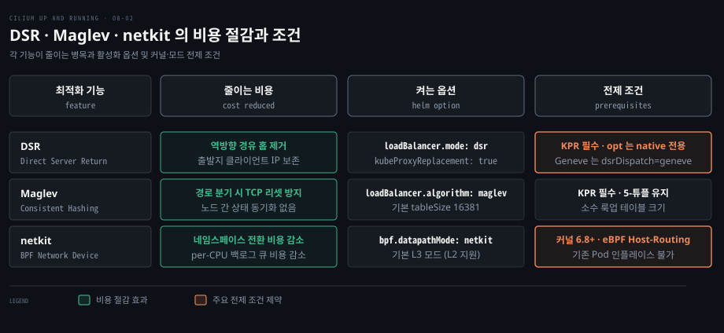
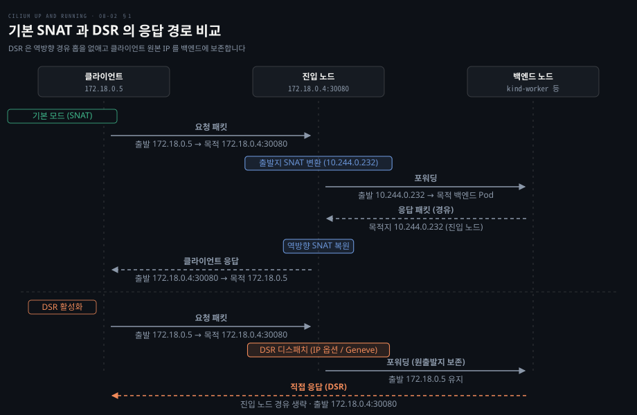
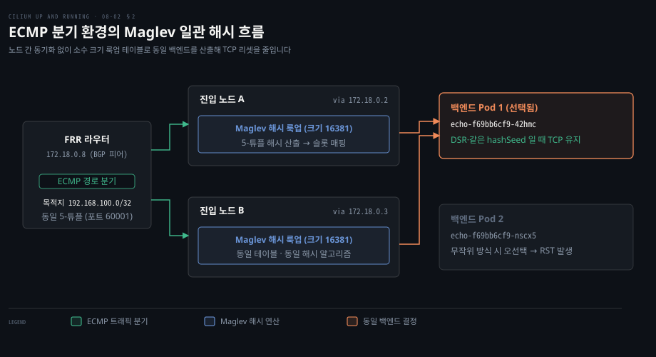
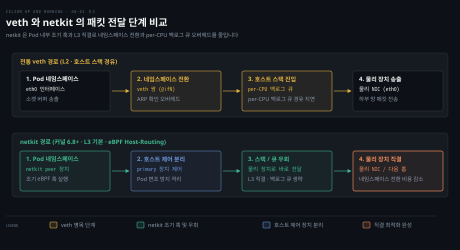

# DSR·Maglev·netkit 은 응답 경로와 백엔드 선택과 Pod 연결의 비용을 줄인다

---

> DSR 은 응답 패킷의 진입 노드 경유를 없애고 Maglev 는 ECMP 분기에서도 백엔드를 유지하며 netkit 은 Pod 와 호스트 사이 veth 전환 오버헤드를 걷어냅니다.


## 핵심 요약

> 이 편의 중심 생각은 응답 지연과 세션 단절과 인터페이스 전송 병목이라는 세 지점을 커널 eBPF 로 제거한다는 것입니다.

외부 클라이언트가 접근할 때 진입 노드가 패킷을 SNAT 하여 원격 백엔드로 넘기면 응답이 다시 진입 노드를 거쳐야 하므로 추가 홉과 부하를 만듭니다. DSR(Direct Server Return)은 백엔드가 클라이언트에게 직접 응답하도록 만들어 반환 경로의 병목을 없앱니다.

외부 라우터가 ECMP 로 다중 진입 노드에 트래픽을 분산하다가 ECMP 경로가 바뀌어 같은 연결의 패킷이 다른 진입 노드로 가면, 무작위 선택 방식이 TCP 리셋(RST)을 부릅니다. Maglev 일관 해시는 노드 간 상태 공유 없이도 동일한 5-튜플 패킷을 같은 백엔드로 보내 세션을 안정적으로 유지합니다.

Pod 와 호스트를 잇는 veth 쌍은 ARP 확인과 백로그 큐 경유로 지연을 더합니다. netkit 은 eBPF 훅을 Pod 네임스페이스 안으로 배치하고 L3 직결을 제공하여 경계 전환 비용을 덜어냅니다.




## 학습 목표

> 이 편을 읽고 나면 다음을 설명할 수 있습니다.

1. 기본 SNAT 모드와 DSR 모드의 패킷 왕복 경로 차이와 출발지 IP 보존 원리를 설명할 수 있습니다.
2. DSR 모드를 활성화하기 위한 KPR 전제 조건과 지원되는 라우팅 모드를 구분할 수 있습니다.
3. ECMP 분기 환경에서 무작위 부하 분산이 TCP 세션을 끊는 이유와 Maglev 일관 해시의 해결 방식을 설명할 수 있습니다.
4. BGP 피어링과 FRR 라우터를 연동해 고정 소스 포트 환경에서 Maglev 해시 일관성을 검증하는 절차를 설명할 수 있습니다.
5. veth 쌍의 성능 한계와 netkit 이 Pod 내부 조기 eBPF 훅 및 L3 직결로 네임스페이스 오버헤드를 줄이는 원리를 비교할 수 있습니다.


## 1. DSR 은 응답이 진입 노드를 거치지 않게 한다

> 외부 서비스 트래픽이 들어온 노드와 실제 백엔드 Pod 가 위치한 노드가 다를 때, 기본 SNAT 방식은 역방향 응답이 진입 노드를 다시 거치게 만듭니다.

외부 클라이언트가 클러스터의 NodePort 서비스로 접속할 때 요청을 처음 수신한 노드에 반드시 대상 Pod 가 실행 중이라는 보장은 없습니다. 대상 Pod 가 다른 노드에 있다면 진입 노드는 패킷을 어디로 어떻게 전달해야 할까요?

Cilium 의 기본 동작은 SNAT(Source Network Address Translation)입니다. 진입 노드는 자신의 내부 IP(`cilium_host` 의 PodCIDR 주소)로 패킷 출발지를 교체하여 백엔드로 전달합니다. 이 기본 구조는 두 가지 손실을 만듭니다.

첫째는 관측성 상실입니다. 백엔드 Pod 는 수신 패킷 출발지를 실제 클라이언트 IP 가 아니라 진입 노드 내부 IP 로 인식합니다. 감사 로그에 클라이언트 주소가 남지 않으며 정책 검사도 왜곡됩니다.

둘째는 역방향 우회 경로입니다. 백엔드가 보낸 응답 패킷은 역방향 주소 변환(Reverse SNAT)을 거쳐야 하므로 원래 진입 노드를 다시 경유합니다. 진입 노드는 자신이 처리하지도 않는 트래픽의 응답 중계로 대역폭과 CPU 를 낭비합니다.

DSR(Direct Server Return)은 이 역방향 홉을 완전히 생략합니다. 진입 노드는 클라이언트 원본 출발지 IP 를 보존한 채 요청을 백엔드 노드로 넘깁니다. 백엔드의 eBPF 프로그램은 서비스 주소를 인식한 뒤 외부 클라이언트로 곧장 응답을 보냅니다.



예시 kind 클러스터에 `echo` 어플리케이션과 NodePort 서비스(`echo-nodeport`, 80:30080)를 띄워 기본 동작을 본 결과입니다. 클라이언트 컨테이너 IP 는 `172.18.0.5` 입니다.

```bash
docker exec -it client curl 172.18.0.4:30080
# 10.244.0.232
```

클라이언트가 `kind-control-plane` 노드(`172.18.0.4:30080`)로 요청을 보냈을 때 반환된 주소는 클라이언트 IP 가 아니었습니다. 대신 진입 노드의 `cilium_host` 주소인 `10.244.0.232` 가 반환되었습니다. 진입 노드가 출발지를 변경했음이 확인됩니다.

DSR 을 켜려면 [Cilium 공식 문서 DSR 설정](https://docs.cilium.io/en/v1.20/network/kubernetes/kubeproxy-free/#direct-server-return-dsr)에 명시된 대로 `loadBalancer.mode=dsr` 을 지정하고 Kube-Proxy Replacement(KPR)가 활성화되어야 합니다.

```yaml
kubeProxyReplacement: true
routingMode: native
ipv4NativeRoutingCIDR: "172.18.0.0/16"
autoDirectNodeRoutes: true
k8sServiceHost: "kind-control-plane"
k8sServicePort: 6443
loadBalancer:
  mode: "dsr"
```

설치 후 `cilium-dbg status --verbose` 로 상태를 확인하면 KPR 과 DSR 모드가 켜진 것을 볼 수 있습니다.

```bash
KubeProxyReplacement:           True
    Mode:                DSR
      DSR Dispatch Mode: IP Option/Extension
```

동일한 요청을 보내면 백엔드가 반환하는 주소가 클라이언트 실제 IP 인 `172.18.0.5` 로 바뀝니다.

```bash
docker exec -it client curl 172.18.0.4:30080
# 172.18.0.5
```

eBPF 로드밸런서 맵에서도 서비스 엔트리가 `dsr` 로 등록됩니다.

```bash
SERVICE ADDRESS                       BACKEND ADDRESS (REVNAT_ID) (SLOT)
172.18.0.4:30080/TCP (0)             0.0.0.0:0 (7) (0) [NodePort, dsr]
```

DSR 전제 조건을 확인해야 합니다. 백엔드는 자신이 어떤 서비스 주소로 응답해야 하는지 알아야 합니다. Cilium 은 IPv4 옵션·IPv6 확장 헤더(`opt`)나 Geneve 옵션(`geneve`)에 서비스 IP·포트를 실어 보냅니다. v1.20 에는 IPIP 로 감싸는 `ipip` dispatch 도 있습니다([공식 문서](https://docs.cilium.io/en/v1.20/network/kubernetes/kubeproxy-free/#direct-server-return-dsr)).

기본 dispatch 인 IP 옵션(`loadBalancer.dsrDispatch=opt`)은 네이티브 라우팅에서만 동작합니다. Geneve 터널에서 DSR 을 쓰려면 `loadBalancer.dsrDispatch=geneve` 를 함께 지정해야 하고, VXLAN 터널에서는 어느 dispatch 도 지원되지 않습니다([공식 문서](https://docs.cilium.io/en/v1.20/network/kubernetes/kubeproxy-free/#direct-server-return-dsr)). Geneve 메커니즘은 [Cilium 데이터패스](./05-01.Cilium%20데이터패스는%20같은%20노드는%20eBPF%20로%20바로%20넘기고%20다른%20노드는%20라우팅이나%20터널로%20잇는다.md)에서 다루었습니다.

`externalTrafficPolicy: Local` 정책은 백엔드가 있는 노드로만 트래픽을 보내 출발지 IP 를 지키므로 백엔드가 없는 노드로 들어온 패킷은 버려집니다. 반면 `loadBalancer.mode=dsr` 로 켠 DSR 은 클러스터 전체 서비스에 적용됩니다. v1.20 은 `bpf.lbModeAnnotation=true` 를 켜면 서비스별 DSR 도 고를 수 있습니다.

서비스에 `service.cilium.io/forwarding-mode: dsr` 어노테이션을 답니다. `loadBalancer.dsrDispatch` 도 명시해야 합니다([공식 문서](https://docs.cilium.io/en/v1.20/network/kubernetes/kubeproxy-free/#annotation-based-dsr-and-snat-mode)). 백엔드가 없는 노드로 외부 요청이 들어와도 출발지 IP 를 유지한 채 백엔드로 전달하여 직접 응답을 끌어냅니다.

하드웨어 드라이버 수준에서 지연을 줄이려면 XDP 가속(`loadBalancer.acceleration=native`)을 함께 고려할 수 있습니다. 관련 계층 구조는 [네트워크 — 아키텍처](../../../02_os/book/systems-performance/10-02.네트워크%20—%20아키텍처.md)에서 확인할 수 있습니다.


## 2. Maglev 는 진입 노드가 바뀌어도 같은 백엔드를 고른다

> 외부 BGP 라우터가 ECMP 로 다중 진입 노드에 트래픽을 분산할 때, 노드 간 세션 정보가 없으면 동일한 TCP 연결 패킷이 다른 백엔드로 튀어 연결이 끊깁니다.

대규모 망에서는 외부 라우터가 BGP 로 클러스터 노드들과 경로를 맺고 ECMP(Equal-Cost Multi-Path)로 인바운드 트래픽을 분산합니다. ECMP 패킷 분기 원리는 [라우터는 안에서 무엇을 하는가](../../../02_os/book/cntd_computer-networking-top-down/04-01.라우터는%20안에서%20무엇을%20하는가.md)에서 살펴볼 수 있습니다. 그런데 노드 장애나 라우터 해시 변화로 후속 패킷이 다른 진입 노드로 유입되면 어떤 일이 벌어질까요?

Cilium 의 기본 백엔드 선택은 무작위(`Backend Selection: Random`)입니다. 클라이언트가 Node-1 을 통해 백엔드 Pod A 와 TCP 연결을 맺고 통신하던 중 경로가 Node-2 로 바뀌면, Node-2 는 이전 상태를 모른 채 무작위로 백엔드 Pod B 를 고릅니다.

백엔드 Pod B 는 이 연결의 핸드셰이크를 본 적이 없어 맞는 소켓이 없으므로, 패킷을 잘못된 것으로 보고 TCP RST(Reset)를 회신해 연결을 즉시 강제 종료합니다. 연결 지향 프로토콜에서 무작위 선택은 경로 변동 시 연결 실패를 만듭니다.

Maglev 일관 해시는 이 문제를 해결합니다. 패킷 5-튜플(출발지 IP·포트, 목적지 IP·포트, 프로토콜)을 해시 키로 삼아 고정 크기 룩업 테이블에서 백엔드를 고릅니다.

모든 진입 노드가 상태 동기화 통신 없이도 동일한 5-튜플에 대해 같은 백엔드를 산출합니다. Node-1 장애로 패킷이 Node-2 로 유입되어도 동일한 백엔드 Pod A 가 결정되므로 TCP 연결이 끊기지 않습니다. 단 DSR 과 함께 쓰고 모든 노드가 같은 `maglev.hashSeed` 를 쓸 때입니다.



Maglev 와 BGP 및 DSR 을 연동한 검증 예시입니다. `kind-worker3`·`kind-worker4` 는 바깥 라우터와 BGP 를 맺는 워커 노드이고 `kind-worker` 와 `kind-worker2` 는 에코 백엔드를 실행합니다. Maglev 도 KPR 이 켜져 있어야 동작합니다. Helm 설정은 다음과 같습니다.

```yaml
kubeProxyReplacement: true
loadBalancer:
  mode: "dsr"
  algorithm: "maglev"
bgpControlPlane:
  enabled: true
```

`cilium-dbg status --verbose` 로 확인하면 Maglev 가 활성화되어 있고 룩업 테이블 크기가 소수인 16381 로 지정됩니다.

```bash
KubeProxyReplacement Details:
[...]
  Backend Selection:               Maglev (Table Size: 16381)
```

[Cilium 공식 문서 Maglev 설정](https://docs.cilium.io/en/v1.20/network/kubernetes/kubeproxy-free/#maglev-consistent-hashing)은 `maglev.tableSize`(M)가 소수여야 한다고만 적습니다.

Maglev 논문에서 소수를 쓰는 이유는 각 백엔드의 선호 순열이 테이블의 모든 슬롯을 빠짐없이 돌게 하려는 것입니다. 기본값은 16381 이고, Helm 으로는 251 부터 131071 까지 정해진 소수 열 개 중에서만 고를 수 있습니다.

M 이 백엔드 수의 100배보다 크면 백엔드가 바뀔 때 무관한 백엔드의 재할당 차이가 최대 1% 로 묶이며, 기본값 16381 은 서비스당 약 160 개 백엔드까지 이 성질을 지킵니다. 모든 노드가 같은 `maglev.hashSeed` 를 써야 합니다.

FRR 라우터(`172.18.0.8`)에서 BGP 피어링과 경로표를 확인하면 서비스 IP(`192.168.100.0/32`)가 두 노드로 ECMP 분기된 것을 볼 수 있습니다. 두 next-hop 은 BGP 스피커 역할의 워커 노드입니다.

```bash
75ea0285c9ea# show ip route bgp
B>* 192.168.100.0/32 [20/0] via 172.18.0.2, eth0, weight 1, 00:01:34
  *                                 via 172.18.0.3, eth0, weight 1, 00:01:34
```

FRR 라우터에서 요청을 보내면 한 파드가 응답합니다. 소스 포트가 매번 바뀌어 두 파드가 번갈아 응답하므로, `curl --local-port 6000` 으로 포트를 고정해 다시 보내면 같은 파드가 응답합니다.

```bash
curl http://192.168.100.0:8080
# Request served by echo-f69bb6cf9-4sm72
```

10개의 연속된 고정 소스 포트(60001~60010)로 요청을 전송한 일관성 검증 결과입니다.

```bash
Testing Maglev consistency:
Format: SourcePort -> Backend

Port 60001 -> echo-f69bb6cf9-42hmc
Port 60002 -> echo-f69bb6cf9-42hmc
Port 60003 -> echo-f69bb6cf9-nscx5
Port 60004 -> echo-f69bb6cf9-nscx5
Port 60005 -> echo-f69bb6cf9-nscx5
Port 60006 -> echo-f69bb6cf9-nscx5
Port 60007 -> echo-f69bb6cf9-42hmc
Port 60008 -> echo-f69bb6cf9-42hmc
Port 60009 -> echo-f69bb6cf9-42hmc
Port 60010 -> echo-f69bb6cf9-nscx5
```

시간이 지난 후 다시 실행해도 포트별 백엔드 결과가 일치합니다. 테스트를 너무 빠르게 재실행하면 소켓이 TIME_WAIT 에 머물러 `errno 98: Address in use` 오류가 발생하므로 대기가 필요합니다.


## 3. netkit 은 veth 의 네임스페이스 전환 비용을 줄인다

> 컨테이너 네트워크의 표준 장치였던 veth 쌍은 계층 2 ARP 오버헤드와 호스트 백로그 큐 경유로 인해 전송 병목을 일으킵니다.

대부분의 CNI 는 Pod 를 veth 쌍으로 노드에 붙입니다. veth 는 리눅스 커널 2.6.24 에서 들어온, 15년이 넘은 기술입니다. Pod 내부의 `eth0` 은 호스트 피어 장치(`@ifN`)와 연결되어 패킷을 주고받습니다.

veth 아키텍처는 고부하 환경에서 뚜렷한 한계를 보입니다. 첫째는 계층 2 오버헤드입니다. veth 는 이더넷 장치를 흉내 내므로 직접 연결된 피어로 패킷을 보낼 때도 ARP 확인 절차를 거칩니다. 둘째는 네임스페이스 전환 비용입니다. 패킷이 호스트로 넘어갈 때 커널 스택의 여러 단계를 밟으며 CPU 별 백로그 큐(`per-CPU backlog queue`)를 거치므로 지연이 증가합니다.

netkit 은 리눅스 커널 6.7 에서 도입된 BPF 프로그래머블 네트워크 디바이스입니다. 핵심은 eBPF 훅 포인트를 Pod 네트워크 네임스페이스 내부로 직접 전진 배치하는 것입니다.

Pod 내부에서 패킷이 생성되는 즉시 eBPF 가 조기에 라우팅을 결정하고, 나가는 트래픽은 물리 장치로 바로 넘겨 per-CPU 백로그 큐 같은 호스트 스택 일부를 건너뜁니다.



netkit 은 호스트의 primary 장치와 Pod 의 peer 장치 쌍으로 생성됩니다. BPF 프로그램 관리는 호스트의 primary 장치만 전담하므로 Pod 내부 프로세스가 BPF 를 임의 변조하지 못합니다.

또한 netkit 은 기본으로 L3 모드로 동작해 다음 홉을 ARP 로 찾을 필요가 없으므로 ARP 처리가 없어집니다. 필요 시 L2 모드로 전환할 수도 있습니다. 바이트댄스 실운영 연구에 따르면 netkit 도입 후 처리량이 10% 개선되었습니다.

리눅스 커널 6.7 에 드라이버가 포함되었습니다. 다만 [Cilium v1.20 공식 성능 튜닝 가이드](https://docs.cilium.io/en/v1.20/operations/performance/tuning/#netkit-configuration) 기준으로 netkit 장치 모드를 사용하려면 커널 6.8 이상과 eBPF 호스트 라우팅이 필수이며, `cilium status` 의 Host Routing 항목이 BPF 로 보여야 합니다. v1.20 기준 netkit 은 베타 기능입니다.

```yaml
routingMode: native
bpf:
  datapathMode: netkit
  masquerade: true
kubeProxyReplacement: true
```

Cilium 은 `bpf.datapathMode` 로 `veth`, `netkit`, `netkit-l2`, `auto` 모드를 제공합니다. netkit 활성화 시 비-netkit 장치 연결에도 `tcx` 훅과 BPF 링크가 쓰입니다.

기존 veth 로 실행 중인 Pod 가 있는 클러스터에서는 인플레이스 교체가 불가능하므로 노드를 드레인하고 순차 전환해야 합니다. 기본 데이터패스 원리는 [Cilium 데이터패스](./05-01.Cilium%20데이터패스는%20같은%20노드는%20eBPF%20로%20바로%20넘기고%20다른%20노드는%20라우팅이나%20터널로%20잇는다.md)를 참고하시기 바랍니다.


## 4. 정리

> 세 가지 최적화 기능은 부하 특성과 네트워크 인프라 요구에 맞춰 선별적으로 활성화합니다.

DSR 은 응답 본문이 커서 진입 노드의 대역폭 병목을 줄여야 하거나 클라이언트 원본 IP 보존이 필수적인 환경에서 활성화합니다. 이때 KPR 과 네이티브 라우팅(Geneve 터널은 `dsrDispatch=geneve` 지정)이 전제됩니다. Maglev 는 외부 BGP 라우터와 ECMP 로 트래픽을 분산할 때 DSR 과 함께 써서 경로가 바뀌어도 같은 백엔드가 같은 연결을 이어받게 해야 하는 환경에서 켭니다. netkit 은 최신 리눅스 커널(6.8 이상)에서 네임스페이스 전환 및 백로그 큐 지연을 줄여 초저지연 통신을 확보하고자 할 때 베타임을 감안해 도입합니다.


## 면접 대비

> DSR, Maglev, netkit 의 메커니즘과 운영 최적화에 관한 면접 질문입니다.

1. 쿠버네티스 기본 NodePort 통신에서 발생하는 두 가지 문제점과 Cilium DSR 이 이를 해결하는 방식을 설명해 보십시오.
2. DSR 모드를 활성화할 때 필수적인 전제 조건과 지원되지 않는 라우팅 캡슐화 모드는 무엇입니까?
3. ECMP 환경에서 무작위 부하 분산이 TCP 연결 끊김을 유발하는 이유와 Maglev 일관 해시가 이를 해결하는 원리를 비교해 보십시오.
4. Maglev 알고리즘에서 룩업 테이블 크기를 16381 과 같은 소수로 지정해야 하는 이유와 백엔드 변경 시의 이점은 무엇입니까?
5. 전통적인 veth 쌍과 비교하여 netkit 이 네임스페이스 전환 오버헤드와 지연 시간을 줄이는 커널 레벨 메커니즘을 설명해 보십시오.


## 정답 (자답 후 펼치기)

> 면접 질문에 대한 키워드 중심의 모범 답안입니다.

### 정답 1 — SNAT 역방향 경유 홉 제거와 출발지 IP 보존

기본 NodePort 는 진입 노드가 SNAT 포워딩하므로 백엔드가 클라이언트 IP 를 보지 못해 감사와 정책이 제한되고, 응답이 다시 진입 노드로 되돌아오는 역방향 홉 병목이 생깁니다. DSR 은 진입 노드가 출발지 IP 를 유지해 전달하고 백엔드가 서비스 주소를 출발지로 삼아 클라이언트에게 직접 응답 패킷을 보내 지연과 홉을 제거합니다.

### 정답 2 — KPR 필수, 네이티브 라우팅 및 Geneve 지원, VXLAN 미지원

DSR 은 Kube-Proxy Replacement 가 필수입니다.

백엔드가 서비스 주소를 식별할 수 있도록 패킷 헤더(IP 옵션 또는 Geneve 옵션)에 서비스 정보를 인코딩합니다.

기본 dispatch(`opt`)는 네이티브 라우팅에서만 동작합니다. Geneve 터널에서는 `loadBalancer.dsrDispatch=geneve` 를 함께 지정해야 하고, VXLAN 터널에서는 지원되지 않습니다.

### 정답 3 — 5-튜플 기반 무상태 결정과 TCP RST 방지

ECMP 경로 변경으로 패킷이 다른 진입 노드로 유입될 때, 무작위 부하 분산은 기존 세션을 모르는 새 백엔드를 골라 TCP RST 를 일으킵니다. Maglev 는 5-튜플을 기반으로 고정 크기 테이블에서 백엔드를 해싱하므로, 노드 간 동기화 없이도 모든 진입 노드가 동일한 백엔드를 선택해 세션 단절을 방지합니다.

### 정답 4 — 순열이 테이블 전체를 덮는 소수 크기, 최대 1% 변동률

소수 크기여야 백엔드마다 만든 순열이 테이블 전체를 덮어 슬롯이 고르게 채워집니다. M 이 백엔드 수의 100배보다 크면 백엔드가 바뀔 때 무관한 백엔드의 재할당 차이가 최대 1% 로 묶여 서비스 중단을 줄입니다.

### 정답 5 — Pod 내부 조기 eBPF 훅, L3 직결, 백로그 큐 우회

veth 는 L2 ARP 오버헤드와 호스트 per-CPU 백로그 큐를 거치며 지연을 유발합니다. netkit 은 Pod 네임스페이스 내부 peer 장치에 eBPF 훅을 배치해 조기에 라우팅을 결정하고, L3 직결로 ARP 를 없애며 나가는 트래픽을 물리 장치로 바로 넘겨 백로그 큐 같은 호스트 스택 일부를 건너뜁니다. BPF 관리는 호스트 primary 장치가 독점합니다.


## 참고 자료

- Nico Vibert · Filip Nikolic · James Laverack, 《Cilium: Up and Running》, O'Reilly, 2026. ISBN 979-8-341-62299-9, Chapter 8.
- Cilium 공식 문서 DSR: https://docs.cilium.io/en/v1.20/network/kubernetes/kubeproxy-free/#direct-server-return-dsr
- Cilium 공식 문서 Maglev Consistent Hashing: https://docs.cilium.io/en/v1.20/network/kubernetes/kubeproxy-free/#maglev-consistent-hashing
- Cilium 공식 문서 Netkit Tuning: https://docs.cilium.io/en/v1.20/operations/performance/tuning/#netkit-configuration
- Jonathan Corbet, "The BPF-Programmable Network Device", LWN.net (2023).
- Daniel E. Eisenbud et al., "Maglev: A Fast and Reliable Software Network Load Balancer", Google Inc. (2016).
- Cilium v1.20.2 소스 및 릴리스: https://github.com/cilium/cilium/tree/v1.20.2


## 관련 문서

- [Cilium Up and Running — 정독 인덱스](./README.md)
- [Cilium 데이터패스는 같은 노드는 eBPF 로 바로 넘기고 다른 노드는 라우팅이나 터널로 잇는다](./05-01.Cilium%20데이터패스는%20같은%20노드는%20eBPF%20로%20바로%20넘기고%20다른%20노드는%20라우팅이나%20터널로%20잇는다.md)
- [Cilium 은 kube-proxy 를 eBPF 로 대신하고 외부 서비스에 IP 와 경로를 붙인다](./06-01.Cilium%20은%20kube-proxy%20를%20eBPF%20로%20대신하고%20외부%20서비스에%20IP%20와%20경로를%20붙인다.md)
- [트래픽 분배와 로컬 리다이렉트는 서비스 트래픽을 가까운 백엔드로 보낸다](./08-01.트래픽%20분배와%20로컬%20리다이렉트는%20서비스%20트래픽을%20가까운%20백엔드로%20보낸다.md)
- [라우터는 안에서 무엇을 하는가](../../../02_os/book/cntd_computer-networking-top-down/04-01.라우터는%20안에서%20무엇을%20하는가.md)
- [네트워크 — 아키텍처](../../../02_os/book/systems-performance/10-02.네트워크%20—%20아키텍처.md)
