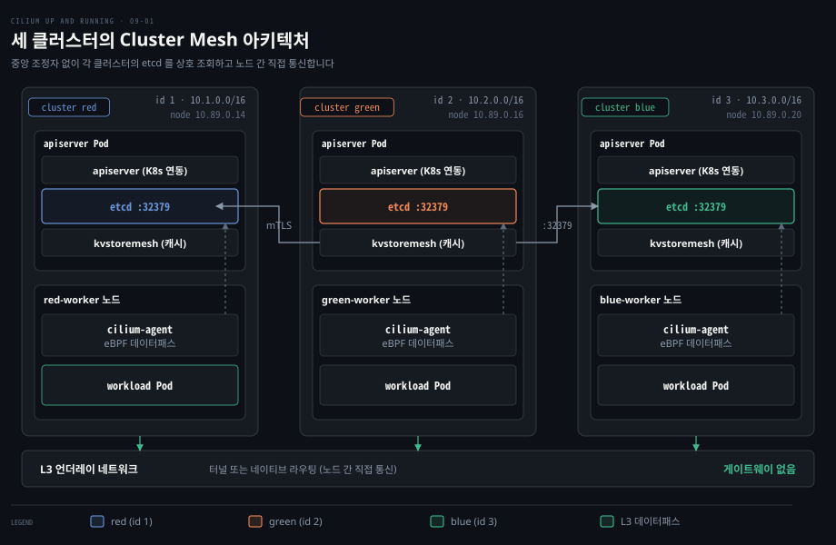
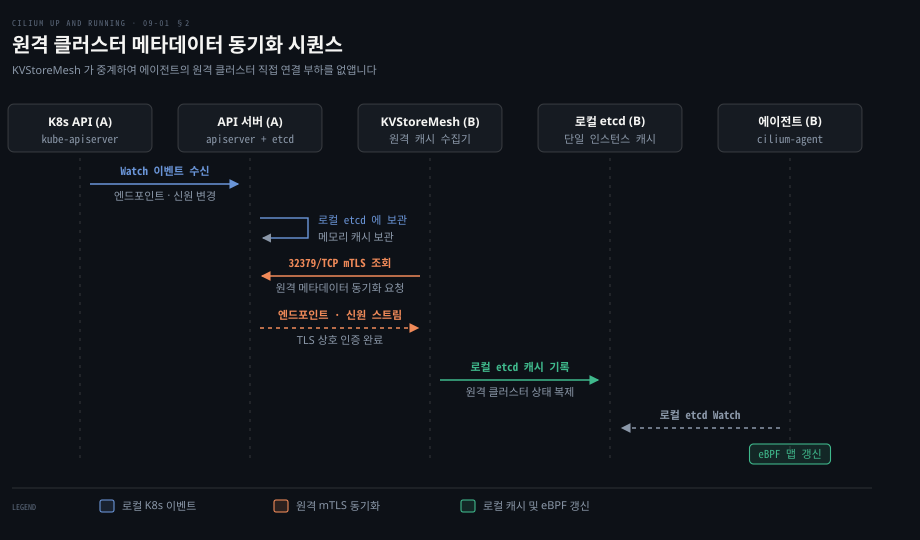
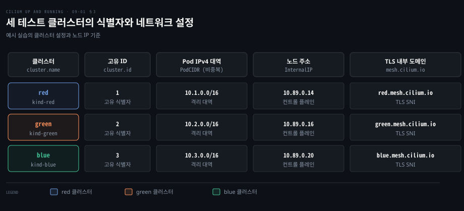
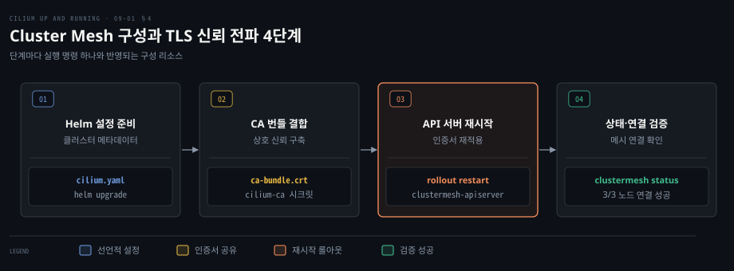

# Cluster Mesh 는 클러스터마다 API 서버를 두고 서로의 상태를 읽어 하나의 망을 만든다

---

> 각 클러스터의 전용 API 서버가 엔드포인트와 신원 정보를 내보내고 상대 클러스터가 이를 읽어 캐시함으로써, 중앙 제어부 없이 단일 평면의 네트워크와 보안 정책을 구축합니다.


## 핵심 요약

> 이 편의 중심 생각은 클러스터 경계를 넘어선 메타데이터 교환과 실제 패킷 전달 경로를 완전히 분리하여 단일 실패점 없는 멀티클러스터 망을 만든다는 것입니다.

단일 쿠버네티스 클러스터를 벗어나면 파드의 신원과 서비스 발견이 단절됩니다. 외부 DNS 나 로드밸런서 장비로 이를 우회하려 하면 DNS TTL 지연이나 장기 연결 세션의 장애 조치 불가 같은 한계가 발생합니다.

**Cilium Cluster Mesh** 는 각 클러스터에 경량 제어 평면인 `clustermesh-apiserver` 와 임베디드 etcd 를 배포하여 이 문제를 해결합니다. 클러스터 간에는 메타데이터만 상호 복제되며 실제 애플리케이션 데이터패스는 제어 평면을 거치지 않고 하부 L3 네트워크를 통해 노드 간에 직접 전달됩니다.

비중복 PodCIDR 과 고유한 `cluster.id` 를 지정하고 공통 CA 번들로 TLS 상호 신뢰를 구성하면, 분리된 세 클러스터가 마치 하나의 네트워크처럼 동작합니다.




## 학습 목표

> 이 편을 읽고 나면 다음을 설명할 수 있습니다.

1. 단일 클러스터를 넘어설 때 서비스 발견과 네트워크 정책이 끊기는 이유와 전통적 대안의 한계를 비교할 수 있습니다.
2. Cluster Mesh 가 중앙 조정자 없이 각 클러스터의 `clustermesh-apiserver` 와 `KVStoreMesh` 로 메타데이터를 전파하는 원리를 설명할 수 있습니다.
3. 제어 평면의 메타데이터 교환과 하부 L3 언더레이 데이터패스의 분리 구조를 구분할 수 있습니다.
4. 메시를 구성할 때 클러스터 이름·고유 숫자 ID·Pod 대역이 겹치지 않아야 하는 이유를 신원과 라우팅 관점에서 설명할 수 있습니다.
5. Helm 선언적 설정과 공통 CA 번들 공유를 통해 클러스터 간 TLS 상호 신뢰를 구성하고 연결 상태를 검증할 수 있습니다.


## 1. 클러스터를 여럿 두면 서비스 발견과 정책이 끊긴다

> 조직 규모 확장과 장애 격리를 위해 여러 클러스터를 운영하면 기본 CNI 의 파드 신원과 서비스 디스커버리가 클러스터 경계에 갇혀 끊어집니다.

단일 클러스터로는 조직 단위별 독립 관리, 재해 복구, 10,000 노드 한계 극복, 멀티 클라우드 규제 준수를 모두 만족하기 어렵습니다.

그러나 클러스터를 분리하면 네트워크 관리가 복잡해집니다. Cilium 의 보안 신원과 정책 엔진은 단일 클러스터 문맥에서만 유효하므로, 다른 클러스터 파드 라벨을 참조하는 네트워크 정책이 동작하지 않고 Hubble 가시성도 내부에 갇힙니다.

### 전통적인 연결 방식이 남기는 세 가지 결함

원격 클러스터를 외부 엔드포인트로 취급하여 Ingress 나 Gateway API, LoadBalancer 서비스로 노출하는 방식은 규모가 커질수록 관리 한계에 부딪힙니다.

첫째, BGP 와 ExternalDNS 를 결합한 클라이언트 기반 부하분산은 다중 IP 주소 처리에 취약합니다. 클라이언트는 단일 IP 를 가정하는 경우가 많아 첫 번째 IP 만 선택하고 장애 조치를 수행하지 못하기도 합니다.

둘째, 트래픽 제어의 유연성이 떨어집니다. 유지보수를 위해 서비스를 제외하려면 DNS TTL 만료를 기다려야 합니다. 특히 웹소켓처럼 지속되는 장기 TCP 연결은 DNS 를 다시 조회하지 않아 무중단 장애 조치가 불가능합니다.

셋째, 외부 하드웨어 로드밸런서는 클러스터 내부 파드 상태를 알지 못합니다. 모든 백엔드를 외부 노출형 서비스로 만들어야 하며 IP 와 도메인 매핑을 클러스터 외부에서 수동 관리해야 합니다.

| 평가 항목 | BGP + 외부 DNS | 외부 로드밸런서 어플라이언스 | Cilium Cluster Mesh |
| :--- | :--- | :--- | :--- |
| **서비스 발견 방식** | 외부 DNS 서버 조회 | 외부 IP 고정 매핑 | 내부 표준 코어 DNS (`<svc>.<ns>.svc`) |
| **장기 연결 장애 조치** | 불가 (TTL 및 세션 고정 한계) | — | 새 연결은 로컬 장애 시 원격 백엔드로 투명 전환 |
| **파드 신원 보안 정책** | 불가 (IP 대역 수동 지정) | — | 라벨 기반 신원 정책 클러스터 간 유지 |
| **하부 망 전제 조건** | BGP 패브릭 및 ExternalDNS | 외부 전용 장비 및 BGP 패브릭 | 노드 간 L3 IP 도달성 (터널 또는 라우팅) |

Cluster Mesh 는 애플리케이션 코드를 수정하지 않고도 클러스터 내부 표준 DNS 형식으로 원격 백엔드를 투명하게 호출할 수 있게 만듭니다.


## 2. 각 클러스터의 API 서버가 상태를 내보내고 상대가 읽는다

> 중앙 조정 클러스터에 의존하면 해당 지점이 전체 망의 단일 실패점이 되므로, Cluster Mesh 는 클러스터마다 독립 API 서버를 두고 상호 복제하는 탈중앙 구조를 채택합니다.

Cluster Mesh 는 중앙 마스터 제어부가 없습니다. 모든 클러스터는 대등하게 서로의 경로를 직접 인식하며 통신합니다. 일부 클러스터 간 연결이 끊겨도 연결된 그룹끼리는 합의 중단 없이 정상 작동합니다.

### clustermesh-apiserver 와 내부 세 컴포넌트

각 클러스터의 제어 평면은 `kube-system` 네임스페이스의 **clustermesh-apiserver** 파드가 담당합니다. 이 파드 안에는 세 가지 컴포넌트가 함께 동작합니다([공식 문서 아키텍처](https://docs.cilium.io/en/v1.20/network/clustermesh/intro/)).

1. **apiserver**: 로컬 쿠버네티스 API 서버를 감시하여 엔드포인트와 신원 변경 사항을 로컬 etcd 에 기록합니다.
2. **etcd**: Cilium 전용 임베디드 저장소입니다. 쿠버네티스 시스템 etcd 와 분리되어 메모리 단일 인스턴스로 구동됩니다. 재시작 시 로컬 API 로부터 상태를 즉시 재구축하므로 복제 구성이 필요 없습니다. 이 etcd 가 NodePort 32379 포트를 통해 원격에 공개됩니다.
3. **KVStoreMesh**: 원격 클러스터들의 etcd 에 mTLS 로 접속하여 메타데이터를 수집하고 이를 로컬 etcd 에 캐시합니다.

과거에는 각 노드의 에이전트가 모든 원격 etcd 에 직접 접속하여 $N \times M$ 연결 폭증이 발생했습니다. Cilium v1.20 에서는 `clustermesh.apiserver.kvstoremesh.enabled: true` 가 [공식 기본값](https://github.com/cilium/cilium/blob/v1.20.2/install/kubernetes/cilium/values.yaml)으로 켜져 있어 로컬 에이전트는 로컬 etcd 만 감시합니다.



### 데이터패스와 제어 평면의 엄격한 분리

애플리케이션 데이터 패킷은 `clustermesh-apiserver` 를 거치지 않습니다. Cluster Mesh 는 제어 평면의 메타데이터 교환과 실제 패킷 포워딩을 엄격하게 분리합니다.

하부 네트워크는 오버레이 터널 모드의 노드 간 L3 도달성 또는 네이티브 라우팅 모드의 파드 간 L3 도달성만 요구합니다. 상세 라우팅과 캡슐화는 [Cilium 데이터패스](./05-01.Cilium%20데이터패스는%20같은%20노드는%20eBPF%20로%20바로%20넘기고%20다른%20노드는%20라우팅이나%20터널로%20잇는다.md)의 원리를 따릅니다.

파드가 글로벌 서비스를 호출하면 로컬 `cilium-agent` 가 동기화된 엔드포인트를 바탕으로 eBPF 맵을 참조하여 목적지 ClusterIP 를 원격 파드 IP 로 번역(DNAT)해 직접 전송합니다. Kube-proxy 대체(KPR)가 켜진 클러스터는 NodePort 및 LoadBalancer 서비스도 멀티클러스터 백엔드로 분산되며 KPR 미적용 클러스터는 ClusterIP 서비스만 원격 분산됩니다.


## 3. 클러스터마다 이름·ID·Pod 대역이 겹치면 안 된다

> 서로 다른 클러스터의 파드가 하나의 가상 망에서 직접 통신하려면 네트워크 주소 공간과 보안 신원의 고유성이 먼저 확보되어야 합니다.

Cluster Mesh 구성 전 클러스터 환경은 다음 조건을 만족해야 합니다.

1. 모든 클러스터에 Cilium CNI 가 설치되어 있어야 합니다.
2. 모든 클러스터가 동일한 라우팅 모드(터널 또는 네이티브 라우팅)를 사용해야 합니다.
3. 클러스터 간 **PodCIDR** 대역이 절대 중복되어서는 안 됩니다.
4. 모든 노드(네이티브 라우팅인 경우 파드 포함) 간에 L3 패킷 도달성이 확보되어야 합니다.
5. 최대 연결 클러스터 수 설정(`maxConnectedClusters`)이 255 또는 511 중 동일한 값이어야 합니다.

대역이 겹치면 패킷의 목적지를 가릴 수 없습니다. IPAM 할당 방식은 [Cilium IPAM 모드](./04-01.Cilium%20IPAM%20모드는%20Pod%20대역을%20누가%20나눠%20주는지로%20갈린다.md)를 참고할 수 있습니다.

### cluster.id 와 보안 신원의 비트 공간

`cluster.id` 는 기본(최대 255 클러스터) 설정에서 1 부터 255 사이의 고유 정수여야 합니다. Cilium 은 원격 파드의 보안 신원을 등록할 때 상위 비트에 `cluster.id` 를 인코딩해 신원 충돌을 방지합니다.

`cluster.name` 은 고유 이름으로 `<cluster-name>.<domain>` 도메인을 구성하며, 기본 도메인은 `mesh.cilium.io`(`clustermesh.config.domain`)입니다.



### 세 테스트 클러스터의 환경 준비

실습의 세 테스트 클러스터는 `red`, `green`, `blue` 로 명명되며 `kind.yaml` 구성을 통해 배포됩니다.

```bash
for cluster in red green blue; do
  kind create cluster --config kind.yaml --name "$cluster"
done
```

배포 후 각 클러스터 컨트롤 플레인 노드의 내부 IP 주소를 확인합니다.

```bash
for cluster in red green blue; do
  echo "$cluster: $(kubectl --context "kind-$cluster" get node "$cluster-control-plane" \
    -ojsonpath='{.status.addresses[?(@.type=="InternalIP")].address}')"
done
# 출력: red: 10.89.0.14, green: 10.89.0.16, blue: 10.89.0.20
```

확인된 세 노드 IP 는 `clustermesh-apiserver` 의 통신 엔드포인트로 등록됩니다.


## 4. 공통 CA 로 서로를 믿게 한 뒤 연결한다

> 각 클러스터가 자체 생성한 독립된 인증 기관을 사용하면 원격 API 서버와의 TLS 핸드셰이크 단계에서 검증 실패가 발생하여 메시가 성립되지 않습니다.

선언적 Helm 설정 템플릿(`cilium.template.yaml`)을 작성합니다. 앞 절의 노드 IP 스크립트가 이 템플릿으로 `cilium.yaml` 을 만들고, 아래 `helm` 은 그 파일을 씁니다. 클러스터 ID 는 템플릿이 아니라 `helm` 의 `--set cluster.id` 로 넣습니다.

```yaml
clustermesh:
  useAPIServer: true
  config:
    enabled: true
    clusters:
      - name: red
        port: 32379
        id: 1
        ips:
          - 10.89.0.14
      - name: green
        port: 32379
        ips:
          - 10.89.0.16
      - name: blue
        port: 32379
        ips:
          - 10.89.0.20
  apiserver:
    tls:
      authMode: cluster
      auto:
        enabled: true
        method: cronJob
        schedule: "0 0 1 */4 *"
```

`apiserver:` 는 `config:` 와 같은 깊이에 둡니다. 차트가 읽는 값 경로가 `clustermesh.apiserver.tls.*` 라서, `config:` 아래에 넣으면 `authMode: cluster` 와 인증서 자동 갱신 설정이 적용되지 않습니다([Helm values v1.20.2](https://github.com/cilium/cilium/blob/v1.20.2/install/kubernetes/cilium/values.yaml)).

작성된 템플릿을 바탕으로 각 클러스터에 Cilium 을 배포합니다.

```bash
clusters=(red green blue)
for i in "${!clusters[@]}"; do
  name="${clusters[$i]}"
  id="$((i + 1))"
  helm upgrade --install --kube-context "kind-$name" \
    cilium cilium/cilium --namespace kube-system --version "1.18.3" \
    --values cilium.yaml --set "cluster.id=$id" --set "cluster.name=$name" \
    --set "ipam.operator.clusterPoolIPv4PodCIDRList=10.$id.0.0/16"
done
```

### 초기 TLS 불일치 증상과 문제 진단

설치 직후 클러스터 메시 상태를 조회하면 연결 실패가 확인됩니다.

```bash
cilium --context kind-blue clustermesh status
# 3/3 nodes are not connected to all clusters [min:0 / avg:0.0 / max:0]
# cilium-pq95v is not connected to cluster green: remote cluster configuration required but not found
```

`clustermesh-apiserver` 파드 내부의 `kvstoremesh` 상태를 진단합니다.

```bash
kubectl exec -it -n kube-system clustermesh-apiserver-79fbd6596f-g \
  -c kvstoremesh -- /usr/bin/clustermesh-apiserver kvstoremesh-dbg troubleshoot green
```

출력 결과는 TLS 검증 실패를 가리킵니다.

```markdown
Cluster "green":
   Endpoints:
   - https://green.mesh.cilium.io:32379
     ...
     Cannot establish TLS connection to green.mesh.cilium.io:32379:
tls: failed to verify certificate: x509: certificate signed by unknown authority
```

초기 설치의 `cronJob` 방식은 클러스터마다 고유한 자체 서명 CA 를 생성하므로 신뢰 루트가 서로 달라 원격 서버의 인증서를 거부합니다.

### 통합 CA 번들 전파와 롤아웃 재시작

세 클러스터의 `cilium-ca` 시크릿에서 CA 인증서를 각각 추출하여 단일 번들 파일(`ca-bundle.crt`)로 결합합니다.

```bash
ca_bundle="ca-bundle.crt"; rm -f "$ca_bundle"
for name in red green blue; do
  kubectl --context "kind-$name" -n kube-system get secret cilium-ca \
    -o jsonpath="{.data['ca\.crt']}" | base64 --decode >> "$ca_bundle"
done
```

추출된 통합 번들을 Helm 설정에 반영합니다.

```bash
yq -i ".tls.caBundle.content=\"$(cat ca-bundle.crt)\", .tls.caBundle.enabled=true" cilium.yaml
```

설정을 다시 적용한 뒤 `clustermesh-apiserver` 배포를 재시작합니다. 이 실습은 Cilium 1.18.3 을 쓰는데, v1.18.5 이전 버전은 버그 때문에 서버 인증서를 패치하는 단계가 더 필요합니다(예제 저장소 `chapter09/05-patch-sever-cert.sh`).

```bash
for name in red green blue; do
  kubectl rollout restart --context "kind-$name" -n kube-system deploy/clustermesh-apiserver
done
```



### 연결 상태 확인과 양방향 연결성 검증

재시작이 완료되면 모든 노드와 KVStoreMesh 가 정상 연결됩니다.

```bash
cilium --context kind-blue clustermesh status
# All 3 nodes are connected to all clusters [min:2 / avg:2.0 / max:2]
# All 1 KVStoreMesh replicas are connected to all clusters [min:2 / avg:2.0 / max:2]
# Cluster Connections:
# - green: 3/3 configured, 3/3 connected - KVStoreMesh: 1/1 configured, 1/1 connected
# - red: 3/3 configured, 3/3 connected - KVStoreMesh: 1/1 configured, 1/1 connected
```

클러스터 간 실제 연결성은 `cilium connectivity test` 명령으로 검증할 수 있습니다. 초기 TLS 오류 로그 검사를 제외하는 플래그를 추가합니다.

```bash
cilium connectivity test --context kind-red --multi-cluster kind-green \
  --test '!check-log-errors/no-errors-in-logs'
```

세 클러스터 전체 쌍에 대해 $n(n-1)/2 = 3$ 회의 연결성 시험을 반복하여 모든 방향의 네트워크 및 보안 정책 동작이 완료되었음을 확정합니다.


## 면접 대비

> Cilium Cluster Mesh 의 아키텍처와 연결 절차에 관한 면접 질문입니다.

1. 단일 쿠버네티스 클러스터를 벗어날 때 기존 CNI 의 신원과 정책이 유지되지 않는 이유와 외부 DNS 및 로드밸런서 방식의 한계는 무엇입니까?
2. Cilium Cluster Mesh 의 제어 평면은 중앙 조정자 없이 어떻게 메타데이터를 동기화하며, `clustermesh-apiserver` 와 `KVStoreMesh` 의 역할은 무엇입니까?
3. Cluster Mesh 에서 제어 평면 메타데이터 통신과 애플리케이션 데이터패스는 어떻게 분리되며, Kube-proxy 대체(KPR) 설정 여부는 어떤 영향을 미칩니까?
4. Cluster Mesh 를 구성할 때 `cluster.id` 와 `PodCIDR` 이 클러스터마다 반드시 고유해야 하는 기술적 이유는 무엇입니까?
5. 클러스터 간 초기 연결 시 발생하는 TLS 핸드셰이크 실패의 원인은 무엇이며, 공통 CA 번들을 결합해 신뢰를 전파하는 절차를 설명해 보십시오.


## 정답 (자답 후 펼치기)

> 면접 질문에 대한 키워드 중심의 모범 답안입니다.

### 정답 1 — 신원 격리와 DNS TTL 및 장기 연결 한계

기본 신원 모델은 단일 클러스터 내부에 한정되어 원격 클러스터 파드 라벨을 참조하는 네트워크 정책을 적용할 수 없습니다.

원격 클러스터를 외부 엔드포인트로 노출하면 DNS TTL 만료 지연으로 트래픽 전환이 늦어지고 웹소켓 등 장기 연결 세션의 무중단 장애 조치가 불가능합니다. 외부 로드밸런서는 클러스터 내부 파드 상태를 인지하지 못해 관리 복잡도가 증가합니다.

### 정답 2 — 탈중앙화 etcd 와 KVStoreMesh 의 캐시 중계

중앙 제어 클러스터 없이 클러스터마다 `clustermesh-apiserver` 와 경량 임베디드 etcd 를 두는 완전 분산 메타데이터 구조를 사용합니다.

`clustermesh-apiserver` 는 로컬 상태를 전용 etcd 에 반영하고 `KVStoreMesh` 는 원격 etcd 들에 mTLS 로 접속해 메타데이터를 로컬 etcd 로 복제합니다. 노드의 `cilium-agent` 가 원격 클러스터들에 직접 다중 접속하지 않고 로컬 etcd 만 감시하여 $N \times M$ 연결 부하를 없앱니다.

### 정답 3 — 제어-데이터 경로 분리와 KPR 에 따른 서비스 지원 범위

메타데이터만 제어 평면 etcd 로 동기화되며 실제 데이터 패킷은 하부 L3 언더레이를 통해 노드 간 직접 전송됩니다.

eBPF 가 출발지 노드에서 목적지 IP 를 원격 파드 주소로 변환(DNAT)합니다. 이때 KPR 적용 클러스터는 ClusterIP·NodePort·LoadBalancer 서비스 모두 멀티클러스터 분산이 가능하지만, KPR 미적용 클러스터는 ClusterIP 서비스만 지원됩니다.

### 정답 4 — 라우팅 모호성 방지와 eBPF 숫자 신원의 비트 공간 분할

PodCIDR 이 중복되면 하부 망에서 패킷의 목적지 파드 경로가 모호해져 통신할 수 없습니다.

`cluster.id` 는 기본(최대 255 클러스터) 설정에서 1~255 범위의 고유 정수로서, Cilium 이 원격 파드 보안 신원을 등록할 때 상위 비트에 클러스터 번호를 합성해 신원 충돌을 방지합니다. 클러스터 ID 가 중복되면 서로 다른 보안 정책이 오적용될 수 있습니다.

### 정답 5 — 독립 루트 CA 거부와 통합 CA 번들 배포 및 롤아웃

각 클러스터가 독립 CA 를 자체 발급하기 때문에 원격 클러스터의 etcd 인증서를 `x509: certificate signed by unknown authority` 로 거부합니다.

각 클러스터의 `cilium-ca` 시크릿에서 `ca.crt` 를 추출해 단일 `ca-bundle.crt` 로 결합합니다. 이를 Helm `tls.caBundle.content` 에 주입하고 `clustermesh-apiserver` 를 롤아웃 재시작해 상호 TLS 신뢰를 완성합니다.


## 참고 자료

- Nico Vibert, Filip Nikolic, James Laverack, 《Cilium: Up and Running》, O'Reilly, 2026, ISBN 979-8-341-62299-9, Ch.9 "Multicluster Networking".
- Cilium 공식 문서 Multi-Cluster (Cluster Mesh): https://docs.cilium.io/en/v1.20/network/clustermesh/
- Cilium 공식 문서 Cluster Mesh Architecture: https://docs.cilium.io/en/v1.20/network/clustermesh/intro/
- Cilium 공식 문서 Setting up Cluster Mesh: https://docs.cilium.io/en/v1.20/network/clustermesh/setup/
- Cilium v1.20.2 Helm 값(`values.yaml` - `clustermesh.apiserver.kvstoremesh.enabled: true`): https://raw.githubusercontent.com/cilium/cilium/v1.20.2/install/kubernetes/cilium/values.yaml
- Cilium 소스코드 저장소: https://github.com/cilium/cilium


## 관련 문서

- [Cilium IPAM 모드는 Pod 대역을 누가 나눠 주는지로 갈린다](./04-01.Cilium%20IPAM%20모드는%20Pod%20대역을%20누가%20나눠%20주는지로%20갈린다.md)
- [Cilium 데이터패스는 같은 노드는 eBPF 로 바로 넘기고 다른 노드는 라우팅이나 터널로 잇는다](./05-01.Cilium%20데이터패스는%20같은%20노드는%20eBPF%20로%20바로%20넘기고%20다른%20노드는%20라우팅이나%20터널로%20잇는다.md)
- [Cilium 은 에이전트·CNI 플러그인·오퍼레이터로 나눠 노드와 클러스터를 맡는다](./02-01.Cilium%20은%20에이전트·CNI%20플러그인·오퍼레이터로%20나눠%20노드와%20클러스터를%20맡는다.md)
- [전역 서비스와 전역 정책은 Cluster Mesh 위에서 클러스터 경계를 넘는다](./09-02.전역%20서비스와%20전역%20정책은%20Cluster%20Mesh%20위에서%20클러스터%20경계를%20넘는다.md)
- [정독 인덱스](./README.md)
