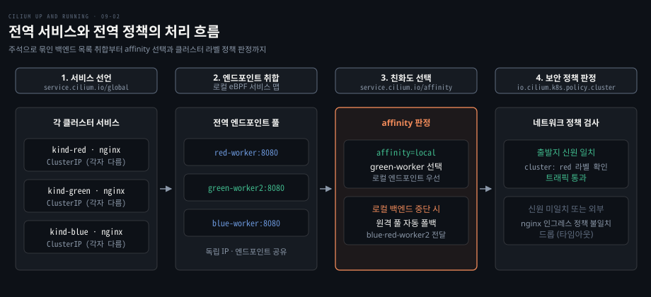
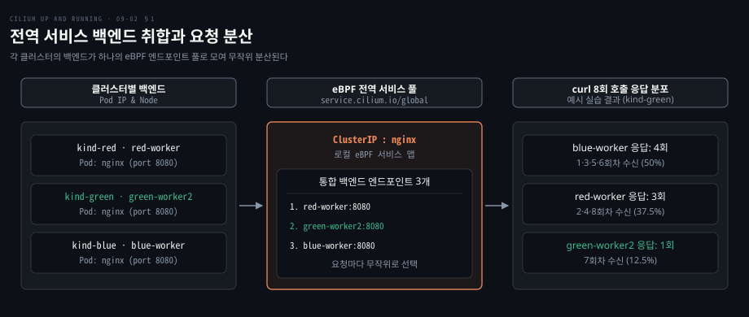
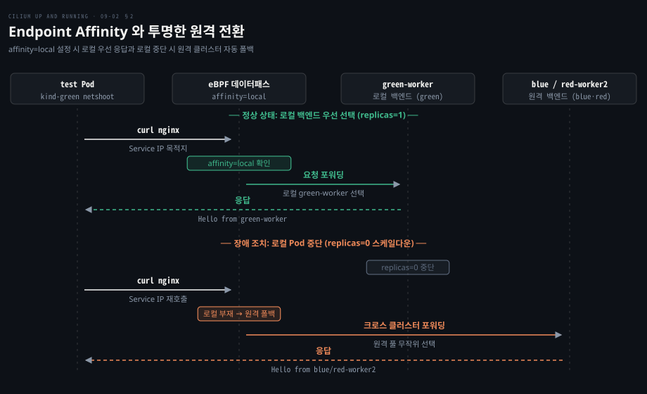
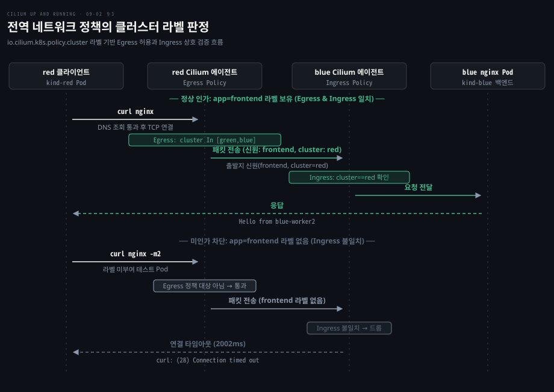
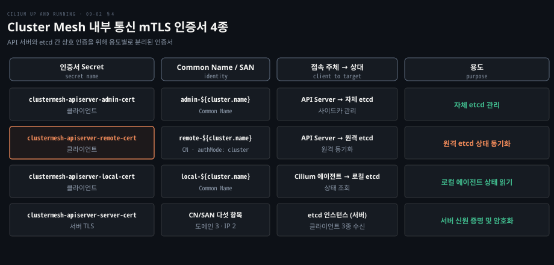

# 전역 서비스와 전역 정책은 Cluster Mesh 위에서 클러스터 경계를 넘는다

---

> 서로 다른 클러스터의 같은 이름 서비스는 주석 하나로 엔드포인트 풀이 합쳐지고 affinity 로 로컬 우선순위를 가리키며 클러스터 이름 라벨로 정책을 판정합니다.


## 핵심 요약

> 이 편의 중심 생각은 Cluster Mesh 가 외부 로드밸런서 없이도 eBPF 계층에서 엔드포인트 풀을 병합하고 신원 라벨에 클러스터 정보를 얹어 로컬과 동일한 단일 보안 경계를 만든다는 것입니다.

단일 클러스터에서 동작하던 쿠버네티스 Service 와 NetworkPolicy 추상화가 Cluster Mesh 위에서는 클러스터 경계를 넘어 확장됩니다. 두 개 이상의 클러스터에 같은 이름과 네임스페이스로 Service 를 선언하고 `service.cilium.io/global: "true"` 주석을 붙이면, 분산된 각 클러스터의 Cilium 에이전트가 상대 엔드포인트를 수집해 단일 eBPF 백엔드 맵에 병합합니다.

트래픽은 기본적으로 무작위 분산되지만 `service.cilium.io/affinity: "local"` 을 지정하면 로컬 백엔드를 우선 소비하고 장애 시 원격 백엔드로 투명하게 전환합니다. 또한 Cilium 은 메시 전역에 공유되는 보안 신원에 `io.cilium.k8s.policy.cluster` 라벨을 자동으로 부여하므로, 네트워크 정책에서도 출발지와 목적지 클러스터를 명시적으로 격리하거나 허용할 수 있습니다.

이러한 제어 플레인 메타데이터 동기화는 용도별로 분리된 네 가지 mTLS 인증서로 보호되어 멀티클러스터 환경에서도 안전한 무신뢰 통신을 확립합니다.




## 학습 목표

> 이 편을 읽고 나면 다음을 설명할 수 있습니다.

1. `service.cilium.io/global` 주석을 통해 서로 다른 클러스터의 백엔드가 단일 서비스로 병합되는 과정을 설명할 수 있습니다.
2. `service.cilium.io/affinity` 설정으로 로컬 백엔드를 우선하고 장애 시 원격으로 넘어가는 동작 방식을 비교할 수 있습니다.
3. `io.cilium.k8s.policy.cluster` 라벨을 활용해 크로스 클러스터 인그레스 및 이그레스 보안 정책을 설계할 수 있습니다.
4. Cilium v1.19부터 변경된 네트워크 정책의 로컬 클러스터 기본 격리 동작을 설명할 수 있습니다.
5. Cluster Mesh 제어 플레인을 보호하는 네 가지 TLS 인증서의 역할과 주체 및 대상을 구분할 수 있습니다.


## 1. 같은 이름의 서비스를 주석 하나로 묶는다

> 서로 다른 클러스터에 배포된 같은 이름의 서비스에 주석을 달면 Cilium 이 메시 전역의 엔드포인트를 수집해 eBPF 데이터패스에서 바로 부하를 분산합니다.

서로 다른 클러스터에 배포된 애플리케이션끼리 통신하려면 보통 클러스터 바깥에 Ingress 나 LoadBalancer 를 세우고 외부 IP 를 거쳐야 합니다. 하지만 이 구조는 불필요한 네트워크 홉을 만들고 중앙 병목을 유발합니다. 여러 클러스터에 흩어진 백엔드를 쿠버네티스 기본 Service 추상화처럼 단일 진입점으로 묶을 수는 없을까요?

쿠버네티스 서비스는 수시로 바뀌는 Pod 들 위에 안정적인 가상 IP 를 제공하는 핵심 추상화입니다. [CNI와 kube-proxy](../networking-and-kubernetes/04-02.CNI와%20kube-proxy%20—%20Pod%20네트워크의%20배선공과%20로드밸런서.md)와 [Cilium kube-proxy 대체](./06-01.Cilium%20은%20kube-proxy%20를%20eBPF%20로%20대신하고%20외부%20서비스에%20IP%20와%20경로를%20붙인다.md)에서 보았듯, Cilium 은 eBPF 데이터패스를 통해 패킷이 Pod 를 떠날 때 서비스 IP 를 백엔드 IP 로 즉시 변환합니다.

Cluster Mesh 가 켜진 환경에서는 이 서비스 변환이 클러스터 경계를 넘어 확장됩니다. 이를 **전역 서비스**(Global Service)라고 부릅니다. 두 개 이상의 서로 다른 클러스터에 이름(`metadata.name`)과 네임스페이스(`metadata.namespace`)가 같은 서비스를 만들고 다음 주석을 지정합니다.

```yaml
service.cilium.io/global: "true"
```

이 주석을 붙이면 각 클러스터의 Cilium 에이전트가 상대 클러스터의 엔드포인트 목록을 수집합니다. 그리고 로컬 eBPF 서비스 맵에 원격 백엔드 Pod IP 들을 함께 등록합니다.

주석을 작성할 때는 `"true"` 의 큰따옴표를 반드시 유지해야 합니다. 따옴표 없이 `service.cilium.io/global: true` 로 쓰면 YAML 파서가 이를 불리언 값으로 해석합니다. 쿠버네티스 어노테이션은 문자열 맵만 허용하므로 타입 불일치 에러가 발생합니다.

전역 서비스의 본질은 분산형 설계입니다. 메시로 묶인 클러스터들이 Service IP 대역을 통일하거나 공유할 필요가 없습니다. 각 클러스터는 자신만의 로컬 ClusterIP 를 독립적으로 유지하고 단지 백엔드 엔드포인트 목록만 공유합니다. 중앙 관리자가 없어도 클라이언트는 로컬 서비스 IP 로 접근하여 원격 엔드포인트를 자연스럽게 활용합니다.

특정 클러스터의 엔드포인트를 외부에 공유하지 않으려면 [공식 문서 Global Services](https://docs.cilium.io/en/v1.20/network/clustermesh/global-services/)에 설명된 대로 `service.cilium.io/shared: "false"` 주석을 추가합니다. 기본값은 `"true"` 이며 `"false"` 로 지정된 클러스터는 원격 백엔드를 수신할 수는 있지만 자신의 로컬 엔드포인트를 원격에 노출하지는 않습니다.

최신 Cilium v1.20 에서는 `clustermesh.enableEndpointSliceSynchronization=true` Helm 값으로 표준 EndpointSlice 리소스와도 상태를 동기화할 수 있습니다.

예시 매니페스트 `global-service.yaml` 의 구성입니다.

```yaml
apiVersion: v1
kind: Service
metadata:
  name: nginx
  annotations:
    service.cilium.io/global: "true"
spec:
  selector:
    app.kubernetes.io/name: nginx
  ports:
  - port: 80
    targetPort: 8080
    protocol: TCP
```

이 서비스를 red, green, blue 세 클러스터에 순서대로 배포합니다.

```bash
for cluster in red green blue; do
  kubectl apply --context "kind-$cluster" --filename global-service.yaml
done
```

배포 후 `kind-green` 클러스터에서 테스트 Pod 로 `nginx` 서비스에 8회 연속 요청을 보낸 결과입니다.

```bash
kubectl run test --context kind-green -it --rm --image nicolaka/netshoot -- bash

test:~# curl nginx # blue-worker
test:~# curl nginx # red-worker
test:~# curl nginx # blue-worker
test:~# curl nginx # red-worker
test:~# curl nginx # blue-worker
test:~# curl nginx # blue-worker
test:~# curl nginx # green-worker2
test:~# curl nginx # red-worker
```

8번의 호출 결과 blue-worker 에서 4회, red-worker 에서 3회, green-worker2 에서 1회 응답이 돌아왔습니다. 요청마다 백엔드가 전역 엔드포인트 풀에서 무작위로 골라집니다.




## 2. affinity 로 가까운 클러스터를 먼저 고른다

> affinity 주석을 local 로 두면 평소에는 로컬 백엔드를 우선 사용하고, 로컬이 모두 중단되었을 때만 원격 클러스터로 자동 전환됩니다.

전역 서비스는 기본적으로 메시 안에 연결된 모든 클러스터의 백엔드로 트래픽을 무작위 분산합니다. 하지만 같은 데이터센터나 동일 리전에 있는 로컬 백엔드를 두고 굳이 지연 시간이 높은 원격 클러스터로 매번 패킷을 보낼 이유는 없습니다. 평소에는 비용과 지연이 적은 로컬 백엔드를 우선 쓰고, 로컬에 장애가 났을 때만 원격 백엔드로 넘기려면 어떻게 해야 할까요?

이때 사용하는 기능이 **엔드포인트 친화도**(Endpoint Affinity)입니다. [공식 문서 Service Affinity](https://docs.cilium.io/en/v1.20/network/clustermesh/affinity/)에 정의된 대로 `service.cilium.io/affinity` 주석을 활용하며, 지정할 수 있는 값은 `local`, `remote`, `none` 세 가지입니다. 평소에 로컬 인스턴스를 먼저 소비하고 로컬이 다운되었을 때 원격으로 넘어가도록 하려면 `local` 을 지정합니다.

`kind-green` 클러스터의 서비스에 로컬 친화도를 부여합니다.

```bash
kubectl --context kind-green annotate service nginx 'service.cilium.io/affinity=local'
```

동일한 테스트 Pod 에서 `curl nginx` 를 세 번 실행해 보면 동작 변화가 즉시 확인됩니다.

```bash
test:~# curl nginx
<html><body><p>Hello from green-worker</p></body></html>
test:~# curl nginx
<html><body><p>Hello from green-worker</p></body></html>
test:~# curl nginx
<html><body><p>Hello from green-worker</p></body></html>
```

요청이 원격 클러스터로 빠져나가지 않고 로컬 클러스터의 `green-worker` 로만 집중됩니다.

이제 로컬 장애 상황을 가정하여 green 클러스터의 디플로이먼트 복제본을 0으로 축소합니다.

```bash
kubectl --context kind-green scale deployment nginx --replicas=0
```

이 상태 변화는 eBPF 데이터패스 맵에 즉시 반영되므로 클라이언트 Pod 를 재시작할 필요가 없습니다. 동일한 테스트 세션에서 다시 호출을 시도합니다.

```bash
test:~# curl nginx
<html><body><p>Hello from blue-worker2</p></body></html>
test:~# curl nginx
<html><body><p>Hello from red-worker2</p></body></html>
test:~# curl nginx
<html><body><p>Hello from blue-worker2</p></body></html>
```

로컬 백엔드가 완전히 사라지자마자 eBPF 계층이 원격 클러스터의 엔드포인트 풀(`blue-worker2`, `red-worker2`)로 트래픽을 자동으로 우회시킵니다. 새 요청은 원격 백엔드가 응답합니다.

친화도 주석은 설정이 적용된 해당 클러스터의 서비스에만 지역적으로 적용됩니다. green 클러스터의 디플로이먼트를 다시 1로 복구한 뒤 친화도 설정을 하지 않은 `kind-blue` 클러스터에서 호출을 시도하면, blue 클러스터는 여전히 green-worker2, red-worker2, blue-worker2 에 무작위로 요청을 분배합니다. 각 클러스터의 라우팅 결정이 중앙 통제 없이 독립적으로 이루어지는 구조입니다.

투명한 원격 장애 조치를 도입할 때는 주의할 점이 있습니다. 원격 클러스터의 지연이 훨씬 크고 워크로드가 그 지연을 견디지 못하면 장애 전환이 연쇄 장애를 키울 수 있으므로, 비운영 환경에서 정기적으로 장애 전환을 시험해야 합니다.




## 3. 정책은 클러스터 이름 라벨로 출처를 가린다

> Cluster Mesh 가 신원 정보를 동기화하므로 io.cilium.k8s.policy.cluster 라벨을 써서 특정 클러스터의 워크로드만 정확히 집어 허용하거나 차단할 수 있습니다.

클러스터 경계를 넘어오는 트래픽에 보안 정책을 적용하려면 출발지 IP 대역에 의존하기 쉽습니다. 그러나 NAT 게이트웨이나 클라우드 로드밸런서를 거친 패킷은 원래 어떤 Pod 에서 보낸 것인지 IP 만으로 가려낼 수 없습니다. 여러 클러스터가 얽힌 환경에서도 쿠버네티스 라벨 기반으로 세밀한 방화벽 정책을 유지할 방법은 무엇일까요?

[Cilium 정책과 Hubble 동작](./03-01.Cilium%20은%20kind%20클러스터에%20Helm%20으로%20설치하고%20정책과%20Hubble%20로%20동작을%20확인한다.md)과 [NetworkPolicy와 DNS](../networking-and-kubernetes/04-03.NetworkPolicy와%20DNS%20—%20클러스터%20안의%20방화벽과%20이름.md)에서 정리했듯, Cilium 은 라벨 기반의 숫자 신원(Identity)으로 정책을 평가합니다. Cluster Mesh 환경에서는 이 신원 메타데이터가 메시 전체에 공유되므로 로컬 정책과 동일한 방식으로 원격 클러스터의 Pod 라벨을 셀렉터에 담을 수 있습니다.

이때 원격 엔드포인트를 식별하는 핵심 예약 라벨이 `io.cilium.k8s.policy.cluster` 입니다. Cilium 은 모든 엔드포인트에 해당 Pod 가 위치한 클러스터 이름을 이 라벨로 자동 부여합니다.

[공식 문서 Clustermesh Network Policy](https://docs.cilium.io/en/v1.20/network/clustermesh/policy/)에 따르면 중요한 버전 변화가 있습니다. Cilium v1.18 이하에서는 클러스터 이름을 따로 지정하지 않으면 메시 내 모든 클러스터의 엔드포인트를 기본으로 포괄했습니다. 하지만 Cilium v1.19부터는 정책이 기본적으로 로컬 클러스터의 엔드포인트만 선택하도록 변경되었습니다. 다른 클러스터의 워크로드를 정책에 포함하려면 `io.cilium.k8s.policy.cluster` 라벨을 명시하거나 `operator: Exists` 매치 표현식을 선언해야 합니다. 이 편의 예제는 Cilium 1.18.3 이라 이 기본값과는 무관합니다.

신원 정보는 메시 전역에 동기화되지만 정책 객체 자체는 클러스터 간에 자동 복제되지 않습니다. `CiliumClusterwideNetworkPolicy` 리소스를 생성하더라도 해당 정책이 설치된 로컬 클러스터 내부에서만 작동하므로, 필요한 정책을 각 클러스터에 직접 배포해야 합니다.

예시 구성을 위해 `kind-red` 클러스터에는 클라이언트 Pod 만 남기고 로컬 nginx 백엔드를 삭제합니다.

```bash
kubectl delete --context kind-red deployment nginx
```

서버 역할을 맡는 `kind-blue` 와 `kind-green` 클러스터에 인그레스 정책(`nginx-policy.yaml`)을 적용합니다.

```yaml
apiVersion: "cilium.io/v2"
kind: CiliumNetworkPolicy
metadata:
  name: nginx
spec:
  endpointSelector:
    matchLabels:
      app.kubernetes.io/name: nginx
  ingress:
  - fromEndpoints:
    - matchLabels:
        app.kubernetes.io/name: frontend
        io.cilium.k8s.policy.cluster: red
    toPorts:
    - ports:
      - port: "8080"
        protocol: TCP
```

이 인그레스 정책 설정에 따라 목적지 nginx Pod 는 오직 `red` 클러스터에서 보낸 `app.kubernetes.io/name: frontend` 라벨 소유 Pod 의 TCP 8080 인바운드 트래픽만 받도록 제한됩니다.

```bash
kubectl apply --context kind-blue --filename nginx-policy.yaml
kubectl apply --context kind-green --filename nginx-policy.yaml
```

클라이언트가 위치한 `kind-red` 클러스터에는 이그레스 정책(`frontend-policy.yaml`)을 배포합니다.

```yaml
apiVersion: "cilium.io/v2"
kind: CiliumNetworkPolicy
metadata:
  name: frontend
spec:
  endpointSelector:
    matchLabels:
      app.kubernetes.io/name: frontend
  egress:
  - toEndpoints:
    - matchLabels:
        "k8s:io.kubernetes.pod.namespace": kube-system
        "k8s:k8s-app": kube-dns
    toPorts:
    - ports:
      - port: "53"
        protocol: ANY
      rules:
        dns:
        - matchPattern: "nginx.default.svc.cluster.local."
  - toEndpoints:
    - matchLabels:
        app.kubernetes.io/name: nginx
      matchExpressions:
      - key: io.cilium.k8s.policy.cluster
        operator: In
        values:
        - green
        - blue
    toPorts:
    - ports:
      - port: "8080"
        protocol: TCP
```

`frontend` 라벨을 단 Pod 가 CoreDNS 로 도메인을 조회하고 오직 `green` 또는 `blue` 클러스터에 위치한 nginx Pod 로만 8080 포트 통신을 열 수 있도록 제한합니다.

```bash
kubectl apply --context kind-red --filename frontend-policy.yaml
```

정상 라벨을 부착한 Pod 로 테스트를 수행합니다.

```bash
kubectl run test --context kind-red -it --rm --image nicolaka/netshoot --labels 'app.kubernetes.io/name=frontend' -- bash

test:~# curl nginx # Hello from blue-worker2
test:~# curl nginx # Hello from blue-worker2
test:~# curl nginx # Hello from green-worker2
```

DNS 조회와 원격 클러스터 접속이 모두 정책을 통과하여 정상 응답을 반환합니다.

반면 `frontend` 라벨을 달지 않은 테스트 Pod 에서 동일하게 접속을 시도하면 응답을 받지 못합니다.

```bash
kubectl run test --context kind-red -it --rm --image nicolaka/netshoot -- bash

test:~# curl nginx -m2
curl: (28) Connection timed out after 2002 milliseconds
```

라벨이 없는 Pod 는 red 쪽 이그레스 정책의 대상이 아니므로 패킷이 나가지만, blue·green 의 nginx 인그레스 정책이 `frontend` 신원이 아닌 출발지를 버리고 2초 뒤 타임아웃이 납니다. 클러스터 경계를 넘나드는 트래픽에도 단일 클러스터와 동일한 세밀한 L3/L4 보안 통제가 적용됨을 확인할 수 있습니다.




## 4. Cluster Mesh 는 용도별 인증서로 서로를 확인한다

> 제어 플레인 메타데이터를 교환하는 etcd 와 API 서버는 네 가지 mTLS 인증서로 상호 신원을 검증하고 전송 구간을 암호화합니다.

Cluster Mesh 에서는 각 클러스터의 KVStoreMesh 가 원격 etcd 에 붙어 엔드포인트와 신원 정보를 가져오고, 에이전트는 로컬 etcd 만 읽습니다. 클러스터 외부 망을 타고 메타데이터가 오가는 만큼, 인가되지 않은 외부 접근이나 스푸핑 위조를 막을 전송 구간 보안이 필수입니다. 하지만 하나의 인증서만 공유하면 탈취 시 전체 메시가 무너지는데, 인증 체계를 어떻게 쪼개어 격리해야 할까요?

각 클러스터가 개별 자체 서명 CA 를 생성하고 각자의 신뢰 번들을 맞바꾸는 방식은 클러스터가 늘어날 때마다 번들 갱신 비용이 커집니다. 따라서 클러스터마다 번들을 고쳐야 하는 부담을 피하려면 단일 CA 가 더 지속 가능합니다. [공식 문서 Setting up Cluster Mesh](https://docs.cilium.io/en/v1.20/network/clustermesh/setup/)는 공통 루트 CA 를 쓰거나 모든 CA 를 담은 `tls.caBundle` 을 설정하는 두 방식을 제시합니다.

Cluster Mesh 내부 통신을 지탱하는 핵심 인증서는 네 가지이며 쿠버네티스 Secret 형태로 저장됩니다. 세 개의 클라이언트 인증서와 하나의 서버 인증서로 구성됩니다.

| Secret 이름 | 인증서 구분 | Common Name | 통신 주체와 대상 | 용도 |
|---|---|---|---|---|
| `clustermesh-apiserver-admin-cert` | 클라이언트 | `admin-${cluster.name}` | API Server → 자체 사이드카 etcd | 로컬 API 서버의 자체 etcd 관리 접속 |
| `clustermesh-apiserver-remote-cert` | 클라이언트 | `remote-${cluster.name}` | API Server → 원격 클러스터 etcd | 원격 클러스터 etcd 메타데이터 동기화 및 읽기 |
| `clustermesh-apiserver-local-cert` | 클라이언트 | `local-${cluster.name}` | Cilium 에이전트 → 로컬 API Server etcd | 각 노드 에이전트의 로컬 메시 상태 조회 |
| `clustermesh-apiserver-server-cert` | 서버 TLS | CN/SAN 에 아래 다섯 항목 | etcd 인스턴스 (서버) | 서버 신원 증명 및 클라이언트 3종 접속 수신 |

remote 인증서의 CN 은 `authMode: cluster` 기준이며, 기본값 `migration` 과 `legacy` 에서는 `remote` 입니다.

서버 인증서(`clustermesh-apiserver-server-cert`)는 etcd 프로세스가 클라이언트들의 접속을 수신할 때 제시하는 인증서입니다. 이 인증서는 Common Name 과 주체 대체 이름(SAN)에 다음 항목들을 반드시 포함해야 합니다.

- 도메인: `${cluster.name}.${clustermesh.config.domain}`
- 도메인: `clustermesh-apiserver.${cilium-namespace}.svc`
- 도메인: `localhost`
- IP 주소: `127.0.0.1`
- IP 주소: `::1`

여기서 IPv6 루프백 주소인 `::1` 은 IPv4 전용 클러스터라 하더라도 SAN 에 포함하는 것이 안전합니다. IPv4 전용 환경에서는 `::1` 이 빠져도 동작하지만 향후 듀얼스택으로 환경을 전환했을 때 프로토콜 해석 차이로 인해 TLS 핸드셰이크가 원인 모르게 실패하는 디버깅 난제를 예방할 수 있습니다. 수동 인증서를 적용할 때는 Helm 값에서 `clustermesh.apiserver.tls.auto.enabled=false` 로 설정하고 해당 Secret 들을 직접 배포합니다.




## 5. 정리

> Cluster Mesh 는 외부 장비 없이 쿠버네티스 기본 Service 와 Policy 를 멀티클러스터로 넓히며 향후 확장을 위해 클러스터마다 겹치지 않는 Pod 대역을 설계하는 것이 핵심입니다.

단일 쿠버네티스 클러스터는 수천 대의 노드까지 확장할 수 있으므로 모든 조직이 멀티클러스터를 필수로 운영할 필요는 없습니다. 그러나 리전 간 재해 복구, 데이터 주권과 규제 격리, 하이브리드 클라우드 연동처럼 분산 아키텍처가 불가피한 상황에서 Cluster Mesh 는 진가를 발휘합니다. 외부 로드밸런서, 복잡한 인그레스 게이트웨이, 전용 DNS 장비 없이도 단 몇 줄의 YAML 주석과 eBPF 데이터패스로 클러스터 간 통신을 직결합니다.

전역 서비스는 `service.cilium.io/global` 주석 하나로 각 클러스터의 엔드포인트를 하나로 묶어 주며 `service.cilium.io/affinity: "local"` 을 통해 로컬 우선 라우팅과 투명한 원격 폴백을 실현합니다. 보안 영역에서는 `io.cilium.k8s.policy.cluster` 예약 라벨을 통해 클러스터 단위의 정밀한 송수신 통제를 가능케 합니다. Cilium v1.19부터는 정책이 기본적으로 로컬 클러스터만 선택하도록 안전하게 기본값이 변경되었습니다.

장기적으로 멀티클러스터 도입을 고려한다면 지금 당장 각 클러스터를 만들 때부터 서로 겹치지 않는 고유한 Pod CIDR 대역을 배정해야 합니다. Pod 대역이 서로 겹치지 않아야 차후 대규모 IPAM 마이그레이션 없이 손쉽게 Cluster Mesh 를 연결할 수 있습니다.


## 면접 대비

> Cluster Mesh 의 전역 서비스·affinity·전역 정책·TLS 인증서에 관한 면접 질문입니다.

1. 전역 서비스(Global Service)를 구성할 때 `service.cilium.io/global: "true"` 주석의 따옴표가 필수인 이유와 분산 설계 특성을 설명해 보십시오.
2. `service.cilium.io/affinity: "local"` 설정 시 정상 상태와 로컬 장애 발생 시의 라우팅 동작 차이는 무엇입니까?
3. 멀티클러스터 환경에서 Cilium 이 크로스 클러스터 네트워크 정책을 식별하는 원리와 Cilium v1.19 이후 변경된 기본 정책 동작은 무엇입니까?
4. Cluster Mesh 제어 플레인을 구성하는 네 가지 TLS 인증서의 명칭과 각각의 발급 주체 및 역할을 비교해 보십시오.
5. 장기적으로 Cluster Mesh 도입을 염두에 둘 때 단일 클러스터 설계 단계에서 미리 고려해야 할 가장 중요한 네트워크 요소는 무엇입니까?


## 정답 (자답 후 펼치기)

> 면접 질문에 대한 키워드 중심의 모범 답안입니다.

### 정답 1 — YAML 문자열 매핑과 분산형 엔드포인트 취합

쿠버네티스 metadata.annotations 는 문자열 맵(`map[string]string`)을 요구하므로 따옴표가 없으면 불리언 역직렬화 오류가 발생합니다. 전역 서비스는 단일 중앙 컨트롤러 없이 각 클러스터가 독립적인 ClusterIP 를 유지한 채 eBPF 엔드포인트 목록만 취합하여 분산 로드밸런싱을 수행합니다.

### 정답 2 — 로컬 엔드포인트 우선 선택과 eBPF 기반 투명한 원격 폴백

정상 상태에서는 `affinity=local` 에 의해 로컬 클러스터의 백엔드로만 요청이 100% 전달되어 네트워크 지연을 줄입니다. 로컬 디플로이먼트가 중단되어 로컬 백엔드가 소멸하면, eBPF 데이터패스가 즉시 원격 클러스터의 백엔드 풀로 트래픽을 자동 우회시켜 새 요청이 원격 백엔드로 투명하게 전환됩니다.

### 정답 3 — io.cilium.k8s.policy.cluster 예약 라벨과 v1.19+ 로컬 기본 격리

Cilium 은 각 엔드포인트의 보안 신원에 출처 클러스터 이름을 `io.cilium.k8s.policy.cluster` 라벨로 자동 부여하며 이 신원은 메시 전역에 동기화됩니다. Cilium v1.18 이하에서는 명시하지 않을 경우 전체 클러스터가 기본 선택되었으나, v1.19부터는 보안 강화를 위해 로컬 클러스터만 기본 선택되도록 변경되었습니다.

### 정답 4 — admin·remote·local 3대 클라이언트 인증서와 server 인증서의 mTLS 상호 검증

API 서버가 자체 etcd 를 관리할 때 `admin-cert`, 원격 etcd 와 동기화할 때 `remote-cert`, 로컬 에이전트가 상태를 읽을 때 `local-cert` 를 클라이언트로 제시합니다. etcd 서버는 SAN 에 클러스터 도메인과 `localhost`, `127.0.0.1`, `::1` 이 포함된 `server-cert` 로 신원을 증명하며 상호 TLS 암호화를 완성합니다.

### 정답 5 — 비중복 고유 Pod CIDR 대역 설계와 IPAM 마이그레이션 방지

Cluster Mesh 는 터널 또는 직접 라우팅을 통해 양방향 Pod IP 통신을 수행하므로 클러스터 간 Pod 대역이 겹치면 주소 충돌로 통신이 불가능해집니다. 초기 단일 클러스터 구축 시점부터 클러스터별로 비중복 Pod IP 대역을 할당해 두어야 추후 대규모 재배치 없이 메시를 연동할 수 있습니다.


## 참고 자료

- Nico Vibert · Filip Nikolic · James Laverack, 《Cilium: Up and Running》(O'Reilly, 2026, ISBN 979-8-341-62299-9).
- Chapter 9 "Multicluster Networking".
- Cilium 공식 문서 Global Services: https://docs.cilium.io/en/v1.20/network/clustermesh/global-services/
- Cilium 공식 문서 Service Affinity: https://docs.cilium.io/en/v1.20/network/clustermesh/affinity/
- Cilium 공식 문서 Clustermesh Network Policy: https://docs.cilium.io/en/v1.20/network/clustermesh/policy/
- Cilium 공식 문서 Setting up Cluster Mesh: https://docs.cilium.io/en/v1.20/network/clustermesh/setup/
- Cilium GitHub 저장소 v1.20.2 소스: https://github.com/cilium/cilium/tree/v1.20.2


## 관련 문서

- [Cilium 은 kind 클러스터에 Helm 으로 설치하고 정책과 Hubble 로 동작을 확인한다](./03-01.Cilium%20은%20kind%20클러스터에%20Helm%20으로%20설치하고%20정책과%20Hubble%20로%20동작을%20확인한다.md)
- [Cilium 은 kube-proxy 를 eBPF 로 대신하고 외부 서비스에 IP 와 경로를 붙인다](./06-01.Cilium%20은%20kube-proxy%20를%20eBPF%20로%20대신하고%20외부%20서비스에%20IP%20와%20경로를%20붙인다.md)
- [CNI와 kube-proxy — Pod 네트워크의 배선공과 로드밸런서](../networking-and-kubernetes/04-02.CNI와%20kube-proxy%20—%20Pod%20네트워크의%20배선공과%20로드밸런서.md)
- [NetworkPolicy와 DNS — 클러스터 안의 방화벽과 이름](../networking-and-kubernetes/04-03.NetworkPolicy와%20DNS%20—%20클러스터%20안의%20방화벽과%20이름.md)
- [Cluster Mesh 는 클러스터마다 API 서버를 두고 서로의 상태를 읽어 하나의 망을 만든다](./09-01.Cluster%20Mesh%20는%20클러스터마다%20API%20서버를%20두고%20서로의%20상태를%20읽어%20하나의%20망을%20만든다.md)
