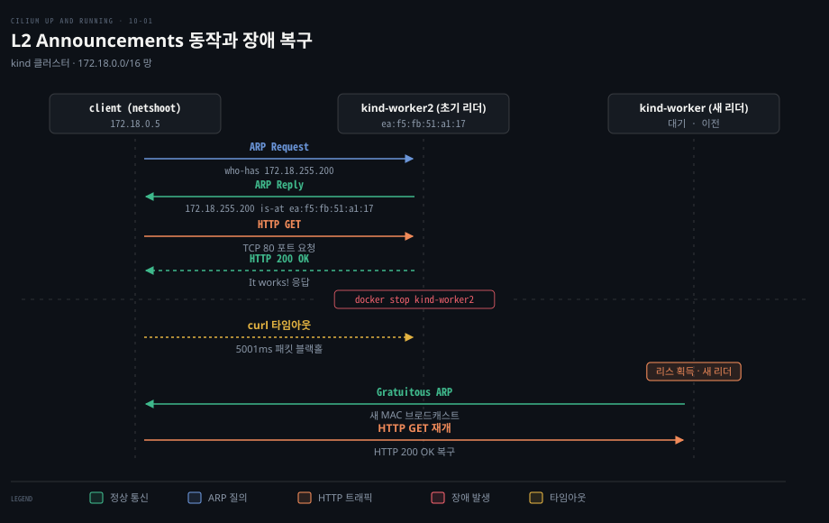
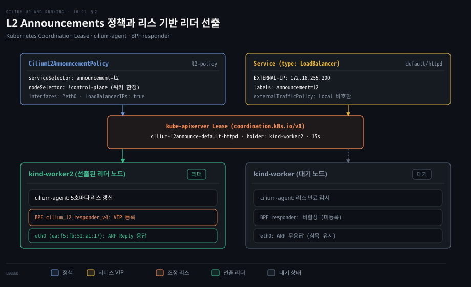
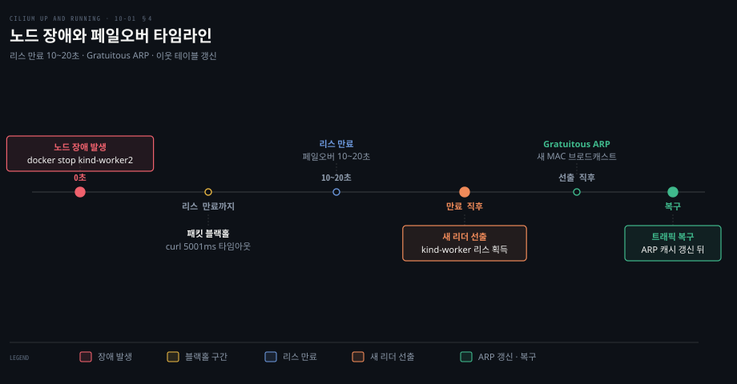

# L2 Announcements 는 ARP 응답으로 서비스 IP 를 같은 L2 망에 알린다

---

> 클러스터 외부 클라이언트가 서비스 VIP 로 패킷을 보내려면 L2 망에서 ARP 질의가 먼저 일어나야 하며, Cilium 은 정책과 쿠버네티스 리스로 단 하나의 노드를 선출해 자기 MAC 주소로 응답하게 합니다.


## 핵심 요약

> 이 편의 중심 생각은 라우팅 장비가 없는 단순 L2 망에서도 Cilium 이 ARP 응답 노드를 리더 선출로 하나만 지정하여 서비스 가상 IP 를 외부와 연결한다는 것입니다.

쿠버네티스 NodePort 는 외부 클라이언트가 노드 IP 를 직접 알아야 접근할 수 있습니다. 하지만 선택한 노드가 다운되면 쿠버네티스가 자동으로 경로를 우회해 주지 못합니다. 이에 비해 LoadBalancer 서비스는 안정적인 단일 가상 IP(VIP)를 제공합니다.

Cilium 의 **L2 Announcements** 기능은 외부 라우터나 BGP 구성 없이도 서비스 IP 를 같은 L2 브로드캐스트 도메인에 노출합니다. 정책에 부합하는 워커 노드 중 하나가 쿠버네티스 리스(Lease)를 얻어 리더가 되고, 그 노드의 Cilium 에이전트가 로컬 인터페이스에서 서비스 IP 에 대한 ARP 질의에 자기 물리 MAC 주소로 응답합니다.

선출된 노드에 장애가 발생하면 리스가 다른 노드로 넘어갑니다. 새 리더는 Gratuitous ARP 로 클라이언트의 ARP 테이블 갱신을 유도합니다. 다만 VIP 마다 한 노드만 트래픽을 받아 노드 간 로드밸런싱이 없고, 클라이언트가 Gratuitous ARP 를 무시하면 캐시 만료 전까지 통신이 끊깁니다.




## 학습 목표

> 이 편을 읽고 나면 다음을 설명할 수 있습니다.

1. NodePort 방식이 노드 장애 상황에서 외부 클라이언트 연결을 단절시키는 구조적 원인을 설명할 수 있습니다.
2. L2 Announcements 가 서비스 가상 IP(VIP)를 L2 로컬 망에 알리기 위해 사용하는 ARP 응답 원리를 설명할 수 있습니다.
3. `CiliumL2AnnouncementPolicy` 의 셀렉터와 쿠버네티스 Lease 객체가 협력하여 단일 리더 노드를 선출하는 과정을 설명할 수 있습니다.
4. tcpdump 캡처 상에서 클라이언트의 ARP Request 와 선출 노드의 ARP Reply, 역방향 ARP 동작을 순서대로 추적할 수 있습니다.
5. 노드 장애 시 리스 이전과 Gratuitous ARP 가 동작하는 과정, 그리고 ARP 캐시 만료 지연에 따른 한계를 설명할 수 있습니다.


## 1. 클러스터 밖에서 서비스 IP 에 닿으려면 누군가 그 IP 를 알려야 한다

> 외부 클라이언트가 클러스터 안의 서비스에 접근할 때 가장 단순한 NodePort 는 노드 장애 시 클라이언트가 직접 다른 노드를 찾아야 하는 치명적인 취약점을 안고 있습니다.

클러스터 외부 클라이언트가 쿠버네티스 서비스에 접속할 때 가장 단순한 수단은 NodePort 입니다. 모든 노드에 동일한 포트를 열고 트래픽을 백엔드 Pod 로 전달합니다.

그러나 NodePort 에는 두 단계의 선택 계층이 있습니다. 첫째는 클라이언트가 접속할 노드 IP 를 고르는 계층이고, 둘째는 노드가 [Cilium 은 kube-proxy 를 eBPF 로 대신하고 외부 서비스에 IP 와 경로를 붙인다](./06-01.Cilium%20은%20kube-proxy%20를%20eBPF%20로%20대신하고%20외부%20서비스에%20IP%20와%20경로를%20붙인다.md)의 로드밸런싱 규칙에 따라 정상 Pod 로 넘기는 계층입니다.

둘째 계층은 Pod 헬스체크로 비정상 백엔드를 제거해 안정적입니다. 문제는 첫째 계층입니다. 선택한 노드가 다운되면 쿠버네티스는 연결을 다른 노드로 돌려주지 못합니다. 클라이언트가 실패를 감지하고 다른 노드 IP 로 재시도해야 하므로 외부에 노드 목록 관리 부담이 생깁니다.

### 가상 IP 와 ARP 의 필요성

이 문제를 푸는 방법이 단일 가상 IP(VIP)를 부여하는 LoadBalancer 서비스입니다. 하지만 VIP 는 특정 물리 머신의 인터페이스에 고정된 주소가 아닙니다.

같은 L2 로컬 망의 클라이언트가 VIP 로 패킷을 보내려면 목적지 MAC 주소를 먼저 알아야 합니다. 누군가 "이 VIP 는 나의 MAC"이라고 답하지 않으면 패킷을 전송하지 못합니다. L2 주소 결정 원리는 [IP·라우팅·Ethernet — 패킷이 길을 찾는 법](../networking-and-kubernetes/01-03.IP·라우팅·Ethernet%20—%20패킷이%20길을%20찾는%20법.md)과 [주소가 둘인 이유와 이더넷](../../../02_os/book/cntd_computer-networking-top-down/06-03.주소가%20둘인%20이유와%20이더넷.md)을 참조하십시오.

Cilium 의 **L2 Announcements**(L2 인지 로드밸런서)는 BGP 라우팅이 없는 환경에서 이 문제를 풉니다. 선출된 노드가 ARP 질의에 자신의 물리 MAC 주소로 대신 응답합니다.

### 실습 환경과 동일 서브넷 IP 풀 할당

L2 Announcements 의 필수 조건은 Kube-Proxy Replacement(KPR) 활성화입니다. kind 클러스터에 Cilium 을 설치할 때 다음 Helm 값을 적용합니다.

```yaml
kubeProxyReplacement: true
k8sServiceHost: kind-control-plane
k8sServicePort: 6443
l2announcements:
  enabled: true
```

클러스터와 동일한 Docker 네트워크(`kind`)에 netshoot 클라이언트 컨테이너를 실행합니다.

```bash
docker run -d --network kind --rm --name client \
  nicolaka/netshoot:v0.8 sleep infinity
```

클라이언트는 `172.18.0.0/16` 서브넷의 주소를 부여받았습니다.

```bash
docker exec -it client ip -4 a show eth0
# inet 172.18.0.5/16 brd 172.18.255.255 scope global eth0
```

외부 클라이언트가 라우팅 없이 L2 로 닿으려면 서비스 IP 도 동일 서브넷(`172.18.0.0/16`) 안에 있어야 합니다. CiliumLoadBalancerIPPool 로 `172.18.255.200/29` 대역을 지정하고 `announcement: l2` 레이블의 httpd 서비스를 생성합니다.

```yaml
apiVersion: v1
kind: Service
metadata:
  name: httpd
  labels:
    announcement: l2
spec:
  type: LoadBalancer
  selector:
    app.kubernetes.io/name: httpd
  ports:
  - port: 80
```

서비스가 생성되면 풀에서 외부 IP 가 배정됩니다.

```bash
kubectl get svc httpd
# NAME    TYPE           CLUSTER-IP     EXTERNAL-IP      PORT(S)        AGE
# httpd   LoadBalancer   10.96.84.34    172.18.255.200   80:32179/TCP   20m
```

EXTERNAL-IP(`172.18.255.200`)는 할당되었지만 클라이언트는 아직 접속할 수 없습니다. 어떤 노드도 이 IP 에 대한 ARP 요청에 응답하도록 설정되지 않았기 때문입니다.


## 2. 정책과 리스로 응답할 노드를 하나 고른다

> 클러스터의 모든 노드가 동일한 서비스 VIP 에 대해 각자의 MAC 주소로 ARP 응답을 보내면 스위치와 클라이언트의 이웃 테이블이 뒤흔들립니다. 단 하나의 노드만 질의에 응답하도록 선출하는 규칙이 필요합니다.

모든 노드가 동시에 ARP 질의에 응답하면 동일 IP 에 대해 서로 다른 MAC 응답이 쏟아져 충돌합니다. 단 하나의 노드만 질의에 응답하도록 하려면 어떻게 해야 할까요? Cilium 은 어떤 서비스 IP 를 어떤 노드의 어떤 인터페이스로 알릴지 선언하는 정책 CRD 로 `CiliumL2AnnouncementPolicy`([공식 문서](https://docs.cilium.io/en/v1.20/network/l2-announcements/))를 제공합니다.

### L2 Announcements 정책 정의

워커 노드의 `eth0` 로 `announcement: l2` 서비스의 LoadBalancer IP 를 공지하는 정책 매니페스트입니다.

```yaml
apiVersion: "cilium.io/v2alpha1"
kind: CiliumL2AnnouncementPolicy
metadata:
  name: l2-policy
spec:
  serviceSelector:
    matchLabels:
      announcement: l2
  nodeSelector:
    matchExpressions:
      - key: node-role.kubernetes.io/control-plane
        operator: DoesNotExist
  interfaces:
  - ^eth0
  loadBalancerIPs: true
```

각 필드의 역할은 다음과 같습니다.
- `serviceSelector`: `announcement: l2` 레이블이 붙은 서비스를 선택합니다.
- `nodeSelector`: 컨트롤 플레인을 배제하고 워커 노드만 공지 담당자로 지정합니다.
- `interfaces`: 공지를 내보낼 인터페이스를 정규식(`^eth0`)으로 지정합니다. 비워 두면 노드의 모든 인터페이스에서 공지합니다.
- `loadBalancerIPs`: LoadBalancer 타입 서비스의 외부 IP 공지를 켭니다.

인터페이스 셀렉터는 보안 격리 기능이 아닙니다. 상위 라우터에서 수동으로 ARP 테이블을 지정한 경우 정책에 없는 인터페이스로 들어온 트래픽도 노드에 도달하면 정상 처리될 수 있습니다.

### 쿠버네티스 Lease 기반 리더 선출

정책이 적용되면 조건을 만족하는 노드 중 VIP 마다 단 하나의 노드가 리더로 선출됩니다. Cilium 은 이 과정에 쿠버네티스 표준 `Lease`(`coordination.k8s.io/v1`)를 사용합니다.

```bash
kubectl -n kube-system get lease | grep l2announce
# cilium-l2announce-default-httpd        kind-worker2
```

네임스페이스와 서비스 이름이 합쳐진 `cilium-l2announce-default-httpd` 리스가 생성되고, 홀더(리더)로 `kind-worker2` 가 지정되었습니다.



선출된 노드의 에이전트는 BPF 맵에 서비스 IP(`172.18.255.200`)와 인터페이스 인덱스를 등록합니다. 맵 경로는 `/sys/fs/bpf/tc/globals/cilium_l2_responder_v4` 입니다. 이후 해당 `eth0` 로 들어오는 ARP 요청을 BPF 가 가로채 노드의 실제 MAC 주소로 즉시 응답합니다.

반면 대기 노드(`kind-worker`)는 BPF 맵에 등록하지 않고 침묵하며 백그라운드에서 리스 만료만 감시합니다.

또한 서비스의 `externalTrafficPolicy` 설정에 주의해야 합니다. L2 Announcements 는 `externalTrafficPolicy: Local` 과 호환되지 않습니다. 특정 노드의 Pod 실행 여부를 따지지 않고 리더를 뽑으므로, 리더 노드에 Pod 가 없으면 트래픽이 드롭됩니다. 그래서 `Cluster` 로 둡니다.


## 3. ARP 캡처로 어느 노드가 응답하는지 본다

> 클라이언트가 서비스 IP 로 패킷을 보낼 때 실제 네트워크 선로 위에서는 ARP 질의와 응답, 그리고 TCP 핸드셰이크가 어떻게 이어질까요? 패킷 캡처로 그 상호작용을 확인합니다.

클라이언트가 서비스 IP 로 패킷을 보낼 때 실제 선로에서는 ARP 질의와 응답이 어떻게 이어질까요? 패킷 수준의 상호작용을 보려면 클라이언트와 리더 노드의 주소를 먼저 대조해야 합니다. 선출된 `kind-worker2` 노드의 `eth0` MAC 주소를 확인합니다.

```bash
docker exec -it kind-worker2 ip link show dev eth0
# 11: eth0@if32: <BROADCAST,MULTICAST,UP,LOWER_UP> mtu 65535 ...
#     link/ether ea:f5:fb:51:a1:17 brd ff:ff:ff:ff:ff:ff ...
```

물리 MAC 주소는 `ea:f5:fb:51:a1:17` 입니다. 클라이언트의 초기 이웃 테이블(`ip neigh`)은 비어 있습니다.

### tcpdump 패킷 캡처와 통신 순서

클라이언트 내부에서 tcpdump 로 패킷을 캡처하면서 curl 요청을 보냅니다.

```bash
docker exec -it client curl http://172.18.255.200
# <html><body><h1>It works!</h1></body></html>
```

tcpdump 에 기록된 통신 흐름입니다.

```bash
ARP, Request who-has 172.18.255.200 tell 172.18.0.5, length 28
ARP, Reply 172.18.255.200 is-at ea:f5:fb:51:a1:17, length 28
IP 172.18.0.5.45300 > 172.18.255.200.80: Flags [S], ...
ARP, Request who-has 172.18.0.5 tell 172.18.0.3, length 28
ARP, Reply 172.18.0.5 is-at 76:0f:e0:c7:27:fe, length 28
IP 172.18.255.200.80 > 172.18.0.5.45300: Flags [S.], ...
IP 172.18.0.5.45300 > 172.18.255.200.80: Flags [.], ...
IP 172.18.0.5.45300 > 172.18.255.200.80: Flags [P.], ... HTTP GET
IP 172.18.255.200.80 > 172.18.0.5.45300: Flags [.], ...
IP 172.18.255.200.80 > 172.18.0.5.45300: Flags [P.], ... HTTP 200 OK
IP 172.18.0.5.45300 > 172.18.255.200.80: Flags [.], ...
IP 172.18.0.5.45300 > 172.18.255.200.80: Flags [F.], ...
IP 172.18.255.200.80 > 172.18.0.5.45300: Flags [F.], ...
IP 172.18.0.5.45300 > 172.18.255.200.80: Flags [.], ...
```

이 캡처의 핵심 단계는 다음과 같습니다.
1. **클라이언트 ARP 브로드캐스트**: 목적지 IP `172.18.255.200` 의 MAC 주소를 묻는 ARP Request 를 보냅니다.
2. **리더 노드 ARP 응답**: 리스를 쥔 `kind-worker2` 의 BPF 프로그램이 질의를 가로채 자기 MAC(`ea:f5:fb:51:a1:17`)으로 회신합니다.
3. **TCP SYN 전송**: 클라이언트는 목적지 MAC 을 학습하고 포트 80 으로 SYN 을 보냅니다.
4. **리더 노드의 역방향 ARP**: 리더 노드도 클라이언트 IP(`172.18.0.5`)로 응답을 돌려보내기 위해 클라이언트 MAC 을 질의합니다.
5. **핸드셰이크와 HTTP 교환**: 3-way 핸드셰이크 완료 후 HTTP GET 과 `200 OK` 가 오가고 연결이 종료됩니다.

통신 후 클라이언트 이웃 테이블에 VIP 가 리더 MAC 으로 캐싱됩니다.

```bash
docker exec -it client ip neigh
# 172.18.255.200 dev eth0 lladdr ea:f5:fb:51:a1:17 REACHABLE
```


## 4. 노드가 죽으면 리스가 넘어가고 새 노드가 다시 알린다

> 트래픽을 도맡아 처리하던 리더 노드가 정지되면 클라이언트는 캐시된 기존 MAC 으로 패킷을 계속 보내다 타임아웃을 겪게 됩니다. 클러스터는 이 단절을 어떻게 감지하고 새 리더를 세울까요?

단일 리더 노드가 정지되면 클라이언트는 패킷을 어디로 보내야 할까요? 장애 복구를 확인하기 위해 리더인 `kind-worker2` 컨테이너를 정지시킵니다.

```bash
docker stop kind-worker2
```

클라이언트의 패킷은 응답 없는 이전 MAC 으로 전송되어 블랙홀에 빠집니다.

```bash
docker exec -it client curl -m 5 172.18.255.200
# curl: (28) Connection timed out after 5001 milliseconds
```

### 리스 만료와 새 리더 승계

한편 대기 노드의 Cilium 에이전트는 리스를 지켜보다 갱신이 끊기면 API 서버에 소유권을 요청합니다. 페일오버 주기를 결정하는 핵심 Helm 옵션은 다음과 같습니다.
- `l2announcements.leaseDuration`: 리스 유효 기간(`leaseDurationSeconds`)이며 기본값은 15초입니다.
- `l2announcements.leaseRenewDeadline`: 리더가 갱신을 재시도하다 포기하기까지의 시간이며 기본값은 5초입니다. 갱신 시도 간격은 `leaseRetryPeriod`(기본 2초)입니다([client-go](https://github.com/kubernetes/client-go/blob/v0.36.4/tools/leaderelection/leaderelection.go#L284-L305)).
- 페일오버 시간은 `leaseDuration - leaseRenewDeadline`(최단 10초)에서 `leaseDuration + leaseRenewDeadline`(최장 20초) 사이입니다.

정지된 노드가 리스를 갱신하지 못해 기간이 만료되면 대기 중이던 워커 노드가 API 서버에서 리스 소유권을 얻습니다.

```bash
kubectl -n kube-system get lease | grep l2announce
# cilium-l2announce-default-httpd        kind-worker
```

리스 홀더가 `kind-worker` 로 전환되었습니다.



### Gratuitous ARP 와 캐시 만료 의존성

새 리더 노드는 즉시 로컬 네트워크로 **Gratuitous ARP** 를 브로드캐스트합니다. 질의 없이 "172.18.255.200 의 MAC 주소가 바뀌었다"고 알리는 자발적 공지 패킷입니다.

- **Gratuitous ARP 를 수용하는 클라이언트**: 공지 패킷을 받는 즉시 자신의 ARP 테이블을 새 MAC 으로 갱신해 연결이 곧바로 복구됩니다.
- **Gratuitous ARP 를 무시하는 클라이언트**: ARP Spoofing 방어 정책으로 비요청 ARP 를 폐기하는 장비는 로컬 ARP 캐시의 수명(TTL)이 다할 때까지 패킷이 이전 MAC 으로 가서 사라집니다.

캐시가 만료된 뒤 클라이언트가 새 ARP Request 를 보내면 새 리더 `kind-worker` 가 응답하여 통신이 복구됩니다.

```bash
docker exec -it client curl -m 5 172.18.255.200
# <html><body><h1>It works!</h1></body></html>
```


## 5. L2 Announcements 의 세 가지 한계와 BGP 로의 전환

> L2 Announcements 는 별도의 라우팅 장비 없이도 외부 접근을 열어 주지만 대규모 프로덕션에 적용하기에는 구조적 제약이 따릅니다. 어떤 한계가 시스템 확장을 가로막을까요?

L2 Announcements 는 설정이 단순해 소규모 온프레미스나 개발 환경에 알맞습니다. 하지만 다음 세 가지 한계가 있습니다.

1. **노드 간 로드밸런싱 부재**: VIP 당 오직 한 노드만 트래픽을 받습니다. 리더 노드가 eBPF 로 여러 Pod 에 분산하더라도 유입 창구가 단일 노드 대역폭에 묶입니다.
2. **ARP 캐시 만료에 의존하는 느린 페일오버**: 노드 장애 시 복구 시간이 리스 만료(10~20초)와 클라이언트 ARP 캐시 잔존 시간만큼 늘어납니다.
3. **Gratuitous ARP 의 낮은 신뢰성**: 고속 복구 수단인 Gratuitous ARP 가 보안 정책에 막히면 강제적인 캐시 만료 대기가 불가피합니다.

### Pod IP 공지와 권장 사항

Pod IP 자체를 L2 로 공지하는 옵션(`l2podAnnouncements.enabled=true`)도 있지만, Pod 는 수명이 짧고 서비스 로드밸런싱 추상화를 우회하므로 권장되지 않습니다.

결과적으로 고가용성과 빠른 페일오버, ECMP 를 통한 노드 간 분산이 필요한 환경에서는 L2 대신 L3 라우팅 프로토콜인 Cilium BGP Control Plane 이 표준으로 사용됩니다.


## 면접 대비

> Cilium L2 Announcements 와 서비스 외부 접근 방식에 관한 면접 질문입니다.

1. 쿠버네티스 NodePort 방식이 지닌 외부 클라이언트 접속 관점의 구조적 문제점은 무엇입니까?
2. Cilium L2 Announcements 에서 가상 IP(VIP)에 대한 트래픽을 처리할 노드를 선출하는 원리는 무엇입니까?
3. L2 Announcements 환경에서 클라이언트가 서비스 VIP 로 처음 요청을 보낼 때 발생하는 ARP 패킷의 흐름을 설명해 주십시오.
4. 선출된 리더 노드에 장애가 발생했을 때 페일오버 과정과 트래픽 복구 시간을 결정하는 요인은 무엇입니까?
5. L2 Announcements 방식이 프로덕션 환경에서 BGP 대비 갖는 한계점 세 가지는 무엇입니까?


## 정답 (자답 후 펼치기)

> 면접 질문에 대한 키워드 중심의 모범 답안입니다.

### 정답 1 — 클라이언트의 노드 선택 의존성과 장애 시 경로 재지정 부재

NodePort 는 클라이언트가 노드 IP 로 직접 접속하므로 노드가 다운되면 경로가 자동으로 바뀌지 않아 다른 노드로 재시도해야 합니다.

### 정답 2 — CiliumL2AnnouncementPolicy 와 쿠버네티스 Lease 기반 리더 선출

정책에 맞는 노드 중 하나가 `coordination.k8s.io/v1` `Lease` 를 얻습니다. 리더 노드만 커널 BPF 맵 `cilium_l2_responder_v4` 에 VIP 를 등록하고 ARP 질의에 자기 MAC 으로 응답합니다.

### 정답 3 — 브로드캐스트 질의, 리더의 유니캐스트 응답, 노드의 역방향 ARP 질의

클라이언트는 VIP 의 MAC 을 찾기 위해 ARP Request 브로드캐스트를 보냅니다. 리더 노드의 BPF 프로그램이 자기 MAC 을 실어 ARP Reply 로 응답하고, 클라이언트로 회신하기 위해 역방향 ARP 질의를 함께 수행합니다.

### 정답 4 — 리스 유효 기간 만료와 Gratuitous ARP 수용 여부

`l2announcements.leaseDuration`(기본 15초) 만료 후 대기 노드가 새 리더가 되어 Gratuitous ARP 를 보냅니다. 클라이언트가 이를 수용하면 즉시 복구되지만, 무시하면 로컬 ARP 캐시 만료 시까지 패킷 블랙홀이 지속됩니다.

### 정답 5 — 단일 노드 수신 병목, 느린 페일오버, Gratuitous ARP 거부 위험

VIP 당 한 노드만 트래픽을 받아 노드 간 로드밸런싱이 불가능합니다. 또한 ARP 캐시 만료 지연으로 페일오버가 느릴 수 있고, 보안 장비의 Gratuitous ARP 차단 위험이 있습니다.


## 참고 자료

- Nico Vibert, Filip Nikolic, James Laverack, 《Cilium: Up and Running》, O'Reilly Media, 2026, ISBN 979-8-341-62299-9, Chapter 10 "Cluster Access".
- Cilium 공식 문서 L2 Announcements: https://docs.cilium.io/en/v1.20/network/l2-announcements/
- Cilium v1.20.2 소스 및 Helm 차트: https://github.com/cilium/cilium/tree/v1.20.2
- Kubernetes Coordination Lease API: https://kubernetes.io/docs/concepts/architecture/leases/
- RFC 826 An Ethernet Address Resolution Protocol: https://www.rfc-editor.org/rfc/rfc826


## 관련 문서

- [README](./README.md)
- [Cilium 은 kube-proxy 를 eBPF 로 대신하고 외부 서비스에 IP 와 경로를 붙인다](./06-01.Cilium%20은%20kube-proxy%20를%20eBPF%20로%20대신하고%20외부%20서비스에%20IP%20와%20경로를%20붙인다.md)
- [IP·라우팅·Ethernet — 패킷이 길을 찾는 법](../networking-and-kubernetes/01-03.IP·라우팅·Ethernet%20—%20패킷이%20길을%20찾는%20법.md)
- [주소가 둘인 이유와 이더넷](../../../02_os/book/cntd_computer-networking-top-down/06-03.주소가%20둘인%20이유와%20이더넷.md)
