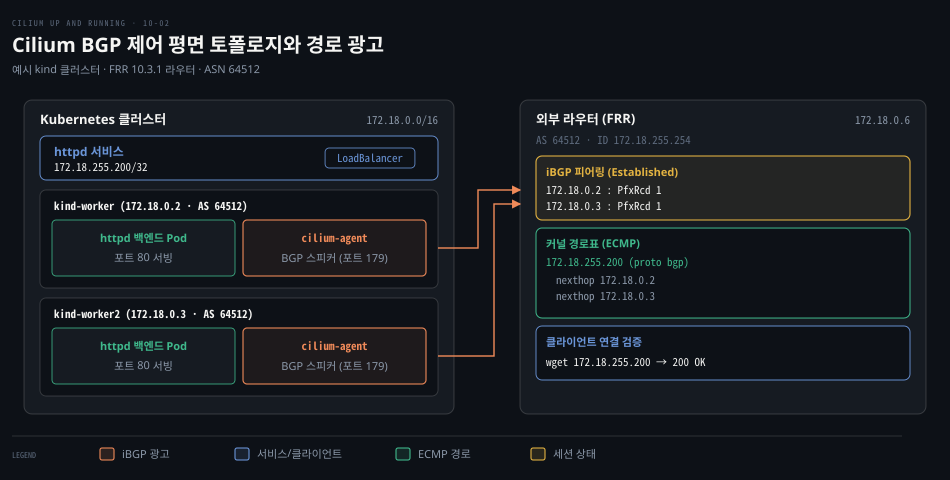
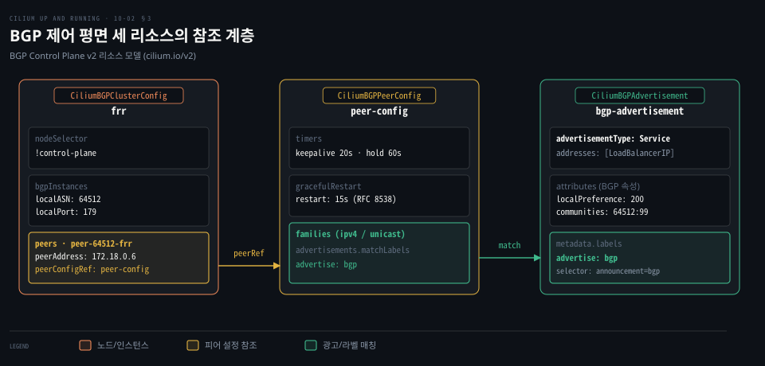
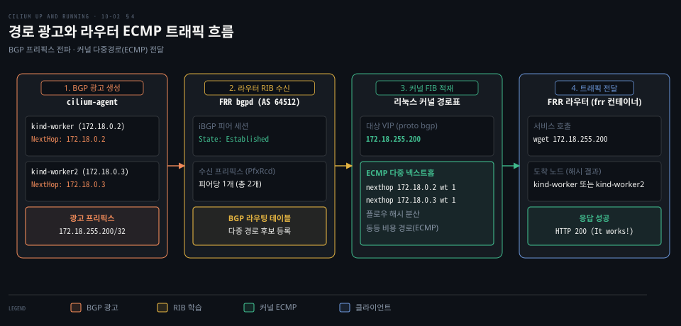

# BGP 는 피어 라우터에 Pod 와 서비스 대역 경로를 광고한다

---

> Cilium BGP 제어 평면은 노드를 BGP 스피커로 동작시켜 외부 라우터에 서비스 VIP 경로를 광고하고, L3 라우팅과 ECMP 로 다중 노드 부하 분산과 빠른 장애 복구를 제공합니다.


## 핵심 요약

> 이 편의 중심 생각은 동일 L2 서브넷에 묶이지 않고 데이터센터 라우터와 직접 경로를 교환해 서비스를 외부 네트워크에 안정적으로 노출한다는 것입니다.

L2 Announcements 방식은 ARP 에 의존하므로 클라이언트가 동일 브로드캐스트 도메인에 머물러야 하고 트래픽이 단일 노드로 몰립니다. 반면 **BGP**(Border Gateway Protocol) 제어 평면은 3계층 라우팅을 활용해 서브넷 경계를 넘어 대규모 네트워크로 서비스를 확장합니다.

Cilium 은 v1.16 부터 BGP Control Plane v2 리소스 모델을 도입했습니다. 노드 BGP 인스턴스를 맡는 `CiliumBGPClusterConfig`, 피어 공통 속성을 정의하는 `CiliumBGPPeerConfig`, 실제 광고 대역을 지정하는 `CiliumBGPAdvertisement` 로 책임을 분리했습니다. 이 리소스들이 결합해 외부 라우터와 iBGP 세션을 맺고 서비스의 LoadBalancer IP 를 광고합니다.

외부 라우터는 복수 노드로부터 동일 서비스 VIP 경로를 학습해 동등 비용 경로로 등록합니다. 외부 트래픽은 커널의 해시 기반 **ECMP**(Equal-Cost Multi-Path)로 여러 노드에 나뉩니다. 특정 노드가 죽으면 hold timer 만료 뒤 그 노드의 경로가 철회되어 나머지 노드로 트래픽이 모이고, 에이전트 재시작 때는 Graceful Restart 가 경로를 유지해 줍니다.




## 학습 목표

> 이 편을 읽고 나면 다음을 설명할 수 있습니다.

1. L2 Announcements 방식의 서브넷 한계를 극복하기 위해 BGP 제어 평면을 도입하는 이유를 설명할 수 있습니다.
2. 외부 라우터(FRR)와 클러스터 노드가 iBGP 피어를 맺고 세션 상태를 전이하는 과정을 설명할 수 있습니다.
3. Cilium BGP 제어 평면의 세 리소스가 노드·피어·광고 정책을 분리해 연결하는 구조를 설명할 수 있습니다.
4. 외부 라우터가 수신한 프리픽스를 ECMP 다중 넥스트홉으로 적재하고 부하를 분산하는 원리를 설명할 수 있습니다.
5. BGP 광고 대상으로 PodCIDR 대신 Kubernetes Service(LoadBalancerIP)를 권장하는 운영상의 이유를 설명할 수 있습니다.


## 1. L2 를 넘는 망에는 경로를 광고해야 한다

> 동일 L2 서브넷을 벗어난 클라이언트는 ARP 로 노드의 MAC 주소를 찾을 수 없으므로, 라우터가 서비스 가상 IP 로 가는 길목을 알 수 있도록 L3 라우팅 프로토콜로 경로를 직접 광고해야 합니다.

외부 클라이언트에 서비스를 노출할 때 동일 서브넷에 머문다면 ARP 기반 L2 Announcements 로 충분할 수 있습니다. 하지만 실제 운영 환경의 클라이언트는 대개 라우터를 거쳐야 하는 다른 서브넷에 위치합니다. 2계층 브로드캐스트는 라우터 경계를 넘지 못합니다. 외부 네트워크가 VIP 에 닿으려면 같은 L2 망의 게이트웨이가 ARP 로 대신 학습하거나 별도 라우팅 설정이 있어야 하며, 노드 여럿으로 나눠 보낼 수도 없습니다.

또한 L2 Announcements은 한 시점에 오직 한 노드만 특정 서비스 IP 에 대한 ARP 요청에 응답합니다. 여러 워커 노드에 백엔드 Pod 가 떠 있어도 외부 트래픽은 단일 활성 노드로 집중됩니다. 해당 노드에 장애가 발생하면 클라이언트의 ARP 캐시가 만료될 때까지 서비스 장애가 이어집니다.

| 비교 항목 | L2 Announcements (ARP) | Cilium BGP Control Plane |
|---|---|---|
| 동작 계층 | 2계층 (데이터 링크) | 3계층 (네트워크) |
| 네트워크 도메인 | 동일 L2 서브넷 | L3 라우팅 네트워크 전체 |
| 트래픽 부하 분산 | 미지원 (단일 노드 집중) | 지원 (ECMP 기반 다중 노드 분산) |
| 장애 복구 속도 | 느림 (ARP 만료 대기) | 빠름 (hold timer 만료 시 경로 철회, 타이머로 조정) |
| 외부 장비 요구 사항 | 없음 (일반 L2 스위치) | BGP 지원 라우터 (FRR 등) |
| 배정 IP 범위 | 클러스터 노드 서브넷 내 제한 | 클러스터 서브넷 무관 임의 IP |

이 문제를 해결하는 표준 규격이 [AS 안과 AS 사이](../../../02_os/book/cntd_computer-networking-top-down/05-02.AS%20안과%20AS%20사이.md)에서 다루는 BGP 입니다. 각 워커 노드가 라우터와 BGP 메시지를 주고받으며 자신이 해당 서비스 IP 로 통하는 유효한 넥스트홉임을 알립니다. 네트워크 라우터는 이 정보를 바탕으로 표준 IP 라우팅을 수행하므로 클러스터 밖의 어떤 클라이언트라도 중간 라우터를 거쳐 서비스에 정상 도달합니다.


## 2. 실습 망은 라우터 하나와 노드들이 피어를 맺는 구조다

> 외부 라우터 장비와 BGP 로 연동하려면 클러스터 노드와 상위 장비 사이의 프로토콜 규격과 자율 시스템 번호를 사전에 일치시켜야 합니다.

클러스터 외부 라우터와 BGP 로 통신하려면 독립된 라우팅 환경을 어떻게 구성해야 할까요? 실습에서는 오픈소스 라우팅 스위트인 **FRR**(Free Range Routing)을 독립 컨테이너로 띄워 상위 라우터 역할을 맡깁니다.

예시 환경은 Docker 브리지 네트워크 `kind`(`172.18.0.0/16`) 위에서 동작합니다. 워커 노드 2대 `kind-worker`(`172.18.0.2`), `kind-worker2`(`172.18.0.3`)와 외부 라우터 `frr`(`172.18.0.6`)를 배치합니다. Helm 설치 시 `bgpControlPlane.enabled=true` 옵션으로 BGP 기능을 켭니다.

```bash
WORKER_IP=172.18.0.2
WORKER2_IP=172.18.0.3

sed -e "s/NEIGHBOR1/${WORKER_IP}/" \
    -e "s/NEIGHBOR2/${WORKER2_IP}/" \
    frr.conf.template | tee frr.conf
```

생성된 FRR 설정은 로컬 ASN `64512` 와 라우터 ID `172.18.255.254` 를 지정하고, 워커 노드 둘을 동일 AS 번호의 **iBGP**(internal BGP) 이웃으로 등록합니다.

```bash
router bgp 64512
  bgp router-id 172.18.255.254
  neighbor 172.18.0.2 remote-as 64512
  neighbor 172.18.0.3 remote-as 64512
  !
  address-family ipv4 unicast
    neighbor 172.18.0.2 activate
    neighbor 172.18.0.3 activate
  exit-address-family
```

FRR 컨테이너(`quay.io/frrouting/frr:10.3.1`)를 실행한 뒤 BGP 상태를 조회하면 초기 세션 상태를 볼 수 있습니다.

```bash
docker exec -it frr vtysh -c "show bgp summary wide"
# IPv4 Unicast Summary:
# BGP router identifier 172.18.255.254, local AS number 64512
# Neighbor     V   AS      MsgRcvd  MsgSent  Up/Down  State/PfxRcd
# 172.18.0.2   4   64512   0        0        never    Active
# 172.18.0.3   4   64512   0        0        never    Active
```

출력의 `State/PfxRcd` 항목이 `Active` 로 표시됩니다. BGP 에서 Active 는 라우터가 피어와의 TCP 179 포트 연결을 시도 중이나 상대가 아직 응답하지 않은 상태를 뜻합니다. 클러스터의 워커 노드 쪽에 피어링 설정을 아직 적용하지 않았기 때문입니다.

광고할 대상 애플리케이션으로는 `httpd` 서비스를 배포합니다. CiliumLoadBalancerIPPool 리소스로 `172.18.255.200/29` 대역을 풀로 등록해 두면 서비스 생성 시 해당 풀에서 외부 IP 가 배정됩니다.

```bash
kubectl get svc httpd
# NAME    TYPE           CLUSTER-IP     EXTERNAL-IP      PORT(S)        AGE
# httpd   LoadBalancer   10.96.64.189   172.18.255.200   80:31789/TCP   3m35s
```

서비스의 `EXTERNAL-IP` 에 `172.18.255.200` 이 부여되었습니다. 이제 이 VIP 경로를 외부 라우터에 알리는 제어 평면 정책을 작성할 차례입니다.


## 3. 세 리소스가 누구와·무엇을·어떻게 광고할지 나눈다

> BGP 피어 정보와 타이머, 광고 대역을 단일 설정에 묶어 두면 노드가 늘어나거나 광고 정책이 바뀔 때 중복과 설정 오류가 잦아집니다.

노드마다 피어 주소와 타이머, 광고 대역을 한 매니페스트에 얽어 두면 노드가 늘어날 때 유지보수가 어려워지지 않을까요? 과거의 `CiliumBGPPeeringPolicy` 는 단일 리소스에 모든 설정이 결합해 있었습니다. 현재 안정판([v1.20 공식 문서](https://docs.cilium.io/en/v1.20/network/bgp-control-plane/bgp-control-plane-configuration/))은 `cilium.io/v2` 아래 세 가지 커스텀 리소스로 책임을 분리합니다.

첫째는 노드 단위 BGP 인스턴스를 선언하는 `CiliumBGPClusterConfig` 입니다.

```yaml
apiVersion: cilium.io/v2
kind: CiliumBGPClusterConfig
metadata:
  name: frr
spec:
  nodeSelector:
    matchExpressions:
    - key: node-role.kubernetes.io/control-plane
      operator: DoesNotExist
  bgpInstances:
  - name: instance-64512
    localASN: 64512
    localPort: 179
    peers:
    - name: peer-64512-frr
      peerASN: 64512
      peerAddress: 172.18.0.6
      peerConfigRef:
        name: peer-config
```

`nodeSelector` 는 컨트롤 플레인을 제외한 워커 노드만 BGP 스피커로 지정합니다. `bgpInstances` 에 로컬 AS `64512` 와 수신 포트 `179` 를 선언하고, 피어 `172.18.0.6` 의 세부 설정은 `peerConfigRef` 로 `peer-config` 를 참조합니다. Cilium 이 179번 포트 인바운드 BGP 연결을 수신하려면 에이전트에 `CAP_NET_BIND_SERVICE` 권한이 필요합니다.

둘째는 피어링 세부 동작을 정의하는 `CiliumBGPPeerConfig` 입니다.

```yaml
apiVersion: cilium.io/v2
kind: CiliumBGPPeerConfig
metadata:
  name: peer-config
spec:
  timers:
    connectRetryTimeSeconds: 30
    keepAliveTimeSeconds: 20
    holdTimeSeconds: 60
  families:
    - afi: ipv4
      safi: unicast
      advertisements:
        matchLabels:
          advertise: "bgp"
  gracefulRestart:
    enabled: true
    restartTimeSeconds: 15
```

이 리소스는 연결 재시도(`30s`), 생존 확인(`20s`), 무응답 판단(`60s`) 등 BGP 타이머를 관리합니다. 이 중 hold time 은 세션 수립 때 두 피어 중 작은 값으로 정해집니다. RFC 8538 기반 **Graceful Restart** 는 에이전트 재시작 시 라우터가 유예 시간(`15s`) 동안 기존 경로를 보존하게 해 트래픽 단절을 막습니다. `advertisements.matchLabels` 는 라벨이 `advertise: bgp` 인 광고 정책만을 골라 세션에 싣습니다.

셋째는 실제로 광고할 프리픽스를 지정하는 `CiliumBGPAdvertisement` 입니다.

```yaml
apiVersion: cilium.io/v2
kind: CiliumBGPAdvertisement
metadata:
  name: bgp-advertisement
  labels:
    advertise: bgp
spec:
  advertisements:
    - advertisementType: "Service"
      service:
        addresses:
        - LoadBalancerIP
      selector:
        matchLabels:
          announcement: bgp
      attributes:
        localPreference: 200
        communities:
          standard:
          - "64512:99"
```

`metadata.labels` 의 `advertise: bgp` 가 PeerConfig 의 조건과 일치해 결합합니다. `advertisementType` 에는 `"Service"` 를 지정해 쿠버네티스 서비스를 광고합니다. `PodCIDR` 와 `CiliumPodIPPool` 도 지원합니다. native routing 에서 노드 간 경로를 채우는 데는 쓸모가 있지만([05-01](./05-01.Cilium%20데이터패스는%20같은%20노드는%20eBPF%20로%20바로%20넘기고%20다른%20노드는%20라우팅이나%20터널로%20잇는다.md) 참조), 외부 클라이언트를 Pod 에 직접 붙이면 바뀌는 Pod IP 를 클라이언트가 따라가야 하고 로드밸런싱·장애 감지도 없으므로 서비스 광고가 권장됩니다.

`service.addresses` 로 `LoadBalancerIP` 를 지정하고, `announcement: bgp` 라벨의 서비스만 골라 광고합니다. AS 내 우선순위를 높이는 `localPreference: 200` 과 BGP 커뮤니티 `64512:99` 도 함께 전달합니다.




## 4. 정책을 적용하면 라우터 경로표에 프리픽스가 생긴다

> BGP 매니페스트를 적용하더라도 피어 간 세션이 정상 수립되지 않거나 커널 경로표에 프리픽스가 누락되면 외부 트래픽이 유실됩니다.

세 매니페스트를 클러스터에 반영한 뒤 실제 세션이 연결되고 라우터 경로표에 프리픽스가 정상 등록되었는지 어떻게 검증할까요?

```bash
kubectl apply -f cilium-bgp-cluster-config.yaml
# ciliumbgpclusterconfig.cilium.io/frr created
kubectl apply -f cilium-bgp-advertisement.yaml
# ciliumbgpadvertisement.cilium.io/bgp-advertisement configured
kubectl apply -f cilium-bgp-peer-config.yaml
# ciliumbgppeerconfig.cilium.io/peer-config configured
```

설정이 적용되면 워커 노드의 Cilium 에이전트가 FRR 라우터와 BGP 핸드셰이크를 맺습니다. FRR 에서 다시 세션 요약을 확인합니다.

```bash
docker exec -it frr vtysh -c "show bgp summary"
# Neighbor     V   AS      MsgRcvd  MsgSent  Up/Down   State/PfxRcd
# 172.18.0.2   4   64512   205      203      01:06:53  1
# 172.18.0.3   4   64512   205      203      01:06:53  1
```

`State/PfxRcd` 가 `1` 로 바뀌어 세션이 `Established` 상태로 진입하고 유효한 프리픽스를 1개 수신했음을 보여줍니다. 클러스터 내부에서도 `cilium` CLI 도구로 피어링 상태와 실제 내보낸 광고 경로를 조회할 수 있습니다.

```bash
cilium bgp peers
# Node          Peer        State        Uptime  Family        Adv
# kind-worker   172.18.0.6  established  1h8m    ipv4/unicast  2
# kind-worker2  172.18.0.6  established  1h8m    ipv4/unicast  2

cilium bgp routes advertised ipv4 unicast peer 172.18.0.6
# Node          Prefix             NextHop
# kind-worker   172.18.255.200/32  172.18.0.2
# kind-worker2  172.18.255.200/32  172.18.0.3
```

에이전트 파드 안의 `cilium-dbg bgp peers` 와 `cilium-dbg bgp routes` 로도 동일한 세션과 경로가 확인됩니다. 각 노드가 프리픽스 `172.18.255.200/32` 의 넥스트홉으로 자신의 노드 IP(`172.18.0.2`, `172.18.0.3`)를 실어 보냅니다. 라우터의 커널 라우팅 테이블(FIB)을 확인해 전달 경로를 검증합니다.

```bash
docker exec -it frr ip route
# default via 172.18.0.1 dev eth0
# 172.18.0.0/16 dev eth0 proto kernel scope link src 172.18.0.6
# 172.18.255.200 nhid 13 proto bgp metric 20
#           nexthop via 172.18.0.2 dev eth0 weight 1
#           nexthop via 172.18.0.3 dev eth0 weight 1
```

목적지 `172.18.255.200` 이 `proto bgp` 로 추가되고 두 노드에 가중치 `weight 1` 이 할당되었습니다. 비용이 같으므로 리눅스 커널은 **ECMP**(Equal-Cost Multi-Path)의 해시 정책(출발지·목적지 IP, 정책에 따라 포트·프로토콜까지)에 따라 플로우 단위로 트래픽을 두 노드에 나눕니다.



마지막으로 FRR 라우터 안에서 서비스 IP 로 웹 요청을 전송해 종단간 통신을 검증합니다.

```bash
docker exec -it frr wget -qO- 172.18.255.200
# <html><body><h1>It works!</h1></body></html>
```

요청이 BGP 광고 경로를 따라 워커 노드로 유입된 뒤, Cilium eBPF 데이터패스를 거쳐 백엔드 파드로 도달해 성공 응답을 반환합니다.


## 5. 정리

> BGP 제어 평면은 L2 서브넷의 한계를 넘어 데이터센터 라우터와 직접 호흡하며 고가용성과 ECMP 부하 분산을 달성하는 쿠버네티스 서비스 노출의 핵심 축입니다.

L2 Announcements은 브로드캐스트 도메인에 갇히고 단일 노드 병목이 발생합니다. 반면 BGP 제어 평면은 L3 라우팅으로 다중 서브넷에서도 유연하게 동작하며, ECMP 로 외부 로드밸런서 없이 여러 워커 노드에 트래픽을 분산합니다.

Cilium v1.20 의 BGP Control Plane v2 는 ClusterConfig, PeerConfig, Advertisement 로 설정을 모듈화했습니다. 피어링 파라미터 재사용성을 높이고 라벨 기반 정밀 광고를 지원하며 Graceful Restart 로 대규모 클러스터 운영 안정성을 보장합니다.


## 면접 대비

> Cilium BGP 제어 평면과 L3 서비스 노출에 관한 면접 질문입니다.

1. L2 Announcements 방식에 비해 BGP 제어 평면이 갖는 핵심 이점과 추가 인프라 요구 사항은 무엇입니까?
2. Cilium BGP 제어 평면에서 ClusterConfig, PeerConfig, Advertisement 로 리소스를 나눈 이유와 각 역할은 무엇입니까?
3. BGP Graceful Restart 의 동작 원리와 Cilium 에이전트 업그레이드 시 이 기능이 중요한 이유는 무엇입니까?
4. 외부 라우터가 동일한 서비스 VIP 에 대해 두 워커 노드로부터 경로를 수신했을 때 트래픽이 분산되는 원리는 무엇입니까?
5. BGP 광고 대상으로 개별 PodCIDR 대신 Kubernetes Service(LoadBalancerIP)를 권장하는 이유는 무엇입니까?


## 정답 (자답 후 펼치기)

> 면접 질문에 대한 키워드 중심의 모범 답안입니다.

### 정답 1 — L3 라우팅·ECMP 부하 분산·빠른 장애 복구

L2 Announcements은 동일 서브넷에 갇히고 단일 노드로 트래픽이 몰리며 장애 복구가 ARP 만료에 의존합니다. 반면 BGP 제어 평면은 3계층 라우팅으로 서브넷 경계를 넘고, ECMP 로 여러 노드에 부하를 분산하며 세션 기반 경로 철회로 다운타임을 줄입니다. 단 BGP 지원 라우터가 필요합니다.

### 정답 2 — 노드 바인딩·피어 공통 설정 재사용·광고 프리픽스 분리

설정 유지보수성과 재사용성을 높이기 위함입니다. `CiliumBGPClusterConfig` 는 노드 셀렉터로 BGP 인스턴스와 피어 연결을 묶습니다. `CiliumBGPPeerConfig` 는 타이머·주소 패밀리·Graceful Restart 등 공통 피어 속성을 정의합니다. `CiliumBGPAdvertisement` 는 서비스나 Pod 대역 중 무엇을 어떤 BGP 속성으로 내보낼지 라벨 선택자로 지정합니다.

### 정답 3 — RFC 8538 기반 경로 보존과 트래픽 블랙홀 방지

BGP 세션 단절 시 피어 라우터는 해당 노드 경로를 즉시 철회해 트래픽 블랙홀이 생깁니다. Graceful Restart 는 에이전트 재시작을 알리고 유예 시간 동안 라우터가 기존 경로를 보존하게 합니다. 유예 시간 안에 에이전트가 복구되어 세션을 재연결하면 패킷 유실 없이 통신이 이어집니다.

### 정답 4 — 동등 비용 다중 경로(ECMP)와 커널 해시 분산

외부 라우터 BGP 가 동일 프리픽스에 대해 두 노드로부터 동일 속성의 업데이트를 받으면 다중 넥스트홉을 생성합니다. 리눅스 커널 경로표에 동등 가중치(`weight 1`)로 등록되면 커널의 ECMP 해시 정책(출발지·목적지 IP, 정책에 따라 포트·프로토콜까지)에 따라 플로우 단위로 두 노드에 트래픽을 나눕니다.

### 정답 5 — 파드 생명주기 은닉과 쿠버네티스 서비스 추상화 보존

PodCIDR 광고는 native routing 에서 노드 간 경로를 채우는 데는 쓸모가 있지만, 외부 클라이언트를 Pod 에 직접 붙이면 바뀌는 Pod IP 를 클라이언트가 따라가야 합니다. 또한 파드 직결은 로드밸런싱이나 장애 감지 추상화를 제공하지 못합니다. 가상 IP 인 Service(LoadBalancerIP)를 광고해야 서비스 모델과 eBPF 부하 분산 혜택을 온전히 누릴 수 있습니다.


## 참고 자료

- Nico Vibert · Filip Nikolic · James Laverack, 《Cilium: Up and Running》, O'Reilly Media, 2026, ISBN 979-8-341-62299-9, Ch.10 Cluster Access.
- Cilium 공식 문서 BGP Control Plane: https://docs.cilium.io/en/v1.20/network/bgp-control-plane/bgp-control-plane/
- Cilium 공식 문서 BGP Configuration: https://docs.cilium.io/en/v1.20/network/bgp-control-plane/bgp-control-plane-configuration/
- Cilium 공식 문서 BGP Operation: https://docs.cilium.io/en/v1.20/network/bgp-control-plane/bgp-control-plane-operation/
- Cilium v1.20.2 소스 저장소: https://github.com/cilium/cilium/tree/v1.20.2
- Free Range Routing (FRR) 공식 문서: https://docs.frrouting.org/en/latest/bgp.html
- RFC 4271 BGP-4, RFC 8538 BGP Graceful Restart: https://www.rfc-editor.org/rfc/rfc4271, https://www.rfc-editor.org/rfc/rfc8538


## 관련 문서

- [Cilium 은 eBPF 데이터패스로 iptables 기반 CNI 의 한계를 넘는다](./01-01.Cilium%20은%20eBPF%20데이터패스로%20iptables%20기반%20CNI%20의%20한계를%20넘는다.md)
- [Cilium 데이터패스는 같은 노드는 eBPF 로 바로 넘기고 다른 노드는 라우팅이나 터널로 잇는다](./05-01.Cilium%20데이터패스는%20같은%20노드는%20eBPF%20로%20바로%20넘기고%20다른%20노드는%20라우팅이나%20터널로%20잇는다.md)
- [Cilium 은 kube-proxy 를 eBPF 로 대신하고 외부 서비스에 IP 와 경로를 붙인다](./06-01.Cilium%20은%20kube-proxy%20를%20eBPF%20로%20대신하고%20외부%20서비스에%20IP%20와%20경로를%20붙인다.md)
- [AS 안과 AS 사이](../../../02_os/book/cntd_computer-networking-top-down/05-02.AS%20안과%20AS%20사이.md)
