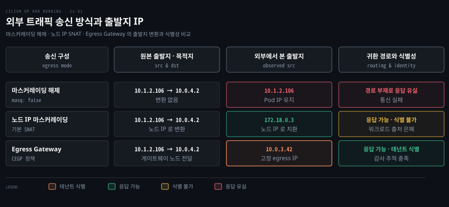
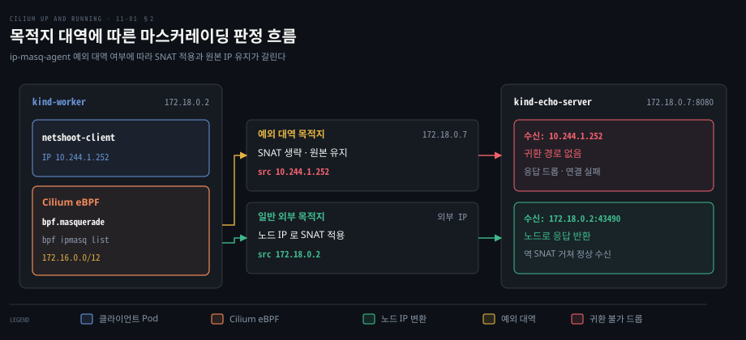
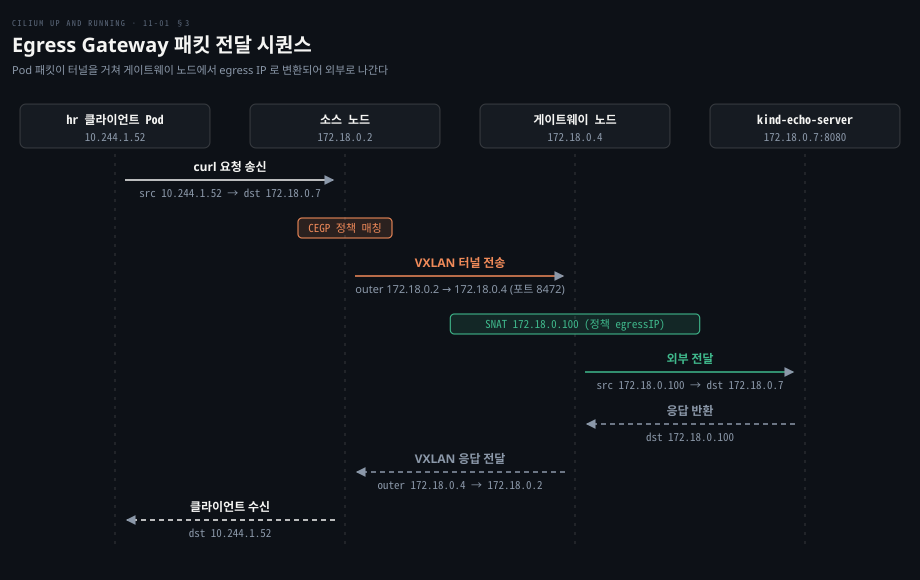
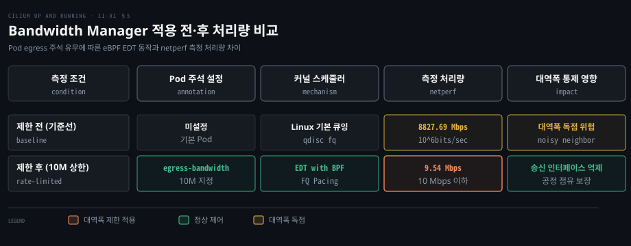

# Egress 는 마스커레이딩과 Egress Gateway 로 나가는 출발지를 정하고 Bandwidth Manager 로 속도를 묶는다

---

> 클러스터 밖으로 나가는 트래픽은 노드 IP 마스커레이딩으로 귀환 경로를 확보하고 정해진 노드와 고정 IP 가 필요한 외부 연동은 Egress Gateway 로 통제하며 대역폭 독점은 Bandwidth Manager 의 eBPF EDT 로 묶습니다.


## 핵심 요약

> 이 편의 중심 생각은 나가는 패킷의 출발지 IP 를 노드나 게이트웨이로 제어해 귀환 경로와 워크로드 식별성을 양립시키고 나가는 대역폭을 노드 인터페이스 앞단에서 묶는다는 것입니다.

Pod 대역은 클러스터 밖에서 라우팅되지 않으므로 나가는 패킷은 출발지를 바꿔야 응답이 돌아옵니다. Cilium 은 기본으로 노드를 떠나는 패킷의 출발지를 노드 IP 로 바꾸는 마스커레이딩을 적용합니다.

노드 IP 뒤로 숨으면 외부 방화벽은 어느 워크로드가 보냈는지 가리지 못합니다. Egress Gateway 는 고른 Pod 의 트래픽을 지정한 게이트웨이 노드로 보내 고정 IP 로 나가게 해 이 문제를 풉니다. Bandwidth Manager 는 Pod 주석을 읽어 EDT 로 송신 시각을 조절해 한 워크로드가 대역폭을 독점하지 못하게 합니다.




## 학습 목표

> 이 편을 읽고 나면 다음을 설명할 수 있습니다.

1. 외부 통신에서 사설 Pod IP 대신 노드 IP 마스커레이딩이 필요한 이유를 설명할 수 있습니다.
2. iptables 와 eBPF 마스커레이딩의 차이 및 ip-masq-agent 예외 대역 설정법을 구분할 수 있습니다.
3. Egress Gateway 가 전용 노드와 고정 egress IP 로 내보내는 데이터패스를 설명할 수 있습니다.
4. Egress Gateway 가 해결하는 네 가지 운영 요구를 비교할 수 있습니다.
5. Bandwidth Manager 가 Pod 주석과 eBPF EDT 로 송신 대역폭을 억제하는 원리를 말할 수 있습니다.


## 1. Pod IP 는 클러스터 밖에서 돌아올 길이 없다

> Pod 대역은 대부분 외부에서 라우팅되지 않는 사설 주소라서 출발지 주소를 노드 IP 로 변환하지 않으면 응답이 되돌아오지 못합니다.

쿠버네티스는 워크로드를 격리하려고 내부 가상 대역을 쓰며 PodCIDR 은 대부분 RFC 1918 사설 주소 블록에서 할당되고 외부 라우터에는 Pod IP 경로표가 없어서, 패킷이 Pod IP 를 단 채 도착해도 응답은 길을 찾지 못하고 유실됩니다.

반면 노드의 호스트 IP 는 외부 네트워크와 직접 연결되어 양방향 라우팅이 되므로 Cilium 은 클러스터를 벗어나는 모든 트래픽의 출발지 IP 를 Pod 가 도는 노드의 IPv4 또는 IPv6 주소로 변환합니다.

다대일 주소 변환을 **마스커레이딩**이라고 부릅니다. 출발지 주소를 바꾸는 SNAT 의 한 형태로 여러 Pod 의 사설 IP 를 노드 IP 하나 뒤로 숨기며, 세부 원리와 포트 매핑은 [IP — 데이터그램과 주소](../../../02_os/book/cntd_computer-networking-top-down/04-03.IP%20—%20데이터그램과%20주소.md)에서 다루었습니다.

예를 들어 `10.244.1.3` Pod 가 외부로 패킷을 보내면 Cilium 은 출발지 IP 를 노드 IP `172.18.0.3` 으로 바꿔 내보냅니다. 외부 시스템은 노드 IP 로 응답하고 노드의 연결 추적(iptables 모드면 netfilter, BPF 모드면 Cilium NAT 맵)이 응답을 원래 Pod `10.244.1.3` 으로 되돌려 줍니다.

기본으로 켜진 마스커레이딩은 `enable-ipv4-masquerade: false` 로 끄며 IPv6 는 `enable-ipv6-masquerade: false` 로 끕니다. 끄면 Pod IP 는 그대로 보이지만 응답이 돌아올 경로가 따로 필요합니다. 켜져 있으면 외부 방화벽에는 모든 패킷이 노드에서 온 것처럼 보여 어느 Pod 가 보냈는지 가릴 수 없습니다.


## 2. 마스커레이딩은 BPF 나 iptables 로 하고 예외 대역을 둘 수 있다

> Cilium 은 iptables 와 eBPF 두 마스커레이딩 구현을 지원하며 ip-masq-agent 로 특정 목적지 CIDR 의 트래픽은 변환 없이 원본 IP 를 유지할 수 있습니다.

무조건 노드 IP 로 변환하면 하부 네트워크가 이미 Pod IP 대역을 라우팅하는 환경에서도 불필요한 변환이 일어납니다. 예외는 어떻게 둘까요?

상태에 마스커레이딩 모드가 표시됩니다.

```bash
kubectl exec -it -n kube-system -c cilium-agent ds/cilium -- \
    cilium-dbg status | grep Masquerading
# Masquerading:            IPTables [IPv4: Enabled, IPv6: Disabled]
```

iptables 모드는 모든 리눅스 커널과 호환되지만 netfilter 체인을 순차 탐색합니다. **eBPF 기반 마스커레이딩**은 Helm 의 `bpf.masquerade=true` 로 켜며 현재 구현은 [kube-proxy 대체](./06-01.Cilium%20은%20kube-proxy%20를%20eBPF%20로%20대신하고%20외부%20서비스에%20IP%20와%20경로를%20붙인다.md)(KPR, BPF NodePort)에 의존합니다. 켜면 BPF Host-Routing 도 함께 켜져 eBPF 데이터패스 안에서 직접 SNAT 를 처리합니다.

로컬 노드의 PodCIDR 로 향하는 트래픽에는 마스커레이딩을 적용하지 않습니다. 또 [Cilium 데이터패스](./05-01.Cilium%20데이터패스는%20같은%20노드는%20eBPF%20로%20바로%20넘기고%20다른%20노드는%20라우팅이나%20터널로%20잇는다.md)의 네이티브 라우팅 모드를 쓸 때는 `ipv4-native-routing-cidr` 대역 전체에 대해 마스커레이딩을 건너뛸 수 있습니다.

[Cilium IPAM 모드](./04-01.Cilium%20IPAM%20모드는%20Pod%20대역을%20누가%20나눠%20주는지로%20갈린다.md)의 Multi-Pool 처럼 여러 대역을 쓰는 환경에서는 **ip-masq-agent** 기능을 켭니다.

```yaml
kubeProxyReplacement: true
bpf:
  masquerade: true
ipMasqAgent:
  enabled: true
```

설정 후 `cilium-dbg status` 에 eBPF 기반 ip-masq-agent 가 활성화로 나타나며 기본으로 예약된 사설 대역이 예외 목록에 들어갑니다.

```bash
kubectl exec -it ds/cilium -n kube-system -- cilium-dbg bpf ipmasq list
# IP PREFIX/ADDRESS
# 198.18.0.0/15
# 198.51.100.0/24
# 203.0.113.0/24
# 100.64.0.0/10
# 169.254.0.0/16
# 172.16.0.0/12
# 192.0.2.0/24
# 192.88.99.0/24
# 192.168.0.0/16
# 240.0.0.0/4
# 10.0.0.0/8
# 192.0.0.0/24
```

`ConfigMap` 으로 예외 대역을 재정의할 수 있습니다.

```yaml
apiVersion: v1
kind: ConfigMap
metadata:
  name: ip-masq-agent
  namespace: kube-system
data:
  config: |
    nonMasqueradeCIDRs:
    - 10.0.0.0/8
    - 172.16.0.0/12
    - 192.168.0.0/16
    masqLinkLocal: true
```

클라이언트 Pod `netshoot-client`(`10.244.1.252`)는 노드 `kind-worker`(`172.18.0.2`)에서 돕니다. ConfigMap 을 적용하기 전, 같은 kind 네트워크에 붙인 외부 echo 서버(`172.18.0.7:8080`)에 요청을 보내면 서버 로그에는 Pod IP 가 아니라 노드 IP 가 찍힙니다.

```bash
docker logs kind-echo-server
# Echo server listening on port 8080.
# 172.18.0.2:43490 | GET /
```

같은 클라이언트 Pod 에서 예외 대역 `172.16.0.0/12` 에 속한 echo 서버(`172.18.0.7:8080`)로 요청을 보냅니다. 예외 대역이라 SNAT 가 생략되어 tcpdump 에 원본 Pod IP 가 그대로 찍힙니다.

```bash
13:26:18.143095 IP 10.244.1.252.46382 > 172.18.0.7.8080: Flags [S]
13:26:18.143166 IP 172.18.0.7.8080 > 10.244.1.252.46382: Flags [S.]
```

하지만 외부 서버에는 `10.244.1.0/24` 로 향하는 경로가 없어 응답이 드롭되고 연결이 중단됩니다. 그래서 Pod 대역 라우팅이 없는 환경에서는 마스커레이딩이 필수입니다.




## 3. Egress Gateway 는 정해진 노드와 IP 로 나가게 한다

> Egress Gateway 는 특정 Pod 라벨이나 네임스페이스의 외부 트래픽을 전용 게이트웨이 노드로 보내 정책의 고정 egress IP 로 변환해 송신합니다.

마스커레이딩은 스케줄링 위치에 따라 출발지 IP 가 매번 바뀌므로 외부 레거시 시스템이나 SaaS 가 고정 IP 기반 접근 제어를 요구하면 쓸 수 없습니다.

**Egress Gateway** 는 특정 Pod 라벨이나 네임스페이스의 트래픽을 전용 게이트웨이 노드로 모아 보내고, 그 노드가 정책의 고정 IP 로 출발지를 변환합니다.

노드 `172.18.0.3` 의 Pod `10.1.2.106` 이 배정된 egress IP `10.0.3.42` 를 달고 게이트웨이 노드를 거쳐 외부 서비스 `10.0.4.2` 에 접속한다고 합시다. 서비스는 출발지를 `10.0.3.42` 로 보므로 원래 테넌트까지 추적할 수 있습니다. 마스커레이딩만 쓰면 같은 접속이 `172.18.0.3 > 10.0.4.2` 로 보여 어느 Pod 가 보냈는지 구분할 수 없습니다.

Egress Gateway 는 BPF 마스커레이딩과 KPR 을 함께 켜야 동작합니다. 데이터패스는 egress 정책 맵(`cilium_egress_gw_policy_v4`, 정의는 [policy.go](https://github.com/cilium/cilium/blob/v1.20.2/pkg/maps/egressmap/policy.go))을 조회해 정책에 지정된 보조 IP 로 SNAT 를 수행합니다.

```yaml
kubeProxyReplacement: true
egressGateway:
  enabled: true
devices:
  - eth0
bpf:
  masquerade: true
```

전용 게이트웨이 노드(`kind-worker3`, `kind-worker4`)에 테인트(`egress-gw:NoSchedule`)를 걸고 eth0 인터페이스에 보조 IP 를 추가합니다.

```bash
docker exec kind-worker3 ip addr add 172.18.0.100/16 dev eth0
docker exec kind-worker4 ip addr add 172.18.0.101/16 dev eth0
```

`CiliumEgressGatewayPolicy`(CEGP) 리소스가 동작을 정의합니다. 대상 Pod 를 고르는 `selectors`, 외부 대상 대역 `destinationCIDRs`, 게이트웨이 노드와 출발지 주소를 정하는 `egressGateway` 블록을 씁니다.

```yaml
apiVersion: cilium.io/v2
kind: CiliumEgressGatewayPolicy
metadata:
  name: hr-egress
spec:
  destinationCIDRs:
  - "172.18.0.0/16"
  selectors:
  - namespaceSelector:
      matchLabels:
        name: hr
  egressGateway:
    nodeSelector:
      matchLabels:
        egress-gw: "hr"
    egressIP: 172.18.0.100
# sales 테넌트는 name: sales-egress, namespaceSelector name: sales,
# nodeSelector egress-gw: sales, egressIP: 172.18.0.101 로 대칭 구성합니다.
```

노드에 라벨을 붙이고 `hr`·`sales` 네임스페이스의 클라이언트 Pod 에서 외부 서버로 접속하면 테넌트 전용 보조 IP 가 기록됩니다.

```bash
docker logs kind-echo-server
# 172.18.0.101:57060 | GET /
# 172.18.0.100:50318 | GET /
```

eBPF egress 맵으로도 매핑을 확인합니다.

```bash
kubectl exec -it -n kube-system <cilium 에이전트 Pod> -- cilium-dbg bpf egress list
# Source IP    Destination CIDR   Egress IP      Gateway IP
# 10.0.2.194   172.18.0.0/16      172.18.0.101   172.18.0.3
# 10.0.2.251   172.18.0.0/16      0.0.0.0        172.18.0.4
```

Source IP 는 정책이 고른 각 Pod 의 IP 이고 Gateway IP 는 `nodeSelector` 가 고른 게이트웨이 노드의 내부 IP 입니다. Egress IP 는 지정된 게이트웨이 노드에서만 정책의 값이 적용되고 나머지 노드에서는 `0.0.0.0` 입니다. 이 출력은 에이전트 Pod 마다 달라 채워지는 Egress IP 행이 다릅니다.

클러스터가 네이티브 라우팅 모드여도 Egress Gateway 트래픽은 소스 노드와 게이트웨이 노드 사이를 **항상 내부 VXLAN 터널(UDP 8472)** 로 캡슐화해 지납니다. 원본 Pod 의 보안 신원(identity)을 VXLAN 헤더의 VNI 필드에 담아 전달해야 게이트웨이 노드가 정책을 판정하고 역캡슐화할 수 있기 때문입니다. 터널 구조는 [Cilium 데이터패스](./05-01.Cilium%20데이터패스는%20같은%20노드는%20eBPF%20로%20바로%20넘기고%20다른%20노드는%20라우팅이나%20터널로%20잇는다.md)에서 다루었습니다.

```bash
tcpdump -r egress_vxlan.pcap
# IP 172.18.0.2.38007 > 172.18.0.4.8472: OTV, flags [I]
# IP 10.244.1.52.47312 > 172.18.0.7.8080: Flags [S], seq 3065752045, …
```

캡처에서 소스 노드 `172.18.0.2` 가 바깥 헤더의 출발지, 게이트웨이 노드 `172.18.0.4` 가 목적지이며 안쪽에는 원래 패킷(`10.244.1.52 > 172.18.0.7`)이 그대로 보존됩니다. 아래 시퀀스 도식도 이 값을 따르고 SNAT 주소는 `hr-egress` 정책의 `egressIP` 인 `172.18.0.100` 입니다.

Egress Gateway 는 선택된 노드 하나로 고정되며 헬스체크 기반 장애 조치는 없습니다. v1.20 은 `egressGateways` 목록으로 여러 게이트웨이에 엔드포인트를 나눠 배정할 수 있지만 게이트웨이가 바뀌면 기존 연결은 끊깁니다.




## 4. 방화벽 허용 목록과 테넌트 추적에 쓴다

> Egress Gateway 는 멀티테넌트 감사 추적, 민감 워크로드의 목적지 제한, 환경별 송신 경로 분리, 외부 SaaS 연동의 고정 IP 허용 목록이라는 네 가지 운영 요구를 충족합니다.

Egress Gateway 는 언제 쓸까요? 첫째는 **테넌트별 전용 egress IP** 할당입니다. 멀티테넌트 클러스터에서 부서별 워크로드가 같은 노드를 공유해도 네임스페이스별 고정 IP 를 나누면 외부 시스템의 감사 로그만으로 접속 주체를 추적할 수 있습니다.

둘째는 **신뢰할 수 있는 목적지로의 송신 제한**입니다. 금융 결제 시스템처럼 민감한 네임스페이스의 트래픽을 고정 egress IP 로 내보내면 결제 게이트웨이 방화벽이 그 IP 만 허용할 수 있습니다. `destinationCIDRs` 는 게이트웨이로 보낼 트래픽을 고르는 조건일 뿐이고 그 밖의 트래픽은 표준 마스커레이딩을 따르므로, 다른 곳으로 나가는 것을 막는 일은 CEGP 가 아니라 [네트워크 정책](./12-01.Cilium%20정책은%20라벨에서%20만든%20identity%20로%20허용을%20판정하고%20정책이%20붙으면%20기본%20거부가%20된다.md)이 맡습니다.

셋째는 **환경별 송신 경로 통제**입니다. 개발·스테이징·프로덕션이 한 클러스터에 공존할 때 개발 워크로드는 인터넷으로 직접 나가고 프로덕션 워크로드는 보안 관제 장비가 있는 전용 게이트웨이 노드를 거치게 분리할 수 있습니다.

넷째는 **SaaS 연동 시 고정 IP 허용 목록 요건** 충족입니다. Snowflake, GitHub, Datadog 같은 외부 SaaS 는 IP allowlist 를 강제합니다. 워커 노드가 오토스케일링으로 늘고 줄어도 Egress Gateway 의 고정 IP 를 등록해 두면 무중단 연동을 유지할 수 있습니다.


## 5. Bandwidth Manager 는 Pod 주석으로 나가는 속도를 묶는다

> Bandwidth Manager 는 개별 노드 수준에서 동작하며 Pod 주석과 eBPF 기반 EDT 스케줄러로 나가는 트래픽의 대역폭을 지정한 상한으로 제한합니다.

출발지 IP 를 통제해도 한 Pod 가 노드의 대역폭을 독점하면 다른 Pod 가 패킷 지연과 버퍼 유실을 겪는 **잡음이웃** 문제가 일어납니다.

**Bandwidth Manager** 는 노드 단위로 Pod 의 송신 대역폭을 공정하게 분배하고 상한을 강제합니다. 라우팅과 IP 를 다루는 Egress Gateway 와 달리 노드의 물리 인터페이스 앞단에서 패킷 전송 타이밍을 통제합니다.

리눅스 커널의 전역 sysctl 설정을 조작해야 해서 중첩 네임스페이스 구조의 kind 클러스터에서는 동작하지 않으므로 베어메탈 서버, 가상머신, Azure Kubernetes Service(AKS) 같은 클라우드 관리형 클러스터가 필요합니다. 기본으로 꺼져 있어 켜야 합니다.

```bash
helm upgrade cilium cilium/cilium --version 1.20.2 \
    --namespace kube-system \
    --reuse-values \
    --set bandwidthManager.enabled=true
kubectl -n kube-system rollout restart ds/cilium
```

상태에서 Bandwidth Manager 가 EDT 로 동작 중임을 봅니다.

```bash
kubectl -n kube-system exec ds/cilium -- \
    cilium-dbg status | grep BandwidthManager
# BandwidthManager:        EDT with BPF [CUBIC] [eth0]
```

**EDT**(Earliest Departure Time)는 eBPF 와 리눅스 FQ 큐잉 디스플린을 결합한 패킷 전송 기법입니다. eBPF 프로그램이 패킷마다 출발 예정 시각인 skb 의 tstamp 를 Pod 별 속도 상한에 맞춰 적어 둡니다. 이 일은 [edt.h](https://github.com/cilium/cilium/blob/v1.20.2/bpf/lib/edt.h) 의 `edt_sched_departure` 가 맡습니다. 물리 장치의 FQ 큐잉 디스플린은 그 시각이 될 때까지 패킷을 내보내지 않아 부드럽게 페이싱합니다.

커널 5.18 이상에서는 `bandwidthManager.bbr=true` 를 추가해 BBR 혼잡 제어를 Pod 트래픽에 적용할 수 있습니다. 지연 기반 혼잡 제어 원리는 [고속 망과 지연 기반 혼잡 제어](../../../02_os/book/tii_tcp-ip-illustrated/16-04.고속%20망과%20지연%20기반%20혼잡%20제어는%20창%20증가%20규칙과%20혼잡%20신호를%20바꾼다.md)에서 다루었습니다.

처리량을 측정하려고 두 노드에 `netperf-server`(`10.0.1.14`)와 `netperf-client`(`10.0.2.156`) Pod 를 나눠 배치합니다.

```bash
kubectl exec netperf-client -- netperf -t TCP_MAERTS -H "10.0.1.14"
# Recv   Send    Send
# Socket Socket  Message  Elapsed
# Size   Size    Size     Time     Throughput
# bytes  bytes   bytes    secs.    10^6bits/sec
# 131072 16384   16384    10.00    8827.69
```

`TCP_MAERTS` 는 서버에서 클라이언트로 대용량 스트림을 쏘는 단방향 테스트이며 제한이 없는 기준선 처리량은 8,827.69 Mbps(약 8.8 Gbps)입니다.

서버 Pod 에 이그레스 대역폭을 10 Mbps 로 제한하는 주석을 부여합니다.

```bash
kubectl annotate pod/netperf-server kubernetes.io/egress-bandwidth="10M"
# pod/netperf-server annotated
```

에이전트가 주석을 감지해 데이터패스에 제약을 주입하면 같은 테스트의 처리량이 즉시 9.54 Mbps 로 억제됩니다.

```bash
# 재측정 결과
# 131072 16384   16384    10.00   9.54
```

주목할 점은 `kubernetes.io/ingress-bandwidth` 주석과의 차이입니다. 인그레스 제한은 이미 회선을 타고 들어온 패킷을 노드 수신단에서 처리하므로 링크 소진을 사전에 막지 못합니다. 이그레스 제한은 송신 Pod 앞단에서 방출 자체를 억제해 노드 네트워크의 공정성을 지킵니다.




## 면접 대비

> 마스커레이딩, Egress Gateway, Bandwidth Manager 에 관한 면접 질문입니다.

1. 외부로 나가는 트래픽에 마스커레이딩이 필수인 이유와 그 한계는 무엇입니까?
2. iptables 모드와 eBPF 모드의 차이 및 ip-masq-agent 의 역할을 설명해 보십시오.
3. Egress Gateway 의 전제 조건과 데이터패스가 조회하는 맵은 무엇입니까?
4. 소스 노드와 게이트웨이 노드 사이 트래픽이 네이티브 라우팅 모드에서도 항상 VXLAN 인 이유는 무엇입니까?
5. Bandwidth Manager 의 eBPF EDT 원리와 인그레스 제한 대비 이그레스 제한의 이점을 설명해 보십시오.


## 정답 (자답 후 펼치기)

> 면접 질문에 대한 키워드 중심의 모범 답안입니다.

### 정답 1 — 귀환 경로 확보와 식별성 상실

Pod IP 대역은 비라우팅 사설 주소(RFC 1918)라 외부 시스템이 응답할 경로가 없으므로 노드 IP 로 출발지를 바꾸고 노드가 응답을 원래 Pod 로 역변환합니다. 한계는 모든 트래픽이 노드 IP 로 일원화되어 방화벽과 감사 시스템이 개별 Pod·네임스페이스를 구별하지 못한다는 점입니다.

### 정답 2 — 체인 탐색 제거와 예외 대역 우회

iptables 모드는 netfilter 체인을 순차 탐색하지만 eBPF 모드는 커널 데이터패스 안의 맵 조회로 SNAT 를 직접 수행합니다. ip-masq-agent 는 이미 Pod 라우팅이 되는 RFC 1918·사내 대역을 관리해 그 대역의 패킷은 SNAT 없이 원본 Pod IP 를 유지합니다.

### 정답 3 — 보조 IP SNAT 와 정책 맵 조회

BPF 마스커레이딩과 KPR 을 함께 켜야 하고, 데이터패스가 egress 정책 맵(`cilium_egress_gw_policy_v4`)을 조회해 정책의 보조 IP 로 출발지를 치환합니다.

### 정답 4 — 게이트웨이 경유와 VNI 신원 보존

Pod 의 보안 신원이 유실되면 안 되므로 Cilium 은 Pod identity 를 VXLAN 의 VNI 필드에 담아 게이트웨이 노드로 보냅니다. 게이트웨이 노드는 이를 바탕으로 정책을 판정하고 역캡슐화한 뒤 전용 Egress IP 로 SNAT 합니다.

### 정답 5 — skb 타임스탬프 EDT 페이싱과 앞단 차단

eBPF 가 skb 타임스탬프로 각 패킷의 조기 방출 시각을 정하고 물리 장치의 FQ 가 그 시각에 맞춰 페이싱합니다. 인그레스 제한은 이미 회선을 타고 들어온 패킷을 수신단에서 버려 낭비를 막지 못하지만 이그레스 제한은 송신 Pod 앞단에서 방출 자체를 억제해 링크 독점을 막습니다.


## 참고 자료

- Nico Vibert, Filip Nikolic, James Laverack, 《Cilium: Up and Running》, O'Reilly Media, 2026, ISBN 979-8-341-62299-9, Chapter 11 "Cluster Egress".
- Cilium 공식 문서 Egress Gateway: https://docs.cilium.io/en/v1.20/network/egress-gateway/
- Cilium 공식 문서 Masquerading: https://docs.cilium.io/en/v1.20/network/concepts/masquerading/
- Cilium 공식 문서 Bandwidth Manager 및 BBR: https://docs.cilium.io/en/v1.20/operations/performance/tuning/#bandwidth-manager
- Cilium v1.20.2 Helm 값 정의: https://github.com/cilium/cilium/blob/v1.20.2/install/kubernetes/cilium/values.yaml


## 관련 문서

- [Cilium Up and Running — 정독 인덱스](./README.md)
- [Cilium 은 eBPF 데이터패스로 iptables 기반 CNI 의 한계를 넘는다](./01-01.Cilium%20은%20eBPF%20데이터패스로%20iptables%20기반%20CNI%20의%20한계를%20넘는다.md)
- [Cilium 은 에이전트·CNI 플러그인·오퍼레이터로 나눠 노드와 클러스터를 맡는다](./02-01.Cilium%20은%20에이전트·CNI%20플러그인·오퍼레이터로%20나눠%20노드와%20클러스터를%20맡는다.md)
- [Cilium IPAM 모드는 Pod 대역을 누가 나눠 주는지로 갈린다](./04-01.Cilium%20IPAM%20모드는%20Pod%20대역을%20누가%20나눠%20주는지로%20갈린다.md)
- [Cilium 데이터패스는 같은 노드는 eBPF 로 바로 넘기고 다른 노드는 라우팅이나 터널로 잇는다](./05-01.Cilium%20데이터패스는%20같은%20노드는%20eBPF%20로%20바로%20넘기고%20다른%20노드는%20라우팅이나%20터널로%20잇는다.md)
- [Cilium 은 kube-proxy 를 eBPF 로 대신하고 외부 서비스에 IP 와 경로를 붙인다](./06-01.Cilium%20은%20kube-proxy%20를%20eBPF%20로%20대신하고%20외부%20서비스에%20IP%20와%20경로를%20붙인다.md)
- [Cilium 정책은 라벨에서 만든 identity 로 허용을 판정하고 정책이 붙으면 기본 거부가 된다](./12-01.Cilium%20정책은%20라벨에서%20만든%20identity%20로%20허용을%20판정하고%20정책이%20붙으면%20기본%20거부가%20된다.md)
- [IP — 데이터그램과 주소](../../../02_os/book/cntd_computer-networking-top-down/04-03.IP%20—%20데이터그램과%20주소.md)
- [고속 망과 지연 기반 혼잡 제어는 창 증가 규칙과 혼잡 신호를 바꾼다](../../../02_os/book/tii_tcp-ip-illustrated/16-04.고속%20망과%20지연%20기반%20혼잡%20제어는%20창%20증가%20규칙과%20혼잡%20신호를%20바꾼다.md)
