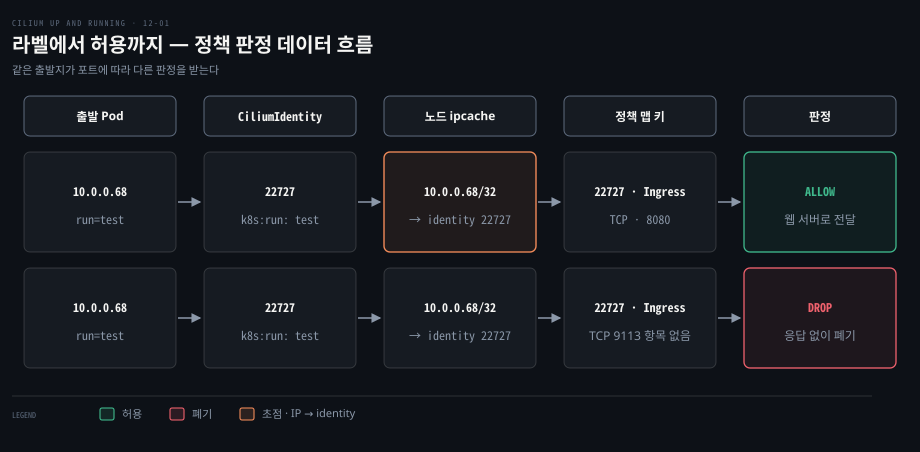
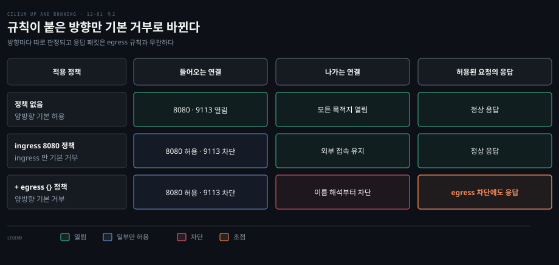

# Cilium 정책은 라벨에서 만든 identity 로 허용을 판정하고 정책이 붙으면 기본 거부가 된다

---

> 라벨 묶음의 identity 번호로 출발지를 알아보고 정책 맵에서 허용을 판정하며, 규칙이 붙은 방향은 기본 거부로 바뀝니다.


## 핵심 요약

> 허용 판정은 Pod IP 가 아니라 라벨에서 만든 identity 번호에 걸리고, 미리 계산된 맵 조회 두 번으로 끝납니다.

Pod IP 는 바뀌고 같은 CIDR 을 나눠 쓰므로 IP 에 역할을 묶는 방화벽은 무력해집니다. Cilium 은 라벨 묶음마다 identity 번호를 붙이고, 노드의 eBPF 맵 `cilium_ipcache_v2` 가 IP 를 그 번호로 바꿔 줍니다.

기본 모드에서는 정책이 없으면 모두 허용합니다. 정책이 한 방향에 규칙을 두면 그 방향은 기본 거부가 되어 8080 만 허용해도 9113 이 막히고 빈 egress 규칙은 이름 해석까지 막습니다. 허용된 요청의 응답은 egress 규칙과 무관하게 나가고, 값이 매번 다른 라벨은 identity 폭증을 부르므로 뺍니다.




## 학습 목표

> 이 편을 읽고 나면 다음을 설명할 수 있습니다.

1. `toPorts` 로 포트를 제한하고 백엔드 포트를 적는 이유를 설명할 수 있습니다.
2. 규칙이 붙은 방향만 기본 거부로 바뀌는 원리와 `enableDefaultDeny` 의 역할을 구분할 수 있습니다.
3. 빈 egress 규칙이 이름 해석을 막는데도 허용된 요청의 응답이 나가는 이유를 말할 수 있습니다.
4. IP 가 identity 로 바뀌고 정책 맵 키로 판정되는 순서를 설명할 수 있습니다.
5. 값이 매번 다른 라벨이 identity 폭증을 부르는 과정과 `labels` 값으로 줄이는 방법을 설명할 수 있습니다.


## 1. 첫 정책은 라벨로 허용할 쪽을 고른다

> 정책이 없으면 모든 포트가 열려 있고, 허용할 포트와 상대만 적으면 나머지는 닫힙니다.

웹 서버 Pod 하나가 서비스 포트와 메트릭 포트를 함께 엽니다. Pod IP 는 다시 뜰 때마다 바뀌는데 메트릭 포트만 막으려면 무엇을 지목해야 할까요?

클러스터 밖의 보안 장비는 같은 CIDR 의 Pod 를 구별하지 못합니다. Cilium 정책은 NetworkPolicy 를 확장해 네임스페이스·라벨·서비스 위에서 이 일을 합니다. 기본기는 [NetworkPolicy 와 DNS](../networking-and-kubernetes/04-03.NetworkPolicy와%20DNS%20—%20클러스터%20안의%20방화벽과%20이름.md), 첫 실습은 [kind 설치와 정책 실습](./03-01.Cilium%20은%20kind%20클러스터에%20Helm%20으로%20설치하고%20정책과%20Hubble%20로%20동작을%20확인한다.md)을 보십시오.

예시 NGINX 웹 서버는 8080 으로 텍스트를, 9113 으로 메트릭을 내며 Pod 라벨은 `app.kubernetes.io/name: webserver` 입니다. ClusterIP 서비스 `webserver` 는 80 을 8080 으로, 헤드리스 서비스 `webserver-metrics` 는 9113 으로 연결합니다. 정책이 없을 때 테스트 Pod 에서 부르면 둘 다 응답합니다.

```bash
kubectl run test -it --rm --image nicolaka/netshoot -- bash

test:~# curl -sm1 webserver
Hello from Cilium Up and Running!

test:~# curl -s webserver-metrics:9113/metrics | grep ^nginx_http_requests
nginx_http_requests_total 1
```

TCP 8080 ingress 만 허용하는 정책(`webserver-8080-only.yaml`)을 적용합니다.

```yaml
apiVersion: cilium.io/v2
kind: CiliumNetworkPolicy
metadata:
  name: webserver
  namespace: default
spec:
  endpointSelector:
    matchLabels:
      app.kubernetes.io/name: webserver
  ingress:
    - toPorts:
      - ports:
        - port: "8080"
          protocol: TCP
```

`CiliumNetworkPolicy` 는 같은 네임스페이스의 엔드포인트만 고릅니다. `endpointSelector` 는 겉보기에 Pod 라벨을 고르지만 정확히는 Cilium identity 의 보안 라벨을 고릅니다(3절). `ingress` 는 들어오는 방향의 규칙 목록이며 어느 하나에만 맞아도 허용됩니다. 여기서 `toPorts` 는 TCP 8080 만 받습니다.

클라이언트는 서비스 포트 80 으로 요청하는데 정책에는 8080 을 적었습니다. Cilium 은 서비스 주소 변환을 정책 적용보다 먼저 하므로 정책이 패킷을 볼 때 목적지는 이미 백엔드의 8080 입니다. 포트는 따옴표로 감싸며 `"http"` 같은 이름도 됩니다.

적용 뒤 같은 테스트를 반복하면 8080 은 통과하고 9113 은 타임아웃입니다.

```bash
test:~# curl -sm1 webserver
Hello from Cilium Up and Running!

test:~# curl -m1 webserver-metrics:9113/metrics
curl: (28) Connection timed out after 1001 milliseconds
```

정책은 eBPF 로 L3·L4 에서 적용되고 막힌 패킷은 응답 없이 버려져 백엔드 Pod 는 9113 트래픽을 보지 못합니다.


## 2. 정책이 하나라도 붙으면 그 방향은 기본 거부가 된다

> 정책이 엔드포인트를 고르고 어느 방향에든 규칙을 두면, 그 방향은 명시적으로 허용한 트래픽만 통과합니다.

9113 을 막는 규칙은 쓰지 않았는데 왜 막혔을까요? 나가는 방향은 어떻게 되었을까요?

정책이 고르는 대상은 Pod 마다 만들어지는 CiliumEndpoint 입니다([에이전트 편](./02-01.Cilium%20은%20에이전트·CNI%20플러그인·오퍼레이터로%20나눠%20노드와%20클러스터를%20맡는다.md)).

```bash
kubectl get ciliumendpoint
NAME                        SECURITY IDENTITY   ENDPOINT STATE   IPV4
webserver-ff7cc8f4c-69hbs   11866               ready            10.0.0.13
webserver-ff7cc8f4c-z64mk   11866               ready            10.0.0.16
webserver-ff7cc8f4c-lxlwc   11866               ready            10.0.0.21
```

에이전트는 `endpointSelector` 가 고르는 엔드포인트를 계산해 그 Pod 의 eBPF 데이터패스를 다시 프로그래밍합니다. 이를 정책 재생성(policy regeneration)이라 하며 Pod 를 띄우거나 정책을 바꿀 때 일어납니다.

정책은 Pod 를 나간 직후와 들어가기 직전에 적용되어 호스트 네트워크 Pod(`spec.hostNetwork=true`)에는 걸 수 없고 이는 [호스트 정책](https://docs.cilium.io/en/v1.20/security/host-firewall/)이 맡습니다.

### 규칙이 붙은 방향만 기본 거부로 바뀐다

기본 정책 적용 모드(`policyEnforcementMode: default`)에서는 엔드포인트를 고르는 정책이 없으면 모든 트래픽이 허용됩니다. 정책이 엔드포인트를 선택하고 한 방향에 규칙을 두면 그 방향은 어느 규칙에든 맞아야만 통과하는 기본 거부가 됩니다([기본 정책 설명](https://docs.cilium.io/en/v1.20/security/policy/intro/#endpoint-default-policy)).

9113 은 허용하는 규칙이 없어서 막힙니다. 이 정책은 ingress 만 제한하므로 NGINX Pod 에서 나가는 트래픽은 자유롭고, 임시 컨테이너로 확인합니다.

```bash
pod_name="$(kubectl get po -l app.kubernetes.io/name=webserver -o=jsonpath='{.items[0].metadata.name}')"
kubectl debug \
    --image nicolaka/netshoot \
    --profile=general \
    -it "${pod_name}" -- bash

webserver-ff7cc8f4c-4wvtw:~# curl -sI https://cilium.io | head -n1
HTTP/2 200
```

정책은 한 Pod 안의 프로세스 사이에는 적용되지 않아, 임시 컨테이너는 9113 이 막혀 있어도 `localhost` 로 접근합니다.

### 정책이 있어도 기본 거부를 켜지 않을 수 있다

다른 트래픽에 영향 없이 쓰려면 `spec.enableDefaultDeny` 를 씁니다. `ingress`·`egress` 키를 따로 줄 수 있고 생략하면 둘 다 `true` 입니다.

```yaml
spec:
  enableDefaultDeny:
    ingress: false
    egress: false
```

이 설정은 그 정책에만 적용되어, 기본 거부가 켜진 다른 정책이 같은 엔드포인트를 고르면 기본 거부가 됩니다. L7 정책에는 적용되지 않습니다([L7 정책 편](./13-01.L7%20정책은%20Envoy%20로%20HTTP%20메서드와%20경로를%20검사한다.md)).

### 빈 egress 규칙은 이름 해석까지 막는다

침해된 NGINX Pod 의 횡적 이동을 막으려면 나가는 방향도 닫아야 합니다. egress 규칙이 하나 있는 정책(`webserver-no-egress.yaml`)을 더합니다.

```yaml
spec:
  egress:
    - {}
```

빈 egress 규칙이 있으므로 egress 는 기본 거부가 되고, 이 규칙은 어떤 트래픽에도 맞지 않아 나가는 트래픽이 전부 막힙니다. 임시 컨테이너에서 다시 부르면 이름 해석에서 걸립니다.

```bash
webserver-ff7cc8f4c-4wvtw:~# curl -m1 https://cilium.io
curl: (28) Resolving timed out after 1002 milliseconds
```

DNS 질의도 나가는 트래픽이라 같이 막힙니다. 반대로 들어오는 요청은 응답을 받습니다.

```bash
test:~# curl -s webserver
Hello from Cilium Up and Running!
```

egress 가 전부 막혔는데 응답이 나가는 것은 허용된 요청의 응답이기 때문입니다. egress 규칙은 Pod 가 먼저 여는 연결을 판정하고, 허용된 ingress 연결의 응답 패킷은 같은 연결로 취급되어 거부에 걸리지 않습니다.




## 3. IP 대신 라벨 묶음을 identity 번호로 쓴다

> 보안의 핵심은 통신하는 쪽이 누구인지 아는 것이고, Cilium 은 그 신원을 IP 가 아니라 라벨에서 만듭니다.

IP 기반 방화벽은 쿠버네티스에서 왜 깨질까요? 신원은 L3 에서는 IP 주소로, L7 에서는 HTTP 베어러 토큰이나 mTLS 같은 프로토콜 안의 인증 정보로 정합니다. L7 은 애플리케이션이나 프록시가 구현해야 하고, L3 는 조율이 필요 없지만 IP 에 의미가 있다는 가정에 기댑니다.

옛 관리자는 서버 대역 `198.51.100.0/24` 의 TCP 5432 만 데이터베이스에 접근시켰습니다. 서버 다섯 대의 대역을 `198.51.100.104/29` 로 줄이고 나머지를 다른 용도에 돌렸는데 방화벽이 그대로면 새 기기들이 데이터베이스에 접근합니다. ARP(IPv4)나 ND(IPv6) 위조로 IP 를 엉뚱한 기기에 배정시키는 공격도 막지 못합니다.

### IP 를 identity 번호로 한 번 바꾼다

Cilium 은 L3 에서 IP 로 신원을 정하되 그 사상을 클러스터 정보로 자동으로 만듭니다. CNI 라서 Pod 가 시작되거나 멈추기 전에 에이전트에 먼저 묻기에 에이전트는 어느 IP 가 어느 신원인지 늘 최신으로 압니다.

그래도 IP 와 정책 결정을 직접 잇지는 않습니다. Pod 가 뜨고 질 때마다 연결을 고쳐야 하기 때문입니다. 대신 **Cilium identity** 라는 간접 계층을 두어, 데이터패스가 마주칠 모든 IP 를 안팎 가리지 않고 identity 하나에 사상합니다.

이 사상은 노드마다 있는 eBPF 맵 **IP 캐시**(ipcache, `cilium_ipcache_v2`)에 담깁니다([소스](https://github.com/cilium/cilium/blob/v1.20.2/pkg/maps/ipcache/ipcache.go)). 내용은 에이전트 안의 `cilium-dbg bpf ipcache list` 로 봅니다.

| IP 대역 | identity | 설명 |
|---|---|---|
| `192.0.2.33/32` | `30525` | Pod IPv4 주소 |
| `0.0.0.0/0` | `9` | world-ipv4 identity 로 보내는 IPv4 전체 대역 |
| `::/0` | `10` | world-ipv6 identity 로 보내는 IPv6 전체 대역 |
| `233.252.0.17/32` | `1` | 호스트 IPv4 주소 |
| `203.0.113.0/24` | `16777218` | 정책에서 정의한 IPv4 CIDR 대역 |
| `2001:db8::34c9/128` | `30525` | Pod IPv6 주소 |
| `2001:db8:ffff::/48` | `16777219` | 정책에서 정의한 IPv6 CIDR 대역 |

`1`·`2`·`9`·`10` 은 번호가 미리 정해진 예약 identity 입니다. `1` 은 로컬 호스트(`reserved:host`), `2` 는 클러스터 밖(`reserved:world`)이며([용어집](https://docs.cilium.io/en/v1.20/gettingstarted/terminology/#special-identities)), `2` 하나로 묶이는 것은 단일 스택일 때뿐입니다. 이 표는 듀얼 스택이라 IPv4 전체 대역은 world-ipv4(`9`), IPv6 전체 대역은 world-ipv6(`10`)이 됩니다([`GetWorldIdentityFromIP`](https://github.com/cilium/cilium/blob/v1.20.2/pkg/identity/numericidentity.go), [`identity.h`](https://github.com/cilium/cilium/blob/v1.20.2/bpf/lib/identity.h)).

`16777218` 은 `2^24 + 2` 이고 비트 24(0부터 셈, 값 `1 << 24`)가 로컬(CIDR) 범위를 표시해, CIDR 규칙이 만드는 identity 는 이 대역에 놓입니다([`IdentityScopeLocal`](https://github.com/cilium/cilium/blob/v1.20.2/pkg/identity/numericidentity.go)).

### 가장 긴 접두사가 이긴다

각 항목은 CIDR 하나를 identity 하나에 묶고, 맵은 가장 긴 접두사 일치(LPM)로 동작해 한 IP 에 여러 항목이 맞으면 가장 구체적인 접두사가 쓰입니다. `192.0.2.33` 은 `192.0.2.33/32` 와 `0.0.0.0/0` 에 모두 맞지만 앞쪽이 더 구체적이므로 `30525` 가 됩니다.

데이터패스는 매 패킷마다 모든 항목을 훑지 않습니다. ipcache 는 LPM 트라이라서 일치를 찾는 시간이 항목 수가 아니라 IP 주소 길이에 비례합니다.

출발지 신원을 이미 알면 조회하지 않습니다. 같은 노드 Pod 의 트래픽이 그렇고, 캡슐화 모드에서는 identity 가 VXLAN·Geneve 헤더의 VNI 필드에 실려 옵니다([데이터패스 편](./05-01.Cilium%20데이터패스는%20같은%20노드는%20eBPF%20로%20바로%20넘기고%20다른%20노드는%20라우팅이나%20터널로%20잇는다.md)).

### identity 는 번호가 아니라 라벨로 고른다

identity 의 메타데이터는 클러스터 안에 `CiliumIdentity` 커스텀 리소스로 저장됩니다.

```bash
kubectl get ciliumidentity -o yaml \
    -l 'io.kubernetes.pod.namespace=default'
items:
- apiVersion: cilium.io/v2
  kind: CiliumIdentity
  metadata:
    name: "22727"
  security-labels:
    k8s:io.kubernetes.pod.namespace: default
    k8s:run: test
- apiVersion: cilium.io/v2
  kind: CiliumIdentity
  metadata:
    name: "24505"
  security-labels:
    k8s:io.kubernetes.pod.namespace: default
    k8s:app.kubernetes.io/name: webserver
```

`CiliumIdentity` 는 클러스터 범위 리소스입니다([소스](https://github.com/cilium/cilium/blob/v1.20.2/pkg/k8s/apis/cilium.io/v2/types.go)). 그래서 `--namespace` 로 걸러 낼 수 없고 `io.kubernetes.pod.namespace` 라벨 필터를 씁니다. 이 필터는 객체 라벨을 보며 `security-labels` 아래의 보안 라벨은 보지 않습니다. 같은 웹 서버 라벨 묶음이 앞에서는 `11866`, 여기서는 `24505` 로 보이는 것은 두 출력이 서로 다른 클러스터 실행에서 나왔기 때문이며, 한 클러스터 안에서는 같은 라벨 묶음이 같은 번호를 씁니다.

identity 를 번호로 직접 가리키는 곳은 없고 항상 보안 라벨로 고릅니다. 보안 라벨의 주된 출처는 Pod 라벨이어서 `k8s:app.kubernetes.io/name: webserver` 는 NGINX Pod 의 라벨에서 왔고, 1절에서 `endpointSelector` 가 보안 라벨을 고른다고 한 이유가 이것입니다. 라벨이 같은 웹 서버 복제본은 `11866` 을 공유합니다.

### 판정은 맵 조회 두 번이다

엔드포인트마다 에이전트가 미리 계산해 둔 정책 맵(`cilium_policy_v3_` 접두사, [소스](https://github.com/cilium/cilium/blob/v1.20.2/pkg/maps/policymap/policymap.go))이 있고, identity·방향·프로토콜·포트의 조합마다 취할 동작을 담습니다.

출발지 `10.0.0.68` 의 패킷은 ipcache 에서 identity `22727` 로 풀립니다. `run=test` 를 허용하는 규칙이 있다면 정책 맵의 `(22727, Ingress, TCP, 8080)` 항목에서 ALLOW 를 얻고, 맞는 항목이 없는 `TCP 9113` 은 기본 거부로 폐기됩니다.

결과는 전달, 폐기, 사용자 공간 프록시 전달 중 하나이며, 에이전트가 미리 계산해 두므로 패킷 경로에는 조회 두 번만 남습니다.


## 4. identity 에 쓰는 라벨을 줄여 identity 폭증을 막는다

> 값이 매번 다른 라벨이 identity 를 늘리고 새 identity 마다 전 노드가 정책 맵을 다시 계산하므로, identity 에 반영할 라벨을 제한합니다.

배치 시스템이 만드는 Pod 마다 작업 ID 라벨이 붙으면 정책 엔진에는 무슨 일이 생길까요?

Cilium 은 기본적으로 Pod 의 거의 모든 라벨을 보안 라벨로 취급합니다. 작업마다 라벨 값이 달라지면 새 identity 가 생기고 그때마다 모든 에이전트가 노드의 모든 엔드포인트 정책 맵을 다시 계산하므로, 변동이 큰 클러스터에서는 맵 용량이 바닥나거나 성능이 떨어집니다.

해법은 identity 에 반영할 라벨을 제한하는 것이며, 빠진 라벨은 `endpointSelector` 나 `fromEndpoints` 같은 셀렉터로 고를 수 없게 됩니다.

Helm `labels` 값에 라벨 패턴을 공백으로 구분해 적고, `!` 를 붙이면 제외할 라벨입니다.

```yaml
labels: "!controller-uid !job-name"
```

이 예는 `controller-uid` 와 `job-name` 으로 시작하는 라벨을 뺍니다. 규칙은 다음과 같습니다([라벨 제한 문서](https://docs.cilium.io/en/v1.20/operations/performance/scalability/identity-relevant-labels/)).

- `io.kubernetes`·`pod-template-hash`·`annotation.*` 같은 라벨은 기본값에서도 제외되며 `labels` 값은 이 목록 뒤에 더해집니다.
- 패턴은 라벨 이름의 앞부분부터 맞는 정규식이며, 정확히 같아야 하면 `kind$` 처럼 `$` 를 씁니다.
- `!` 없는 포함 패턴을 두면 기본 포함 목록과 그 패턴에 맞는 라벨만 쓰입니다. `team` 하나만 적어도 `env=prod` 는 무시됩니다.
- 이미 있는 identity 는 그대로이며, 노드의 Cilium Pod 를 재시작하면 새 identity 가 만들어지고 안 쓰는 옛 identity 는 오퍼레이터가 정리합니다.

값이 바뀌는 라벨만 빼며, 빼기 전에 정책이 그 라벨을 셀렉터로 쓰는지 확인합니다.


## 면접 대비

> 정책과 identity 판정 원리에 관한 질문입니다.

1. IP 기반 L3 방화벽이 쿠버네티스에서 한계를 맞는 이유와 Cilium 의 해법을 설명해 보십시오.
2. 정책에 서비스 포트가 아니라 백엔드 Pod 포트를 적어야 하는 이유는 무엇입니까?
3. 정책 하나가 붙으면 왜 트래픽이 막히며, egress 를 전부 막은 Pod 가 응답할 수 있는 이유는 무엇입니까?
4. 패킷이 ipcache 와 정책 맵을 거쳐 허용되기까지의 순서와 조회를 건너뛰는 경우를 설명해 보십시오.
5. 값이 매번 다른 라벨이 성능을 떨어뜨리는 과정과 이를 막는 설정을 설명해 보십시오.


## 정답 (자답 후 펼치기)

> 질문별 모범 답안입니다.

### 정답 1 — 라벨 기반 identity

Pod IP 가 바뀌고 CIDR 을 나눠 쓰므로 IP 에 역할을 묶는 방화벽은 대역 조정 한 번에 무너집니다. Cilium 은 라벨 묶음에 identity 를 붙여 `IP → identity → 정책 맵` 간접 계층을 둡니다.

### 정답 2 — 서비스 변환 선행

서비스 주소 변환이 정책보다 먼저 일어나 정책이 보는 목적지는 이미 백엔드 포트 8080 이므로 `port` 는 8080 입니다.

### 정답 3 — 방향별 기본 거부

어느 방향에든 규칙이 있으면 그 방향은 규칙에 맞는 트래픽만 통과합니다. 빈 egress 규칙(`- {}`)은 어떤 트래픽에도 맞지 않아 나가는 연결과 이름 해석을 막고, 허용된 ingress 연결의 응답은 거부에 걸리지 않습니다.

### 정답 4 — 두 번의 조회

ipcache(LPM 트라이)에서 출발지 IP 를 identity 로 바꾸고 정책 맵의 `(identity, 방향, 프로토콜, 포트)` 항목으로 전달·폐기·프록시를 정합니다. 같은 노드 트래픽과 VNI 에 identity 가 실린 캡슐화 트래픽은 조회를 건너뜁니다.

### 정답 5 — identity 폭증

고유한 값의 라벨이 identity 에 들어가면 Pod 마다 새 identity 가 생겨 전 노드가 정책 맵을 다시 계산하므로 맵 고갈과 성능 저하를 부릅니다. Helm `labels` 에 `!controller-uid` 처럼 적어 제외하며, 제외한 라벨은 셀렉터로 쓸 수 없습니다.


## 참고 자료

- Nico Vibert, Filip Nikolic, James Laverack, 《Cilium: Up and Running》, O'Reilly Media, 2026, ISBN 979-8-341-62299-9, Chapter 12 "Network Policy".
- 정책 개요: https://docs.cilium.io/en/v1.20/security/policy/intro/
- 라벨 제한: https://docs.cilium.io/en/v1.20/operations/performance/scalability/identity-relevant-labels/
- 용어집: https://docs.cilium.io/en/v1.20/gettingstarted/terminology/
- Cilium v1.20.2 소스: https://github.com/cilium/cilium/tree/v1.20.2


## 관련 문서

- [다음 편 — 규칙·클러스터 범위·CIDR·거부](./12-02.여러%20규칙과%20클러스터%20범위·CIDR·거부%20규칙으로%20정책의%20경계를%20넓힌다.md)
