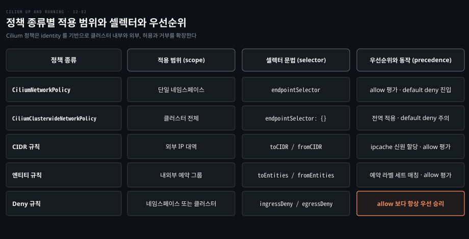
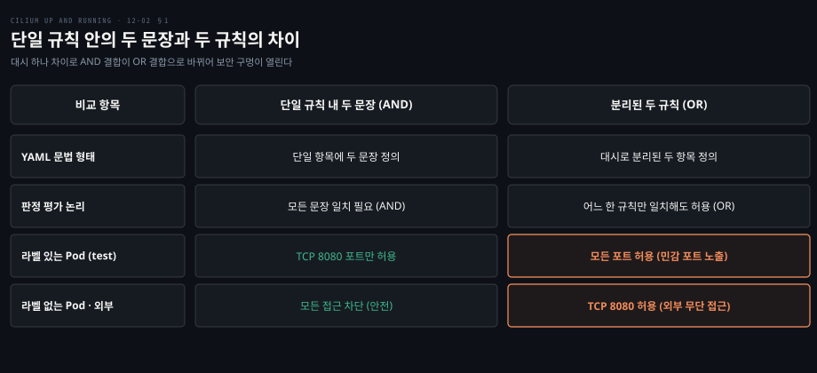
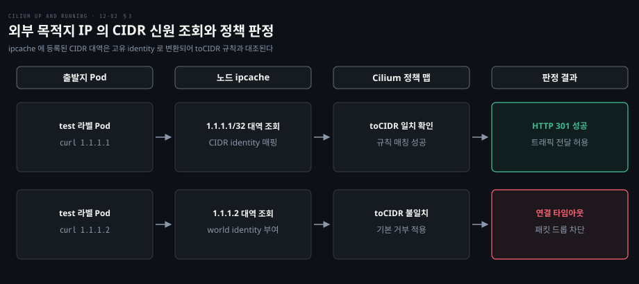
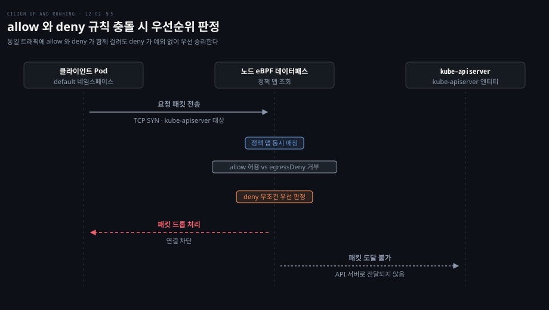

# 여러 규칙과 클러스터 범위·CIDR·거부 규칙으로 정책의 경계를 넓힌다

---

> 한 규칙 안의 조건은 AND, 규칙끼리는 OR 로 합쳐지고, 클러스터 범위 정책·CIDR 신원·deny 규칙이 네임스페이스와 클러스터 경계를 넘어 기준선을 세웁니다.


## 핵심 요약

> 결합 방식, 전역 적용 범위, 외부 IP 신원화, 거부 우선순위를 알면 네임스페이스 격리를 넘어 클러스터 전체의 방어망을 설계할 수 있습니다.

단일 규칙 안의 여러 statement 는 모두 충족해야 통과하는 AND 조건이고, 나열된 서로 다른 규칙들은 하나만 일치해도 통과하는 OR 조건입니다. 대시 하나로 문장과 규칙이 갈리므로 의도치 않은 포트 개방을 막으려면 이 구분이 필수입니다.

CiliumClusterwideNetworkPolicy 는 네임스페이스 경계를 넘어 클러스터 내 모든 엔드포인트에 일괄 규칙을 적용합니다. 외부 통신은 toCIDR 구문으로 IP 대역에 고유 identity 를 부여해 통제하고 Ingress 와 Gateway API 를 거쳐 내부 프록시 IP 로 바뀐 트래픽은 ingress 예약 엔티티로 식별합니다.

Cilium 정책 엔진은 무순서로 동작하며 에이전트가 사전 계산한 판정을 데이터패스의 정책 맵에 적재합니다. 이때 명시적 거부 규칙은 allow 규칙이나 정책 범위와 무관하게 항상 우선 승리하므로 견고한 베이스라인 통제 수단이 됩니다.




## 학습 목표

> 이 편을 읽고 나면 다음을 설명할 수 있습니다.

1. 한 규칙 안의 복수 조건(AND)과 복수 규칙 간 결합(OR)의 차이와 보안 영향을 설명할 수 있습니다.
2. CiliumClusterwideNetworkPolicy 가 전역 기본값을 설정하는 방식과 enableDefaultDeny 유의점을 구분할 수 있습니다.
3. 외부 IP 대역에 CIDR identity 가 부여되어 ipcache 에 등록되는 원리를 말할 수 있습니다.
4. Ingress 와 Gateway API 트래픽이 reserved:ingress 신원으로 처리되는 구조를 설명할 수 있습니다.
5. 무순서 평가 구조와 deny 규칙이 allow 규칙보다 항상 우선하는 판정 순위를 설명할 수 있습니다.


## 1. 셀렉터는 identity 를 고르고 규칙 여럿은 OR 로 합쳐진다

> 한 규칙 안에 적힌 셀렉터와 포트 조건은 모두 일치해야 하지만(AND), 규칙 목록에 나열된 규칙들은 하나라도 일치하면 허용됩니다(OR).

웹 서버(포트 8080)와 메트릭 엔드포인트(포트 9113)를 함께 운영할 때, 각 포트에 닿는 클라이언트 역할을 어떻게 분리할까요?
출발지 라벨과 목적지 포트를 잘못 결합하면 민감 포트가 원치 않는 클라이언트에 노출됩니다.

Cilium 정책에서는 **fromEndpoints** 구문으로 특정 보안 라벨을 가진 identity 만 골라 인그레스 트래픽을 허용합니다. 단일 인그레스 규칙 안에 fromEndpoints 와 toPorts 가 함께 선언된 예시입니다.

```yaml
# webserver-8080-from-endpoints.yaml
ingress:
  - fromEndpoints:
      - matchLabels:
          app.kubernetes.io/name: test
    toPorts: [{ports: [{port: "8080", protocol: TCP}]}]
```

규칙 안의 문장들은 모두 충족되어야 하는 AND 조건입니다. 패킷 목적지가 TCP 8080 포트이면서 출발지가 `app.kubernetes.io/name: test` 라벨을 가진 엔드포인트여야 허용됩니다. 라벨 없는 test 파드의 8080 요청은 타임아웃되고 라벨을 단 파드만 접속하며, 메트릭 서비스(9113)는 여전히 차단됩니다.

메트릭 수집기 파드가 9113 포트를 스크랩하도록 두 번째 인그레스 규칙을 추가합니다.

```yaml
# webserver-ingress-all.yaml 의 추가 규칙
- fromEndpoints:
    - matchLabels:
        io.kubernetes.pod.namespace: metrics
        app.kubernetes.io/name: metrics-collector
  toPorts: [{ports: [{port: "9113", protocol: TCP}]}]
```

`io.kubernetes.pod.namespace` 는 Cilium 이 파드의 네임스페이스 이름을 바탕으로 자동 주입하는 특수 라벨입니다. 사용자가 매니페스트에 같은 라벨을 적어도 Cilium 은 겹치는 특수 라벨을 무시합니다.

규칙 안의 문장들은 AND 결합이지만 규칙들 사이는 OR 결합입니다. 트래픽은 정의된 규칙 중 하나만 일치해도 통과합니다. 대시 하나로 단일 규칙이 두 규칙으로 갈라질 수 있습니다.

```yaml
# 단일 규칙 (AND 결합): test 파드만 8080 허용
- fromEndpoints:
    - matchLabels:
        app.kubernetes.io/name: test
  toPorts: [{ports: [{port: "8080", protocol: TCP}]}]
---
# 분리된 두 규칙 (OR 결합): toPorts 앞 대시로 인해 OR 평가
- fromEndpoints:
    - matchLabels:
        app.kubernetes.io/name: test
- toPorts: [{ports: [{port: "8080", protocol: TCP}]}]
```

두 번째 설정에서는 toPorts 앞의 대시가 규칙을 둘로 쪼갭니다. 그 결과 `app.kubernetes.io/name: test` 파드는 모든 포트에 접근할 수 있고 8080 포트는 외부를 포함한 모든 신원에 열립니다.




## 2. 클러스터 범위 정책으로 네임스페이스를 넘어 기본값을 깐다

> CiliumClusterwideNetworkPolicy 는 네임스페이스 격리를 유지하면서도 메트릭 수집기나 전역 감사와 같은 공통 허용 정책을 클러스터 전역에 일괄 배포합니다.

수많은 네임스페이스의 워크로드마다 메트릭 수집기 접근 허용 규칙을 일일이 반복 선언해야 할까요?
네임스페이스 단위 정책은 테넌트 격리를 보장하지만 공통 인프라 통신에는 중복과 누락을 부릅니다.

일반적인 CiliumNetworkPolicy(CNP)는 동일 네임스페이스 내 엔드포인트만 선택합니다. 반면 **CiliumClusterwideNetworkPolicy**(CCNP)는 클러스터 범위 객체로서 endpointSelector 를 통해 모든 네임스페이스의 파드를 대상으로 규칙을 적용합니다.

`endpointSelector: {}` 로 전체 파드를 선택하면서 기본 거부를 끄지 않으면 모든 파드의 통신이 일괄 차단되는 락아웃이 일어날 수 있습니다.

메트릭 수집기에만 전역 인그레스를 여는 안전한 설정입니다.

```yaml
apiVersion: cilium.io/v2
kind: CiliumClusterwideNetworkPolicy
metadata:
  name: clusterwide-metrics
spec:
  endpointSelector: {}
  enableDefaultDeny:
    ingress: false
  ingress:
    - fromEndpoints:
        - matchLabels:
            io.kubernetes.pod.namespace: metrics
            app.kubernetes.io/name: metrics-collector
      toPorts: [{ports: [{port: "9113", protocol: TCP}]}]
```

이와 함께 Cilium 은 미리 정의된 예약 라벨과 예약 identity, 그리고 엔티티를 제공합니다.

- **예약 라벨**(Reserved Label): `reserved:` 접두사를 가지며 Cilium 시스템이 직접 붙이는 라벨입니다.
- **예약 신원**(Reserved Identity): ID 1(`host`), ID 2(`world`), ID 6(`remote-node`), ID 7(`kube-apiserver`), ID 8(`ingress`) 등 특정 목적의 고정 identity 입니다.
- **엔티티**(Entity): 여러 예약 라벨을 묶은 내장 축약 셀렉터로 `fromEntities` 또는 `toEntities` 구문에서 사용합니다. 대표적으로 `all`, `world`, `host`, `ingress`, `kube-apiserver`, `cluster` 가 있습니다.

컨트롤 플레인이 외부에 있는 관리형 환경에서는 API 서버 identity 가 `reserved:kube-apiserver` 와 `reserved:world` 라벨을 동시에 가질 수 있습니다. 엔티티로 CoreDNS 의 인바운드·아웃바운드 흐름을 정의한 예시입니다.

```yaml
apiVersion: cilium.io/v2
kind: CiliumNetworkPolicy
metadata:
  name: coredns
  namespace: kube-system
spec:
  endpointSelector:
    matchLabels:
      k8s-app: kube-dns
  ingress:
    - toPorts: [{ports: [{port: "53", protocol: ANY}]}]
      fromEntities: [cluster]
  egress:
    - toPorts: [{ports: [{port: "6443", protocol: TCP}]}]
      toEntities: [kube-apiserver]
    - toPorts: [{ports: [{port: "53", protocol: ANY}]}]
      toEntities: [world]
```

단일 규칙 안에서 `toEndpoints` 와 `toEntities` 처럼 서로 다른 성격의 셀렉터를 섞는 것은 지원되지 않습니다. Cilium 은 적용 시점에 거부하지 않고 정책 상태를 `VALID: False` 로 표시하며, 무효가 된 정책은 다른 규칙까지 동작하지 않으므로 셀렉터 유형별로 규칙을 분리해야 합니다.


## 3. 클러스터 밖은 CIDR 과 엔티티로 고른다

> 클러스터 외부 IP 대역은 toCIDR 구문으로 고유한 identity 를 만들어 노드의 ipcache 에 등록하며 기본 설정에서는 내부 워크로드 IP 와 구분됩니다.

외부 공인 서비스나 지정 데이터베이스 IP 대역으로만 트래픽을 제한할 때, 라벨 없는 주소를 어떻게 정책에 인식시킬까요?
외부 IP 와 내부 파드 대역이 겹칠 때 잘못된 허용이 일어날 위험은 없을까요?

Cilium 은 외부 트래픽을 제어하기 위해 **toCIDR** 및 **fromCIDR** 구문을 제공합니다. 연속된 대역에서 일부 하위 대역을 빼려면 `toCIDRSet`·`fromCIDRSet` 의 `except` 를 씁니다([레이어 3 정책](https://docs.cilium.io/en/v1.20/security/policy/layer3/)).

정책에 특정 CIDR 대역이 선언되면 Cilium 은 해당 대역에 매핑되는 새로운 동적 identity 를 생성합니다. 각 노드의 eBPF 데이터패스가 참조하는 `ipcache` 맵이 갱신되어 그 IP 범위를 새 identity 에 연결합니다.

여기서 핵심 원칙이 있습니다. 기본 설정에서 CIDR 규칙은 **이미 identity 를 가진 파드·노드 IP 에 적용되지 않습니다**([레이어 3 정책](https://docs.cilium.io/en/v1.20/security/policy/layer3/)).
파드 IP 가 `233.252.0.17` 일 때 `233.252.0.0/24` 허용 규칙을 작성해도 그 파드의 패킷은 일치하지 않으므로 내부 트래픽은 fromEndpoints 나 fromEntities 로 통제합니다. Helm `policyCIDRMatchMode` 에 `pods`·`nodes` 를 주면 CIDR 로도 고를 수 있지만 identity 가 늘어나므로 기본값을 권장합니다.

외부 공용 DNS 서비스인 1.1.1.1 로의 아웃바운드만 허용하는 정책 예시입니다.

```yaml
apiVersion: cilium.io/v2
kind: CiliumNetworkPolicy
metadata:
  name: client
spec:
  endpointSelector:
    matchLabels:
      app.kubernetes.io/name: test
  egress:
    - toCIDR: ["1.1.1.1/32"]
```

정책 적용 뒤 라벨이 지정된 테스트 파드에서 외부 접근을 시험하면 1.1.1.1 은 HTTP 301 로 허용되고 1.1.1.2 는 타임아웃으로 차단됩니다. `1.1.1.2` 는 정책이 만든 CIDR 항목에 맞지 않아 전체 대역 항목의 world identity(단일 스택 `2`, 듀얼 스택의 IPv4 는 `9`)로 풀리고 기본 거부에 걸리기 때문입니다.




## 4. Ingress·Gateway 로 들어온 트래픽은 별도 identity 로 보인다

> 인그레스 컨트롤러나 Gateway API 의 Envoy 프록시를 통과한 패킷은 원래 클라이언트 IP 대신 노드의 내부 인그레스 IP 로 변환되어 ingress 신원을 갖습니다.

외부 사용자가 Ingress 나 Gateway API 로 들어올 때 백엔드 파드는 원본 공인 IP 를 기준으로 정책을 세워야 할까요?
프록시를 거치며 출발지 주소가 바뀌는 트래픽을 정책 엔진은 어떻게 식별할까요?

[Cilium Ingress](./07-01.Cilium%20Ingress%20는%20노드의%20Envoy%20로%20바깥%20HTTP%20를%20받고%20TLS%20를%20끝낸다.md) 와 [Gateway API](./07-02.Gateway%20API%20는%20역할별%20객체로%20라우팅을%20나누고%20가중치·헤더·동서%20트래픽까지%20맡는다.md) 환경에서 트래픽이 유입되면 노드마다 도는 Envoy(DaemonSet, [`envoy.enabled`](https://github.com/cilium/cilium/blob/v1.20.2/install/kubernetes/cilium/values.yaml))가 요청을 받습니다. 프록시가 백엔드 파드로 요청을 전달할 때 출발지 IP 는 외부 클라이언트 IP 가 아니라 노드의 파드 대역에서 자동 할당된 내부 인그레스 IP(예: `10.0.0.207`)로 교체됩니다.

따라서 백엔드 파드의 데이터패스에 도달하는 트래픽은 `world` 신원이 아니라 **ingress 예약 신원**(ID 8, `reserved:ingress`)을 갖습니다.

백엔드 파드가 외부 인그레스 트래픽을 정상 수신하려면 정책에서 ingress 엔티티를 명시적으로 허용해야 합니다.

```yaml
ingress:
  - fromEntities:
      - ingress
```

이 규칙이 없으면 백엔드 파드에 기본 거부가 활성화된 경우 Envoy 에서 전달된 인바운드 트래픽이 모두 폐기됩니다.


## 5. deny 규칙은 allow 보다 먼저 이긴다

> Cilium 정책은 무순서로 사전 계산되어 맵에 적재되고 동일 트래픽에 allow 와 deny 가 동시에 매칭될 때 deny 규칙이 예외 없이 항상 최우선으로 승리합니다.

특정 시스템 네임스페이스를 제외한 모든 워크로드의 API 서버 직접 접근을 전역 차단할 때 개별 테넌트의 정책이 이를 무력화할 수 있을까요?
상위 정책이 하위 정책에 덮어써질 위험은 없을까요?

Cilium 은 명시적으로 트래픽을 차단하는 **ingressDeny** 와 **egressDeny** 구문을 지원합니다. 거부 규칙도 엔드포인트에 정책이 적용된 것으로 간주되므로 `enableDefaultDeny: { egress: false }` 를 설정하지 않으면 그 방향(egress)의 나머지 정상 트래픽까지 기본 거부에 걸려 함께 차단됩니다([거부 정책](https://docs.cilium.io/en/v1.20/security/policy/deny/)).

`kube-system` 네임스페이스를 제외한 모든 파드의 API 서버 접근을 전역 차단하는 예시입니다.

```yaml
apiVersion: cilium.io/v2
kind: CiliumClusterwideNetworkPolicy
metadata:
  name: kube-api-deny
spec:
  endpointSelector:
    matchExpressions:
      - key: io.kubernetes.pod.namespace
        operator: NotIn
        values: [kube-system]
  enableDefaultDeny:
    egress: false
  egressDeny:
    - toEntities: [kube-apiserver]
```

cert-manager·Argo CD 처럼 자체 네임스페이스에서 API 서버에 접근해야 하는 워크로드가 있으면 `values` 목록에 그 네임스페이스도 넣어야 합니다.

Cilium 정책 평가에는 전통적인 방화벽과 같은 규칙 순서가 없습니다. 규칙이나 정책 파일의 순서와 무관하게 에이전트가 identity 별 판정 결과를 미리 계산해 정책 맵에 기록하고 데이터패스는 그 맵을 조회만 합니다([정책 개요](https://docs.cilium.io/en/v1.20/security/policy/intro/)).

정책 사이에서 allow 와 deny 가 충돌하면 Cilium 은 **deny 규칙을 항상 최우선으로 적용**합니다. 클러스터 범위든 네임스페이스 정책이든 어느 한 정책이라도 deny 를 선언했다면 해당 패킷은 드롭됩니다.

이 특성은 하위 테넌트의 allow 설정에 흔들리지 않는 전역 기준선을 세우게 돕습니다. 반면 deny 로 막은 흐름에는 그 정책을 고치지 않고서는 개별 allow 예외를 둘 수 없습니다.




## 6. 정리

> AND·OR 결합, 클러스터 전역 범위, 외부 CIDR 신원화, deny 최우선 원칙이 다계층 보안 경계를 이룹니다.

단일 규칙 내 statement 들은 AND 로 묶이고 서로 다른 규칙들은 OR 로 평가됩니다. 대시 하나로 포트 전체가 개방될 수 있으므로 문법 구분에 유의해야 합니다.

CiliumClusterwideNetworkPolicy 는 네임스페이스를 넘어 전역 기준선을 세우고 enableDefaultDeny 비활성화 여부를 정확히 통제해 락아웃을 막아야 합니다.

외부 통신은 toCIDR 를 통해 ipcache 에 등록되는 동적 identity 로 관리되며 기본 설정에서는 내부 파드 IP 에 적용되지 않습니다. Ingress 와 Gateway API 트래픽은 프록시 변환에 의해 ingress 예약 신원으로 식별됩니다.

정책 엔진은 무순서로 동작하며 deny 는 allow 보다 언제나 우선합니다.


## 면접 대비

> 복합 정책 문법, 전역 정책, CIDR 신원화, 거부 우선순위에 관한 질문입니다.

1. 단일 CiliumNetworkPolicy 내에서 fromEndpoints 와 toPorts 가 한 규칙에 선언될 때와 두 규칙으로 나뉠 때의 동작 차이를 설명해 보십시오.
2. CiliumClusterwideNetworkPolicy 에서 `endpointSelector: {}` 를 적용할 때 발생할 수 있는 위험과 대응 수단은 무엇입니까?
3. 외부 IP 통신을 제한할 때 toCIDR 구문이 작동하는 원리와, 클러스터 내부 Pod IP 에 CIDR 정책이 적용되지 않는 이유를 말해 보십시오.
4. Cilium Ingress 또는 Gateway API 를 거쳐 백엔드 Pod 로 전달되는 트래픽의 출발지 신원은 어떻게 처리됩니까?
5. Cilium 에서 동일한 트래픽에 대해 allow 규칙과 deny 규칙이 동시에 매칭될 때 어떤 결과가 나오며 그 이유는 무엇입니까?


## 정답 (자답 후 펼치기)

> 질문별 모범 답안입니다.

### 정답 1 — AND 결합과 OR 결합

한 규칙 안의 fromEndpoints 와 toPorts 는 AND 로 결합되어 지정 라벨 Pod 만 8080 에 접근합니다. 대시로 두 규칙을 분리하면 OR 조건이 되어, 해당 Pod 는 전 포트에 접근하고 8080 포트는 외부를 포함한 모든 신원에 개방됩니다.

### 정답 2 — 전역 기본 거부와 락아웃

`endpointSelector: {}` 는 모든 엔드포인트를 대상으로 하므로 allow 규칙에 없는 트래픽이 기본 거부되어 전체 통신이 끊기는 락아웃이 일어날 수 있습니다. 이를 막으려면 `enableDefaultDeny: { ingress: false }` 로 기본 거부를 꺼 두어야 합니다.

### 정답 3 — CIDR identity 와 내부 IP

toCIDR 대역이 선언되면 Cilium 은 새 동적 identity 를 발급하고 노드 ipcache 맵을 갱신합니다. 단, 기본 설정에서 CIDR 규칙은 이미 identity 가 있는 파드·노드 IP 에 적용되지 않아(`policyCIDRMatchMode` 로 바꿀 수 있습니다) 내부 트래픽이 외부 규칙에 잘못 매칭되는 사고를 막습니다.

### 정답 4 — ingress 예약 엔티티

Envoy 를 통과한 패킷은 출발지가 노드의 내부 인그레스 IP 로 바뀝니다. 따라서 백엔드 Pod 의 데이터패스는 이 트래픽을 외부 world 가 아닌 `reserved:ingress` 신원으로 인식하고 백엔드 Pod 는 `fromEntities: [ ingress ]` 를 허용해야 합니다.

### 정답 5 — deny 절대 우선

Cilium 정책 엔진은 무순서로 동작하며 에이전트가 identity 별 판정을 미리 계산해 맵에 적고 데이터패스는 조회만 합니다. allow 와 deny 가 충돌하면 네임스페이스나 구체성과 관계없이 deny 가 승리하므로 하위 테넌트의 allow 에 흔들리지 않는 전역 차단 기준선을 세울 수 있습니다.


## 참고 자료

- Nico Vibert, Filip Nikolic, James Laverack, 《Cilium: Up and Running》, O'Reilly Media, 2026, ISBN 979-8-341-62299-9, Chapter 12 "Network Policy".
- 정책 문서: https://docs.cilium.io/en/v1.20/security/policy/, https://docs.cilium.io/en/v1.20/security/policy/intro/
- L3·L4: https://docs.cilium.io/en/v1.20/security/policy/layer3/, https://docs.cilium.io/en/v1.20/security/policy/layer4/
- 거부 규칙·CRD: https://docs.cilium.io/en/v1.20/security/policy/deny/, https://docs.cilium.io/en/v1.20/network/kubernetes/policy/
- Cilium v1.20.2 소스: https://github.com/cilium/cilium/tree/v1.20.2


## 관련 문서

- [Cilium Ingress 는 노드의 Envoy 로 바깥 HTTP 를 받고 TLS 를 끝낸다](./07-01.Cilium%20Ingress%20는%20노드의%20Envoy%20로%20바깥%20HTTP%20를%20받고%20TLS%20를%20끝낸다.md)
- [Gateway API 는 역할별 객체로 라우팅을 나누고 가중치·헤더·동서 트래픽까지 맡는다](./07-02.Gateway%20API%20는%20역할별%20객체로%20라우팅을%20나누고%20가중치·헤더·동서%20트래픽까지%20맡는다.md)
- [전역 서비스와 전역 정책은 Cluster Mesh 위에서 클러스터 경계를 넘는다](./09-02.전역%20서비스와%20전역%20정책은%20Cluster%20Mesh%20위에서%20클러스터%20경계를%20넘는다.md)
- [NetworkPolicy와 DNS — 클러스터 안의 방화벽과 이름](../networking-and-kubernetes/04-03.NetworkPolicy와%20DNS%20—%20클러스터%20안의%20방화벽과%20이름.md)
