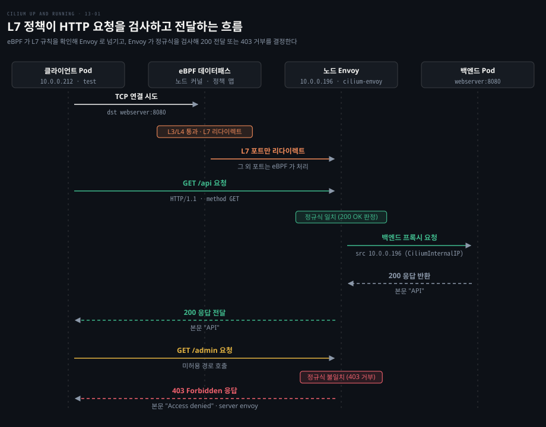
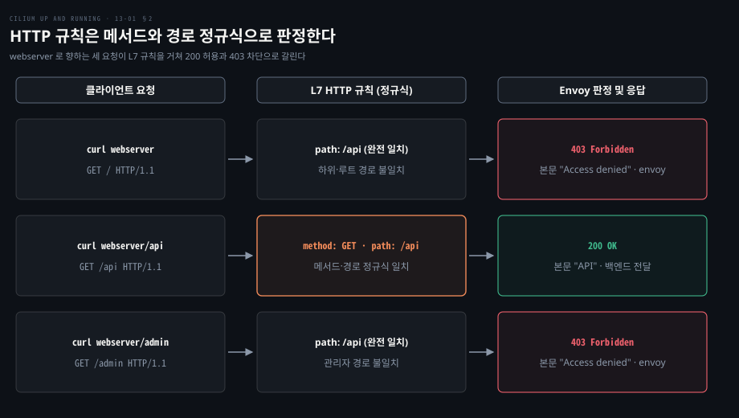
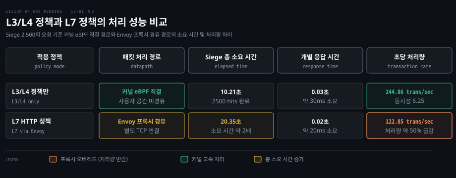

# L7 정책은 Envoy 로 HTTP 메서드와 경로를 검사한다

---

> L3/L4 정책은 같은 포트의 GET 과 POST, `/api` 와 `/admin` 을 가르지 못합니다. Cilium 은 L7 규칙이 걸린 포트만 노드의 Envoy 로 넘겨 메서드와 경로를 검사하고, 그 대가로 처리량이 줄어듭니다.


## 핵심 요약

> L3/L4 판정은 커널 eBPF 가 끝내고, HTTP 내용을 봐야 하는 포트만 사용자 공간의 Envoy 로 넘기는 분업입니다.

IP 와 포트만 보는 정책은 같은 8080 포트로 들어오는 요청 가운데 조회와 변경, 공개 경로와 관리자 경로를 구별하지 못합니다. 하나의 IP 에 여러 사이트가 얹히는 CDN 대역을 `toCIDR` 로 열면 의도하지 않은 사이트까지 열리는 문제도 같은 뿌리에서 나옵니다.

`CiliumNetworkPolicy` 의 `toPorts` 아래에 `rules.http` 를 더하면 해결됩니다. 규칙이 걸린 포트의 트래픽만 노드의 Envoy 가 받아 메서드와 경로 정규식을 대조하고, 어긋나면 403 으로 직접 응답합니다. 통과한 요청은 Envoy 가 백엔드로 새 연결을 맺어 전달합니다.

Envoy 를 거치는 만큼 연결이 하나 늘고 HTTP 파싱이 더해집니다. 예시 환경에서는 초당 처리량이 244.86 에서 122.85 로 절반이 되었습니다. 그래서 L7 검사는 꼭 필요한 포트에만 붙입니다.




## 학습 목표

> 이 편을 읽고 나면 다음을 설명할 수 있습니다.

1. L3/L4 정책만으로는 같은 포트의 HTTP 메서드와 경로를 제어하지 못하는 이유를 설명할 수 있습니다.
2. `toPorts` 아래 `rules.http` 로 특정 메서드와 정규식 경로만 허용하는 규칙을 작성할 수 있습니다.
3. L3/L4 거부는 타임아웃으로, L7 거부는 Envoy 의 403 응답으로 나타나는 차이를 비교할 수 있습니다.
4. L7 규칙이 걸린 트래픽이 Envoy 를 거치고 백엔드에 `CiliumInternalIP` 로 보이는 과정(인그레스 L7 규칙 기준)을 설명할 수 있습니다.
5. L7 정책의 성능 비용과 Gateway API 뒤에서 Envoy 를 두 번 거치지 않는 설계를 설명할 수 있습니다.


## 1. 포트까지만 보는 정책은 같은 포트의 다른 요청을 가르지 못한다

> 패킷 헤더의 IP 와 포트로는 HTTP 메서드, 경로, Host 헤더를 알 수 없어 읽기 전용 접근이나 경로 격리를 표현할 수 없습니다.

워크로드가 외부 HTTP 서비스를 읽기 전용으로만 쓰게 하려면 어떻게 해야 할까요? 대상 IP 와 TCP 80 포트만 허용하면 GET 뿐 아니라 POST 와 DELETE 도 같은 포트로 지나갑니다. 메서드는 패킷 페이로드 안에 있어서 IP 와 포트 수준에서는 보이지 않습니다.

경로도 같습니다. 일반 클라이언트에게 `/api` 만 열고 `/admin` 은 막고 싶어도 둘 다 8080 포트로 들어오므로 L3/L4 규칙으로는 가를 수단이 없습니다. 앞서 본 [identity 기반 판정](./12-01.Cilium%20정책은%20라벨에서%20만든%20identity%20로%20허용을%20판정하고%20정책이%20붙으면%20기본%20거부가%20된다.md)과 [CIDR·엔티티 규칙](./12-02.여러%20규칙과%20클러스터%20범위·CIDR·거부%20규칙으로%20정책의%20경계를%20넓힌다.md)은 모두 패킷의 IP 와 포트만 기준으로 삼습니다.

CDN 이나 매니지드 서비스처럼 한 IP 를 여러 사이트가 공유하면 문제가 보안 사고로 번집니다. Pod 가 `api.weather.example` 에 접근해야 해서 그 사이트가 쓰는 대역을 `toCIDR` 로 80 과 443 포트에 열었다고 해 보겠습니다.

그 대역이 CDN 소유라면 `filehost.example` 같은 다른 사이트도 같은 대역에 있을 수 있습니다. 규칙은 두 사이트를 구별하지 못하므로 Pod 가 탈취되면 데이터를 빼돌리는 통로나 악성코드의 명령 제어 통로가 됩니다. Host 헤더나 TLS SNI 를 보지 못하는 IP 기반 정책의 한계입니다.

그래서 Cilium 은 L3/L4 정책 위에 L7 규칙을 얹습니다. 패킷 판정은 커널 eBPF 가 계속 맡고, HTTP 를 해석해야 하는 포트만 노드마다 떠 있는 [Envoy](./02-01.Cilium%20은%20에이전트·CNI%20플러그인·오퍼레이터로%20나눠%20노드와%20클러스터를%20맡는다.md) 로 넘깁니다. 이 분업의 전체 흐름이 위의 편 지도입니다.


## 2. HTTP 규칙은 메서드·경로·헤더로 요청을 고른다

> `toPorts` 아래 `rules.http` 에 메서드와 경로를 적으면 Envoy 가 요청을 받아 규칙과 대조하고, 어긋난 요청은 403 으로 거부합니다.

웹서버가 경로마다 다른 본문을 돌려줄 때 `/api` 만 열려면 어떻게 해야 할까요? 예시 클러스터에는 경로별로 `Hello from Cilium Up and Running!`, `API`, `Admin` 을 반환하는 웹서버가 있습니다. 8080 포트용 L3/L4 정책도 걸려 있습니다. 이 정책은 라벨 `app.kubernetes.io/name: test` 를 가진 엔드포인트에게만 TCP 8080 을 엽니다. 해당 라벨의 테스트 Pod 에서 호출한 결과는 다음과 같습니다.

```bash
test:~# curl -s webserver
# Hello from Cilium Up and Running!
test:~# curl -s webserver/api
# API
test:~# curl -s webserver/admin
# Admin
test:~# curl -m1 webserver-metrics:9113/metrics
# curl: (28) Connection timed out after 1003 milliseconds
```

8080 이 열려 있으니 세 경로가 모두 응답합니다. 정책에 없는 9113 포트는 1초 뒤 타임아웃(curl 종료 코드 28)으로 끝납니다.

### rules.http 로 GET /api 만 허용한다

`toPorts` 항목에 `rules.http` 블록을 더하면 L7 규칙이 됩니다. 아래 조각을 정책에 넣고 같은 호출을 반복합니다([L7 정책 문서](https://docs.cilium.io/en/v1.20/security/policy/layer7/)).

```yaml
toPorts:
  - ports:
      - port: "8080"
        protocol: TCP
    rules:
      http:
        - method: GET
          path: "/api"
```

```bash
test:~# curl -s webserver
# Access denied
test:~# curl -s webserver/api
# API
test:~# curl -s webserver/admin
# Access denied
test:~# curl -m1 webserver-metrics:9113/metrics
# curl: (28) Connection timed out after 1004 milliseconds
```

`/api` 만 본문을 받고 `/` 와 `/admin` 은 `Access denied` 입니다. 9113 은 여전히 타임아웃입니다. 응답 헤더를 보면 이유가 드러납니다.

```bash
test:~# curl -D - webserver
# HTTP/1.1 403 Forbidden
# content-length: 15
# content-type: text/plain
# date: Thu, 23 Oct 2025 20:25:41 GMT
# server: envoy
#
# Access denied
```

상태는 `403 Forbidden` 이고 `server` 헤더가 NGINX 가 아니라 `envoy` 입니다. 요청에 답한 것이 웹서버가 아니라 노드의 Envoy 라는 뜻입니다.

규칙의 필드는 메서드와 경로만이 아닙니다. 현재 문서 기준으로 `path`·`method`·`host` 는 확장 POSIX 정규식으로 대조됩니다. 헤더의 존재와 값도 조건에 넣을 수 있습니다.

규칙이 여럿이면 하나라도 맞는 요청을 허용합니다. 규칙이 하나도 없으면 그 포트의 모든 트래픽을 허용합니다([L7 정책 문서](https://docs.cilium.io/en/v1.20/security/policy/layer7/)).

### L3/L4 거부는 타임아웃이고 L7 거부는 403 이다

두 거부는 클라이언트에게 다르게 보입니다. 9113 포트는 커널이 패킷을 버리므로 연결이 맺어지지 않고 타임아웃이 됩니다. 8080 포트는 클라이언트와 Envoy 사이의 TCP 연결이 정상으로 맺어지고, Envoy 가 HTTP 요청을 끝까지 받은 뒤 규칙과 대조해 403 을 돌려줍니다. 현재 문서도 L7 위반은 패킷 드롭이 아니라 프로토콜별 거부 응답으로 나간다고 적습니다([L7 정책 문서](https://docs.cilium.io/en/v1.20/security/policy/layer7/)).

그래서 장애 분석에서 구별이 쉽습니다. 타임아웃은 L3/L4 규칙에 걸린 것이고, 403 과 `server: envoy` 는 L7 규칙에 걸린 것입니다.

### 경로는 정규식이라 /api 가 하위 경로를 열지 않는다

`path` 는 정규식이므로 `/api` 는 `/api` 와만 일치하고 `/api/` 나 `/api/v1/posts` 는 막습니다. 하위 트리를 열려면 와일드카드를 명시해야 합니다.

| `path` 값 | 허용되는 요청 | 비고 |
|---|---|---|
| `/api` | `/api` 만 | `/api/` 와 하위 경로는 403 |
| `/api/.*` | `/api/` 아래 모든 경로 | 하위 트리 허용 |
| `/api.*` | `/api`, `/api-beta/v1` 등 | 이름이 `api` 로 시작하는 다른 디렉터리까지 열려 위험 |

### 요청은 Envoy 를 거쳐 CiliumInternalIP 로 백엔드에 닿는다

L7 규칙이 걸린 포트의 요청은 정책 맵을 조회한 eBPF 가 백엔드로 직접 넘기지 않고 노드의 Envoy 로 리다이렉트합니다. Envoy 는 사이드카가 아니라 노드마다 하나씩 뜬 DaemonSet(`cilium-envoy`)이어서 에이전트와 로컬로 통신합니다. L7 규칙이 없는 포트는 Envoy 를 거치지 않고 커널에서 끝납니다.

이 DaemonSet 방식은 v1.16 부터 새 설치의 기본입니다([v1.16 업그레이드 노트](https://docs.cilium.io/en/v1.16/operations/upgrade/)). v1.20 문서는 Envoy 를 에이전트 Pod 안에 내장하는 구성도 허용하며, 그 경우 L7 트래픽은 에이전트 Pod 의 가용성에 묶인다고 적습니다.

인그레스 L7 규칙에서 Envoy 는 허용한 요청을 백엔드로 보낼 때 자기 쪽 주소로 새 TCP 연결을 맺습니다. 이 동작은 Cilium 의 [Envoy 프록시 코드](https://github.com/cilium/cilium/blob/v1.20.2/pkg/proxy/envoyproxy.go)에서 인그레스일 때만 원래 출발지 주소 사용을 끄는 데서 나옵니다. 백엔드를 Pod 하나로 줄이고 접속 로그를 보면 확인됩니다.

```bash
kubectl get po test -o jsonpath='{.status.podIP}'
# 10.0.0.212
kubectl logs deploy/webserver -c nginx | grep "curl"
# 10.0.0.196 <truncated> "GET /api HTTP/1.1" 200 4 "-" "curl/8.14.1" "-"
```

로그에서 보이는 사실은 둘입니다. 403 으로 막힌 요청은 백엔드 로그에 남지 않습니다. 성공한 요청의 출발지는 테스트 Pod 의 `10.0.0.212` 가 아니라 `10.0.0.196` 입니다.

`10.0.0.196` 은 노드 Pod IP 대역에서 `cilium_host` 인터페이스에 붙은 **CiliumInternalIP** 이고([정의](https://github.com/cilium/cilium/blob/v1.20.2/pkg/node/types/node.go)), Envoy 는 로컬 Pod 로 요청을 보낼 때 이 주소를 출발지로 씁니다. `CiliumNode` 의 주소 목록에 `type: CiliumInternalIP` 로 올라 있습니다. 백엔드가 클라이언트 IP 를 로그나 접근 제어에 쓴다면 인그레스 L7 규칙이 걸린 포트에서는 원래 Pod IP 대신 이 주소가 보인다는 점을 알아야 합니다.




## 3. 프록시를 거치는 만큼 지연과 자원이 든다

> L7 정책을 건 연결은 사용자 공간 프록시와 추가 TCP 연결을 거치므로 처리량이 줄고 지연이 늘어납니다.

모든 포트에 L7 정책을 걸면 안전해지지만 대가는 무엇일까요? Envoy 는 검증된 고성능 프록시이지만 eBPF 만큼 빠를 수는 없습니다. 요청이 Envoy 에 도달해 HTTP 를 다 받은 뒤 규칙을 평가하고, 백엔드로 새 연결을 맺어 다시 보내기 때문입니다.

대부분의 서비스는 영향이 작습니다. 하지만 지연에 민감하거나 요청 하나가 여러 마이크로서비스를 연쇄로 부르는 구조라면 홉마다 쌓이는 지연이 문제가 됩니다. CPU 와 메모리 요구량도 설정에 따라 늘 수 있습니다.

### Siege 로 L3/L4 정책과 L7 정책을 비교한다

비용을 재려면 같은 부하를 두 정책 아래에서 돌려 보면 됩니다. 예시에서는 부하 도구 Siege 를 Kali Linux 컨테이너에 설치하고, 동시 접속 25 에 반복 100회(총 2,500회)로 `webserver/api` 를 호출했습니다. 백엔드는 노드의 Pod 하나입니다.

```bash
kubectl exec perf -- siege --benchmark --concurrent 25 --reps 100 webserver/api
# Transactions:                    2500 hits
# Elapsed time:                           10.21 secs
# Response time:                            0.03 secs
# Transaction rate:                      244.86 trans/sec
# Concurrency:                              6.25
```

위는 L3/L4 정책만 건 결과이고 아래는 `GET /api` 규칙을 얹은 결과입니다.

```bash
kubectl exec perf -- siege --benchmark --concurrent 25 --reps 100 webserver/api
# Transactions:                    2500 hits
# Elapsed time:                            20.35 secs
# Response time:                           0.02 secs
# Transaction rate:                      122.85 trans/sec
# Concurrency:                              2.75
```

총 소요 시간은 10.21초에서 20.35초로 늘고 초당 트랜잭션은 244.86 에서 122.85 로 절반이 됩니다. 개별 응답 시간은 30ms 와 20ms 로 비슷합니다. 응답 시간은 비슷한데 처리량이 절반이 된 것은, 이 측정에서는 Envoy 를 거치는 경로가 동시 처리를 덜 해냈다는 뜻으로만 읽을 수 있습니다. 감소분을 리다이렉트나 파싱 같은 개별 요인으로 나눈 측정은 없습니다.

이 수치는 Mac 위 가상 머신의 kind 클러스터에서 잰 것이라 일반화할 수 없습니다. 보여 주는 것은 L7 정책에 비용이 있다는 사실이지 절반이라는 크기가 아닙니다. 실제 영향은 환경에서 직접 재야 합니다.



### Gateway 뒤의 Pod 에 L7 정책을 겹쳐 걸면 Envoy 를 두 번 거친다

노드의 Envoy 는 L7 정책과 함께 [Ingress](./07-01.Cilium%20Ingress%20는%20노드의%20Envoy%20로%20바깥%20HTTP%20를%20받고%20TLS%20를%20끝낸다.md) 와 [Gateway API](./07-02.Gateway%20API%20는%20역할별%20객체로%20라우팅을%20나누고%20가중치·헤더·동서%20트래픽까지%20맡는다.md) 도 처리합니다. 설정은 독립적이지만 트래픽이 Envoy 에 두 번 들어가는 경우가 있습니다.

Gateway 뒤 Pod 에 ingress identity 를 대상으로 한 L7 인그레스 규칙을 걸면, 요청은 게이트웨이 노드의 Envoy 에서 한 번, 백엔드 Pod 의 노드(같은 노드일 수도 있습니다)에서 정책 검사를 위해 또 한 번 Envoy 를 지납니다.

게이트웨이에서 이미 경로와 헤더를 걸러 낼 수 있으므로 ingress identity 에 L7 정책을 거는 것은 권하지 않습니다. 클러스터 안 Pod 에 L7 규칙이 필요하고 게이트웨이도 있다면, 게이트웨이 쪽은 `fromEntities: [ingress]` 로 HTTP 포트를 통째로 허용하고 L7 규칙은 `fromEndpoints` 로 지정한 클러스터 내부 소스에만 둡니다.


## 면접 대비

> L7 정책의 동작과 비용을 묻는 질문입니다.

1. L3/L4 정책만으로 HTTP 서비스를 보호할 때 메서드와 경로 관점에서 어떤 한계가 있습니까?
2. `toPorts` 아래 `rules.http` 로 `/api` 하위 경로까지 허용하려면 어떻게 씁니까?
3. L3/L4 거부와 L7 거부는 클라이언트에게 어떻게 다르게 보이며 왜 그렇습니까?
4. L7 규칙이 걸린 포트의 트래픽은 어떤 경로를 지나며 백엔드 로그에 어떤 출발지로 찍힙니까?
5. L7 정책의 성능 비용은 어디서 오며 Gateway 가 있을 때 Envoy 이중 경유를 어떻게 피합니까?


## 정답 (자답 후 펼치기)

> 질문별 핵심 답입니다.

### 정답 1 — 같은 포트의 메서드·경로 미식별과 공유 IP

L3/L4 정책은 IP 와 포트만 보므로 같은 포트의 GET 과 POST, 공개 경로와 관리자 경로를 가르지 못합니다. CDN 처럼 IP 를 공유하는 환경에서는 허용한 CIDR 안의 다른 사이트로도 트래픽이 나가 데이터 유출이나 명령 제어 통로가 될 수 있습니다.

### 정답 2 — 경로는 정규식이라 와일드카드를 명시한다

`path: "/api/.*"` 처럼 와일드카드 정규식을 씁니다. `/api` 는 그 경로 하나만 허용하고 `/api/` 와 하위 경로는 막습니다. `/api.*` 는 `/api-beta/v1` 같은 다른 디렉터리까지 열려 피합니다.

### 정답 3 — 패킷 드롭은 타임아웃, L7 거부는 403

L3/L4 거부는 커널이 패킷을 버려 연결이 맺어지지 않으므로 타임아웃이 됩니다. L7 거부는 Envoy 와 TCP 연결이 맺어진 뒤 HTTP 요청을 받아 규칙과 대조하고 `403 Forbidden` 으로 직접 응답합니다. `server: envoy` 헤더가 단서입니다.

### 정답 4 — Envoy 리다이렉트와 CiliumInternalIP

정책 맵에서 해당 포트에 L7 규칙이 확인되면 eBPF 가 패킷을 노드의 Envoy 로 리다이렉트합니다. 인그레스 L7 규칙을 통과한 요청은 Envoy 가 백엔드로 새 연결을 맺어 전달하므로 출발지가 노드의 `CiliumInternalIP` 로 찍힙니다. 막힌 요청은 백엔드에 닿지 않습니다.

### 정답 5 — 프록시 경유 비용과 fromEntities: [ingress]

사용자 공간 프록시, 추가 TCP 연결, HTTP 파싱이 처리량과 지연에 영향을 줍니다. Gateway 가 있으면 HTTP 규칙은 게이트웨이에서 처리합니다. 백엔드는 `fromEntities: [ingress]` 로 허용하고, L7 규칙은 `fromEndpoints` 로 지정한 클러스터 내부 소스에만 둡니다.


## 참고 자료

- Vibert · Nikolic · Laverack, 《Cilium: Up and Running》, O'Reilly, 2026, ISBN 979-8-341-62299-9, Chapter 13 "Layer 7 and FQDN Policy".
- Cilium 공식 문서, Layer 7 Examples (v1.20): https://docs.cilium.io/en/v1.20/security/policy/layer7/
- Cilium 공식 문서, Upgrade Guide 의 1.16 Upgrade Notes (Envoy DaemonSet 기본 활성화): https://docs.cilium.io/en/v1.16/operations/upgrade/
- Cilium v1.20.2 소스, `Documentation/security/policy/layer7.rst`: https://github.com/cilium/cilium/blob/v1.20.2/Documentation/security/policy/layer7.rst


## 관련 문서

- [Cilium 은 에이전트·CNI 플러그인·오퍼레이터로 나눠 노드와 클러스터를 맡는다](./02-01.Cilium%20은%20에이전트·CNI%20플러그인·오퍼레이터로%20나눠%20노드와%20클러스터를%20맡는다.md)
- [Cilium 은 kind 클러스터에 Helm 으로 설치하고 정책과 Hubble 로 동작을 확인한다](./03-01.Cilium%20은%20kind%20클러스터에%20Helm%20으로%20설치하고%20정책과%20Hubble%20로%20동작을%20확인한다.md)
- [Cilium Ingress 는 노드의 Envoy 로 바깥 HTTP 를 받고 TLS 를 끝낸다](./07-01.Cilium%20Ingress%20는%20노드의%20Envoy%20로%20바깥%20HTTP%20를%20받고%20TLS%20를%20끝낸다.md)
- [Gateway API 는 역할별 객체로 라우팅을 나누고 가중치·헤더·동서 트래픽까지 맡는다](./07-02.Gateway%20API%20는%20역할별%20객체로%20라우팅을%20나누고%20가중치·헤더·동서%20트래픽까지%20맡는다.md)
- [Cilium 정책은 라벨에서 만든 identity 로 허용을 판정하고 정책이 붙으면 기본 거부가 된다](./12-01.Cilium%20정책은%20라벨에서%20만든%20identity%20로%20허용을%20판정하고%20정책이%20붙으면%20기본%20거부가%20된다.md)
- [여러 규칙과 클러스터 범위·CIDR·거부 규칙으로 정책의 경계를 넓힌다](./12-02.여러%20규칙과%20클러스터%20범위·CIDR·거부%20규칙으로%20정책의%20경계를%20넓힌다.md)
- [Envoy가 맡는 일과 Istio가 보태는 일](../istio-in-action/03-01.Envoy가%20맡는%20일과%20Istio가%20보태는%20일.md)
