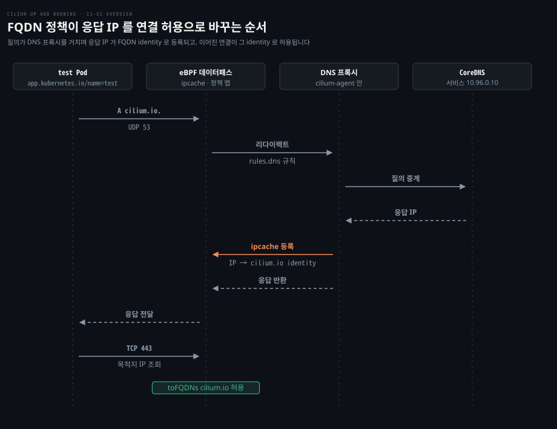
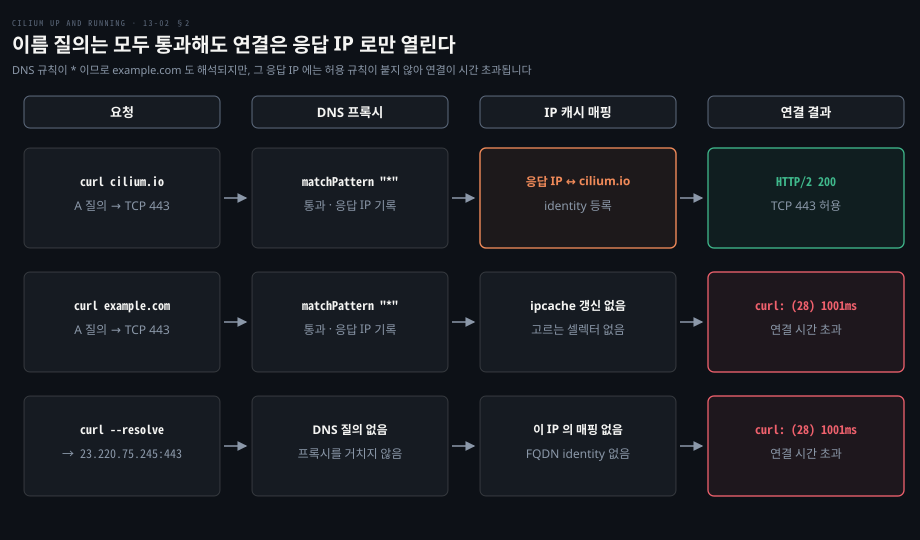
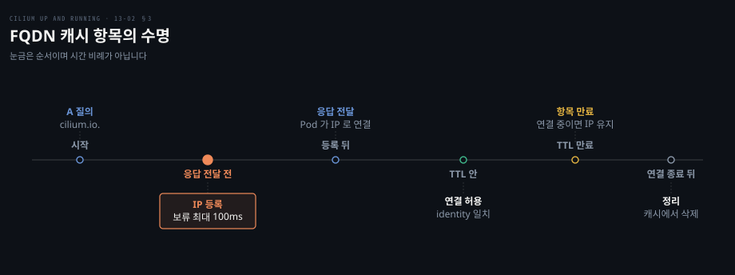

# FQDN 정책은 DNS 프록시가 본 응답 IP 를 정책 identity 로 바꾼다

---

> FQDN 정책이 여는 것은 이름이 아니라 IP 입니다. DNS 프록시가 응답에서 본 IP 를 그 이름의 identity 에 묶어 두고, 그 IP 로 가는 연결을 L3·L4 규칙으로 허용합니다.


## 핵심 요약

> 이 편의 중심 생각은 FQDN 정책이 허용하는 대상이 이름이 아니라 "그 이름의 응답으로 에이전트가 본 IP" 라는 것입니다.

바깥 서비스의 IP 는 바뀝니다. CIDR 규칙은 사람이 IP 를 고쳐야 하지만 FQDN 규칙은 DNS 응답에서 IP 를 얻습니다. Pod 의 질의는 에이전트 안의 DNS 프록시를 지나고, 프록시는 응답 IP 를 identity 에 묶고 응답을 돌려줍니다(최대 100ms 대기, [옵션](https://docs.cilium.io/en/v1.20/cmdref/cilium-agent/)).

여기서 세 가지 성질이 따라옵니다. 프록시가 응답을 보려면 `rules.dns` 규칙이 짝으로 필요합니다. DNS 를 거치지 않은 직접 연결은 열리지 않습니다. 한 IP 를 여러 이름이 쓰는 CDN 에서는 허용이 이름보다 넓어질 수 있습니다.




## 학습 목표

> 이 편을 읽고 나면 다음을 설명할 수 있습니다.

1. DNS 규칙(`rules.dns`)이 거르는 것과 거르지 못하는 것을 구분할 수 있습니다.
2. `toFQDNs` 규칙에 DNS 규칙이 짝이어야 하는 이유와 `matchName`·`matchPattern` 의 차이를 설명할 수 있습니다.
3. 질의 한 번이 FQDN 캐시와 ipcache 를 거쳐 연결 허용으로 이어지는 순서를 말할 수 있습니다.
4. 응답 TTL 이 허용 수명을 정하는 방식과 조절 옵션을 설명할 수 있습니다.
5. CDN 의 IP 공유와 신뢰할 수 없는 DNS 서버가 정책을 넓히거나 오염시키는 경로를 말할 수 있습니다.


## 1. 바깥 서비스의 IP 는 바뀌므로 이름으로 허용해야 한다

> CIDR 규칙에는 바깥 서비스의 IP 를 사람이 적어야 합니다. 이름으로 허용하려는 첫 시도가 DNS 규칙인데, 이 규칙은 이름 질의만 거르고 연결은 거르지 못합니다.

`cilium.io` 에만 나가게 하고 싶다고 합시다. [CIDR 규칙](./12-02.여러%20규칙과%20클러스터%20범위·CIDR·거부%20규칙으로%20정책의%20경계를%20넓힌다.md)으로 쓰면 IP 를 직접 조회해 적어야 하고 이중 스택이면 IPv6 도 적어야 합니다. [L7 HTTP 정책](./13-01.L7%20정책은%20Envoy%20로%20HTTP%20메서드와%20경로를%20검사한다.md)은 이름으로 막을 수 있지만 80·443 의 모든 egress 를 Envoy 로 돌려야 합니다.

DNS 프록시의 구성은 [에이전트 구성 편](./02-01.Cilium%20은%20에이전트·CNI%20플러그인·오퍼레이터로%20나눠%20노드와%20클러스터를%20맡는다.md)에서 다뤘습니다.

### DNS 규칙은 이름 질의를 거른다

80·443 은 어디로든 열고 DNS 는 `cilium.io` 질의만 통과시키는 정책입니다.

```yaml
egress:
  - toEntities:
      - world
    toPorts:
      - ports:
          - port: "80"
            protocol: TCP
          - port: "443"
            protocol: TCP
  - toEndpoints:
      - matchLabels:
          k8s-app: kube-dns
          io.kubernetes.pod.namespace: kube-system
    toPorts:
      - ports:
          - port: "53"
            protocol: ANY
        rules:
          dns:
            - matchPattern: "cilium.io"
```

대상 Pod 는 `app.kubernetes.io/name: test` 라벨이고 `protocol: ANY` 는 UDP·TCP 를 모두 뜻합니다. DNS 를 열어 두는 이유는 [기본 거부 절](./12-01.Cilium%20정책은%20라벨에서%20만든%20identity%20로%20허용을%20판정하고%20정책이%20붙으면%20기본%20거부가%20된다.md)에서 봤습니다. 예시 클러스터의 `netshoot` Pod 에서 나온 출력입니다.

```bash
curl -sI https://cilium.io. | head -n1
# HTTP/2 200

curl -m1 https://example.com
# curl: (6) Could not resolve host: example.com
```

규칙에 없는 이름은 프록시가 DNS `REFUSED` 로 거절하므로 해석 단계에서 실패합니다([거절 응답 설명](https://docs.cilium.io/en/v1.20/security/policy/layer7/)). `cilium.io.` 끝의 점은 2절에서 다룹니다.

### 443 이 열려 있으면 DNS 규칙은 우회된다

이 규칙이 보는 것은 53 번 포트의 질의뿐입니다. 443 egress 가 열려 있어 HTTPS 로 DNS 를 묻는 DoH 는 규칙에 걸리지 않고, 얻은 IP 로 바로 연결하면 이름 해석도 필요 없습니다.

```bash
curl -s -H 'accept: application/dns-json' \
    'https://1.1.1.1/dns-query?name=example.com&type=A' | jq -r '.Answer[0].data'
# 23.220.75.245

curl -s --resolve example.com:443:23.220.75.245 https://example.com
# [...]
# <head><title>Example Domain</title>
```

연결을 막으려면 연결 허용을 DNS 프록시가 본 응답에 묶어야 합니다.


## 2. toFQDNs 규칙은 DNS 를 먼저 허용하고 이름으로 egress 를 연다

> `toFQDNs` 규칙은 응답 IP 를 이름에 묶어 연결을 엽니다. 에이전트가 응답을 보려면 DNS 트래픽이 프록시를 지나야 하므로 `rules.dns` 규칙이 짝으로 있어야 합니다.

먼저 DNS 가 이름을 어떻게 완성하는지 짚어야 합니다.

### 이름 끝의 점이 FQDN 과 일반 이름을 가른다

점으로 끝나는 이름이 FQDN 이고, 점이 없으면 리졸버가 `/etc/resolv.conf` 의 search 목록을 차례로 붙여 완성합니다. Pod 의 `ndots:5` 설정에서는 점이 다섯 개 미만인 이름에 search 접미사가 먼저 붙습니다.

```bash
cat /etc/resolv.conf
# search default.svc.cluster.local svc.cluster.local cluster.local
# nameserver 10.96.0.10
# options ndots:5
```

`dig example +showsearch` 는 `example.default.svc.cluster.local.`, `example.svc.cluster.local.`, `example.cluster.local.`, `example.` 순으로 묻습니다. `example.` 처럼 점으로 끝내면 접미사 없이 그 이름만 묻습니다. 점이 없으면 `cilium.io.default.svc.cluster.local.` 같은 이름이 먼저 나가 DNS 규칙에 걸려 `REFUSED` 가 됩니다. Alpine 의 musl 같은 이미지는 이 거절을 일반 실패로 읽어 search 를 더 돌지 않습니다.

대처는 세 가지입니다. search 로 완성된 이름을 규칙에 허용하거나, Pod 의 `dnsConfig` 로 `ndots` 를 낮추거나, `--tofqdns-dns-reject-response-code` 를 기본 `refused` 에서 `nameError` 로 바꿉니다. 셋 모두 [공식 문서](https://docs.cilium.io/en/v1.20/security/policy/layer7/#alpine-musl-deployments-and-dns-refused)에 있습니다.

### toFQDNs 규칙은 DNS 규칙과 한 쌍이다

이번에는 80·443 을 `world` 가 아니라 `cilium.io` 로만 열고 DNS 는 모든 이름을 통과시킵니다. 메타데이터 이름은 `fqdn-egress` 이고 `endpointSelector` 는 앞과 같습니다.

```yaml
egress:
  - toFQDNs:
      - matchName: "cilium.io"
    toPorts:
      - ports:
          - port: "80"
            protocol: TCP
          - port: "443"
            protocol: TCP
  - toEndpoints:
      - matchLabels:
          k8s-app: kube-dns
          io.kubernetes.pod.namespace: kube-system
    toPorts:
      - ports:
          - port: "53"
            protocol: ANY
        rules:
          dns:
            - matchPattern: "*"
```

`matchPattern: "*"` 는 Pod 입장에서 DNS 를 가로채지 않는 것과 같아 보입니다. 그래도 이 규칙이 있어야 질의가 프록시를 지나 응답 IP 가 FQDN 캐시에 들어갑니다. [공식 문서](https://docs.cilium.io/en/v1.20/security/policy/layer3/#dns-based)는 `toFQDNs` 에 `--enable-l7-proxy=true` 와 `rules.dns` 규칙이 필요하다고 적습니다. 같은 문서에서 `toFQDNs` 규칙은 `toEndpoints` 같은 다른 L3 선택자를 한 규칙에 못 쓴다고 하므로 규칙이 둘로 나뉩니다.

```bash
curl -sI https://cilium.io | head -n1
# HTTP/2 200

curl -m1 https://example.com
# curl: (28) Connection timed out after 1001 milliseconds
```

1절과 결과가 다릅니다. 이름 단위로 막으면 해석이 실패하고, IP 단위로 막으면 연결이 침묵하며 끊깁니다. 1절의 우회를 같은 정책 아래에서 다시 보냅니다.

```bash
curl -m1 --resolve example.com:443:23.220.75.245 https://example.com
# curl: (28) Connection timed out after 1001 milliseconds
```

`--resolve` 로 IP 를 직접 줘도 그 IP 는 허용 목록에 없어 시간 초과됩니다.



### matchName 은 정확히, matchPattern 은 와일드카드로 고른다

`matchName` 은 정확히 같은 이름만 고릅니다. `*` 는 `.` 를 뺀 0자 이상에 맞아 한 라벨 안에서만 퍼지므로 `*.cilium.io` 는 `sub.cilium.io` 에 맞고 `cilium.io` 와 `sub.sub.cilium.io` 에는 맞지 않습니다. `**.` 접두사는 여러 단계의 하위 도메인을 한 번에 골라 `**.cilium.io` 가 `app.cilium.io` 와 `test.app.cilium.io` 에 맞고 `cilium.io` 에는 맞지 않습니다. `*` 만 쓰면 모든 이름이 됩니다. ([공식 문서](https://docs.cilium.io/en/v1.20/security/policy/layer3/#dns-based))


## 3. 응답 IP 는 TTL 동안 FQDN identity 에 묶인다

> 에이전트는 허용된 질의의 응답 IP 를 FQDN 캐시에 넣고 그 이름의 identity 로 ipcache 에 등록한 뒤 응답을 돌려줍니다. 항목은 응답 TTL 이 지나면 만료되지만 살아 있는 연결의 IP 는 연결이 끝날 때까지 남습니다.

Pod 는 응답을 받는 즉시 그 IP 로 연결하므로 데이터패스는 이미 IP 를 알아야 합니다. 이 지식은 어떤 순서로 만들어질까요?

### 응답이 Pod 에 닿기 전에 identity 가 등록된다

`fqdn-egress` 정책 아래 Pod 가 `cilium.io.` 를 질의합니다.

1. 컨테이너가 A 레코드를 묻고 UDP 패킷이 CoreDNS 서비스 IP 로 나갑니다.
2. 데이터패스가 서비스 IP 를 CoreDNS Pod IP 로 바꾸고, ipcache 에서 그 IP 의 identity 를 찾은 다음 질의를 보낸 Pod 의 정책 맵을 조회합니다. 이 순서는 identity 로 정책을 판정하는 일반 경로와 같습니다([12-01](./12-01.Cilium%20정책은%20라벨에서%20만든%20identity%20로%20허용을%20판정하고%20정책이%20붙으면%20기본%20거부가%20된다.md)).
3. DNS 규칙이 걸려 있어 패킷이 노드의 에이전트로 넘어갑니다.
4. DNS 프록시가 이름이 규칙에 허용되는지 보고 허용이면 DNS 서버로 중계합니다.
5. 클러스터 DNS 가 상위 리졸버에서 공인 IP 를 받아 응답합니다.
6. 프록시가 응답 IP 를 FQDN 캐시에 넣고, 그 IP 를 이름의 identity 에 묶도록 ipcache 를 갱신한 뒤 응답을 돌려줍니다.
7. Pod 가 응답을 받고 곧바로 그 IP 로 TCP 연결을 맺습니다.
8. 패킷이 데이터패스를 다시 지날 때 목적지 IP 가 FQDN identity 로 풀리고 정책 맵이 443 을 허용합니다.

identity 의 라벨은 `reserved:world` 계열 라벨에 `fqdn:cilium.io` 하나를 더한 것입니다. 번호는 CIDR 규칙이 만드는 것과 같은 로컬 범위에서 할당됩니다. ([소스](https://github.com/cilium/cilium/blob/v1.20.2/pkg/fqdn/namemanager/preallocator.go)) 판정이 L3 identity 로 끝나므로 FTP·SSH 같은 HTTP 가 아닌 프로토콜에도 쓸 수 있습니다.

에이전트는 `toFQDNs` 셀렉터마다 identity 를 정책을 넣을 때 미리 할당합니다. 옵션 `--tofqdns-preallocate-identities` 의 기본은 켜짐입니다. 응답 시점에는 ipcache 에 IP 만 쓰고 정책 맵 갱신을 건너뛸 수 있습니다. 프록시는 허용된 응답을 `--tofqdns-proxy-response-max-delay`(기본 100ms)까지 붙잡고, 그 안에 데이터패스가 갱신되면 바로 내보냅니다([옵션](https://docs.cilium.io/en/v1.20/cmdref/cilium-agent/)).

에이전트가 들고 있는 매핑은 에이전트 컨테이너 안에서 `cilium-dbg fqdn cache list` 로 봅니다. 열은 `Endpoint`·`Source`·`FQDN`·`TTL`·`ExpirationTime`·`IPs` 입니다. ([소스](https://github.com/cilium/cilium/blob/v1.20.2/cilium-dbg/cmd/fqdn.go)) IP 대역과 identity 의 대응은 `cilium-dbg bpf ipcache list` 로 봅니다.

매핑은 노드 전체가 공유합니다. 한 Pod 의 응답에서 얻은 IP 는 그 이름을 허용하는 같은 노드의 다른 Pod 에도 허용으로 나타납니다. ([공식 문서](https://docs.cilium.io/en/v1.20/security/policy/layer7/#dns-proxy))

### TTL 이 지나면 항목은 만료되고 살아 있는 연결의 IP 는 남는다



캐시는 응답에 실린 TTL 을 따릅니다([공식 문서](https://docs.cilium.io/en/v1.20/security/policy/layer7/#obtaining-dns-data-for-use-by-tofqdns)). Pod 가 받는 TTL 은 CoreDNS 가 정한 값이라 [CoreDNS 의 `cache`](../learning-coredns/03-02.플러그인%20일곱이면%20서버%20하나가%20선다.md)가 자르는 방식이 그대로 이어집니다. 에이전트 옵션은 수명을 다음처럼 조절합니다([옵션 레퍼런스](https://docs.cilium.io/en/v1.20/cmdref/cilium-agent/), 기본값은 [소스](https://github.com/cilium/cilium/blob/v1.20.2/pkg/defaults/defaults.go)).

| 옵션 | 기본 | 역할 |
|---|---|---|
| `--tofqdns-min-ttl` | 0 | 응답 TTL 이 이보다 짧으면 이 값으로 올려 캐시에 넣는 하한 |
| `--tofqdns-max-deferred-connection-deletes` | 10000 | 만료됐지만 활성 연결이 있는 IP 를 남겨 두는 개수 상한 |

기본 하한이 0 이라 짧은 TTL 은 그대로 만료됩니다. 애플리케이션이 TTL 보다 오래 IP 를 들고 있다가 새 연결을 맺으면 그 IP 는 이미 만료돼 막힐 수 있습니다. 이런 경우에 하한을 올려 대응합니다.

만료됐어도 활성 연결이 쓰는 IP 는 연결이 끝날 때까지 남습니다. 한 이름의 IP 가 Endpoint 당 상한(`--tofqdns-endpoint-max-ip-per-hostname`, 기본 1000)을 넘으면 오래된 항목부터 밀려납니다. 링크한 문서의 50 은 낡았고 [코드](https://github.com/cilium/cilium/blob/v1.20.2/pkg/defaults/defaults.go)의 기본은 1000 입니다. ([설명](https://docs.cilium.io/en/v1.20/security/policy/layer3/#managing-short-lived-connections-maximum-ips-per-fqdn-endpoint))

### 신뢰하지 않는 DNS 서버가 매핑을 오염시킬 수 있다

매핑은 DNS 응답을 있는 그대로 믿습니다. 가로채기를 클러스터 CoreDNS 가 아닌 아무 서버에나 걸어 두면 공격자가 통제하는 서버가 이름에 임의의 IP 를 연결해 줄 수 있습니다.

`api.example` 로만 나갈 수 있는 침해된 Pod 가 자기 DNS 서버에서 원하는 IP 를 받으면 그 IP 가 이름의 identity 로 등록되어 Pod 가 그 IP 로 나갈 수 있습니다.

deny 규칙에도 같은 수법이 쓰입니다. 어떤 Pod 가 `metrics.example` 은 되고 `api.example` 은 막혀 있다고 합시다. 같은 노드의 악성 Pod 가 `api.example` 을 `metrics.example` 의 IP 로 풀리게 만들면, 매핑이 노드 전체라서 그 Pod 의 `metrics.example` 접근이 L3 에서 막힙니다. 클러스터 안 엔드포인트는 고유 identity 가 있어 FQDN identity 와 겹치지 않으므로 이 수법으로는 열리지 않습니다.

대처로 DNS 규칙을 클러스터 DNS 에만 걸어 둡니다. [공식 문서](https://docs.cilium.io/en/v1.20/security/policy/layer7/#dns-policy-and-ip-discovery)도 `kube-dns` 같은 클러스터 DNS 로만 가로채라고 권합니다.


## 4. CDN 은 IP 를 많은 이름이 나눠 써 정책이 넓어질 수 있다

> 같은 IP 에 여러 사이트가 얹힌 CDN 에서는 허용된 이름의 IP 로 다른 사이트에도 닿을 수 있습니다.

`cilium.io` 만 허용했는데 `isovalent.com` 에도 닿는다면 어떻게 된 일일까요? CDN 은 TCP·TLS 연결을 자기 쪽에서 끝내고 고객은 DNS 이름을 CDN 엔드포인트로 돌려놓기만 하므로, 한 IP 가 여러 사이트의 이름에 공유됩니다.

```bash
curl -sI https://cilium.io | head -n1
# HTTP/2 200

curl -m1 https://isovalent.com
# curl: (28) Connection timed out after 1001 milliseconds

curl -s --resolve "isovalent.com:443:$(dig +short cilium.io)" \
    https://isovalent.com | \
    grep -Eo 'Isovalent was founded[[:alnum:][:space:]]*' | head -n1
# Isovalent was founded by the creators and maintainers of Cilium and eBPF
```

첫 줄은 허용된 이름이라 열리고, 둘째 줄은 막힙니다. 셋째 줄은 `--resolve` 로 `isovalent.com` 을 `cilium.io` 의 IP 에 붙인 것인데 그 IP 는 이미 `cilium.io` 의 identity 에 묶여 있어 열립니다.

이 우회는 도메인들이 CDN IP 를 공유하고 클라이언트가 일부러 DNS 해석을 덮어쓸 때만 되며, CDN 의 동작에 달려 있어 언제나 재현되지는 않습니다. 요청한 도메인이 틀림없이 맞아야 한다면 Host 를 보는 [L7 HTTP 정책](./13-01.L7%20정책은%20Envoy%20로%20HTTP%20메서드와%20경로를%20검사한다.md)으로 올려 Envoy 를 거칩니다. HTTPS 는 TLS 를 끊어야 헤더가 보여 [TLS 종단 정책](./13-03.HTTPS%20정책은%20TLS%20를%20끊어%20다시%20맺어야%20경로를%20볼%20수%20있다.md)이 필요합니다.


## 면접 대비

> FQDN 정책의 동작 원리와 한계에 관한 면접 질문입니다.

1. DNS 규칙(`rules.dns`)만으로는 외부 서비스 접근을 이름 단위로 통제할 수 없는 이유는 무엇입니까?
2. `toFQDNs` 규칙에 `matchPattern: "*"` 의 DNS 규칙이 짝으로 붙어야 하는 이유는 무엇입니까?
3. Pod 가 `cilium.io.` 를 질의한 뒤 그 IP 로 연결이 허용되기까지의 순서를 설명해 보십시오. identity 는 언제 등록됩니까?
4. FQDN 캐시 항목은 언제 만료되고, 만료돼도 남는 IP 는 무엇이며 어떤 옵션이 이를 조절합니까?
5. CDN 과 신뢰할 수 없는 DNS 서버는 FQDN 정책을 각각 어떻게 넓히거나 오염시키고 어떻게 대처합니까?


## 정답 (자답 후 펼치기)

> 면접 질문에 대한 키워드 중심의 모범 답안입니다.

### 정답 1 — 이름 질의만 거르고 연결은 거르지 못한다

DNS 규칙은 53 번 포트 질의의 이름만 검사합니다. 443 이 열려 있으면 DoH 나 IP 직접 연결로 규칙을 피합니다. 연결 허용을 DNS 응답에 묶는 `toFQDNs` 가 필요합니다.

### 정답 2 — 응답을 보려면 질의가 프록시를 지나야 한다

프록시는 `rules.dns` 규칙이 걸린 질의만 가로채 응답 IP 를 FQDN 캐시에 넣고, `*` 는 모든 응답 IP 를 넣습니다.

### 정답 3 — 응답을 돌려주기 전에 ipcache 에 등록한다

UDP 질의가 데이터패스에서 DNS 프록시로 넘어가 CoreDNS 로 중계되고, 프록시가 응답 IP 를 FQDN 캐시와 ipcache 에 FQDN identity 로 반영한 뒤 응답합니다. 이후 연결의 목적지 IP 가 그 identity 로 풀려 정책 맵이 허용합니다.

### 정답 4 — TTL 만료와 활성 연결 유지

응답 TTL 이 지나면 만료되고 `--tofqdns-min-ttl`(기본 0)이 하한입니다. 활성 연결이 쓰는 IP 는 연결이 끝날 때까지 남고 `--tofqdns-max-deferred-connection-deletes`(기본 10000)가 상한입니다.

### 정답 5 — IP 공유와 DNS 신뢰, Host 를 보는 L7 과 DNS 한정

CDN 에서는 한 IP 를 여러 이름이 써서 허용된 이름의 IP 로 다른 사이트에 닿을 수 있어 Host 를 보는 L7 정책(HTTPS 는 TLS 종단)이 필요합니다. 신뢰할 수 없는 DNS 서버는 이름에 임의의 IP 를 묶어 허용을 넓히므로 DNS 규칙을 클러스터 DNS 로만 한정합니다.


## 참고 자료

- Nico Vibert 외, 《Cilium: Up and Running》, O'Reilly, 2026, ISBN 979-8-341-62299-9, Chapter 13 "Layer 7 and FQDN Policy".
- Cilium 공식 문서 DNS Based 와 DNS Policy: https://docs.cilium.io/en/v1.20/security/policy/layer3/#dns-based, https://docs.cilium.io/en/v1.20/security/policy/layer7/#dns-policy-and-ip-discovery
- Cilium 에이전트 옵션 레퍼런스(`--tofqdns-*`): https://docs.cilium.io/en/v1.20/cmdref/cilium-agent/
- Cilium v1.20.2 소스(`pkg/fqdn`, `pkg/defaults`, `cilium-dbg/cmd`): https://github.com/cilium/cilium/tree/v1.20.2


## 관련 문서

- [Cilium 은 에이전트·CNI 플러그인·오퍼레이터로 나눠 노드와 클러스터를 맡는다](./02-01.Cilium%20은%20에이전트·CNI%20플러그인·오퍼레이터로%20나눠%20노드와%20클러스터를%20맡는다.md)
- [Cilium 정책은 라벨에서 만든 identity 로 허용을 판정하고 정책이 붙으면 기본 거부가 된다](./12-01.Cilium%20정책은%20라벨에서%20만든%20identity%20로%20허용을%20판정하고%20정책이%20붙으면%20기본%20거부가%20된다.md)
- [여러 규칙과 클러스터 범위·CIDR·거부 규칙으로 정책의 경계를 넓힌다](./12-02.여러%20규칙과%20클러스터%20범위·CIDR·거부%20규칙으로%20정책의%20경계를%20넓힌다.md)
- [L7 정책은 Envoy 로 HTTP 메서드와 경로를 검사한다](./13-01.L7%20정책은%20Envoy%20로%20HTTP%20메서드와%20경로를%20검사한다.md)
- [HTTPS 정책은 TLS 를 끊어 다시 맺어야 경로를 볼 수 있다](./13-03.HTTPS%20정책은%20TLS%20를%20끊어%20다시%20맺어야%20경로를%20볼%20수%20있다.md)
