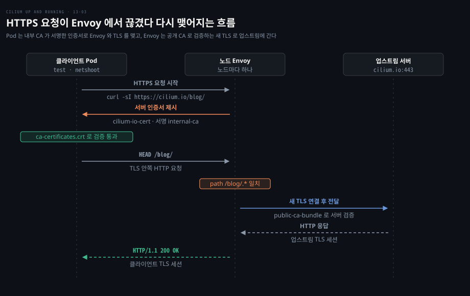
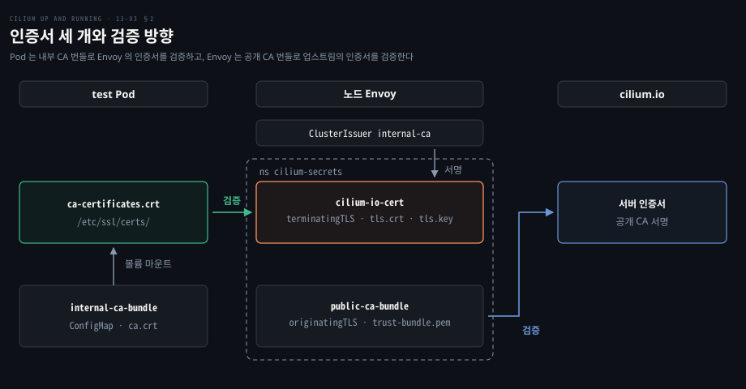
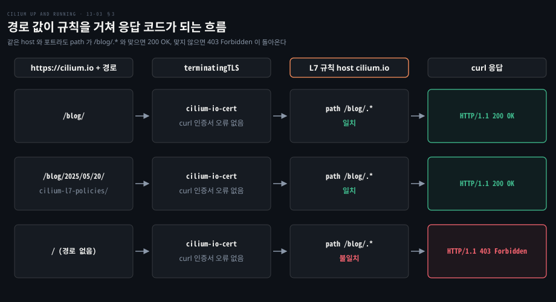

# HTTPS 정책은 TLS 를 끊어 다시 맺어야 경로를 볼 수 있다

---

> HTTPS 의 경로와 메서드는 TLS 안쪽에 있어서 Envoy 가 내부 CA 가 서명한 인증서로 Pod 쪽 연결을 끝맺고 공개 CA 로 검증하는 새 연결을 업스트림에 맺어야 L7 규칙을 걸 수 있습니다.


## 핵심 요약

> 이 편의 중심 생각은 HTTPS 에 L7 정책을 걸려면 Envoy 가 서버 행세를 해야 하고 그 행세를 클라이언트가 받아들이게 신뢰 목록을 바꾸는 일까지가 정책의 일부라는 것입니다.

HTTPS 에서는 같은 L7 규칙을 걸어도 Envoy 가 볼 수 있는 것이 암호문뿐이라 `/blog/.*` 같은 경로를 읽지 못합니다. 경로를 보려면 프록시가 TLS 를 직접 끝맺어야 합니다. 이것을 **TLS 가로채기**라고 합니다.

가로채기에는 인증서 셋이 맞물립니다. Envoy 가 Pod 에 내밀 인증서, Pod 가 그 서명자로 믿을 내부 CA, Envoy 가 진짜 서버를 확인할 공개 CA 번들입니다. 정책에서는 `terminatingTLS` 가 앞의 둘을, `originatingTLS` 가 마지막을 가리킵니다. 적용하면 `curl` 은 인증서 오류 없이 응답을 받고 `/blog/` 아래만 200 OK 가 됩니다.

인증서는 도메인마다 따로 있어야 해서 이 방식은 L3·L4 규칙으로 부족한 대상에만 골라 겁니다.




## 학습 목표

> 이 편을 읽고 나면 다음을 설명할 수 있습니다.

1. 경로가 TLS 안쪽에 있어서 프록시가 연결을 끝맺어야 L7 규칙을 걸 수 있는 이유를 설명할 수 있습니다.
2. TLS 가로채기에 필요한 인증서 세 개와 각각을 누가 검증하는지 구분할 수 있습니다.
3. cert-manager 와 trust-manager 로 인증서와 번들을 배포하는 순서를 설명할 수 있습니다.
4. `terminatingTLS`·`originatingTLS` 와 `trustedCA` 로 CiliumNetworkPolicy 를 작성할 수 있습니다.
5. 한 인증서가 443 의 모든 연결에 나가는 한계를 설명하고 이 방식이 맞는 범위를 판단할 수 있습니다.


## 1. 암호화된 요청은 끊지 않으면 경로를 볼 수 없다

> TLS 는 중간 장치가 서버 행세를 하지 못하게 설계돼 있어서 L7 정책이 경로를 읽으려면 Envoy 가 클라이언트가 받아들이는 인증서로 서버를 대신해야 합니다.

L7 규칙에 `path: /blog/.*` 를 걸었는데 요청이 HTTPS 라면 무슨 일이 생길까요? TLS 는 요청 줄과 헤더를 모두 암호화해서 보내므로 중간의 프록시는 경로와 메서드를 읽지 못합니다. 규칙 평가와 403 응답은 [L7 정책 편](./13-01.L7%20정책은%20Envoy%20로%20HTTP%20메서드와%20경로를%20검사한다.md)이 다룹니다.

TLS 는 서버가 인증서로 신원을 증명하게 하는 프로토콜이기도 해서 프록시가 내용을 보려면 우회가 필요합니다([Cilium 문서](https://docs.cilium.io/en/v1.20/security/tls-visibility/)). 조직이 자기 CA 로 가로챌 도메인의 인증서를 서명합니다. 클라이언트는 그 CA 를 신뢰 목록에 넣어 인증서를 받아들입니다. Envoy 는 그 인증서로 Pod 와의 연결을 끝맺고 복호화한 요청에 L7 규칙을 적용한 뒤 업스트림으로 별도의 TLS 연결을 맺습니다.

신뢰 모델로 옮기면 Pod 가 믿는 대상이 공개 CA 에서 조직의 내부 CA 로 바뀝니다. 내부 CA 를 신뢰 목록에 넣은 Pod 는 그 CA 가 서명한 어떤 인증서든 받아들이므로, CA 개인 키를 가진 사람은 이 Pod 의 TLS 트래픽을 들여다볼 수 있습니다. 문서는 CA 개인 키를 Cilium 에 줄 필요가 없고 도메인별 개인 키는 일반 워크로드가 읽지 못하는 네임스페이스에 두라고 안내합니다.

필요한 것은 셋입니다. Envoy 가 Pod 쪽 연결에 내밀 인증서, Pod 의 **trust bundle**(클라이언트가 서명자로 믿을 CA 인증서 모음)에 넣을 내부 CA 인증서, Envoy 가 업스트림을 검증할 공개 CA 번들입니다. 인증서가 오가는 핸드셰이크는 [TCP·TLS·UDP 편](../networking-and-kubernetes/01-02.HTTP에서%20TCP·TLS·UDP까지%20—%20Transport%20계층%20해부.md)에 있고, 바깥 클라이언트를 받는 Ingress 의 TLS 종단은 [Ingress 편](./07-01.Cilium%20Ingress%20는%20노드의%20Envoy%20로%20바깥%20HTTP%20를%20받고%20TLS%20를%20끝낸다.md)이 다룹니다.

### Secret 을 어디서 읽을지 먼저 정한다

Envoy 는 노드마다 하나라서 어느 정책의 Secret 이든 읽어야 합니다. Cilium v1.20 문서에서 새 클러스터의 기본이자 권장은 오퍼레이터가 Secret 을 `cilium-secrets` 로 복사해 SDS 로 전달하는 방식(`tls.secretSync.enabled: true`)입니다. 이 편은 Secret 을 `cilium-secrets` 에 직접 두고 동기화를 끕니다([tls-visibility](https://docs.cilium.io/en/v1.20/security/tls-visibility/)).

```yaml
tls:
  readSecretsOnlyFromSecretsNamespace: true
  secretsNamespace:
    name: cilium-secrets
  secretSync:
    enabled: false
```

네임스페이스 이름과 `create: true` 는 [v1.20.2 차트 values](https://github.com/cilium/cilium/blob/v1.20.2/install/kubernetes/cilium/values.yaml#L3132-L3144)에 있습니다.

### cert-manager 와 trust-manager 를 설치한다

이 값으로 Cilium 을 설치한 kind 클러스터에 두 컴포넌트를 `oci://` 경로로 설치합니다. 버전은 예시가 고정한 값입니다.

```bash
helm upgrade --install \
    cert-manager oci://quay.io/jetstack/charts/cert-manager \
    --version v1.19.0 \
    --namespace cert-manager \
    --create-namespace \
    --set crds.enabled=true

helm upgrade --install \
    trust-manager oci://quay.io/jetstack/charts/trust-manager \
    --version v0.20.2 \
    --namespace cert-manager \
    --set secretTargets.enabled=true \
    --set "secretTargets.authorizedSecrets[0]=public-ca-bundle"
```

trust-manager 는 `authorizedSecrets` 의 Secret 에만 쓰며([차트 values](https://github.com/cert-manager/trust-manager/blob/v0.20.2/deploy/charts/trust-manager/values.yaml#L142-L153)), `public-ca-bundle` 하나를 허용합니다. Cilium 이 외부 연결을 검증할 번들을 Secret 에서 읽기 때문입니다.


## 2. 업스트림은 공개 CA 로, Pod 쪽은 내부 CA 로 믿게 한다

> 준비물은 공개 CA 번들 Secret, 내부 CA 가 서명한 인증서 Secret, 내부 CA 번들 ConfigMap 이며 Cilium 이 읽는 둘은 `cilium-secrets` 에 둡니다.

인증서와 번들은 각각 어디에 놓일까요? Cilium 이 읽는 것은 `cilium-secrets` 의 Secret 둘뿐이고 Pod 는 ConfigMap 하나만 마운트합니다.



### 공개 CA 번들은 Envoy 가 업스트림을 검증하는 기준이다

업스트림 서버의 인증서는 공개 CA 가 서명하므로, trust-manager 의 기본 공개 CA 번들(`useDefaultCAs: true`)을 `cilium-secrets` 의 Secret 으로 넣습니다.

```yaml
apiVersion: trust.cert-manager.io/v1alpha1
kind: Bundle
metadata:
  name: public-ca-bundle
spec:
  sources:
    - useDefaultCAs: true
  target:
    secret:
      key: "trust-bundle.pem"
    namespaceSelector:
      matchLabels:
        secrets-namespace: "true"
```

`namespaceSelector` 가 라벨로 대상을 찾으므로 `cilium-secrets` 에 라벨을 먼저 붙입니다.

```bash
kubectl label --context kind-tls namespace cilium-secrets \
    secrets-namespace="true"

kubectl apply --context kind-tls --filename public-ca-bundle.yaml
# bundle.trust.cert-manager.io/public-ca-bundle created

kubectl get secrets --context kind-tls --namespace cilium-secrets
# NAME               TYPE     DATA   AGE
# public-ca-bundle   Opaque   1      39s
```

데이터 항목의 이름이 `trust-bundle.pem` 이고 정책에서 `trustedCA` 로 지정합니다.

대상 사이트의 CA 하나만 넣으면 잘 깨집니다. 사이트가 공개 CA 를 예고 없이 바꿔도 이용자에게 영향이 없다고 여기기 때문입니다. 남이 운영하는 사이트에는 표준 번들을 씁니다.

### 내부 CA 는 자체 서명 루트에서 만들어 인증서를 서명한다

자체 서명 Issuer 로 루트 인증서를 발급합니다. 그 루트를 CA 로 삼는 ClusterIssuer 를 만듭니다.

```yaml
apiVersion: cert-manager.io/v1
kind: Issuer
metadata:
  name: selfsigned
  namespace: cert-manager
spec:
  selfSigned: {}
---
apiVersion: cert-manager.io/v1
kind: Certificate
metadata:
  name: root
  namespace: cert-manager
spec:
  isCA: true
  commonName: internal-ca
  secretName: root
  privateKey:
    algorithm: ECDSA
    size: 256
    rotationPolicy: never
  issuerRef:
    name: selfsigned
    kind: Issuer
    group: cert-manager.io
---
apiVersion: cert-manager.io/v1
kind: ClusterIssuer
metadata:
  name: internal-ca
spec:
  ca:
    secretName: root
```

루트의 Secret `root` 는 `cert-manager` 네임스페이스에만 있어서 CA 개인 키는 Cilium 에 가지 않습니다.

이제 `cilium.io` 인증서를 이 CA 로 서명합니다. Envoy 가 읽도록 `cilium-secrets` 에 둡니다.

```yaml
apiVersion: cert-manager.io/v1
kind: Certificate
metadata:
  name: cilium-io-cert
  namespace: cilium-secrets
spec:
  commonName: cilium.io
  secretName: cilium-io-cert
  privateKey:
    algorithm: ECDSA
    size: 256
  issuerRef:
    name: internal-ca
    kind: ClusterIssuer
    group: cert-manager.io
```

`internal-ca` 가 클러스터 범위 객체라서 `issuerRef.kind` 는 `ClusterIssuer` 입니다. 클러스터 범위 Issuer 는 어느 네임스페이스에서나 쓸 수 있습니다([cert-manager API 문서](https://cert-manager.io/docs/reference/api-docs/)). 인증서를 `cilium-secrets` 에 두는 것은 Secret 을 그곳에 직접 만들기로 했기 때문입니다. 인증서 하나는 도메인 하나에만 맞아서 가로챌 도메인마다 발급합니다.

### Pod 의 신뢰 목록을 내부 CA 번들로 덮어쓴다

trust-manager 가 `root` 의 `ca.crt` 를 모든 네임스페이스의 ConfigMap 으로 만듭니다.

```yaml
apiVersion: trust.cert-manager.io/v1alpha1
kind: Bundle
metadata:
  name: internal-ca-bundle
spec:
  sources:
    - secret:
        name: root
        key: "ca.crt"
  target:
    configMap:
      key: "ca.crt"
```

소스 Secret 의 네임스페이스를 적지 않는 것은 trust-manager 가 trust namespace(기본값 `cert-manager`)의 Secret 만 읽기 때문입니다. `nicolaka/netshoot` 은 Debian 기반이라 신뢰 목록이 `/etc/ssl/certs/ca-certificates.crt` 에 있습니다. ConfigMap 을 `/etc/ssl/certs/` 에 마운트하면 기존 인증서가 가려져 이 파일만 남습니다.

```yaml
apiVersion: v1
kind: Pod
metadata:
  labels:
    app.kubernetes.io/name: test
  name: test
spec:
  containers:
    - name: netshoot
      image: nicolaka/netshoot
      args: ["sleep", "infinity"]
      volumeMounts:
        - name: ca-certs
          mountPath: /etc/ssl/certs/
  volumes:
    - name: ca-certs
      configMap:
        name: internal-ca-bundle
        items:
          - key: ca.crt
            path: ca-certificates.crt
```

볼륨 마운트가 필요해서 `kubectl run` 대신 매니페스트를 적용하고 `kubectl exec` 로 들어갑니다. 이 마운트는 컨테이너의 인증서를 통째로 대체해서 공개 엔드포인트와는 TLS 를 맺지 못합니다. 둘 다 믿게 하려면 번들의 `sources` 에 `useDefaultCAs: true` 를 더합니다.


## 3. TLS 정책은 originatingTLS·terminatingTLS 로 양쪽을 정한다

> 평범한 L7 HTTP 정책에 `terminatingTLS`(Pod 쪽에 내밀 인증서)와 `originatingTLS`(업스트림을 검증할 CA)를 더하면 HTTPS 요청도 `host`·`path` 로 판정됩니다.

준비가 끝났다면 정책은 얼마나 달라질까요? 달라지는 곳은 두 블록뿐입니다. `toPorts` 항목이 두 필드를 가질 수 있고 둘은 같은 TLS 컨텍스트 형식입니다([l4.go](https://github.com/cilium/cilium/blob/v1.20.2/pkg/policy/api/l4.go#L217-L235)). `cilium.io` 의 `/blog/` 경로만 허용하는 정책은 다음과 같습니다.

```yaml
apiVersion: cilium.io/v2
kind: CiliumNetworkPolicy
metadata:
  name: client
spec:
  endpointSelector:
    matchLabels:
      app.kubernetes.io/name: test
  egress:
    - toPorts:
        - ports:
            - port: "443"
              protocol: TCP
          originatingTLS:
            secret:
              namespace: cilium-secrets
              name: public-ca-bundle
            trustedCA: trust-bundle.pem
          terminatingTLS:
            secret:
              namespace: cilium-secrets
              name: cilium-io-cert
          rules:
            http:
              - host: cilium.io
                path: /blog/.*
    - toPorts:
        - ports:
            - port: "53"
              protocol: ANY
      toEndpoints:
        - matchLabels:
            k8s-app: kube-dns
            io.kubernetes.pod.namespace: kube-system
```

필드는 다음 역할을 맡습니다.

- `terminatingTLS.secret` 은 Envoy 가 Pod 쪽 연결에 내미는 인증서와 키의 Secret 입니다. 항목 이름을 생략하면 `tls.crt` 와 `tls.key` 를 찾고, cert-manager 가 만든 Secret 이 이 이름을 씁니다.
- `originatingTLS.secret` 은 업스트림 서버를 검증할 CA 의 Secret 입니다. `Secret` 구조체에는 `namespace` 와 `name` 만 있어서 항목 이름은 한 단계 위의 `trustedCA` 가 받습니다. 생략하면 `ca.crt` 를 찾습니다([l4.go](https://github.com/cilium/cilium/blob/v1.20.2/pkg/policy/api/l4.go#L90-L138)). trust-manager 가 넣은 항목은 `trust-bundle.pem` 이라 직접 적습니다.
- `rules.http` 는 L7 정책 편의 규칙과 같고 `path` 는 정규식으로 평가됩니다.
- 마지막 `toPorts` 는 DNS 를 허용합니다. 정책이 붙으면 egress 는 기본 거부가 되므로 `kube-dns` 로 가는 53 포트를 따로 엽니다([정책 판정 편](./12-01.Cilium%20정책은%20라벨에서%20만든%20identity%20로%20허용을%20판정하고%20정책이%20붙으면%20기본%20거부가%20된다.md)).

정책을 적용하고 테스트 Pod 에서 확인합니다. 예시 kind 클러스터에서는 다음과 같습니다.

```bash
kubectl exec test -it -- bash

test:~# curl -sI https://cilium.io/blog/ | head -n1
# HTTP/1.1 200 OK

test:~# curl -sI https://cilium.io/blog/2025/05/20/cilium-l7-policies/ |
    head -n1
# HTTP/1.1 200 OK

test:~# curl -sI https://cilium.io | head -n1
# HTTP/1.1 403 Forbidden
```

`curl` 은 `-k` 없이도 인증서 오류를 내지 않았습니다. 클라이언트는 평범한 TLS 연결로 인식했고 그 연결을 Cilium 이 끊어 다시 맺었습니다. 두 번째 요청은 깊은 하위 경로인데도 `/blog/.*` 가 받아 주고, 세 번째 요청은 경로가 `/` 라서 규칙과 맞지 않아 403 이 됩니다. 이 403 은 업스트림 서버가 아니라 Envoy 가 Pod 와 맺은 TLS 연결 위로 직접 돌려준 응답입니다.




## 4. 한 인증서가 443 의 모든 연결에 나가므로 대상을 좁혀 걸어야 한다

> 목적지를 가리지 않는 443 규칙은 `cilium.io` 인증서를 모든 연결에 내밀어 이름 불일치 오류가 나므로, 도메인마다 규칙을 둡니다.

앞의 정책을 건 Pod 가 `example.com` 에 접속하면 어떻게 될까요? 첫 `toPorts` 에는 목적지를 가르는 선택자(`toFQDNs`, `toCIDR` 등)가 없습니다. 443 으로 나가는 모든 연결이 가로채기 대상이 되고 연결마다 `cilium.io` 인증서가 나갑니다.

```bash
test:~# curl https://example.com
# curl: (60) SSL: certificate subject name 'cilium.io' does not match target hostname 'example.com'
# ...
```

접속한 곳은 `example.com` 인데 Envoy 가 내민 인증서가 `cilium.io` 용이라 `curl` 이 연결을 거부합니다. `-k` 로 오류를 무시하면 Envoy 의 규칙 판정까지 갑니다.

```bash
test:~# curl -k https://example.com
# Access denied
```

원인은 인증서 모양에 있습니다. 대부분의 TLS 클라이언트는 하위 도메인 여러 단계에 걸친 와일드카드를 받아 주지 않습니다. 인증서 하나로 모든 도메인을 덮을 수 없어서 도메인마다 따로 발급합니다.

규칙 쪽도 같습니다. `terminatingTLS` 는 Secret 하나만 가리키는 구조라서([l4.go](https://github.com/cilium/cilium/blob/v1.20.2/pkg/policy/api/l4.go#L106-L116)) 한 규칙이 접속 대상에 따라 인증서를 고르게 할 수 없습니다. 정책에는 허용할 SNI 값을 거르는 `serverNames` 필드가 있습니다. 소스 주석이 설명하는 것은 허용 목록 기능까지입니다([l4.go](https://github.com/cilium/cilium/blob/v1.20.2/pkg/policy/api/l4.go#L237-L244)). 인증서 선택에 쓴다는 설명은 없습니다.

목적지를 `toFQDNs` 로 좁혀 도메인마다 규칙을 두면 알맞은 인증서를 내밀 수 있습니다. Cilium 문서의 예제도 `toFQDNs` 로 `httpbin.org` 를 골라 그 도메인의 Secret 을 `terminatingTLS` 에 연결합니다([tls-visibility](https://docs.cilium.io/en/v1.20/security/tls-visibility/)). 다만 도메인이 늘수록 인증서와 규칙이 함께 늘어 관리가 어려워집니다.

그래서 TLS 가로채기는 모든 TLS 트래픽에 거는 기본 정책에 맞지 않습니다. 경로나 메서드까지 봐야 하는 소수의 대상에 골라 걸 때 가치가 있습니다.


## 면접 대비

> HTTPS L7 정책의 TLS 가로채기에 관한 핵심 면접 질문입니다.

1. HTTPS 요청에 `path` 규칙을 걸려면 프록시가 왜 TLS 를 끝맺어야 합니까?
2. TLS 가로채기에 필요한 인증서와 번들 세 가지는 무엇이고 각각을 누가 검증합니까?
3. Pod 의 신뢰 목록을 바꾸지 않고 내부 CA 가 서명한 인증서만 내밀면 어떤 일이 벌어집니까?
4. `terminatingTLS` 와 `originatingTLS` 는 무엇을 가리키며 번들 Secret 의 항목 이름은 어느 필드로 지정합니까?
5. `cilium.io` 인증서를 건 정책에서 `example.com` 으로 접속하면 왜 실패하며 이 방식은 어떤 범위에 맞습니까?


## 정답 (자답 후 펼치기)

> 면접 질문에 대한 키워드 중심 모범 답안입니다.

### 정답 1 — 경로가 TLS 안쪽에 있어 암호문 상태로는 읽히지 않는다

TLS 가 요청 줄과 헤더를 모두 암호화하므로, Envoy 가 클라이언트와의 TLS 를 직접 끝맺어 복호화해야 경로를 읽습니다. 규칙을 적용한 뒤에는 업스트림으로 새 TLS 연결을 맺습니다.

### 정답 2 — 내부 CA 번들, Envoy 가 내미는 인증서, 공개 CA 번들

내부 CA 번들(ConfigMap `internal-ca-bundle`)은 Pod 가 Envoy 의 인증서를 검증하는 기준입니다. `cilium-io-cert` 는 내부 CA 가 서명해 Envoy 가 Pod 쪽에 내밉니다. 공개 CA 번들(`public-ca-bundle`)은 Envoy 가 업스트림 인증서를 검증하는 기준입니다.

### 정답 3 — Pod 의 TLS 라이브러리가 인증서를 거부해 연결이 실패한다

Pod 는 신뢰 목록에 있는 CA 의 서명만 받아들여서 내부 CA 가 서명한 인증서는 거부됩니다. 예시는 내부 CA 번들을 `/etc/ssl/certs/ca-certificates.crt` 로 마운트했습니다.

### 정답 4 — terminatingTLS 는 내밀 인증서, originatingTLS 는 업스트림 검증 CA, 항목은 trustedCA

`terminatingTLS` 는 Pod 쪽에 내밀 인증서와 키의 Secret 을, `originatingTLS` 는 업스트림을 검증할 CA 의 Secret 을 가리킵니다. 번들 항목 이름은 `trustedCA` 로 지정하고, 생략하면 `ca.crt` 를 찾습니다.

### 정답 5 — 인증서가 도메인마다 따로이고 규칙 하나는 인증서 하나만 가리킨다

443 으로 나가는 모든 연결에 `cilium.io` 인증서가 나가서 다른 도메인은 `curl: (60)` 오류가 납니다. 이 방식은 L3·L4 규칙으로 부족한 소수의 대상을 `toFQDNs` 로 좁혀 거는 용도에 맞습니다.


## 참고 자료

- Nico Vibert 외, 《Cilium: Up and Running》, O'Reilly, 2026, Chapter 13 "Layer 7 and FQDN Policy".
- Cilium 문서, "Inspecting TLS Encrypted Connections with Cilium": https://docs.cilium.io/en/v1.20/security/tls-visibility/
- Cilium 소스, 정책 API `TLSContext`·`Secret`·`PortRule`: https://github.com/cilium/cilium/blob/v1.20.2/pkg/policy/api/l4.go
- cert-manager API 문서 `issuerRef`: https://cert-manager.io/docs/reference/api-docs/


## 관련 문서

- [L7 정책은 Envoy 로 HTTP 메서드와 경로를 검사한다](./13-01.L7%20정책은%20Envoy%20로%20HTTP%20메서드와%20경로를%20검사한다.md)
- [Cilium Ingress 는 노드의 Envoy 로 바깥 HTTP 를 받고 TLS 를 끝낸다](./07-01.Cilium%20Ingress%20는%20노드의%20Envoy%20로%20바깥%20HTTP%20를%20받고%20TLS%20를%20끝낸다.md)
- [HTTP에서 TCP·TLS·UDP까지 — Transport 계층 해부](../networking-and-kubernetes/01-02.HTTP에서%20TCP·TLS·UDP까지%20—%20Transport%20계층%20해부.md)
