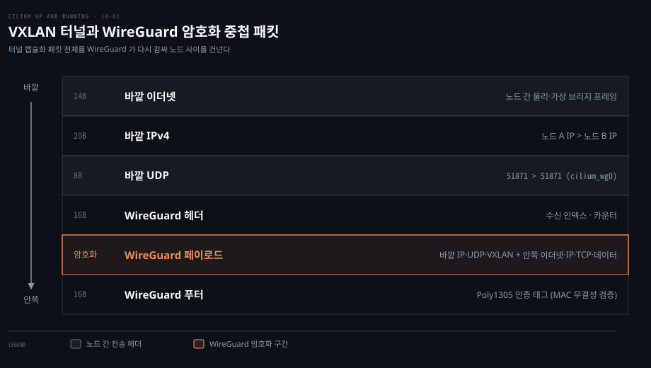
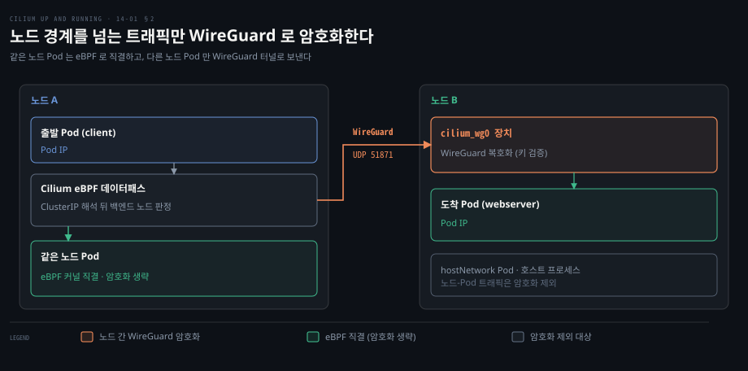
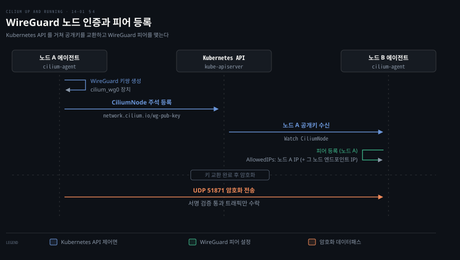
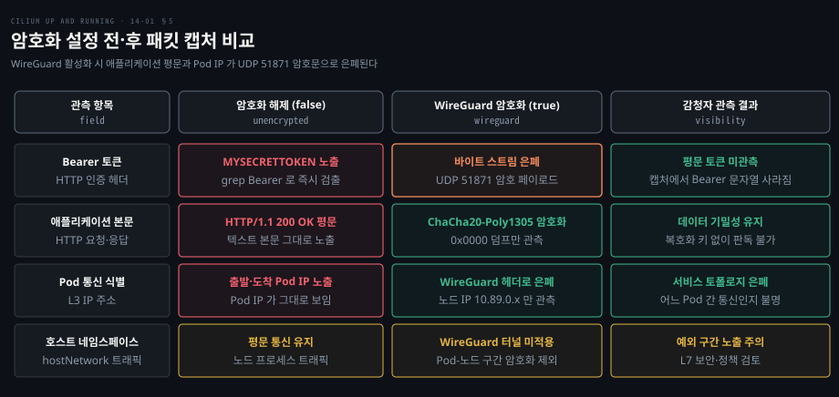

# Transparent Encryption 은 노드 사이 트래픽을 WireGuard 로 감싼다

---

> Cilium 의 Transparent Encryption 은 애플리케이션 수정이나 사이드카 프록시 없이 커널 WireGuard 로 노드 간 패킷을 감싸 이동 중 데이터의 기밀성과 무결성을 보장합니다.


## 핵심 요약

> 이 편의 중심 생각은 플랫폼 엔지니어가 개별 애플리케이션 코드를 손대지 않고도 하부 네트워크 구간의 도청과 변조를 막는 암호화를 CNI 계층에서 일괄 강제한다는 것입니다.

**Transparent Encryption**(투명 암호화)은 패킷이 출발 노드를 떠날 때 암호화하고 목적지 노드에 들어설 때 복호화합니다. 애플리케이션은 암호화 터널의 존재를 알 필요가 없습니다. 서비스 메시처럼 L7 프록시와 상호 TLS 핸드셰이크를 맺지 않으므로 HTTP 뿐 아니라 TCP 와 UDP 트래픽까지 보호합니다.

암호화는 eBPF 가 ClusterIP 주소를 실제 백엔드 Pod IP 로 변환한 뒤, 그 백엔드가 다른 노드에 있을 때만 호스트의 `cilium_wg0` 인터페이스(UDP 51871)를 거치며 일어납니다. 같은 노드 내부 Pod 간 트래픽은 커널 안에서 eBPF 로 직결되므로 암호화 비용을 치르지 않습니다.

VXLAN 터널 모드에서는 2계층 터널 캡슐화가 끝난 패킷 바깥에 WireGuard 헤더를 덧씌워 전송합니다. 노드 간 상호 인증은 Kubernetes API 의 `CiliumNode` 객체 주석을 통해 공개키를 교환함으로써 별도 외부 키 관리 인프라 없이 성립합니다.




## 학습 목표

> 이 편을 읽고 나면 다음을 설명할 수 있습니다.

1. 컴플라이언스와 위협 모델 관점에서 Transparent Encryption 이 방어하는 공격과 보호 범위를 벗어나는 영역을 구분할 수 있습니다.
2. 같은 노드 Pod 간 통신에서 암호화를 건너뛰는 커널 eBPF 데이터패스의 이유와 ClusterIP 주소 해석의 선후 관계를 설명할 수 있습니다.
3. VXLAN 터널 모드와 native routing 모드 각각에서 WireGuard 암호화가 중첩되는 패킷 헤더 구조를 분석할 수 있습니다.
4. Kubernetes API 제어면을 신뢰의 루트로 삼아 `CiliumNode` 주석으로 공개키를 교환하고 WireGuard 피어를 구성하는 절차를 설명할 수 있습니다.
5. Helm 설정으로 WireGuard 암호화를 켜고, Cilium CLI 및 tcpdump 패킷 캡처를 통해 평문 노출 차단과 hostNetwork 예외를 검증할 수 있습니다.


## 1. 무엇을 막으려는 암호화인지 먼저 정한다

> 규제 준수 요구와 네트워크 도청 위협을 명확히 정의하지 않고 막연한 안전을 위해 암호화를 켜면 성능과 디버깅 비용만 치르게 됩니다.

클러스터 보안을 강화하자는 논의는 흔히 "모든 통신을 암호화하자"는 막연한 요구로 시작됩니다. 그러나 암호화는 CPU 연산과 패킷 헤더 오버헤드를 수반하며 네트워크 장애 추적을 어렵게 만듭니다. 우리는 하부 스위치나 가상 브리지 구간에서 누구의 어떤 행위를 막으려는 것일까요?

### 컴플라이언스와 조직의 분리

의료·금융 같은 규제 산업에는 제3자 기관이 정하고 외부 감사인이 점검하는 컴플라이언스 프레임워크가 있고, 데이터가 통신망을 지날 때 암호화할 것을 요구하는 경우가 많습니다. 이를 **이동 중 암호화**(encryption in flight)라고 부릅니다. 규제 대상 기관에 서비스를 제공하는 회사도 거래 조건으로 같은 규칙을 따라야 할 수 있습니다.

이때 플랫폼 팀과 애플리케이션 팀의 분리가 문제로 떠오릅니다. 수백 개 마이크로서비스마다 TLS 설정을 검증하고 인증서를 갱신하기는 어렵습니다. 투명 암호화는 파드 수정이나 팀 간 조율 없이 인프라 계층에서 클러스터 전역의 암호화 요구를 충족합니다.

### 위협 모델과 한계

투명 암호화의 주된 목적은 노드 사이 하부 통신망을 지나는 데이터의 기밀성과 무결성을 지키는 것입니다.

| 구분 | 보호 대상 | 보호 범위 밖 |
|---|---|---|
| 방어 영역 | 물리 스위치·라우터 도청 | 노드 루트·커널 권한 탈취 |
| 방어 영역 | 가상 스위치 트래픽 감청 | 동일 노드 내부 메모리 스눕 |
| 방어 영역 | 전송 중 패킷 변조·스푸핑 | 트래픽 패턴 분석 (크기·주기) |
| 통신 유형 | 다른 노드의 Pod 간 트래픽 | 호스트 프로세스·hostNetwork Pod |

물리 케이블이나 네트워크 스위치에 접근할 수 있는 공격자가 패킷을 가로채더라도 WireGuard 로 감싼 데이터는 해독할 수 없습니다. 가상 머신 노드가 연결된 하이퍼바이저의 가상 스위치 도청도 막아냅니다.

그러나 노드 루트 권한을 장악한 침입자는 커널 메모리를 볼 수 있어 방어 대상이 아닙니다. 트래픽 흐름도 감출 수 없어 패킷 크기와 빈도로 스트리밍인지 RPC 인지 유추하는 트래픽 분석은 방어하지 못합니다.

### 기술 선택: WireGuard 와 IPsec

Transparent Encryption 은 기반 기술로 **WireGuard** 와 **IPsec** 을 지원합니다([WireGuard 공식 가이드](https://docs.cilium.io/en/v1.20/security/network/encryption-wireguard/)).

[망 계층 터널 기본기](../../../02_os/book/cntd_computer-networking-top-down/08-04.망%20계층에%20통째로%20씌우고%20무선에%20붙입니다.md)에서 살펴본 IPsec 은 오랜 기간 검증된 표준입니다. 특정 암호 알고리즘이나 키 길이를 규제 기관이 강제할 때 유용합니다([IPsec 가이드](https://docs.cilium.io/en/v1.20/security/network/encryption-ipsec/)). 다만 관리자가 공유 비밀키와 암호 알고리즘을 정해 `cilium-ipsec-keys` Secret 으로 직접 만들어야 하므로 설정이 번거롭습니다.

반면 WireGuard 는 현대 리눅스 커널(5.6 이상)에 내장된 모듈을 사용합니다. 고성능 암호(ChaCha20-Poly1305)를 사용하며 Cilium 에이전트가 키 생성과 배포를 자동화하므로 별도 수동 관리 없이 즉시 동작합니다.


## 2. 암호화는 서비스 주소를 푼 뒤 노드 사이에서만 일어난다

> 투명 암호화는 mTLS 와 달리 L7 프록시를 거치지 않으며, eBPF 가 서비스 가상 IP 를 실제 백엔드로 바꾼 뒤 노드 경계를 넘는 패킷만 선별해 암호화합니다.

클러스터 안에서 Pod 가 서비스 주소로 통신할 때, 암호화는 서비스 가상 IP 를 대상으로 일어날까요, 아니면 실제 Pod IP 를 대상으로 일어날까요? 그리고 같은 노드에 위치한 Pod 사이에는 왜 암호화가 일어나지 않을까요?

### mTLS 와의 구조적 차이

서비스 메시는 파드마다 사이드카 프록시를 띄워 L7 에서 상호 TLS(mTLS)를 수행합니다. 프록시가 TCP 세션을 종단하므로 지연이 늘고 비-HTTP 나 UDP 애플리케이션을 투명하게 수용하기 까다롭습니다.

반면 Cilium 의 투명 암호화는 mTLS 를 쓰지 않고 네트워크 계층(L3)에서 커널 WireGuard 터널로 패킷을 감쌉니다. 애플리케이션이 HTTP 이든 임의의 TCP 나 UDP 이든 상관없이 투명하게 노드 사이를 건너갑니다.

### ClusterIP 해석 후 노드 간 선별 암호화

[kube-proxy 를 대신하는 eBPF 데이터패스](./06-01.Cilium%20은%20kube-proxy%20를%20eBPF%20로%20대신하고%20외부%20서비스에%20IP%20와%20경로를%20붙인다.md)에서 살펴본 것처럼, Cilium 은 소켓 단계나 veth 인그레스에서 ClusterIP 가상 주소를 백엔드 Pod 의 실제 IP 로 변환합니다.

투명 암호화는 서비스 주소 해석이 끝난 뒤 실행됩니다. 백엔드 Pod 가 다른 노드에 위치한 패킷만 선별되어 `cilium_wg0` 인터페이스로 전달됩니다. L7 정책이 있어도 송신 노드 Envoy 프록시를 나온 뒤 암호화되고 수신 노드 Envoy 직전에 복호화됩니다.

### 같은 노드 Pod 간 암호화를 건너뛰는 이유

[Cilium 데이터패스](./05-01.Cilium%20데이터패스는%20같은%20노드는%20eBPF%20로%20바로%20넘기고%20다른%20노드는%20라우팅이나%20터널로%20잇는다.md)에서 확인했듯, 같은 노드의 두 Pod 는 호스트 쪽 veth 인터페이스(`lxc*`)에 장착된 eBPF 프로그램이 커널 메모리에서 상대 veth 로 패킷을 직결합니다.

두 Pod 사이에 브리지나 가상 스위치가 전혀 없습니다. 여기서 암호화를 수행하면 패킷을 암호화하자마자 동일 커널 안에서 즉시 복호화하게 됩니다. 물리 네트워크에 노출되지 않으므로 보안 이득 없이 CPU 자원만 낭비하게 됩니다.



### 암호화가 적용되지 않는 통신 경로

투명 암호화는 서로 다른 노드에 위치한 Pod 사이의 트래픽만 암호화합니다. 다음 흐름은 암호화되지 않고 평문으로 전송됩니다. 이는 기본값 기준입니다. v1.20 에서는 `encryption.nodeEncryption=true`(beta)를 켜면 노드와 노드 사이, Pod 와 노드 사이 트래픽도 WireGuard 로 감싸고, control-plane 노드는 기본으로 빠집니다([문서](https://docs.cilium.io/en/v1.20/security/network/encryption-wireguard/#node-to-node-encryption-beta)).

1. 동일한 노드에 위치한 Pod 간 통신
2. Pod 와 호스트 프로세스(또는 `hostNetwork: true` Pod) 간 통신
3. 호스트 프로세스 상호 간 통신
4. 클러스터 외부 목적지로 나가는 트래픽
5. UNIX 도메인 소켓처럼 네트워크 인터페이스를 거치지 않는 로컬 통신
6. 동일한 Pod 내부 컨테이너 간 루프백 통신


## 3. 터널과 WireGuard 는 겹쳐 쓴다

> VXLAN 터널 모드에서는 터널링으로 생성된 2계층 캡슐화 패킷 전체를 WireGuard 가 다시 3계층 페이로드로 감싸 2중 캡슐화가 일어납니다.

오버레이 네트워크를 구성하기 위해 VXLAN 터널을 쓰는 클러스터에 WireGuard 암호화를 켜면 어느 기술이 우선할까요? 두 기술은 상충하지 않고 중첩되어 동작합니다.

### WireGuard 의 L3 캡슐화

WireGuard 는 3계층(IP) 캡슐화 기술입니다. IP 헤더부터 TCP/UDP 전송 계층 헤더와 애플리케이션 데이터 전체를 변경 없이 암호화하고, 이를 새로운 WireGuard UDP 패킷의 페이로드로 포장합니다. Cilium 이 사용하는 기본 수신 포트는 **UDP 51871** 입니다([types.go](https://github.com/cilium/cilium/blob/v1.20.2/pkg/wireguard/types/types.go)).

원격 노드에 도착한 패킷은 커널의 WireGuard 구현체에 의해 복호화되어 본래 패킷으로 복원된 뒤 목적지 Pod 에 전달됩니다.

### VXLAN 모드에서의 2중 캡슐화 구조

[Cilium 데이터패스 터널링](./05-01.Cilium%20데이터패스는%20같은%20노드는%20eBPF%20로%20바로%20넘기고%20다른%20노드는%20라우팅이나%20터널로%20잇는다.md)에서 살펴본 것처럼 VXLAN 은 2계층 캡슐화를 수행합니다. VXLAN 모드에서 투명 암호화를 적용하면 먼저 VXLAN 터널 캡슐화가 수행된 다음, 그 결과물 패킷 전체가 WireGuard 암호화 대상이 됩니다.

패킷은 바깥 이더넷 14B·IPv4 20B·UDP 8B(포트 51871), WireGuard 헤더 16B(수신 인덱스·카운터)로 시작합니다. 그 안쪽 페이로드에는 VXLAN 터널과 원본 Pod 패킷이 암호화되어 담기며 끝에 Poly1305 인증 태그 16B 가 붙습니다.

이 구조로 인해 VXLAN 터널 오버헤드 약 50바이트에 WireGuard 의 바깥 IP·UDP·헤더·태그가 더해집니다. Cilium 은 MTU 를 계산할 때 WireGuard 몫으로 95바이트를 잡고 터널 몫 50바이트를 더 빼서 Pod MTU 를 자동으로 낮춥니다([mtu.go](https://github.com/cilium/cilium/blob/v1.20.2/pkg/mtu/mtu.go)).

### Native Routing 모드에서의 암호화

native routing 모드에서는 VXLAN 이 없으므로 2중 캡슐화가 일어나지 않습니다. 다만 서로 다른 노드의 Pod 사이 패킷은 여전히 WireGuard 로 감싸져 전송됩니다. 노드-Pod 통신과 외부 북남 트래픽 처리를 위해 암호화를 켜도 Pod 대역을 하부 망에서 라우팅 가능하게 두는 편이 여전히 권장됩니다.


## 4. WireGuard 는 노드 키로 서로를 확인한다

> Cilium 은 에이전트 기동 시 생성한 WireGuard 공개키를 Kubernetes API 의 CiliumNode 객체에 주석으로 기록하여 제어면 기반의 안전한 상호 인증을 완성합니다.

WireGuard 는 데이터 암호화뿐 아니라 노드 간 상호 인증도 담당합니다. 통신 패킷을 암호화하더라도 공격자가 가짜 패킷을 주입하거나 노드를 사칭할 수 있다면 무결성이 깨집니다. Cilium 은 수많은 노드가 오가는 환경에서 어떻게 키를 안전하게 교환할까요?

### Kubernetes API 를 신뢰의 루트로 삼는 키 분배

전통적인 VPN 은 사전에 인증서 발급 기관을 세우거나 관리자가 비밀키를 수동 배포해야 했습니다. Cilium 은 Kubernetes API 제어면 자체를 **신뢰의 루트**(Root of Trust)로 활용합니다([Cilium agent.go 소스](https://github.com/cilium/cilium/blob/v1.20.2/pkg/wireguard/agent/agent.go)).

1. **키 쌍 생성**: 각 노드의 `cilium-agent` 가 시작될 때 커널 WireGuard 장치(`cilium_wg0`)를 올리고, 상태 디렉터리의 개인키를 읽어 공개키와 키 쌍을 만듭니다. 개인키 파일이 없으면 새로 만들어 저장합니다.
2. **주석 등록**: 에이전트는 생성된 공개키를 해당 노드의 `CiliumNode` 커스텀 리소스 주석 `network.cilium.io/wg-pub-key` 에 기록합니다.
3. **피어 발견**: 다른 노드들은 `CiliumNode` 객체의 변경 사항을 API 감시(Watch)로 수신하여 피어 노드의 공개키와 노드 IP 를 얻습니다.
4. **피어 설정**: 각 노드의 WireGuard 모듈은 발견된 피어 노드의 공개키를 등록하고, 노드 IP 를 `AllowedIPs` 에 넣습니다. native routing 에서는 ipcache 에 그 노드 소속으로 올라온 엔드포인트 IP 도 하나씩 더합니다([agent.go](https://github.com/cilium/cilium/blob/v1.20.2/pkg/wireguard/agent/agent.go)).



WireGuard 터널은 기대하는 공개키 쌍으로 암호화되고 서명된 패킷만 수신하도록 커널 수준에서 제한됩니다. 키 배포가 Kubernetes API 서버의 인증과 권한 제어 아래 이루어지므로, API 제어면의 보안이 암호화 터널의 신뢰성을 뒷받침합니다.


## 5. 설정하고 캡처로 암호화를 확인한다

> Helm 값 두 줄로 암호화를 켜고, Cilium 상태의 공개키와 tcpdump 16진수 암호문 덤프로 평문 은폐를 검증합니다.

설정을 마친 클러스터에서 데이터가 실제로 암호화되어 흐르고 있는지 어떻게 증명할 수 있을까요? 예시 kind 클러스터를 구성하고 패킷 캡처로 확인할 수 있습니다.

### Helm 설정과 활성화

Cilium 에서 WireGuard 투명 암호화를 활성화하는 설정입니다.

```yaml
encryption:
  enabled: true
  type: wireguard
```

기존 클러스터에서 암호화를 켤 때는 `cilium` 데몬셋과 `cilium-operator` 디플로이먼트를 롤아웃 재시작해야 합니다. 이 과정에서 일시적인 패킷 유실과 연결 끊김이 발생하므로 점검 시간에 진행해야 합니다.

### 상태 점검과 공개키 확인

컨트롤 플레인 노드 1대(`ch14-control-plane`)와 워커 노드 2대(`ch14-worker`, `ch14-worker2`)로 구성된 예시 kind 클러스터(`ch14`)에서 Cilium CLI 로 상태를 점검합니다.

```bash
cilium status -o json \
    | jq '.cilium_status[].encryption.wireguard.interfaces'
```

```json
[
  {
    "listen-port": 51871,
    "name": "cilium_wg0",
    "peer-count": 3,
    "peers": null,
    "public-key": "itVM9s3GXsjJa9xwNlwSxfT1VKGdyOaomN7wDE7mqwE="
  }
],
[...]
```

출력에 보이는 인터페이스는 `cilium_wg0` 이름으로 포트 51871 에서 대기 중이며 공개키가 발급되었습니다. `[...]` 뒤로 다른 노드의 항목이 이어지고, `peer-count` 는 예시 실습의 출력값입니다. Kubernetes 의 `CiliumNode` 리소스에서도 동일한 공개키가 주석으로 등록되어 있음을 확인할 수 있습니다.

```bash
kubectl get ciliumnode -o json | jq "$(cat <<EOF
.items[] | {
    "name": .metadata.name,
    "wg-pub-key": .metadata.annotations["network.cilium.io/wg-pub-key"]
}
EOF
)"
```

```json
{
  "name": "ch14-control-plane",
  "wg-pub-key": "qkCH1M3cYPFUzd/lyMRIGFMQxJ9bAPVwn6MrKakNGnw="
}
{
  "name": "ch14-worker",
  "wg-pub-key": "itVM9s3GXsjJa9xwNlwSxfT1VKGdyOaomN7wDE7mqwE="
}
{
  "name": "ch14-worker2",
  "wg-pub-key": "ZLCwOShY+Vj67R9yu4oQJwEshD9NAdeAtPT666wMb1k="
}
```

### 암호화 해제 시의 평문 노출 확인

암호화가 없을 때의 상태를 확인하기 위해 `encryption.enabled=false` 로 설정하고 테스트 Pod 를 배포합니다. 파드 안티어피니티로 클라이언트와 웹서버가 서로 다른 워커 노드에 뜨도록 합니다.

노드들이 연결된 가상 브리지 인터페이스에서 netshoot 컨테이너로 `Bearer` 토큰을 필터링합니다.

```bash
bridge_name="$(docker network list \
    --format json \
    | jq -r '.[] | select(.name == "kind") | .network_interface')"

docker run \
    --network host \
    --privileged \
    -it \
    nicolaka/netshoot \
    tcpdump -lAi "$bridge_name" \
    | grep "Bearer"
```

다른 터미널에서 클라이언트 Pod 를 통해 비밀 토큰을 실은 요청을 보냅니다.

```bash
kubectl exec deploy/client \
    -- curl -sIH "Authorization: Bearer MYSECRETTOKEN" \
    webserver | head -n1
# HTTP/1.1 200 OK
```

요청과 동시에 tcpdump 실행 화면에 `Authorization: Bearer MYSECRETTOKEN` 문자열이 나타납니다. 브리지에 접근할 수 있는 도청자에게 토큰이 노출될 수 있음을 보여 줍니다.

### WireGuard 활성화 후 암호화 패킷 관측

이제 `encryption.enabled=true` 로 암호화를 다시 켜고 동일한 요청을 보냅니다. tcpdump 화면에서는 더 이상 "Bearer" 문자열이나 평문 HTTP 내용이 나타나지 않습니다.

WireGuard 수신 포트인 UDP 51871 로 필터를 걸어 패킷의 16진수 덤프를 관측합니다.

```bash
docker run \
    --network host \
    --privileged \
    -it \
    nicolaka/netshoot \
    tcpdump -vlXXi "$bridge_name" udp and port 51871
# tcpdump: listening on docker1, link-type EN10MB (Ethernet), snapshot length 262144 bytes
# 02:55:16.978847 IP (tos 0x0, ttl 64, id 28877, ... length 172)
#     10.89.0.22.51871 > 10.89.0.21.51871: UDP, length 144
#     0x0000: eabb ef9a 623c 8a8d 46bf 99b8 0800 4500  ....b<..F.....E
#     0x0010: 00ac 70cd 0000 4011 f497 0a59 0016 0a59  ..p...@....Y..
#     [...]
```

출발 노드(`10.89.0.22`)에서 목적지 노드(`10.89.0.21`)의 51871 포트로 UDP 데이터그램이 전송됩니다. 페이로드는 암호화되어 바이트 스트림 외에는 애플리케이션 정보나 Pod IP 가 노출되지 않습니다.



### 호스트 네임스페이스 트래픽의 평문 예외 확인

클라이언트 Pod 가 호스트 네트워크 네임스페이스(`hostNetwork: true`)를 사용하도록 변경해 봅니다.

```bash
kubectl patch deploy client --type json --patch-file /dev/stdin <<EOF
[
    {
        "op": "replace",
        "path": "/spec/template/spec/hostNetwork",
        "value": true
    },
    {
        "op": "replace",
        "path": "/spec/template/spec/dnsPolicy",
        "value": "ClusterFirstWithHostNet"
    }
]
EOF
```

패치 후 요청을 보내면, 기본 설정에서는 투명 암호화가 켜져 있어도 노드와 다른 노드의 Pod 사이 트래픽은 WireGuard 터널에 들어가지 않고 평문으로 전달됩니다. 운영자는 이 예외 범위를 인지하고 필요에 따라 L7 보안·정책을 검토해야 합니다.


## 면접 대비

> 면접관은 Transparent Encryption 의 동작 원리뿐 아니라 서비스 메시 mTLS 와의 차이점, MTU 오버헤드, 키 관리 방식의 장단점을 깊이 파고듭니다.

1. Cilium 의 Transparent Encryption 과 서비스 메시의 mTLS 방식의 아키텍처적 차이점과 각각의 장단점은 무엇입니까?
2. Cilium WireGuard 암호화 환경에서 동일 노드 내부 Pod 간 트래픽이 암호화되지 않는 기술적 이유를 데이터패스 관점에서 설명해 주십시오.
3. 클러스터가 VXLAN 오버레이 모드로 동작할 때 WireGuard 투명 암호화가 켜지면 패킷 헤더는 어떻게 구성되며, MTU 관점에서 고려할 사항은 무엇입니까?
4. Kubernetes 클러스터의 여러 노드 사이에서 WireGuard 공개키가 교환되고 상호 인증이 이루어지는 원리와, 이 방식의 신뢰 기반은 무엇입니까?
5. Transparent Encryption 이 활성화된 환경에서도 암호화되지 않고 평문으로 흐르는 트래픽의 종류에는 어떤 것들이 있습니까?


## 정답 (자답 후 펼치기)

### 정답 1 — L3 커널 캡슐화와 L7 프록시 세션의 분리

Transparent Encryption 은 3계층에서 커널 WireGuard 모듈을 통해 패킷을 캡슐화합니다. 애플리케이션 수정이나 L7 사이드카 프록시가 필요 없으며, TCP 뿐 아니라 임의의 UDP 와 비-HTTP 프로토콜까지 성능 저하를 최소화하며 암호화합니다. 반면 mTLS 는 L7 프록시가 워크로드의 암호학적 신원을 검증하고 세션을 종단하므로 세밀한 애플리케이션 인가 정책이 가능하지만 프록시 리소스와 지연 시간 비용이 큽니다.

### 정답 2 — eBPF 인-커널 리다이렉트와 암호화 무용성

동일 노드 내부의 두 Pod 는 호스트 쪽 veth 인터페이스에 붙은 eBPF 프로그램이 커널 메모리 안에서 목적지 Pod 의 veth 로 패킷을 직접 전달합니다. 물리 네트워크나 가상 브리지를 거치지 않으므로 감청 위협이 없으며, 한 커널 안에서 암호화한 뒤 즉시 복호화하는 불필요한 CPU 낭비를 없애기 위해 암호화를 건너뜁니다.

### 정답 3 — 2중 캡슐화 헤더 오버헤드와 MTU 마진 확보

VXLAN 모드에서는 Pod 패킷이 2계층 VXLAN 캡슐화를 거친 후, 그 전체가 다시 WireGuard 로 암호화 포장되는 2중 캡슐화가 발생합니다. VXLAN 터널 오버헤드 약 50바이트에 WireGuard 의 바깥 IP·UDP·헤더·태그가 더해지며, Cilium 은 WireGuard 몫 95바이트와 터널 몫 50바이트를 빼서 Pod MTU 를 자동으로 낮춥니다.

### 정답 4 — CiliumNode 주석 감시와 Kubernetes API 제어면 신뢰

각 노드의 `cilium-agent` 는 기동 시 상태 디렉터리의 개인키를 읽고 없으면 새로 만들어 WireGuard 키 쌍을 준비합니다. 그리고 자신의 공개키를 `CiliumNode` 커스텀 리소스의 주석에 등록합니다. 다른 노드들은 API 감시를 통해 피어의 공개키와 노드 IP 를 얻고, 노드 IP 를 `AllowedIPs` 에 등록합니다. 별도 PKI 구축 없이 Kubernetes API 서버의 보안 인증 체계가 전체 암호화의 신뢰의 루트로 동작합니다.

### 정답 5 — 동일 노드 Pod 간·호스트 네임스페이스·외부 통신 예외

기본 설정 기준입니다. 동일 노드 내 Pod 간 트래픽, Pod 와 호스트 프로세스 간 트래픽, 두 호스트 프로세스 간 통신은 암호화 대상이 아닙니다. 클러스터 외부로 나가는 트래픽과 UNIX 도메인 소켓 및 동일 Pod 내부 컨테이너 간 루프백 통신도 제외되어 평문으로 흐릅니다.


## 참고 자료

- 《Cilium: Up and Running》(Nico Vibert · Filip Nikolic · James Laverack, O'Reilly, 2026, ISBN 979-8-341-62299-9) Ch.14 Transparent Encryption
- Cilium 공식 문서: [WireGuard Encryption](https://docs.cilium.io/en/v1.20/security/network/encryption-wireguard/)
- Cilium 공식 문서: [IPsec Encryption](https://docs.cilium.io/en/v1.20/security/network/encryption-ipsec/)
- Cilium 소스 코드: [pkg/wireguard/agent/agent.go](https://github.com/cilium/cilium/blob/v1.20.2/pkg/wireguard/agent/agent.go)
- WireGuard 공식 기술 명세: [WireGuard: Next Generation Kernel Network Tunnel](https://www.wireguard.com/papers/wireguard.pdf)


## 관련 문서

- [정독 인덱스](./README.md)
- [Cilium 데이터패스](./05-01.Cilium%20데이터패스는%20같은%20노드는%20eBPF%20로%20바로%20넘기고%20다른%20노드는%20라우팅이나%20터널로%20잇는다.md)
- [Cilium 아키텍처와 구성요소](./02-01.Cilium%20은%20에이전트·CNI%20플러그인·오퍼레이터로%20나눠%20노드와%20클러스터를%20맡는다.md)
- [망 계층 보안과 IPsec VPN](../../../02_os/book/cntd_computer-networking-top-down/08-04.망%20계층에%20통째로%20씌우고%20무선에%20붙입니다.md)
