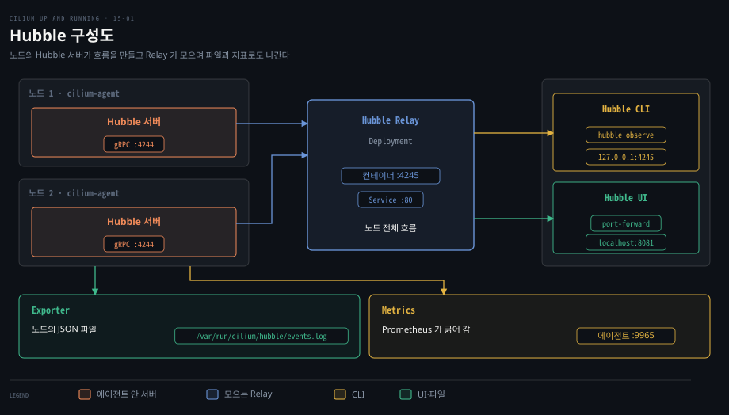
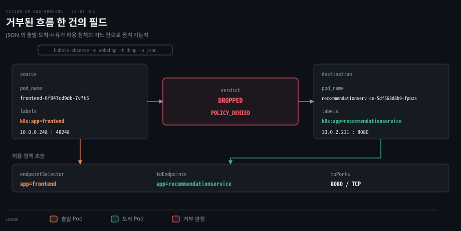
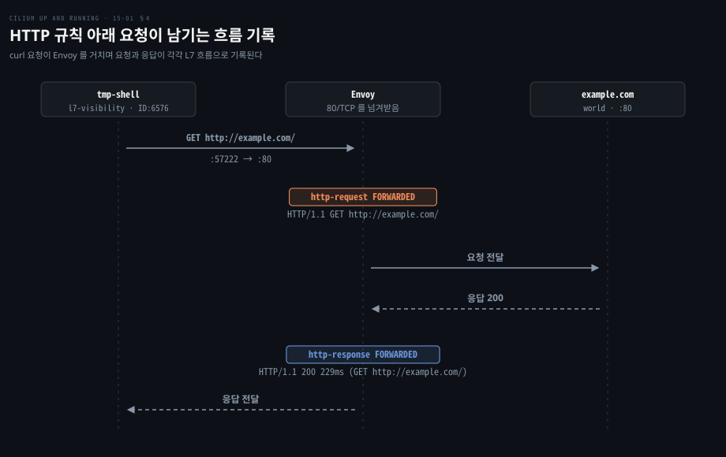
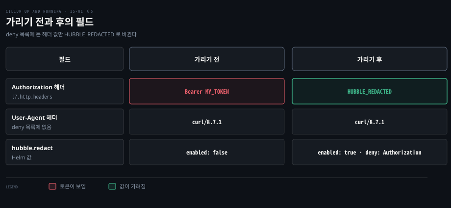

# Hubble 은 노드마다 흐름을 모아 Relay 로 묶고 L7 가시성과 지표로 내보낸다

---

> 흐름 기록은 노드의 에이전트 안 Hubble 서버가 만들고, Relay 가 그것을 클러스터 단위로 모읍니다. L7 내용은 L7 규칙이 붙은 트래픽만 보이고, 민감한 값은 설정으로 지우며, 지표는 Prometheus 로 내보냅니다.


## 핵심 요약

> Hubble 은 별도 수집 계층이 아니라 에이전트가 이미 처리하는 패킷에서 흐름을 뽑아내는 장치이므로, 어디까지 보이는지는 에이전트가 무엇을 처리하느냐에 달려 있습니다.

Hubble 서버는 노드마다 에이전트 안에서 돌고 그 노드의 흐름만 압니다. 클러스터 전체를 보려면 흐름을 합쳐 주는 Hubble Relay 를 켜야 합니다. 흐름은 노드 메모리의 링 버퍼에만 남으므로 오래 보관하려면 Exporter 로 파일에 써야 합니다.

기본으로 보이는 것은 L3 와 L4 입니다. HTTP 메서드나 DNS 이름은 L7 규칙으로 트래픽을 프록시에 태워야 보입니다. 그 대가로 지연이 늘고 헤더 같은 민감한 값이 기록에 들어오므로 redaction 으로 가리고 건수와 추세는 지표로 내보냅니다.




## 학습 목표

> 이 편을 읽고 나면 다음을 설명할 수 있습니다.

1. Hubble 서버의 역할과 Relay 가 필요한 이유를 설명할 수 있습니다.
2. `hubble observe` 필터와 JSON 출력으로 거부된 흐름의 출발·도착·사유를 읽을 수 있습니다.
3. Exporter 로 흐름을 파일에 남기는 설정과 기본 동작을 말할 수 있습니다.
4. L7 가시성이 정책 규칙에 달려 있는 이유와 DNS·HTTP 정책의 효과를 설명할 수 있습니다.
5. redaction 으로 헤더 값을 가리는 설정과 Hubble 지표를 내보내는 설정을 구분할 수 있습니다.


## 1. 흐름 기록은 노드마다 생기고 Relay 가 모은다

> Hubble 서버는 그 노드의 패킷 이벤트만 알고 있어서, 클러스터 전체를 보려면 Relay 가 에이전트마다 연결해 흐름을 모아야 합니다.

앱이 여러 노드에 흩어져 있다면 클러스터 전체의 흐름은 어디서 볼 수 있을까요?

### Hubble 서버는 에이전트 안에서 노드의 흐름만 본다

Hubble 은 별도 Pod 로 뜨지 않고 Cilium 에이전트 프로세스 안에서 돕니다. `hubble.enabled` 의 기본값이 `true` 라서 설치만 해도 켜져 있습니다([values.yaml](https://github.com/cilium/cilium/blob/v1.20.2/install/kubernetes/cilium/values.yaml)). 구성은 [에이전트·CNI 플러그인·오퍼레이터](./02-01.Cilium%20은%20에이전트·CNI%20플러그인·오퍼레이터로%20나눠%20노드와%20클러스터를%20맡는다.md)에서 다뤘습니다. Hubble 서버는 노드의 TCP 4244 에서 gRPC 로 흐름을 내놓습니다(`hubble.listenAddress`). 에이전트 컨테이너에서 `hubble status` 와 `hubble observe` 를 실행하면 그 노드의 상태와 흐름이 나옵니다.

```bash
kubectl exec -n kube-system ds/cilium -c cilium-agent -- hubble status
# Current/Max Flows: 4,095/4,095 (100.00%)
kubectl exec -n kube-system ds/cilium -c cilium-agent -- hubble observe
# 10.244.0.10:59786 (host) <-
#   kube-system/coredns-674b8bbfcf-hjd28:8181 (ID:8159)
#   to-stack FORWARDED (TCP Flags: SYN, ACK)
```

`Max Flows` 의 4,095 는 최근 흐름을 담는 링 버퍼의 크기입니다. `hubble.eventBufferCapacity` 로 바꾸며 허용 값은 2 의 거듭제곱에서 1 을 뺀 수입니다([values.yaml](https://github.com/cilium/cilium/blob/v1.20.2/install/kubernetes/cilium/values.yaml)).

흐름 한 건은 한 줄이며 화살표가 방향이고 `to-stack` 은 패킷이 관찰된 지점, `FORWARDED` 는 판정, 괄호 안은 TCP 플래그입니다. `ID:8159` 는 Cilium 이 라벨에서 만든 [identity](./12-01.Cilium%20정책은%20라벨에서%20만든%20identity%20로%20허용을%20판정하고%20정책이%20붙으면%20기본%20거부가%20된다.md) 번호입니다. tcpdump 에 Pod 이름을 입힌 것으로 생각하면 쉽습니다.

포트 8181 은 DNS(53)가 아니라 CoreDNS 의 readiness 프로브(`/ready`) 포트이고 liveness 프로브는 8080 을 씁니다.

### Relay 는 에이전트마다 연결해 한 곳으로 모은다

Relay 는 기본으로 꺼져 있습니다([values.yaml](https://github.com/cilium/cilium/blob/v1.20.2/install/kubernetes/cilium/values.yaml)의 `hubble.relay.enabled: false`). 아래 값이나 [설치 편](./03-01.Cilium%20은%20kind%20클러스터에%20Helm%20으로%20설치하고%20정책과%20Hubble%20로%20동작을%20확인한다.md)에서 쓴 `cilium hubble enable` 을 씁니다.

```yaml
hubble:
  relay:
    enabled: true
```

`kube-system` 에 `hubble-relay` 디플로이먼트가 생깁니다. 컨테이너는 4245 에서 듣고 서비스는 기본 80 포트를 엽니다(TLS 를 켜면 443). 값은 [values.yaml](https://github.com/cilium/cilium/blob/v1.20.2/install/kubernetes/cilium/values.yaml)의 `listenPort`·`servicePort` 주석에 있습니다.

에이전트에 `kubectl exec` 하면 특권 컨테이너의 셸을 얻으므로 권한이 넓습니다. 관측만 필요하면 Relay 로 포트 포워딩을 거는 쪽이 낫습니다.

```bash
kubectl port-forward -n kube-system deploy/hubble-relay 4245
hubble status
# Current/Max Flows: 12,285/12,285 (100.00%)
# Connected Nodes: 3/3
```

`Max Flows` 12,285 는 노드 셋의 링 버퍼를 합친 수(4,095 의 세 배)이고 `Connected Nodes: 3/3` 이 연결된 에이전트 수입니다. 이 클러스터의 `hubble observe` 에는 Relay Pod 에서 세 노드의 `:4244` 로 가는 흐름도 섞여 나옵니다.

### UI 는 Relay 에서 흐름을 받아 그린다

`hubble.ui.enabled: true` 로 Hubble UI 를 켭니다. Relay 에 붙는 별도 디플로이먼트이고 `cilium hubble ui` 로 열거나, 예시처럼 `kubectl port-forward -n kube-system deploy/hubble-ui 8081` 뒤 `localhost:8081` 로 엽니다. 서비스 사이 의존 관계와 판정, identity 가 보이지만 HTTP 헤더는 CLI 의 JSON 출력에서만 나옵니다. 버퍼를 넘긴 과거는 3절의 Exporter 로 남깁니다.


## 2. CLI 필터와 JSON 출력으로 흐름을 좁혀 본다

> 클러스터 전체 흐름은 양이 많아 네임스페이스·라벨·이벤트 유형으로 좁히고, 거부된 흐름은 JSON 으로 뽑아 정책의 재료로 씁니다.

문서도 없이 올라온 서비스 묶음에서 어느 서비스가 어느 서비스와 통신하는지는 무엇으로 알 수 있을까요? 예시는 `webshop` 네임스페이스의 데모 쇼핑몰입니다.

### 필터는 네임스페이스에서 라벨과 이벤트 유형으로 좁힌다

```bash
hubble observe -n webshop
hubble observe -n webshop --label app=frontend
```

자주 쓰는 플래그는 네임스페이스 `-n`, 이벤트 유형 `-t`, 라벨 `--label`, 출발 Pod `--from-pod`, HTTP 응답 코드 `--http-status`, JSON 출력 `--output json` 이며 겹쳐 쓸 수 있습니다. 전체 목록은 `hubble observe --help` 에 있습니다.

### 거부된 흐름은 -t drop 으로 사유와 함께 본다

이 네임스페이스에 실수로 모든 ingress 를 막는 정책을 걸었다고 해 봅시다. 빈 `endpointSelector` 는 네임스페이스의 모든 Pod 를 고르고 빈 ingress 규칙은 아무것도 허용하지 않으므로 서비스 사이 통신이 전부 끊깁니다.

```yaml
apiVersion: "cilium.io/v2"
kind: CiliumNetworkPolicy
metadata:
  name: "deny-all-ingress"
  namespace: webshop
spec:
  endpointSelector: {}
  ingress:
  - {}
```

`-t drop` 으로 버려진 패킷만 보면 사유가 함께 나옵니다.

```bash
hubble observe -n webshop -t drop
# webshop/frontend-6f947cd9db-7v7t5:35310 (ID:47031) <>
#   webshop/checkoutservice-5b857ffb9-ppzvv:5050 (ID:12866)
#   Policy denied DROPPED (TCP Flags: ACK)
```

`Policy denied` 는 정책 때문에 버려졌다는 뜻이고 어느 연결을 열어야 하는지가 이 줄에 있습니다.

### JSON 출력은 정책을 쓸 재료를 준다

세부 정보는 `-o json` 으로 뽑아 `jq` 로 다룹니다. 아래는 길이를 줄인 출력입니다.

```bash
hubble observe -n webshop -t drop -o json | jq
```

```json
{ "flow": {
    "verdict": "DROPPED",
    "source": { "namespace": "webshop", "labels": ["k8s:app=frontend"],
                "pod_name": "frontend-6f947cd9db-7v7t5" },
    "destination": { "namespace": "webshop",
                     "labels": ["k8s:app=recommendationservice"],
                     "pod_name": "recommendationservice-5df568d8b9-fpnzs" },
    "IP": { "source": "10.0.0.248", "destination": "10.0.2.211" },
    "l4": { "TCP": { "source_port": 48248, "destination_port": 8080 } },
    "drop_reason_desc": "POLICY_DENIED"
} }
```

`app=frontend` Pod 가 `app=recommendationservice` Pod 의 8080 포트에 접속하려다 `POLICY_DENIED` 로 막혔다는 뜻입니다. 허용 정책의 `endpointSelector`, `toEndpoints`, `toPorts` 를 채울 값이 모두 들어 있습니다.



거부된 연결을 보이는 대로 허용하면 정책을 거는 이유가 사라지므로, 통신이 왜 필요한지 따져 본 뒤 허용합니다.


## 3. Exporter 는 흐름을 파일로 남긴다

> 링 버퍼는 최근 흐름만 들고 있어서 어제 거부된 연결을 감사할 수 없습니다. Exporter 는 흐름을 노드의 파일에 JSON 으로 써서 외부 로그 저장소가 가져가게 합니다.

버퍼가 밀려난 뒤에 흐름이 필요해지면 어디서 찾을까요? 에이전트가 흐름을 노드의 파일로 쓰게 하면 되고, 파일 수집은 Grafana Loki, Fluent Bit, Splunk 같은 시스템의 몫입니다.

```yaml
hubble:
  export:
    static:
      enabled: true
      filePath: /var/run/cilium/hubble/events.log
      fileMaxSizeMb: 10
      fileMaxBackups: 5
      fileCompress: false
```

`static.enabled` 는 기본 `false` 라서 `true` 를 같이 주어야 합니다([공식 문서](https://docs.cilium.io/en/v1.20/observability/hubble/configuration/export/)). 나머지 네 값(경로·크기·백업 수·압축)은 모두 기본값이라 파일이 10MB 에 이르면 회전하고 백업을 다섯 개까지 두며 압축은 꺼져 있습니다.

`allowList`·`denyList`(JSON 흐름 필터)와 `fieldMask`(남길 필드)로 쓰는 양을 줄일 수 있습니다. `allowList` 에 `{"verdict":["DROPPED","ERROR"]}` 를 주면 거부·오류 흐름만 남습니다.

이 정적 exporter 는 에이전트 수명에 묶여 있습니다([values.yaml](https://github.com/cilium/cilium/blob/v1.20.2/install/kubernetes/cilium/values.yaml) 주석).


## 4. L7 가시성은 트래픽을 프록시에 태워야 보인다

> L3 와 L4 흐름에서는 목적지가 IP 주소로만 보입니다. DNS 이름이나 HTTP 요청을 보려면 L7 규칙으로 트래픽을 프록시에 태워야 하고, 이 규칙은 강제도 겁니다.

`example.com` 에 요청을 보냈는데 흐름에 `23.192.228.80:80` 만 찍혀 있다면 이 IP 가 그 도메인인지 어떻게 알까요?

### DNS 규칙은 IP 에 이름을 붙여 준다

L7 규칙이 담긴 `CiliumNetworkPolicy` 가 있어야 트래픽이 프록시를 거쳐 흐름에 L7 정보가 실립니다([공식 문서](https://docs.cilium.io/en/v1.20/observability/visibility/)). 실습은 새 네임스페이스의 클라이언트 Pod 로 시작합니다.

```bash
kubectl create ns l7-visibility
kubectl run -n l7-visibility --rm -it tmp-shell \
  --image nicolaka/netshoot -- bash
```

다른 터미널에서 `hubble observe -n l7-visibility -f` 로 따라가며 클라이언트에서 `curl example.com` 을 보냅니다. 목적지는 `23.192.228.80:80 (world)` 로 찍힐 뿐 도메인 이름이 없습니다.

정책으로 포트 53 의 UDP 와 TCP 를 DNS 프록시에 태우고, 나머지 외부 통신은 `toEntities: world` 로 허용합니다.

```yaml
apiVersion: "cilium.io/v2"
kind: CiliumNetworkPolicy
metadata:
  name: "dns-visibility"
spec:
  endpointSelector: {}
  egress:
  - toPorts:
    - ports:
      - port: "53"
        protocol: UDP
      - port: "53"
        protocol: TCP
      rules:
        dns:
        - matchPattern: "*"
  - toEntities:
    - world
```

같은 curl 을 다시 보내면 목적지가 이름으로 보입니다.

```bash
# l7-visibility/tmp-shell:46308 (ID:6576) ->
#   example.com:80 (world)
#   policy-verdict:L3-Only EGRESS ALLOWED (TCP Flags: SYN)
```

IP 로 직접 접속하거나 정책에 적지 않은 포트로 DNS 질의가 가면 이름 없는 IP 가 그대로 남으므로 따로 살펴봅니다. DNS 가시성은 egress 에서만 제공됩니다([공식 문서](https://docs.cilium.io/en/v1.20/observability/visibility/)).

### HTTP 규칙은 메서드·경로·상태 코드를 보여 준다

HTTP 내용을 보려면 80 포트를 Envoy 로 넘기는 정책을 겁니다. 규칙 본문이 `{}` 라서 80 포트의 HTTP 요청은 가리지 않고 모두 통과시킵니다. 다만 정책이 붙은 Pod 의 egress 는 기본 거부가 되므로 규칙에 없는 트래픽은 막힙니다([공식 문서](https://docs.cilium.io/en/v1.20/observability/visibility/)).

```yaml
apiVersion: "cilium.io/v2"
kind: CiliumNetworkPolicy
metadata:
  name: "http-visibility"
  namespace: l7-visibility
spec:
  endpointSelector: {}
  egress:
  - toPorts:
    - ports:
      - port: "80"
        protocol: TCP
      rules:
        http:
        - {}
  - toEntities:
    - world
```

요청 하나가 HTTP 흐름 두 건을 남깁니다.

```bash
# l7-visibility/tmp-shell:57222 (ID:6576) ->
#   example.com:80 (world)
#   http-request FORWARDED
#   (HTTP/1.1 GET http://example.com/)
# l7-visibility/tmp-shell:57222 (ID:6576) <-
#   example.com:80 (world)
#   http-response FORWARDED
#   (HTTP/1.1 200 229ms (GET http://example.com/))
```

요청 줄에서는 HTTP 버전 1.1, 메서드 GET, 경로 `/` 가 보이고 응답 줄에서는 상태 코드 200 과 지연 229ms 가 나옵니다.



JSON 으로 보면 헤더까지 나옵니다. 필터는 `--protocol http` 이고, 아래는 일부 필드만 옮긴 출력입니다.

```json
{ "flow": {
    "verdict": "FORWARDED",
    "l7": { "http": {
        "method": "GET", "url": "http://example.com/", "protocol": "HTTP/1.1",
        "headers": [
          { "key": "User-Agent", "value": "curl/8.7.1" },
          { "key": "X-Envoy-Internal", "value": "true" } ] } },
    "destination_names": ["example.com"],
    "Summary": "HTTP/1.1 GET http://example.com/"
} }
```

`User-Agent` 는 클라이언트가, `X-Envoy-Internal: true` 는 트래픽을 Envoy 로 돌린 Cilium 이 붙인 헤더입니다.

### 가시성은 프록시를 거치는 비용을 낸다

메서드·경로·호스트 규칙에 맞지 않는 요청은 막히므로 [L7 정책 편](./13-01.L7%20정책은%20Envoy%20로%20HTTP%20메서드와%20경로를%20검사한다.md)의 규칙과 같이 생각해야 합니다. Envoy 로 돌린 트래픽은 L3/L4 데이터패스에서 바로 처리되는 트래픽보다 지연이 늘어 지연에 민감한 워크로드에는 맞지 않을 수 있습니다.


## 5. 민감한 값은 흐름에서 지운다

> L7 가시성이 켜지면 요청 헤더의 토큰도 기록됩니다. 기본값은 가리지 않는 것이라 redaction 을 켜야 합니다.

클라이언트가 `Authorization` 헤더를 붙여 요청한다고 해 봅시다.

```bash
curl -H "Authorization: Bearer MY_TOKEN" example.com
```

JSON 출력의 `l7.http.headers` 에 토큰이 값 그대로 찍힙니다.

```json
{ "key": "Authorization", "value": "Bearer MY_TOKEN" }
```

기본값은 L7 흐름의 민감한 정보를 가리지 않는다고 공식 문서가 경고합니다([visibility](https://docs.cilium.io/en/v1.20/observability/visibility/)). 가리려면 Helm 값에 `hubble.redact` 를 설정합니다.

```yaml
hubble:
  redact:
    enabled: true
    http:
      headers:
        deny:
        - Authorization
```

`deny` 에 든 헤더는 값이 `HUBBLE_REDACTED` 로 바뀝니다. `hubble.redact.enabled` 의 기본값은 `false` 입니다.

```json
{ "key": "Authorization", "value": "HUBBLE_REDACTED" }
```



헤더 이름은 남고 값만 바뀌며 `deny` 에 없는 `User-Agent` 는 그대로 보입니다. 이 동작은 [소스](https://github.com/cilium/cilium/blob/v1.20.2/pkg/hubble/parser/seven/http.go)의 `filterHeader` 에 있고, 규칙은 세 가지입니다.

- `redact.enabled` 가 `true` 인데 `allow` 와 `deny` 가 모두 비어 있으면 모든 헤더 값을 가립니다.
- `deny` 만 있으면 그 목록의 헤더만 가립니다.
- `allow` 만 있으면 그 목록에 없는 헤더를 모두 가립니다.

`allow` 와 `deny` 는 동시에 쓸 수 없습니다. 근거는 [values.yaml](https://github.com/cilium/cilium/blob/v1.20.2/install/kubernetes/cilium/values.yaml)의 주석입니다. 헤더를 일일이 짚기 어려우면 `hubble.redact.http.headers.allow` 로 남길 헤더만 적는 쪽이 안전합니다.

헤더 말고도 URL 쿼리를 가리는 `hubble.redact.http.urlQuery`(기본 `false`)가 있습니다. `hubble.redact.http.userInfo` 는 기본 `true` 이고 URL 사용자 정보 중 basic auth 비밀번호를 가립니다.


## 6. 지표는 Prometheus 로 내보낸다

> 흐름 기록은 추세와 알림에 맞지 않습니다. Hubble 은 흐름을 세어 에이전트의 9965 포트에서 Prometheus 지표로 내놓습니다.

거부된 연결이 갑자기 늘었다는 사실은 흐름 목록을 훑어서는 알 수 없고 지표가 알려 줍니다. 지표는 기본으로 꺼져 있어([values.yaml](https://github.com/cilium/cilium/blob/v1.20.2/install/kubernetes/cilium/values.yaml)) 목록으로 켭니다.

```yaml
hubble:
  metrics:
    enabled:
    - dns
    - drop
    - tcp
    - flow
    - icmp
    - httpV2:sourceContext=workload|pod|dns|ip;destinationContext=workload|pod|dns|ip
```

`dns` 는 DNS 요청과 응답, `drop` 은 버려진 패킷과 사유, `tcp` 는 플래그와 연결 상태, `flow` 는 흐름 수, `icmp` 는 ICMP, `httpV2` 는 HTTP 상태 코드와 메서드를 셉니다. 옛 `http` 는 폐지 예정이라 `httpV2` 를 쓰고 둘은 동시에 켤 수 없습니다([공식 문서](https://docs.cilium.io/en/v1.20/observability/metrics/)).

옵션은 세미콜론으로 구분합니다. `sourceContext`·`destinationContext` 는 `source`·`destination` 레이블에 담을 값을 정합니다. `|` 로 여러 값을 적으면 비어 있지 않은 첫 값을 쓰므로 위 설정은 워크로드 이름, `네임스페이스/Pod` 형태의 Pod 이름, DNS 이름, IP 주소 순으로 찾습니다. 쓸 수 있는 값과 전체 지표 이름은 [공식 문서](https://docs.cilium.io/en/v1.20/observability/metrics/)에 있습니다.

지표는 에이전트의 9965 포트로 노출되고 이름에는 `hubble_` 접두어가 붙습니다. 대표 이름은 흐름 수 `hubble_flows_processed_total`, DNS 질의 수 `hubble_dns_queries_total`, 버려진 흐름 수 `hubble_drop_total` 입니다. HTTP 요청 수는 `hubble_http_requests_total` 입니다.

앞서 `curl` 로 보낸 요청이 `source="l7-visibility/tmp-shell"` 로 세어집니다.

```bash
hubble_http_requests_total{destination="example.com", method="GET",
  protocol="HTTP/1.1", reporter="client",
  source="l7-visibility/tmp-shell", status="200"} 3
```

Prometheus 가 이 지표를 긁어 Grafana 와 Alertmanager 로 이어 갑니다. [Prometheus 와 Grafana 배포 예](https://docs.cilium.io/en/v1.20/observability/grafana/)는 공식 문서에 있습니다. `hubble.metrics.dynamic.enabled=true` 로 동적 exporter 를 켜고 ConfigMap 에 지표 설정을 적으면 에이전트를 다시 띄우지 않고 바꿀 수 있습니다([공식 문서](https://docs.cilium.io/en/v1.20/observability/metrics/)).


## 면접 대비

> Hubble 구성과 가시성 범위에 관한 면접 질문입니다.

1. Hubble 서버와 Hubble Relay 는 각각 어디서 어떤 범위의 흐름을 다룹니까?
2. `kubectl exec` 로 에이전트에 들어가는 방법과 Relay 로 포트 포워딩하는 방법은 무엇이 다릅니까?
3. 거부된 흐름의 JSON 에서 허용 정책을 쓸 때 쓰는 필드는 무엇이고, 보이는 대로 허용하면 왜 안 됩니까?
4. L7 가시성은 왜 정책을 걸어야만 보이고, 켜면 어떤 부작용이 따릅니까?
5. Hubble 흐름을 오래 보관하는 방법과 건수·추세를 알림으로 쓰는 방법은 각각 무엇입니까?


## 정답 (자답 후 펼치기)

> 면접 질문의 키워드 중심 모범 답안입니다.

### 정답 1 — 노드 로컬 서버와 클러스터 단위 집계

서버는 에이전트 안에서 그 노드의 흐름만 링 버퍼에 두고, Relay 는 모든 에이전트의 흐름을 합쳐 CLI 와 UI 에 내놓습니다.

### 정답 2 — 특권 셸과 관측 전용 접근

`kubectl exec` 는 특권 Pod 의 셸이라 노드에 가까운 권한을 주고, Relay 로 `port-forward`(4245)를 걸면 관측 API 만 열립니다.

### 정답 3 — 출발·도착 라벨과 포트, 이유 없는 허용 금지

`source`·`destination` 의 라벨과 도착 포트가 `endpointSelector`·`toEndpoints`·`toPorts` 를 채웁니다. 보이는 대로 허용하면 정책의 이유가 사라지므로 필요한 이유를 확인한 뒤 허용합니다.

### 정답 4 — L7 규칙과 Envoy 경유 비용

L7 규칙이 담긴 정책이 있어야 트래픽이 DNS 프록시나 Envoy 로 돌려져 내용이 흐름에 실립니다. 지연이 늘고 규칙에 맞지 않는 요청을 막는 강제도 같이 걸립니다.

### 정답 5 — Exporter 와 Prometheus 지표

보관은 Exporter 가 JSON 파일로 쓰고 Loki 등이 수집합니다. 추세와 알림은 `hubble.metrics.enabled` 로 지표를 켜 9965 포트를 Prometheus 가 긁게 합니다.


## 참고 자료

- 《Cilium: Up and Running》(Nico Vibert · Filip Nikolic · James Laverack, O'Reilly, 2026, ISBN 979-8-341-62299-9) Ch.15 Observability with Hubble.
- Cilium 공식 문서 L7 가시성과 redaction: https://docs.cilium.io/en/v1.20/observability/visibility/
- Cilium 공식 문서 Hubble Exporter: https://docs.cilium.io/en/v1.20/observability/hubble/configuration/export/
- Cilium 공식 문서 지표와 컨텍스트 옵션: https://docs.cilium.io/en/v1.20/observability/metrics/
- Cilium 공식 문서 Prometheus·Grafana 배포: https://docs.cilium.io/en/v1.20/observability/grafana/
- Cilium v1.20.2 Helm 값과 소스(`install/kubernetes/cilium/values.yaml`, `pkg/hubble/parser/seven/http.go`): https://github.com/cilium/cilium/tree/v1.20.2


## 관련 문서

- [Cilium 은 에이전트·CNI 플러그인·오퍼레이터로 나눠 노드와 클러스터를 맡는다](./02-01.Cilium%20은%20에이전트·CNI%20플러그인·오퍼레이터로%20나눠%20노드와%20클러스터를%20맡는다.md)
- [Cilium 은 kind 클러스터에 Helm 으로 설치하고 정책과 Hubble 로 동작을 확인한다](./03-01.Cilium%20은%20kind%20클러스터에%20Helm%20으로%20설치하고%20정책과%20Hubble%20로%20동작을%20확인한다.md)
- [Cilium 정책은 라벨에서 만든 identity 로 허용을 판정하고 정책이 붙으면 기본 거부가 된다](./12-01.Cilium%20정책은%20라벨에서%20만든%20identity%20로%20허용을%20판정하고%20정책이%20붙으면%20기본%20거부가%20된다.md)
- [L7 정책은 Envoy 로 HTTP 메서드와 경로를 검사한다](./13-01.L7%20정책은%20Envoy%20로%20HTTP%20메서드와%20경로를%20검사한다.md)
