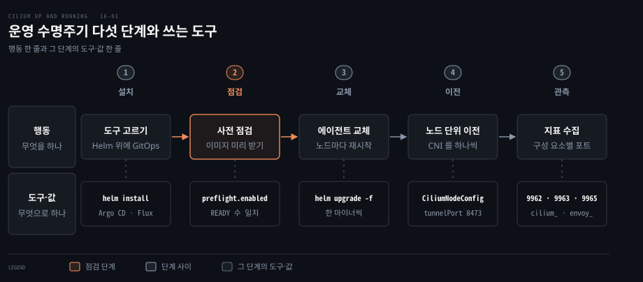
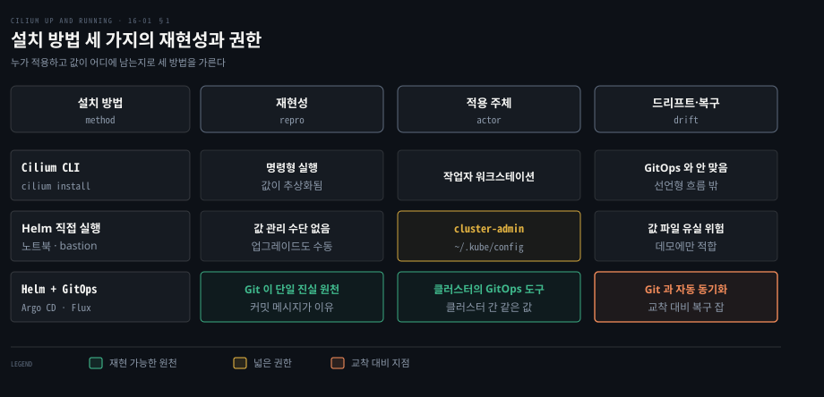
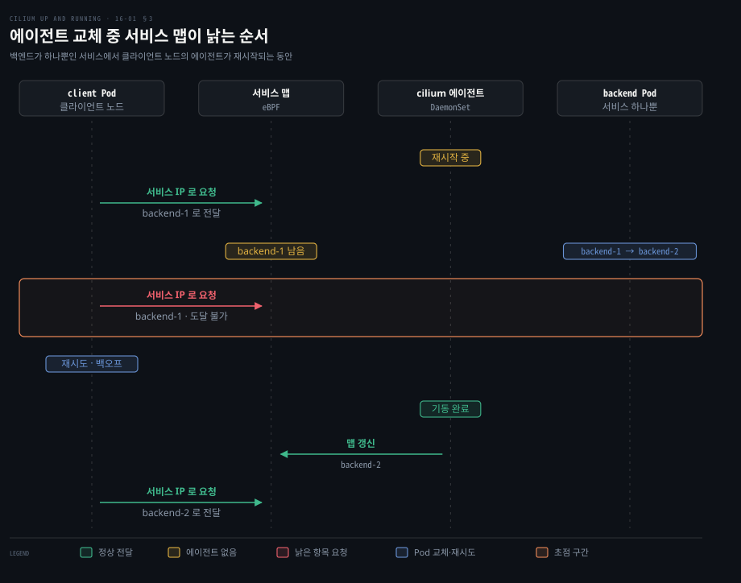
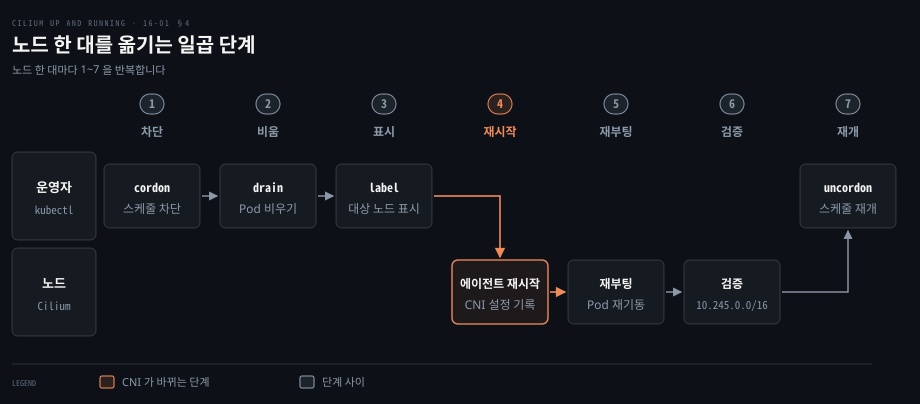

# Cilium 운영은 설치 도구와 업그레이드·CNI 이전 계획에서 시작한다

---

> 운영은 설치를 Helm 과 GitOps 로 선언해 두고, 업그레이드는 한 마이너씩 사전 점검을 거쳐 올리며, 다른 CNI 에서는 노드 단위로 옮기고, 지표를 켜서 상태를 보는 일로 이루어집니다.


## 핵심 요약

> 이 편의 중심 생각은 Cilium 운영이 어떤 도구를 쓰느냐보다 값을 어디에 선언해 두고 한 번에 얼마나 바꾸느냐의 문제라는 것입니다.

설치는 CLI 보다 Helm, Helm 도 노트북에서 돌리기보다 Git 을 원천으로 삼는 GitOps 가 낫습니다. 다만 GitOps 도구가 같은 클러스터에서 돌면 Cilium 이 깨질 때 도구도 같이 멈추므로 복구 경로를 따로 둡니다. 업그레이드는 마이너 하나씩, 최신 패치에서 출발해 새 이미지를 미리 받아 둔 뒤 올립니다.

에이전트가 재시작되는 동안에도 eBPF 데이터패스는 기존 트래픽을 나릅니다. 맵이 갱신되지 못하는 틈에 백엔드가 바뀌면 에이전트가 다시 뜰 때까지 그 서비스로 가는 요청이 실패할 수 있고, L7 프록시를 거치는 트래픽은 끊깁니다([문서](https://docs.cilium.io/en/v1.20/operations/upgrade/)). 다른 CNI 에서는 노드를 한 대씩 옮기고 상태는 9962·9963·9965 포트의 지표로 봅니다.




## 학습 목표

> 이 편을 읽고 나면 다음을 설명할 수 있습니다.

1. CLI·Helm·GitOps 의 재현성과 권한을 비교하고 GitOps 의 순환 의존과 대비책을 설명할 수 있습니다.
2. 마이너 업그레이드 전에 지킬 규칙과 `--reuse-values` 를 쓰지 않는 이유를 말할 수 있습니다.
3. 에이전트 재시작 중 계속되는 것과 요청이 실패할 수 있는 조건을 구분할 수 있습니다.
4. 다른 CNI 에서 옮기는 네 가지 방법과 이중 오버레이 이전의 전제·절차를 말할 수 있습니다.
5. 에이전트·오퍼레이터·Hubble 지표의 Helm 값과 포트를 구분할 수 있습니다.


## 1. 설치 도구는 재현성과 누가 적용하는지로 고른다

> 같은 차트라도 누가 어떻게 적용하느냐에 따라 재현성과 필요한 권한이 갈립니다. 운영에서는 Helm 을 쓰고 그 값과 적용을 Git 과 GitOps 도구에 맡기는 쪽이 낫습니다.

Cilium CLI(`cilium install`)는 설치와 Cluster Mesh 구성, 환경 자동 감지까지 해 주지만 운영에서는 Helm 이 낫습니다. CLI 는 설정을 추상화해 동작을 가리고, 워크스테이션에서 명령을 치는 명령형 방식은 선언적이고 재현 가능한 운영과 맞지 않습니다. 클러스터를 바꾸지 않는 조회(`cilium status`)는 CLI 로 해도 됩니다. 두 경로가 같은 Helm 릴리스로 모이는 모습은 [설치 편](./03-01.Cilium%20은%20kind%20클러스터에%20Helm%20으로%20설치하고%20정책과%20Hubble%20로%20동작을%20확인한다.md)에서 봤습니다.



### Helm 을 노트북이나 bastion 에서 돌리면 권한과 값이 흩어진다

노트북이나 점프 호스트에서 `helm` 을 바로 실행하면 호출하는 쪽에 cluster-admin 같은 넓은 권한이 필요하고, 온프레미스에서는 암호화되지 않은 인증서가 `~/.kube/config` 에 놓이기 쉽습니다. 값을 관리할 수단도 없어 변경은 손으로 하고 값 파일을 잃으면 되찾기 어렵습니다. 그래서 외부 클러스터에서는 데모에만 씁니다.

### GitOps 는 Git 을 단일 원천으로 삼지만 같은 클러스터에서는 순환 의존이 생긴다

Argo CD 와 Flux 는 Git 저장소와 클러스터를 지켜보다 차이를 적용하거나 제거해 둘을 맞춥니다. 저장소가 단일 진실 원천이 되고 커밋 메시지가 변경의 이유를 남기며 같은 구성을 여러 클러스터에 적용할 수 있습니다([ArgoCD GitOps 정독본](../../../07_devops/book/aic_ai-infra-claude/03-01.푸시%20배포의%20한계와%20ArgoCD%20GitOps%20—%20설치·연결·롤링·롤백.md)).

문제는 GitOps 도구가 관리 대상 클러스터 안에서 돌 때입니다. 도구가 돌려면 CNI 가 있어야 하는데 그 CNI 를 이 도구로 올리려는 닭과 달걀의 상황이 됩니다. 해법은 둘입니다.

1. 기능하는 CNI 가 있는 임시 클러스터에서 대상 클러스터에 배포하고, 대상이 올라오면 그 안에 GitOps 도구를 설치해 이후를 맡깁니다.
2. 클러스터를 만든 도구(Terraform, Ansible 등)가 첫 설치를 맡고 이후를 GitOps 가 이어받습니다.

같은 클러스터에서 관리하면 교착도 생깁니다. 잘못된 갱신으로 Cilium 이 멈추면 GitOps 도구도 같이 멈춰 설정을 고칠 길이 막힙니다. 그래서 Cilium 을 복구하는 전용 CI/CD 잡 같은 재해 복구 계획을 미리 둡니다.

Cilium CRD 는 오퍼레이터가 만들므로 CiliumNetworkPolicy 같은 리소스는 오퍼레이터가 한 번 돈 뒤에 적용합니다. v1.20.2 오퍼레이터가 리더로 선출되면 [CRD 등록](https://github.com/cilium/cilium/blob/v1.20.2/operator/cmd/root.go)을 가장 먼저 호출하기 때문입니다. 결국 CLI 보다 Helm 을, Helm 은 GitOps 와 함께 쓰되 순환 의존과 복구 경로를 준비해야 합니다.


## 2. 업그레이드는 버전 순서와 사전 점검을 지킨다

> 업그레이드는 되풀이되는 핵심 작업입니다. 한 마이너씩, 현재 버전의 최신 패치에서 출발해 새 이미지를 미리 받아 둔 뒤 값 파일로 올립니다.

새 마이너가 반년마다 나오는데 얼마나 자주, 어떻게 올려야 할까요? 새 기능 릴리스는 약 여섯 달 주기이고 마이너는 `X.Y.Z` 의 Y 입니다. 패치는 보안과 버그 수정을 담습니다. 안정 브랜치는 최신 마이너 셋만 유지되며([릴리스 관리 문서](https://docs.cilium.io/en/v1.20/contributing/release/organization/)) 현재 안정판은 [v1.20.2](https://github.com/cilium/cilium/releases/tag/v1.20.2) 입니다. 업그레이드에는 데이터패스 변경과 새 CRD 스키마가 들어올 수 있어 호환성 확인, 설정 백업, 단계별 연결 검증을 거쳐 점진적으로 내보냅니다.

올리지 않고 새 클러스터로 워크로드를 옮기는 길도 있습니다. 운영 성숙도가 필요하고 Cluster Mesh, BGP ECMP, 외부 로드밸런서가 트래픽을 넘깁니다. 그렇지 않다면 쿠버네티스 업그레이드처럼 다룹니다.

### 규칙은 한 마이너씩, 최신 패치에서 출발이다

[v1.20 업그레이드 문서](https://docs.cilium.io/en/v1.20/operations/upgrade/)가 정한 규칙은 셋입니다.

- 테스트된 업그레이드·롤백 경로는 연속한 마이너 사이뿐입니다. 1.1 에서 1.3 으로는 가지 않습니다.
- 올리기 전에 현재 버전의 최신 패치로 먼저 올립니다. 마이너 업그레이드 뒤 롤백이 필요할 때 가장 매끄럽습니다.
- 모든 Cilium 구성 요소는 같은 버전이어야 합니다. 에이전트만 올리면 예기치 않은 동작이 날 수 있습니다.

버전마다 Upgrade Notes 도 읽습니다. 예를 들어 v1.20 은 Gateway API v1.6.1 이상을 요구합니다.

### 사전 점검은 새 이미지를 노드마다 미리 받아 둔다

쿠버네티스는 Pod 를 먼저 종료하고 새 이미지를 받아 띄우므로 이미지를 받는 시간만큼 에이전트 공백이 길어집니다. **preflight 검사**는 새 이미지를 모든 노드에 미리 받아 두며 공식 문서는 필수 단계로 둡니다.

```bash
helm install cilium-preflight cilium/cilium --version <new-version> \
    --namespace kube-system \
    --set preflight.enabled=true \
    --set agent=false \
    --set operator.enabled=false
```

DaemonSet 의 READY 수가 Cilium Pod 수와 같고 Deployment 가 READY 1/1 이면 `helm delete cilium-preflight` 로 지우고 업그레이드합니다. kube-proxy 없이 도는 클러스터는 `k8sServiceHost`·`k8sServicePort` 도 넘깁니다.

### 값은 파일로 넘기고 --reuse-values 는 쓰지 않는다

값은 `helm upgrade -f my-values.yaml` 처럼 파일로 넘기고 `upgradeCompatibility` 를 처음 설치한 버전으로 둡니다. `--reuse-values` 는 새 릴리스의 새 값을 무시해 템플릿이 틀리게 렌더링될 수 있어 마이너 사이에서는 쓰지 않습니다. 대신 `helm get values` 로 저장한 값을 점검해 넘기고 되돌릴 때는 `helm rollback` 을 씁니다.


## 3. 업그레이드 중에도 데이터패스는 연결을 유지한다

> 에이전트가 노드마다 재시작되어도 커널의 eBPF 프로그램과 맵은 남아 기존 트래픽을 나릅니다. 어긋나는 것은 에이전트가 맵을 갱신해야 하는 순간과 사용자 공간 프록시를 거치는 트래픽입니다.

에이전트를 재시작하면 그 노드의 트래픽이 끊길까요? 에이전트는 맵을 쓰고 프로그램은 맵을 읽는 역할 분담이라 에이전트가 내려가도 프로그램은 마지막 상태대로 전달합니다([에이전트 중단 실험](./06-01.Cilium%20은%20kube-proxy%20를%20eBPF%20로%20대신하고%20외부%20서비스에%20IP%20와%20경로를%20붙인다.md)). 에이전트가 없는 동안에도 다음은 올바르게 동작합니다.

- 노드의 Pod 로 들어오고 나가는 라우팅
- 클러스터 전체의 Pod IP 를 향한 라우팅
- 서비스 IP 를 향한 라우팅
- L3 네트워크 정책 강제(`toCIDRSet`, `toEntities` 등)

[공식 문서](https://docs.cilium.io/en/v1.20/operations/upgrade/)도 정책이 없거나 L3/L4 정책만 걸린 연결은 영향이 최소이거나 거의 없다고 설명합니다. L7 정책이나 Ingress·Gateway API 처럼 사용자 공간 프록시를 거치는 트래픽은 끊기고 엔드포인트가 다시 연결해야 합니다. 프록시가 비는 시간은 [Day 2 점검 편](./16-02.Day%202%20장애는%20상태%20확인에서%20기능별%20점검%20순서로%20좁혀%20간다.md)에서 다룹니다.

### 어긋나는 틈은 에이전트 공백과 백엔드 교체가 겹칠 때다

맵이 낡는 경우가 하나 있습니다. 백엔드 Pod 가 `backend-1` 하나뿐인 서비스에서 클라이언트가 있는 노드의 에이전트가 재시작되는 때와 거의 같은 시각에 백엔드가 `backend-2` 로 교체됩니다. 에이전트가 없어 API 서버의 변경을 맵에 반영하지 못하므로 데이터패스는 이미 사라진 `backend-1` 로 계속 보냅니다.



클러스터 작업이 에이전트 재시작과 겹쳐야 하므로 확률은 Pod 변동량에 달렸습니다. 일시적인 오류라 에이전트가 다시 뜨면 풀립니다. 지수 백오프 같은 트래픽 제어가 있으면 대개 개입 없이 넘어갑니다.


## 4. 다른 CNI 에서 옮길 때는 노드 단위로 바꾼다

> Flannel·Calico·Canal·AWS VPC CNI 도 클러스터를 다시 만들지 않고 Cilium 으로 바꿀 수 있습니다. 새 Pod 부터 Cilium 이 맡게 하고 옛 Pod 는 다시 만들어야 하므로 과도기의 연결을 어떻게 잇느냐가 핵심입니다.

CNI 를 바꾸면 이미 떠 있는 Pod 의 네트워크는 어떻게 될까요? kubelet 은 Pod 샌드박스를 만들 때 `/etc/cni/net.d/` 에 설정된 CNI 를 부릅니다. 이 호출은 [CNI 와 kube-proxy](../networking-and-kubernetes/04-02.CNI와%20kube-proxy%20—%20Pod%20네트워크의%20배선공과%20로드밸런서.md) 노트에 있습니다. 설정 파일만 돌리면 샌드박스와 수명이 같은 기존 Pod 는 옛 플러그인에 남습니다. 이전은 이후 Pod 의 플러그인을 바꾸는 일과 옛 Pod 를 다시 만드는 일의 합이고 모든 환경에 맞는 단일 경로는 없습니다.

| 방법 | 방식 | 과도기의 대가 |
|---|---|---|
| 새 클러스터로 이전 | Cilium 클러스터를 만들고 워크로드를 다시 배포 | 준비와 일시 중단이 있지만 혼합 상태가 없고 롤백이 쉽습니다 |
| `/etc/cni/net.d/` 재설정 | 새 Pod 만 Cilium 으로 가고 옛 Pod 는 재시작 전까지 기존 CNI | 두 네트워크 사이의 라우팅을 유지해야 합니다 |
| 노드 재부팅(big bang) | 모든 노드의 CNI 설정을 바꾸고 순서대로 재시작 | 끝나기 전에는 이전한 노드와 아직인 노드가 닿지 않는 섬이 됩니다 |
| 이중 오버레이 | Cilium 을 별도 PodCIDR·오버레이로 띄우고 노드를 하나씩 옮김 | CIDR 과 캡슐화 포트가 다르면 두 쪽의 Pod 가 서로 닿습니다 |

### 이중 오버레이 이전은 새 대역과 다른 포트가 전제다

넷째 방법은 [공식 이전 문서](https://docs.cilium.io/en/v1.20/installation/k8s-install-migration/)가 절차까지 설명합니다. 한 노드의 Pod 는 한 네트워크에만 붙지만 리눅스 라우팅 테이블이 두 대역의 트래픽을 나눠 두 쪽 Pod 에 모두 닿습니다. 전제는 기존과 겹치지 않는 새 클러스터 CIDR, 충돌이 없는 cluster-pool IPAM, 구분되는 오버레이 포트나 프로토콜, 리눅스 라우팅 스택을 쓰는 기존 플러그인입니다.

BGP 라우팅, IP 패밀리 변경, 체이닝 모드의 Cilium, 기존 NetworkPolicy 제공자는 시험되지 않았습니다. 이전 중에는 비 Cilium Pod 의 트래픽이 드롭되지 않도록 `policyEnforcementMode: "never"` 로 정책 강제를 끄고 시험 클러스터에서 먼저 해 봅니다. 예시는 kind 의 기본 대역 10.244.0.0/16 과 겹치지 않는 `10.245.0.0/16`, 기존 VXLAN 과 구분되는 `tunnelPort: 8473` 입니다. 설치 값에는 `cni.customConf: true` 와 `bpf.hostLegacyRouting: true` 도 둡니다.

이 값만으로는 CNI 설정 파일을 쓰지 않아 Cilium 이 관리하는 Pod 가 없습니다. 어느 노드가 Cilium 을 CNI 로 쓸지는 **CiliumNodeConfig** 가 정합니다. 노드 셀렉터를 `io.cilium.migration/cilium-default: "true"` 라벨로 걸어 두면 처음엔 어느 노드에도 적용되지 않고, 라벨을 붙인 노드에서 에이전트가 CNI 설정 파일을 씁니다.

### 노드는 한 대씩 비우고 표시하고 재시작한다

노드 하나는 일곱 단계로 옮기며 컨트롤 플레인 노드부터 시작하지 않습니다. `cordon` 으로 스케줄을 막고 `drain` 으로 Pod 를 비웁니다. 위의 라벨을 붙이는 `label` 단계가 Cilium 의 대상 지정입니다. 그다음 Cilium Pod 를 지워 에이전트 재시작을 일으키면 CNI 설정 파일이 쓰입니다. 노드를 재부팅하면 남은 Pod 가 새 CNI 로 재기동됩니다. `cilium status` 와 Pod IP 가 `10.245.0.0/16` 안에 있는지로 검증하고 `uncordon` 합니다. 같은 단계를 다음 노드에서 되풀이합니다.



`drain` 은 권하는 단계이며 하지 않으면 재부팅 중 Pod 가 잠깐 끊깁니다. 모든 노드를 옮긴 뒤에는 이전용 값을 되돌려 Cilium 을 주 CNI 로 두고 정책을 다시 강제한 다음 `CiliumNodeConfig` 와 이전 플러그인을 지웁니다. 이전 플러그인이 남긴 iptables 규칙과 인터페이스는 다음 재부팅 때 정리됩니다.


## 5. 용량과 상태는 지표와 대시보드로 본다

> Cilium·오퍼레이터·Hubble 은 Prometheus 형식의 지표를 엽니다. 켜는 값과 포트가 구성 요소마다 다르고 에이전트와 Hubble 은 기본으로 꺼져 있습니다.

업그레이드가 끝난 뒤 에이전트가 건강한지는 무엇으로 볼까요? [Hubble 편](./15-01.Hubble%20은%20노드마다%20흐름을%20모아%20Relay%20로%20묶고%20L7%20가시성과%20지표로%20내보낸다.md)이 워크로드를 봤다면 여기서는 구성 요소 자신을 봅니다. Cilium 지표는 `cilium_`, Envoy 지표는 `envoy_` 이름공간으로 나옵니다([지표 문서](https://docs.cilium.io/en/v1.20/observability/metrics/)).

| 구성 요소 | 켜는 Helm 값 | 포트 | v1.20.2 차트 기본값 |
|---|---|---|---|
| Cilium 에이전트 | `prometheus.enabled` | 9962 | 꺼짐(`false`) |
| Cilium 오퍼레이터 | `operator.prometheus.enabled` | 9963 | 켜짐(`true`) |
| Hubble 흐름 지표 | `hubble.metrics.enabled` 목록(과 `hubble.enabled=true`) | 9965 | 꺼짐(`~`) |
| Cilium Envoy | `envoy.prometheus.enabled` | 9964 | 켜짐(`true`) |

기본값은 v1.20.2 [Helm 값 파일](https://github.com/cilium/cilium/blob/v1.20.2/install/kubernetes/cilium/values.yaml) 기준입니다. 기본으로 켜진 값도 설치 값에 적어 두면 기본값이 바뀌어도 영향이 없습니다.

시험 환경에서는 [공식 Prometheus·Grafana 예제](https://docs.cilium.io/en/v1.20/observability/grafana/)를 올려 확인합니다. 이 매니페스트는 `cilium-monitoring` 네임스페이스에 Cilium·Hubble 지표를 긁는 Prometheus 와 에이전트·오퍼레이터·Hubble 대시보드가 올라간 Grafana 를 만듭니다.

```bash
kubectl apply -f https://raw.githubusercontent.com/cilium/cilium/v1.20/examples/kubernetes/addons/prometheus/monitoring-example.yaml
kubectl -n cilium-monitoring port-forward service/grafana \
    --address 0.0.0.0 --address :: 3000:3000
```

브라우저에서 `http://localhost:3000` 을 엽니다. 운영에서는 포트 포워딩 대신 Ingress 나 Gateway API 로 노출합니다. 대시보드는 에이전트·엔드포인트 상태, 정책 강제, Hubble 흐름을 보여 주며 Prometheus 가 모든 노드에서 긁는지 확인하는 용도입니다.


## 면접 대비

> Cilium 의 설치 도구 선택, 업그레이드, CNI 이전, 지표에 관한 면접 질문입니다.

1. 운영에서 CLI 대신 Helm 과 GitOps 를 권하는 이유와 같은 클러스터를 관리할 때의 문제를 설명해 보십시오.
2. 마이너 업그레이드 전에 지킬 규칙, preflight 검사, `--reuse-values` 금지의 이유를 말해 보십시오.
3. 에이전트 재시작 중 계속 동작하는 것과 요청이 실패할 수 있는 시나리오를 설명해 보십시오.
4. 다른 CNI 에서 옮기는 네 가지 방법과 이중 오버레이 이전의 전제를 비교해 보십시오.
5. 에이전트·오퍼레이터·Hubble 지표를 켜는 값과 포트는 무엇입니까?


## 정답 (자답 후 펼치기)

> 면접 질문에 대한 키워드 중심의 모범 답안입니다.

### 정답 1 — 선언적 재현성과 순환 의존

CLI 는 설정을 추상화하고 명령형이라 선언적·재현 가능한 운영과 맞지 않습니다. GitOps 는 Git 을 단일 원천으로 삼지만 같은 클러스터에서는 순환 의존과 교착이 있어 임시 클러스터나 부트스트랩 도구로 첫 설치를 하고 복구용 CI/CD 잡을 둡니다.

### 정답 2 — 한 마이너씩과 값 파일

연속한 마이너 사이만 테스트된 경로이고 올리기 전에 최신 패치로 올립니다. preflight 검사는 새 이미지를 미리 받아 에이전트 공백을 줄입니다. `--reuse-values` 는 새 값을 무시해 잘못 렌더링될 수 있어 값 파일을 쓰고 `upgradeCompatibility` 로 처음 설치한 버전을 알립니다.

### 정답 3 — 맵 갱신 공백과 낡은 항목

에이전트가 없어도 eBPF 프로그램과 맵이 남아 Pod·서비스 IP 라우팅과 L3 정책이 계속 동작합니다. 에이전트 재시작과 백엔드 교체가 겹치면 맵이 낡아 일시적 오류가 나고 에이전트가 돌아오면 풀립니다. L7 프록시를 거치는 트래픽은 끊깁니다.

### 정답 4 — 이중 오버레이와 노드 단위 절차

새 클러스터, `/etc/cni/net.d/` 재설정, 노드 재부팅(섬 분리), 이중 오버레이 순입니다. 이중 오버레이는 새 CIDR, cluster-pool IPAM, 다른 오버레이 포트, 리눅스 라우팅 플러그인이 전제이고 정책 강제를 끈 채 `CiliumNodeConfig` 로 노드를 하나씩 옮깁니다.

### 정답 5 — 값과 포트

에이전트는 `prometheus.enabled=true` 로 9962, 오퍼레이터는 `operator.prometheus.enabled=true` 로 9963 입니다. Hubble 은 `hubble.enabled=true` 와 `hubble.metrics.enabled` 목록으로 9965 입니다. 에이전트와 Hubble 은 기본으로 꺼져 있고 v1.20.2 차트에서 오퍼레이터는 켜져 있습니다.


## 참고 자료

- Nico Vibert, Filip Nikolic, James Laverack, 《Cilium: Up and Running》, O'Reilly Media, 2026, ISBN 979-8-341-62299-9, Chapter 16 "Operations".
- Cilium 공식 문서 v1.20 (operations/upgrade, installation/k8s-install-migration, observability/metrics, observability/grafana): https://docs.cilium.io/en/v1.20/
- Cilium v1.20.2 소스와 Helm 값: https://github.com/cilium/cilium/tree/v1.20.2


## 관련 문서

- [Day 2 장애는 상태 확인에서 기능별 점검 순서로 좁혀 간다](./16-02.Day%202%20장애는%20상태%20확인에서%20기능별%20점검%20순서로%20좁혀%20간다.md)
