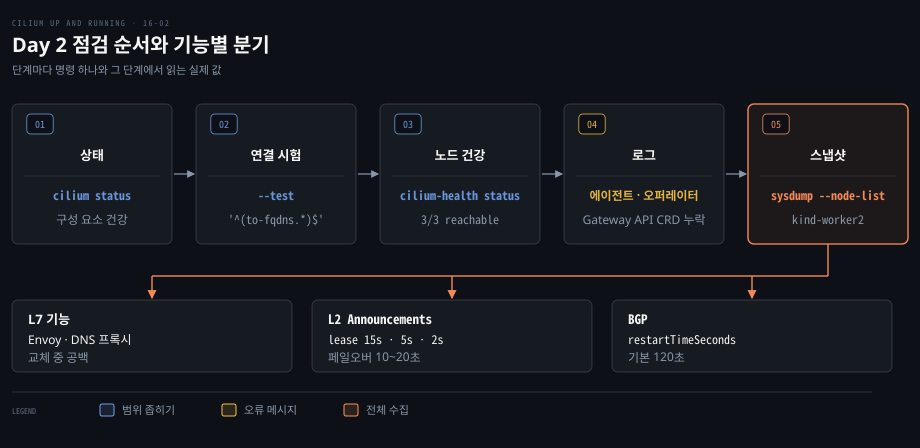
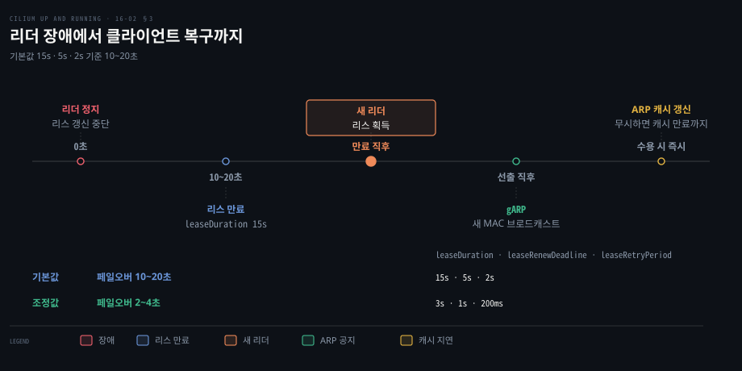
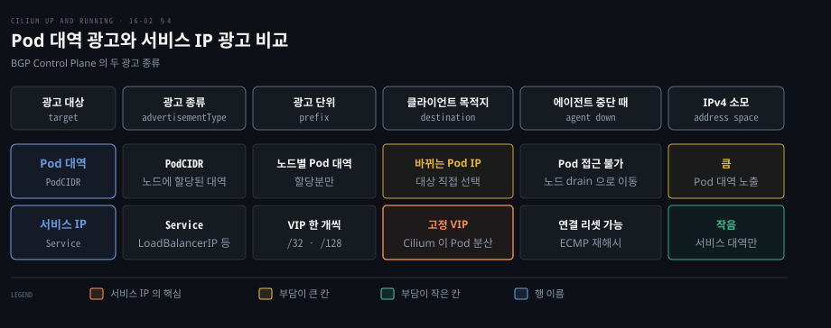

# Day 2 장애는 상태 확인에서 기능별 점검 순서로 좁혀 간다

---

> 운영 중 Cilium 이 이상하면 `cilium status` 에서 시작해 연결 시험, 노드 건강, 로그, sysdump 순으로 범위를 좁히고, 그다음 L7 프록시·L2 리더 선출·BGP 세션처럼 기능별 의존 대상과 타이머를 따집니다.


## 핵심 요약

> 이 편의 중심 생각은 장애 점검에는 순서가 있고, 기능마다 "무엇이 내려가면 무엇이 멈추는가"가 달라진다는 것입니다.

에이전트가 재시작되어도 eBPF 데이터패스는 커널에 남아 기존 연결은 대부분 유지됩니다. 그러나 Envoy, DNS 프록시, L2 리더 선출, BGP 세션은 에이전트나 DaemonSet 의 생존에 묶여 있어 증상이 기능마다 다릅니다.

그래서 점검은 두 단계입니다. 먼저 다섯 도구로 범위를 좁히고, 그다음 기능별로 L7 은 `cilium-envoy` 와 DNS 프록시, L2 Announcements 는 리스 타이머, BGP 는 광고 대상과 Graceful Restart 를 봅니다.




## 학습 목표

> 이 편을 읽고 나면 다음을 설명할 수 있습니다.

1. `cilium status` 에서 sysdump 까지 다섯 도구가 걸러 내는 범위를 순서대로 설명할 수 있습니다.
2. 에이전트 재시작에도 기존 연결이 유지되는 이유와 L7 기능이 끊기는 이유를 구분해 설명할 수 있습니다.
3. L2 Announcements 의 리스 타이머 세 값이 페일오버 시간을 정하는 방식을 설명할 수 있습니다.
4. BGP 에서 Pod 대역 광고와 서비스 IP 광고의 차이를 주소 안정성과 주소 소모로 비교할 수 있습니다.
5. Graceful Restart 의 이득과 비자발적 장애 때의 대가를 함께 설명할 수 있습니다.


## 1. 이상하면 상태·연결 시험·노드 건강을 차례로 본다

> 원인이 에이전트인지 망인지 정책인지 모르는 상태에서는 범위가 넓고 값싼 도구부터 쓰고 한 단계씩 좁혀 가는 편이 가장 적게 헛돕니다.

"뭔가 이상하다"는 신호만 있을 때 어디서부터 볼까요? 구성 요소가 살아 있는지, 클러스터 안 경로가 열려 있는지, 노드 사이 망이 건강한지, 오류가 로그에 남았는지 순서로 가립니다.

### cilium status 와 connectivity test 로 범위를 가른다

`cilium status` 는 에이전트와 오퍼레이터의 상태를 요약하고 Hubble, Cluster Mesh 같은 선택 구성 요소의 상태도 보여 줍니다. 핵심 구성 요소가 정상이면 `cilium connectivity test` 로 클러스터 전체 연결을 시험합니다.

이 시험은 수명이 짧은 Pod 를 배포해 Pod 간 연결, 서비스, DNS 해석, 정책 적용을 노드를 가로지르며 확인하고 항목별 보고서를 냅니다. 업그레이드나 설정 변경 직후에 돌리면 데이터패스·정책·서비스가 그대로인지 확인됩니다.

기본 실행은 100개가 넘는 시험을 돌리며, `--test` 에 시험 이름이나 정규식을 넘기면 범위가 줄어듭니다. 아래 예시 실행의 시험 개수 123은 그 실행의 값입니다.

```bash
cilium connectivity test --test '^(to-fqdns.*)$'
# [...]
#     [cilium-test-1] Running 123 tests ...
# [...]
# [=] [cilium-test-1] Test [to-fqdns] [101/123]
# ............
# [=] [cilium-test-1] Test [to-fqdns-with-proxy] [102/123]
# ............
# [...]
#     [cilium-test-1] All 2 tests (24 actions) successful, 121 tests skipped,
#     0 scenarios skipped.
```

### cilium-health 는 노드 사이 경로를 계속 프로브한다

연결 시험이 통과해도 노드 사이 망이 나쁠 수 있습니다. 모든 에이전트는 **cilium-health** 로 호스트·엔드포인트 경로를 주기적으로 프로브하고 마지막 결과를 조회하게 해 줍니다.[^trouble]

```bash
kubectl -n kube-system exec -ti cilium-tlnw7 -- cilium-health status
# Cluster health:      3/3 reachable   (2025-11-03T11:38:19Z)
#   (Probe interval: 1m56.754608943s)
# Name                      IP           Node   Endpoint
#   kind-control-plane (localhost)   172.18.0.3   1/1    1/1
# [...]
```

`3/3 reachable` 은 이 노드에서 세 노드 모두에 닿는다는 뜻입니다. 어떤 경로가 `unreachable` 이면 노드들을 잇는 망, 곧 Cilium 바깥의 문제일 가능성이 높습니다.

### 로그와 sysdump 로 마무리한다

연결이 정상인데 워크로드가 계속 이상하면 로그를 봅니다. 에이전트와 오퍼레이터는 잘못된 구성을 대개 분명한 메시지로 남깁니다. Gateway API 를 켜면서 CRD 를 설치하지 않았다면 오퍼레이터가 리소스 종류가 없다고 알립니다. 정책 파싱 오류, IPAM 할당 실패, eBPF 프로그램 로드 실패도 같습니다.

전체 진단 스냅샷이 필요하면 `cilium sysdump` 가 모든 구성 요소의 로그·설정·런타임 정보를 모읍니다. 노드가 20개를 넘으면 `--node-list`, `--logs-since-time`, `--logs-limit-bytes` 로 수집량을 제한하라고 공식 문서가 권합니다.[^trouble]

```bash
cilium sysdump \
    --node-list kind-worker2 \
    --logs-since-time 2h
# Collecting sysdump with cilium-cli version: v0.18.7, args:
# [...]
# Compiling sysdump
# The sysdump has been saved to cilium-sysdump-20251103-122032.zip
```

이 zip 은 GitHub 이슈나 커뮤니티 Slack 에 공유할 수 있습니다. 올리기 전에 열어서 무엇이 들었는지 확인해야 합니다. 업무 애플리케이션의 시크릿과 설정은 들어가지 않지만 Cilium 상세 정보와 모든 Pod·노드의 메타데이터는 들어갑니다. Hubble 흐름 로그를 통해 인증 토큰 같은 민감한 값이 섞일 수도 있습니다.


## 2. L7 기능은 Envoy 와 DNS 프록시 상태를 먼저 본다

> 에이전트가 재시작되어도 데이터패스는 트래픽을 계속 나르지만, L7 기능은 별도 프록시에 기대므로 그 프록시가 비는 시간만큼 연결이 끊깁니다.

에이전트를 재시작하면 L3·L4 트래픽은 멀쩡한데 Gateway API 요청만 끊기는 일이 왜 생길까요? 두 기능이 기대는 대상이 다르기 때문입니다.

eBPF 데이터패스는 에이전트가 재시작되는 동안에도 커널에 남습니다. 새 엔드포인트나 정책 변경은 그 사이 동기화되지 않지만 기존 연결은 영향이 없습니다. 공식 업그레이드 문서도 정책이 없거나 L3/L4 정책만 걸린 연결은 영향이 최소라고 설명합니다. 반면 L7 정책이나 Ingress·Gateway API 처럼 사용자 공간 프록시를 거치는 트래픽은 업그레이드 중 끊기고 다시 연결해야 합니다.[^upgrade]

| 기능 | 의존하는 구성 요소 | 내려갔을 때 |
|---|---|---|
| Gateway API, Ingress, HTTP·SNI·TLS interception 정책 | `cilium-envoy` DaemonSet 의 Envoy | 기존·새 연결이 모두 끊김. HTTP/2 스트림·WebSocket 포함 |
| DNS 정책 | Cilium DaemonSet 안의 DNS 프록시 | 선택된 Pod 의 DNS 요청이 드롭됨 |

Envoy 는 v1.20.2 Helm 차트에서 신규 설치 기본으로 별도 DaemonSet 입니다.[^envoy-ds] Ingress 처리는 [Cilium Ingress](./07-01.Cilium%20Ingress%20는%20노드의%20Envoy%20로%20바깥%20HTTP%20를%20받고%20TLS%20를%20끝낸다.md), L7 정책은 [L7 정책](./13-01.L7%20정책은%20Envoy%20로%20HTTP%20메서드와%20경로를%20검사한다.md)과 [HTTPS 정책](./13-03.HTTPS%20정책은%20TLS%20를%20끊어%20다시%20맺어야%20경로를%20볼%20수%20있다.md)에서 다룹니다.

### 장애와 업그레이드는 같은 증상을 낸다

DaemonSet 은 이미지가 바뀌면 기존 Pod 가 먼저 사라지고 새 Pod 가 만들어집니다. 새 Pod 가 ready 가 될 때까지 그 노드에는 L7 기능을 맡을 구성 요소가 없어서, 장애와 업그레이드는 같은 증상을 냅니다. 공백을 늘리는 요인은 둘입니다.

1. 이미지를 받는 시간입니다. 업그레이드 전에 preflight 검사로 모든 노드에 새 이미지를 미리 받아 두면 줄어듭니다.[^upgrade]
2. 설정 오류로 Pod 가 시작하다 실패하면 원인을 찾고 되돌리는 시간이 더해집니다. 중요하지 않은 클러스터에서 먼저 시험하면 영향이 줄어듭니다.

두 조치는 공백을 줄일 뿐 없애지 못합니다.

### DNS 정책은 에이전트가 내려가면 요청이 떨어진다

에이전트가 없는 동안 DNS 프록시도 없어 선택된 Pod 의 DNS 요청이 드롭됩니다. 대부분의 워크로드는 시작할 때 질의하고 TTL 이 지나야 다시 묻기 때문에 캐시를 쓰는 동안은 영향이 작습니다. TTL 이 아주 짧거나 캐시가 불가능한 워크로드는 영향을 받습니다. 에이전트가 없으면 CNI 도 없어 새 Pod 가 시작되지 못하므로 새 Pod 의 DNS 요청은 걱정하지 않아도 됩니다.


## 3. L2 Announcements 는 리더 선출 타이밍이 장애 시간을 정한다

> L2 Announcements 는 서비스마다 한 노드로만 트래픽을 받으므로, 그 노드가 죽은 뒤 새 리더가 서는 시간과 클라이언트가 그것을 알아채는 시간이 곧 중단 시간입니다.

새 리더는 얼마나 빨리 설까요? 노드 사이 부하 분산이 없어 모든 요청이 한 노드로 향하다가, 그 노드가 죽으면 새 노드가 리더가 됩니다. 동작 원리는 [L2 Announcements](./10-01.L2%20Announcements%20는%20ARP%20응답으로%20서비스%20IP%20를%20같은%20L2%20망에%20알린다.md)에서 다룹니다.



### 리스 세 값이 새 리더가 서는 시간을 정한다

정책을 만들면 Cilium 이 실행되는 네임스페이스에 서비스마다 `cilium-l2announce-<namespace>-<service>` 형식의 리스가 생깁니다.[^l2-source] 현재 리더는 `leaseDurationSeconds` 안에 리스를 갱신해야 하고, 못 하면 새 리더가 선출됩니다. 타이밍을 조정하는 Helm 값은 셋입니다.

| Helm 값 | 기본값 | 뜻 | 제약 |
|---|---|---|---|
| `l2announcements.leaseDuration` | 15s | 갱신이 이 시간 동안 없으면 새 리더를 뽑음 | 1s 이상, `leaseRenewDeadline` 보다 큼 |
| `l2announcements.leaseRenewDeadline` | 5s | 리더가 갱신을 재시도하다 포기하기까지의 시간 | `leaseRetryPeriod` 의 1.2배보다 큼 |
| `l2announcements.leaseRetryPeriod` | 2s | 갱신을 시도하는 간격 | 1ns 이상 |

세 값의 뜻은 Cilium 이 그대로 넘겨 주는 client-go 리더 선출 라이브러리의 정의를 따릅니다. 갱신 루프는 `RetryPeriod` 간격으로 시도하고 `RenewDeadline` 안에 성공하지 못하면 리더 자리를 내려놓습니다.[^client-go] Helm 값 주석은 `leaseRenewDeadline` 을 "리더가 리스를 갱신하는 간격"이라 적지만, 시도 간격을 정하는 값은 `leaseRetryPeriod` 입니다.[^helm-l2]

제약을 어긴 값은 거부되지 않고 경고와 함께 다른 값으로 덮어써집니다.[^l2-source] 로그의 경고를 봐야 합니다.

공식 문서는 페일오버 시간을 `leaseDuration - leaseRenewDeadline` 에서 `leaseDuration + leaseRenewDeadline` 사이로 적습니다. 기본값에서는 10초에서 20초이고, 문서의 예시처럼 `3s`, `1s`, `200ms` 로 줄이면 2초에서 4초입니다.[^l2-doc]

값을 낮추면 서비스마다 호출이 늘어 API 서버 부하가 커집니다. v1.20.2 에이전트의 기본 클라이언트 속도 제한은 10 QPS 에 burst 20 이므로([Helm 값](https://github.com/cilium/cilium/blob/v1.20.2/install/kubernetes/cilium/values.yaml#L97-L109)) 서비스가 많으면 `k8sClientRateLimit` 로 키웁니다. L2 문서의 5·10 은 예전 값입니다.[^l2-doc] API 서버 왕복 시간보다 짧게 잡으면 갱신이 계속 실패합니다.

### 클라이언트가 새 리더를 알아채는 시간은 Cilium 이 정하지 못한다

클라이언트는 보통 현재 리더의 MAC 주소를 ARP 캐시에 두고, 리더가 바뀌어도 캐시가 만료될 때까지 옛 노드를 가리킵니다. 이는 클라이언트 쪽 처리라 Cilium 이 영향을 줄 수 없습니다.

해법은 둘입니다. 하나는 클라이언트의 ARP 캐시 타임아웃을 낮추는 것입니다. 페일오버가 빨라지지만 ARP 요청이 늘어 지연에 민감한 애플리케이션에는 요청마다 지연이 더해집니다.

다른 하나는 gratuitous ARP(gARP)입니다. 노드가 리더십을 얻을 때마다 Cilium 이 gARP 를 보내고, 이를 받도록 설정한 클라이언트는 ARP 캐시를 즉시 갱신합니다. 다만 많은 클라이언트가 ARP 포이즈닝 우려로 gARP 를 기본으로 무시하므로, 수용을 켜도 되는지 보안 담당과 먼저 확인해야 합니다.


## 4. BGP 는 Pod IP 와 서비스 IP 광고를 구분해 판단한다

> 무엇을 광고할지는 외부 클라이언트가 향하는 주소가 바뀌는지 고정인지로 갈립니다. Pod 대역은 경로를 채울 때, 서비스 IP 는 클라이언트를 받을 때 맞습니다.

무엇을 광고할까요? 광고 리소스 구조는 [BGP 광고](./10-02.BGP%20는%20피어%20라우터에%20Pod%20와%20서비스%20대역%20경로를%20광고한다.md)에서 다룹니다.



### Pod IP 는 바뀌고 서비스 IP 는 머문다

Pod IP 는 수명이 짧고 자주 바뀝니다. 클라이언트가 어느 Pod IP 를 칠지 정해야 하고, DNS 로 풀어도 그 문제가 DNS 서버로 옮겨 갈 뿐이며 Pod 사이 부하 분산도 클라이언트나 DNS 서버의 몫이 됩니다. 그래도 native routing 환경에서는 경로표를 채우려고 PodCIDR 를 광고하기도 합니다.

서비스 IP 는 오래 안정적이어서 DNS 갱신이 줄어듭니다. 노드에 닿은 트래픽은 데이터패스가 가용한 Pod 로 분산하고, 클라이언트는 안정된 목적지 하나로 보냅니다. 주소 공간도 걸립니다. BGP 를 쓰는 클러스터끼리는 IP 대역이 겹치지 않아야 하는데, 서비스 대역은 대개 Pod 대역보다 작아 특히 IPv4 에서는 서비스 IP 광고가 주소 공간을 아낍니다.

### 광고 종류는 advertisementType 으로 정한다

광고 종류는 `CiliumBGPAdvertisement` 의 `advertisementType` 으로 고릅니다.[^bgp-config]

- `PodCIDR`: Kubernetes 또는 ClusterPool IPAM 에서 그 노드에 할당된 Pod 대역만 광고합니다. 다른 IPAM 에서는 지정해도 효과가 없습니다.
- `CiliumPodIPPool`: MultiPool IPAM 에서 풀을 선택자로 골라 광고합니다.
- `Service`: `service.addresses` 에 `LoadBalancerIP`, `ClusterIP`, `ExternalIP` 중 광고할 종류를 적습니다. VIP 는 `/32` 또는 `/128` 경로로 나갑니다.


## 5. 신뢰성은 여러 층에서 지킨다

> BGP 스피커는 에이전트 안에서 돌기 때문에 에이전트 재시작이 곧 세션 단절입니다. Graceful Restart 는 이 단절을 줄이지만 비자발적 장애에서는 페일오버를 늦춥니다.

업그레이드 중에도 데이터패스는 트래픽을 처리하는데 연결은 왜 끊길까요? BGP 스피커가 에이전트 안에서 돌기 때문입니다. 에이전트가 내려가면 세션이 끊기고 피어는 경로를 제거합니다.[^bgp-operation] 계획된 업그레이드에서도 스피커가 함께 재시작해 피어가 그 노드의 경로를 철회하므로, 데이터패스가 살아 있어도 클라이언트 연결이 떨어집니다.

### Graceful Restart 는 경로를 잠시 붙잡는다

Graceful Restart 를 켜면 피어가 경로를 즉시 철회하지 않고 정해진 시간 유지합니다. 그 사이 에이전트가 올라오면 노드는 연결을 계속 처리합니다.

설정은 `CiliumBGPPeerConfig` 의 `gracefulRestart.enabled` 와 `restartTimeSeconds` 로 하고 기본값은 120초입니다. 에이전트 부팅 시간보다 길게 잡아야 합니다.[^bgp-config] 이미지를 받는 시간이 이 값을 넘으면 피어가 경로를 철회하므로 preflight 로 미리 받아 두는 일이 특히 중요합니다.[^bgp-operation]

### 비자발적 장애에서는 같은 기능이 대가를 치른다

링크 장애나 정전으로 노드가 갑자기 사라지면 피어는 Graceful Restart 타이머가 만료될 때까지 그 노드로 트래픽을 계속 보내 페일오버가 늦어집니다. 공식 문서는 기능을 끄면 피어가 경로를 철회하는 최악 시간이 BGP hold time 이고, 켜면 hold time 에 restart time 이 더해진다고 설명합니다.[^bgp-operation] 빠른 페일오버와 업데이트 중 패킷 손실 감소 중 무엇이 중요한지에 따라 선택이 갈립니다.

에이전트가 내려갔는데 Graceful Restart 를 쓸 수 없을 때는 광고 종류별로 대응이 갈립니다.[^bgp-operation]

- PodCIDR 경로: 장애 노드의 Pod 가 외부에서 닿지 못합니다. 일부 노드의 장애라면 그 노드를 drain 해 Pod 를 옮깁니다.
- 서비스 경로: 상류 라우터의 ECMP 재해시로 진행 중인 연결이 다른 노드로 가서 리셋될 수 있습니다.

### 운영은 기능이 아니라 의존성 위에서 설계한다

같은 질문이 반복됩니다. 이 기능은 무엇에 의존할까요? 그것이 내려가면 무엇이 멈출까요? 업그레이드는 그 사이를 얼마나 비울까요? 수명주기 관리에서는 Cilium CLI 가 단순하지만 신뢰성과 규모에는 맞지 않고, Helm 과 GitOps 가 반복성과 안전한 롤아웃을 줍니다.


## 면접 대비

> Cilium Day 2 운영과 장애 점검 면접 질문입니다.

1. Cilium 이 이상할 때 점검 순서와 각 단계가 걸러 내는 범위는 무엇입니까?
2. 에이전트가 재시작되어도 기존 연결은 유지되는데 Gateway API 요청은 끊기는 이유는 무엇입니까?
3. L2 Announcements 에서 리더 장애 뒤 복구 시간을 정하는 요소와 값을 낮출 때의 위험은 무엇입니까?
4. BGP 에서 Pod IP 대신 서비스 IP 를 광고하는 편이 유리한 이유는 무엇입니까?
5. BGP Graceful Restart 가 득이 되는 경우와 해가 되는 경우를 설명해 주십시오.


## 정답 (자답 후 펼치기)

> 질문별 키워드 중심 모범 답안입니다.

### 정답 1 — 상태에서 sysdump 까지의 순서

`cilium status`, `connectivity test`, `cilium-health status`, 로그, `sysdump` 순입니다. `unreachable` 은 Cilium 바깥 망의 신호입니다.

### 정답 2 — 데이터패스 잔존과 L7 프록시 의존

eBPF 프로그램은 에이전트가 재시작되어도 남지만, L7 기능은 `cilium-envoy` 의 Envoy 에 의존해 그 Pod 교체 동안 끊깁니다.

### 정답 3 — 리스 타이머 10~20초, API 서버 부하

기본값에서 10초에서 20초입니다. 값을 낮추면 API 서버 호출이 늘고, 클라이언트의 ARP 캐시와 gARP 수용 여부가 복구 시점을 정합니다.

### 정답 4 — 주소 안정성과 주소 공간 절약

Pod IP 는 자주 바뀌지만 서비스 IP 는 고정된 목적지 하나이고, 노드에서 데이터패스가 Pod 로 분산하며 IPv4 주소 공간도 아낍니다.

### 정답 5 — 재시작 완충과 비자발적 장애 지연

업그레이드 중 단절은 줄지만, 노드가 갑자기 사라지면 타이머 만료까지 피어가 그 노드로 트래픽을 보내 페일오버가 늦어집니다.


## 참고 자료

- Nico Vibert, Filip Nikolic, James Laverack, 《Cilium: Up and Running》, O'Reilly Media, 2026, ISBN 979-8-341-62299-9, Chapter 16 "Operations".
- Cilium 공식 문서 v1.20: https://docs.cilium.io/en/v1.20/


## 관련 문서

- [README](./README.md)
- [L2 Announcements](./10-01.L2%20Announcements%20는%20ARP%20응답으로%20서비스%20IP%20를%20같은%20L2%20망에%20알린다.md)

[^trouble]: Cilium 공식 문서 Troubleshooting. <https://docs.cilium.io/en/v1.20/operations/troubleshooting/>
[^upgrade]: Cilium 공식 문서 Upgrade Guide. <https://docs.cilium.io/en/v1.20/operations/upgrade/>
[^envoy-ds]: Cilium v1.20.2 Helm values `envoy.enabled`. <https://github.com/cilium/cilium/blob/v1.20.2/install/kubernetes/cilium/values.yaml#L2741-L2744>
[^l2-source]: Cilium v1.20.2 소스, 리스 이름(L907-L913)과 `leaseTimings`(L798-L866). <https://github.com/cilium/cilium/blob/v1.20.2/pkg/l2announcer/l2announcer.go#L798-L866>
[^client-go]: client-go v0.36.4 `LeaderElectionConfig`, `renew`. <https://github.com/kubernetes/client-go/blob/v0.36.4/tools/leaderelection/leaderelection.go#L120-L141>, <https://github.com/kubernetes/client-go/blob/v0.36.4/tools/leaderelection/leaderelection.go#L279-L306>
[^helm-l2]: Cilium v1.20.2 Helm values `l2announcements`. <https://github.com/cilium/cilium/blob/v1.20.2/install/kubernetes/cilium/values.yaml#L499-L507>
[^l2-doc]: Cilium 공식 문서 L2 Announcements. <https://docs.cilium.io/en/v1.20/network/l2-announcements/>
[^bgp-config]: Cilium 공식 문서 BGP Control Plane 구성. <https://docs.cilium.io/en/v1.20/network/bgp-control-plane/bgp-control-plane-configuration/>
[^bgp-operation]: Cilium 공식 문서 BGP Control Plane 운영. <https://docs.cilium.io/en/v1.20/network/bgp-control-plane/bgp-control-plane-operation/>
