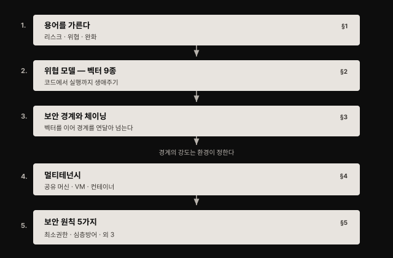
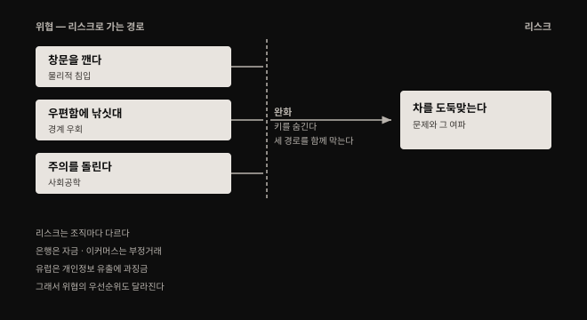
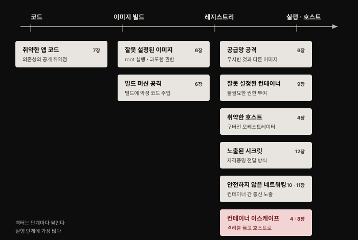
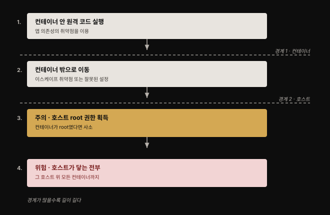
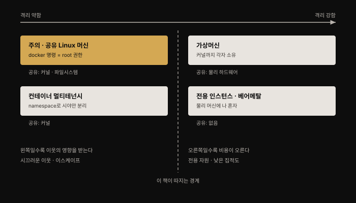

# 컨테이너 보안 위협 — 위협 모델부터 보안 원칙까지

## 핵심 요약

> 컨테이너 보안은 새로운 위협의 목록이 아니라, **컨테이너가 만들어 낸 새로운 경계들을 어디에 세우고 어떻게 지킬 것인가**의 문제입니다. 공격자가 노리는 것(데이터·연산 자원)은 컨테이너 이전과 같지만, 컨테이너는 앱이 실행되는 방식을 바꿔 놓았고 그래서 위험의 지형이 달라졌습니다.
>
> 이 장은 그 지형을 그리는 장입니다. 리스크·위협·완화라는 세 용어를 먼저 갈라 놓고, 컨테이너 생애주기의 각 단계에서 성립하는 공격 벡터 9종을 열거한 뒤, 그 벡터들이 어떻게 이어져 보안 경계를 연달아 무너뜨리는지를 봅니다. 경계의 강도는 결국 누구와 무엇을 공유하느냐(멀티테넌시)가 정하며, 마지막에 이 모든 판단에 쓸 잣대로 보안 원칙 다섯 가지를 제시합니다.

## 학습 목표

이 내용을 읽고 나면:

1. 리스크·위협·완화를 구분해 설명하고, 왜 조직마다 완화 대책이 달라지는지 근거를 들 수 있습니다.
2. 컨테이너 생애주기의 공격 벡터 9종을 열거하고 각각이 어느 단계에서 성립하는지 짚을 수 있습니다.
3. 보안 경계가 무엇인지 정의하고, 벡터가 이어지며 경계를 넘는 체이닝 시나리오를 재구성할 수 있습니다.
4. 공유 머신·컨테이너·가상머신·베어메탈의 격리 강도를 비교하고 워크로드에 맞는 수준을 고를 수 있습니다.
5. 보안 원칙 다섯 가지를 컨테이너 환경의 구체적 실천으로 옮길 수 있습니다.

## 1. 리스크·위협·완화 — 용어부터 가른다

> 세 단어는 일상에서 섞여 쓰이지만 보안에서는 층이 다릅니다. 층을 섞으면 "무엇을 막을지" 대신 "무엇이 무서운지"만 말하게 됩니다.

저자는 세 용어를 이렇게 정의합니다.

- **리스크**: 잠재적 문제와 그것이 실제로 일어났을 때의 여파
- **위협**: 그 리스크가 현실이 되는 경로
- **완화**: 위협을 막거나 성공 확률을 낮추는 대응책

자동차 키 비유가 이 층위를 잘 보여 줍니다. 누군가 집에서 차 키를 훔쳐 차를 몰고 가는 것이 리스크입니다. 위협은 그 키를 훔치는 여러 방법입니다. 창문을 깨고 손을 넣어 집는 것, 우편함으로 낚싯대를 넣는 것, 초인종을 눌러 주의를 끄는 사이 공범이 슬쩍 들어오는 것. 완화는 키를 눈에 안 띄는 곳에 두는 것인데, 이 하나가 세 위협을 한꺼번에 막습니다.

여기서 실무적으로 중요한 사실이 나옵니다. **리스크는 조직마다 크게 다르고, 그래서 위협의 중요도와 완화의 선택도 함께 달라집니다.** 고객 돈을 맡은 은행이라면 그 돈을 도둑맞는 것이 거의 확실하게 가장 큰 리스크입니다. 이커머스 조직은 부정 거래를 걱정합니다. 개인 블로그를 운영하는 사람은 누군가 자기를 사칭해 부적절한 글을 올리는 것이 두렵습니다.

지역도 변수입니다. 개인정보 보호 규제가 나라마다 다르기 때문에 고객 정보 유출의 리스크가 지리적으로 달라집니다. 여러 나라에서 이 리스크는 "그저" 평판 문제에 그치지만, 유럽에서는 GDPR이 회사 총 매출의 최대 4%까지 과징금을 물릴 수 있습니다.

그래서 남의 보안 체크리스트를 그대로 가져다 쓰는 것이 위험합니다. 리스크가 다르면 우선순위가 다릅니다. 우선순위가 다르면 같은 완화 대책도 과잉이거나 부족해집니다. **리스크 관리 프레임워크**는 이것을 체계적으로 다루는 절차입니다. 리스크를 정리하고 가능한 위협을 열거한 뒤, 중요도로 우선순위를 매기고 완화 접근법을 정합니다.

**위협 모델링(threat modeling)**은 그중 위협을 식별하고 열거하는 과정입니다. 시스템의 구성 요소와 가능한 공격 방식을 체계적으로 훑어, 어디가 가장 취약한지 찾아냅니다. 저자는 단일한 완전 위협 모델은 없다고 못 박습니다. 리스크·환경·조직·실행 중인 애플리케이션에 따라 달라지기 때문입니다. 다만 대부분의 컨테이너 배포에 공통되는 잠재 위협은 열거할 수 있고, 그게 다음 절입니다.

## 2. 컨테이너 위협 모델 — 생애주기별 공격 벡터 9종

> 위협 모델을 시작하는 한 가지 방법은 관련된 행위자를 따져 보는 것입니다. 그다음 컨테이너 생애주기의 각 단계에서 어떤 공격 벡터가 성립하는지 지도를 그립니다.

먼저 행위자입니다. 저자는 다섯 부류를 듭니다.

- **외부 공격자**: 배포 환경 바깥에서 접근을 시도하는 자
- **내부 공격자**: 배포 환경의 일부에 이미 접근한 자
- **악의적 내부자**: 개발자·관리자처럼 접근 권한을 정당하게 가진 자
- **부주의한 내부자**: 악의 없이 사고를 일으키는 자
- **애플리케이션 프로세스**: 시스템을 침해할 의도를 가진 존재는 아니지만, 시스템에 프로그램적으로 접근하는 주체

마지막 항목이 눈에 띕니다. 사람만 행위자로 보면 프로세스가 가진 권한을 놓치게 됩니다. 각 행위자마다 따져야 할 권한은 세 축입니다.

- **자격증명**: 무엇에 접근할 수 있는가. 예컨대 호스트 머신의 사용자 계정을 가졌는가
- **시스템 권한**: 시스템에서 어떤 행위가 허용되는가. Kubernetes라면 사용자별 RBAC 설정과 익명 사용자까지 포함합니다
- **네트워크 접근**: 어디까지 닿을 수 있는가. 어느 부분이 VPC 안에 들어 있는지가 여기 걸립니다

공격 경로를 지도로 그리는 한 가지 방법은 컨테이너 생애주기의 각 단계에서 성립하는 공격 벡터를 짚는 것입니다. 저자가 드는 아홉 가지는 다음과 같습니다. 각 항목 끝의 장 번호는 책이 그 주제를 본격적으로 다루는 곳입니다.

1. **취약한 애플리케이션 코드**: 생애주기는 개발자가 쓰는 코드에서 시작합니다. 이 코드와 그것이 의존하는 서드파티 패키지에는 취약점이라 불리는 결함이 있을 수 있고, 이미 공표된 취약점만 수천 건입니다. 이미지 스캐닝이 가장 좋은 대응인데, 한 번 하고 끝낼 일이 아닙니다. 기존 코드에서 새 취약점이 계속 발견되기 때문입니다. 스캐너는 보안 패치가 필요한 낡은 패키지로 컨테이너가 돌고 있는 상황도 잡아내야 하고, 일부는 이미지에 심긴 악성코드도 식별합니다. (7장)
2. **잘못 설정된 컨테이너 이미지**: 코드가 이미지로 빌드되는 단계에서 약점을 넣을 여지가 많습니다. 대표적으로 컨테이너를 root 사용자로 실행하도록 설정해 호스트에서 필요 이상의 권한을 주는 경우입니다. (6장)
3. **빌드 머신 공격**: 공격자가 이미지 빌드 과정을 조작할 수 있으면 악성 코드를 심어 프로덕션에서 실행시킬 수 있습니다. 빌드 환경에 발판을 마련하는 것 자체가 프로덕션 침해로 가는 디딤돌이 되기도 합니다. (6장)
4. **공급망 공격**: 빌드된 이미지는 레지스트리에 저장됐다가 실행 시점에 다시 당겨집니다. 내가 당긴 이미지가 내가 밀어 넣은 것과 정확히 같다는 보장이 있는가? 빌드와 배포 사이에서 이미지를 바꿔치기하거나 변조할 수 있는 자는 내 배포 환경에서 임의 코드를 실행할 수 있습니다. (6장)
5. **잘못 설정된 컨테이너**: 불필요하고 때로는 계획에 없던 권한을 주는 설정으로 컨테이너를 띄울 수 있습니다. 저자는 인터넷에서 받은 YAML 설정 파일을 안전하지 않은 설정이 없는지 꼼꼼히 확인하지 않고 실행하지 말라고 당부합니다. (9장)
6. **취약한 호스트**: 컨테이너는 호스트 머신 위에서 돕니다. 호스트가 취약한 코드를 돌리고 있지 않아야 하는데, 알려진 취약점을 가진 구버전 오케스트레이션 컴포넌트가 그 예입니다. 호스트마다 설치 소프트웨어를 최소화해 공격 표면을 줄이고, 보안 모범사례에 맞게 설정하는 것이 좋습니다. (4장)
7. **노출된 시크릿**: 애플리케이션 코드는 다른 컴포넌트와 통신하려고 자격증명·토큰·비밀번호를 필요로 합니다. 컨테이너 배포에서는 이 비밀 값을 컨테이너화된 코드로 전달할 수 있어야 하는데, 방식마다 보안 수준이 다릅니다. (12장)
8. **안전하지 않은 네트워킹**: 컨테이너는 대체로 다른 컨테이너나 바깥세상과 통신해야 합니다. (10장이 컨테이너 네트워킹, 11장이 컴포넌트 간 보안 연결)
9. **컨테이너 이스케이프 취약점**: containerd와 CRI-O를 포함해 널리 쓰이는 런타임은 이제 상당히 단련됐지만, 컨테이너 안의 악성 코드가 호스트로 빠져나가게 하는 버그가 아직 발견되지 않았을 가능성은 남아 있습니다. Runcescape라 불리는 이슈가 2019년에 드러났습니다. 일부 애플리케이션에서는 이스케이프의 여파가 충분히 심각해 더 강한 격리 수단을 고려할 만합니다. (격리는 4장, 강화는 8장)

책이 다루는 범위 **밖**의 벡터도 저자는 분명히 짚어 둡니다. 소스 코드는 대개 저장소에 보관되는데 이 저장소가 공격받아 애플리케이션이 오염될 수 있으므로 저장소 접근 통제가 필요합니다. 호스트끼리는 네트워크로 묶이고 보통 인터넷에 연결되므로, 전통적 배포와 똑같이 안전한 네트워크 설정·방화벽·IAM이 클라우드 네이티브에서도 그대로 적용됩니다. 컨테이너는 대개 오케스트레이터 아래에서 도는데(오늘날 주로 Kubernetes, 그 밖에 Docker Swarm이나 Hashicorp Nomad), 오케스트레이터가 안전하지 않게 설정되거나 관리자 접근이 제대로 통제되지 않으면 공격자에게 추가 벡터를 내주게 됩니다.

## 3. 보안 경계와 공격 체이닝

> 보안 경계는 시스템의 부분들 사이에 서서, 그 사이를 넘어가려면 다른 권한 집합이 필요하게 만드는 선입니다. 공격은 대개 이 선을 하나씩 넘어가며 진행됩니다.

**보안 경계(security boundary)**는 신뢰 경계(trust boundary)라고도 하며, 시스템의 어느 부분과 다른 부분 사이에 존재해 그 사이를 이동하려면 다른 권한 집합이 필요하게 만듭니다. 경계는 관리자가 세우기도 합니다. Linux에서 시스템 관리자는 사용자가 속한 그룹을 바꿔 그 사용자가 어떤 파일에 접근할 수 있는지를 정하는 경계를 조정할 수 있습니다.

**컨테이너는 그 자체로 하나의 보안 경계입니다.** 애플리케이션 코드는 그 컨테이너 안에서 돌아야 하고, 명시적으로 권한을 받은 경우(예: 컨테이너에 마운트된 볼륨)를 빼면 컨테이너 밖의 코드나 데이터에 접근할 수 없어야 합니다.

여기서 이 장의 핵심 통찰이 나옵니다. **공격자와 그 목표물 사이에 보안 경계가 많을수록, 목표에 닿기가 어려워집니다.** 그래서 앞 절의 공격 벡터들은 따로따로가 아니라 **이어 붙여져** 여러 경계를 차례로 뚫는 데 쓰입니다.

저자가 드는 시나리오는 이렇게 흘러갑니다.

1. 공격자가 애플리케이션 의존성의 취약점 덕에 컨테이너 안에서 원격으로 코드를 실행하게 됩니다.
2. 뚫린 그 컨테이너에 값진 데이터가 직접 붙어 있지 않다고 해 봅시다. 공격자는 컨테이너 밖으로, 다른 컨테이너나 호스트로 이동할 길을 찾아야 합니다. 컨테이너 이스케이프 취약점이 한 가지 출구이고, 그 컨테이너의 안전하지 않은 설정이 또 다른 출구입니다. 둘 중 하나라도 열려 있으면 호스트에 접근할 수 있습니다.
3. 다음은 호스트에서 root 권한을 얻는 단계입니다. **애플리케이션 코드가 컨테이너 안에서 root로 돌고 있었다면 이 단계는 사소해질 수 있습니다.**
4. 호스트 머신의 root 권한을 쥐면, 그 호스트나 그 호스트에서 도는 어떤 컨테이너든 닿을 수 있는 모든 것에 접근할 수 있습니다.

3번이 9장 전체와 이어지는 실무적 급소입니다. 컨테이너를 root로 돌리는 흔한 습관 하나가 공격 체인의 한 칸을 통째로 없애 줍니다. 배포에 경계를 더하고 각 경계를 튼튼하게 만드는 일이 곧 공격자의 삶을 고달프게 만드는 일입니다.

위협 모델에서 중요한 또 한 축은 **애플리케이션이 도는 환경 안에서 오는 공격**의 가능성입니다. 클라우드 배포에서는 다른 사용자·다른 애플리케이션과 자원을 공유하고 있을 수 있습니다. 머신 자원을 공유하는 것을 멀티테넌시라 부르며, 이것이 위협 모델을 크게 좌우합니다.

## 4. 멀티테넌시 — 공유 머신부터 컨테이너 인스턴스까지

> 멀티테넌시 환경에서는 서로 다른 사용자(테넌트)가 공유 하드웨어 위에서 워크로드를 돌립니다. 워크로드의 주인이 누구이고 서로 얼마나 신뢰하느냐에 따라 필요한 경계의 강도가 달라집니다.

용어부터 좁혀 둡니다. 소프트웨어 애플리케이션 맥락에서도 멀티테넌시라는 말을 만나는데, 그 경우는 여러 사용자가 같은 소프트웨어 인스턴스를 공유한다는 뜻입니다. 이 장의 논의에서는 **하드웨어만 공유되는 경우**를 가리킵니다.

멀티테넌시는 1960년대 메인프레임 시절부터 있던 개념입니다. 당시 고객은 공유 머신의 CPU 시간·메모리·스토리지를 빌려 썼습니다. 오늘날 AWS·Azure·GCP 같은 퍼블릭 클라우드도 크게 다르지 않습니다. 고객은 CPU 시간·메모리·스토리지에 더해 여러 기능과 관리형 서비스를 빌립니다. 2006년 Amazon AWS가 EC2를 출시한 이래로는 데이터센터 랙 위에서 도는 가상머신 인스턴스를 빌릴 수 있게 됐습니다. 한 물리 머신 위에 여러 VM이 돌 수 있으며 **VM을 운영하는 클라우드 고객은 이웃 VM을 누가 운영하는지 알 수 없습니다.**

### 공유 머신

한 Linux 머신(또는 가상머신)을 여러 사용자가 나눠 쓰는 상황이 있습니다. 대학이 대표적입니다. 사용자끼리 서로 믿지 않으며 시스템 관리자도 사용자를 믿지 않는다는 점에서 진짜 멀티테넌시의 좋은 예입니다. 이 환경에서는 Linux 접근 제어로 사용자 접근을 엄격히 제한합니다. 각자 로그인 ID를 갖고 예컨대 자기 디렉토리의 파일만 수정할 수 있게 통제합니다. 저자의 표현을 빌리면, 대학생들이 서로의 파일을 읽거나 더 나쁘게는 고칠 수 있다면 벌어질 혼란을 상상해 보라는 것입니다.

여기서 컨테이너 특유의 위험이 하나 나옵니다. **같은 호스트에서 도는 모든 컨테이너는 같은 커널을 공유합니다.** 그리고 그 머신이 Docker 데몬을 돌리고 있다면, `docker` 명령을 실행할 수 있는 사용자는 사실상 root 권한을 가진 것과 같습니다. 그래서 시스템 관리자는 신뢰하지 않는 사용자에게 그 권한을 주지 않으려 합니다.

기업 환경, 특히 클라우드 네이티브 환경에서는 이런 공유 머신을 보기 어렵습니다. 대신 사용자(또는 서로 신뢰하는 팀)가 각자에게 할당된 가상머신 형태의 자원을 씁니다.

### 가상화

일반적으로 가상머신은 서로 상당히 강하게 격리된 것으로 봅니다. 이웃이 내 VM 안의 활동을 관찰하거나 방해할 가능성이 낮다는 뜻입니다.

여기서 저자는 정의상의 구분을 하나 짚습니다. **통용되는 정의에 따르면 가상화는 멀티테넌시에 해당하지 않습니다.** 멀티테넌시는 서로 다른 사람 집단이 같은 소프트웨어의 단일 인스턴스를 공유하는 것인데, 가상화에서 사용자는 자기 VM을 관리하는 하이퍼바이저에 접근할 수 없으므로 소프트웨어를 공유하지 않기 때문입니다.

그렇다고 VM 사이의 격리가 완벽하다는 말은 아닙니다. 역사적으로 사용자들은 "시끄러운 이웃(noisy neighbor)" 문제를 호소해 왔습니다. 물리 머신을 다른 사용자와 공유한다는 사실이 예상치 못한 성능 편차로 이어지는 현상입니다.

퍼블릭 클라우드를 일찍 받아들인 Netflix는 2010년 블로그 글의 "Co-tenancy is hard" 절에서 이 문제를 인정했습니다. 하위 작업이 너무 느리게 도는 것으로 판명되면 의도적으로 그 작업을 포기할 수도 있는 시스템을 만들었다는 것입니다. 다만 더 최근에는 시끄러운 이웃 문제가 실질적 이슈가 아니라는 주장도 나옵니다. 성능 편차와 별개로, 가상머신 사이의 경계를 침해할 수 있는 소프트웨어 취약점 사례도 있었습니다.

일부 애플리케이션과 조직, 특히 정부·금융·의료에서는 보안 침해의 여파가 충분히 심각해 완전한 물리적 분리를 정당화합니다. 자체 데이터센터에서 돌리거나 서비스 제공자가 대신 관리하는 프라이빗 클라우드를 운영해 워크로드를 완전히 격리할 수 있습니다. 프라이빗 클라우드는 데이터센터 접근 인력에 대한 추가 신원 조회 같은 보안 기능이 따라오기도 합니다.

많은 클라우드 제공자는 물리 머신에 자기 고객만 있도록 보장하는 VM 옵션을 제공하고, 클라우드 제공자가 운영하는 베어메탈 머신을 빌리는 것도 가능합니다. 두 경우 모두 시끄러운 이웃 문제를 완전히 피하면서 물리 머신 사이의 더 강한 보안 격리라는 이점을 얻습니다.

### 컨테이너 멀티테넌시

**컨테이너 사이의 격리는 VM 사이의 격리만큼 강하지 않습니다.** 리스크 프로파일에 따라 다르긴 하지만, 신뢰하지 않는 상대와 같은 머신에서 컨테이너를 쓰고 싶지는 않을 것입니다.

내 머신에서 도는 모든 컨테이너를 나 자신이나 전적으로 신뢰하는 사람이 돌린다 해도, 사람은 실수하기 마련이므로 컨테이너끼리 서로 간섭하지 못하게 막아 두고 싶을 수 있습니다. Kubernetes에서는 namespace로 머신 클러스터를 개인·팀·애플리케이션별로 나눠 쓸 수 있습니다.

> **용어 주의 — namespace는 중의적입니다.** Kubernetes의 namespace는 서로 다른 접근 제어를 걸 수 있도록 클러스터 자원을 나누는 고수준 추상화입니다. Linux의 namespace는 프로세스가 인식하는 머신 자원을 격리하는 저수준 메커니즘입니다. 두 개념은 이름만 같습니다. Linux namespace는 4장에서 다룹니다.

RBAC으로 이 Kubernetes namespace들에 접근할 수 있는 사람과 컴포넌트를 제한합니다. 다만 저자가 강조하는 한계가 있습니다. **Kubernetes RBAC은 Kubernetes API를 통해 수행하는 행위만 통제합니다.** 같은 호스트에서 도는 Kubernetes 파드 안의 애플리케이션 컨테이너들은, 설령 서로 다른 namespace에 있더라도, 오직 이 책이 설명하는 컨테이너 격리에 의해서만 서로로부터 보호됩니다. 공격자가 컨테이너에서 호스트로 탈출할 수 있다면 다른 컨테이너에 영향을 줄 능력에 있어 Kubernetes namespace 경계는 아무런 차이도 만들지 못합니다.

이 문장은 실무에서 자주 오해되는 지점이라 붙잡아 둘 만합니다. namespace를 나눴으니 격리됐다고 믿는 것과, namespace는 API 접근 통제일 뿐이고 진짜 격리는 커널 수준에서 이뤄진다고 아는 것은 배포 설계를 다르게 만듭니다.

### 컨테이너 인스턴스

클라우드 서비스는 여러 관리형 서비스를 제공해, 사용자가 직접 설치·관리하지 않고도 소프트웨어·스토리지·기타 구성 요소를 빌려 쓰게 합니다. 전형적인 예가 Amazon RDS인데, PostgreSQL 같은 잘 알려진 소프트웨어를 쓰는 데이터베이스를 쉽게 프로비저닝하고 백업은 체크박스 하나로 끝냅니다.

관리형 서비스는 컨테이너 세계로도 확장됐습니다. Azure Container Instances와 AWS Fargate는 컨테이너가 도는 기반 머신을 신경 쓰지 않고 컨테이너를 돌리게 해 줍니다. 관리 부담을 크게 덜고 배포를 마음대로 확장할 수 있습니다. 다만 **적어도 이론상으로는 내 컨테이너 인스턴스가 다른 고객의 것과 같은 가상머신에 함께 놓일 수 있습니다.** 의심스러우면 클라우드 제공자에게 확인하라는 것이 저자의 조언입니다.

## 5. 보안 원칙 5가지와 컨테이너 적용

> 무엇을 지키려 하든 현명한 접근으로 통용되는 일반 지침들입니다. 이 원칙들이 앞으로 어떤 보안 도구와 프로세스를 도입할지 판단하는 잣대가 됩니다.

다섯 원칙은 서로 독립적이지 않고 겹쳐 작동합니다. 각 원칙이 무엇이고, 컨테이너의 세밀한 단위가 그 적용을 어떻게 돕는지 함께 봅니다.

| 원칙 | 무엇을 요구하는가 | 컨테이너에서 어떻게 적용되는가 |
|------|------------------|------------------------------|
| 최소 권한 (Least Privilege) | 사람이나 컴포넌트가 제 일을 하는 데 필요한 최소한으로 접근을 제한한다 | 컨테이너마다 다른 권한 집합을 줄 수 있고, 각각을 제 기능에 필요한 최소 권한으로 좁힌다 |
| 심층 방어 (Defense in Depth) | 보호를 여러 겹으로 쌓아, 한 겹이 뚫려도 다음 겹이 피해나 유출을 막게 한다 | 컨테이너가 보안 보호를 강제할 수 있는 또 하나의 경계를 제공한다 |
| 공격 표면 축소 | 시스템이 복잡할수록 공격 가능성이 커지므로 복잡성을 없앤다 | 모놀리스를 단순한 마이크로서비스로 쪼개면 깨끗한 인터페이스가 생겨 복잡성과 공격 표면이 줄 수 있다 |
| 폭발 반경 제한 | 보안 통제를 더 작은 하위 구성 요소(셀)로 나눠, 최악의 경우에도 여파를 가둔다 | 아키텍처를 여러 마이크로서비스 인스턴스로 나누면 컨테이너 자체가 보안 경계로 작동한다 |
| 직무 분리 (Segregation of Duties) | 서로 다른 컴포넌트나 사람에게 전체 시스템 중 필요한 최소 부분에 대해서만 권한을 준다 | 권한과 자격증명을 필요한 컨테이너에만 전달해, 한 시크릿 묶음이 뚫려도 전부를 잃지 않는다 |

몇 가지는 조금 더 풀어 둘 만합니다.

**최소 권한**의 예로 저자는 이커머스의 상품 검색 마이크로서비스를 듭니다. 이 서비스는 상품 데이터베이스에 읽기 전용으로 접근하는 자격증명만 가져야 합니다. 사용자 정보나 결제 정보에 접근할 이유가 없고, 상품 정보를 쓸 이유도 없습니다.

**공격 표면 축소**에는 저자가 직접 반론을 붙여 둡니다. 이 원칙이 요구하는 것은 셋입니다. 인터페이스를 작고 단순하게 유지해 접근점을 줄이는 것, 서비스에 접근할 수 있는 사용자와 컴포넌트를 제한하는 것, 코드의 양을 최소화하는 것. 그런데 **컨테이너를 조율하려고 복잡한 오케스트레이션 계층을 더하는 것이 또 다른 공격 표면을 만든다는 반론**이 있습니다. 마이크로서비스로 쪼개 표면을 줄인 만큼 오케스트레이터라는 표면이 새로 생긴다는 지적이라, 컨테이너 도입이 자동으로 보안을 개선한다는 결론을 경계하게 만듭니다.

**직무 분리**는 최소 권한과 폭발 반경 제한 양쪽에 걸쳐 있습니다. 특정 작업에 한 명 이상의 권한을 요구하게 만들어, 권한을 가진 사용자 하나가 입힐 수 있는 피해를 제한합니다.

저자는 이 절을 냉정한 문장으로 닫습니다. 이런 이점들이 좋아 보이지만 **다소 이론적**이며, 실무에서는 잘못된 시스템 설정, 나쁜 컨테이너 이미지 위생, 안전하지 않은 관행에 의해 쉽게 상쇄될 수 있다는 것입니다. 컨테이너가 원칙의 적용을 *쉽게 해 줄 뿐*, 원칙을 *대신 지켜 주지는 않는다*는 뜻으로 읽힙니다.

## 심화 학습

> 여기부터는 책 밖의 보강입니다. 원문이 이름만 언급하고 넘어간 자료들의 현재 위치와 식별자를 확인해 붙였습니다.

**Runcescape의 공식 식별자는 CVE-2019-5736입니다.** 책은 "2019년에 드러난, 때때로 Runcescape라 불리는 이슈"라고만 적고 넘어갔습니다. 공개일은 2019년 2월 11일이고, 영향 범위는 NVD 표현으로 "runc 1.0-rc6 이하, 그리고 그것을 쓰는 Docker 18.09.2 미만 및 기타 제품"입니다. runc를 품고 있던 런타임들이 함께 영향을 받았습니다.

공격 방식은 `/proc/self/exe` 관련 파일 디스크립터 처리 문제를 파고들어 **호스트의 runc 바이너리를 덮어쓰는** 것입니다. 결과적으로 호스트 root 권한을 얻습니다.[^cve]

이 CVE는 3절의 체이닝 시나리오를 실제 사건으로 확인해 줍니다. 성립 조건은 **컨테이너 안에서 root로 명령을 실행할 수 있어야 한다**는 것입니다. 경로는 두 가지로, 공격자가 통제하는 이미지로 새 컨테이너를 띄우거나 이전에 쓰기 권한을 얻어 둔 기존 컨테이너에 `docker exec`로 붙는 것입니다. 어느 쪽이든 **컨테이너를 root로 돌리지 않았다면 이 공격은 성립하지 않았습니다.** 3절 3단계에서 "컨테이너가 root로 돌고 있었다면 이 단계는 사소해진다"고 한 서술이 그대로 재현된 셈입니다.

Red Hat Enterprise Linux 7에서는 SELinux가 enforcing 모드일 때 이 취약점이 완화됐습니다. 이는 심층 방어 원칙의 실례이기도 합니다. 격리 한 겹(컨테이너)이 뚫려도 다른 겹(SELinux)이 막아 준 경우입니다.

**CNCF 위협 모델 자료**는 책이 NOTE로 언급한 두 가지입니다. 하나는 CNCF가 의뢰한 Kubernetes 위협 모델이고, 다른 하나는 CNCF Financial User Group이 STRIDE 방법론으로 만든 Kubernetes Attack Tree입니다. 현재 이 자료들은 CNCF TAG Security 저장소의 커뮤니티 평가 문서로 관리됩니다.[^cncf] 책이 2020년 출간이므로 링크 위치가 그동안 옮겨졌다는 점을 감안해 읽어야 합니다.

> **원문 정오 아님 — 판 구분 주의**: 이 노트는 **1판(2020)** 기준입니다. 2025년 10월에 2판이 나왔고 부제가 "Fundamental Technology Concepts that Protect Cloud Native Applications"로 바뀌었습니다. 2판은 최신 위협 지형과 도구를 반영하므로, 특정 도구·버전 서술을 실무에 옮길 때는 판을 확인하시기 바랍니다.

## 결정 치트시트

> 이 장이 제공하는 판단 기준을 정리했습니다. 격리 수준 선택은 4절의 스펙트럼을, 우선순위 판단은 1절의 리스크 논의를 근거로 합니다.

| 상황 | 선택 | 이유 |
|------|------|------|
| 서로 신뢰하지 않는 당사자의 워크로드를 같이 돌려야 한다 | 컨테이너 격리에 기대지 않고 VM 이상으로 분리 | 컨테이너 격리는 VM만큼 강하지 않고 커널을 공유합니다 |
| 같은 팀의 워크로드지만 사고를 막고 싶다 | 컨테이너 격리 + namespace + RBAC | 사람의 실수를 막는 용도로는 충분하며, 악의적 공격 방어와는 목적이 다릅니다 |
| 이스케이프의 여파가 치명적이다 (금융·의료·정부) | 8장의 강화된 격리 또는 전용 인스턴스·베어메탈 | 이스케이프 취약점의 가능성이 남아 있고 여파가 크면 물리적 분리가 정당화됩니다 |
| 시끄러운 이웃으로 성능 편차가 문제다 | 전용 VM 옵션 또는 베어메탈 임대 | 물리 머신을 독점하면 이웃 영향과 격리 문제를 동시에 해결합니다 |
| 관리형 컨테이너 서비스를 쓰려 한다 | 다른 고객과의 VM 공유 여부를 제공자에게 확인 | 이론상 다른 고객 인스턴스와 같은 VM에 놓일 수 있습니다 |
| 어떤 완화부터 손댈지 모르겠다 | 조직의 리스크를 먼저 정의하고 위협 우선순위를 매긴다 | 리스크가 다르면 완화의 우선순위도 달라지므로 남의 체크리스트는 그대로 맞지 않습니다 |
| 공격 체인을 한 칸 줄이고 싶다 | 컨테이너를 non-root로 돌린다 | 호스트 root 획득 단계를 사소하게 만드는 조건을 제거합니다 |

## 면접에서 받을 만한 질문

1. 리스크·위협·완화를 구분해 설명하고, 같은 완화 대책이 조직마다 다르게 평가되는 이유를 말해 보세요.
2. 컨테이너가 보안 경계라는 말은 무슨 뜻인가요? 경계가 많을수록 좋다는 주장의 근거는 무엇인가요?
3. 컨테이너를 root로 실행하는 것이 왜 위험한지, 공격 체이닝 관점에서 설명해 보세요.
4. Kubernetes namespace로 팀을 나눴다면 컨테이너 간 격리가 보장되나요?
5. 컨테이너 도입이 공격 표면을 줄인다는 주장에 대한 반론은 무엇인가요?

## 정답 (자답 후 펼치기)

1. 리스크는 잠재적 문제와 그 여파이고, 위협은 리스크에 이르는 경로이며, 완화는 그 경로를 막는 대응책입니다. 리스크가 조직마다 다르기 때문에 위협의 중요도가 달라지고 완화의 우선순위도 함께 달라집니다. 은행은 자금 탈취를, 이커머스는 부정 거래를 가장 큰 리스크로 봅니다. 개인정보 유출은 여러 나라에서 평판 문제지만 유럽에서는 GDPR상 총 매출의 최대 4% 과징금이 걸린 문제라, 같은 유출 방지 대책이라도 지역에 따라 투자 정당성이 달라집니다.
2. 보안 경계는 그 사이를 넘어가려면 다른 권한 집합이 필요한 선입니다. 컨테이너는 그 자체로 경계여서, 안의 애플리케이션 코드는 명시적으로 권한을 받은 경우를 빼면 밖의 코드나 데이터에 접근할 수 없어야 합니다. 경계가 많을수록 공격자가 목표에 닿기까지 넘어야 할 단계가 늘어나므로, 각 단계에서 탐지되거나 막힐 기회가 생깁니다.
3. 공격 체인은 컨테이너 내 코드 실행 → 컨테이너 밖으로 이동 → 호스트 root 권한 획득 → 호스트가 닿는 전부로 이어집니다. 컨테이너가 root로 돌고 있으면 세 번째 단계가 사소해져 체인이 한 칸 짧아집니다. 실제로 CVE-2019-5736(Runcescape)은 컨테이너 안에서 root로 명령을 실행할 수 있어야 성립했고, 호스트의 runc 바이너리를 덮어써 호스트 root를 얻는 방식이었습니다.
4. 보장되지 않습니다. Kubernetes RBAC은 Kubernetes API를 통한 행위만 통제합니다. 같은 호스트에서 도는 파드의 애플리케이션 컨테이너들은 서로 다른 namespace에 있더라도 커널 수준의 컨테이너 격리에 의해서만 보호됩니다. 공격자가 컨테이너에서 호스트로 탈출하면 Kubernetes namespace 경계는 다른 컨테이너에 영향을 주는 능력에 아무 차이도 만들지 못합니다. Kubernetes namespace와 Linux namespace가 이름만 같은 다른 개념이라는 점도 함께 기억해야 합니다.
5. 모놀리스를 마이크로서비스로 쪼개면 인터페이스가 깨끗해져 복잡성과 공격 표면이 줄 수 있습니다. 그러나 컨테이너를 조율하기 위해 복잡한 오케스트레이션 계층을 더하는 것이 새로운 공격 표면을 만든다는 반론이 있습니다. 저자 스스로 이 이점들이 다소 이론적이며 잘못된 설정·나쁜 이미지 위생·안전하지 않은 관행으로 쉽게 상쇄될 수 있다고 덧붙입니다.

## 핵심 개념 체크리스트

- [ ] 리스크·위협·완화를 각각 한 문장으로 정의하고 예를 들 수 있는가?
- [ ] 공격 벡터 9종을 생애주기 단계에 배치해 설명할 수 있는가?
- [ ] 보안 경계의 정의와 "경계가 많을수록 좋다"의 근거를 말할 수 있는가?
- [ ] 공격 체이닝 4단계를 순서대로 재구성할 수 있는가?
- [ ] 공유 머신·컨테이너·VM·베어메탈의 격리 강도를 비교할 수 있는가?
- [ ] Kubernetes namespace와 Linux namespace의 차이를 설명할 수 있는가?
- [ ] Kubernetes RBAC이 통제하지 *못하는* 범위를 말할 수 있는가?
- [ ] 보안 원칙 5가지를 각각 컨테이너 실천으로 옮길 수 있는가?

## 참고 자료

- 원본: 《Container Security: Fundamental Technology Concepts that Protect Containerized Applications》(Liz Rice, O'Reilly, 2020, ISBN 978-1492056706) Chapter 1
- [CVE-2019-5736 — NVD](https://nvd.nist.gov/vuln/detail/CVE-2019-5736) · [Red Hat 취약점 페이지 (runcescape)](https://access.redhat.com/security/vulnerabilities/runcescape) — 책이 Runcescape로 언급한 이슈
- [CNCF TAG Security — Kubernetes 보안 평가 문서](https://github.com/cncf/tag-security/tree/main/community/assessments/projects/kubernetes) — 책이 NOTE로 언급한 위협 모델·Attack Tree의 현재 위치
- [컨테이너의 탄생 — 앱 실행의 진화와 격리 프리미티브](../networking-and-kubernetes/03-01.%EC%BB%A8%ED%85%8C%EC%9D%B4%EB%84%88%EC%9D%98%20%ED%83%84%EC%83%9D%20%E2%80%94%20%EC%95%B1%20%EC%8B%A4%ED%96%89%EC%9D%98%20%EC%A7%84%ED%99%94%EC%99%80%20%EA%B2%A9%EB%A6%AC%20%ED%94%84%EB%A6%AC%EB%AF%B8%ED%8B%B0%EB%B8%8C.md) — 4절이 말한 Linux namespace·cgroup의 기초 동작
- [Process Containment — 최소 권한으로 컨테이너를 가두기](../kubernetes-patterns/23-01.Process%20Containment%20%E2%80%94%20%EC%B5%9C%EC%86%8C%20%EA%B6%8C%ED%95%9C%EC%9C%BC%EB%A1%9C%20%EC%BB%A8%ED%85%8C%EC%9D%B4%EB%84%88%EB%A5%BC%20%EA%B0%80%EB%91%90%EA%B8%B0.md) — 5절 최소 권한 원칙의 Kubernetes 실천 패턴
- [Container Security 정독 인덱스](./README.md) — 이 책의 장별 목표와 진행 상태

[^cve]: NVD — CVE-2019-5736. runc 1.0-rc6 이하에서 `/proc/self/exe` 관련 파일 디스크립터 처리 문제로 호스트 runc 바이너리를 덮어쓸 수 있습니다.
<https://nvd.nist.gov/vuln/detail/CVE-2019-5736>

[^cncf]: CNCF TAG Security — Kubernetes 커뮤니티 보안 평가 문서 모음. 책이 언급한 위협 모델과 Attack Tree가 이 저장소에서 관리됩니다.
<https://github.com/cncf/tag-security/tree/main/community/assessments/projects/kubernetes>
