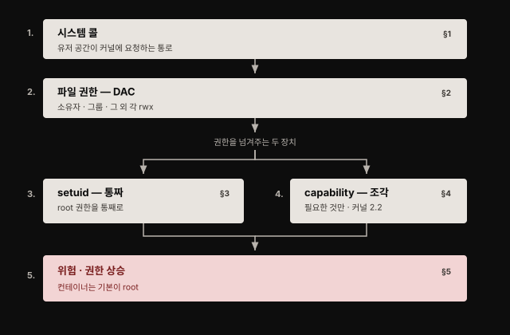
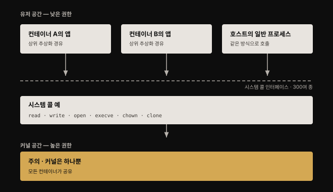
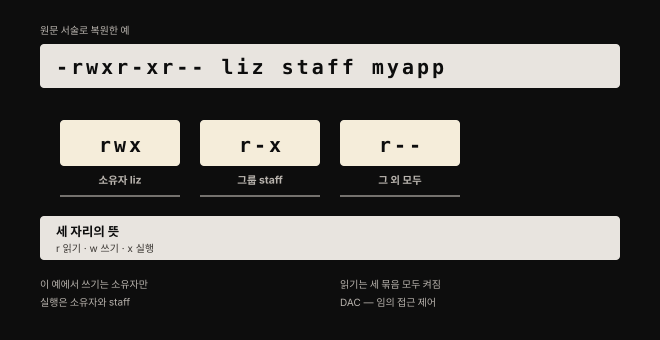
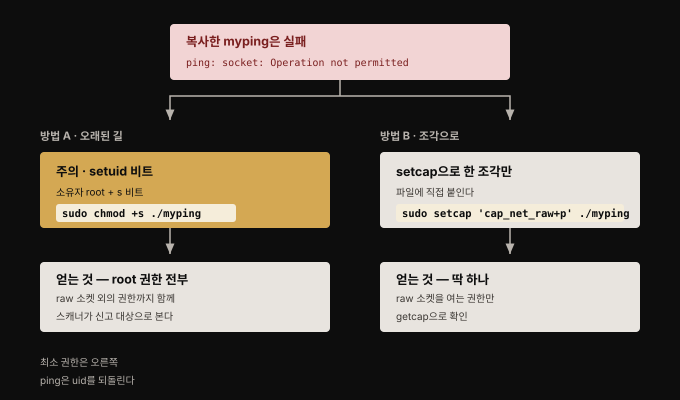
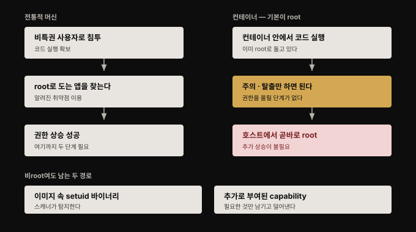

# Linux 시스템 콜·권한·capability — 컨테이너 보안의 바닥
---

## 핵심 요약

> 컨테이너 보안 통제는 전부 **평범한 Linux 메커니즘 위에 얹혀 있습니다.** 컨테이너 안의 프로세스도 호스트에서 보이는 그냥 Linux 프로세스라, 일반 프로세스와 똑같이 시스템 콜을 부르고 똑같이 권한을 필요로 합니다.
>
> 이 장은 그 바닥을 훑습니다. 유저 공간이 커널에 일을 시키는 통로인 시스템 콜, 누가 무엇을 할 수 있는지 정하는 파일 권한, 권한을 통째로 넘겨주는 오래된 장치인 setuid, 그것을 잘게 쪼갠 후계자인 capability, 그리고 이 장치들이 어긋났을 때 벌어지는 권한 상승입니다. 컨테이너가 달라지는 지점은 하나뿐입니다. **같은 권한을 런타임과 이미지 빌드 시점에 새로 통제할 수단이 생겼다는 것**이고, 그래서 보안에 큰 영향을 줍니다.


## 학습 목표

이 내용을 읽고 나면:

1. 유저 공간과 커널 공간을 가르는 선이 무엇이고 시스템 콜이 그 사이에서 무슨 역할을 하는지 설명할 수 있습니다.
2. `ls -l`의 권한 아홉 글자를 셋씩 끊어 읽고 각 자리가 누구의 무슨 권한인지 짚을 수 있습니다.
3. setuid 비트가 무엇을 바꾸는지, 왜 권한 상승의 통로가 되는지 예를 들어 설명할 수 있습니다.
4. capability가 setuid의 어떤 문제를 푸는지 비교하고 `setcap`으로 최소 권한을 주는 방식을 설명할 수 있습니다.
5. 컨테이너 환경에서 권한 상승이 왜 전통적 머신보다 짧은 경로가 되는지 근거를 들 수 있습니다.



이 장은 다음 장들의 준비 운동입니다. 저자는 이미 아는 내용이면 건너뛰어도 좋다고 적어 두었지만, 4장의 격리와 8장의 격리 강화, 9장의 격리 파괴가 전부 여기서 배우는 장치들 위에 세워집니다.


## 1. 시스템 콜 — 유저 공간이 커널에 일을 시키는 통로

> 앱은 커널보다 낮은 권한으로 돕니다. 파일을 읽는 일조차 스스로 못 하고 커널에 부탁해야 하며, 그 부탁의 창구가 시스템 콜입니다.



애플리케이션은 **유저 공간(user space)** 이라 불리는 곳에서 도는데, 여기는 운영체제 커널보다 권한 수준이 낮습니다. 앱이 파일에 접근하거나 네트워크로 통신하거나 심지어 지금 몇 시인지 알아내려 해도, 커널에게 대신 해 달라고 요청해야 합니다. 유저 공간 코드가 커널에 이런 요청을 넣는 프로그래밍 인터페이스가 **시스템 콜(syscall)** 인터페이스입니다.

시스템 콜은 300종이 넘고 개수는 Linux 커널 버전에 따라 다릅니다. 저자가 드는 예는 이렇습니다.

- `read`: 파일에서 데이터를 읽습니다
- `write`: 파일에 데이터를 씁니다
- `open`: 이후 읽거나 쓰기 위해 파일을 엽니다
- `execve`: 실행 프로그램을 돌립니다
- `chown`: 파일의 소유자를 바꿉니다
- `clone`: 새 프로세스를 만듭니다

앱 개발자가 시스템 콜을 직접 신경 쓸 일은 거의 없습니다. 대개 상위 프로그래밍 추상화에 감싸여 있기 때문입니다. 앱 개발자가 마주칠 가장 낮은 수준의 추상화가 glibc 라이브러리나 Go의 `syscall` 패키지 정도인데, 실무에서는 이것들조차 또 다른 상위 계층에 감싸여 쓰입니다.

**애플리케이션 코드는 컨테이너 안에서 돌든 아니든 정확히 같은 방식으로 시스템 콜을 씁니다.** 다만 보안 측면에서 중요한 사실이 하나 붙습니다. 한 호스트의 모든 컨테이너가 **같은 커널에 시스템 콜을 보낸다**는 점입니다. 1장에서 "컨테이너는 커널을 공유한다"고 한 서술이 여기서 구체적인 그림을 얻습니다. 공유의 실체는 곧 같은 시스템 콜 인터페이스를 향한다는 뜻입니다.

모든 앱이 모든 시스템 콜을 필요로 하지는 않습니다. 그래서 최소 권한 원칙을 따라, 프로그램마다 접근 가능한 시스템 콜 집합을 제한하는 Linux 보안 기능이 있습니다. 컨테이너에 이것을 적용하는 방법은 8장에서 다룹니다.


## 2. 파일 권한 — 보안의 주춧돌

> Linux에서는 모든 것이 파일이라는 말이 있습니다. 그래서 파일 권한이 곧 누가 무엇에 접근할 수 있는지를 정하는 규칙이 됩니다.



컨테이너를 돌리든 아니든, 어떤 Linux 시스템에서도 파일 권한은 보안의 주춧돌입니다. 애플리케이션 코드·데이터·설정 정보·로그가 전부 파일에 담기고, 화면이나 프린터 같은 물리 장치조차 파일로 표현됩니다. 파일 권한은 어떤 사용자가 그 파일에 접근할 수 있고 무슨 행위를 할 수 있는지 결정합니다. 이 권한들을 **임의 접근 제어(discretionary access control, DAC)** 라고 부르기도 합니다.

`ls -l`이 보여 주는 권한 속성은 아홉 글자이며 **셋씩 세 묶음**으로 읽습니다.

- 첫 묶음: 파일을 소유한 사용자의 권한
- 둘째 묶음: 파일이 속한 그룹 구성원의 권한
- 셋째 묶음: 그 외 모든 사용자의 권한

각 묶음의 세 자리는 차례로 읽기(`r`)·쓰기(`w`)·실행(`x`) 비트이며, 대시는 그 비트가 꺼져 있다는 표시입니다. 저자가 든 예는 `liz`가 소유하고 `staff` 그룹에 속한 `myapp`이라는 파일인데, 서술을 따라가면 이렇습니다. 쓰기는 소유자만 가능한데 `w` 비트가 첫 묶음에만 켜져 있기 때문입니다. 실행은 소유자와 `staff` 그룹 구성원이 할 수 있습니다. 읽기는 세 묶음 모두에 `r`이 켜져 있어 누구나 가능합니다.

> **원문 확인 범위**: 위 비트 문자열은 원문 Figure 2-1의 그림에 있어 텍스트로 추출되지 않습니다. 본 노트의 도식은 저자의 *서술*("쓰기는 소유자만, 실행은 소유자와 staff, 읽기는 전부")로부터 복원한 것이라, 그림의 표기와 세부가 다를 수 있습니다.

`r`·`w`·`x` 비트가 이야기의 끝은 아닙니다. 권한은 **setuid·setgid·sticky 비트**의 영향을 받습니다. 앞의 둘은 보안 관점에서 중요한데, **프로세스가 추가 권한을 얻게 해 주기 때문**이고 공격자가 이를 악의적으로 이용할 수 있습니다.


## 3. setuid — 권한을 통째로 넘겨주는 오래된 장치

> 보통 파일을 실행하면 그 프로세스는 여러분의 사용자 ID를 물려받습니다. setuid 비트가 켜져 있으면 대신 **파일 소유자의 사용자 ID**를 갖습니다.

저자는 `sleep` 실행 파일을 복사해 이것을 보입니다. 복사본 `mysleep`은 `vagrant` 사용자 소유입니다. `sudo ./mysleep 100`으로 root 아래에서 돌리고 다른 터미널에서 프로세스를 보면, `sudo`와 `mysleep` 모두 UID 0(root)으로 돕니다. 그런데 `chmod +s mysleep`으로 setuid 비트를 켜고 다시 `sudo ./mysleep 100`을 돌리면 달라집니다. `sudo`는 여전히 root지만 **`mysleep`은 파일 소유자의 사용자 ID를 가져갑니다.**

```bash
chmod +s mysleep
ls -l mysleep
```

```markdown
-rwsr-sr-x 1 vagrant vagrant 35000 Oct 17 08:49 mysleep
```

`x` 자리에 `s`가 들어선 것이 setuid 비트가 켜졌다는 표시입니다.

이 비트는 보통 **일반 사용자에게는 확장되지 않는 권한을 프로그램에 주려고** 씁니다. 저자가 드는 대표 예가 `ping`입니다. `ping`은 ping 메시지를 보내려고 raw 네트워크 소켓을 열 권한이 필요합니다. 관리자는 사용자들이 `ping`을 쓰는 것 자체는 괜찮다고 여깁니다. 그렇다고 사용자가 아무 목적으로나 raw 소켓을 열도록 허용하고 싶지는 않습니다. 그래서 `ping` 실행 파일은 흔히 setuid 비트가 켜진 채 root 소유로 설치됩니다.

### ping으로 직접 확인하기

일반 사용자로 `ping`을 복사해 보면 권한 구조가 드러납니다. 원본 `/bin/ping`은 `-rwsr-xr-x`로 `s` 비트를 갖고 root 소유입니다. 그런데 복사하면 파일 소유권이 복사한 사용자로 바뀌고 **setuid 비트는 딸려 오지 않습니다.**

```bash
cp /bin/ping ./myping
./myping 10.0.0.1
```

```markdown
ping: socket: Operation not permitted
```

소유자를 root로 바꿔도 여전히 실패합니다. `sudo`로 돌릴 때만 성공합니다. 여기에 setuid 비트까지 켜면 비로소 일반 사용자로도 동작합니다.

```bash
sudo chown root ./myping
sudo chmod +s ./myping
./myping 10.0.0.1
```

그런데 이때 `ps`로 프로세스를 보면 예상 밖의 결과가 나옵니다. **setuid 비트가 켜져 있고 파일이 root 소유인데도 프로세스는 root로 돌지 않습니다.** 요즘 버전의 `ping`은 root로 시작한 뒤 **자기에게 필요한 capability만 명시적으로 설정하고 사용자 ID를 원래 사용자로 되돌리기** 때문입니다. 저자가 "`ping`은 몇 가지 관문을 통과한다"고 표현한 것이 이 동작입니다.

모든 실행 파일이 이렇게 사용자 ID를 되돌리도록 작성되지는 않았습니다. 앞의 `mysleep`을 root 소유로 바꾸고 setuid 비트를 켠 뒤 일반 사용자로 돌리면, `ps`에서 그 프로세스가 **root의 사용자 ID로 도는** 더 전형적인 setuid 동작을 볼 수 있습니다. 소유권을 바꾸면 setuid 비트가 초기화되므로 순서에 주의해야 합니다.

### setuid의 보안 함의

`bash`에 setuid를 걸면 어떻게 될지 상상해 보라는 것이 저자의 문제 제기입니다. 그것을 실행하는 어떤 사용자든 root로 도는 셸에 들어앉게 됩니다. 실제로는 그렇게 단순하지 않은데, 대부분의 셸이 `ping`처럼 사용자 ID를 되돌려 이런 손쉬운 권한 상승에 쓰이지 않도록 하기 때문입니다. **그러나 자기 자신에게 setuid를 걸고 root로 전환한 다음 셸을 호출하는 프로그램을 직접 짜기는 아주 쉽습니다.**

setuid가 위험한 권한 상승 통로를 제공하기 때문에, 일부 컨테이너 이미지 스캐너는 setuid 비트가 켜진 파일의 존재를 보고합니다. 실행 시점에 막는 수단도 있습니다.

> **원문 정오 — Docker 플래그 문법**: 원문은 `docker run` 명령의 `--no-new-privileges` 플래그로 이를 막을 수 있다고 적었습니다. 현재 Docker 공식 문서 기준 문법은 **`--security-opt no-new-privileges`** 입니다.[^dockerflag] 동작은 원문 설명대로 컨테이너 프로세스가 새 권한을 얻지 못하게 막는 것이며, `su`나 `sudo` 같은 권한 상승 명령이 동작하지 않게 됩니다. 원문이 2020년 기준이라 표기가 다를 수 있으니 실제 적용 시 공식 문서를 확인하시기 바랍니다.

setuid 비트는 **권한이 훨씬 단순하던 시절**의 유물입니다. 그때는 프로세스가 root 권한을 갖거나 갖지 못하거나 둘 중 하나였고, setuid는 비root 사용자에게 추가 권한을 주는 장치였습니다. Linux 커널 2.2가 **capability**를 도입하면서 이 추가 권한을 더 잘게 통제할 수 있게 됐습니다.


## 4. Linux capability — 통짜 권한을 조각으로

> capability는 root의 권한을 잘게 나눈 단위입니다. 스레드에 할당되어 그 스레드가 특정 행위를 할 수 있는지를 결정합니다.



오늘날 Linux 커널에는 30가지가 넘는 capability가 있습니다. 저자가 드는 예는 이렇습니다.

- `CAP_NET_BIND_SERVICE`: 1024 미만의 낮은 번호 포트에 바인딩하려면 필요합니다
- `CAP_SYS_BOOT`: 아무 실행 파일이나 시스템을 재부팅하지 못하게 하려고 존재합니다
- `CAP_SYS_MODULE`: 커널 모듈을 적재하거나 내리는 데 필요합니다
- `CAP_NET_RAW`: raw 네트워크 소켓을 여는 권한으로, 앞서 `ping`이 스스로에게 부여하던 바로 그 capability입니다

프로세스에 할당된 capability는 `getpcaps`로 볼 수 있습니다. 비root 사용자가 돌린 프로세스는 대개 capability가 없어 결과가 비어 있고, `sudo bash`로 root 셸을 띄워 확인하면 `cap_chown`부터 `cap_audit_read`까지 긴 목록이 쏟아집니다. **root가 강한 이유가 이 목록 전부를 갖고 있기 때문**이라는 것이 눈으로 확인되는 대목입니다.

### 파일에 capability를 직접 붙이기

capability는 파일에도 직접 할당할 수 있습니다. 앞에서 복사한 `myping`은 setuid 비트 없이는 소켓을 열지 못했는데, **필요한 capability만 실행 파일에 붙이는** 다른 길이 있습니다.

```bash
sudo setcap 'cap_net_raw+p' ./myping
getcap ./myping
```

`getcap`의 출력은 `./myping = cap_net_raw+p` 입니다.

capability를 바꾸려면 root 권한이 필요합니다. 더 정확히는 `CAP_SETFCAP` capability만 있으면 되는데, 이것은 root에게 자동으로 주어집니다. 루트 없이 `setcap`을 시도하면 `unable to set CAP_SETFCAP effective capability: Operation not permitted`로 거부됩니다.

여기서 중요한 관찰이 하나 있습니다. **이 변경은 `ls`가 보여 주는 권한에는 아무 영향이 없습니다.** `-rwxr-xr-x` 그대로입니다. capability는 `getcap`으로만 확인됩니다. 파일 권한 아홉 글자만 보고 그 파일이 무엇을 할 수 있는지 판단하면 놓치는 것이 있다는 뜻입니다.

최소 권한 원칙을 따르면, **프로세스가 제 일을 하는 데 필요한 capability만 주는 것이 좋습니다.** 컨테이너를 돌릴 때도 허용할 capability를 통제하는 선택지가 주어지며, 그 방법은 8장에서 다룹니다.

setuid와 capability의 차이를 한 줄로 줄이면 이렇습니다. setuid는 "root가 되어라"이고 capability는 "이것 하나만 할 수 있어라"입니다. 같은 `ping`을 동작하게 만들면서도, 전자는 root의 모든 권한을 딸려 주고 후자는 raw 소켓 하나만 줍니다.


## 5. 권한 상승 — 컨테이너가 경로를 짧게 만든다

> 권한 상승이란 원래 가져야 할 권한을 넘어서서, 허용되지 않은 행위를 할 수 있게 되는 것입니다.



공격자는 시스템 취약점이나 잘못된 설정을 이용해 스스로에게 추가 권한을 부여합니다. 흔한 방식은 **이미 root로 도는 소프트웨어를 찾아 그 소프트웨어의 알려진 취약점을 이용하는 것**입니다. 저자는 웹 서버 소프트웨어의 원격 코드 실행 취약점을 예로 들며 Struts 취약점을 언급합니다. 웹 서버가 root로 돌고 있으면 공격자가 원격 실행하는 모든 것이 root 권한으로 돕니다. 그래서 **가능하면 소프트웨어를 비특권 사용자로 돌리는 것이 좋습니다.**

여기서 이 장의 결론이 나옵니다. **컨테이너는 기본적으로 root로 돕니다.** 전통적인 Linux 머신과 비교하면 컨테이너에서 도는 애플리케이션이 root로 돌 가능성이 훨씬 높다는 뜻입니다. 컨테이너 안의 프로세스를 장악한 공격자는 여전히 어떻게든 컨테이너를 탈출해야 하지만, **일단 탈출하고 나면 호스트에서 root이고 더 이상의 권한 상승이 필요 없습니다.**

1장 3절의 공격 체이닝에서 "컨테이너가 root로 돌고 있었다면 이 단계는 사소해진다"고 했던 서술의 근거가 여기입니다. 전통적 머신에서는 침투 후 권한 상승이라는 별도 단계를 거쳐야 하는데, 컨테이너에서는 그 단계가 이미 완료된 상태로 시작합니다.

컨테이너를 비root 사용자로 돌리더라도 이 장에서 본 Linux 권한 메커니즘을 통한 권한 상승의 여지는 남습니다. 저자가 짚는 두 가지는 이렇습니다.

- **setuid 바이너리를 포함한 컨테이너 이미지**: 이미지 안에 setuid 비트가 켜진 실행 파일이 들어 있는 경우
- **비root로 도는 컨테이너에 추가로 부여된 capability**: 필요 이상의 capability를 준 경우

두 경로 모두 완화 방법은 책 뒷부분에서 다룹니다.


## 심화 학습

> 여기부터는 책 밖의 보강입니다. 원문이 `man capabilities`를 참고하라고만 적은 부분을 공식 문서로 확인해 붙였습니다.

**capability 도입 시점과 정의는 커널 공식 문서로 확인됩니다.** man7의 `capabilities(7)`은 "Linux 2.2부터 Linux는 전통적으로 슈퍼유저와 결부된 특권을 capability라는 별개 단위로 나눈다"고 적어, 원문의 "커널 2.2가 capability를 도입했다"는 서술과 일치합니다.[^caps]

개별 capability의 정의도 원문과 어긋나지 않습니다. 공식 문서의 표현은 다음과 같습니다.

- `CAP_NET_RAW`: RAW·PACKET 소켓 사용, 투명 프록시를 위한 임의 주소 바인딩
- `CAP_NET_BIND_SERVICE`: 1024 미만 특권 포트에 소켓 바인딩
- `CAP_SYS_BOOT`: `reboot(2)`·`kexec_load(2)` 사용
- `CAP_SYS_MODULE`: 커널 모듈 적재·해제
- `CAP_SETFCAP`: 파일에 임의의 capability 설정

**capability 개수는 커널마다 다릅니다.** 원문은 "30가지가 넘는다"고 적었고 공식 문서는 총 개수를 명시하지 않는 대신 `/proc/sys/kernel/cap_last_cap`이 "현재 돌고 있는 커널이 지원하는 가장 높은 capability의 숫자 값을 노출한다"고 안내합니다. 자기 시스템의 실제 개수를 알고 싶으면 그 파일을 읽으면 됩니다. capability 집합의 크기는 현재 64비트로 제한돼 있습니다.


## 결정 치트시트

> 이 장이 제공하는 판단 기준입니다. 권한을 어떻게 줄지 고를 때 씁니다.

| 상황 | 선택 | 이유 |
|------|------|------|
| 프로그램에 특권 동작 하나가 필요하다 | setuid가 아니라 `setcap`으로 해당 capability만 | setuid는 root 권한 전부를 딸려 주지만 capability는 필요한 조각만 줍니다 |
| 이미지에 setuid 바이너리가 있는지 모르겠다 | 이미지 스캐너로 점검 | 스캐너가 setuid 비트가 켜진 파일을 보고합니다 |
| 컨테이너의 권한 상승을 실행 시점에 막고 싶다 | `--security-opt no-new-privileges` | 컨테이너 프로세스가 새 권한을 얻지 못하게 막습니다 |
| 컨테이너를 root로 돌려야 할지 고민된다 | 가능한 한 비root로 | 탈출 시 곧바로 호스트 root가 되는 경로를 끊습니다 |
| 파일이 무슨 특권을 갖는지 확인해야 한다 | `ls -l`만 보지 말고 `getcap`도 확인 | capability는 `ls` 출력에 나타나지 않습니다 |
| 프로세스의 현재 특권을 확인해야 한다 | `getpcaps <PID>` | 비root는 대개 비어 있고 root는 전체 목록을 갖습니다 |
| 앱에 필요한 시스템 콜만 남기고 싶다 | 8장의 seccomp 등 커널 기능 | 모든 앱이 모든 시스템 콜을 필요로 하지는 않습니다 |


## 면접에서 받을 만한 질문

1. 유저 공간과 커널 공간은 무엇이 다르고, 시스템 콜은 그 사이에서 무슨 역할을 하나요?
2. `ls -l`의 권한 아홉 글자를 어떻게 읽는지 설명해 보세요.
3. setuid 비트는 무엇을 바꾸며 왜 보안상 위험한가요?
4. capability는 setuid의 어떤 문제를 푸나요? `ping`을 예로 설명해 보세요.
5. 컨테이너에서 권한 상승이 전통적 머신보다 왜 더 위험한가요?


## 정답 (자답 후 펼치기)

1. 유저 공간은 앱이 도는 낮은 권한 영역이고 커널 공간은 높은 권한 영역입니다. 앱은 파일 접근·네트워크 통신·시각 조회 같은 일조차 직접 하지 못하고 커널에 요청해야 하며, 그 요청 인터페이스가 시스템 콜입니다. 300종이 넘고 커널 버전마다 다릅니다. 보안 관점의 핵심은 한 호스트의 모든 컨테이너가 같은 커널에 시스템 콜을 보낸다는 점입니다.
2. 셋씩 세 묶음으로 끊어 읽습니다. 첫 묶음은 소유자, 둘째는 파일이 속한 그룹의 구성원, 셋째는 그 외 모든 사용자의 권한입니다. 각 묶음의 세 자리는 차례로 읽기·쓰기·실행이고 대시는 그 비트가 꺼졌다는 뜻입니다. 이 방식을 임의 접근 제어(DAC)라고 부릅니다.
3. 보통 파일을 실행하면 프로세스가 실행한 사용자의 ID를 물려받는데, setuid 비트가 켜져 있으면 파일 소유자의 사용자 ID를 갖습니다. root 소유 파일에 setuid가 켜지면 일반 사용자가 실행해도 root 권한으로 돌 수 있어 권한 상승의 통로가 됩니다. 자기 자신에게 setuid를 걸고 root로 전환한 뒤 셸을 호출하는 프로그램을 짜기는 아주 쉽습니다. 그래서 일부 이미지 스캐너가 setuid 파일을 보고하고, 실행 시점에는 no-new-privileges로 막습니다.
4. setuid는 root 권한을 통째로 넘겨주지만 capability는 필요한 조각만 줍니다. `ping`은 raw 소켓을 열어야 해서 전통적으로 setuid + root 소유로 설치됐는데, 그러면 raw 소켓 외의 root 권한까지 딸려 옵니다. `setcap 'cap_net_raw+p'`로 `CAP_NET_RAW` 하나만 파일에 붙이면 필요한 권한만 얻습니다. 실제로 요즘 `ping`은 root로 시작해 필요한 capability만 설정한 뒤 사용자 ID를 되돌립니다.
5. 컨테이너는 기본적으로 root로 돌기 때문입니다. 전통적 머신에서 공격자는 비특권 사용자로 침투한 뒤 root로 도는 소프트웨어의 취약점을 찾아 권한을 올려야 하는데, 컨테이너에서는 그 단계가 이미 끝나 있습니다. 탈출만 하면 호스트에서 root이고 추가 상승이 필요 없습니다. 비root로 돌려도 이미지 속 setuid 바이너리나 과도하게 부여된 capability가 남아 있으면 상승 여지가 있습니다.


## 핵심 개념 체크리스트

- [ ] 유저 공간과 커널 공간의 권한 차이를 설명할 수 있는가?
- [ ] 시스템 콜이 무엇이고 앱 개발자가 왜 직접 다루지 않는지 말할 수 있는가?
- [ ] 권한 아홉 글자를 셋씩 끊어 각 묶음이 누구의 권한인지 짚을 수 있는가?
- [ ] DAC이 무엇의 약자이고 무엇을 뜻하는지 아는가?
- [ ] setuid 비트가 프로세스의 무엇을 바꾸는지 설명할 수 있는가?
- [ ] 요즘 `ping`이 setuid 비트를 갖고도 root로 돌지 않는 이유를 아는가?
- [ ] capability가 setuid와 어떻게 다른지 한 문장으로 말할 수 있는가?
- [ ] `getcap`과 `getpcaps`가 각각 무엇을 보여 주는지 아는가?
- [ ] 컨테이너를 비root로 돌려도 남는 권한 상승 경로 두 가지를 아는가?


## 참고 자료

- 원본: 《Container Security》(Liz Rice, O'Reilly, 2020, ISBN 978-1492056706) Chapter 2
- [capabilities(7) — man7.org](https://man7.org/linux/man-pages/man7/capabilities.7.html) — capability 도입 시점(커널 2.2)과 개별 정의의 1차 자료
- [docker container run — Docker 공식 문서](https://docs.docker.com/reference/cli/docker/container/run/) — `--security-opt no-new-privileges` 현재 문법
- [컨테이너 보안 위협 — 위협 모델부터 보안 원칙까지](./01-01.%EC%BB%A8%ED%85%8C%EC%9D%B4%EB%84%88%20%EB%B3%B4%EC%95%88%20%EC%9C%84%ED%98%91%20%E2%80%94%20%EC%9C%84%ED%98%91%20%EB%AA%A8%EB%8D%B8%EB%B6%80%ED%84%B0%20%EB%B3%B4%EC%95%88%20%EC%9B%90%EC%B9%99%EA%B9%8C%EC%A7%80.md) — 5절 권한 상승이 이어받는 1장의 공격 체이닝
- [Process Containment — 최소 권한으로 컨테이너를 가두기](../kubernetes-patterns/23-01.Process%20Containment%20%E2%80%94%20%EC%B5%9C%EC%86%8C%20%EA%B6%8C%ED%95%9C%EC%9C%BC%EB%A1%9C%20%EC%BB%A8%ED%85%8C%EC%9D%B4%EB%84%88%EB%A5%BC%20%EA%B0%80%EB%91%90%EA%B8%B0.md) — capability 통제의 Kubernetes 실천 패턴
- [Container Security 정독 인덱스](./README.md) — 이 책의 장별 목표와 진행 상태

[^caps]: man7.org — capabilities(7). "Starting with Linux 2.2, Linux divides the privileges traditionally associated with superuser into distinct units, known as capabilities."
<https://man7.org/linux/man-pages/man7/capabilities.7.html>

[^dockerflag]: Docker 공식 문서 — `docker container run`. `--security-opt no-new-privileges`는 컨테이너 프로세스가 새 권한을 얻지 못하게 막습니다.
<https://docs.docker.com/reference/cli/docker/container/run/>
