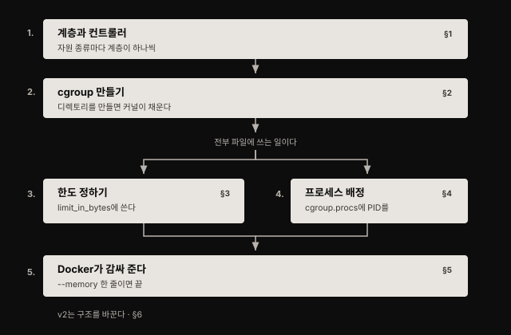
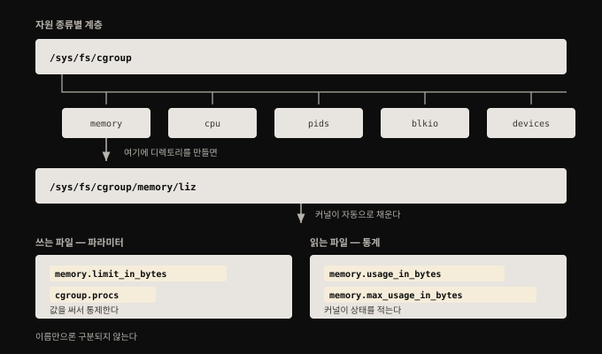
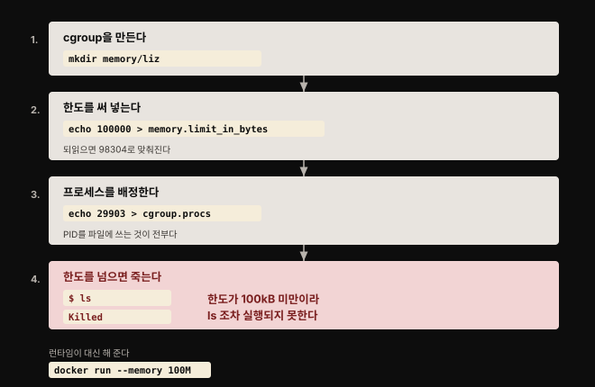
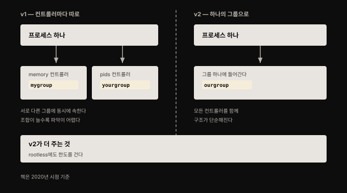

# Control Group — 자원을 제한해 굶기기를 막다

## 핵심 요약

> cgroup은 **한 프로세스가 자원을 독차지해 다른 프로세스를 굶기지 못하게 막는 장치**입니다. 컨테이너를 이루는 근본 building block 중 하나이며, 보안 관점에서는 자원 고갈 공격에 대한 방어선입니다.
>
> 다루는 방식이 놀랄 만큼 단순합니다. 커널이 cgroup 정보를 의사 파일시스템으로 노출하므로, **cgroup을 만드는 일은 디렉토리를 만드는 일이고 한도를 거는 일은 파일에 숫자를 쓰는 일이며 프로세스를 배정하는 일은 파일에 PID를 쓰는 일**입니다. Docker 같은 런타임은 이 과정을 명령줄 옵션 하나로 감싸 줄 뿐, 바닥에서 일어나는 일은 같습니다.


## 학습 목표

이 내용을 읽고 나면:

1. cgroup이 무엇을 제한하며 보안상 어떤 공격을 막아 주는지 설명할 수 있습니다.
2. cgroup 계층과 컨트롤러의 관계를 설명하고 `/sys/fs/cgroup` 아래 구조를 읽을 수 있습니다.
3. cgroup을 만들고 한도를 걸고 프로세스를 배정하는 세 동작을 파일 조작으로 재현할 수 있습니다.
4. Docker의 `--memory` 옵션이 실제로 무엇을 하는지 cgroup 파일 수준에서 설명할 수 있습니다.
5. cgroups v1과 v2의 구조적 차이를 말하고 현재 지원 상황을 판단할 수 있습니다.




## 1. cgroup이 막아 주는 것 — 굶기기와 fork bomb

> cgroup은 프로세스 그룹이 쓸 수 있는 메모리·CPU·네트워크 입출력 같은 자원을 제한합니다.

보안 관점에서 잘 조율된 cgroup은 **한 프로세스가 자원을 독차지해 다른 프로세스의 동작에 영향을 주지 못하게** 보장합니다. CPU나 메모리를 전부 써서 다른 애플리케이션을 굶기는 상황이 그 예입니다.

`pid`라는 control group도 있는데, 한 control group 안에 허용되는 **프로세스 총 개수**를 제한합니다. 이것으로 fork bomb의 효력을 막을 수 있습니다.

> **fork bomb란**: 프로세스를 빠르게 만들고 그 프로세스가 또 프로세스를 만들어, 자원 사용이 기하급수로 늘어 결국 머신을 마비시키는 공격입니다.

4장에서 자세히 보겠지만 **컨테이너는 평범한 Linux 프로세스로 돕니다.** 그래서 cgroup을 그대로 써서 컨테이너마다 쓸 수 있는 자원을 제한할 수 있습니다. 2장에서 "컨테이너 안의 프로세스도 호스트에서 보이는 그냥 Linux 프로세스"라고 한 서술이 여기서도 그대로 작동합니다.


## 2. 계층과 컨트롤러 — 자원 종류마다 하나씩

> 관리 대상 자원 종류마다 control group의 계층이 있고, 각 계층은 cgroup 컨트롤러가 관리합니다.



어떤 Linux 프로세스든 **각 종류마다 하나씩의 cgroup에 속합니다.** 프로세스가 처음 만들어질 때는 부모의 cgroup을 물려받습니다.

커널은 cgroup 정보를 **의사 파일시스템(pseudofilesystem)** 을 통해 알려 주며, 보통 `/sys/fs/cgroup`에 자리합니다. 그 디렉토리를 나열하면 시스템에 있는 cgroup 종류가 보입니다. 저자의 예에서는 `blkio`·`cpu`·`cpuacct`·`cpuset`·`devices`·`freezer`·`hugetlb`·`memory`·`net_cls`·`net_prio`·`perf_event`·`pids`·`rdma`·`systemd`·`unified` 등이 나옵니다.

**cgroup 관리란 이 계층 안의 파일과 디렉토리를 읽고 쓰는 일**입니다. `memory` cgroup을 예로 보면 그 안에 수십 개의 파일이 있습니다. 일부는 우리가 값을 써서 cgroup을 조작하는 파일이고, 일부는 커널이 cgroup 상태에 대한 데이터를 적어 주는 파일입니다.

여기서 실무적으로 성가신 점이 하나 있습니다. **어느 것이 파라미터이고 어느 것이 정보인지 문서를 보지 않고는 바로 알 방법이 없습니다.** 다만 이름으로 어느 정도 짐작은 됩니다. `memory.limit_in_bytes`는 그룹 안의 프로세스가 쓸 수 있는 메모리 양을 정하는 쓰기 가능한 값입니다. `memory.max_usage_in_bytes`는 그룹 안에서 기록된 메모리 사용량의 최고점을 보고합니다.

`memory` 디렉토리 자체는 계층의 최상위입니다. 다른 cgroup이 없다면 여기가 실행 중인 모든 프로세스의 메모리 정보를 담습니다. **특정 프로세스의 메모리 사용을 제한하려면 새 cgroup을 만들고 그 프로세스를 거기 배정해야 합니다.**


## 3. cgroup 만들기 — 디렉토리를 만들면 커널이 채운다

> `memory` 디렉토리 안에 하위 디렉토리를 만드는 것이 곧 cgroup을 만드는 것입니다.

```bash
mkdir memory/liz
ls memory/liz/
```

디렉토리를 만들면 **커널이 그 안을 cgroup의 파라미터와 통계를 나타내는 파일들로 자동으로 채웁니다.** 각 파일의 의미를 전부 다루는 것은 책의 범위 밖입니다. 다만 이름으로 짐작할 수 있는 것들이 있습니다. `memory.usage_in_bytes`는 그 control group이 현재 쓰고 있는 메모리를 알려 줍니다. 쓸 수 있는 최대치는 `memory.limit_in_bytes`가 정합니다.

**컨테이너를 시작하면 런타임이 그 컨테이너를 위한 새 cgroup들을 만듭니다.** 호스트에서 이것을 보려면 `lscgroup` 유틸리티를 쓸 수 있습니다. Ubuntu에서는 `cgroup-tools` 패키지로 설치합니다. cgroup이 워낙 많으므로, 저자는 컨테이너 시작 전후의 memory cgroup만 비교하는 방법을 씁니다.

```bash
lscgroup memory:/ > before.memory
sudo runc run sh
lscgroup memory:/ > after.memory
diff before.memory after.memory
```

차이로 나타나는 한 줄이 새로 생긴 컨테이너의 cgroup입니다. 이 계층은 관례적으로 `/sys/fs/cgroup/memory`에 위치하는 memory cgroup의 루트를 기준으로 한 상대 경로입니다.

컨테이너 **안에서는** 자기 cgroup 목록을 `/proc` 디렉토리에서 볼 수 있습니다.

```bash
cat /proc/$$/cgroup
```

여기서 확인되는 memory cgroup이 **호스트에서 본 것과 정확히 같습니다.** 컨테이너 안과 밖에서 같은 것을 보고 있다는 사실이, 컨테이너가 별도의 무엇이 아니라 호스트 커널의 cgroup에 배정된 평범한 프로세스라는 점을 다시 확인해 줍니다.

경로에 보이는 `user.slice/user-1000` 부분은 systemd와 관련이 있습니다. systemd가 자기 방식의 자원 통제를 위해 일부 cgroup 계층을 자동으로 만들기 때문입니다.


## 4. 한도 걸기와 프로세스 배정 — 전부 파일에 쓰는 일

> 한도를 정하는 것도 프로세스를 배정하는 것도, 해당 파일에 값을 써 넣는 것이 전부입니다.



cgroup에 얼마의 메모리가 허용돼 있는지는 `memory.limit_in_bytes` 파일을 읽어 보면 됩니다. 기본값은 제한이 없는 상태라 `9223372036854771712` 같은 거대한 숫자가 나오는데, 저자가 예제를 만든 가상머신이 쓸 수 있는 전체 메모리를 나타냅니다.

**프로세스가 무제한으로 메모리를 쓰도록 허용되면 같은 호스트의 다른 프로세스를 굶길 수 있습니다.** 애플리케이션의 메모리 누수 때문에 의도치 않게 벌어질 수도 있습니다. 아니면 그 누수를 이용해 일부러 최대한 많은 메모리를 쓰는 **자원 고갈 공격**의 결과일 수도 있습니다. 한 프로세스가 접근할 수 있는 메모리와 다른 자원에 한도를 걸면 이런 공격의 영향을 줄이고 다른 프로세스가 정상적으로 계속 돌게 할 수 있습니다.

### runc 설정으로 한도 걸기

`runc`의 런타임 번들에 있는 `config.json`을 고치면, 컨테이너를 만들 때 cgroup에 배정할 메모리를 제한할 수 있습니다. cgroup 한도는 `config.json`의 `linux:resources` 절에 설정합니다.

```json
{
  "linux": {
    "resources": {
      "memory": {
        "limit": 1000000
      }
    }
  }
}
```

새 설정이 반영되려면 컨테이너를 멈추고 `runc` 명령을 다시 돌려야 합니다. 그러면 `memory.limit_in_bytes` 파라미터가 설정한 값과 거의 같아집니다. 저자의 예에서 `1000000`을 설정하니 `999424`가 나오는데, **가장 가까운 kB 단위로 맞춰진 결과**로 보입니다. 이 값을 바꾼 주체는 `runc`입니다.

### 손으로 직접 해 보기

한도를 정하는 것도, 프로세스를 배정하는 것도 파일에 쓰는 일입니다.

```bash
echo 100000 > memory.limit_in_bytes
cat memory.limit_in_bytes
```

`100000`을 썼는데 되읽으면 `98304`가 나옵니다. 페이지 단위로 맞춰진 결과입니다. 프로세스 배정도 마찬가지로 **프로세스 ID를 `cgroup.procs` 파일에 써 넣으면** 끝입니다.

```bash
echo 29903 > cgroup.procs
cat cgroup.procs
```

이제 그 셸은 이 cgroup의 구성원이고 메모리가 100kB가 채 안 되게 제한됩니다. 이것은 갖고 놀기에 너무 적은 양이라, **셸 안에서 `ls`를 실행하는 것만으로도 한도를 넘습니다.**

```bash
ls
```

돌아오는 것은 출력이 아니라 `Killed` 한 줄입니다.

**메모리 한도를 넘으려 하면 프로세스가 죽습니다.** 이 한 줄이 cgroup이 실제로 강제력을 갖는다는 것을 보여 줍니다.


## 5. Docker가 감싸 주는 것

> Docker는 cgroup을 직접 만들고 관리하지만, 우리가 보는 것은 명령줄 옵션 하나입니다.

Docker는 각 종류의 cgroup을 자동으로 만듭니다. cgroup 계층 안에서 `docker`라는 이름의 디렉토리를 찾으면 보입니다. 컨테이너를 시작하면 그 `docker` cgroup 안에 또 한 벌의 cgroup이 만들어지며, **cgroup 이름으로 컨테이너 ID를 씁니다.**

```bash
docker run --rm --memory 100M -d alpine sleep 10000
```

이렇게 띄운 뒤 `memory/docker/<컨테이너 ID>/memory.limit_in_bytes`를 읽으면 `104857600`이 나옵니다. 100M을 바이트로 환산한 값입니다. 같은 디렉토리의 `cgroup.procs`를 읽으면 그 안에서 도는 `sleep` 프로세스의 PID가 들어 있어, **호스트에서 `ps`로 확인한 프로세스와 같다는 것**을 대조할 수 있습니다.

앞 절에서 손으로 한 일과 정확히 같은 일이 벌어지고 있습니다. 차이는 우리가 파일을 직접 만지는 대신 `--memory 100M`이라는 옵션 하나를 줬다는 것뿐입니다.

> **주의 — Docker Desktop에서는 재현되지 않습니다.** 이 예제들을 따라 하려면 Linux(가상)머신에서 Docker를 직접 돌려야 합니다. Docker for Mac/Windows를 쓴다면 Docker가 가상머신 안에서 도는데, 5장에서 보듯 Docker 데몬과 컨테이너가 그 가상머신 안의 **별도 커널**을 쓰기 때문에 호스트에서 이 cgroup들을 볼 수 없습니다.


## 6. cgroups v2 — 구조가 바뀐다

> v2의 가장 큰 차이는 한 프로세스가 컨트롤러마다 다른 그룹에 속할 수 없게 됐다는 것입니다.



cgroups 버전 2는 2016년부터 Linux 커널에 들어 있었고, Fedora가 2019년 중반에 처음으로 cgroups v2를 기본값으로 삼은 배포판이 됐습니다.

구조의 차이는 이렇습니다. **v1에서는** 한 프로세스가 `/sys/fs/cgroup/memory/mygroup`과 `/sys/fs/cgroup/pids/yourgroup`에 동시에 속할 수 있었습니다. 컨트롤러마다 다른 그룹을 고를 수 있었다는 뜻입니다. **v2에서는** 더 단순합니다. 프로세스가 `/sys/fs/cgroup/ourgroup` 하나에 들어가고, `ourgroup`에 걸린 **모든 컨트롤러의 통제를 함께 받습니다.**

cgroups v2는 **rootless 컨테이너 지원도 더 낫습니다.** 그래서 rootless 컨테이너에도 자원 한도를 걸 수 있습니다.

> **원문 정오 — 런타임 지원 현황이 역전됐습니다.** 원문은 집필 시점(2020년) 기준으로 "가장 널리 쓰이는 컨테이너 런타임 구현들이 cgroups v1을 전제하며 v2를 지원하지 않는다(다만 작업이 진행 중)"고 적었습니다. **이 서술은 현재 유효하지 않습니다.** 지금은 v2가 표준이고 오히려 v1이 물러나는 중입니다. 상세는 아래 심화 학습에 정리했습니다.


## 심화 학습

> 여기부터는 책 밖의 보강입니다. 원문의 cgroups v2 서술이 2020년 스냅숏이라 현재 상태를 공식 자료로 확인했습니다.

**런타임 지원은 원문 집필 직후 빠르게 갖춰졌습니다.** runc는 v1.0.0-rc93부터 cgroup v2를 완전히 지원합니다.[^runc] Docker Engine은 20.10에서 cgroups v2 지원을 추가했고, 이때 rootless가 정식 기능으로 승격됐습니다. 원문이 "작업이 진행 중"이라고 적은 그 작업이 완료된 셈입니다.

**Kubernetes에서는 v2가 이미 GA이고 v1이 사용 중단됐습니다.** cgroup v2 지원은 **Kubernetes v1.25에서 stable(GA)** 이 됐습니다.[^k8scgroup] 요구 사항은 Linux 커널 5.8 이상, containerd v1.4 이상 또는 CRI-O v1.20 이상이며, kubelet과 런타임이 systemd cgroup 드라이버를 쓰도록 설정돼야 합니다.

더 중요한 변화가 있습니다. **cgroup v1은 Kubernetes v1.35에서 사용 중단(deprecated)됐습니다.** 기본적으로 kubelet이 cgroup v1 노드에서 시작하지 않으며, 관리자가 kubelet 설정의 `failCgroupV1: false`로 이 동작을 끌 수 있습니다. 원문이 "v2는 아직 이르다"고 적은 지점에서 현재는 정반대로 "v1이 곧 못 쓰게 된다"가 된 것입니다.

자기 시스템이 어느 버전을 쓰는지는 한 줄로 확인됩니다.

```bash
stat -fc %T /sys/fs/cgroup/
```

출력이 `cgroup2fs`면 v2이고 `tmpfs`면 v1입니다. 배포판 기준으로는 Ubuntu 21.10 이상(22.04 이상 권장), Debian 11 bullseye 이상, Fedora 31 이상, RHEL 9 이상이 v2를 기본으로 씁니다.

> **학습 시 유의점**: 원문의 실습은 v1 경로(`/sys/fs/cgroup/memory/...`)를 전제합니다. 요즘 배포판에서 그대로 따라 하면 경로가 없거나 파일 이름이 달라 재현되지 않을 수 있습니다. v2에서는 계층이 통합되고 파일 이름도 `memory.max` 같은 형태로 바뀌었습니다. **개념(디렉토리가 곧 cgroup, 파일 쓰기가 곧 설정)은 그대로 유효하지만 경로와 파일명은 v2 문서를 따로 확인해야 합니다.**


## 결정 치트시트

> 자원 한도를 어떻게 걸지 판단할 때 씁니다.

| 상황 | 선택 | 이유 |
|------|------|------|
| 컨테이너 앱을 운영에 올린다 | 메모리와 CPU 한도를 반드시 설정 | 저자의 명시적 권고입니다. 자원 고갈로 정상 앱이 굶는 것을 막습니다 |
| fork bomb 류의 공격이 걱정된다 | `pid` cgroup으로 프로세스 개수 제한 | 프로세스 수 자체를 막아야 기하급수 증식을 끊습니다 |
| 메모리 누수가 있는 앱을 돌려야 한다 | 메모리 한도를 걸어 격리 | 누수가 호스트 전체를 마비시키지 못하게 가둡니다 |
| 한도가 실제로 걸렸는지 확인하고 싶다 | cgroup 파일을 직접 읽어 대조 | 런타임이 쓴 값이 파일에 그대로 보입니다 |
| Docker Desktop에서 cgroup 실습이 안 된다 | Linux VM에서 직접 실행 | 별도 커널 안에서 돌기 때문에 호스트에서 안 보입니다 |
| 지금 시스템의 cgroup 버전을 모르겠다 | `stat -fc %T /sys/fs/cgroup/` | `cgroup2fs`면 v2, `tmpfs`면 v1입니다 |
| 새로 클러스터를 구성한다 | cgroup v2 전제로 | K8s 1.25에서 GA, 1.35에서 v1이 사용 중단됐습니다 |


## 면접에서 받을 만한 질문

1. cgroup은 무엇을 제한하며 보안 관점에서 어떤 공격을 막나요?
2. cgroup을 만들고 프로세스를 배정하는 과정을 설명해 보세요.
3. `docker run --memory 100M`은 실제로 무슨 일을 하나요?
4. cgroups v1과 v2의 가장 큰 구조적 차이는 무엇인가요?
5. 컨테이너에 자원 한도를 걸지 않으면 어떤 일이 벌어질 수 있나요?


## 정답 (자답 후 펼치기)

1. cgroup은 프로세스 그룹이 쓸 수 있는 메모리·CPU·네트워크 입출력 같은 자원을 제한합니다. 보안 관점에서는 한 프로세스가 자원을 독차지해 다른 프로세스를 굶기는 자원 고갈 공격을 막습니다. `pid` cgroup으로 프로세스 개수를 제한하면 fork bomb의 효력도 막을 수 있습니다.
2. 커널이 cgroup을 의사 파일시스템으로 노출하므로 전부 파일 조작입니다. `/sys/fs/cgroup/memory` 아래에 디렉토리를 만들면 그것이 cgroup이 되고 커널이 파라미터·통계 파일로 채웁니다. 한도는 `memory.limit_in_bytes`에 숫자를 써서 걸고, 프로세스는 PID를 `cgroup.procs`에 써서 배정합니다. 한도를 넘으면 커널이 프로세스를 죽입니다.
3. 컨테이너 ID를 이름으로 하는 cgroup을 `memory/docker/` 아래에 만들고, 그 안의 `memory.limit_in_bytes`에 104857600(100M을 바이트로 환산한 값)을 씁니다. 그리고 컨테이너 프로세스의 PID를 그 cgroup의 `cgroup.procs`에 넣습니다. 손으로 하는 일을 옵션 하나로 감싼 것입니다.
4. v1에서는 한 프로세스가 컨트롤러마다 다른 그룹에 속할 수 있었습니다. 메모리는 `mygroup`, 프로세스 수는 `yourgroup` 식입니다. v2에서는 프로세스가 하나의 그룹에 들어가고 그 그룹의 모든 컨트롤러 통제를 함께 받습니다. v2는 rootless 컨테이너 지원도 낫습니다. 책은 2020년 기준으로 런타임 지원이 부족하다고 했지만, 현재는 runc 1.0.0-rc93 이후 완전 지원이고 Kubernetes에서는 1.25에서 GA, 1.35에서 v1이 사용 중단됐습니다.
5. 메모리 누수가 있는 앱이나 자원 고갈 공격이 호스트의 자원을 전부 소진해 같은 호스트의 다른 프로세스를 굶길 수 있습니다. 저자는 컨테이너 앱을 돌릴 때 메모리와 CPU 한도를 설정하라고 권고합니다.


## 핵심 개념 체크리스트

- [ ] cgroup이 제한하는 자원의 종류를 말할 수 있는가?
- [ ] fork bomb을 `pid` cgroup으로 막는 원리를 아는가?
- [ ] 계층과 컨트롤러의 관계를 설명할 수 있는가?
- [ ] `/sys/fs/cgroup`이 의사 파일시스템이라는 것이 무슨 뜻인지 아는가?
- [ ] 파라미터 파일과 통계 파일을 구분하는 방법을 아는가?
- [ ] cgroup 생성·한도 설정·프로세스 배정을 명령으로 재현할 수 있는가?
- [ ] 컨테이너 안과 밖에서 본 cgroup이 같다는 사실의 의미를 아는가?
- [ ] v1과 v2의 차이를 한 문장으로 말할 수 있는가?
- [ ] 현재 자기 시스템의 cgroup 버전을 확인하는 방법을 아는가?


## 참고 자료

- 원본: 《Container Security》(Liz Rice, O'Reilly, 2020, ISBN 978-1492056706) Chapter 3
- [Kubernetes — About cgroup v2](https://kubernetes.io/docs/concepts/architecture/cgroups/) — v2 GA 버전·요구 사항·v1 사용 중단의 1차 자료
- [runc — cgroup v2 문서](https://github.com/opencontainers/runc/blob/main/docs/cgroup-v2.md) — 런타임의 v2 지원 현황
- [Linux 시스템 콜·권한·capability — 컨테이너 보안의 바닥](./02-01.Linux%20%EC%8B%9C%EC%8A%A4%ED%85%9C%20%EC%BD%9C%C2%B7%EA%B6%8C%ED%95%9C%C2%B7capability%20%E2%80%94%20%EC%BB%A8%ED%85%8C%EC%9D%B4%EB%84%88%20%EB%B3%B4%EC%95%88%EC%9D%98%20%EB%B0%94%EB%8B%A5.md) — 컨테이너가 평범한 Linux 프로세스라는 전제를 공유하는 앞 장
- [Predictable Demands — 자원 요구를 선언해 스케줄러에 알리기](../kubernetes-patterns/02-01.Predictable%20Demands%20%E2%80%94%20%EC%9E%90%EC%9B%90%20%EC%9A%94%EA%B5%AC%EB%A5%BC%20%EC%84%A0%EC%96%B8%ED%95%B4%20%EC%8A%A4%EC%BC%80%EC%A4%84%EB%9F%AC%EC%97%90%20%EC%95%8C%EB%A6%AC%EA%B8%B0.md) — 이 한도를 Kubernetes에서 선언으로 다루는 패턴
- [Container Security 정독 인덱스](./README.md) — 이 책의 장별 목표와 진행 상태

[^runc]: opencontainers/runc — cgroup v2 문서. runc는 v1.0.0-rc93부터 cgroup v2(통합 모드)를 지원하며, cgroup v2 호스트에서는 systemd cgroup 드라이버 사용이 권장됩니다.
<https://github.com/opencontainers/runc/blob/main/docs/cgroup-v2.md>

[^k8scgroup]: Kubernetes 공식 문서 — About cgroup v2. cgroup v2 지원은 Kubernetes v1.25에서 stable이며, cgroup v1은 v1.35에서 사용 중단됐습니다.
<https://kubernetes.io/docs/concepts/architecture/cgroups/>
