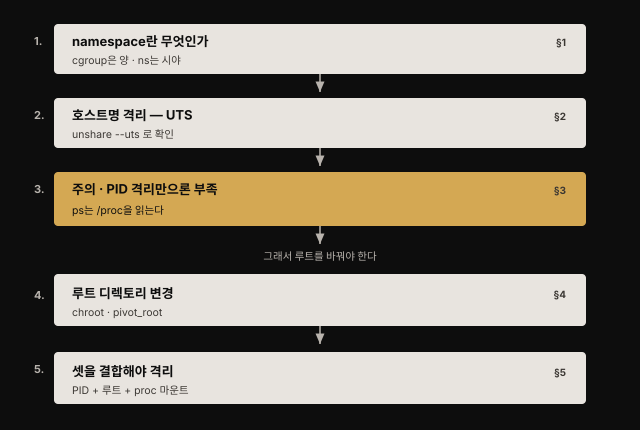
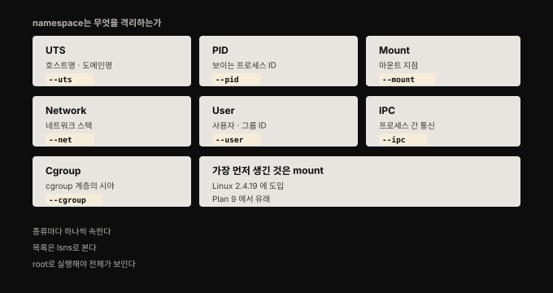
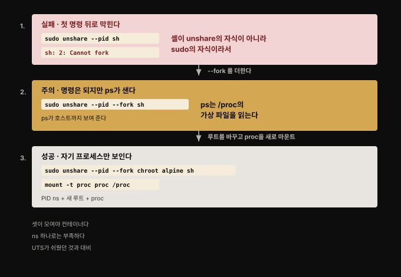
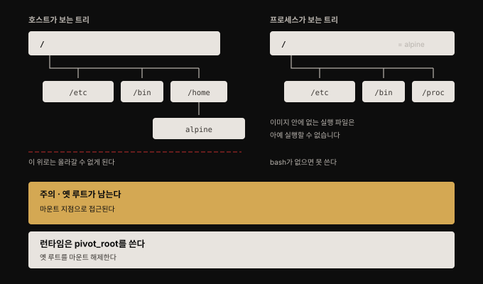

# namespace와 루트 디렉토리 — 격리를 만드는 두 장치
---

## 핵심 요약

> **cgroup이 "얼마나 쓸 수 있는가"를 정한다면 namespace는 "무엇을 볼 수 있는가"를 정합니다.** 이 장은 컨테이너가 실제로 어떻게 동작하는지 밝히는 장이고, 그 답은 평범한 Linux 기능 몇 개의 조합입니다.
>
> 핵심 교훈은 **격리가 장치 하나로 완성되지 않는다**는 것입니다. 호스트명 격리는 UTS namespace 하나로 끝나지만, 프로세스 격리는 PID namespace만으로는 되지 않습니다. `ps`가 `/proc`을 읽기 때문에 루트 디렉토리를 바꿔 자기만의 `/proc`을 갖고 그것을 마운트해야 비로소 컨테이너처럼 보입니다. 이 조합의 미묘함이 곧 보안 취약점의 틈이 되기도 합니다.


## 학습 목표

이 편을 읽고 나면 다음을 할 수 있습니다.

1. cgroup과 namespace가 각각 무엇을 통제하는지 구분해 설명할 수 있습니다.
2. Linux가 지원하는 namespace 종류를 열거하고 각각이 격리하는 대상을 짚을 수 있습니다.
3. `unshare`로 UTS·PID namespace를 만들어 격리를 직접 확인할 수 있습니다.
4. PID namespace만으로 `ps` 출력이 격리되지 않는 이유를 `/proc` 구조로 설명할 수 있습니다.
5. `chroot`와 `pivot_root`의 차이를 보안 관점에서 비교할 수 있습니다.



이 장을 읽고 나면 **컨테이너를 둘러싼 보안 경계의 강도를 스스로 평가할 수 있게** 됩니다. 1장에서 "컨테이너는 그 자체로 보안 경계"라고 했던 서술의 실제 재료가 여기서 드러납니다.


## 1. namespace란 무엇인가

> cgroup이 프로세스가 쓸 수 있는 자원을 통제한다면, namespace는 프로세스가 볼 수 있는 것을 통제합니다. 프로세스를 namespace에 넣으면 그 프로세스에게 보이는 자원을 제한할 수 있습니다.



namespace의 기원은 **Plan 9 운영체제**로 거슬러 올라갑니다. 당시 운영체제들은 파일에 대한 이름 공간을 하나만 두었습니다. Unix 계열도 파일시스템을 마운트할 수는 있었지만, 그 마운트가 전부 시스템 전체가 공유하는 하나의 파일명 뷰로 흘러들었습니다.

Plan 9가 이 전제를 깼습니다. 프로세스마다 자기만의 이름 공간을 가진 그룹에 속하고, 그룹마다 볼 수 있는 파일 계층이 따로 있었습니다. 각 그룹은 **서로를 보지 못한 채** 자기 파일시스템을 마운트했습니다.

Linux 커널에 첫 namespace가 들어온 것은 **2002년 버전 2.4.19**이며, 그것이 mount namespace였습니다. Plan 9의 기능을 따른 것입니다. 오늘날 Linux가 지원하는 namespace는 여러 종류입니다.

- **UTS(Unix Timesharing System)**: 이름은 복잡해 보이지만 실질적으로는 프로세스가 인식하는 **호스트명과 도메인명**에 관한 것입니다
- **Process ID**: 보이는 프로세스 ID
- **Mount points**: 마운트 지점
- **Network**: 네트워크 스택
- **User and group IDs**: 사용자와 그룹 ID
- **IPC**: 프로세스 간 통신
- **Control groups(cgroups)**: cgroup 계층의 시야

앞으로 커널 개정판에서 더 많은 자원이 namespace화될 수 있습니다. 저자는 집필 시점에 시간(time)에 대한 namespace 논의가 있었다고 적어 두었습니다.

**프로세스는 종류마다 정확히 하나의 namespace에 속합니다.** Linux 시스템이 막 뜬 시점에는 종류별로 namespace가 하나씩만 있습니다. 여기에 새 namespace를 만들어 프로세스를 옮겨 담는 것이 격리의 출발점입니다. 현재 목록은 `lsns` 명령으로 봅니다.

```bash
lsns
sudo lsns
```

여기에 함정이 하나 있습니다. `lsns`의 man 페이지는 이 명령이 "`/proc` 파일시스템에서 정보를 직접 읽으며 비root 사용자에게는 불완전한 정보를 반환할 수 있다"고 밝힙니다. 실제로 root로 돌리면 **비root에게는 안 보이던 mount namespace들과 훨씬 많은 프로세스가 나타납니다.** 그러므로 `lsns`로 전체 그림을 보려면 root로 실행해야 합니다.


## 2. 호스트명 격리 — 가장 쉬운 예

> UTS namespace에 프로세스를 넣으면, 그 프로세스가 도는 머신의 호스트명과 무관하게 그 프로세스만의 호스트명을 가질 수 있습니다.

대부분의 컨테이너 시스템은 컨테이너마다 무작위 ID를 주고 **기본적으로 그 ID를 호스트명으로 씁니다.** Docker로 확인할 수 있습니다.

```bash
docker run --rm -it --name hello ubuntu bash
hostname
```

컨테이너 안에서 `hostname`을 실행하면 `cdf75e7a6c50` 같은 컨테이너 ID가 나옵니다. 여기서 눈여겨볼 점이 있습니다. **Docker에서 `--name hello`로 이름을 줘도 그 이름이 호스트명으로 쓰이지는 않습니다.**

컨테이너가 자기 호스트명을 가질 수 있는 이유는 Docker가 컨테이너를 만들 때 **자기만의 UTS namespace와 함께** 만들었기 때문입니다. 같은 일을 `unshare` 명령으로 직접 해 볼 수 있습니다.

`unshare`의 man 페이지는 이 명령이 "부모로부터 일부 namespace를 unshare한 채로 프로그램을 실행"하게 해 준다고 설명합니다. 한 겹씩 풀어 보겠습니다.

프로그램을 실행하면 커널이 새 프로세스를 만들어 그 안에서 프로그램을 돌립니다. 이 일은 지금 돌고 있는 프로세스의 맥락에서 벌어지고, 그쪽을 부모, 새로 생긴 쪽을 자식이라 부릅니다. **여기서 "unshare"란 자식이 부모의 namespace를 물려받는 대신 자기 것을 갖는다는 뜻입니다.**

```bash
sudo unshare --uts sh
hostname
hostname experiment
hostname
exit
hostname
```

이 명령은 새 UTS namespace 안에서 `sh` 셸을 띄웁니다. 그 셸에서 실행하는 프로그램은 같은 namespace를 물려받습니다. `hostname experiment`로 이름을 바꾸고 다시 확인하면 `experiment`가 나옵니다. 그런데 **`exit`으로 빠져나와 확인하면 호스트는 원래 이름 그대로입니다.** 반대 방향도 막혀 있습니다. 호스트의 호스트명을 바꿔도 namespace 안 프로세스가 보는 이름은 꿈쩍하지 않습니다.

이것이 컨테이너 동작 방식의 핵심 구성 요소입니다. namespace는 컨테이너에 **호스트 머신 및 다른 컨테이너와 독립적인 자원 집합**을 줍니다. 다만 잊지 말아야 할 것이 있습니다. **여전히 같은 Linux 커널이 실행하는 프로세스**라는 점이고, 여기에 보안 함의가 따릅니다.


## 3. 프로세스 ID 격리 — 한 장치로는 안 된다

> Docker 컨테이너 안에서 `ps`를 돌리면 그 컨테이너 안의 프로세스만 보이고 호스트의 프로세스는 보이지 않습니다. 그런데 이것을 직접 재현하려면 예상보다 여러 단계가 필요합니다.



### 첫 시도 — fork가 안 된다

`unshare`에 `--pid` 플래그를 주고 시작해 봅니다.

```bash
sudo unshare --pid sh
whoami
whoami
```

첫 `whoami`는 동작합니다. 그런데 **그다음 명령부터는 전부 `Cannot fork` 오류로 실패합니다.** 실패한 실험처럼 보이지만, 오류 메시지 자체가 단서를 줍니다. 오류는 `<명령>: <프로세스 ID>: <메시지>` 형태로 찍히는데 **프로세스 ID가 매번 하나씩 올라갑니다.** 거꾸로 세어 보면 첫 `whoami`가 프로세스 ID 1이었다는 뜻입니다. **번호가 1부터 다시 시작했다는 것은 PID namespace가 이미 만들어졌다는 증거입니다.** 다만 프로세스를 하나밖에 못 돌리니 이대로는 쓸모가 없습니다.

원인의 단서는 `unshare` man 페이지의 `--fork` 플래그 설명에 있습니다. "지정한 프로그램을 직접 실행하는 대신 unshare의 자식 프로세스로 fork한다. 새 pid namespace를 만들 때 유용하다."

다른 터미널에서 프로세스 계층을 보면 확인됩니다. **`sh` 프로세스가 `unshare`의 자식이 아니라 `sudo`의 자식**입니다.

### 두 번째 시도 — 명령은 되는데 ps가 샌다

`--fork`를 더하면 진전이 있습니다.

```bash
sudo unshare --pid --fork sh
```

이제 `Cannot fork` 오류 없이 여러 명령을 돌릴 수 있고, 프로세스 계층에서도 `sh`가 `unshare`의 자식으로 붙습니다. 그런데 자기만의 PID namespace 안에 있는 셸에서 `ps`를 돌리면 결과가 놀랍습니다. **`ps`가 여전히 호스트 전체의 프로세스를 보여 줍니다.**

이유는 `ps`의 man 페이지에 있습니다. "이 `ps`는 `/proc`의 가상 파일을 읽어서 동작한다."

`/proc` 디렉토리를 보면 **숫자로 된 디렉토리 하나하나가 프로세스 ID에 대응**하고, 그 안에 그 프로세스에 대한 정보가 많이 들어 있습니다. 예를 들어 `/proc/<pid>/exe`는 그 프로세스에서 실행 중인 실행 파일을 가리키는 심볼릭 링크입니다.

여기서 이 절의 결론이 나옵니다. **어느 PID namespace에서 돌든 `ps`는 `/proc`을 들여다봅니다.** 그러니 `ps`에게 새 namespace의 프로세스만 보여 주려면 `/proc`부터 갈아 끼워야 합니다. 커널이 namespace화된 프로세스 정보를 채워 넣을 **별도의 `/proc`**이 필요하다는 뜻입니다. 그런데 `/proc`은 루트 바로 아래에 있습니다. 결국 **루트 디렉토리를 바꾸는 일**로 이어집니다.


## 4. 루트 디렉토리 변경 — chroot와 pivot_root

> 컨테이너 안에서는 호스트의 전체 파일시스템이 아니라 부분집합만 보입니다. 컨테이너가 만들어질 때 루트 디렉토리가 바뀌기 때문입니다.



Linux에서 루트 디렉토리는 `chroot` 명령으로 바꿉니다. 현재 프로세스의 루트 디렉토리를 파일시스템 안의 다른 위치로 옮기는 것입니다. `chroot`를 하고 나면 **파일 계층에서 현재 루트보다 위에 있던 것에 접근할 수 없게 됩니다.** 파일시스템에서 루트보다 위로 올라갈 방법이 없기 때문입니다.

`chroot`의 man 페이지는 이렇게 적습니다. "루트 디렉토리를 NEWROOT로 설정한 채 COMMAND를 실행한다. 명령을 주지 않으면 셸을 실행한다." 즉 **`chroot`는 디렉토리만 바꾸는 것이 아니라 명령도 실행하며**, 명령을 지정하지 않으면 셸로 돌아갑니다.

새 디렉토리를 만들어 그리로 `chroot`를 시도하면 실패합니다.

```bash
mkdir new_root
sudo chroot new_root
```

새 루트 안에 `bin` 디렉토리가 없으니 `/bin/bash` 셸을 실행할 수 없습니다. `ls`도 마찬가지로 없습니다. **실행하고 싶은 명령의 파일이 새 루트 안에 있어야 합니다.**

이것이 "진짜" 컨테이너에서 벌어지는 일과 정확히 같습니다. 컨테이너는 컨테이너 이미지로부터 인스턴스화되며 **그 이미지가 컨테이너가 보는 파일시스템을 담습니다.** 이미지 안에 실행 파일이 없으면 컨테이너는 그것을 찾아 실행할 수 없습니다.

저자는 컨테이너용으로 설계된 최소 배포판 **Alpine Linux**를 받아 압축을 풀고 그 디렉토리로 `chroot`하는 실습을 보입니다.

```bash
curl -o alpine.tar.gz http://dl-cdn.alpinelinux.org/alpine/v3.10/releases/x86_64/alpine-minirootfs-3.10.0-x86_64.tar.gz
tar xvf alpine.tar.gz
sudo chroot alpine ls
```

여기에 미묘한 점이 있습니다. **실행 파일이 새 프로세스의 경로(PATH) 안에 들어 있어야 합니다.** 새 프로세스는 부모의 환경을 물려받으니 `PATH`도 그대로 따라옵니다. 그리고 `alpine` 안의 `bin` 디렉토리는 이 프로세스에게 `/bin`으로 보입니다. `PATH`에 `/bin`이 들어 있다면 경로를 적지 않아도 `ls`를 찾아 씁니다.

**새 루트 디렉토리를 받는 것은 자식 프로세스뿐입니다.** 그 프로세스가 끝나면 제어는 부모로 돌아옵니다. 그래서 자식으로 셸을 띄우면 관찰하기 좋습니다. 셸은 곧바로 끝나지 않기 때문입니다.

Alpine 안에서는 `bash`가 동작하지 않습니다. Alpine에 `bash`가 아예 없어 새 루트 안에서 찾을 수 없기 때문입니다. `bash`를 담고 있는 Ubuntu 같은 배포판의 파일시스템으로 같은 실습을 하면 잘 됩니다.

### chroot 대신 pivot_root를 쓰는 이유

> **보안상 중요한 구분입니다.** 저자는 이 장에서 `chroot`가 더 단순하고 익숙해서 예제에 썼지만, 실제 컨테이너 런타임의 소스 코드를 보면 `pivot_root`를 쓰게 될 것이라고 밝힙니다.

`chroot` 외에 `pivot_root`라는 시스템 콜이 있습니다. 이 장이 말하려는 바만 놓고 보면 둘 중 무엇을 쓰는지는 구현 세부입니다. **컨테이너가 자기만의 루트 디렉토리를 가져야 한다는 점이 핵심**이기 때문입니다. 그러나 보안 관점으로 넘어가면 이야기가 달라집니다.

**`pivot_root`가 `chroot`보다 안전합니다.** 갈리는 지점은 mount namespace를 쓰느냐입니다. `pivot_root`는 옛 루트를 마운트 해제하므로 **그 mount namespace 안에서는 옛 루트에 닿을 길이 사라집니다.** `chroot`는 그렇게 하지 않습니다. **옛 루트가 마운트 지점을 통해 여전히 접근 가능한 채로 남습니다.**


## 5. 셋을 결합해야 격리가 된다

> namespace와 루트 변경을 따로 봤지만, 새 namespace 안에서 `chroot`를 실행해 둘을 결합할 수 있습니다.

```bash
sudo unshare --pid --fork chroot alpine sh
```

3절에서 본 대로, 컨테이너에 자기 루트 디렉토리를 주면 **호스트의 `/proc`과 독립적인 `/proc` 디렉토리를 만들 수 있습니다.** 여기에 프로세스 정보가 채워지려면 `proc` 타입의 의사 파일시스템으로 마운트해야 합니다.

```bash
mount -t proc proc /proc
ps
```

**PID namespace와 독립적인 `/proc` 디렉토리의 조합으로, 이제 `ps`가 그 PID namespace 안의 프로세스만 보여 줍니다.**

저자의 정리가 이 절의 핵심입니다. 호스트명 격리에 견주면 훨씬 번거로운 과정이었습니다. 그러나 결국 **세 가지를 겹쳐 놓으면** 컨테이너가 자기 프로세스만 보게 됩니다.

1. PID namespace를 만든다
2. 루트 디렉토리를 바꾼다
3. 그 안에 `proc` 의사 파일시스템을 마운트한다

### mount namespace

보통은 컨테이너가 호스트와 똑같은 파일시스템 마운트를 전부 갖기를 원하지 않습니다. **컨테이너에 자기 mount namespace를 주면** 그렇게 됩니다.

```bash
sudo unshare --mount sh
mkdir source target
mount --bind source target
```

bind 마운트가 걸리면 원본 디렉토리의 내용이 대상에서도 보입니다. 이 마운트는 **호스트 관점에서는 보이지 않습니다.** 다른 터미널에서 같은 명령을 돌려 보면 확인됩니다.

여기서 3절과 똑같은 문제가 되풀이됩니다. mount namespace 안에서 마운트 목록을 뽑아 보면 호스트의 마운트가 잔뜩 딸려 나옵니다. **커널이 프로세스별 마운트 정보를 `/proc/<PID>/mounts`로 내주기 때문**입니다. 자기 mount namespace를 가졌더라도 호스트의 `/proc`을 그대로 보고 있으면 그 파일에 호스트 마운트가 전부 들어 있습니다.

그래서 완전히 격리된 마운트 집합을 주려면 **또 세 가지를 겹쳐야** 합니다. PID에서 배운 것과 같은 구조입니다.

1. 새 mount namespace를 만든다
2. 새 루트 파일시스템을 준다
3. 그 안에 `proc`을 새로 마운트한다

```bash
sudo unshare --mount chroot alpine sh
```

`docker run -v <호스트 디렉토리>:<컨테이너 디렉토리>`도 같은 원리로 동작합니다. 먼저 컨테이너의 루트 파일시스템이 자리를 잡습니다. 그다음 대상이 될 컨테이너 디렉토리를 만들고, 원본 호스트 디렉토리를 거기에 bind 마운트합니다. **컨테이너마다 자기 mount namespace를 가지므로, 이렇게 붙인 호스트 디렉토리는 다른 컨테이너에서 보이지 않습니다.**

> **정리 시 주의**: 호스트에서 보이는 마운트를 만들면 "컨테이너" 프로세스가 끝나도 자동으로 정리되지 않습니다. `umount`으로 직접 없애야 합니다. `/proc` 의사 파일시스템도 마찬가지라 `umount proc`으로 제거할 수 있습니다. 특별히 해롭지는 않지만 깔끔하게 유지하고 싶다면 정리합니다.


## 심화 학습

> 여기부터는 책 밖의 보강입니다. 원문의 커널 버전 서술을 공식 문서로 확인했습니다.

**mount namespace의 도입 시점은 커널 문서로 확인됩니다.** man7의 `mount_namespaces(7)`은 HISTORY 항목에 "Linux 2.4.19"라고 적어, 원문의 "첫 namespace는 2002년 커널 2.4.19에 들어온 mount namespace"라는 서술과 일치합니다.[^mountns] 같은 문서는 마운트 전파를 다루는 shared subtree 기능이 이후 Linux 2.6.15에서 추가됐다고 밝힙니다.

**namespace 종류를 확인할 때 주의할 점이 하나 있습니다.** `namespaces(7)` 문서에는 종류마다 `/proc/[pid]/ns/*` 파일이 언제부터 생겼는지가 적혀 있습니다. 그런데 이 버전은 **namespace 자체가 도입된 시점이 아닙니다.** mount namespace가 그 예입니다. 핸들 파일은 Linux 3.8부터지만, mount namespace 자체는 2.4.19부터 있었습니다. 버전을 인용할 때 둘을 섞지 않아야 합니다.

**저자가 안내한 Go 구현 실습이 있습니다.** 이 장의 예제는 셸 명령으로 컨테이너를 만들지만, Go 언어로 같은 것을 만들어 보고 싶다면 저자의 저장소에 안내가 있습니다.[^scratch] 셸로 한 단계를 시스템 콜 수준에서 다시 보게 되므로, 이 장의 조합 구조를 코드로 확인하기에 좋습니다.


## 결정 치트시트

> 이 편의 판단 기준입니다.

| 상황 | 선택 | 이유 |
|------|------|------|
| namespace 목록을 확인한다 | `sudo lsns` (root 필수) | 비root로는 불완전한 정보만 반환됩니다 |
| 새 PID namespace로 실습한다 | `unshare --pid --fork` | `--fork` 없이는 첫 명령 뒤로 `Cannot fork`가 납니다 |
| 컨테이너처럼 `ps`를 격리한다 | PID namespace + 새 루트 + `proc` 마운트 | `ps`가 `/proc`을 읽으므로 셋이 다 필요합니다 |
| 런타임을 구현하거나 읽는다 | `chroot`보다 `pivot_root` | 옛 루트가 마운트 해제돼 접근 경로가 남지 않습니다 |
| 컨테이너에 호스트 디렉토리를 넣는다 | bind 마운트 (`docker run -v`) | mount namespace 덕에 다른 컨테이너에는 안 보입니다 |
| 실습 후 마운트를 남기지 않는다 | `umount`으로 직접 정리 | 프로세스가 끝나도 자동 정리되지 않습니다 |
| 이미지에 없는 명령을 쓰려 한다 | 이미지를 바꾸거나 명령을 추가 | 새 루트 안에 없는 실행 파일은 실행할 수 없습니다 |


## 면접에서 받을 만한 질문

1. cgroup과 namespace의 차이를 한 문장으로 설명해 보세요.
2. `unshare --pid`만 줬을 때 두 번째 명령부터 실패하는 이유는 무엇인가요?
3. PID namespace를 만들었는데도 `ps`가 호스트 프로세스를 보여 주는 이유는 무엇인가요?
4. `chroot`와 `pivot_root`의 보안상 차이는 무엇인가요?
5. 컨테이너에 마운트한 호스트 디렉토리가 다른 컨테이너에 보이지 않는 이유는 무엇인가요?


## 정답

1. cgroup은 프로세스가 쓸 수 있는 자원의 양을 통제하고, namespace는 프로세스가 볼 수 있는 것을 통제합니다. 프로세스를 namespace에 넣으면 그 프로세스에게 보이는 자원이 제한됩니다.
2. 셸이 `unshare`의 자식이 아니라 `sudo`의 자식으로 실행되기 때문입니다. `--fork` 플래그를 주면 지정한 프로그램을 `unshare`의 자식 프로세스로 fork하며, man 페이지도 이것이 새 pid namespace를 만들 때 유용하다고 안내합니다. 참고로 실패 시 오류에 찍히는 프로세스 ID가 1부터 증가하는 것은 PID namespace 자체는 작동하고 있다는 단서입니다.
3. `ps`가 `/proc`의 가상 파일을 읽어서 동작하기 때문입니다. `/proc`의 숫자 디렉토리 하나하나가 프로세스 ID에 대응하는데, 새 PID namespace를 만들어도 호스트의 `/proc`을 그대로 보고 있으면 호스트 프로세스가 전부 보입니다. 커널이 namespace화된 프로세스 정보를 쓸 별도의 `/proc`이 필요하고, `/proc`은 루트 바로 아래이므로 루트 디렉토리를 바꿔야 합니다.
4. `pivot_root`는 mount namespace를 활용해 옛 루트를 마운트 해제하므로 그 mount namespace 안에서 옛 루트에 접근할 수 없습니다. `chroot`는 이 방식을 취하지 않아 옛 루트가 마운트 지점을 통해 여전히 접근 가능한 채로 남습니다. 그래서 실제 컨테이너 런타임 구현은 `pivot_root`를 씁니다.
5. 컨테이너마다 자기 mount namespace를 갖기 때문입니다. `docker run -v`는 컨테이너의 루트 파일시스템이 자리 잡은 뒤 대상 디렉토리를 만들고 호스트 디렉토리를 그 위에 bind 마운트하는데, 이 마운트는 그 컨테이너의 mount namespace 안에서만 보입니다.


## 핵심 개념 체크리스트

- [ ] cgroup과 namespace가 각각 무엇을 통제하는지 구분할 수 있는가?
- [ ] namespace의 기원이 Plan 9라는 것과 첫 도입 버전을 아는가?
- [ ] namespace 일곱 종류를 열거할 수 있는가?
- [ ] `lsns`를 root로 실행해야 하는 이유를 아는가?
- [ ] UTS namespace로 호스트명이 격리되는 것을 실습으로 확인할 수 있는가?
- [ ] `--fork`가 왜 필요한지 프로세스 계층으로 설명할 수 있는가?
- [ ] `ps`가 `/proc`을 읽는다는 사실이 왜 중요한지 아는가?
- [ ] `chroot` 후 이미지에 없는 명령이 실행되지 않는 이유를 아는가?
- [ ] `pivot_root`가 보안상 나은 이유를 말할 수 있는가?
- [ ] 격리에 여러 장치의 결합이 필요하다는 점을 예로 설명할 수 있는가?


## 참고 자료

- 원본: 《Container Security》(Liz Rice, O'Reilly, 2020, ISBN 978-1492056706) Chapter 4 전반부
- [mount_namespaces(7) — man7.org](https://man7.org/linux/man-pages/man7/mount_namespaces.7.html) — mount namespace 도입 커널 버전의 1차 자료
- [containers-from-scratch — 저자 저장소](https://github.com/lizrice/containers-from-scratch) — 같은 실습을 Go로 구현하는 안내
- [Control Group — 자원을 제한해 굶기기를 막다](./03-01.Control%20Group%20%E2%80%94%20%EC%9E%90%EC%9B%90%EC%9D%84%20%EC%A0%9C%ED%95%9C%ED%95%B4%20%EA%B5%B6%EA%B8%B0%EA%B8%B0%EB%A5%BC%20%EB%A7%89%EB%8B%A4.md) — 양을 통제하는 짝 장치
- [컨테이너의 탄생 — 앱 실행의 진화와 격리 프리미티브](../networking-and-kubernetes/03-01.%EC%BB%A8%ED%85%8C%EC%9D%B4%EB%84%88%EC%9D%98%20%ED%83%84%EC%83%9D%20%E2%80%94%20%EC%95%B1%20%EC%8B%A4%ED%96%89%EC%9D%98%20%EC%A7%84%ED%99%94%EC%99%80%20%EA%B2%A9%EB%A6%AC%20%ED%94%84%EB%A6%AC%EB%AF%B8%ED%8B%B0%EB%B8%8C.md) — 같은 프리미티브를 네트워킹 관점에서 다룬 짝 노트
- [Container Security 정독 인덱스](./README.md) — 이 책의 장별 목표와 진행 상태

[^mountns]: man7.org — mount_namespaces(7). HISTORY 항목에 mount namespace 도입 버전이 Linux 2.4.19로 적혀 있으며, shared subtree 기능은 Linux 2.6.15에서 추가됐습니다.
<https://man7.org/linux/man-pages/man7/mount_namespaces.7.html>

[^scratch]: Liz Rice — containers-from-scratch. 이 장의 셸 실습을 Go 코드로 구현하는 예제 저장소입니다.
<https://github.com/lizrice/containers-from-scratch>
